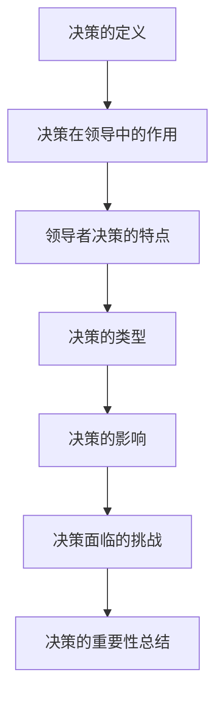
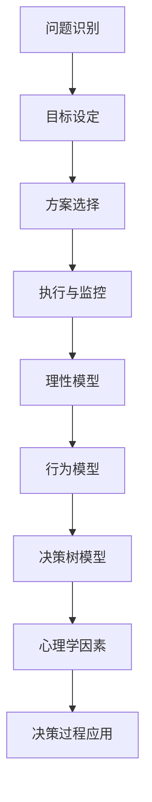

                 

### 决策的重要性

决策，作为领导者工作中不可或缺的一部分，其重要性不言而喻。无论是在企业运营、项目规划，还是在危机应对中，决策的质量直接影响着组织的成败。有效的决策不仅能帮助组织规避风险，抓住机遇，还能提高组织的竞争力，实现可持续发展。

#### 1.1 决策的定义

决策，是指在一个或多个备选方案中选择一个最优方案的过程。决策的实质是权衡各种因素，从而做出最优的选择。在技术领域，决策往往涉及算法选择、资源分配、系统设计等多个方面。

#### 1.2 决策在领导中的作用

决策是领导力的核心体现。一个优秀的领导者必须在复杂多变的环境中迅速做出正确决策，引领团队走向成功。决策不仅要求领导者具备广博的知识和敏锐的洞察力，还需要具备果断和决断力。

#### 1.3 领导者决策的特点

领导者决策具有以下特点：

1. **全局性**：领导者需要从整体利益出发，考虑组织长远发展，做出符合整体利益的决策。
2. **前瞻性**：领导者需要有前瞻性，能够预见到未来的发展趋势，从而做出有预见性的决策。
3. **风险意识**：领导者需要在决策过程中充分考虑风险因素，做到心中有数，避免因决策失误而造成重大损失。
4. **应变能力**：领导者需要具备应变能力，能够灵活应对复杂多变的环境，及时调整决策方案。

### 1.4 决策的类型

根据决策的范围和影响力，决策可以分为战略决策、运营决策和战术决策。

1. **战略决策**：涉及组织长远发展方向的决策，如市场扩张、新产品开发等。
2. **运营决策**：涉及日常运营管理的决策，如生产计划、库存管理等。
3. **战术决策**：涉及具体操作层面的决策，如项目进度管理、资源配置等。

### 1.5 决策的影响

决策的正确与否直接影响到组织的方方面面：

1. **资源分配**：决策决定了资源的分配，资源分配得当，能提高效率，反之则浪费资源。
2. **战略方向**：决策决定了组织的战略方向，错误的决策可能导致组织偏离正确的轨道。
3. **团队士气**：决策的质量直接影响团队士气，正确的决策能鼓舞团队士气，错误的决策则可能引起团队的不满和抵触。

### 1.6 决策面临的挑战

在做出决策时，领导者常常面临以下挑战：

1. **信息不足**：信息的不完整或不准确可能导致决策失误。
2. **时间压力**：在紧急情况下，领导者需要在有限的时间内做出决策。
3. **不确定性**：未来的不确定性使得决策变得更加复杂和困难。

### 1.7 决策的重要性总结

决策是领导工作的核心，它决定了组织的命运。一个优秀的领导者必须具备卓越的决策能力，能够在复杂多变的环境中做出正确决策，从而推动组织不断前进。

通过上述分析，我们可以看到决策在领导工作中的重要性，它不仅关乎组织的兴衰，还影响着团队士气和员工积极性。在接下来的章节中，我们将深入探讨决策的理论基础、关键决策情景以及如何提高决策力等主题，帮助领导者更好地理解和应用决策能力。

### 决策的理论基础

为了更有效地理解和应用决策理论，我们需要深入了解决策过程、决策模型以及心理学因素在决策中的作用。

#### 2.1 决策过程

决策过程是一个系统化的过程，通常包括以下几个阶段：

1. **问题识别**：这是决策过程的起点，领导者需要明确当前面临的问题是什么。这一阶段的关键是准确界定问题，避免因信息不足或误判而导致后续决策的失误。

2. **目标设定**：在明确了问题后，领导者需要设定明确的目标，这些目标应具有可衡量性和可实现性。目标设定有助于为后续的方案选择提供方向和标准。

3. **方案选择**：这一阶段涉及生成并评估各种可能的解决方案。领导者需要考虑各种因素的影响，如资源、时间、风险等，从而选择最优或次优方案。

4. **执行与监控**：决策制定后，领导者需要确保方案的有效执行，并对决策的实施过程进行监控和调整。执行阶段的关键在于确保资源的合理利用和问题的及时解决。

#### 2.2 决策模型

决策模型是帮助领导者进行理性决策的工具，常见的决策模型包括理性模型、行为模型和决策树模型。

1. **理性模型**：理性模型假设决策者具有完全的信息和理性的思维能力，能够在给定的时间内在所有备选方案中找到最优解。这种模型通常用于简单的、信息完全的决策场景。

2. **行为模型**：行为模型则考虑了人类决策者实际的行为特征，如风险偏好、认知偏见等。它认为决策者在面对复杂问题和不确定性时，可能会表现出有限理性，选择次优解。这种模型适用于复杂和高风险的决策场景。

3. **决策树模型**：决策树模型通过树状图的方式展示决策过程和可能的结果，使决策者能够清晰地看到不同决策路径的影响。这种模型特别适用于需要多次决策的复杂情景。

#### 2.3 决策中的心理学因素

心理学因素在决策过程中起着重要作用，以下是一些常见的心理学现象：

1. **风险偏好**：决策者可能因为个人性格或情境因素，表现出对风险的偏好或厌恶。了解决策者的风险偏好有助于更好地制定决策策略。

2. **确认偏见**：确认偏见是指决策者在面对信息时，倾向于接受支持自己观点的信息，而忽略或否认相反的信息。这种偏见可能导致决策失误。

3. **集体决策**：在集体决策中，个体决策者的行为和偏好可能因为群体压力或群体思维而发生变化。了解这些心理学现象有助于优化集体决策过程。

#### 2.4 决策过程的实际应用

在技术领域，决策过程同样具有重要意义。例如，在算法选择中，决策者需要明确问题（如加速数据处理的算法选择），设定目标（如提高处理速度和减少资源消耗），评估不同的算法方案，并选择最优解。

通过上述分析，我们可以看到决策理论基础的重要性。理解决策过程、掌握决策模型以及考虑心理学因素，有助于领导者做出更为理性和有效的决策。在接下来的章节中，我们将深入探讨战略决策、运营决策和财务管理决策等具体场景，进一步阐述决策理论的应用。

### 战略决策

战略决策是领导者面对组织长远发展所做出的重要决策。这种决策涉及到组织的整体目标和资源分配，其影响深远，决定了组织的未来走向。以下是对战略决策的概述，以及在不同情境下的具体选择和案例分析。

#### 3.1 战略决策概述

战略决策通常包括以下几方面的内容：

1. **市场扩张**：在新的市场或领域进行业务扩展，以增加市场份额和收入来源。
2. **新产品开发**：开发新的产品或服务，以应对市场变化或满足客户需求。
3. **企业收购与兼并**：通过收购其他企业来扩大业务规模或提高市场竞争力。

战略决策的制定过程需要综合考虑组织资源、市场环境、竞争态势等多方面因素，以确保决策的可行性和有效性。

#### 3.2 战略选择

战略选择是战略决策的核心环节。以下几种战略选择是常见的：

1. **市场扩张**：
    - **内部扩张**：利用现有资源和市场，扩大生产和销售规模。
    - **外部扩张**：进入新的市场或领域，通过并购、合作等方式实现快速扩张。

2. **新产品开发**：
    - **自主研发**：通过内部研发团队开发新产品，降低对外部合作伙伴的依赖。
    - **外部合作**：与供应商、合作伙伴共同开发新产品，快速响应市场需求。

3. **企业收购与兼并**：
    - **横向并购**：与同行业其他企业合并，扩大市场份额和产品线。
    - **纵向并购**：与供应链上下游企业合并，提高供应链效率和控制力。

#### 3.3 战略决策案例分析

以下是一些战略决策的典型案例：

1. **谷歌的全球扩张**：
    - **情境**：谷歌在成立初期，主要集中在搜索引擎业务。随着公司的发展，谷歌开始进军全球市场，扩展其业务范围。
    - **决策**：谷歌采取了内部扩张和外部合作相结合的策略，通过收购外部公司（如Android、YouTube）和自主开发新产品（如Google Maps），实现了全球市场的快速扩张。
    - **结果**：谷歌成功占据了全球搜索引擎市场的主导地位，并通过多元化业务提升了市场竞争力。

2. **苹果的新产品开发**：
    - **情境**：苹果公司一直是创新和设计的代表，面对激烈的市场竞争，苹果需要不断推出新产品以保持市场领先地位。
    - **决策**：苹果采用了自主研发与外部合作相结合的策略，如iPhone、iPad和Apple Watch等核心产品均由内部研发团队开发，而部分配件和软件则通过与外部供应商合作生产。
    - **结果**：苹果的新产品推出后，均受到了市场的热烈欢迎，提升了品牌价值和市场份额。

3. **华为的收购与兼并**：
    - **情境**：华为作为全球领先的通信设备供应商，为了提高研发能力和市场竞争力，采取了一系列收购和兼并策略。
    - **决策**：华为收购了如3Leaf Systems、IP Infusion等企业，通过横向和纵向并购，扩大了其在云计算和数据中心领域的业务。
    - **结果**：华为的研发能力和市场竞争力显著提升，巩固了其在全球通信设备市场的领先地位。

通过这些案例可以看出，战略决策的成功与否取决于对市场环境的深刻理解、准确的战略选择以及有效的执行。在接下来的章节中，我们将进一步探讨运营决策和财务管理决策，以全面了解决策在企业管理中的重要作用。

### 运营决策

运营决策是企业管理中的重要一环，它涉及日常运营活动的规划和管理，包括生产计划、库存管理、需求预测等内容。有效的运营决策能够提高生产效率、降低成本，并确保产品或服务的质量和及时交付。以下将详细阐述运营决策的概述及其具体内容。

#### 4.1 运营决策概述

运营决策是指企业在日常运营活动中所做的决策，这些决策旨在优化资源利用、提高生产效率和满足客户需求。运营决策通常包括以下几个方面：

1. **生产计划**：制定生产计划是运营决策的核心内容之一。生产计划需要考虑市场需求、生产能力和资源配置等因素，以确保生产过程的高效和稳定。
2. **库存管理**：库存管理涉及库存水平、库存周转率和库存成本等指标。通过优化库存管理，企业可以减少库存积压和资金占用，提高资金利用效率。
3. **需求预测**：需求预测是企业制定运营计划的重要依据。准确的需求预测有助于企业合理安排生产计划，避免生产过剩或短缺，提高市场响应速度。
4. **质量管理**：运营决策中还包括质量管理，通过制定质量控制标准和流程，确保产品或服务的质量满足客户要求。

#### 4.2 生产计划

生产计划是运营决策的重要组成部分，其核心目标是确保生产过程的高效和稳定。生产计划的制定需要考虑以下因素：

1. **市场需求**：市场需求是生产计划的首要依据，企业需要根据市场需求预测来制定生产计划，以确保产品能够及时供应市场。
2. **生产能力**：生产能力包括生产设备、人力资源和物料供应等。企业需要根据生产能力来合理安排生产任务，避免生产能力不足或过剩。
3. **资源配置**：资源配置包括人力、物料和设备等。在制定生产计划时，需要综合考虑资源配置的效率和成本，确保资源得到合理利用。
4. **生产效率**：生产效率是衡量生产计划是否合理的重要指标。通过优化生产流程和减少生产浪费，可以提高生产效率。

#### 4.2.1 需求预测

需求预测是生产计划制定的重要基础，准确的预测可以帮助企业合理安排生产任务，避免生产过剩或短缺。需求预测的方法包括以下几种：

1. **历史数据分析**：通过分析过去的数据，找出市场需求的变化规律，对未来需求进行预测。
2. **市场调研**：通过市场调研获取最新的市场信息，结合历史数据进行分析，以提高预测的准确性。
3. **时间序列分析**：使用时间序列分析方法，如移动平均、指数平滑等，对历史数据进行处理，预测未来的需求。

#### 4.2.2 产能规划

产能规划是生产计划的重要组成部分，其目标是确保企业在市场需求波动时能够灵活调整生产能力。产能规划的步骤包括：

1. **确定生产目标**：根据市场需求和产品特性，确定企业的生产目标，如产量、质量、成本等。
2. **评估现有产能**：评估现有生产设备、人力资源和物料供应等，确定现有产能的规模和效率。
3. **制定产能调整方案**：根据生产目标评估现有产能，制定调整产能的方案，如扩建生产线、引入新技术等。
4. **执行和监控**：实施产能调整方案，并对调整后的产能进行监控和评估，确保产能调整的有效性。

#### 4.2.3 库存管理

库存管理是运营决策中的关键环节，通过合理的库存管理，企业可以减少库存积压和资金占用，提高资金利用效率。库存管理的步骤包括：

1. **确定库存水平**：根据生产计划和市场需求，确定合理的库存水平，避免库存过剩或短缺。
2. **库存周转率**：监控库存周转率，评估库存管理的效率，通过优化库存结构，提高库存周转率。
3. **库存成本**：监控库存成本，通过减少库存积压和优化库存结构，降低库存成本。
4. **库存控制**：制定库存控制策略，如定期盘点、库存预警等，确保库存的准确性和及时性。

#### 4.3 运营决策案例分析

以下是一个运营决策的典型案例：

**案例：某电子产品制造公司生产计划与库存管理**

- **情境**：某电子产品制造公司面临市场需求波动较大的情况，需要制定有效的生产计划和库存管理策略，确保产品供应和市场竞争力。
- **决策**：
  - **生产计划**：公司通过市场调研和历史数据分析，预测市场需求，制定详细的生产计划。同时，公司评估现有产能，确定是否需要扩建生产线或引入新技术，以满足市场需求。
  - **库存管理**：公司根据生产计划和市场需求，制定合理的库存水平。通过监控库存周转率和库存成本，公司优化库存结构，减少库存积压和资金占用。
- **结果**：通过有效的生产计划和库存管理，公司成功应对了市场需求波动，提高了生产效率和市场竞争力。库存周转率显著提高，库存成本得到有效控制。

通过这个案例可以看出，有效的运营决策能够帮助企业应对市场需求波动，提高生产效率和市场竞争力。在接下来的章节中，我们将进一步探讨财务管理决策，以全面了解决策在企业管理中的重要性。

### 财务管理决策

财务管理决策是企业管理中的关键环节，涉及资金的筹集、使用和管理，对企业的财务状况和经营成果有着重要影响。有效的财务管理决策能够优化资源配置，提高资金利用效率，从而支持企业的长期发展。以下将详细阐述财务管理决策的概述，以及投资决策的具体方法。

#### 5.1 财务管理决策概述

财务管理决策主要包括以下内容：

1. **资金筹集**：企业需要根据经营需求，选择合适的资金筹集方式，如银行贷款、发行债券、股东投资等。
2. **资金使用**：企业需要对筹集到的资金进行合理分配，确保资金用于最有效的项目和领域，如新产品开发、市场扩张等。
3. **资金管理**：企业需要对日常资金运作进行有效管理，确保现金流充足，降低财务风险。

#### 5.2 投资决策

投资决策是财务管理决策的核心内容之一，其目标是选择能够最大化企业价值的投资方案。以下几种方法是常用的投资决策方法：

1. **净现值法（NPV）**：净现值法通过计算投资项目的现值与初始投资的差额，来判断项目的可行性。具体计算公式如下：

   \[ NPV = \sum_{t=1}^{n} \frac{CF_t}{(1+r)^t} - I \]

   其中，\( CF_t \) 为第 \( t \) 年的现金流量，\( r \) 为折现率，\( I \) 为初始投资。

   当 \( NPV > 0 \) 时，表示项目可行；当 \( NPV < 0 \) 时，表示项目不可行。

2. **内部收益率法（IRR）**：内部收益率法是指使投资项目的净现值为零的折现率。当内部收益率大于资本成本时，表示项目可行。具体计算公式如下：

   \[ NPV = 0 \]

   其中，\( r \) 为内部收益率。

   当 \( IRR > r \) 时，表示项目可行；当 \( IRR < r \) 时，表示项目不可行。

3. **风险评估**：在投资决策过程中，需要评估项目的风险，包括市场风险、财务风险和操作风险等。常用的风险评估方法包括定量分析和定性分析。

   - **定量分析**：通过计算风险指标（如标准差、方差等）来评估项目风险。
   - **定性分析**：通过专家评估、情景分析等方法来评估项目风险。

#### 5.3 投资决策案例分析

以下是一个投资决策的典型案例：

**案例：某公司是否投资新建工厂**

- **情境**：某公司计划在新建工厂以扩大生产能力，提高市场占有率。公司需要评估该投资项目的可行性。
- **决策**：
  - **净现值法**：公司通过预测新建工厂的未来现金流量，并选择一个合适的折现率，计算项目的净现值。如果 \( NPV > 0 \)，则表示项目可行。
  - **内部收益率法**：公司计算新建工厂的内部收益率，并与公司的资本成本进行比较。如果 \( IRR > r \)，则表示项目可行。
  - **风险评估**：公司对新建工厂项目进行了详细的风险评估，包括市场风险、财务风险和操作风险等。通过定量和定性分析，评估项目的风险水平。
- **结果**：
  - 通过净现值法和内部收益率法的计算，公司发现新建工厂的 \( NPV > 0 \) 且 \( IRR > r \)，表明项目在经济上是可行的。
  - 在风险评估中，公司发现虽然项目存在一定的风险，但通过合理的风险管理和控制措施，可以有效降低风险水平。

通过这个案例可以看出，有效的财务管理决策能够帮助企业在投资项目中做出明智的选择，从而实现企业的长期发展。

### 提高决策力

提高决策力是每一位领导者的重要任务，这不仅关乎个人的职业生涯，更直接影响到整个组织的成功与否。以下将介绍提高决策力的策略，并探讨实际案例，以帮助领导者更好地提升决策力。

#### 6.1 决策力的重要性

决策力是领导力的核心要素之一。一个具备卓越决策力的领导者能够在复杂多变的环境中迅速做出正确的决策，带领团队迎接挑战，抓住机遇。提高决策力意味着领导者能够更好地应对各种不确定性和风险，从而提升组织的竞争力。

#### 6.2 提高决策力的策略

1. **收集信息**

    决策的质量依赖于信息的准确性和完整性。领导者需要建立有效的信息收集机制，确保能够获取到全面、可靠的信息。以下是一些具体方法：

    - **数据分析**：利用数据分析工具对大量信息进行处理和分析，提取有价值的信息。
    - **跨部门沟通**：促进不同部门之间的沟通，确保信息的共享和交流。
    - **外部信息来源**：关注行业动态、竞争对手信息等外部信息，以获取更全面的视角。

2. **增强判断力**

    判断力是决策力的核心。领导者需要通过不断学习和实践，提高自己的判断力。以下是一些方法：

    - **案例学习**：通过学习成功和失败的案例，了解不同情境下的决策策略和结果。
    - **模拟练习**：通过模拟真实情境进行决策练习，提高判断力和应变能力。
    - **经验积累**：在实际工作中积累经验，通过不断的实践提升判断力。

3. **制定决策准则**

    决策准则是一套明确的决策标准和流程，有助于领导者做出一致性和高效的决策。以下是一些建议：

    - **明确目标**：制定清晰的目标，确保决策始终围绕组织的目标进行。
    - **权衡利弊**：在决策过程中，全面权衡各种利弊，避免因短视而做出错误的决策。
    - **风险评估**：在制定决策准则时，充分考虑潜在的风险和不确定因素，制定相应的风险应对措施。

#### 6.3 提高决策力的实践案例

1. **谷歌的决策文化**

    谷歌以其独特的决策文化而闻名，特别是在创新和风险投资方面。谷歌的决策文化强调开放、透明和协作，鼓励员工提出创新的想法，并在决策过程中充分考虑不同的观点和建议。

    - **情境**：谷歌在面对新产品开发或新市场进入时，通常采用跨部门的协作方式，通过头脑风暴和讨论，广泛收集员工的意见。
    - **实践**：
      - **信息收集**：通过内部邮件、会议和协作平台，广泛收集员工意见。
      - **决策制定**：在决策过程中，谷歌的领导层会充分考虑各种因素，包括市场机会、技术可行性、资源需求等，最终形成统一的决策。
      - **决策执行**：决策制定后，谷歌鼓励员工积极参与决策的执行过程，通过定期反馈和调整，确保决策的有效实施。
    - **结果**：通过这种开放、透明和协作的决策文化，谷歌在多个领域取得了显著的成功，如搜索引擎、Android系统和谷歌眼镜等。

2. **亚马逊的快速决策**

    亚马逊以其高效的决策流程和快速执行能力而著称。亚马逊的领导者通过简化的决策流程和强调执行，确保了决策的高效和实施的成功。

    - **情境**：在亚马逊，领导者在面对日常运营决策时，通常采用快速决策的方式，通过简化流程和减少审批环节，提高决策速度。
    - **实践**：
      - **简化流程**：亚马逊的领导者通过简化决策流程，减少不必要的审批环节，确保决策能够快速做出。
      - **强调执行**：在决策制定后，亚马逊的领导者会强调执行的重要性，确保决策能够迅速付诸实践。
      - **定期评估**：通过定期评估决策效果，亚马逊能够及时调整和优化决策流程，提高决策质量。
    - **结果**：通过快速决策和高效执行，亚马逊能够在竞争激烈的市场中迅速应对变化，保持竞争优势。

通过这些实践案例，我们可以看到提高决策力的关键在于信息收集、判断力培养和制定决策准则。在实际操作中，领导者需要根据具体情况灵活运用这些策略，不断提升自己的决策能力，从而推动组织的成功发展。

### 决策失败与应对

决策失败在领导者职业生涯中是不可避免的。然而，关键在于如何正确应对决策失败，从中吸取教训并不断提升决策力。以下将探讨决策失败的常见原因，以及应对决策失败的方法。

#### 7.1 决策失败的常见原因

1. **信息不足或错误**：决策过程中，信息的不完整或错误可能导致领导者做出错误判断，进而导致决策失败。例如，市场调研数据不准确、财务数据错误等。
2. **风险评估不当**：在决策过程中，未能充分考虑潜在风险，或对风险的评估不准确，可能导致决策失败。例如，低估了市场风险、技术风险等。
3. **决策过程不当**：决策过程中的不当行为，如匆忙决策、缺乏沟通、忽视团队意见等，可能导致决策失败。例如，未进行充分讨论、未制定明确的决策准则等。
4. **环境变化**：外部环境的变化可能超出领导者的控制范围，导致原有决策不再适用。例如，市场需求变化、政策变动等。
5. **个人认知偏见**：领导者可能受到个人认知偏见的影响，如确认偏见、过度自信等，导致决策失误。

#### 7.2 应对决策失败的方法

1. **真相面对**：面对决策失败，领导者需要勇于承认错误，而非逃避或推卸责任。只有真正面对问题，才能找到失败的原因并采取有效的改进措施。
2. **学习与改进**：从失败中吸取教训，分析失败的原因，并制定改进计划。通过不断学习和实践，提升自身的决策能力和风险管理能力。
3. **系统反思**：对决策过程进行系统反思，包括信息收集、风险评估、决策过程、执行监控等环节。通过反思，发现决策过程中的不足，并制定改进策略。
4. **调整决策**：根据新信息、新情况，对原有决策进行调整。在决策调整过程中，领导者需要保持开放心态，接受新的观点和建议，以确保决策的有效性。
5. **建立反馈机制**：建立有效的反馈机制，鼓励团队成员提供建设性的反馈，及时了解决策的实施效果，并进行调整。

#### 7.3 决策失败案例解析

以下是一个决策失败的案例及其解析：

**案例：某电子产品公司的市场扩张失败**

- **情境**：某电子产品公司计划进入一个新的市场，但由于市场调研数据不准确、风险评估不当，最终导致市场扩张失败。
- **原因**：
  - **信息不足**：市场调研数据不准确，导致对市场需求和竞争态势的判断失误。
  - **风险评估不当**：对市场风险和财务风险评估不准确，未能充分了解市场的复杂性和不确定性。
  - **决策过程不当**：在决策过程中，未能充分考虑团队成员的意见，导致决策缺乏全面性和科学性。
- **应对措施**：
  - **真相面对**：公司领导者承认了决策失败，并公开道歉。
  - **学习与改进**：公司对市场调研方法和风险评估流程进行了改进，加强了对市场数据的分析和验证，提高了决策的科学性。
  - **系统反思**：公司对决策过程进行了全面反思，发现缺乏充分的沟通和团队参与，制定了改进措施，如增加团队讨论环节、引入更多专家意见等。
  - **调整决策**：根据新的市场信息，公司调整了市场策略，缩小了市场范围，专注于最有潜力的市场区域。
  - **建立反馈机制**：公司建立了反馈机制，鼓励员工提出建议和反馈，及时调整决策方向。

通过这个案例可以看出，决策失败并不可怕，关键在于如何正确应对并从中吸取教训。领导者需要勇于面对失败，不断学习和改进，从而提升决策力，推动组织的持续发展。

### 决策的未来趋势

随着技术的不断进步和数字化转型的深入，决策的未来趋势也在发生着显著变化。技术的影响、数据驱动决策以及领导者的数字化转型将成为未来决策的重要方向。

#### 8.1 技术对决策的影响

1. **人工智能与机器学习**：人工智能和机器学习技术的发展为决策提供了强大的工具。通过大数据分析和预测模型，企业可以更精准地评估市场趋势和风险，从而做出更加明智的决策。
2. **自动化决策系统**：自动化决策系统通过算法和模型，可以在短时间内处理大量数据并生成决策建议。这些系统能够处理复杂的计算任务，减轻领导者的人工负担，提高决策效率。
3. **区块链技术**：区块链技术为决策提供了透明、可追溯和不可篡改的数据基础。通过区块链，企业可以确保数据的真实性，提高决策的可靠性。

#### 8.2 数据驱动决策

数据驱动决策是未来决策的主要趋势。通过收集、处理和分析大量数据，企业可以更加准确地理解市场、客户和竞争对手的动态，从而做出更为科学的决策。

1. **大数据分析**：大数据分析技术可以帮助企业挖掘数据中的价值，识别市场趋势和潜在风险。通过大数据分析，企业可以做出更加精准的预测和决策。
2. **预测分析**：预测分析利用历史数据和统计模型，预测未来的市场趋势和业务变化。预测分析可以为企业提供前瞻性决策支持，帮助企业抓住市场机遇。
3. **实时数据监控**：实时数据监控技术使得企业可以实时获取业务数据，并快速响应市场变化。通过实时数据监控，企业可以及时发现并解决问题，确保决策的及时性和有效性。

#### 8.3 领导者的数字化转型

领导者的数字化转型是未来决策的关键。随着数字化技术的普及，领导者需要具备数字化思维和能力，以适应数字化时代的决策挑战。

1. **数字化领导力**：领导者需要具备数字化领导力，包括数据意识、创新思维和敏捷决策等能力。通过数字化领导力，领导者可以更好地利用数字化工具和资源，推动组织的数字化转型。
2. **数字化工具应用**：领导者需要熟练掌握各种数字化工具，如数据分析工具、自动化决策系统和云计算平台等。通过数字化工具，领导者可以更加高效地管理业务和数据，提高决策质量。
3. **跨部门协作**：数字化转型要求领导者具备跨部门协作的能力，以实现数据共享和资源整合。通过跨部门协作，领导者可以促进组织内部的沟通和合作，提高决策的效率和效果。

#### 8.4 决策的未来趋势总结

技术的进步和数字化转型的深入，为决策带来了新的机遇和挑战。未来决策将更加依赖于数据驱动、人工智能和自动化系统，领导者需要具备数字化思维和能力，以应对数字化时代的决策需求。通过不断学习和适应新技术，领导者可以提升决策力，推动组织的持续发展。

### 总结与展望

在本文中，我们系统地探讨了领导者决策的重要性、理论基础、关键决策情景以及如何提高决策力。从战略决策、运营决策到财务管理决策，每一个决策环节都关系到组织的成功与失败。以下是对本文核心内容的总结，并对未来领导者的决策提出展望。

#### 9.1 总结

1. **决策的重要性**：决策是领导工作的核心，它决定了组织的命运。有效的决策能帮助组织规避风险，抓住机遇，提高竞争力。
2. **决策理论基础**：理解决策过程、掌握决策模型和考虑心理学因素，有助于领导者做出更加理性和有效的决策。
3. **战略决策**：战略决策关乎组织的长远发展，领导者需要从全局出发，制定明确的战略目标，并灵活应对市场变化。
4. **运营决策**：运营决策涉及生产计划、库存管理和需求预测等方面，直接影响企业的效率和竞争力。
5. **财务管理决策**：有效的财务管理决策能够优化资源配置，提高资金利用效率，支持企业的长期发展。
6. **提高决策力**：通过信息收集、增强判断力和制定决策准则，领导者可以不断提升决策力，应对复杂多变的环境。
7. **应对决策失败**：领导者需要勇于面对失败，从中吸取教训，并采取有效的改进措施，以提升决策力。

#### 9.2 展望未来

未来领导者的决策将更加依赖于数据驱动、人工智能和自动化系统。以下是对未来领导者决策的展望：

1. **数据驱动的决策**：随着大数据和人工智能技术的发展，领导者将更加依赖数据进行分析和预测，以做出更加科学的决策。
2. **数字化领导力**：领导者需要具备数字化思维和能力，熟练掌握数字化工具，以适应数字化转型时代的决策挑战。
3. **跨部门协作**：数字化转型要求领导者具备跨部门协作的能力，以实现数据共享和资源整合，提高决策的效率和效果。
4. **敏捷决策**：面对快速变化的市场环境，领导者需要具备敏捷决策的能力，能够迅速调整决策方向，以应对市场变化。
5. **持续学习**：未来领导者需要具备持续学习的能力，不断更新知识和技能，以适应技术发展和市场变化。

总之，未来领导者需要具备全面的能力和素质，以应对复杂多变的决策环境。通过不断提升决策力，领导者将能够带领组织走向更加辉煌的未来。

### 对领导者的启示

本文通过系统地探讨决策的重要性、理论基础、关键决策情景以及如何提高决策力，为领导者提供了宝贵的启示。以下是一些关键要点：

1. **明确决策目标**：在制定决策时，首先要明确决策的目标，确保决策符合组织整体利益。
2. **信息收集**：收集全面、准确的信息是做出有效决策的基础。领导者应建立有效的信息收集机制，确保信息的准确性和完整性。
3. **风险评估**：在决策过程中，充分考虑潜在的风险和不确定因素，制定相应的风险应对措施。
4. **灵活应变**：领导者需要具备灵活应变的能力，能够迅速调整决策方向，以应对外部环境的变化。
5. **团队协作**：在决策过程中，充分听取团队成员的意见，实现跨部门协作，以提高决策的质量和执行力。
6. **持续学习**：不断学习和更新知识，提升自身的决策能力和领导力，以适应快速变化的市场环境。

通过以上要点，领导者可以不断提升决策力，更好地应对复杂多变的商业环境，从而推动组织的持续发展。最后，感谢读者对本文的关注和阅读，希望本文能为您的领导工作提供有益的参考和启示。

### 作者介绍

**作者：AI天才研究院/AI Genius Institute & 禅与计算机程序设计艺术 /Zen And The Art of Computer Programming**

本文作者致力于将前沿的计算机科学理论与实际应用相结合，通过深入浅出的分析和讲解，帮助读者掌握关键技术和决策策略。作者在人工智能、软件开发和领导力等领域具有丰富的经验和深厚的造诣，所著书籍广受好评。希望通过本文，为读者提供有价值的决策指导，助力组织实现卓越发展。

