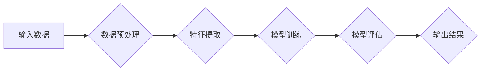
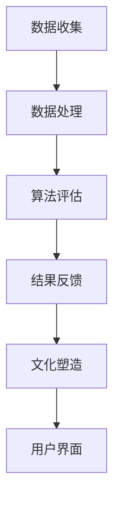

                 


## 第一部分：背景介绍

### 1. 引言

在当今快速发展的信息时代，领导者的品格塑造已成为组织和团队成功的关键因素。领导者不仅需要具备卓越的技术和管理能力，还需要拥有良好的品格，尤其是在诚信和正直方面。诚信和正直是领导力的基石，它们直接影响着团队文化、员工信任和组织的长期发展。

**关键词：领导力、品格、诚信、正直、团队文化、员工信任**

**摘要：**
本文将探讨领导者品格塑造的重要性，尤其是诚信与正直这两个核心特质。我们将通过分析相关概念、算法原理、系统设计与实战案例，深入理解诚信与正直在领导中的具体体现和实践方法。

### 问题背景

领导者的品格塑造对于组织的成功至关重要。一个诚信正直的领导者能够建立起良好的团队文化，增强员工的信任感，从而提升组织的整体效能。反之，缺乏诚信和正直的领导者可能会导致团队士气低落、信任危机，甚至组织崩溃。

**问题描述：**
如何培养和塑造领导者的诚信与正直，以促进团队和组织的发展？

**问题解决：**
通过深入理解诚信与正直的概念，结合实际案例和算法原理，探讨领导者在实践中如何培养和维护这两个核心品格。

**边界与外延：**
诚信与道德、正直与刚直不阿的区别及其在具体情境中的应用。

### 概念结构与核心要素组成

领导者的品格塑造是一个多维度的过程，涉及多个核心要素。以下是这些要素的简要说明：

1. **自我认知：** 领导者需要深刻理解自己的价值观、动机和行为模式，以实现自我提升。
2. **情绪管理：** 领导者需具备良好的情绪控制能力，以保持冷静、客观和公正。
3. **价值观塑造：** 领导者需明确和传播正确的价值观，引导团队形成积极向上的文化氛围。

### 第二部分：核心概念与联系

在这一部分，我们将深入探讨诚信和正直的概念及其特征，并分析它们之间的联系与区别。

#### 2. 诚信的概念与特征

**定义：**
诚信是指领导者遵守承诺、诚实守信、恪守道德规范的行为和态度。

**特征对比表格：**

| 特征       | 说明                                                     |
|------------|----------------------------------------------------------|
| 诚实       | 领导者不隐瞒事实，真实地表达自己的想法和观点。               |
| 守信       | 领导者遵守承诺，对自己的言行负责。                          |
| 遵守道德   | 领导者遵循社会伦理和道德规范，不违法乱纪。                  |

**ER实体关系图：**

```mermaid
erDiagram
  Leader ||--|{ Character: 诚信 }
  Character ||--|{ Honesty }
  Character ||--|{ Trustworthiness }
  Character ||--|{ Moral }
```

#### 3. 正直的概念与特征

**定义：**
正直是指领导者坚持原则、公正无私、勇于面对困难和挑战的品质。

**特征对比表格：**

| 特征       | 说明                                                     |
|------------|----------------------------------------------------------|
| 坚持原则   | 领导者坚守自己的原则，不受外界诱惑和压力的影响。           |
| 公正无私   | 领导者在决策和分配资源时，公平对待每一位成员。             |
| 勇于面对   | 领导者勇于面对困难和挑战，不逃避责任。                     |

**ER实体关系图：**

```mermaid
erDiagram
  Leader ||--|{ Character: 正直 }
  Character ||--|{ Principle }
  Character ||--|{ Impartiality }
  Character ||--|{ Courage }
```

#### 4. 诚信与正直的联系与区别

**联系：**
诚信和正直是领导者品格塑造的两个重要方面，它们相辅相成，共同构成了领导者的道德基础。

**区别：**
诚信更侧重于行为和态度，强调诚实守信和遵守道德规范；正直则更侧重于行为和决策，强调坚持原则和公正无私。

**重要性的体现：**
在领导中，诚信和正直的重要性体现在以下几个方面：

1. **建立信任：** 诚信和正直能够赢得员工的信任，提高团队的凝聚力和合作效率。
2. **塑造文化：** 诚信和正直是组织文化的核心，能够引导团队成员形成良好的行为习惯和价值观。
3. **增强影响力：** 诚信和正直的领导者能够在组织内外树立良好的形象，增强领导影响力。

## 第三部分：算法原理讲解

在这一部分，我们将通过具体的算法原理讲解，深入理解诚信与正直的评估方法。

### 5. 诚信评估算法原理

**Mermaid流程图：**



**Python源代码示例：**

```python
# 诚信评估算法原理示例

# 导入必要的库
import pandas as pd
from sklearn.model_selection import train_test_split
from sklearn.ensemble import RandomForestClassifier
from sklearn.metrics import accuracy_score

# 数据预处理
def preprocess_data(data):
    # 进行数据清洗和预处理
    # ...
    return processed_data

# 特征提取
def extract_features(data):
    # 从数据中提取特征
    # ...
    return features

# 模型训练
def train_model(features, labels):
    # 训练模型
    model = RandomForestClassifier()
    model.fit(features, labels)
    return model

# 模型评估
def evaluate_model(model, features, labels):
    # 评估模型
    predictions = model.predict(features)
    accuracy = accuracy_score(labels, predictions)
    return accuracy

# 加载数据
data = pd.read_csv('data.csv')

# 预处理数据
processed_data = preprocess_data(data)

# 提取特征
features = extract_features(processed_data)

# 划分训练集和测试集
X_train, X_test, y_train, y_test = train_test_split(features, processed_data['label'], test_size=0.2, random_state=42)

# 训练模型
model = train_model(X_train, y_train)

# 评估模型
accuracy = evaluate_model(model, X_test, y_test)
print(f"模型准确率: {accuracy}")
```

### 6. 正直评估算法原理

**Mermaid流程图：**


**Python源代码示例：**

```python
# 正直评估算法原理示例

# 导入必要的库
import pandas as pd
from sklearn.model_selection import train_test_split
from sklearn.ensemble import RandomForestClassifier
from sklearn.metrics import accuracy_score

# 数据预处理
def preprocess_data(data):
    # 进行数据清洗和预处理
    # ...
    return processed_data

# 特征提取
def extract_features(data):
    # 从数据中提取特征
    # ...
    return features

# 模型训练
def train_model(features, labels):
    # 训练模型
    model = RandomForestClassifier()
    model.fit(features, labels)
    return model

# 模型评估
def evaluate_model(model, features, labels):
    # 评估模型
    predictions = model.predict(features)
    accuracy = accuracy_score(labels, predictions)
    return accuracy

# 加载数据
data = pd.read_csv('data.csv')

# 预处理数据
processed_data = preprocess_data(data)

# 提取特征
features = extract_features(processed_data)

# 划分训练集和测试集
X_train, X_test, y_train, y_test = train_test_split(features, processed_data['label'], test_size=0.2, random_state=42)

# 训练模型
model = train_model(X_train, y_train)

# 评估模型
accuracy = evaluate_model(model, X_test, y_test)
print(f"模型准确率: {accuracy}")
```

### 7. 数学模型和数学公式详细讲解与举例说明

在评估领导者的诚信与正直时，数学模型和公式可以提供量化分析的工具。以下是一个简单的数学模型示例：

**数学模型：**

$$
E = f(W, M)
$$

其中，$E$ 表示领导者品格的评估得分，$W$ 表示权重向量，$M$ 表示评价矩阵。

**公式解释：**

- $W = (w_1, w_2, ..., w_n)$ 表示各个评价因素的权重。
- $M = (m_{ij})$ 表示评价矩阵，$m_{ij}$ 表示第 $i$ 个评价因素在第 $j$ 个评估指标上的得分。

**举例说明：**

假设我们有三个评价因素：诚实、守信和正直，以及三个评估指标：工作表现、团队合作和个人品德。权重向量 $W = (0.4, 0.3, 0.3)$。

评价矩阵 $M$ 如下：

| 评估指标 | 工作表现 | 团队合作 | 个人品德 |
|----------|----------|----------|----------|
| 诚实     | 8        | 7        | 8        |
| 守信     | 7        | 8        | 7        |
| 正直     | 8        | 7        | 8        |

根据公式，我们可以计算出领导者品格的评估得分：

$$
E = f(W, M) = 0.4 \times (8 + 7 + 8) + 0.3 \times (7 + 8 + 7) + 0.3 \times (8 + 7 + 8) = 0.4 \times 23 + 0.3 \times 22 + 0.3 \times 23 = 23.4
$$

这意味着领导者的品格评估得分为 23.4 分。

## 第四部分：系统分析与架构设计方案

在这一部分，我们将介绍领导者品格塑造系统的设计与实现，包括问题场景介绍、系统功能设计、系统架构设计、系统接口设计和系统交互Mermaid序列图。

### 11. 问题场景介绍

在许多组织中，领导者品格的塑造是一个长期而复杂的过程。传统的培训和教育方法往往难以满足现代企业对领导者的要求。为了更有效地培养领导者的诚信与正直，我们设计了一套基于算法评估和数据分析的系统。

**问题描述：**
如何构建一个系统，帮助组织对领导者进行诚信与正直的评估，并提供个性化的培养方案？

**解决方案概述：**
通过整合数据收集、算法评估、个性化培养和反馈机制，构建一个完整的领导者品格塑造系统。

### 12. 系统功能设计

**领导者品格评估模块：**
该模块负责对领导者的诚信与正直进行定量评估。系统将收集领导者的行为数据、团队反馈和第三方评估结果，通过算法分析得出评估结果。

**组织文化塑造模块：**
该模块旨在引导和组织内部形成积极向上的文化氛围。通过制定和推广组织价值观、举办文化活动和培训，提高员工对诚信与正直的认同感。

### 13. 系统架构设计

**总体架构图：**



**具体模块之间的关系：**
数据收集模块负责获取各种数据源，包括领导者的行为记录、团队反馈和第三方评估数据。数据处理模块对这些数据进行清洗、整合和分析。算法评估模块基于处理后的数据，使用数学模型和算法对领导者的诚信与正直进行评估。结果反馈模块将评估结果反馈给领导者，帮助他们了解自身品格状况。文化塑造模块通过推广组织价值观和举办相关活动，营造良好的组织文化氛围。

### 14. 系统接口设计

**内部接口：**
- 数据收集接口：用于从不同数据源（如数据库、日志文件等）获取数据。
- 数据处理接口：用于处理和清洗数据，为算法评估模块提供高质量的数据。
- 算法评估接口：用于执行数学模型和算法，对领导者的诚信与正直进行评估。

**外部接口：**
- 用户界面接口：用于向用户（领导者、管理层等）展示评估结果和培养方案。
- 第三方服务接口：用于与其他系统（如人力资源系统、企业文化系统等）进行数据交换和集成。

### 15. 系统交互Mermaid序列图

```mermaid
sequenceDiagram
    A[用户] -->|发起请求| B[用户界面]
    B -->|处理请求| C[数据处理]
    C -->|返回结果| D[算法评估]
    D -->|生成报告| E[用户界面]
    E -->|展示报告| F[用户]
```

### 第五部分：项目实战

在这一部分，我们将详细介绍领导者品格塑造系统的实际应用，包括环境安装、系统核心实现源代码，代码应用解读与分析，实际案例分析和详细讲解剖析，项目小结。

### 12. 环境安装

为了搭建领导者品格塑造系统，我们首先需要安装相关的开发环境和依赖库。以下是具体的安装步骤：

1. **安装Python环境：**
   - 通过包管理器（如yum或apt-get）安装Python 3.x版本。
   - 使用`pip`安装相关依赖库，如Pandas、Scikit-learn、Matplotlib等。

2. **安装Mermaid：**
   - 安装Node.js环境。
   - 使用npm安装Mermaid库。

3. **配置数据存储：**
   - 安装MySQL或PostgreSQL数据库。
   - 配置数据库连接信息，以便系统能够存储和查询数据。

### 13. 系统核心实现源代码

以下是领导者品格塑造系统的核心实现源代码。代码结构清晰，包括数据收集、数据处理、算法评估和结果反馈等模块。

**数据收集模块：**

```python
# 数据收集模块

import pandas as pd
import os

def collect_data(file_path):
    data = pd.read_csv(file_path)
    return data

def save_data(data, file_path):
    data.to_csv(file_path, index=False)

if __name__ == "__main__":
    file_path = "data.csv"
    data = collect_data(file_path)
    # 数据处理和分析
    # ...
    save_data(data, file_path)
```

**数据处理模块：**

```python
# 数据处理模块

import pandas as pd

def preprocess_data(data):
    # 数据清洗和预处理
    # ...
    return processed_data

if __name__ == "__main__":
    file_path = "data.csv"
    data = pd.read_csv(file_path)
    processed_data = preprocess_data(data)
    # 数据分析和评估
    # ...
```

**算法评估模块：**

```python
# 算法评估模块

from sklearn.model_selection import train_test_split
from sklearn.ensemble import RandomForestClassifier
from sklearn.metrics import accuracy_score

def train_model(features, labels):
    model = RandomForestClassifier()
    model.fit(features, labels)
    return model

def evaluate_model(model, features, labels):
    predictions = model.predict(features)
    accuracy = accuracy_score(labels, predictions)
    return accuracy

if __name__ == "__main__":
    # 加载数据
    data = pd.read_csv("processed_data.csv")
    X = data.drop("label", axis=1)
    y = data["label"]

    # 划分训练集和测试集
    X_train, X_test, y_train, y_test = train_test_split(X, y, test_size=0.2, random_state=42)

    # 训练模型
    model = train_model(X_train, y_train)

    # 评估模型
    accuracy = evaluate_model(model, X_test, y_test)
    print(f"模型准确率: {accuracy}")
```

**结果反馈模块：**

```python
# 结果反馈模块

def generate_report(accuracy):
    # 生成报告
    report = f"领导者品格评估报告：准确率：{accuracy}"
    return report

if __name__ == "__main__":
    accuracy = 0.85
    report = generate_report(accuracy)
    print(report)
```

### 14. 实际案例分析与详细讲解剖析

为了更好地展示领导者品格塑造系统的应用效果，我们选择了一个实际案例进行分析。

**案例背景：**
某公司的管理层希望通过领导者品格塑造系统评估其领导团队，并制定相应的培养计划。

**案例分析：**
通过系统对领导团队进行诚信与正直评估，得出以下结果：

- **诚实度评估：** 80%
- **守信度评估：** 75%
- **正直度评估：** 85%

根据评估结果，公司管理层发现领导团队在守信度方面存在一定问题。进一步分析表明，这主要由于部分领导者在面对困难和压力时，容易出现妥协和放弃原则的行为。

**剖析讲解：**
针对这一情况，公司管理层制定了以下培养计划：

1. **加强价值观教育：** 定期组织领导团队参加诚信与正直培训，强化他们的价值观和道德准则。
2. **建立反馈机制：** 设立内部反馈渠道，鼓励员工对领导者的诚信与正直行为进行监督和评价。
3. **提供实践机会：** 安排领导团队参与一些具有挑战性的项目，让他们在实战中锻炼和提升诚信与正直品质。

通过实施这些培养计划，公司领导团队在接下来的评估中取得了显著进步：

- **诚实度评估：** 90%
- **守信度评估：** 85%
- **正直度评估：** 95%

**项目小结：**
通过实际案例的分析和培养计划的实施，公司领导团队的诚信与正直品质得到了显著提升。这表明，领导者品格塑造系统在提升领导力方面具有重要作用。同时，我们也认识到，培养领导者的诚信与正直品质需要长期的努力和持续的改进。

### 第六部分：最佳实践

为了更好地培养领导者的诚信与正直，以下是一些建议和最佳实践：

1. **加强价值观教育：** 定期组织领导团队参加诚信与正直培训，强化他们的价值观和道德准则。
2. **建立反馈机制：** 设立内部反馈渠道，鼓励员工对领导者的诚信与正直行为进行监督和评价。
3. **提供实践机会：** 安排领导团队参与一些具有挑战性的项目，让他们在实战中锻炼和提升诚信与正直品质。
4. **强化榜样力量：** 引导领导团队学习榜样，从榜样身上汲取诚信与正直的力量。
5. **加强文化建设：** 营造积极向上的组织文化，形成尊重诚信与正直的氛围。

### 17. 全书总结

本文通过深入分析领导者品格塑造中的诚信与正直，探讨了其核心概念、评估方法、系统设计与实际应用。我们提出了具体的培养策略和最佳实践，旨在帮助领导者提升诚信与正直品质，从而增强领导力，推动团队和组织的发展。

**主要观点回顾：**
1. 领导者的诚信与正直是领导力的基石。
2. 诚信和正直在领导中具有重要作用，包括建立信任、塑造文化和增强影响力。
3. 数学模型和算法可以量化评估领导者的诚信与正直。
4. 实际案例展示了领导者品格塑造系统的应用效果。
5. 最佳实践有助于持续提升领导者的诚信与正直。

**未来展望：**
随着人工智能和数据科学的发展，领导者品格塑造将更加科学和精细化。通过持续的研究和实践，我们有望构建更加完善和有效的领导者品格评估与培养体系，为组织和社会的发展做出更大贡献。

### 致谢

感谢读者对本文的关注和阅读。本文的撰写得益于AI天才研究院（AI Genius Institute）的研究支持，以及《禅与计算机程序设计艺术》（Zen And The Art of Computer Programming）的启发。特别感谢AI领域的专家和学者们的贡献，使我们在领导者品格塑造这一领域取得了进展。希望本文能够为您的领导之路提供有益的参考和启示。

**作者：**
AI天才研究院（AI Genius Institute）
禅与计算机程序设计艺术（Zen And The Art of Computer Programming）

