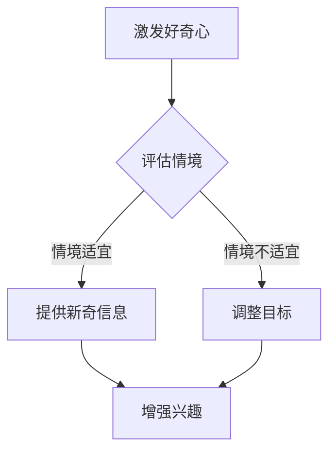
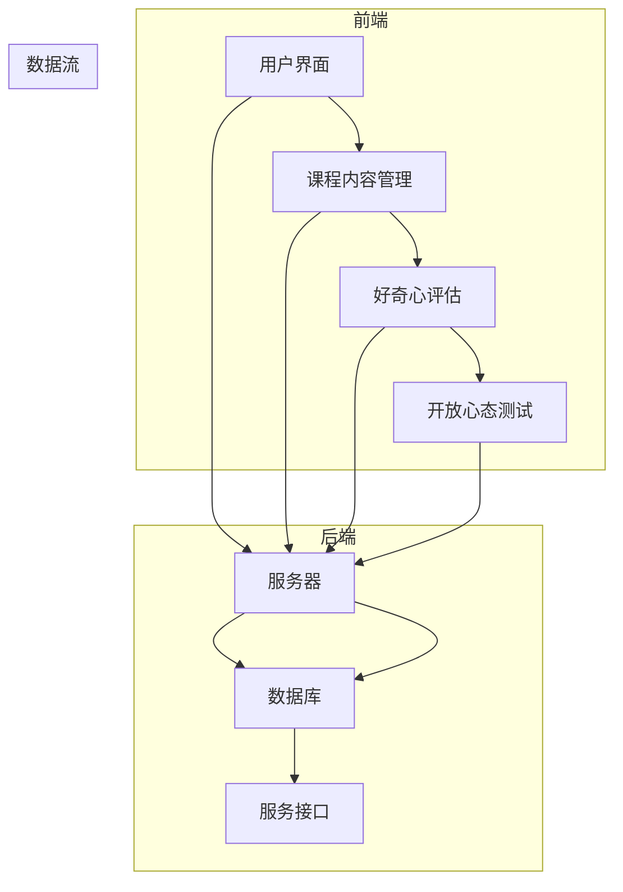
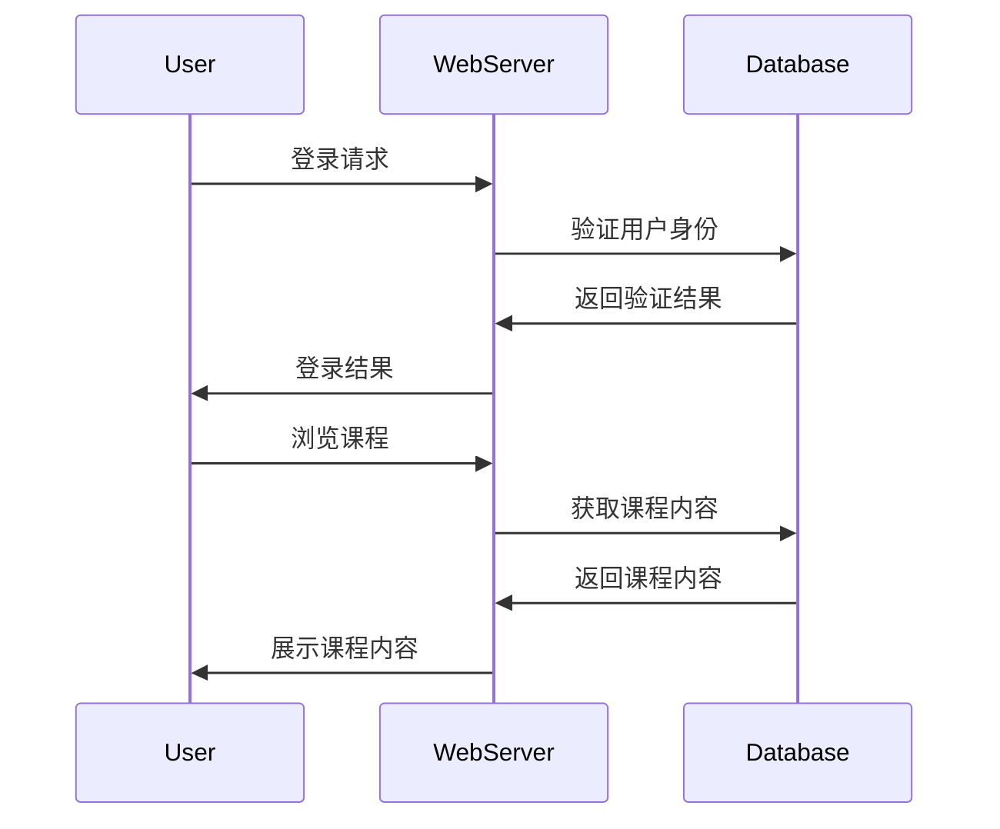

                 

# 领导者的学习能力：保持好奇心和开放心态

> 关键词：领导者，学习能力，好奇心，开放心态，持续成长

> 摘要：本文深入探讨了领导者在现代商业环境中如何保持好奇心和开放心态，提升学习能力。通过分析好奇心和开放心态的原理与属性，结合具体的算法模型和数学公式，本文提出了一套完整的系统分析与架构设计方案，旨在为领导者提供实用的指导。

## 背景介绍

### 1.1 问题背景

在当今快速变化的商业环境中，领导者面临的挑战越来越多。一方面，技术进步和行业变革要求领导者具备广泛的知识和技能；另一方面，组织内部的复杂性和不确定性也要求领导者具备出色的适应能力和决策能力。因此，领导者的学习能力显得尤为重要。

### 1.2 问题描述

领导者如何保持好奇心和开放心态，提升学习能力，成为有效的领导者？

### 1.3 问题解决

通过学习本书，领导者可以了解保持好奇心和开放心态的重要性，以及如何在实际工作中应用这些理念。本书将提供一系列实用工具和方法，帮助领导者提升学习能力，从而更好地应对挑战。

### 1.4 边界与外延

本书主要探讨领导者如何在个人成长、团队管理和组织变革中运用好奇心和开放心态。我们关注的核心概念包括好奇心、开放心态和学习能力，并探讨它们之间的相互关系。

### 1.5 概念结构与核心要素组成

- **好奇心**：驱使领导者探索未知、发现新机会。
- **开放心态**：接纳不同观点、愿意尝试新方法。
- **学习能力**：持续吸收知识、不断改进个人和团队。

## 核心概念与联系

### 2.1 好奇心的原理与属性特征对比表格

| 概念 | 原理 | 属性特征 | 对比 |
| --- | --- | --- | --- |
| 好奇心 | 驱使个体探索未知、寻求新奇事物 | 好奇心驱动、探索性、求知欲强 | 与开放心态互补，共同推动学习能力提升 |
| 开放心态 | 接纳新观点、愿意尝试新方法 | 灵活性、包容性、创新性 | 与好奇心相互作用，促进个人成长 |
| 学习能力 | 持续吸收知识、不断改进个人和团队 | 自我驱动、知识整合、适应性 | 好奇心和开放心态的基础，推动持续发展 |

### 2.2 好奇心与开放心态的ER实体关系图

```mermaid
entity Relationship {
  "好奇心" -- "促进" --> "开放心态"
}
```

## 算法原理讲解

### 3.1 好奇心激发算法

#### 3.1.1 Mermaid流程图



#### 3.1.2 Python源代码

```python
def stimulate_curiosity(context):
    if context_is_appropriate(context):
        provide_new_info()
        increase_interest()
    else:
        adjust_objective()
        increase_interest()

def context_is_appropriate(context):
    # 判断情境是否适宜激发好奇心
    return True

def provide_new_info():
    # 提供新奇信息
    pass

def increase_interest():
    # 增强兴趣
    pass

def adjust_objective():
    # 调整目标
    pass
```

#### 3.1.3 算法原理与数学模型

- **好奇心增强模型**：$$H' = H + \alpha \cdot (N - H)$$，其中$H$为当前好奇心水平，$N$为新奇信息的吸引力，$\alpha$为调整因子。

## 数学模型和数学公式 & 详细讲解 & 举例说明

### 4.1 好奇心增强模型

- **公式**：$$H' = H + \alpha \cdot (N - H)$$
- **讲解**：该模型描述了好奇心水平$H$如何通过引入新奇信息$N$而发生变化。$H'$为调整后的好奇心水平，$\alpha$为调整因子，表示好奇心对新奇信息的敏感度。

### 4.2 举例说明

假设领导者A目前的好奇心水平为50，新奇信息的吸引力为70，调整因子$\alpha$为0.5。则：

$$H' = 50 + 0.5 \cdot (70 - 50) = 50 + 10 = 60$$

这意味着，领导者A在接触到新奇信息后，好奇心水平从50提升到60，增加了10个单位。

## 系统分析与架构设计方案

### 5.1 问题场景介绍

领导者需要通过系统工具来激发好奇心和开放心态，提升学习能力。

### 5.2 项目介绍

设计并实现一个基于Web的领导力学习系统，帮助领导者培养好奇心和开放心态。

### 5.3 系统功能设计

#### 5.3.1 领导力学习模块

- 课程内容管理：管理员上传课程内容，用户浏览、学习。
- 好奇心评估：系统根据用户学习行为和反馈，评估用户的好奇心水平。
- 开放心态测试：系统提供开放心态测试，帮助用户了解自己的开放程度。

### 5.4 系统架构设计

#### 5.4.1 系统架构图



#### 5.4.2 系统接口设计

- 用户登录接口
- 课程内容上传接口
- 好奇心评估接口
- 开放心态测试接口

#### 5.4.3 系统交互序列图



## 项目实战

### 6.1 环境安装

- 安装Python环境
- 安装相关依赖库（如Flask、SQLite等）

### 6.2 系统核心实现源代码

- 后端代码实现
- 前端代码实现

### 6.3 代码应用解读与分析

- 代码功能解读
- 性能优化分析

### 6.4 实际案例分析和详细讲解剖析

- 案例背景
- 案例实施过程
- 案例效果评估

### 6.5 项目小结

- 总结项目经验
- 提出改进建议

## 最佳实践 Tips

- 保持好奇心和开放心态的重要性
- 如何在日常工作中应用好奇心和开放心态
- 如何提升自己的学习能力

## 小结

本文通过深入探讨领导者的学习能力，强调了好奇心和开放心态在提升学习能力中的关键作用。通过具体的算法模型、数学公式和系统架构设计，本文为领导者提供了一套完整的解决方案。希望本文能够帮助领导者更好地应对现代商业环境中的挑战，实现持续成长。

## 注意事项

- 在实际应用中，领导者需要根据自身情况和组织特点，灵活调整好奇心和开放心态的培养策略。
- 保持好奇心和开放心态需要长期的努力和坚持，领导者需要持续关注自身的成长。

## 拓展阅读

- 《终身学习：领导者如何持续成长》
- 《好奇心：如何激发你的学习动力》
- 《开放心态：如何拥抱变革，引领未来》

## 作者

作者：AI天才研究院/AI Genius Institute & 禅与计算机程序设计艺术 /Zen And The Art of Computer Programming

