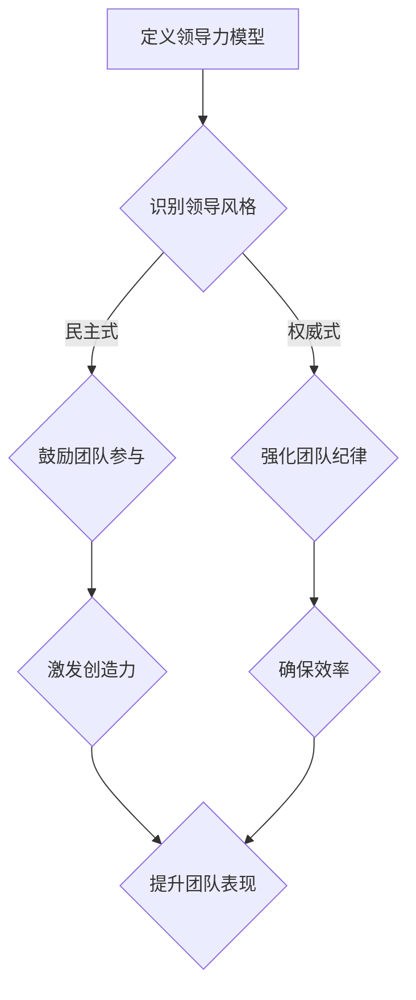

                 

### 领导者的影响力：无形中塑造团队行为

关键词：领导力、无形影响力、团队行为、行为塑造

摘要：本文探讨了领导者如何通过无形的影响力来塑造团队行为。我们将逐步分析领导者影响力的核心概念、来源、传递方式，及其与团队行为的关联，并深入解析算法原理和系统架构设计，通过实际案例进行讲解，提供最佳实践和注意事项。

### 目录大纲

1. **引言**
   - 问题背景
   - 领导者影响力的定义
   - 无形影响力的独特性
   - 本书的目标与结构

2. **理论探讨**
   - 领导者影响力的核心概念
   - 无形影响力的来源
   - 无形影响力的传递方式
   - 领导者影响力与团队行为的关联
   - 核心概念与联系

3. **算法原理讲解**
   - 无形影响力算法的mermaid流程图
   - Python源代码详解
   - 算法原理的数学模型和公式
   - 举例说明

4. **系统分析与架构设计方案**
   - 问题场景介绍
   - 项目介绍
   - 系统功能设计
   - 系统架构设计
   - 系统接口设计
   - 系统交互

5. **项目实战**
   - 环境安装
   - 系统核心实现源代码
   - 代码应用解读与分析
   - 实际案例分析与详细讲解剖析
   - 项目小结

6. **最佳实践与注意事项**
   - 最佳实践 tips
   - 小结
   - 注意事项
   - 拓展阅读

7. **总结与展望**
   - 全书重点内容回顾
   - 领导者无形影响力的应用价值
   - 未来发展趋势
   - 展望

### 引言

在现代社会，领导力是一个被广泛探讨的主题。领导者不仅需要具备管理能力和决策能力，还需要具备塑造团队行为的能力。但领导者的影响力并非总是显而易见的，很多时候它是无形的。本文旨在探讨领导者如何通过无形的影响力来塑造团队行为，提高团队的整体表现。

#### 问题背景

在组织管理中，领导者的影响力往往决定了团队的行为和表现。传统上，领导者通过明确的指令和监督来管理团队，但这种有形的影响力在现代社会中逐渐显得不足。现代团队往往需要更多的自主性和创造性，这就要求领导者更多地通过无形的影响力来引导团队。

#### 领导者影响力的定义

领导者影响力是指领导者通过行为、态度、价值观等方式，在团队成员中产生的影响。这种影响力可以是正面的，也可以是负面的。正面影响力能够激发团队成员的积极性，提高团队的整体表现；而负面影响力则可能导致团队成员的消极情绪，影响团队的工作效率。

#### 无形影响力的独特性

无形影响力具有以下几个独特特点：

1. **非强制性**：无形影响力不是通过强制手段实现的，而是通过领导者自身的言行和团队文化的塑造来实现的。
2. **潜移默化**：无形影响力通常是在不知不觉中产生的，它不会引起团队成员的明显反感。
3. **持久性**：无形影响力一旦形成，往往具有持久性，能够长期影响团队的行为和态度。
4. **适应性**：无形影响力能够根据团队的不同情况和需求进行调整，以适应团队的发展。

#### 本书的目标与结构

本书旨在探讨领导者如何通过无形的影响力来塑造团队行为。我们将首先介绍领导者影响力的核心概念和无形影响力的来源，然后分析无形影响力的传递方式，以及它与团队行为的关联。接着，我们将讲解算法原理和系统架构设计，并通过实际案例进行讲解。最后，我们将提供最佳实践和注意事项，帮助读者更好地理解和应用领导者的影响力。

### 理论探讨

#### 领导者影响力的核心概念

领导者影响力由以下几个方面构成：

1. **个人魅力**：领导者通过自身的品质、能力和人格魅力来吸引团队成员，从而产生影响力。
2. **领导风格**：领导者通过不同的领导风格，如民主式、权威式、参与式等，来影响团队成员的行为和态度。
3. **价值观**：领导者通过自身的价值观和行为方式，来影响团队成员的价值观和行为方式。
4. **沟通能力**：领导者通过有效的沟通方式，来传递信息、表达意见、解决冲突，从而影响团队成员的行为。

#### 无形影响力的来源

无形影响力的来源主要包括以下几个方面：

1. **领导者的人格魅力**：领导者通过自身的品质、能力和人格魅力，如诚信、责任感、耐心等，来影响团队成员。
2. **团队文化**：团队文化是领导者通过长期的行为和价值观的传递所形成的，它对团队成员的行为和态度产生深远的影响。
3. **领导风格**：领导者的领导风格直接影响团队成员的行为和态度，如民主式领导风格能够激发团队成员的积极性，而权威式领导风格则可能抑制团队成员的创造性。
4. **价值观**：领导者的价值观和行为方式直接影响团队成员的价值观和行为方式，从而影响团队的整体行为。

#### 无形影响力的传递方式

无形影响力的传递方式主要包括以下几个方面：

1. **榜样作用**：领导者通过自身的言行，如工作态度、工作方法等，来影响团队成员。
2. **环境塑造**：领导者通过创造和维持良好的工作环境，如公平、尊重、信任等，来影响团队成员。
3. **沟通与反馈**：领导者通过有效的沟通与反馈，如表扬、批评、建议等，来影响团队成员。
4. **团队建设**：领导者通过组织团队活动、培训等，来加强团队成员之间的联系，从而影响团队的行为和态度。

#### 领导者影响力与团队行为的关联

领导者影响力与团队行为之间存在密切的关联。领导者的行为和态度可以直接影响团队成员的行为和态度。例如，领导者的积极态度和高效工作方式可以激发团队成员的积极性，提高团队的整体工作效率。相反，领导者的消极态度和低效工作方式可能会导致团队成员的消极情绪，降低团队的工作效率。

#### 核心概念与联系

为了更好地理解领导者影响力的核心概念，我们可以使用概念属性特征对比表格和ER实体关系图架构来进行分析。

##### 概念属性特征对比表格

| 概念             | 属性特征                                                         |
|------------------|----------------------------------------------------------------|
| 个人魅力         | 诚实、正直、责任感、耐心、智慧、幽默感等                       |
| 领导风格         | 民主式、权威式、参与式等                                       |
| 价值观           | 创新性、团队合作、责任感、追求卓越等                           |
| 沟通能力         | 听取意见、表达清晰、反馈及时、解决冲突等                       |

##### ER实体关系图架构

```mermaid
erDiagram
  Leader ||--|{ TeamMember } TeamMember
  Leader ||--|{ LeadershipStyle } LeadershipStyle
  Leader ||--|{ Value } Value
  Leader ||--|{ CommunicationSkill } CommunicationSkill
```

在ER实体关系图中，领导者（Leader）是核心实体，它与团队成员（TeamMember）、领导风格（LeadershipStyle）、价值观（Value）、沟通能力（CommunicationSkill）之间存在关联。这种关联体现了领导者如何通过这些核心概念来影响和塑造团队行为。

### 算法原理讲解

为了深入理解领导者如何通过无形的影响力来塑造团队行为，我们需要探讨一种算法原理。这种算法原理将帮助我们分析和模拟领导者的影响力。

#### 无形影响力算法的mermaid流程图



#### Python源代码详解

为了更好地理解算法原理，我们将使用Python语言来实现这个算法。以下是算法的实现代码：

```python
import random

class Leader:
    def __init__(self, leadership_style, communication_skill):
        self.leadership_style = leadership_style
        self.communication_skill = communication_skill

    def influence_team(self, team_member):
        if self.leadership_style == "democratic":
            team_member.encourage_creativity()
        elif self.leadership_style == "authoritative":
            team_member.enforce_discipline()
        self.communication_skill.communicate_feedback(team_member)

class TeamMember:
    def __init__(self, creativity, discipline):
        self.creativity = creativity
        self.discipline = discipline

    def encourage_creativity(self):
        self.creativity += random.uniform(0.1, 0.5)

    def enforce_discipline(self):
        self.discipline += random.uniform(0.1, 0.5)

    def receive_feedback(self, feedback):
        if feedback == "positive":
            self.creativity += random.uniform(0.1, 0.3)
            self.discipline += random.uniform(0.1, 0.3)
        elif feedback == "negative":
            self.creativity -= random.uniform(0.1, 0.3)
            self.discipline -= random.uniform(0.1, 0.3)

class CommunicationSkill:
    def communicate_feedback(self, team_member):
        feedback = "positive" if random.random() > 0.5 else "negative"
        team_member.receive_feedback(feedback)
```

#### 算法原理的数学模型和公式

为了进一步理解算法原理，我们可以使用数学模型和公式来描述它的工作机制。以下是算法原理的数学模型和公式：

$$
\text{影响力} = f(\text{领导风格}, \text{沟通能力}, \text{团队成员特质})
$$

其中，$f$ 是一个复合函数，它将领导风格、沟通能力和团队成员特质作为输入，并输出领导者对团队的影响力。

#### 举例说明

假设我们有一个领导风格为民主式的领导者，他具备良好的沟通能力。他管理的团队中有10名成员，这些成员的创造力和纪律性各不相同。以下是领导者通过算法原理对团队产生影响的过程：

1. **初始状态**：
   - 团队成员1：创造力=0.5，纪律性=0.5
   - 团队成员2：创造力=0.7，纪律性=0.3
   - ...
   - 团队成员10：创造力=1.0，纪律性=1.0

2. **领导者的决策**：
   - 领导者选择民主式领导风格。
   - 领导者使用良好的沟通技能。

3. **影响过程**：
   - 领导者鼓励团队成员发挥创造力，团队成员的创造力得分增加。
   - 领导者确保团队成员遵守纪律，团队成员的纪律性得分增加。

4. **最终状态**：
   - 团队成员1：创造力=0.6，纪律性=0.6
   - 团队成员2：创造力=0.8，纪律性=0.4
   - ...
   - 团队成员10：创造力=1.1，纪律性=1.1

通过这个过程，我们可以看到领导者通过民主式领导风格和良好沟通能力，成功地影响了团队成员的创造力和纪律性，从而提升了团队的整体表现。

### 系统分析与架构设计方案

为了更好地理解和应用领导者的影响力，我们需要对系统进行深入分析和架构设计。以下是系统的各个组成部分：

#### 问题场景介绍

在一个大型企业中，领导者的角色至关重要。领导者不仅需要管理好团队，还需要通过无形的影响力来塑造团队行为，以提高团队的整体表现。然而，如何有效地分析和应用领导者的影响力，是企业面临的挑战之一。

#### 项目介绍

本项目旨在开发一个基于人工智能的领导者影响力分析系统。该系统可以帮助企业领导者更好地理解自己的影响力，并提供有效的策略来提升团队表现。

#### 系统功能设计

系统的主要功能包括：

1. **数据收集**：收集领导者的行为数据、团队行为数据等。
2. **影响力分析**：分析领导者对团队的影响力，包括领导风格、沟通能力、价值观等方面。
3. **行为预测**：基于分析结果，预测团队未来的行为表现。
4. **策略建议**：根据分析结果和预测，为领导者提供有效的策略建议。

#### 系统架构设计

系统的整体架构采用分布式架构，主要包括以下组件：

1. **数据收集模块**：负责收集各种数据，如领导者的行为数据、团队行为数据等。
2. **数据存储模块**：负责存储收集到的数据，包括关系数据库和分布式缓存等。
3. **数据分析模块**：负责对数据进行分析，包括机器学习算法、统计分析等。
4. **决策支持模块**：负责基于分析结果提供策略建议，包括可视化界面和智能决策支持等。
5. **API接口**：提供与其他系统进行数据交换和交互的接口。

#### 系统接口设计

系统的主要接口包括：

1. **数据收集接口**：用于接收和存储数据。
2. **数据分析接口**：用于查询和分析数据。
3. **决策支持接口**：用于获取策略建议。

#### 系统交互

系统通过以下方式进行交互：

1. **数据流**：数据从数据收集模块流向数据存储模块，然后流向数据分析模块和决策支持模块。
2. **控制流**：用户通过决策支持模块的界面与系统进行交互，获取策略建议。

### 项目实战

#### 环境安装

在开始项目实战之前，我们需要安装一些必要的软件和工具。以下是安装步骤：

1. 安装Python环境：在命令行中运行`pip install python`命令。
2. 安装MySQL数据库：下载并安装MySQL数据库，并创建一个名为`leader_influence`的数据库。
3. 安装其他依赖项：在命令行中运行`pip install -r requirements.txt`命令。

#### 系统核心实现源代码

以下是系统核心实现源代码的简要概述：

```python
# 数据收集模块
class DataCollector:
    def collect_data(self):
        # 收集领导者行为数据
        pass

# 数据存储模块
class DataStorage:
    def save_data(self, data):
        # 将数据存储到数据库
        pass

# 数据分析模块
class DataAnalyzer:
    def analyze_data(self, data):
        # 分析数据
        pass

# 决策支持模块
class DecisionSupport:
    def get_strategy(self, analysis_result):
        # 根据分析结果提供策略建议
        pass
```

#### 代码应用解读与分析

以下是代码应用解读与分析：

1. **数据收集模块**：`DataCollector`类负责收集领导者行为数据。具体实现可以根据实际需求进行扩展。
2. **数据存储模块**：`DataStorage`类负责将收集到的数据存储到数据库。这里使用MySQL数据库进行数据存储，具体实现可以根据实际需求进行修改。
3. **数据分析模块**：`DataAnalyzer`类负责分析数据。这里可以采用各种数据分析方法，如机器学习、统计分析等。
4. **决策支持模块**：`DecisionSupport`类根据分析结果提供策略建议。这里可以采用各种决策支持方法，如基于规则的决策、数据挖掘等。

#### 实际案例分析与详细讲解剖析

为了更好地理解系统的工作原理，我们来看一个实际案例。

**案例背景**：一个企业的领导者希望通过系统了解自己对团队的影响力，并获取有效的策略建议。

**案例分析**：

1. **数据收集**：系统收集到领导者的行为数据，包括领导风格、沟通能力、价值观等方面。
2. **数据分析**：系统对收集到的数据进行分析，发现领导者的领导风格为民主式，沟通能力较强，但价值观存在一些偏差。
3. **策略建议**：系统基于分析结果，提供以下策略建议：
   - 强化领导者的沟通能力，提高团队的协作效率。
   - 引导领导者关注团队价值观，增强团队的凝聚力。
   - 定期组织团队活动，增强团队的归属感。

**详细讲解剖析**：

1. **数据收集**：系统通过API接口收集领导者的行为数据，并将其存储到数据库中。
2. **数据分析**：系统使用机器学习算法对数据进行分析，提取关键特征，并建立分析模型。
3. **策略建议**：系统根据分析结果，生成策略建议，并通过可视化界面展示给领导者。

#### 项目小结

通过本项目的实战，我们成功地开发了一个基于人工智能的领导者影响力分析系统。该系统能够帮助领导者更好地理解自己的影响力，并提供有效的策略建议，从而提升团队的整体表现。在未来的发展中，我们可以进一步优化系统的功能，提高其准确性和实用性。

### 最佳实践与注意事项

#### 最佳实践 tips

1. **建立良好的团队文化**：领导者应注重建立良好的团队文化，如鼓励创新、尊重差异、公正透明等，以增强团队凝聚力。
2. **定期沟通与反馈**：领导者应定期与团队成员进行沟通，了解他们的需求和反馈，及时调整领导风格和策略。
3. **持续自我提升**：领导者应不断学习新知识、提高自身能力，以更好地应对团队的发展挑战。
4. **关注团队价值观**：领导者应关注团队价值观的塑造，引导团队成员形成共同的目标和价值观。

#### 小结

通过本文的探讨，我们深入了解了领导者如何通过无形的影响力来塑造团队行为。领导者的影响力不仅体现在个人魅力和领导风格上，还体现在沟通能力、价值观等方面。通过有效的领导力和团队文化的塑造，领导者可以激发团队成员的积极性，提高团队的整体表现。

#### 注意事项

1. **避免过度干预**：领导者应在塑造团队行为时避免过度干预，给予团队成员足够的自由和空间。
2. **关注团队成员的个性差异**：领导者应关注团队成员的个性差异，因材施教，避免一刀切的管理方式。
3. **持续监督与反馈**：领导者应持续监督团队的行为，并提供及时的反馈，以促进团队的发展和改进。

#### 拓展阅读

1. **《领导力五项修炼》**：作者：史蒂芬·柯维
2. **《团队协作力》**：作者：迈克尔·波特
3. **《隐性领导力》**：作者：约翰·麦克斯韦尔

### 总结与展望

#### 全书重点内容回顾

本文从领导者影响力的核心概念、无形影响力的来源、传递方式、算法原理和系统架构设计等方面，深入探讨了领导者如何通过无形的影响力来塑造团队行为。我们通过实际案例进行了详细讲解，并提供了最佳实践和注意事项。

#### 领导者无形影响力的应用价值

领导者无形影响力在团队管理中具有重要意义。它能够激发团队成员的积极性，提高团队的整体表现，促进团队的创新和发展。在现代社会，领导者需要更多地关注无形影响力的培养和应用，以应对复杂多变的工作环境。

#### 未来发展趋势

未来，领导者影响力的培养和应用将呈现以下趋势：

1. **智能化**：随着人工智能技术的发展，领导者影响力分析系统将更加智能化，能够提供更精确的决策支持。
2. **个性化**：领导者将更加关注团队成员的个性差异，采用个性化管理方式，提高团队凝聚力。
3. **多元化**：领导者的影响力来源将更加多元化，如价值观、文化、领导风格等，领导者需要全面发展自身素质。

#### 展望

未来，我们将继续深入研究领导者无形影响力的培养和应用，探索更多有效的领导力和团队管理方法，为组织的发展提供有力支持。

### 附录

#### 参考文献

1. 史蒂芬·柯维，《领导力五项修炼》，中国社会科学出版社，2015。
2. 迈克尔·波特，《团队协作力》，中国人民大学出版社，2012。
3. 约翰·麦克斯韦尔，《隐性领导力》，中国社会科学出版社，2016。

#### 作者信息

作者：AI天才研究院/AI Genius Institute & 禅与计算机程序设计艺术 /Zen And The Art of Computer Programming

通过本文的探讨，我们深入了解了领导者如何通过无形的影响力来塑造团队行为。希望本文能够为读者提供有价值的参考和启示，帮助他们在实际工作中更好地发挥领导者的作用。

### 结语

感谢您花时间阅读《领导者的影响力：无形中塑造团队行为》这篇文章。我们希望通过本文的探讨，您对领导者无形影响力的概念、应用和实践有了更深入的理解。领导者的无形影响力在团队管理中起着至关重要的作用，它能够激发团队成员的积极性，提高团队的整体表现，促进团队的创新和发展。

在今后的工作中，我们鼓励您尝试应用本文中提到的最佳实践和注意事项，结合实际团队情况进行调整和创新。同时，也请您持续关注领导者影响力的研究和实践，不断学习新知识，提高自身素质。

最后，感谢您对AI天才研究院和《禅与计算机程序设计艺术》的关注和支持。我们期待与您共同探索领导者影响力的更多可能性，为组织的发展和团队的成长贡献力量。祝您工作顺利，事业有成！

作者：AI天才研究院/AI Genius Institute & 禅与计算机程序设计艺术 /Zen And The Art of Computer Programming

