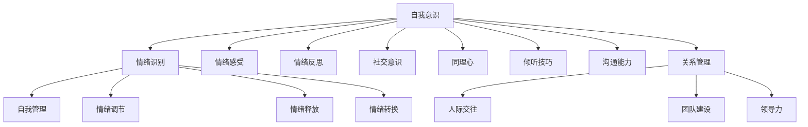

                 

# 领导者的情商：理解和管理情绪

## 关键词
领导力、情商、自我意识、自我管理、社交意识、关系管理

## 摘要
本文旨在探讨领导者的情商及其在管理和激励团队中的重要性。文章首先介绍了情商的核心概念，包括自我意识、自我管理、社交意识和关系管理，并通过对比表格和流程图详细解析了这些概念。接着，文章深入分析了情商对领导者角色的影响，阐述了提升情商的策略和最佳实践。最后，文章总结了情商在领导力中的关键作用，为领导者提供了实用的情商管理方法。

## 第一部分：背景介绍

### 核心概念

#### 问题背景

在当今快速变化的工作环境中，领导者的作用至关重要。领导者不仅需要具备出色的技术和管理能力，还需要具备强大的情商。情商（Emotional Intelligence，简称EQ）是一种理解和管理自己情绪以及他人情绪的能力，它包括自我意识、自我管理、社交意识和关系管理四个核心方面。

#### 问题描述

领导者如何识别、理解和管理情绪，以提升个人和团队的效能，是本文要探讨的核心问题。情商的高低直接影响领导者的决策能力、沟通效果和团队氛围。因此，如何提升领导者的情商成为企业管理者和领导者迫切需要解决的问题。

#### 问题解决

本文将通过对情商核心概念的深入分析，结合实践中的成功案例和技巧分享，帮助领导者理解和掌握提升情商的方法。同时，本文还将探讨情商在领导力中的重要作用，以及如何将情商应用于实际工作中，以提升领导效果。

#### 边界与外延

本文主要关注领导者的情商，不包括一般人群的情绪管理。领导者的情商研究范围涉及自我意识、自我管理、社交意识和关系管理四个方面，重点关注这些方面在领导实践中的应用和提升。

### 概念结构与核心要素组成

1. **情商的概念**：情商包括自我意识、自我管理、社交意识和关系管理四个方面。
   - **自我意识**：指领导者对自己情绪状态的认知和理解。
   - **自我管理**：指领导者如何控制自己的情绪反应，以适应不同的环境和情境。
   - **社交意识**：指领导者对他人的情绪和需求的认知能力。
   - **关系管理**：指领导者如何维护和改善与他人的关系。

2. **领导者的角色**：领导者的情绪状态如何影响团队和组织的氛围。
   - **影响团队绩效**：领导者的情绪状态直接影响团队的工作效率和团队氛围。
   - **塑造组织文化**：领导者的情绪管理能力影响组织文化的形成和发展。

3. **情绪管理的策略**：提升情商的具体方法和实践。
   - **自我反思**：通过自我反思了解自己的情绪状态。
   - **情绪调节**：学会在情绪激发时保持冷静和理性。
   - **社交技能**：提升沟通和人际交往能力，增强社交意识。
   - **关系建设**：通过积极的人际关系建立和维护，提升关系管理能力。

#### 图表支持

**情商概念属性特征对比表格：**

| 特征       | 自我意识 | 自我管理 | 社交意识 | 关系管理 |
|------------|----------|----------|----------|----------|
| 定义       | 了解自己的情绪状态 | 控制自己的情绪反应 | 理解他人的情绪和需求 | 维护和改善人际关系 |
| 关键要素   | 情绪识别 | 情绪调节 | 沟通技巧 | 领导力 |
| 相关技能   | 自我反思 | 压力管理 | 同理心 | 人际关系处理 |
| 应用领域   | 个人发展 | 压力管理 | 领导力 | 团队建设 |

**ER实体关系图架构的Mermaid流程图：**

```mermaid
erDiagram
  A[领导者] ||--|{ B[自我意识] } |
  A ||--|{ C[自我管理] } |
  A ||--|{ D[社交意识] } |
  A ||--|{ E[关系管理] } |
```

## 第二部分：情商的核心概念与联系

### 核心概念原理

#### 自我意识

自我意识是情商的基石，指领导者对自己情绪状态的认知和理解。自我意识包括以下方面：

1. **情绪识别**：能够识别自己正在经历的情绪。
2. **情绪感受**：能够感受到情绪对自己的影响。
3. **情绪反思**：能够从过去和现在的经历中反思自己的情绪反应。

#### 自我管理

自我管理是指领导者如何控制自己的情绪反应，以适应不同的环境和情境。自我管理包括以下方面：

1. **情绪调节**：在情绪激发时能够保持冷静，不被情绪所左右。
2. **情绪释放**：学会适当地表达和释放负面情绪。
3. **情绪转换**：能够将负面情绪转换为积极的动力。

#### 社交意识

社交意识是指领导者对他人的情绪和需求的认知能力。社交意识包括以下方面：

1. **同理心**：理解并感受他人的情绪。
2. **倾听技巧**：能够认真倾听他人的意见和感受。
3. **沟通能力**：能够有效地表达自己的想法和感受。

#### 关系管理

关系管理是指领导者如何维护和改善与他人的关系。关系管理包括以下方面：

1. **人际交往**：能够建立和维护健康的人际关系。
2. **团队建设**：能够促进团队的合作和和谐。
3. **领导力**：能够有效地激励和指导团队成员。

#### 概念属性特征对比表格

| 概念   | 特征                 | 应用领域                   |
|--------|----------------------|----------------------------|
| 自我意识 | 情绪识别、情绪感受、情绪反思 | 个人成长、自我提升       |
| 自我管理 | 情绪调节、情绪释放、情绪转换 | 压力管理、情绪稳定       |
| 社交意识 | 同理心、倾听技巧、沟通能力 | 人际关系、团队建设       |
| 关系管理 | 人际交往、团队建设、领导力 | 组织管理、团队协作       |

#### Mermaid流程图



## 第三部分：情商在领导力中的具体应用

### 情商对领导者角色的影响

领导者的情商直接影响其领导效果。一个高情商的领导者能够更好地理解和处理自己的情绪，从而更有效地激励和指导团队成员。以下是情商在领导力中的具体应用：

#### 自我意识的应用

1. **情绪识别**：领导者需要能够识别自己正在经历的情绪，了解这些情绪对决策和团队管理的影响。
2. **情绪感受**：领导者需要感受情绪对自己的影响，从而更好地调整情绪状态，保持冷静和理性。
3. **情绪反思**：领导者需要反思自己的情绪反应，从过去的经历中学习，避免重复错误。

#### 自我管理的应用

1. **情绪调节**：领导者需要在情绪激发时保持冷静，不被情绪所左右。这有助于做出更明智的决策，避免因情绪波动而影响团队稳定。
2. **情绪释放**：领导者需要学会适当地表达和释放负面情绪，避免情绪积累导致心理压力。
3. **情绪转换**：领导者需要将负面情绪转换为积极的动力，激发团队成员的潜能。

#### 社交意识的应用

1. **同理心**：领导者需要理解并感受他人的情绪，从而更好地与团队成员建立信任和合作关系。
2. **倾听技巧**：领导者需要认真倾听他人的意见和感受，了解团队成员的需求和问题。
3. **沟通能力**：领导者需要有效地表达自己的想法和感受，确保信息传递的准确性和有效性。

#### 关系管理的应用

1. **人际交往**：领导者需要建立和维护健康的人际关系，促进团队合作和和谐。
2. **团队建设**：领导者需要促进团队的合作和和谐，提升团队整体效能。
3. **领导力**：领导者需要通过有效的激励和指导，激发团队成员的潜能，实现组织目标。

### 情商提升策略

#### 自我反思

领导者需要定期进行自我反思，了解自己的情绪状态和行为模式。通过自我反思，领导者可以发现自己的优点和不足，从而有针对性地提升情商。

#### 情绪调节训练

领导者可以通过情绪调节训练，如冥想、呼吸练习等方法，提升自我情绪管理能力。这些训练有助于在压力和挑战面前保持冷静和理性。

#### 沟通技能提升

领导者需要提升沟通技能，包括倾听技巧、表达能力和冲突解决能力。有效的沟通可以增强领导者的社交意识和关系管理能力。

#### 团队建设活动

领导者可以通过团队建设活动，增强团队成员之间的信任和合作关系。这些活动可以提升团队的凝聚力和整体效能。

#### 案例分析

以下是一个实际案例：

**案例**：某公司的一位部门经理，在提升情商后，团队绩效显著提升。

**分析**：
1. **自我意识**：经理通过自我反思，意识到自己情绪波动较大，影响了决策和团队管理。
2. **自我管理**：经理通过情绪调节训练，学会了在压力下保持冷静，避免了因情绪波动而做出的错误决策。
3. **社交意识**：经理通过倾听技巧，了解了团队成员的需求和问题，增强了团队的信任和合作关系。
4. **关系管理**：经理通过团队建设活动，提升了团队的凝聚力和整体效能。

### 结论

情商是领导者不可或缺的素质。通过提升自我意识、自我管理、社交意识和关系管理能力，领导者可以更好地激励和指导团队成员，提升团队绩效和整体组织氛围。领导者应认识到情商的重要性，并采取积极的措施提升自己的情商，从而在领导岗位上发挥更大的作用。

## 第四部分：提升情商的最佳实践

### 自我反思与情绪管理

1. **自我反思**：定期进行自我反思，记录自己的情绪变化和行为反应，分析情绪对决策和团队管理的影响。
2. **情绪管理**：学会在情绪激发时进行深呼吸、冥想或进行其他放松练习，以保持冷静和理性。

### 沟通技能提升

1. **倾听技巧**：在沟通中认真倾听他人的意见和感受，避免打断或中断对方的发言。
2. **表达清晰**：确保自己的表达清晰、简洁、有条理，避免使用含糊不清的语言。
3. **冲突解决**：学会以平和的态度处理冲突，避免情绪化的对抗。

### 社交意识与人际关系建设

1. **同理心**：尝试站在他人的角度思考问题，理解他人的情绪和需求。
2. **主动沟通**：主动与团队成员交流，了解他们的想法和感受，建立良好的沟通渠道。
3. **团队活动**：定期组织团队活动，增强团队成员之间的信任和合作关系。

### 情商培养案例

1. **案例一**：某公司通过情商培训课程，提升了领导者的情商水平，从而提升了团队绩效和员工满意度。
2. **案例二**：某项目经理通过自我反思和情绪管理，成功解决了团队中的冲突，提升了项目进度和团队士气。

### 结论

提升情商是一项长期而系统的工程，领导者应认识到情商的重要性，并采取积极的措施进行培养和实践。通过自我反思、情绪管理、沟通技能提升和社交意识培养，领导者可以不断提升自己的情商，从而在领导岗位上发挥更大的作用。

## 第五部分：总结与展望

### 情商在领导力中的关键作用

情商在领导力中发挥着关键作用，它不仅影响领导者的个人绩效，也直接影响团队和组织的整体效能。高情商的领导者能够更好地理解和管理自己的情绪，从而做出更明智的决策。同时，他们能够有效沟通和激励团队成员，营造积极向上的团队氛围。

### 情商管理的实用方法

为了提升情商，领导者可以采取以下实用方法：

1. **自我反思**：定期进行自我反思，了解自己的情绪状态和行为模式。
2. **情绪调节**：学会在情绪激发时保持冷静，采用深呼吸、冥想等放松技巧。
3. **沟通技能提升**：通过倾听、表达和冲突解决技巧，提升人际沟通能力。
4. **团队建设**：组织团队活动，增强团队成员之间的信任和合作。

### 未来发展方向

随着社会的发展，情商在领导力中的作用将愈发凸显。未来，情商管理将成为领导者培训的重要内容。同时，人工智能和心理学等领域的发展将为情商研究提供更多创新方法和技术支持。领导者应关注这些发展趋势，不断提升自己的情商，以适应不断变化的工作环境。

### 结论

情商是领导者不可或缺的素质，它直接影响领导者的个人绩效和团队效能。通过自我反思、情绪管理、沟通技能提升和社交意识培养，领导者可以不断提升自己的情商，从而在领导岗位上发挥更大的作用。让我们共同努力，成为高情商的领导者，推动团队和组织不断向前发展。

### 注意事项

1. **持续学习**：情商管理不是一蹴而就的过程，领导者需要持续学习和实践。
2. **实践应用**：理论知识需要通过实践来验证，领导者应将所学应用到实际工作中。
3. **团队支持**：提升情商不仅是个人行为，也需要团队的支持和协作。

### 拓展阅读

1. **《情商：为什么情商比智商更重要》** - 丹尼尔·戈尔曼
2. **《领导力：与心灵对话》** - 领导力大师约翰·梅耶和比尔·艾瑟顿
3. **《情绪智能》** - 雷蒙德·卡特尔

作者：AI天才研究院/AI Genius Institute & 禅与计算机程序设计艺术 /Zen And The Art of Computer Programming

