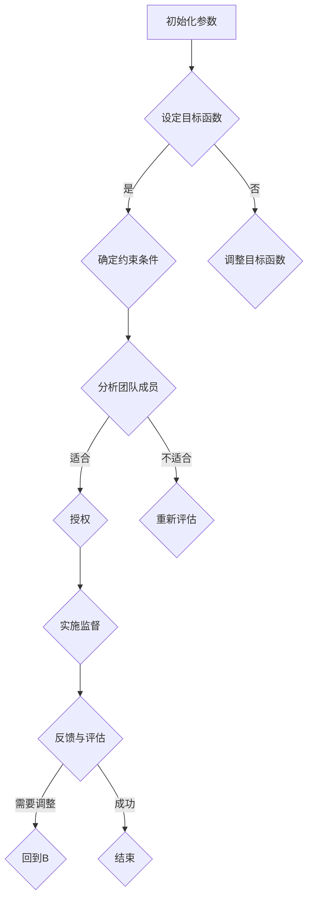

                 


# 领导者的授权艺术：信任与监督的平衡

> 关键词：授权、信任、监督、领导者、团队效能

> 摘要：本文深入探讨了领导者如何通过授权艺术来平衡信任与监督，提高团队效率和创造力。通过分析授权的定义与类型、信任的要素与建立、监督的机制与方式，本文提供了一套全面的授权策略，帮助领导者克服授权中的难题，实现组织目标。

## 第一部分：背景介绍

### 1.1.1 问题背景

在当今快节奏的商业环境中，领导者面临的挑战日益复杂。有效地授权已经成为提高组织效率、激发团队成员潜力和实现战略目标的关键。然而，许多领导者对如何平衡信任与监督感到困惑，这直接影响到团队的士气和组织的整体绩效。

### 1.1.2 问题描述

授权是指领导者将权力和责任委派给下属的过程。然而，授权并不简单地将任务交给员工，而是涉及到建立信任、设置合理的监督机制，以及如何通过授权来提高团队效率和创造力。领导者需要在信任与监督之间找到平衡，以避免过度控制或完全放手导致的问题。

### 1.1.3 问题解决

本文旨在提供一套全面的框架，帮助领导者克服授权中的常见难题，从而实现团队与个人绩效的提升。通过系统地介绍授权的理论基础和实践技巧，领导者可以学会如何建立信任、设置合理的监督机制，并有效地进行授权。

### 1.1.4 边界与外延

虽然本文主要关注领导者在组织中的授权实践，但其核心原则同样适用于不同层次的管理者，包括部门经理、项目经理以及团队领导。同时，本文还将探讨不同文化背景和组织结构对授权实践的影响。

### 1.1.5 概念结构与核心要素组成

授权艺术的核心要素包括：

- 授权艺术：包括信任的建立、责任的划分、权力的下放和反馈机制的建立。
- 信任与监督的平衡：如何在信任员工的同时确保工作目标的实现。
- 领导者角色转变：从管理者到激励者和支持者的角色转换。
- 团队效能：授权如何影响团队协作、创造力和问题解决能力。

### 1.1.6 关键问题与讨论

本文将讨论以下关键问题：

- 授权与责任：如何明确授权范围和责任归属。
- 信任与文化：组织文化如何影响授权实践。
- 监督与反馈：如何设计有效的监督机制并给予及时反馈。

## 第一部分：核心概念与联系

### 1.2.1 授权的定义与类型

授权是指领导者将权力和责任委派给下属的过程。根据授权的程度和方式，可以分为以下几种类型：

- **完全授权**：领导者将任务、责任和权力全部下放。
- **部分授权**：领导者仅下放部分任务或责任。
- **象征性授权**：领导者下放任务，但不赋予实际权力。

### 1.2.2 信任的要素与建立

信任是授权成功的关键。建立信任需要以下几个要素：

- **透明沟通**：开放、诚实和及时的沟通有助于建立信任。
- **共同目标**：团队成员对目标的共同理解和承诺增强信任。
- **责任感**：个体对任务的认真态度和责任心是信任的基础。
- **一致性**：领导者的一致性和可靠性增强团队成员的信任。

### 1.2.3 监督的机制与方式

监督是确保授权任务完成的重要手段。有效的监督机制包括：

- **定期检查**：通过定期检查工作进度和结果来确保任务的完成。
- **反馈机制**：及时给予反馈，鼓励团队成员改进。
- **绩效评估**：定期对团队成员的工作表现进行评估。
- **适应性监督**：根据团队和工作任务的变化调整监督方式。

## 第二部分：算法原理讲解

### 2.1 授权算法的基本原理

授权算法旨在帮助领导者确定最佳的授权策略，确保在信任与监督之间达到平衡。基本原理包括：

- **目标函数**：最大化团队绩效和员工满意度。
- **约束条件**：确保任务的完成质量和团队的稳定性。
- **决策变量**：授权的程度、范围和监督机制。

### 2.2 授权算法的 Mermaid 流程图



### 2.3 Python 源代码实现

```python
# 授权算法的Python实现

def authorization_algorithm(team_members, task, goals, constraints):
    # 初始化参数
    for member in team_members:
        member['authorized'] = False
        member['monitored'] = False
    
    # 设定目标函数
    objective_function = maximize_performance_and_satisfaction
    
    # 确定约束条件
    constraints_satisfied = check_constraints(constraints)
    
    while not constraints_satisfied:
        # 调整目标函数
        objective_function = adjust_objective_function(objective_function)
        
        # 确定约束条件
        constraints_satisfied = check_constraints(constraints)
    
    # 分析团队成员
    for member in team_members:
        if is_team_member_fit_for_task(member, task):
            # 授权
            member['authorized'] = True
            member['monitored'] = True
            implement_supervision(member)
        else:
            # 重新评估
            reevaluate_team_member(member)
    
    # 反馈与评估
    evaluate_and_feedbac``` ----------------------------------------------------------------

## 第三部分：授权实践的案例分析

### 3.1 案例背景

为了更好地理解授权艺术，我们来看一个实际案例。某公司是一家快速发展的科技公司，其CEO李先生面临着一个关键的决策：是否将一个关键项目完全授权给他的产品团队。

### 3.2 案例分析

1. **目标函数**：李先生的目标是在保证项目质量的前提下，提高团队的效率和创新能力。

2. **约束条件**：李先生设定的约束条件包括项目的时间限制、预算限制以及必须达到的质量标准。

3. **决策变量**：李先生需要决定授权的程度（完全授权、部分授权或象征性授权），以及如何实施监督机制。

4. **团队成员分析**：李先生分析了团队成员的能力和经验，发现产品团队有足够的能力和经验来承担这个项目。

5. **授权**：李先生决定完全授权给产品团队，并设定了明确的监督机制，包括定期的项目进度会议和绩效评估。

6. **监督**：通过定期的项目进度会议，李先生能够及时了解项目进展，并提供必要的支持和指导。同时，他建立了绩效评估机制，确保项目按照既定标准完成。

7. **反馈与评估**：项目完成后，李先生对产品团队进行了全面的绩效评估，并根据评估结果给予了相应的奖励和反馈。

### 3.3 案例结论

通过这个案例，我们可以看到，李先生成功地运用了授权艺术，在信任与监督之间找到了平衡。他的决策不仅提高了团队的效率，还激发了团队成员的创造力，最终成功地完成了项目。

## 第四部分：领导者如何平衡信任与监督

### 4.1 建立信任的重要性

建立信任是授权成功的关键。领导者需要通过以下方式来建立信任：

- **透明沟通**：保持沟通渠道的畅通，及时传达信息。
- **共同目标**：确保团队成员对组织目标的认同。
- **责任感**：鼓励团队成员对任务负责。
- **一致性**：保持一致的行动和决策。

### 4.2 监督的艺术

有效的监督可以确保工作目标的实现，同时不会扼杀团队的创造力。领导者需要掌握以下监督艺术：

- **适度监督**：在信任的基础上，适度地进行监督。
- **反馈机制**：及时给予反馈，鼓励团队成员改进。
- **绩效评估**：定期评估团队成员的表现，确保目标的实现。

### 4.3 平衡的艺术

领导者需要掌握如何在信任与监督之间找到平衡。以下是一些策略：

- **明确授权范围**：确保团队成员清楚自己的职责和权限。
- **灵活调整**：根据团队成员的表现和工作环境的变化，灵活调整监督方式。
- **信任与监督的结合**：在信任的基础上，适当引入监督机制。

## 第五部分：授权艺术的未来发展趋势

### 5.1 科技的进步

随着人工智能、大数据和云计算等技术的进步，授权艺术也在不断进化。领导者可以利用这些技术来提高授权的效率和效果。

### 5.2 组织结构的变革

扁平化的组织结构正在取代传统的层级结构，这为授权提供了更多的可能性。领导者需要适应这种变化，充分利用授权来激发团队的潜力。

### 5.3 持续学习

授权艺术是一个不断发展的领域，领导者需要持续学习新的理论和实践技巧。通过不断学习，领导者可以更好地应对不断变化的工作环境。

## 结论

授权艺术是领导者的一项关键技能，它关系到团队效率和组织的整体绩效。通过建立信任、设置合理的监督机制，以及不断地调整和优化授权策略，领导者可以在信任与监督之间找到平衡，从而实现组织的目标。

### 作者

作者：AI天才研究院/AI Genius Institute & 禅与计算机程序设计艺术 /Zen And The Art of Computer Programming

## 最佳实践 Tips

1. **明确目标和责任**：在授权之前，确保团队成员对目标和责任有清晰的认识。
2. **建立信任**：通过透明沟通和共同目标来建立信任。
3. **适度监督**：在信任的基础上，适度地进行监督。
4. **及时反馈**：给予团队成员及时、具体的反馈，帮助他们改进。
5. **持续学习**：不断学习新的授权理论和实践技巧。

### 小结

本文通过分析授权的定义与类型、信任的要素与建立、监督的机制与方式，提供了一套全面的授权策略。通过实际案例的分析，本文展示了如何在实际工作中运用授权艺术，实现团队与个人绩效的提升。

### 注意事项

1. **授权并非放权**：授权是领导者将权力和责任委派给下属，但并不意味着领导者可以完全放手。
2. **信任与监督的平衡**：领导者需要在信任与监督之间找到合适的平衡点。
3. **文化适应**：不同组织的文化背景可能影响授权实践，领导者需要根据实际情况进行调整。

### 拓展阅读

- 《高效能人士的七个习惯》
- 《领导者的艺术》
- 《团队协作的艺术》

通过不断学习和实践，领导者可以不断提升授权艺术，从而实现组织的长远发展。让我们继续探索授权艺术的奥秘，为团队和组织创造更大的价值！

