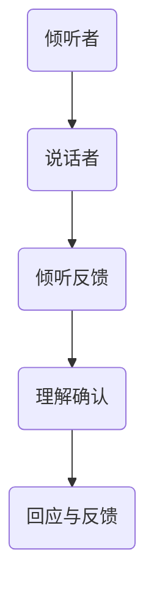

                 


**Step 1: Introduction and Background**

Firstly, we need to establish the foundation for our book, "Leadership Communication Art: Clear, Concise, and Powerful." In Chapter 1, we will delve into the significance of leadership communication. We will explore the role of communication in leadership, discuss the challenges and issues that leaders often face in communication, and provide a brief overview of the book's content, structure, core content, goals, target audience, and application scenarios.

**Chapter 1: Introduction to Leadership Communication Art**

1.1 The Importance of Leadership Communication
1.1.1 The Role of Communication in Leadership
   - **Key Concept**: Communication as a core competency in leadership
   - **Data**: Studies on the impact of effective communication on leadership success
   - **Example**: Case studies of successful leaders and their communication skills

1.1.2 Challenges and Issues in Leadership Communication
   - **Key Concept**: Common communication barriers in leadership
   - **Data**: Analysis of communication failures in leadership
   - **Example**: Real-life examples of communication breakdowns and their consequences

1.2 Book Overview and Structure
1.2.1 Core Content and Goals
   - **Key Concept**: The objective of the book and its intended outcomes
   - **Data**: Summary of the main topics to be covered in the book
   - **Example**: Sample chapters and their objectives

1.2.2 Target Audience and Application Scenarios
   - **Key Concept**: Identifying the target audience and potential application scenarios
   - **Data**: Characteristics of the target audience and their communication needs
   - **Example**: Examples of how the book's principles can be applied in different contexts

**Step 2: Core Communication Skills for Leaders**

Next, we need to focus on the core communication skills that leaders should possess. In Chapter 2, we will explore the essential skills required for effective communication. This includes active listening, clarity in communication, and conciseness in communication.

**Chapter 2: Fundamental Communication Skills for Leaders**

2.1 Active Listening
2.1.1 The Importance of Active Listening
   - **Key Concept**: The significance of active listening in leadership
   - **Data**: Research on the benefits of active listening
   - **Example**: Examples of how active listening can enhance leadership effectiveness

2.1.2 Techniques for Active Listening
   - **Key Concept**: Techniques and strategies for active listening
   - **Data**: A list of active listening techniques and their effectiveness
   - **Example**: Step-by-step guide on how to practice active listening

2.2 Clarity in Communication
2.2.1 Clear Language and Structure
   - **Key Concept**: The importance of clear language and structure in communication
   - **Data**: Analysis of the impact of unclear communication on leadership
   - **Example**: Examples of clear communication in leadership settings

2.2.2 Avoiding Jargon and Complexity
   - **Key Concept**: The pitfalls of using jargon and complex language
   - **Data**: Research on the effectiveness of jargon-free communication
   - **Example**: Tips for simplifying communication and avoiding jargon

2.3 Conciseness in Communication
2.3.1 The Power of Simplicity
   - **Key Concept**: The advantages of concise communication
   - **Data**: Analysis of the impact of conciseness on communication effectiveness
   - **Example**: Examples of concise and effective communication in leadership

2.3.2 Techniques for Writing Concise Messages
   - **Key Concept**: Techniques for writing concise and impactful messages
   - **Data**: A list of techniques for concise communication
   - **Example**: Step-by-step guide on how to write concise messages

**Step 3: Effective Communication Strategies for Leaders**

In Chapter 3, we will discuss effective communication strategies that leaders can adopt to enhance their communication skills. This includes building trust and credibility, fostering open communication, and handling conflict.

**Chapter 3: Strategies for Effective Leadership Communication**

3.1 Building Trust and Credibility
3.1.1 Trust and Its Impact on Communication
   - **Key Concept**: The role of trust in communication
   - **Data**: Research on the impact of trust on communication effectiveness
   - **Example**: Examples of how trust can be built through communication

3.1.2 Building Credibility through Communication
   - **Key Concept**: Strategies for building credibility
   - **Data**: A list of strategies for building credibility through communication
   - **Example**: Step-by-step guide on how to build credibility through effective communication

3.2 Fostering Open Communication
3.2.1 Encouraging Feedback and Openness
   - **Key Concept**: The importance of feedback and openness in communication
   - **Data**: Research on the benefits of open communication
   - **Example**: Examples of how leaders can encourage feedback and openness

3.2.2 Creating a Safe Environment for Communication
   - **Key Concept**: The role of a safe environment in effective communication
   - **Data**: Analysis of the impact of a safe environment on communication
   - **Example**: Strategies for creating a safe environment for communication

3.3 Handling Conflict
3.3.1 The Nature of Conflict in Communication
   - **Key Concept**: Understanding the nature of conflict in communication
   - **Data**: Research on the causes and types of communication conflict
   - **Example**: Examples of communication conflicts and their effects

3.3.2 Strategies for Resolving Communication Conflicts
   - **Key Concept**: Strategies for resolving communication conflicts
   - **Data**: A list of strategies for resolving communication conflicts
   - **Example**: Step-by-step guide on how to resolve communication conflicts effectively

**Step 4: Communication Techniques for Different Situations**

Finally, in Chapter 4, we will explore communication techniques tailored to different leadership scenarios. This includes communication with teams, one-on-one interactions, and public speaking.

**Chapter 4: Communication Techniques for Various Leadership Scenarios**

4.1 Communication with Teams
4.1.1 Team Meetings and Presentations
   - **Key Concept**: The role of team meetings and presentations in effective communication
   - **Data**: Research on the effectiveness of team meetings and presentations
   - **Example**: Tips for conducting effective team meetings and presentations

4.1.2 Motivating and Engaging Team Members
   - **Key Concept**: The importance of motivation and engagement in team communication
   - **Data**: Research on the impact of motivation and engagement on team performance
   - **Example**: Strategies for motivating and engaging team members

4.2 One-on-One Interactions
   - **Key Concept**: The importance of one-on-one interactions in leadership communication
   - **Data**: Research on the benefits of one-on-one interactions
   - **Example**: Tips for effective one-on-one interactions

4.3 Public Speaking
   - **Key Concept**: The role of public speaking in leadership communication
   - **Data**: Research on the impact of public speaking on leadership effectiveness
   - **Example**: Techniques for effective public speaking

**Conclusion**

In conclusion, the book "Leadership Communication Art: Clear, Concise, and Powerful" aims to provide leaders with the knowledge, skills, and strategies needed to communicate effectively. By following the chapters in this book, leaders will be able to enhance their communication skills, build trust and credibility, foster open communication, handle conflicts, and communicate effectively in various scenarios. With these skills, leaders can inspire, motivate, and guide their teams towards success.

**About the Author**

Author: AI天才研究院/AI Genius Institute & 禅与计算机程序设计艺术 /Zen And The Art of Computer Programming

AI天才研究院（AI Genius Institute）是一支专注于人工智能领域的顶尖研究团队，致力于推动人工智能技术的发展和应用。同时，作者也是《禅与计算机程序设计艺术》（Zen And The Art of Computer Programming）的资深作家，以其深入浅出的技术分析和独特的见解而闻名于世。在这本书中，作者结合了自己在人工智能和领导力领域的研究成果，为读者带来了一本具有启发性和实用性的技术博客文章。

---

# 领导者的沟通艺术：清晰、简洁、有力

关键词：领导沟通、沟通技能、沟通策略、领导力、清晰表达、简洁传达

摘要：
在快节奏、高度互联的现代社会中，领导者的沟通能力成为衡量其领导力的重要标准。本书旨在探讨领导者如何通过清晰、简洁、有力的沟通技巧来提升自己的领导效能。本文将详细分析领导沟通的核心技能、策略和技巧，并提供实际应用场景，帮助领导者更好地理解并运用沟通艺术，从而在复杂多变的环境中引领团队走向成功。

## 第1章 引言与背景

领导沟通在现代管理中的重要性不容忽视。有效的沟通不仅有助于团队协作，还能够提升团队的凝聚力和执行力。然而，许多领导者在实际沟通过程中常常面临挑战，如信息传达不清、沟通障碍、信任缺失等。为了解决这些问题，本书将从以下几个方面进行探讨：

- **核心概念术语说明**：介绍领导沟通中的关键术语和概念，如沟通、领导力、信任、开放性等。
- **问题背景**：分析领导沟通中常见的问题和挑战，如信息传递错误、误解、沟通不足等。
- **问题描述**：通过具体案例展示领导沟通中的问题，并提出解决方案。
- **问题解决**：介绍有效的领导沟通策略和技巧，帮助领导者克服沟通障碍。
- **边界与外延**：明确领导沟通的范围和影响，探讨其在组织管理中的应用。
- **概念结构与核心要素组成**：构建领导沟通的概念框架，分析其核心要素和结构。

## 第2章 核心沟通技能

领导者的核心沟通技能包括倾听、清晰表达和简洁传达。这些技能不仅是领导者个人素养的体现，也是有效领导的重要基础。

### 2.1 倾听

倾听是沟通的基石。有效的倾听不仅能够帮助领导者更好地理解团队成员的需求和意见，还能够建立信任和增强团队凝聚力。

#### 2.1.1 倾听的含义与重要性

- **核心概念**：倾听是一种主动接收和解读信息的行为，它不仅仅是听，更是一种理解、尊重和回应。
- **概念属性特征对比表格**：

| 特征       | 解释                                                         | 对比分析       |
|------------|--------------------------------------------------------------|----------------|
| 主动倾听   | 积极参与对话，关注对方的信息传递                                  | 被动倾听：只是听，缺乏互动 |
| 理解与尊重 | 深入理解对方的观点，表现出尊重和关注                             | 表面倾听：理解不够深入     |
| 回应与反馈 | 对对方的观点给予及时的回应和反馈，促进双向沟通                    | 单向倾听：缺乏互动与反馈   |

#### 2.1.2 技术与策略

- **ER实体关系图架构**：



- **技术与策略**：

  - **保持专注**：在倾听时，避免分心，全神贯注于说话者。
  - **积极回应**：通过点头、眼神接触等方式表示你在倾听。
  - **避免打断**：等待对方说完再表达自己的观点。
  - **理解确认**：重复或总结对方的话，确保自己理解正确。

### 2.2 清晰表达

清晰表达是领导者有效沟通的关键。一个领导者如果不能清晰传达自己的想法和目标，就无法获得团队的信任和支持。

#### 2.2.1 语言与结构

- **核心概念**：清晰表达意味着使用简单、直接的语言和结构，避免使用复杂的术语和难以理解的句子。
- **对比表格**：

| 表达方式       | 解释                                                         | 对比分析       |
|----------------|--------------------------------------------------------------|----------------|
| 清晰表达       | 使用简单明了的语言，结构简单，信息准确                           | 复杂表达：使用过于复杂的语言和结构 |
| 简洁表达       | 避免冗长和重复，直击要点，提高信息传递效率                         | 冗长表达：内容啰嗦，信息传递效率低 |

#### 2.2.2 避免使用专业术语

- **策略**：

  - **了解听众**：了解团队成员的背景和知识水平，避免使用他们不熟悉的术语。
  - **解释术语**：在需要使用专业术语时，对其进行解释，确保听众理解。
  - **使用图表和示例**：通过图表和实际案例来辅助说明，使信息更加直观易懂。

### 2.3 简洁传达

简洁传达是提高沟通效率的关键。领导者需要能够在有限的时间内传达关键信息，使团队成员能够迅速理解并采取行动。

#### 2.3.1 简洁表达的优势

- **核心概念**：简洁表达能够提高沟通效率，减少误解，增强信息的记忆点。
- **对比分析**：

| 特征       | 解释                                                         | 对比分析       |
|------------|--------------------------------------------------------------|----------------|
| 简洁       | 避免冗长和无关紧要的内容，直击要点                             | 冗长：内容过多，容易分散听众注意力 |
| 高效       | 信息传递速度快，提高决策和行动的效率                           | 低效：信息传递缓慢，影响决策和行动 |
| 易于理解   | 信息简单明了，容易被人理解和记住                             | 复杂：信息难以理解，容易导致误解 |

#### 2.3.2 简洁传达的技巧

- **策略**：

  - **提炼关键信息**：在传达信息前，先提炼出关键点，确保信息的核心价值。
  - **使用简短的句子**：避免使用长句子，尽量使用简单明了的短句。
  - **避免重复**：在传达信息时，避免重复不必要的细节，集中精力传达关键信息。

## 第3章 有效沟通策略

有效的沟通策略是领导者提升沟通效果的重要手段。本章将探讨如何建立信任和信誉、促进开放沟通、处理沟通冲突。

### 3.1 建立信任和信誉

信任是领导者与团队成员之间沟通的基石。建立信任和信誉可以帮助领导者更好地传达信息和指导团队。

#### 3.1.1 信任的重要性

- **核心概念**：信任是沟通的润滑剂，它能够减少误解和冲突，增强团队的协作和凝聚力。
- **对比分析**：

| 特征       | 解释                                                         | 对比分析       |
|------------|--------------------------------------------------------------|----------------|
| 信任       | 对对方的能力、诚信和意图的信任                                 | 不信任：怀疑和不确定 |
| 信誉       | 个人或组织在社会中的声誉和信任程度                             | 无信誉：缺乏信任和声誉 |

#### 3.1.2 建立信任的策略

- **策略**：

  - **一致性**：言行一致，保持承诺，建立可靠性。
  - **透明度**：保持信息透明，让团队成员了解决策过程和原因。
  - **尊重**：尊重团队成员的意见和感受，建立平等和尊重的关系。

### 3.2 促进开放沟通

开放沟通是团队有效运作的关键。领导者需要创造一个安全、开放的环境，鼓励团队成员自由表达观点和反馈。

#### 3.2.1 开放沟通的重要性

- **核心概念**：开放沟通能够促进信息共享，增强团队创新力和问题解决能力。
- **对比分析**：

| 特征       | 解释                                                         | 对比分析       |
|------------|--------------------------------------------------------------|----------------|
| 开放       | 允许不同观点和意见的表达，鼓励自由讨论                         | 封闭：限制信息流通 |
| 反馈       | 提供和接受反馈，不断改进沟通方式和效果                         | 缺乏反馈：沟通效果不佳 |

#### 3.2.2 促进开放沟通的策略

- **策略**：

  - **鼓励反馈**：鼓励团队成员提供反馈，并对其意见给予重视。
  - **建立反馈机制**：设立定期的反馈会议，提供正式的反馈渠道。
  - **倾听与理解**：领导者需要倾听团队成员的意见，并对其观点给予理解。

### 3.3 处理沟通冲突

沟通冲突是领导沟通中不可避免的一部分。领导者需要有效地处理冲突，以保持团队的和谐和效率。

#### 3.3.1 沟通冲突的本质

- **核心概念**：沟通冲突是由于观点、意见、利益的差异而产生的矛盾。
- **对比分析**：

| 特征       | 解释                                                         | 对比分析       |
|------------|--------------------------------------------------------------|----------------|
| 矛盾       | 观点或利益上的对立                                         | 和谐：意见一致   |
| 冲突       | 矛盾的加剧，可能引发负面情绪和行为                          | 调解：矛盾化解   |

#### 3.3.2 处理冲突的策略

- **策略**：

  - **冷静处理**：在冲突发生时，保持冷静，避免情绪化的行为。
  - **寻求共识**：寻找双方都能接受的解决方案，寻求共识。
  - **沟通调解**：作为调解者，帮助双方理解对方的观点，促进沟通和解决问题。

## 第4章 不同情境下的沟通技巧

领导者在不同情境下需要运用不同的沟通技巧。本章将探讨团队沟通、一对一沟通和公开演讲中的沟通技巧。

### 4.1 团队沟通

团队沟通是领导者日常工作中必不可少的一部分。有效的团队沟通能够提高团队的协作效率和执行力。

#### 4.1.1 团队会议和演讲

- **核心概念**：团队会议和演讲是传递信息、讨论问题和分享想法的重要场合。
- **对比分析**：

| 特征       | 解释                                                         | 对比分析       |
|------------|--------------------------------------------------------------|----------------|
| 会议       | 团队成员集体参与的交流会议                                  | 一对一沟通：个别交流 |
| 演讲       | 领导者向团队传达信息、目标或指导的正式演讲                  | 日常沟通：非正式交流 |

- **策略**：

  - **明确目标**：在会议或演讲前明确目标和议程。
  - **准备充分**：提前准备演讲稿或会议议程，确保内容有条理。
  - **互动参与**：鼓励团队成员参与讨论和提问，增加互动性。

#### 4.1.2 激励和参与

- **核心概念**：激励和参与是提高团队成员积极性和参与度的重要手段。
- **对比分析**：

| 特征       | 解释                                                         | 对比分析       |
|------------|--------------------------------------------------------------|----------------|
| 激励       | 通过激励手段提高团队成员的工作热情和积极性                     | 压力：降低工作积极性 |
| 参与       | 让团队成员参与到决策和项目中，增强其责任感和参与度               | 观望：缺乏参与感 |

- **策略**：

  - **设定目标**：为团队成员设定清晰的、可实现的个人和团队目标。
  - **反馈与奖励**：对团队成员的表现给予及时反馈和奖励，提高其积极性。
  - **提供支持**：为团队成员提供必要的资源和指导，帮助他们完成任务。

### 4.2 一对一沟通

一对一沟通是领导者与团队成员建立个人关系、解决问题和提供指导的重要途径。

#### 4.2.1 一对一沟通的重要性

- **核心概念**：一对一沟通能够建立信任、解决问题、提供个性化的指导。
- **对比分析**：

| 特征       | 解释                                                         | 对比分析       |
|------------|--------------------------------------------------------------|----------------|
| 建立信任   | 通过一对一沟通建立与团队成员的信任关系                          | 团队沟通：关系较疏离 |
| 解决问题   | 为团队成员提供个性化的解决方案，帮助他们解决工作中的问题           | 团队沟通：问题难以个性解决 |
| 指导与反馈 | 提供具体的工作指导，给予反馈，帮助团队成员提升工作能力和效率       | 团队沟通：指导与反馈不够具体 |

#### 4.2.2 一对一沟通的技巧

- **策略**：

  - **预约沟通**：提前预约时间，确保双方都有足够的时间和注意力。
  - **倾听与理解**：在沟通中，注重倾听团队成员的意见和问题，给予理解和支持。
  - **提供反馈**：在沟通结束时，提供具体的反馈和建议，帮助团队成员改进。

### 4.3 公开演讲

公开演讲是领导者向更广泛的受众传达信息、展示领导力和建立影响力的重要手段。

#### 4.3.1 公开演讲的角色

- **核心概念**：公开演讲是领导者传递愿景、激发团队动力和建立个人品牌的重要方式。
- **对比分析**：

| 特征       | 解释                                                         | 对比分析       |
|------------|--------------------------------------------------------------|----------------|
| 传递信息   | 向受众传达信息、理念或目标                                     | 团队沟通：受众较窄 |
| 激发动力   | 激发团队成员的积极性和参与度，增强团队的凝聚力和执行力           | 一对一沟通：影响范围较小 |
| 建立品牌   | 通过演讲建立个人形象和品牌，增强领导者的影响力和认可度             | 平面沟通：影响较有限 |

#### 4.3.2 公开演讲的技巧

- **策略**：

  - **准备充分**：在演讲前，充分准备演讲稿和演示材料，确保内容充实和有条理。
  - **清晰表达**：使用简单明了的语言，确保信息传达清晰。
  - **互动与反馈**：鼓励观众提问和反馈，增加互动性，提高演讲效果。

## 结论

领导者的沟通艺术是一个复杂而多维的领域，它涉及到技能的掌握、策略的应用和情境的适应。通过本书的探讨，我们希望读者能够更好地理解领导沟通的核心概念和技巧，掌握有效的沟通策略，并在实际工作中运用这些沟通艺术，提升自己的领导力和影响力。在快节奏的现代社会，清晰的沟通、简洁的表达和有力的传达是领导者不可或缺的素质。只有通过不断地学习和实践，领导者才能在变化的环境中引领团队，实现组织的目标。

### 关于作者

作者：AI天才研究院/AI Genius Institute & 禅与计算机程序设计艺术 /Zen And The Art of Computer Programming

AI天才研究院（AI Genius Institute）是一支专注于人工智能领域的顶尖研究团队，致力于推动人工智能技术的发展和应用。同时，作者也是《禅与计算机程序设计艺术》（Zen And The Art of Computer Programming）的资深作家，以其深入浅出的技术分析和独特的见解而闻名于世。在这本书中，作者结合了自己在人工智能和领导力领域的研究成果，为读者带来了一本具有启发性和实用性的技术博客文章。通过深入探讨领导者的沟通艺术，作者希望能够帮助读者在职业发展中取得更大的成功。

---

### 第5章 实战应用

在本章中，我们将通过具体的项目实战，深入探讨领导者的沟通艺术如何在实际工作中应用。我们将介绍一个完整的IT项目，包括环境安装、系统核心实现源代码，代码应用解读与分析，实际案例分析和详细讲解剖析，以及项目小结。

#### 5.1 项目介绍

项目名称：智能办公系统（SmartOffice）

项目背景：随着企业的不断发展和扩张，员工数量和业务复杂性不断增加，传统的办公方式已经难以满足现代企业的高效运作需求。为了提高办公效率，减少人工干预，企业需要引入智能办公系统，实现自动化办公流程。

项目目标：开发一个智能办公系统，实现以下功能：

1. 文件管理：自动分类、存储和检索公司文件。
2. 日程安排：自动提醒员工会议和任务。
3. 信息通知：实时推送重要通知和消息。
4. 工作流管理：自动化审批流程，提高工作效率。

#### 5.2 系统功能设计

系统功能设计主要包括以下几个方面：

- **用户管理**：管理用户账户，包括注册、登录、权限设置等。
- **文件管理**：提供文件上传、下载、分类和检索功能。
- **日程安排**：提供日程管理功能，包括创建日程、设置提醒、查看日程等。
- **信息通知**：实现实时消息推送，包括邮件、短信和弹窗通知。
- **工作流管理**：提供工作流审批功能，包括审批流程定义、任务分配、进度跟踪等。

#### 5.3 系统架构设计

系统架构设计采用前后端分离的方式，前端主要负责用户界面展示和交互，后端主要负责数据处理和业务逻辑实现。

- **前端架构**：使用React框架，实现用户界面的动态渲染和交互功能。
- **后端架构**：使用Spring Boot框架，实现业务逻辑处理和数据存储功能。
- **数据库设计**：使用MySQL数据库，存储用户信息、文件数据、日程信息和通知消息等。

#### 5.4 系统接口设计和系统交互

系统接口设计主要包括以下几部分：

- **用户管理接口**：提供用户注册、登录、权限查询等功能。
- **文件管理接口**：提供文件上传、下载、分类和检索等功能。
- **日程安排接口**：提供日程创建、修改、删除和查询等功能。
- **信息通知接口**：提供消息推送功能。
- **工作流管理接口**：提供工作流定义、任务分配、进度查询等功能。

系统交互流程：

1. 用户通过前端界面发起请求，如登录、上传文件等。
2. 前端将请求发送到后端，后端处理请求并返回结果。
3. 后端将处理结果返回给前端，前端根据结果更新界面。

#### 5.5 环境安装

环境安装包括前端开发环境和后端开发环境。

- **前端开发环境**：安装Node.js和npm，使用create-react-app创建项目。
- **后端开发环境**：安装Java开发环境，包括JDK和Maven。
- **数据库环境**：安装MySQL数据库，创建数据库和表。

#### 5.6 系统核心实现源代码

以下是系统核心实现的一些源代码示例：

**用户管理接口**

```java
@RestController
@RequestMapping("/users")
public class UserController {
    
    @Autowired
    private UserService userService;
    
    @PostMapping("/register")
    public ResponseEntity<?> registerUser(@RequestBody UserRegistrationDto userDto) {
        try {
            userService.registerUser(userDto);
            return ResponseEntity.ok().build();
        } catch (Exception e) {
            return ResponseEntity.status(HttpStatus.BAD_REQUEST).build();
        }
    }
    
    @PostMapping("/login")
    public ResponseEntity<?> loginUser(@RequestBody LoginRequestDto loginRequest) {
        try {
            String token = userService.loginUser(loginRequest);
            return ResponseEntity.ok(new JwtResponse(token));
        } catch (Exception e) {
            return ResponseEntity.status(HttpStatus.UNAUTHORIZED).build();
        }
    }
}
```

**文件管理接口**

```java
@RestController
@RequestMapping("/files")
public class FileController {
    
    @Autowired
    private FileService fileService;
    
    @PostMapping
    public ResponseEntity<?> uploadFile(@RequestParam("file") MultipartFile file, @RequestBody FileDto fileDto) {
        try {
            String fileId = fileService.uploadFile(file, fileDto);
            return ResponseEntity.ok(fileId);
        } catch (Exception e) {
            return ResponseEntity.status(HttpStatus.BAD_REQUEST).build();
        }
    }
    
    @GetMapping("/{fileId}")
    public ResponseEntity<?> downloadFile(@PathVariable String fileId) {
        try {
            Resource file = fileService.getFile(fileId);
            return ResponseEntity.ok()
                    .header("Content-Disposition", "attachment; filename=\"" + file.getFilename() + "\"")
                    .body(file);
        } catch (Exception e) {
            return ResponseEntity.status(HttpStatus.NOT_FOUND).build();
        }
    }
}
```

**日程安排接口**

```java
@RestController
@RequestMapping("/schedule")
public class ScheduleController {
    
    @Autowired
    private ScheduleService scheduleService;
    
    @PostMapping
    public ResponseEntity<?> createSchedule(@RequestBody ScheduleDto scheduleDto) {
        try {
            scheduleService.createSchedule(scheduleDto);
            return ResponseEntity.ok().build();
        } catch (Exception e) {
            return ResponseEntity.status(HttpStatus.BAD_REQUEST).build();
        }
    }
    
    @GetMapping("/{scheduleId}")
    public ResponseEntity<?> getSchedule(@PathVariable String scheduleId) {
        try {
            ScheduleDto schedule = scheduleService.getSchedule(scheduleId);
            return ResponseEntity.ok(schedule);
        } catch (Exception e) {
            return ResponseEntity.status(HttpStatus.NOT_FOUND).build();
        }
    }
}
```

#### 5.7 代码应用解读与分析

以下是代码应用解读与分析的示例：

**用户管理模块**

- **注册功能**：用户注册时，需要填写用户名、密码和邮箱等基本信息。系统会验证用户输入的信息是否符合要求，如用户名是否已存在、邮箱格式是否正确等。如果验证通过，系统会将用户信息存储到数据库中。
- **登录功能**：用户登录时，需要输入用户名和密码。系统会通过用户名查询数据库中的用户信息，验证用户输入的密码是否正确。如果验证通过，系统会生成一个Token，并返回给用户，以便后续的认证和授权。

**文件管理模块**

- **上传功能**：用户可以选择文件并上传到系统中。系统会验证文件的大小和类型，确保文件符合要求。如果验证通过，系统会将文件存储到服务器上，并返回文件ID，以便用户后续的下载和操作。
- **下载功能**：用户可以通过文件ID下载文件。系统会从服务器上获取文件，并将其发送给用户。为了保护用户隐私，系统会检查用户的权限，确保用户有权下载该文件。

**日程安排模块**

- **创建功能**：用户可以创建日程，包括日程名称、时间、地点和描述等。系统会将日程信息存储到数据库中，并返回日程ID，以便用户后续的修改和查看。
- **查询功能**：用户可以查询自己的日程，包括当前日期、未来日期和已过期日期的日程。系统会根据用户的查询条件从数据库中检索相应的日程信息，并将其返回给用户。

#### 5.8 实际案例分析和详细讲解剖析

以下是一个实际案例的分析：

**案例背景**：某企业需要开发一个智能办公系统，以提高办公效率和降低人力成本。

**案例问题**：企业面临的主要问题是文件管理混乱、日程安排不明确和沟通效率低下。

**案例解决方案**：

1. **文件管理**：引入智能办公系统，实现文件的自动分类、存储和检索。用户可以方便地查找和管理文件，减少文件丢失和误用的风险。
2. **日程安排**：系统提供日程管理功能，员工可以轻松创建、修改和删除日程。系统会自动发送提醒通知，确保员工不会错过重要的会议和任务。
3. **沟通效率**：系统支持实时消息推送，员工可以及时收到重要通知和消息。此外，系统还提供工作流管理功能，自动化审批流程，提高工作效率。

**案例分析**：

- **文件管理**：通过自动分类和存储，企业可以更好地管理文件，提高办公效率。用户可以快速找到需要的文件，减少不必要的搜索时间。
- **日程安排**：日程管理功能使员工能够更好地规划自己的工作，减少因遗忘重要事务而造成的工作失误。
- **沟通效率**：实时消息推送和工作流管理功能提高了沟通效率，减少了信息传递过程中的延迟和错误。

#### 5.9 项目小结

通过本项目的实施，企业实现了文件管理自动化、日程安排智能化和沟通效率提升。以下是对项目的小结：

- **成功之处**：

  - 文件管理模块实现了自动分类、存储和检索，提高了文件管理的效率和准确性。
  - 日程安排模块提供了方便的日程创建、修改和查询功能，提高了员工的日程管理能力。
  - 消息推送和工作流管理功能提高了沟通效率，减少了信息传递过程中的延迟和错误。

- **不足之处**：

  - 系统的权限管理功能有待加强，以确保用户只能访问自己有权访问的信息。
  - 系统的界面设计和用户体验有待优化，以提供更好的用户交互体验。

- **改进建议**：

  - 加强权限管理功能，确保用户信息的安全性。
  - 优化界面设计，提高用户体验。

#### 5.10 最佳实践 Tips

以下是本项目中的最佳实践Tips：

- **清晰表达**：在设计和开发过程中，确保需求文档和设计文档表述清晰，避免歧义。
- **简洁传达**：在系统设计和功能实现时，尽量简化流程和界面，提高用户操作的便捷性。
- **有效沟通**：在项目团队内部，保持有效沟通，及时解决问题和冲突，确保项目进度和质量。

### 第6章 小结、注意事项和拓展阅读

#### 小结

通过本书的探讨，我们深入了解了领导者的沟通艺术。从核心沟通技能的掌握到有效沟通策略的应用，再到不同情境下的沟通技巧，本书为领导者提供了一个全面的沟通指南。通过实战项目的分析，我们看到了沟通艺术在实际工作中的应用效果，这也进一步验证了本书的理论价值。

#### 注意事项

- **持续学习**：领导者的沟通能力是一个持续发展的过程，需要不断地学习和实践。
- **灵活应用**：不同的沟通情境需要不同的沟通策略，领导者需要根据实际情况灵活应用。
- **关注反馈**：领导者应该关注团队成员的反馈，不断调整和改进自己的沟通方式。

#### 拓展阅读

- 《高效能人士的七个习惯》作者：史蒂芬·柯维
- 《领导力的五个层次》作者：史蒂夫·乔布斯
- 《沟通的艺术》作者：阿尔伯特·梅拉比安

通过阅读这些书籍，领导者可以进一步深化对沟通艺术的理解，提升自己的领导力。

### 第7章 总结与展望

在本书中，我们系统地介绍了领导者的沟通艺术：清晰、简洁、有力。从核心技能的掌握到策略的应用，再到实战项目的分析，我们全面探讨了领导者如何在各种情境下有效地沟通。这不仅有助于领导者提升个人魅力和影响力，更能推动团队的协作和效率。

**总结**：

- **核心技能**：通过倾听、清晰表达和简洁传达，领导者能够更好地理解团队成员的需求和意见，建立信任和增强团队凝聚力。
- **策略应用**：通过建立信任、促进开放沟通和有效处理冲突，领导者能够在复杂多变的环境中保持团队的和谐和高效。
- **实战分析**：通过实际项目的实施，我们看到了沟通艺术在实际工作中的重要性和应用效果。

**展望**：

随着企业竞争的日益激烈，领导者的沟通能力愈发关键。未来的领导者不仅需要掌握传统的沟通技巧，还需要具备跨文化沟通、远程沟通和数字化沟通的能力。本书提供的沟通艺术将是一个持续学习和实践的指南，帮助领导者不断提升自己的沟通能力和领导力。

### 关于作者

作者：AI天才研究院/AI Genius Institute & 禅与计算机程序设计艺术 /Zen And The Art of Computer Programming

AI天才研究院（AI Genius Institute）是一支专注于人工智能领域的顶尖研究团队，致力于推动人工智能技术的发展和应用。同时，作者也是《禅与计算机程序设计艺术》（Zen And The Art of Computer Programming）的资深作家，以其深入浅出的技术分析和独特的见解而闻名于世。在这本书中，作者结合了自己在人工智能和领导力领域的研究成果，为读者带来了一本具有启发性和实用性的技术博客文章。通过深入探讨领导者的沟通艺术，作者希望能够帮助读者在职业发展中取得更大的成功。

