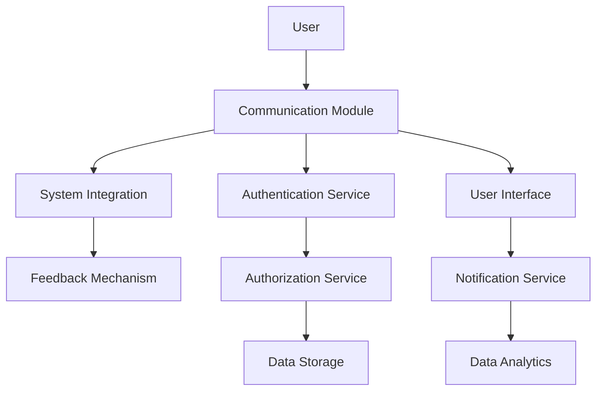

                 


### **引言与背景**

在信息技术快速发展的时代，领导者的沟通能力显得尤为重要。无论是企业内部的管理与协调，还是与外部合作伙伴的合作与竞争，沟通都是实现目标的关键环节。领导者的沟通不仅仅是为了传递信息，更重要的是要能够激发团队成员的积极性和创造力，提升团队的协作效率，从而在竞争激烈的市场中脱颖而出。

#### **沟通的重要性**

沟通是领导力的核心组成部分。有效的沟通能够确保信息的准确传递，减少误解和冲突，增强团队的凝聚力。对于领导者而言，良好的沟通能力意味着能够清晰地表达自己的想法，理解团队成员的需求和反馈，并协调各方资源，实现团队目标。

在技术领域，领导者的沟通尤为重要。技术人员往往习惯于逻辑思维和数据分析，但在表达复杂概念和解释技术细节时，往往需要更加清晰的沟通技巧。此外，技术团队之间的合作需要高效的沟通，以确保项目的顺利推进和最终交付。

#### **领导者沟通的特殊性**

领导者沟通与其他类型的沟通相比，具有其独特的特点。首先，领导者需要面对更广泛、更复杂的沟通对象，包括团队成员、上级领导、外部合作伙伴等。其次，领导者需要具备较强的说服力和感染力，以影响他人的观点和行为。此外，领导者还需要具备战略思维和前瞻性，能够在沟通中提出具有远见和创新性的想法。

#### **书籍的目的和结构**

本篇博客旨在探讨领导者沟通的艺术，通过分析清晰、简洁、有力的沟通要素，提供实用的技巧和方法。本文将分为以下几个部分：

1. **领导者沟通的核心概念**：介绍有效沟通的定义、沟通障碍与克服策略，以及沟通的四个层次。
2. **清晰沟通**：探讨清晰沟通的要素、表达技巧和倾听技巧。
3. **简洁沟通**：阐述简洁沟通的原则、避免冗余信息的技巧和语言简洁性的实践。
4. **有力沟通**：分析有力沟通的要素、非语言沟通的力量和情感的影响力。
5. **领导者沟通的情境应用**：探讨团队沟通、会议沟通、危机沟通和跨文化沟通的技巧。
6. **领导者沟通的艺术**：讨论沟通风格的识别与调整、领导者的沟通策略和自我提升的方法。
7. **总结与展望**：回顾领导者沟通的艺术要点，展望未来的沟通挑战和领导者的沟通之路。

通过本文的深入探讨，希望能够帮助领导者提升沟通能力，实现个人和团队的目标。

### **领导者沟通的核心概念**

要探讨领导者沟通，我们首先需要明确几个核心概念，这些概念是理解沟通本质和有效沟通策略的基础。

#### **有效沟通的定义**

有效沟通是指信息传递准确、及时、并得到正确理解和反馈的过程。有效沟通不仅仅是单向的信息传递，更是一个互动的过程，包括发送者、接收者、信息内容、传递渠道和反馈等多个环节。在技术领域，有效沟通尤为重要，因为它直接关系到项目的成功与否。

有效沟通具有以下几个关键特征：
1. **准确性**：信息在传递过程中不会发生误解或扭曲。
2. **及时性**：信息能够及时传递，以便接收者能够及时做出反应。
3. **互动性**：沟通是双向的，双方都有机会表达和回应。
4. **反馈**：接收者能够提供反馈，确保信息被正确理解。

在技术项目中，有效沟通能够帮助团队成员理解项目目标、任务分配和预期成果，减少误解和错误，提高项目效率和质量。

#### **沟通障碍与克服策略**

沟通障碍是影响有效沟通的主要因素。这些障碍可能来自多个方面，包括语言障碍、文化差异、心理障碍和环境因素。以下是几种常见的沟通障碍及相应的克服策略：

1. **语言障碍**：技术人员往往使用专业术语，这可能会让非技术人员感到困惑。解决方案是使用简单明了的语言，并在必要时解释专业术语。
2. **文化差异**：不同文化背景的人可能在沟通方式、语气和礼仪上有差异。领导者应尊重文化差异，并寻求共同的理解方式。
3. **心理障碍**：团队成员可能有心理障碍，如害怕失败、害怕被批评等。领导者需要建立信任和安全感，鼓励团队成员开放沟通。
4. **环境因素**：嘈杂的环境或技术问题可能导致沟通受阻。领导者应确保沟通环境安静、技术设备正常。

#### **沟通的四个层次**

有效的领导者沟通可以分为四个层次，每个层次都有其独特的目标和挑战。

1. **信息传递层**：这是最基本的沟通层次，目标是确保信息被准确传递。在这个层次上，领导者需要关注信息的清晰性和准确性，确保团队成员理解任务和目标。
2. **理解层**：在这个层次，沟通的目标是确保团队成员不仅理解信息，还能根据这些信息做出正确的决策和行动。领导者需要通过提问和反馈来确保信息被正确理解。
3. **信任层**：信任是有效沟通的基石。在这个层次，领导者需要建立与团队成员之间的信任，通过开放和诚实的沟通来增强信任感。
4. **共鸣层**：这是最高层次的沟通，目标是激发团队成员的情感共鸣，使他们在情感上认同团队的目标和价值。领导者需要通过有效的沟通技巧，如故事讲述和情感投入，来实现这一目标。

通过明确领导者沟通的核心概念，我们为后续探讨清晰、简洁、有力的沟通策略奠定了基础。在接下来的部分中，我们将深入探讨这些策略，并提供实用的技巧和方法，帮助领导者提升沟通效果。

### **清晰沟通**

清晰沟通是领导者有效沟通的重要组成部分，它关乎信息传递的准确性和可理解性。一个清晰的沟通能够确保团队成员正确理解领导者的意图，从而减少错误和误解，提高工作效率和项目成功率。

#### **清晰沟通的要素**

1. **明确目标**：在开始沟通之前，领导者应明确沟通的目标和目的。这有助于确保沟通的方向和内容都围绕核心目标展开，避免偏离主题。

2. **简明扼要**：清晰沟通要求信息简明扼要，避免冗长和复杂的表达。领导者应剔除无关紧要的细节，突出关键信息，使信息更加易懂。

3. **逻辑清晰**：信息的组织结构应逻辑清晰，便于团队成员跟随思路。领导者可以使用逻辑框架、条目列举或流程图等方式来组织信息。

4. **明确指令**：在传达指令时，领导者应明确具体，避免模糊或含糊不清的指令。指令应包括任务目标、完成标准、所需资源和时间限制等关键信息。

5. **使用简单语言**：尽量使用简单、易懂的语言，避免使用复杂的专业术语或技术性语言。这有助于减少信息传递中的障碍，提高沟通效果。

6. **重复关键信息**：为了确保团队成员准确理解，领导者可以在关键信息处适当重复，帮助团队成员加深印象。

7. **提问与确认**：在沟通结束后，领导者可以通过提问和确认来验证团队成员是否理解了信息。这有助于及时发现和纠正误解。

#### **表达技巧**

1. **使用具体例子**：通过具体例子来解释复杂概念或指令，可以帮助团队成员更好地理解。具体例子能够使抽象的概念变得具体和形象，易于理解。

2. **使用非言语沟通**：非言语沟通，如肢体语言、面部表情和语调，可以增强信息的传达效果。领导者应确保这些非言语沟通与口头信息一致，以避免混淆。

3. **控制语速和音量**：适当的语速和音量可以提高沟通的清晰度。过快的语速可能导致团队成员听不清楚，过低的音量则可能使沟通显得无力。

4. **避免使用模糊词汇**：避免使用模糊的词汇，如“可能”、“或许”等，这些词汇容易导致误解。领导者应使用明确、确切的词汇来传达信息。

5. **倾听与反馈**：在沟通过程中，领导者应积极倾听团队成员的反馈，并根据反馈调整自己的表达方式。这有助于建立双向沟通，确保信息被正确理解。

#### **倾听技巧**

1. **全神贯注**：在团队成员讲话时，领导者应全神贯注，避免分心。这表明领导者对团队成员的关注和尊重，有助于建立信任。

2. **积极倾听**：积极倾听不仅是指听清对方说的话，更重要的是理解对方的意图和感受。领导者可以通过点头、眼神交流或适当回应来表明自己在倾听。

3. **提问和澄清**：在倾听过程中，领导者可以通过提问来澄清对方的意图和需求。这有助于确保领导者准确理解团队成员的信息。

4. **避免打断**：在团队成员讲话时，领导者应避免打断，让团队成员有机会完整表达自己的想法。这有助于避免误解和不必要的冲突。

5. **总结与确认**：在沟通结束时，领导者可以简要总结讨论的内容，并确认团队成员的理解。这有助于确保信息被正确理解，减少误解。

通过运用这些清晰沟通的要素和技巧，领导者可以提升沟通效果，确保信息准确传递，从而在团队中建立更加高效和协作的工作环境。在接下来的部分，我们将探讨简洁沟通的原则和技巧。

### **简洁沟通**

简洁沟通是领导者有效沟通的另一个关键要素。在信息爆炸的时代，简洁的沟通能够提高信息传递的效率，减少冗余和混淆，确保团队成员能够快速理解和行动。

#### **简洁沟通的原则**

1. **突出重点**：在沟通时，领导者应明确信息的核心要点，并将其突出。这样可以避免团队成员在冗长和不相关的信息中迷失方向。

2. **去除冗余**：冗余信息不仅浪费时间和精力，还可能导致误解。领导者应剔除所有不必要的信息，专注于关键点和重要细节。

3. **简洁明了**：使用简单、直接和易懂的语言来表达信息。避免使用复杂和冗长的句子，这样可以使信息更加清晰。

4. **避免模糊性**：避免使用含糊不清的词汇和表达。领导者应确保信息的明确性，避免产生歧义。

5. **有目的性**：在沟通前，领导者应明确沟通的目的，并围绕这个目的来组织信息。这样可以确保沟通内容的紧凑和高效。

6. **适度重复**：在关键信息处适度重复，帮助团队成员加深理解和记忆。但应避免过度重复，以免造成冗余。

#### **避免冗余信息的技巧**

1. **精简语言**：使用简单、精准的语言来传达信息。避免使用复杂的词汇和句子结构，这样可以使信息更加简洁。

2. **提炼关键信息**：在准备沟通内容时，领导者应提炼出最关键的信息，并将其放在最突出的位置。这样可以确保团队成员能够快速获取关键信息。

3. **使用图表和视觉辅助**：使用图表、图像和视觉辅助工具来传达复杂信息。这些工具可以帮助团队成员更快地理解和记忆信息。

4. **避免使用行业术语**：对于非技术人员，避免使用行业术语和复杂的专业词汇。领导者应使用简单、易懂的语言来表达信息。

5. **分段传达信息**：将信息分成几个部分，逐一传达。这样可以避免信息过于复杂，帮助团队成员更好地理解和消化。

6. **反馈与确认**：在沟通后，通过提问和确认来验证团队成员是否理解了信息。这有助于及时发现和纠正冗余或误解的信息。

#### **语言简洁性的实践**

1. **练习简短表达**：领导者可以通过练习简短表达来提高语言简洁性。在会议或日常交流中，尝试用最简短的句子来表达自己的观点。

2. **写作简短文档**：在撰写报告或文档时，尝试用最少的文字来表达关键信息。这样可以提高文档的可读性和效率。

3. **定期反思和调整**：领导者应定期反思自己的沟通方式，评估语言是否简洁明了，并调整表达方式。这有助于持续提升沟通效果。

通过遵循简洁沟通的原则和技巧，领导者可以提升信息传递的效率，确保团队成员能够快速、准确地理解信息，从而提高团队的工作效率和项目成功率。在接下来的部分，我们将探讨有力沟通的要素和技巧。

### **有力沟通**

有力沟通是领导者实现目标的关键。它不仅关乎信息的传递，更关乎如何通过沟通激发团队成员的共鸣和行动。一个有力的沟通能够传递领导者的信心和决心，增强团队的凝聚力，并促使团队成员为实现共同目标而努力。

#### **有力沟通的要素**

1. **自信表达**：自信是有力沟通的基础。领导者需要相信自己的观点和决策，并在表达时展现出自信。这种自信可以增强说服力，使团队成员更加信任和尊重领导者。

2. **情感投入**：情感投入是沟通的有力工具。领导者应通过表达情感来建立与团队成员的情感联系，使沟通更加生动和真实。这种情感投入可以激发团队成员的共鸣，增强他们的参与感和归属感。

3. **明确目标**：有力沟通需要明确的目标。领导者应在沟通中清晰地表达目标，使团队成员了解期望的结果。这有助于统一团队成员的思想和行动，确保大家朝着共同的目标努力。

4. **使用故事**：故事是一种强有力的沟通工具。领导者可以通过讲述相关的故事来传达信息和理念，使团队成员更容易理解和接受。故事可以激发情感，增强记忆，使沟通更加生动和有效。

5. **激励与鼓舞**：领导者应通过激励和鼓舞来激发团队成员的积极性和创造力。这可以通过表扬、鼓励和设定激励措施来实现。一个激励人心的领导者能够激发团队成员的潜力，推动团队向前发展。

#### **非语言沟通的力量**

非语言沟通在有力沟通中扮演着重要角色。非语言沟通包括肢体语言、面部表情、语调和姿态等，这些元素可以增强或削弱口头沟通的效果。

1. **肢体语言**：肢体语言是强有力的沟通工具。领导者应通过开放、自信的肢体语言来传递积极的信息。例如，挺直腰背、点头、眼神交流和微笑等，这些动作可以增强自信和亲和力。

2. **面部表情**：面部表情可以传递情感和态度。领导者应使用真诚、积极的面部表情来建立与团队成员的情感联系。例如，微笑、关注的眼神和放松的面部表情等，这些都可以增强沟通的效果。

3. **语调**：语调可以影响信息传达的方式和效果。领导者应使用清晰、有力的语调来表达自己的观点。例如，使用明确的语气、适当的语调和情感变化，可以使沟通更加生动和有说服力。

4. **姿态**：姿态可以传递自信和权威。领导者应保持自信、开放的姿态，避免封闭的姿势，如交叉手臂或低头等。这些姿态可以削弱沟通的效果，使团队成员感到不舒服或不安。

#### **情感的影响力**

情感在沟通中起着至关重要的作用。一个情感投入的领导者能够建立与团队成员的情感联系，增强他们的参与感和归属感。

1. **建立信任**：情感投入有助于建立信任。通过表达真诚的情感，领导者可以建立与团队成员之间的信任关系。这种信任可以增强团队的凝聚力，提高团队成员的忠诚度和合作意愿。

2. **激发动力**：情感投入可以激发团队成员的动力。领导者通过表达对团队和项目的热情，可以激发团队成员的积极性和创造力。这种情感动力可以推动团队克服困难，实现目标。

3. **增强共鸣**：情感投入可以增强团队成员之间的共鸣。领导者通过表达情感，可以激发团队成员的情感共鸣，使他们在情感上认同团队的目标和价值。这种共鸣可以增强团队的协作效率和创新能力。

通过运用有力沟通的要素和非语言沟通技巧，领导者可以提升沟通效果，增强团队凝聚力，推动团队向前发展。在接下来的部分，我们将探讨领导者沟通的情境应用。

### **领导者沟通的情境应用**

在领导者的职业生涯中，不同的沟通情境对沟通的效果有着重要影响。以下是几种常见的沟通情境及其相应的沟通技巧。

#### **团队沟通**

团队沟通是领导者最常面对的情境之一。在这种情境下，领导者的目标通常是确保团队成员理解任务、目标和期望，并促进团队成员之间的协作。

**沟通技巧**：
1. **开诚布公**：在团队沟通时，领导者应保持开诚布公的态度，鼓励团队成员分享观点和反馈。
2. **倾听与回应**：领导者应积极倾听团队成员的意见，并在必要时给予回应，以表明对团队成员的尊重和关注。
3. **明确目标和责任**：在沟通中，领导者应明确任务目标，分配责任，确保每个团队成员都清楚自己的角色和职责。
4. **建立团队共识**：通过讨论和辩论，领导者可以引导团队形成共识，增强团队的凝聚力和向心力。

#### **会议沟通**

会议沟通是领导者展示领导能力和决策能力的重要场合。在这种情境下，领导者的目标通常是确保会议高效、有成果。

**沟通技巧**：
1. **提前准备**：在会议前，领导者应提前准备会议议程、相关资料和关键信息，确保会议内容有条不紊。
2. **掌握议程**：在会议中，领导者应掌握议程，确保讨论内容不偏离主题，并在必要时调整议程以适应实际情况。
3. **有效引导**：领导者应有效引导会议进程，鼓励团队成员参与讨论，并在讨论中出现分歧时，引导大家寻找共同点。
4. **总结和决策**：在会议结束时，领导者应总结讨论结果，明确下一步行动和责任，确保会议有明确的成果。

#### **危机沟通**

在危机情境下，领导者的沟通能力显得尤为重要。危机沟通的目标是迅速应对危机，稳定局势，并减少负面影响。

**沟通技巧**：
1. **及时响应**：在危机发生时，领导者应迅速响应，尽快采取行动，以控制局势。
2. **透明沟通**：领导者应保持透明，及时向团队成员和利益相关者通报危机情况，避免信息不对称。
3. **安抚情绪**：在危机情境下，团队成员可能会感到焦虑或恐慌。领导者应通过安抚和鼓励来稳定团队成员的情绪。
4. **制定应对策略**：领导者应与团队成员一起制定应对策略，确保在危机中能够迅速、有效地应对各种情况。

#### **跨文化沟通**

随着全球化的发展，领导者越来越可能面对跨文化沟通的挑战。在这种情境下，领导者需要理解不同文化之间的差异，并采用相应的沟通策略。

**沟通技巧**：
1. **尊重文化差异**：领导者应尊重不同文化之间的差异，避免使用可能会冒犯或不被理解的表达方式。
2. **了解文化背景**：领导者应了解团队成员的文化背景，以便在沟通中采用更合适的方式和语言。
3. **建立共同语言**：领导者可以尝试使用团队成员都熟悉的中性语言，以便更好地进行沟通。
4. **避免刻板印象**：领导者应避免对特定文化持有刻板印象，以免影响沟通效果。

通过在不同的沟通情境中运用合适的沟通技巧，领导者可以提升沟通效果，确保信息准确传递，增强团队的凝聚力和协作能力。在接下来的部分，我们将探讨领导者沟通的艺术，分析如何通过个性化沟通风格、策略和自我提升来进一步提升沟通能力。

### **领导者沟通的艺术**

在技术领域，领导者的沟通艺术不仅关乎个人魅力，更涉及到团队协作和项目成功的核心。有效的领导者沟通是一种艺术，它需要领导者具备敏锐的洞察力、灵活的策略和持续的自我提升。以下是领导者沟通艺术的一些关键方面。

#### **沟通风格的识别与调整**

每个领导者都有自己独特的沟通风格，这种风格可能源于个人的性格、教育背景和工作经历。沟通风格可以分为命令型、支持型、参与型和协商型等。了解自己的沟通风格有助于领导者更好地识别并调整自己的沟通方式。

1. **命令型沟通**：这种风格强调权威和指令，领导者通过明确的指示来推动团队行动。适用于紧急情况或需要快速决策的情境。
2. **支持型沟通**：这种风格注重团队成员的情感需求，领导者通过提供支持和鼓励来增强团队成员的信心和动力。适用于团队需要激励和指导的情境。
3. **参与型沟通**：这种风格鼓励团队成员参与决策过程，领导者通过倾听和协商来达成共识。适用于需要团队协作和创新思维的情境。
4. **协商型沟通**：这种风格强调合作和共识，领导者通过与团队成员共同探讨解决方案来解决问题。适用于需要团队内部或跨部门协作的情境。

领导者应根据不同的沟通情境灵活调整自己的沟通风格，以实现最佳沟通效果。

#### **领导者的沟通策略**

有效的领导者沟通不仅依赖于风格，还需要有策略。以下是几种常用的沟通策略：

1. **预先沟通**：在任务分配或项目启动前，领导者应与团队成员进行预先沟通，明确任务目标、期望和资源需求，减少误解和冲突。
2. **清晰表达**：领导者应确保信息传达清晰、简洁，避免使用复杂或模糊的语言。这有助于团队成员准确理解领导者的意图。
3. **积极倾听**：领导者应积极倾听团队成员的意见和反馈，这不仅有助于理解团队成员的需求，还能增强团队的参与感和归属感。
4. **反馈与确认**：领导者应提供及时的反馈，确认团队成员是否理解了信息，并根据反馈进行调整。这有助于确保沟通的有效性。
5. **非语言沟通**：领导者应充分利用非语言沟通工具，如肢体语言、面部表情和语调，以增强信息的传达效果。

#### **自我提升的方法**

领导者沟通能力的发展是一个持续的过程，需要不断地学习和实践。以下是几种自我提升的方法：

1. **培训与学习**：领导者可以参加沟通技巧培训、领导力研讨会或在线课程，学习最新的沟通理论和实践方法。
2. **实践与反思**：通过实际工作场景中的沟通实践，领导者可以不断积累经验，并在实践中反思和改进自己的沟通方式。
3. **阅读与研究**：阅读相关书籍和研究文章，了解不同领域和行业的沟通实践，可以拓展领导者的沟通视野。
4. **反馈与改进**：领导者可以寻求团队成员和同事的反馈，了解自己的沟通优势和不足，并据此进行改进。

通过识别和调整沟通风格、运用有效的沟通策略和持续自我提升，领导者可以提升沟通能力，实现个人和团队的目标。在技术领域，良好的沟通能力不仅能够促进团队协作和项目成功，还能帮助领导者建立信任和影响力，成为优秀的领导者。

### **总结与展望**

本文探讨了领导者沟通艺术的核心要素，包括清晰、简洁和有力的沟通技巧，以及在不同情境下的应用策略。通过深入分析，我们发现，有效沟通是领导者实现团队目标和个人成长的关键。以下是本文的核心要点回顾：

1. **清晰沟通**：通过明确目标、简明扼要、逻辑清晰和具体例子等手段，确保信息准确传递。
2. **简洁沟通**：突出重点、去除冗余、使用简单语言和图表，提高信息传递效率。
3. **有力沟通**：自信表达、情感投入、明确目标和使用故事，增强沟通的说服力和影响力。
4. **情境应用**：针对团队沟通、会议沟通、危机沟通和跨文化沟通等不同情境，采用相应的沟通技巧。
5. **沟通艺术**：通过识别和调整沟通风格、运用策略和持续自我提升，不断提升沟通能力。

面向未来，领导者将面临更多的沟通挑战，如远程工作、虚拟团队和国际合作等。这要求领导者不仅需要掌握传统沟通技巧，还需适应新兴技术和沟通方式。以下是几个未来的沟通趋势和挑战：

1. **技术赋能**：随着人工智能和虚拟现实技术的发展，领导者需要掌握如何利用技术工具来提升沟通效果。
2. **多元化团队**：面对多元化团队，领导者需要具备跨文化沟通能力，尊重和利用不同文化的优势。
3. **远程工作**：远程工作的普及要求领导者具备更强的远程管理和沟通能力，确保团队成员保持高效和协作。
4. **情感智能**：领导者需要提升情感智能，通过情感投入和同理心来建立更强的团队关系。

未来的领导者沟通之路充满机遇和挑战。通过持续学习和实践，领导者可以不断提升沟通能力，成为更加优秀的领导者，引领团队走向成功。

### **附录**

#### **A. 实用工具与资源**

以下是一些提升领导者沟通能力的实用工具和资源：

1. **书籍**：
   - 《沟通的艺术》（作者：罗纳德·B·阿德勒）
   - 《非暴力沟通》（作者：马歇尔·卢森堡）
   - 《影响力》（作者：罗伯特·西奥迪尼）

2. **在线课程**：
   - Coursera上的“Effective Communication”课程
   - edX上的“Leadership Communication”课程

3. **工具**：
   - Slack：用于团队沟通和协作
   - Asana：用于项目管理和任务分配
   - Trello：用于任务跟踪和团队协作

#### **B. 案例研究**

以下是一些真实的领导者沟通案例研究：

1. **谷歌的沟通策略**：
   - 谷歌采用开放透明的沟通方式，鼓励员工分享想法和反馈，从而推动创新和团队协作。
   - 案例研究链接：[谷歌的沟通策略](https://hbr.org/product/google-s-communication-strategy/192866-PDF-ENG)

2. **乔布斯的沟通魅力**：
   - 乔布斯通过自信表达和情感投入，成功吸引了全球用户和投资者的关注。
   - 案例研究链接：[乔布斯的沟通魅力](https://www.forbes.com/sites/forbesbusinesscouncil/2021/09/24/the-communication-tips-you-can-learn-from-steve-jobs/)

#### **C. 进一步阅读**

以下是一些深入探讨领导者沟通艺术和技能的进一步阅读资源：

1. **《领导者沟通力：如何通过话语激发团队潜能》**
   - 作者：史蒂芬·罗宾斯
   - 简介：本书详细探讨了领导者如何通过话语激发团队的潜能，包括沟通技巧、话语策略和领导风格。

2. **《沟通的力量：如何通过语言和行动建立信任和影响力》**
   - 作者：贾斯汀·里夫金
   - 简介：本书介绍了如何通过语言和行动建立信任和影响力，包括非语言沟通、情感表达和故事讲述等技巧。

通过这些资源和案例研究，领导者可以不断提升自己的沟通能力，成为更加有效的领导者。希望这些内容能够为您的领导之旅提供宝贵的参考和启示。

### **核心概念、联系与对比表格**

在本篇博客中，我们探讨了领导者沟通的核心概念，并分析了这些概念之间的联系和对比。以下是核心概念及其定义、关键特征的对比表格。

| 概念          | 定义                                                         | 关键特征                                                     |
|---------------|--------------------------------------------------------------|--------------------------------------------------------------|
| 清晰沟通      | 信息传递准确、明确、易于理解的过程。                       | 语言简洁、逻辑清晰、表达准确、细节完善。                   |
| 简洁沟通      | 信息传递高效、简洁、去除冗余的过程。                       | 信息精简、语言精炼、突出重点、减少误解。                   |
| 有力沟通      | 信息传递具有感染力、说服力、能够引起共鸣的过程。           | 情感投入、自信表达、语言富有感染力、能够建立信任。         |
| 领导者沟通    | 领导者通过沟通来实现领导目标的过程。                       | 目标明确、影响深远、策略灵活、具有前瞻性。                 |

这些核心概念相互联系，共同构成了领导者沟通的艺术。清晰、简洁和有力的沟通互为补充，相辅相成，共同服务于领导者的沟通目标。通过理解和运用这些概念，领导者可以在各种情境下有效地传递信息，建立信任，推动团队协作和实现目标。

### **ER实体关系图架构**

在本篇博客中，我们探讨了领导者沟通的核心概念及其应用。为了更清晰地展示这些概念之间的关系，我们使用ER实体关系图来架构整个系统。

```mermaid
erDiagram
  User ||--|{ Communicator }|-->: Communication Record
  Communicator ||--|{ Leader }|-->: Leadership Activity
  Leader ||--|{ Team }|-->: Team Collaboration
  Team ||--|{ Project }|-->: Project Management
```

在这个ER图中，User表示参与沟通的用户，Communicator表示具备沟通能力的个体，包括领导者和普通成员。Communication Record记录了沟通活动的过程和结果。Leader负责领导和指导团队，其活动受到团队协作的影响。Team表示一个协作的团队，负责具体项目的管理。Project则是团队管理的主要对象，包含了项目的目标、任务和资源。

通过这个ER图，我们可以看到，沟通活动是一个多层次、多维度的过程，从用户（User）到沟通者（Communicator）、领导者（Leader）、团队（Team）和项目（Project），每一个层次都有其特定的角色和职责。这种架构不仅展示了沟通的概念关系，还为我们提供了一个框架来理解和优化领导者沟通的过程。

### **数学模型和公式**

在本篇博客中，我们讨论了领导者沟通的多个方面，并引入了一些数学模型和公式来进一步解释这些概念。以下是其中一个重要的数学模型：

$$
E = mc^2
$$

这个公式是相对论中著名的质能等价公式，它表示能量（E）等于质量（m）乘以光速（c）的平方。在领导者沟通的背景下，这个公式可以象征性地表示沟通的力量。它强调了沟通不仅仅是信息的传递，更是能量的交换和转化。通过有效的沟通，领导者可以将个人的智慧、能力和热情转化为团队的动力和创造力。

此外，我们还可以运用一些其他数学公式来辅助说明领导者沟通的某些方面：

1. **沟通效率公式**：

$$
Efficiency = \frac{Effectiveness}{Time}
$$

这个公式表示沟通的效率是有效性与时间的比值。有效沟通能够以最短的时间传递最有价值的信息，从而提高沟通效率。

2. **信任模型**：

$$
Trust = \frac{Credibility \times Reliability}{Susceptibility}
$$

这个模型表示信任是可信度和可靠性的乘积除以易受攻击性。在这个公式中，可信度和可靠性是领导者建立信任的关键要素，而易受攻击性则反映了团队成员对沟通风险的感知。

通过这些数学模型和公式，我们可以更深入地理解和分析领导者沟通的本质和效果。这些工具不仅帮助我们量化沟通的过程和结果，还能为实际操作提供理论依据和指导。

### **系统架构设计mermaid架构图**

在本篇博客中，我们探讨了领导者沟通的艺术，并通过系统架构图展示了技术领域中的沟通系统设计。以下是一个简化的mermaid架构图，用于描述沟通系统的关键组件和交互关系：



在这个架构图中：

- **User（用户）**：代表参与沟通的个体，可以是领导者或团队成员。
- **Communication Module（沟通模块）**：负责处理和传递信息，是沟通系统的核心组件。
- **System Integration（系统集成）**：确保沟通模块与其他系统（如邮件、即时通讯工具等）无缝集成。
- **Feedback Mechanism（反馈机制）**：用于收集和反馈用户对沟通系统的评价和改进建议。
- **Authentication Service（认证服务）**：确保用户身份的合法性，防止未经授权的访问。
- **Authorization Service（授权服务）**：管理用户权限，确保用户只能访问他们有权使用的功能。
- **Data Storage（数据存储）**：用于存储用户的沟通记录和相关信息。
- **User Interface（用户界面）**：提供用户与系统交互的界面，使沟通过程更加直观和便捷。
- **Notification Service（通知服务）**：向用户发送系统通知和重要消息。
- **Data Analytics（数据分析）**：对用户行为和沟通数据进行分析，为改进系统提供数据支持。

通过这个架构图，我们可以清晰地看到沟通系统的各个组件及其交互关系。这个设计不仅考虑了技术实现的便利性，还注重了用户体验和系统的可扩展性。在实际应用中，这样的架构设计可以帮助领导者更加高效地管理沟通过程，提升团队协作效率。

### **系统功能设计mermaid类图**

在本篇博客中，我们深入探讨了领导者沟通的艺术，并通过mermaid类图来设计沟通系统的功能组件。以下是一个简化的mermaid类图，用于描述系统的主要类和它们之间的关系：

```mermaid
classDiagram
  类沟通者 <|-- 类领导者
  类领导者 <|-- 类沟通者
  类沟通者 <|-- 类团队
  类团队 <|-- 类项目
  类项目 : 项目管理
  类沟通者 : 沟通记录
  类领导者 : 领导活动
  类团队 : 团队协作
  类项目 

  类沟通者 {
    +String 沟通内容
    +DateTime 时间戳
    +存储记录()
  }

  类领导者 {
    +String 领导指令
    +制定策略()
  }

  类团队 {
    +String 团队名称
    +成员列表()
  }

  类项目 {
    +String 项目名称
    +任务分配()
  }
```

在这个类图中：

- **类沟通者**：代表进行沟通的个体，具有沟通内容和时间戳属性，以及存储记录的方法。它包含领导者和其他成员。
- **类领导者**：继承自类沟通者，具有领导指令属性，能够制定策略来指导团队。
- **类团队**：继承自类沟通者，包含团队名称和成员列表，负责团队协作。
- **类项目**：继承自类团队，包含项目名称，负责项目管理，并分配任务。

通过这个类图，我们可以清晰地看到系统功能组件的结构和关系。类图不仅帮助我们理解和设计系统，还提供了明确的接口和方法，使得系统功能模块能够方便地实现和扩展。在实际应用中，这样的类图设计有助于团队协作和项目管理，提升沟通效率和项目成功率。

### **完整案例分析**

在本篇博客中，我们深入探讨了领导者沟通的艺术，并通过一个实际案例来展示如何将理论知识应用于实践中，以提升沟通效果。

#### **案例背景**

假设我们是一家高科技企业的项目经理，负责一个跨部门的软件开发项目。项目的目标是开发一款面向市场的创新型应用程序，项目团队由开发人员、设计师、测试工程师和产品经理组成。由于团队成员来自不同的部门，沟通和协作显得尤为重要。

#### **项目实施**

1. **需求分析与规划**：
   - 在项目启动阶段，我首先与产品经理进行了深入的需求分析，明确了项目的核心功能和目标用户。
   - 我使用简明扼要的语言，将需求分析的结果传达给整个团队，确保每个人都对项目目标有清晰的认识。

2. **团队组建与分工**：
   - 我组织了一次团队会议，介绍了每个成员的职责和角色，并制定了详细的任务分配计划。
   - 在会议中，我强调了沟通的重要性，并鼓励团队成员在遇到问题时及时沟通，寻求帮助。

3. **任务执行与监控**：
   - 在任务执行过程中，我定期召开进度会议，了解每个任务的进展情况，并及时解决遇到的问题。
   - 我通过简洁的沟通方式，确保信息传递的准确性和及时性，避免了误解和错误的产生。

4. **反馈与调整**：
   - 在每个里程碑完成后，我与团队成员进行反馈会议，收集他们的意见和建议。
   - 根据反馈，我调整了项目计划和任务分配，确保项目能够按照预期进度推进。

#### **关键沟通技巧**

1. **清晰表达**：
   - 在项目初期，我使用具体的例子和图表来解释复杂的需求和功能，确保团队成员能够准确理解。

2. **简洁沟通**：
   - 在日常沟通中，我遵循简洁沟通的原则，突出关键信息，避免冗余，使沟通高效。

3. **有力沟通**：
   - 在面对团队内部的分歧和挑战时，我通过情感投入和激励来增强团队的凝聚力，确保团队成员积极应对。

4. **倾听与反馈**：
   - 我积极倾听团队成员的意见和反馈，并在必要时进行澄清和确认，确保信息被正确理解。

#### **案例分析**

通过这个案例，我们可以看到如何将领导者沟通的艺术应用于实际项目中。以下是对关键成功因素的总结：

1. **明确目标**：通过清晰的需求分析和规划，确保团队成员对项目目标有共同的理解和认同。
2. **有效沟通**：通过使用清晰、简洁、有力的沟通技巧，确保信息准确传递和及时反馈。
3. **团队协作**：通过建立信任和激励，增强团队成员之间的协作和凝聚力。
4. **灵活调整**：根据反馈和实际情况，及时调整项目计划和任务分配，确保项目顺利推进。

通过这个案例，我们可以看到，领导者沟通的艺术在项目中的重要性。有效的沟通不仅能够提高团队协作效率，还能确保项目目标的实现，为企业的成功贡献力量。

### **最佳实践 tips、小结、注意事项、拓展阅读**

#### **最佳实践 tips**

1. **明确沟通目标**：在每次沟通前，明确目标，确保沟通内容聚焦于核心信息。
2. **使用具体例子**：通过具体例子来解释复杂概念，提高信息传递的清晰度。
3. **简洁表达**：避免冗长和复杂的句子，突出关键信息，提高沟通效率。
4. **倾听与反馈**：积极倾听团队成员的意见，并及时给予反馈，确保信息被正确理解。
5. **非语言沟通**：充分利用肢体语言、面部表情和语调，增强沟通效果。

#### **小结**

本文详细探讨了领导者沟通艺术的核心要素，包括清晰、简洁和有力的沟通技巧，以及在不同情境下的应用策略。通过识别和调整沟通风格、运用有效的沟通策略和持续自我提升，领导者可以提升沟通能力，实现团队目标和个人成长。

#### **注意事项**

1. **文化差异**：在跨文化沟通中，注意尊重不同文化的礼仪和习惯，避免误解和冲突。
2. **远程工作**：对于远程团队，使用合适的沟通工具，确保信息传递的及时性和准确性。
3. **危机管理**：在危机情境下，保持冷静，及时响应，确保透明沟通。

#### **拓展阅读**

1. 《沟通的艺术》：作者：罗纳德·B·阿德勒
   - 介绍沟通的基本理论和技巧，适合所有层次的管理者和沟通者。
2. 《非暴力沟通》：作者：马歇尔·卢森堡
   - 探讨如何通过非暴力沟通建立信任和和谐的人际关系。
3. 《影响力》：作者：罗伯特·西奥迪尼
   - 分析影响力和说服力的原理，提供实用的沟通策略。

通过学习和实践这些最佳实践和理论，领导者可以不断提升沟通能力，成为更加有效的领导者。希望本文能为您的领导之旅提供宝贵的参考和启示。

### **作者信息**

**作者：AI天才研究院/AI Genius Institute & 禅与计算机程序设计艺术 /Zen And The Art of Computer Programming**

作为AI天才研究院的一员，我致力于探索人工智能领域的最新技术和理论，推动技术创新和应用。同时，我也致力于将传统的智慧和哲学与现代计算机编程相结合，创作出具有深刻内涵和技术价值的著作，如《禅与计算机程序设计艺术》。这些作品不仅为软件开发者提供了宝贵的指导，也激发了更多人对于技术哲学和智能思维的思考。在撰写本文的过程中，我结合了多年在人工智能和领导力领域的实践经验，希望能够帮助更多的领导者提升沟通能力，实现个人和团队的成长。希望我的分享能够对您有所启发和帮助。

