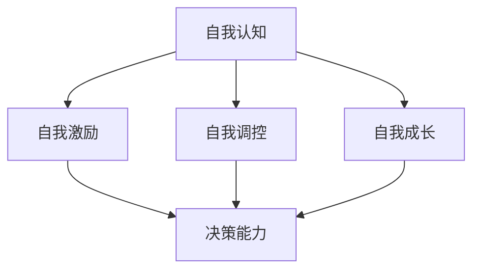
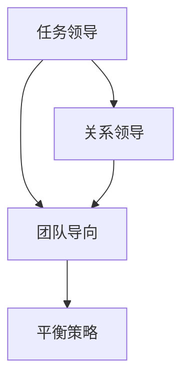
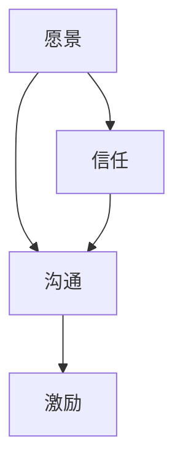

                 

### 领导者的自我修炼：持续成长的秘诀

#### 关键词：领导者修炼，自我成长，决策能力，影响力，领导力模型

> “一个领导者，如果不能自我修炼，就无法真正引领团队。持续成长，是领导力的核心。”  
> —— AI天才研究院/AI Genius Institute

在现代企业中，领导者扮演着至关重要的角色。他们不仅需要具备卓越的领导能力，还需要不断地自我修炼，以适应快速变化的环境和挑战。本篇文章将围绕《领导者的自我修炼：持续成长的秘诀》这一主题，详细探讨领导者如何通过自我修炼来实现持续成长。

本文关键词包括：“领导者修炼”、“自我成长”、“决策能力”、“影响力”和“领导力模型”。这些关键词不仅涵盖了领导者自我修炼的核心内容，也揭示了提升领导力的关键因素。

**摘要：**
本文首先介绍了领导者自我修炼的重要性，随后详细阐述了领导力的核心概念，包括自我意识、决策能力和影响力。接着，文章通过章节深入剖析了领导者如何在自我意识、决策能力和影响力方面进行修炼。此外，本文还介绍了几种常见的领导力模型，并通过实战案例展示了领导者的自我修炼过程和成果。最后，文章总结了全书内容，并提供实用的建议和行动指南，帮助领导者实现持续成长。

**目录：**
1. 引言  
2. 背景介绍  
3. 核心概念  
4. 领导力发展  
5. 领导力模型  
6. 实战案例  
7. 总结与建议

### 引言

领导者的角色与责任在现代社会中日益重要。他们不仅需要具备战略眼光和决策能力，还需要具备强大的自我修炼能力。自我修炼是领导者持续成长的关键，它不仅能够帮助领导者提升个人素质，还能为团队和组织带来积极的变革。

首先，领导者需要明确自己的角色和责任。他们不仅是团队的核心，更是团队前进的灯塔。领导者需要具备清晰的目标和愿景，能够激励和引导团队成员共同前进。同时，领导者还需要具备卓越的决策能力，能够快速应对复杂多变的环境和挑战。

然而，在现实工作中，领导者常常面临各种挑战。这些挑战不仅来自于外部环境，也来自于内部团队的管理和协调。如何应对这些挑战，实现自我修炼，是每个领导者都需要思考的问题。

自我修炼的重要性不言而喻。它不仅能够帮助领导者提升个人素质，还能增强领导者的信心和影响力。通过自我修炼，领导者能够更好地理解自己，找到自己的优势和不足，并针对性地进行提升。此外，自我修炼还能够帮助领导者建立更加健康的人际关系，增强团队凝聚力。

本文的目标是探讨领导者如何通过自我修炼实现持续成长。文章将首先介绍领导者的自我修炼的重要性，随后详细阐述领导力的核心概念，并通过实战案例展示领导者的自我修炼过程和成果。最后，文章将总结全书内容，并提供实用的建议和行动指南，帮助领导者实现自我修炼和持续成长。

### 背景介绍

在现代企业环境中，领导者面临的挑战越来越多，这些挑战不仅来自于外部市场的不确定性，也来自于内部团队的管理和协调。因此，领导者的自我修炼显得尤为重要。

#### 现代领导环境的变化

首先，让我们看看现代领导环境的变化。随着全球化的进程加快，企业面临的市场竞争越来越激烈。领导者需要具备全球视野，能够快速应对市场的变化。此外，技术的迅猛发展也给领导者带来了新的挑战。例如，人工智能、大数据和云计算等技术的应用，要求领导者具备相应的技术背景和创新能力。

#### 领导者面临的挑战

其次，领导者面临的挑战也越来越多。一方面，领导者需要处理复杂多变的环境，包括政策变化、市场波动和竞争对手的动态。另一方面，领导者还需要管理内部团队，解决团队内部的冲突和问题。此外，领导者还需要具备良好的沟通能力，能够与团队成员、上级领导和合作伙伴有效沟通，确保团队的协调和合作。

#### 自我修炼的必要性

在这种情况下，自我修炼显得尤为重要。通过自我修炼，领导者可以不断提升自己的素质和能力，更好地应对各种挑战。具体来说，自我修炼可以帮助领导者实现以下几个方面：

1. **提升自我意识**：领导者可以通过自我修炼，更好地了解自己，认识自己的优点和不足，找到提升的方向。
2. **增强决策能力**：领导者需要具备良好的决策能力，能够快速、准确地做出决策。通过自我修炼，领导者可以提升自己的决策能力，减少失误和风险。
3. **提升影响力**：领导者需要具备强大的影响力，能够激励和引导团队成员。通过自我修炼，领导者可以增强自己的影响力，提高团队的凝聚力和执行力。

#### 领导者自我修炼的核心内容

领导者自我修炼的核心内容包括以下几个方面：

1. **自我意识**：自我意识是领导者自我修炼的基础。领导者需要通过自我反思，了解自己的价值观、信念和行为模式，找到提升自我意识的方法。
2. **决策能力**：决策能力是领导者必备的核心能力。领导者需要通过学习决策理论，掌握决策模型和方法，提升自己的决策能力。
3. **影响力**：影响力是领导者的重要特质。领导者需要通过学习沟通技巧、领导风格和团队建设方法，提升自己的影响力。

#### 如何持续成长

为了实现持续成长，领导者可以采取以下措施：

1. **持续学习**：领导者需要不断学习新知识、新技能，提升自己的综合素质。
2. **实践反思**：领导者需要通过实践，将所学知识应用到实际工作中，并不断反思和总结，找到提升的方法。
3. **建立支持系统**：领导者可以寻求导师或教练的帮助，建立支持系统，提升自己的自我修炼能力。

通过以上措施，领导者可以不断提升自己的能力，实现持续成长，为团队和组织带来积极的影响。

### 核心概念

领导力的核心概念是理解领导者自我修炼的关键。在本文中，我们将探讨三个核心概念：自我意识、决策能力和影响力。

#### 自我意识

自我意识是指领导者对自己内心状态、行为模式和价值观的深刻认识。它是领导者自我修炼的基础。一个具备高自我意识的领导者能够更好地理解自己，识别自己的情绪和反应，从而更好地管理自己的行为。

1. **自我意识的定义**：自我意识是指个体对自己内在和外在的觉察和理解。它包括自我感知、自我反思和自我认同。
2. **自我意识的重要性**：自我意识对于领导者的成长至关重要。它帮助领导者识别自己的优点和不足，从而制定个人发展计划。
3. **自我意识的培养方法**：领导者可以通过以下方法培养自我意识：
   - **自我反思**：定期进行自我反思，回顾自己的行为和决策，识别自己的情绪和反应。
   - **日记记录**：通过写日记记录自己的思考、感受和行为，深入理解自己的内心世界。
   - **心理辅导**：寻求专业的心理辅导，帮助领导者更好地认识自己。

#### 决策能力

决策能力是领导者处理复杂问题、制定战略和决策的重要能力。一个具备强大决策能力的领导者能够更好地应对不确定性，提高决策的准确性和效率。

1. **决策能力的定义**：决策能力是指领导者分析和解决复杂问题的能力，包括信息收集、风险评估、选择方案和执行决策。
2. **决策能力的重要性**：决策能力对于领导者的成功至关重要。它不仅影响领导者的个人形象和信誉，还影响团队和组织的发展。
3. **提升决策能力的策略**：
   - **学习决策理论**：了解决策理论，掌握决策模型和方法，提高决策的科学性和系统性。
   - **增加经验**：通过实践积累经验，提高决策能力。
   - **建立决策团队**：与团队成员共同决策，提高决策的全面性和准确性。

#### 影响力

影响力是领导者激励和引导团队成员，实现组织目标的重要能力。一个具备强大影响力的领导者能够更好地影响他人，提升团队的凝聚力和执行力。

1. **影响力的定义**：影响力是指领导者通过言语、行为和情感影响他人态度和行为的能力。
2. **影响力的要素**：影响力包括以下三个要素：
   - **信任**：建立信任关系，增强影响力。
   - **愿景**：明确愿景，激发团队成员的积极性。
   - **沟通**：有效沟通，传达领导者的意图和期望。
3. **增强影响力的技巧**：
   - **建立信任**：通过诚实、透明和负责任的行为建立信任。
   - **树立榜样**：通过自己的行为树立榜样，影响他人。
   - **激励他人**：了解团队成员的需求，提供适当的激励。

通过深入理解自我意识、决策能力和影响力的概念，领导者可以更好地进行自我修炼，提升自己的领导力，为团队和组织的发展做出更大贡献。

### 领导力发展

在自我修炼的过程中，领导者需要在自我意识、决策能力和影响力这三个方面进行深入修炼。本文将分别从这些方面介绍领导者如何进行自我修炼。

#### 自我意识修炼

自我意识修炼是领导者自我修炼的基础。一个具备高自我意识的领导者能够更好地理解自己，管理自己的情绪和行为。

1. **内省与自我反思**：领导者需要定期进行内省和自我反思，深入思考自己的行为和决策，识别自己的情绪和反应。例如，领导者可以在每天结束时花一些时间回顾自己的行为，思考哪些地方做得好，哪些地方需要改进。

2. **情感管理**：领导者需要学会管理自己的情绪，避免因为情绪波动而影响决策和团队氛围。例如，领导者可以通过深呼吸、冥想等方法来平静自己的情绪。

3. **自我成长路径**：领导者需要制定个人成长计划，明确自己的目标和提升方向。例如，领导者可以定期参加培训课程、读书或寻求专业辅导，以不断提升自己的自我意识。

#### 决策能力提升

决策能力是领导者应对复杂问题的核心能力。提升决策能力，可以帮助领导者更好地应对不确定性，提高决策的准确性和效率。

1. **决策流程**：领导者需要掌握科学的决策流程，包括问题识别、信息收集、风险评估、选择方案和执行决策。例如，在做出重要决策前，领导者可以列出所有可能的选项，并对每个选项进行详细分析。

2. **风险评估**：领导者需要学会进行风险评估，预测每个决策可能带来的风险和收益。例如，在投资决策中，领导者可以分析市场趋势、竞争对手和潜在风险，以做出更加明智的决策。

3. **决策模型应用**：领导者可以学习并应用各种决策模型，以提高决策的科学性和系统性。例如，领导者可以学习SWOT分析、决策树等方法，帮助自己做出更加全面和准确的决策。

#### 影响力修炼

影响力是领导者引导和激励团队成员，实现组织目标的重要能力。提升影响力，可以帮助领导者更好地影响他人，提升团队的凝聚力和执行力。

1. **领导风格**：领导者需要根据团队的特点和任务的需求，选择合适的领导风格。例如，在团队遇到困难时，领导者可以采用指导型领导风格，提供明确的指导和帮助。

2. **沟通技巧**：领导者需要掌握有效的沟通技巧，确保信息传达的准确性和有效性。例如，领导者可以通过积极倾听、明确表达和有效反馈，建立良好的沟通氛围。

3. **团队建设**：领导者需要注重团队建设，提升团队的凝聚力和执行力。例如，领导者可以组织团队活动，增进团队成员之间的了解和信任，提高团队的整体绩效。

通过在自我意识、决策能力和影响力这三个方面进行深入修炼，领导者可以不断提升自己的领导力，为团队和组织的发展做出更大的贡献。

### 领导力模型

在领导力发展的过程中，领导者不仅需要理解抽象的核心概念，还需要掌握具体的领导力模型。这些模型为领导者提供了系统化的方法和工具，帮助他们在实践中更有效地提升领导力。本文将介绍几种常见的领导力模型，并通过Mermaid流程图展示这些模型的核心要素和关系。

#### 自我领导模型

自我领导模型强调领导者首先要自我管理，实现自我领导。该模型的核心要素包括自我认知、自我激励、自我调控和自我成长。

1. **自我认知**：领导者需要深入了解自己的价值观、动机、优势和不足，从而制定个人发展计划。
2. **自我激励**：领导者需要培养自我激励的能力，即使在困难环境中也能保持积极心态，不断追求进步。
3. **自我调控**：领导者需要学会管理自己的情绪和行为，确保在压力和挑战面前保持冷静和理性。
4. **自我成长**：领导者需要持续学习新知识和技能，不断提升自己的能力和素质。

**Mermaid流程图：**

#### 平衡领导模型

平衡领导模型强调领导者需要在任务导向和关系导向之间找到平衡。该模型的核心要素包括任务领导、关系领导、团队导向和平衡策略。

1. **任务领导**：领导者需要确保团队的任务得到有效执行，设定明确的目标和期望。
2. **关系领导**：领导者需要建立和维护与团队成员的良好关系，增强团队的凝聚力和信任。
3. **团队导向**：领导者需要关注团队的总体目标和利益，而不是个人利益。
4. **平衡策略**：领导者需要根据不同情境，灵活调整任务导向和关系导向的比重，找到最佳平衡点。

**Mermaid流程图：**

#### 影响型领导模型

影响型领导模型强调领导者通过影响力来引导和激励团队成员。该模型的核心要素包括愿景、信任、沟通和激励。

1. **愿景**：领导者需要明确团队的愿景和目标，使团队成员明确自己的价值和贡献。
2. **信任**：领导者需要建立信任关系，使团队成员感到安全和放心。
3. **沟通**：领导者需要有效沟通，确保信息传递的准确性和及时性。
4. **激励**：领导者需要了解团队成员的需求，提供适当的激励，激发其潜能。

**Mermaid流程图：**

通过掌握和应用这些领导力模型，领导者可以更系统地提升自己的领导能力，为团队和组织的发展提供强有力的支持。

### 实战案例

为了更好地展示领导者的自我修炼过程和成果，本文将通过三个实际案例，详细分析领导者如何在实际工作中进行自我修炼，并取得显著成果。

#### 案例一：自我意识修炼的实践

**案例背景：**

李明是一家科技公司的部门经理，负责带领一个由不同专业背景人员组成的团队。他发现自己在处理团队内部冲突时，经常情绪化，导致问题未能得到妥善解决。

**自我修炼过程：**

1. **自我反思**：李明开始每天晚上花时间进行自我反思，回顾自己在一天中的行为和决策，特别是与团队成员的互动。他意识到自己的情绪化行为对团队氛围和工作效率产生了负面影响。

2. **情绪管理**：为了更好地管理情绪，李明学习了情绪管理的技巧，包括深呼吸、冥想和正念练习。他通过这些方法，学会在情绪波动时保持冷静，避免冲动决策。

3. **心理辅导**：李明还寻求了专业的心理辅导，通过辅导师的帮助，他进一步了解了自己的情绪和行为模式，找到了情绪化的根本原因。

**结果分析：**

经过一段时间的自我修炼，李明在情绪管理方面取得了显著进步。他不再轻易发火，能够更理性地处理团队内部的冲突。团队氛围明显改善，团队成员之间的合作更加顺畅，工作效率也得到了提升。

#### 案例二：决策能力提升的实践

**案例背景：**

王丽是一家中型企业的市场营销经理，负责制定公司的市场营销策略。她发现自己在面对市场竞争变化时，决策常常不够果断，导致市场机会错失。

**自我修炼过程：**

1. **学习决策理论**：王丽参加了多个决策理论相关的培训课程，学习了SWOT分析、决策树等决策工具和方法，提高了自己的决策科学性和系统性。

2. **增加经验**：王丽通过积极参与市场调研和数据分析，积累了更多的市场经验和数据，增强了决策的依据。

3. **建立决策团队**：王丽组建了一个由市场、销售、产品等各部门代表组成的决策团队，通过集体讨论和多方意见，提高决策的全面性和准确性。

**结果分析：**

通过自我修炼，王丽的决策能力得到了显著提升。她能够更快速、更准确地做出决策，减少了因犹豫不决而错失市场机会的情况。公司的市场营销策略更加科学合理，市场竞争力显著增强。

#### 案例三：影响力修炼的实践

**案例背景：**

张华是一家初创公司的创始人兼CEO，他发现自己在激励和引导团队成员方面存在一定困难，团队凝聚力不强。

**自我修炼过程：**

1. **领导风格调整**：张华开始反思自己的领导风格，发现过于独断和指令式管理不利于团队凝聚力。他开始尝试采用参与式领导和变革型领导风格，鼓励团队成员参与决策和提出建议。

2. **沟通技巧提升**：张华通过学习和实践，掌握了积极倾听、有效反馈和情感表达等沟通技巧，改善了与团队成员的沟通质量。

3. **建立信任**：张华注重建立与团队成员的信任关系，通过透明的沟通和负责任的行为，赢得了团队成员的信任和尊重。

**结果分析：**

通过自我修炼，张华的影响力得到了显著提升。团队成员的积极性提高，团队凝聚力显著增强。公司的整体工作效率和创新能力也得到提升，为公司的快速发展奠定了坚实基础。

这些案例展示了领导者通过自我修炼，在自我意识、决策能力和影响力方面取得显著成果的过程和成果。领导者通过不断学习和实践，不仅提升了个人能力，也为团队和组织的发展做出了重要贡献。

### 总结与建议

在本文中，我们详细探讨了领导者的自我修炼：持续成长的秘诀。通过自我意识、决策能力和影响力的修炼，领导者可以不断提升自己的素质，为团队和组织的发展做出更大贡献。

#### 成功要素

1. **持续学习**：领导者需要不断学习新知识、新技能，以适应快速变化的环境。
2. **实践反思**：领导者需要通过实践，将所学知识应用到实际工作中，并不断反思和总结，找到提升的方法。
3. **建立支持系统**：领导者可以寻求导师或教练的帮助，建立支持系统，提升自己的自我修炼能力。

#### 挑战与对策

1. **时间管理**：领导者需要在繁忙的工作中找到时间进行自我修炼，建议设立固定的学习时间，并合理安排日程。
2. **心理障碍**：领导者可能会遇到自我认识和情绪管理的障碍，建议寻求专业心理辅导，帮助自己克服心理障碍。
3. **资源限制**：领导者可能面临资源不足的问题，建议通过团队协作和资源整合，提升资源利用效率。

#### 实用的建议和行动指南

1. **定制个人成长计划**：根据个人优势和不足，制定详细的个人成长计划，设定具体的目标和里程碑。
2. **培养关键能力**：重点关注决策能力、沟通能力和影响力等关键能力的培养，通过培训和实践活动提升这些能力。
3. **持续学习与实践**：利用碎片时间进行学习，通过实践检验所学知识，不断调整和优化成长路径。

通过以上建议和行动指南，领导者可以更加有效地进行自我修炼，实现持续成长，为团队和组织的发展做出积极贡献。

### 附录

#### 拓展阅读

- **《影响力》**：罗伯特·西奥迪尼著，详细阐述了影响力六大原则，有助于领导者提升影响力。
- **《领导力五项修炼》**：彼得·圣吉著，提出了领导力发展的五个关键领域，为领导者提供了系统化的成长路径。
- **《决策与判断》**：丹尼尔·卡尼曼著，通过心理学和决策理论，深入探讨了人类决策的本质，有助于提升决策能力。

#### 注意事项

- **持续学习**：领导者需要持续学习新知识、新技能，以适应快速变化的环境。
- **实践反思**：领导者需要通过实践，将所学知识应用到实际工作中，并不断反思和总结，找到提升的方法。
- **心理辅导**：领导者可以寻求专业心理辅导，帮助自己克服心理障碍，提升自我意识和管理能力。

#### 最佳实践 Tips

- **设立固定学习时间**：每天或每周设定固定的时间进行学习，确保持续成长。
- **建立学习小组**：与同事或同行组建学习小组，通过交流和讨论，共同提升能力。
- **应用所学知识**：将所学知识应用到实际工作中，通过实践检验和优化所学内容。

通过以上拓展阅读、注意事项和最佳实践 Tips，领导者可以更加系统地提升自我修炼能力，实现持续成长。

### 作者信息

**作者：AI天才研究院/AI Genius Institute & 禅与计算机程序设计艺术 /Zen And The Art of Computer Programming**

