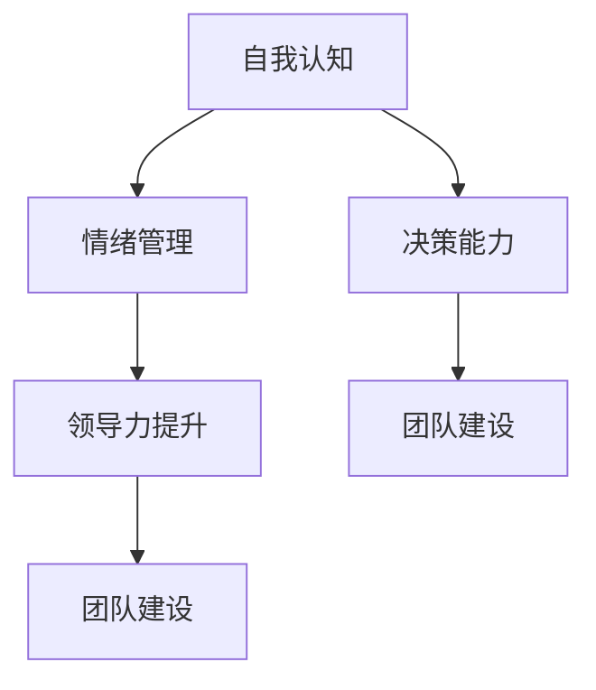
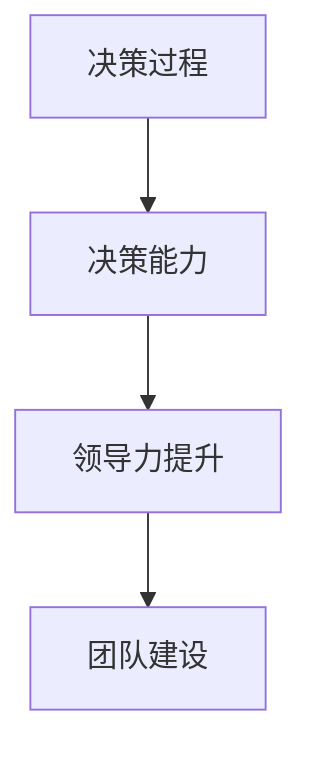
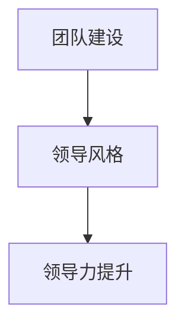

                 

### 《领导者的自我修炼：持续提升领导能力》

> 关键词：领导者，自我修炼，领导能力，提升，个人成长，团队建设，决策能力，情绪管理

**摘要**：本篇文章旨在探讨领导者如何通过自我修炼来持续提升自己的领导能力。文章首先介绍了领导者的角色与责任，然后深入分析了领导者自我修炼的重要性。接着，文章阐述了自我修炼的核心概念与原理，包括自我认知、情绪管理、决策能力等方面。在此基础上，文章提出了一些实用的领导力提升方法，并通过实践案例进行具体说明。最后，文章总结了自我修炼的关键点，并提供了一些注意事项和拓展阅读建议。

----------------------------------------------------------------

## 第一部分：领导力基础

### 1.1 领导者的角色与责任

在组织中，领导者扮演着至关重要的角色。他们不仅需要具备良好的专业技能和知识，还需要具备出色的领导能力。那么，领导者的角色与责任究竟是什么呢？

**领导者的角色**：

1. **战略规划者**：领导者需要制定组织的发展战略，确保组织朝着正确的方向前进。
2. **决策者**：领导者需要在关键时刻做出明智的决策，引导组织克服各种挑战。
3. **协调者**：领导者需要协调组织内部各个部门的工作，确保资源的合理分配和高效利用。
4. **激励者**：领导者需要激发团队成员的积极性，鼓励他们为实现组织目标而努力。
5. **代表者**：领导者是组织的代表，需要对外展示组织的形象和价值观。

**领导者的责任**：

1. **确保组织目标的实现**：领导者需要明确组织的目标，并确保团队成员共同努力实现这些目标。
2. **培养和发展团队成员**：领导者需要关注团队成员的成长，提供培训和学习机会，帮助他们提升技能和素质。
3. **维护良好的组织氛围**：领导者需要营造一个积极、和谐、信任的工作环境，让团队成员能够充分发挥自己的潜力。
4. **协调内外部关系**：领导者需要处理组织内外部的各种关系，确保组织与外部环境保持良好的互动。
5. **不断学习和自我提升**：领导者需要不断学习新的知识和技能，提升自己的领导能力，以适应不断变化的环境。

### 1.2 领导者自我修炼的重要性

在当前快速变化的市场环境中，领导者需要具备持续学习和自我提升的能力。自我修炼不仅有助于提升领导能力，还能帮助领导者更好地应对各种挑战。

**自我修炼的重要性**：

1. **提升个人素质**：通过自我修炼，领导者可以不断提高自己的专业技能和知识水平，增强自信心和职业素养。
2. **增强决策能力**：自我修炼有助于领导者培养敏锐的洞察力、良好的判断力和果断的决策力，从而在关键时刻做出正确的决策。
3. **提高团队凝聚力**：领导者通过自我修炼，可以更好地了解团队成员的需求和期望，增强团队的凝聚力和协作精神。
4. **适应快速变化**：在当今这个充满不确定性的时代，领导者需要具备快速适应变化的能力。自我修炼有助于领导者培养灵活的思维方式和创新能力，从而更好地应对市场变化。
5. **提升组织绩效**：领导者自我修炼的成果会直接体现在组织绩效的提升上。一个优秀的领导者能够带领团队实现更高的目标，推动组织不断发展壮大。

### 1.3 问题背景与问题描述

在领导者的自我修炼过程中，可能会遇到以下问题和挑战：

1. **时间管理**：领导者往往面临繁重的工作任务，如何合理安排时间进行自我修炼成为一大难题。
2. **缺乏动力**：在自我修炼的过程中，领导者可能会因为种种原因而缺乏持续的动力。
3. **方法不当**：有些领导者可能没有找到适合自己的自我修炼方法，导致效果不佳。
4. **外界干扰**：领导者的日常工作、人际关系等外界因素可能会干扰自我修炼的进程。

**问题解决**：

1. **制定明确的目标**：领导者可以制定一个具体的自我修炼计划，明确自己的目标和进度，从而有针对性地进行修炼。
2. **培养自律意识**：领导者需要树立自律意识，养成良好的学习和生活习惯，确保自我修炼的时间和质量。
3. **寻找合适的修炼方法**：领导者可以尝试不同的自我修炼方法，如阅读、培训、实践等，找到最适合自己的修炼方式。
4. **寻求外部支持**：领导者可以寻求导师、同事或专业机构的帮助，获得指导和建议，提高自我修炼的效果。

### 1.4 边界与外延

领导者自我修炼的范围涉及多个方面，包括知识技能、心理素质、人际关系等。以下是一些边界与外延的说明：

1. **知识技能**：自我修炼不仅包括专业知识的学习，还包括跨领域知识的学习，如管理、沟通、心理学等。
2. **心理素质**：领导者需要具备良好的心理素质，包括情绪管理、抗压能力、自我调节等。
3. **人际关系**：领导者需要学会处理复杂的人际关系，包括团队合作、冲突解决、沟通技巧等。
4. **行为习惯**：领导者需要培养良好的行为习惯，如时间管理、自律、积极主动等。
5. **外部环境**：领导者还需要关注外部环境的变化，如市场趋势、政策法规等，以调整自己的修炼方向。

### 1.5 概念结构与核心要素组成

领导者自我修炼的核心概念和要素包括以下几个方面：

1. **自我认知**：了解自己的优点和不足，明确自己的价值观和目标。
2. **情绪管理**：学会调节自己的情绪，保持积极乐观的心态。
3. **决策能力**：提升决策水平，增强判断力和执行力。
4. **团队建设**：建立高效的团队，培养团队成员的协作精神和创新能力。
5. **持续学习**：保持学习的热情和动力，不断提升自己的知识和技能。

## 第二部分：核心概念与联系

### 2.1 领导力理论概述

领导力理论是领导者自我修炼的重要基础。以下是对几种主要领导力理论的概述：

1. **领导风格理论**：领导风格理论关注领导者的行为方式，包括独裁式、民主式、放任式等。不同的领导风格适用于不同的情境和团队。
2. **领导生命周期理论**：该理论认为领导者的领导方式应随着下属的成熟程度而变化。领导者需要根据下属的能力和需求，选择适当的领导方式。
3. **变革型领导理论**：变革型领导注重激发团队成员的积极性和创造力，推动组织变革和创新。
4. **情境领导理论**：该理论认为领导者的领导方式应根据具体情境进行调整，以实现最佳效果。

### 2.2 自我认知与情绪管理

**核心概念原理**：

1. **自我认知**：自我认知是指领导者对自己性格、能力、价值观等的认识。良好的自我认知有助于领导者明确自己的优势和不足，制定合理的成长计划。
2. **情绪管理**：情绪管理是指领导者学会调节自己的情绪，保持积极乐观的心态。情绪管理能力强的领导者能够更好地应对压力和挑战，带领团队走向成功。

**概念属性特征对比表格**：

| 概念        | 特征                                           |  
| --------- | ---------------------------------------------- |  
| 自我认知    | 了解自己的性格、能力、价值观等                 |  
| 情绪管理    | 调节自己的情绪，保持积极乐观的心态               |

**ER实体关系图架构**：

### 2.3 决策能力提升

**核心概念原理**：

1. **决策过程**：决策过程包括问题识别、目标设定、方案评估、选择决策和实施监控等阶段。
2. **决策能力**：决策能力是指领导者面对复杂情况时，能够迅速做出正确决策的能力。决策能力强的领导者能够降低风险，提高组织的竞争力。

**概念属性特征对比表格**：

| 概念        | 特征                                           |  
| --------- | ---------------------------------------------- |  
| 决策过程    | 包括问题识别、目标设定、方案评估、选择决策和实施监控等阶段 |  
| 决策能力    | 面对复杂情况时，能够迅速做出正确决策的能力           |

**ER实体关系图架构**：

### 2.4 团队建设与领导风格

**核心概念原理**：

1. **团队建设**：团队建设是指领导者通过一系列措施，提高团队的整体绩效和协作能力。团队建设的关键在于建立信任、明确目标、分配任务和激励成员。
2. **领导风格**：领导风格是指领导者在与团队成员互动时采取的方式。常见的领导风格包括独裁式、民主式、放任式等。

**概念属性特征对比表格**：

| 概念        | 特征                                           |  
| --------- | ---------------------------------------------- |  
| 团队建设    | 通过建立信任、明确目标、分配任务和激励成员提高团队整体绩效 |  
| 领导风格    | 领导者在与团队成员互动时采取的方式，如独裁式、民主式、放任式等 |

**ER实体关系图架构**：

## 第三部分：领导力提升方法

### 3.1 自我认知

**自我认知**是指领导者了解自己的性格、能力、价值观等方面的过程。以下是一些自我认知的方法：

1. **自我反思**：领导者可以通过自我反思，回顾自己的过去经历，分析自己的优点和不足，从而更好地认识自己。
2. **他人反馈**：领导者可以向同事、下属或导师寻求反馈，了解他们对自己的看法和评价，从而发现自身的盲点和不足。
3. **心理测试**：领导者可以参加一些专业的心理测试，如MBTI、DISC等，了解自己的性格类型和行为倾向。
4. **参加培训**：领导者可以参加一些领导力培训课程，学习如何进行自我认知和自我提升。

### 3.2 情绪管理

**情绪管理**是指领导者学会调节自己的情绪，保持积极乐观的心态。以下是一些情绪管理的方法：

1. **认知重构**：领导者可以通过改变自己对问题的看法和解读，从而调整自己的情绪。例如，将“这个问题很难解决”转变为“这是一个挑战，我需要找到解决方案”。
2. **放松训练**：领导者可以尝试一些放松技巧，如深呼吸、冥想、瑜伽等，帮助自己缓解压力和紧张情绪。
3. **积极心态**：领导者要保持积极的心态，相信自己能够克服困难，实现目标。
4. **寻求支持**：当领导者遇到情绪问题时，可以向家人、朋友或专业人士寻求支持和帮助。

### 3.3 决策能力

**决策能力**是指领导者面对复杂情况时，能够迅速做出正确决策的能力。以下是一些提升决策能力的方法：

1. **收集信息**：在做出决策之前，领导者需要收集尽可能多的相关信息，全面了解问题的各个方面。
2. **评估风险**：领导者需要对各种可能的决策结果进行风险评估，权衡利弊，选择最优方案。
3. **提高判断力**：领导者可以通过学习和实践，提高自己的判断力，增强决策的准确性。
4. **培养果断性**：领导者需要学会果断地做出决策，不畏惧失败，勇于承担责任。

### 3.4 团队建设

**团队建设**是指领导者通过一系列措施，提高团队的整体绩效和协作能力。以下是一些团队建设的方法：

1. **明确目标**：领导者需要与团队成员共同明确团队的目标，确保团队成员对目标有清晰的认识和认同。
2. **建立信任**：领导者要积极建立团队成员之间的信任，通过坦诚沟通、尊重他人等方式，增强团队的凝聚力。
3. **分工合作**：领导者要合理分配任务，让团队成员发挥各自的优势，实现优势互补。
4. **激励团队**：领导者要关注团队成员的需求和期望，提供激励措施，激发团队成员的积极性和创造力。

## 第四部分：实践与案例分析

### 4.1 领导力模型应用

在领导者的自我修炼过程中，应用一些经典的领导力模型可以起到很好的指导作用。以下介绍几种常用的领导力模型及其应用：

1. **领导风格模型**：该模型认为领导风格可以分为独裁式、民主式和放任式。领导者可以根据团队的具体情况和成员的特点，选择合适的领导风格。例如，对于新成立的团队，可以采用民主式领导风格，鼓励成员积极参与决策，增强团队的凝聚力。

2. **领导生命周期理论**：该理论认为领导者的领导方式应随着下属的成熟程度而变化。根据下属的能力和需求，领导者可以选择不同的领导方式。例如，当团队成员的能力较低时，领导者可以采用指导式领导方式，提供明确的指导和帮助；当团队成员的能力较高时，领导者可以采用参与式领导方式，让成员参与决策和问题解决。

3. **变革型领导理论**：该理论认为领导者需要激发团队成员的积极性和创造力，推动组织变革和创新。领导者可以通过树立愿景、提供激励、培养信任等方式，实现变革型领导。例如，在组织面临重大变革时，领导者可以制定清晰的变革愿景，与团队成员共同探讨变革的必要性，激发他们的积极性和参与感。

4. **情境领导理论**：该理论认为领导者的领导方式应根据具体情境进行调整，以实现最佳效果。领导者需要根据团队成员的能力和需求，以及工作任务的复杂程度，选择适当的领导方式。例如，在团队成员面临困难时，领导者可以采用支持型领导方式，给予关心和支持，帮助团队成员克服困难。

### 4.2 成功领导者案例

以下介绍几个成功领导者的自我修炼案例，总结他们的经验教训：

1. **案例一：乔布斯**

乔布斯是一位极具影响力的领导者，他通过自我修炼不断提升自己的领导能力。他的成功经验主要包括：

- **追求卓越**：乔布斯始终坚持追求卓越，不断提升自己的专业技能和知识水平。
- **自我反思**：乔布斯经常进行自我反思，分析自己的优点和不足，不断改进自己的领导方式。
- **创新思维**：乔布斯鼓励团队成员创新思维，推动产品创新和公司发展。
- **关注用户体验**：乔布斯始终关注用户体验，从用户的角度思考问题，为用户提供卓越的产品和服务。

2. **案例二：杰克·韦尔奇**

杰克·韦尔奇是通用电气的传奇领导者，他通过自我修炼和领导力的提升，带领通用电气实现了巨大的成功。他的经验教训包括：

- **明确目标**：杰克·韦尔奇始终明确公司的发展目标，并与团队成员共同实现这些目标。
- **激发员工潜力**：杰克·韦尔奇鼓励员工发挥自己的潜力，提供培训和激励措施，提高员工的能力和绩效。
- **强调团队协作**：杰克·韦尔奇重视团队协作，通过建立跨部门的合作机制，推动公司整体发展。
- **持续学习**：杰克·韦尔奇不断学习新的知识和技能，保持自己的竞争力，为公司的创新和发展提供支持。

3. **案例三：稻盛和夫**

稻盛和夫是日本著名的企业家和哲学家，他通过自我修炼和领导力的提升，创立了两家世界500强企业。他的经验教训包括：

- **真诚待人**：稻盛和夫真诚待人，关心员工的生活和成长，赢得了员工的爱戴和信任。
- **追求诚信**：稻盛和夫始终坚持诚信原则，以诚信经营和企业文化建设为基础，推动企业持续发展。
- **持续学习**：稻盛和夫注重学习，不断探索新的管理理念和实践方法，为企业发展提供源源不断的动力。
- **奉献社会**：稻盛和夫注重企业社会责任，通过回馈社会和慈善活动，提升了企业的社会形象和品牌价值。

### 4.3 领导力实践

以下提供一些领导力实践的具体方法和技巧：

1. **建立愿景和目标**：领导者需要明确自己的愿景和目标，并与团队成员共同制定实现这些目标的计划。通过明确的愿景和目标，激发团队成员的积极性和动力。

2. **积极沟通和反馈**：领导者要积极与团队成员沟通，了解他们的需求和期望，及时给予反馈和支持。通过良好的沟通，增强团队的凝聚力和信任感。

3. **培养团队成员**：领导者要关注团队成员的成长，提供培训和学习机会，帮助他们提升技能和素质。通过培养团队成员，提高团队的整体绩效和能力。

4. **激励和奖励**：领导者要关注团队成员的绩效和贡献，给予合理的激励和奖励。通过激励和奖励，激发团队成员的积极性和创造力。

5. **积极应对挑战**：领导者要敢于面对挑战，勇于承担责任。在遇到困难时，要带领团队一起分析问题、寻找解决方案，共同克服困难。

## 第五部分：总结与拓展

### 5.1 小结

通过本文的探讨，我们了解到领导者自我修炼的重要性以及如何通过自我认知、情绪管理、决策能力提升和团队建设等方面来持续提升自己的领导能力。成功的领导者往往在自我修炼方面投入大量时间和精力，不断提升自己的综合素质和领导力，从而在组织中发挥更大的作用。

### 5.2 注意事项

在领导者的自我修炼过程中，需要注意以下几点：

1. **明确目标**：在修炼过程中，要明确自己的目标，有针对性地进行学习和提升。
2. **保持自律**：自律是自我修炼的重要保障，要养成良好的学习和生活习惯。
3. **持续学习**：学习是一个持续的过程，要不断充实自己的知识和技能，跟上时代的发展。
4. **实践应用**：理论知识和实践相结合，通过实际工作来检验和提升自己的领导能力。
5. **寻求反馈**：及时向他人寻求反馈，了解自己的优点和不足，不断改进自己的领导方式。

### 5.3 拓展阅读

以下是一些拓展阅读资源，供领导者参考：

1. **《领导者的素质》**：彼得·德鲁克（Peter F. Drucker）
2. **《变革型领导力》**：约翰·科特（John P. Kotter）
3. **《团队协作力》**：罗纳德·海菲拉特（Ronald Heifetz）
4. **《情绪智力》**：丹尼尔·戈尔曼（Daniel Goleman）
5. **《成功领导者的七项修炼》**：斯蒂芬·罗宾斯（Stephen P. Robbins）

---

**作者：AI天才研究院/AI Genius Institute & 禅与计算机程序设计艺术 /Zen And The Art of Computer Programming**

