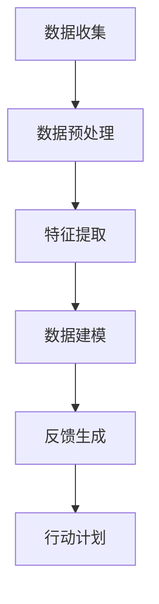
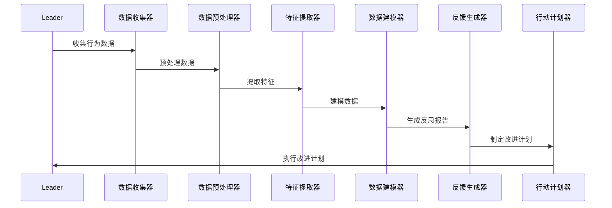

                 

# 领导者的自我反思：持续成长的重要性

> 关键词：自我反思、持续成长、领导力、算法原理、数学模型、系统分析与架构设计

> 摘要：本文探讨了领导者的持续成长和自我反思的重要性。通过分析自我反思的定义、方法和障碍，我们揭示了成长与领导力的关系，并介绍了领导者成长的阶段模型。接着，我们深入解析了领导者自我反思算法原理，运用数学模型和Python代码实现，以及如何将自我反思应用到实际项目中。最后，我们总结了最佳实践和成长策略，强调了持续成长对领导力提升的深远影响。

---

### 目录大纲

# 领导者的自我反思：持续成长的重要性

## 第一部分：问题背景与核心概念

## 第1章：领导者的自我反思

### 1.1 领导者成长的重要性

#### 1.1.1 领导者成长的核心要素

#### 1.1.2 成长与领导力的关系

### 1.2 自我反思的基本原则

#### 1.2.1 自我反思的定义

#### 1.2.2 自我反思的方法

#### 1.2.3 自我反思的障碍与挑战

## 第2章：核心概念与联系

### 2.1 领导者成长的阶段模型

#### 2.1.1 成长阶段的划分

#### 2.1.2 阶段性成长的特征

#### 2.1.3 成长阶段模型的应用

### 2.2 领导者自我反思的核心概念

#### 2.2.1 自我反思的重要性

#### 2.2.2 自我反思的心理学基础

#### 2.2.3 自我反思的效果与意义

## 第二部分：算法原理与数学模型

## 第3章：领导者自我反思算法原理

### 3.1 算法概述

#### 3.1.1 算法的定义

#### 3.1.2 算法的目标

#### 3.1.3 算法的关键步骤

### 3.2 数学模型与公式

#### 3.2.1 成长模型的数学表示

#### 3.2.2 自我反思模型的数学表示

#### 3.2.3 成长与自我反思的数学关系

### 3.3 算法原理讲解

#### 3.3.1 算法原理的Mermaid流程图

#### 3.3.2 算法原理的Python代码实现

#### 3.3.3 算法原理的详细讲解

## 第4章：领导者自我反思实践

### 4.1 实践概述

#### 4.1.1 实践的定义

#### 4.1.2 实践的目标

#### 4.1.3 实践的关键步骤

### 4.2 系统分析与架构设计

#### 4.2.1 问题场景介绍

#### 4.2.2 系统功能设计（领域模型Mermaid类图）

#### 4.2.3 系统架构设计（Mermaid架构图）

#### 4.2.4 系统接口设计和系统交互（Mermaid序列图）

### 4.3 项目实战

#### 4.3.1 环境安装

#### 4.3.2 系统核心实现源代码

#### 4.3.3 代码应用解读与分析

#### 4.3.4 实际案例分析和详细讲解剖析

### 4.4 项目小结

#### 4.4.1 项目总结

#### 4.4.2 项目经验与反思

#### 4.4.3 拓展阅读

## 第三部分：最佳实践与成长策略

## 第5章：最佳实践与技巧

### 5.1 成长策略分析

#### 5.1.1 成长策略的定义

#### 5.1.2 成长策略的类型

#### 5.1.3 成长策略的实施

### 5.2 自我反思技巧

#### 5.2.1 自我反思技巧的分类

#### 5.2.2 自我反思技巧的实践应用

#### 5.2.3 自我反思技巧的注意事项

## 第6章：成长与领导力提升

### 6.1 成长对领导力的影响

#### 6.1.1 成长对领导力的重要性

#### 6.1.2 成长对领导力的影响因素

#### 6.1.3 成长对领导力提升的策略

### 6.2 领导力提升的最佳实践

#### 6.2.1 领导力提升的定义

#### 6.2.2 领导力提升的方法

#### 6.2.3 领导力提升的最佳实践案例

### 6.3 成长与领导力的持续发展

#### 6.3.1 成长与领导力的动态关系

#### 6.3.2 持续发展的策略

#### 6.3.3 持续发展的实践案例

## 第7章：总结与展望

### 7.1 总结

#### 7.1.1 主要内容的回顾

#### 7.1.2 成长与领导力提升的关系

#### 7.1.3 自我反思的重要性

### 7.2 展望

#### 7.2.1 成长与领导力发展的趋势

#### 7.2.2 未来可能的研究方向

#### 7.2.3 领导者持续成长的重要性

---

## 第一部分：问题背景与核心概念

### 第1章：领导者的自我反思

#### 1.1 领导者成长的重要性

领导者的成长是一个持续的过程，它不仅仅关乎个人的能力提升，更涉及到团队和组织的发展。在快节奏、变化多端的企业环境中，领导者的持续成长尤为重要。首先，领导者需要具备卓越的决策能力，以便在复杂多变的市场中做出明智的选择。其次，他们需要具备良好的沟通技巧，能够有效地传达信息、激励团队，并解决冲突。此外，领导者的创新能力也是必不可少的，它能够帮助团队开拓新的业务领域、提升核心竞争力。

领导者成长的核心要素包括：

1. **自我认知**：领导者需要深刻认识自己的优点和不足，了解自己的价值观和信念，从而更好地进行自我调整。
2. **知识更新**：随着技术的不断进步，领导者需要不断学习新的知识，以保持与时俱进。
3. **经验积累**：通过实践中的不断尝试和反思，领导者能够积累宝贵的经验，从而提升自身的领导力。
4. **团队协作**：领导者的成长离不开团队成员的支持和合作，因此建立良好的团队关系至关重要。

#### 1.1.2 成长与领导力的关系

成长与领导力密切相关。领导力的本质是影响力，而影响力源于领导者的知识、经验、能力和价值观。随着领导者的成长，他们在这些方面的提升将直接增强其领导力。具体来说，成长有助于领导者：

- **提升决策能力**：通过不断学习和实践，领导者能够更加准确地分析问题、制定策略，并做出明智的决策。
- **增强沟通技巧**：成长使得领导者能够更好地理解团队成员的需求和期望，从而进行有效的沟通和协调。
- **激发团队潜能**：领导者通过自我成长，能够更好地激发团队的潜能，推动团队达成更高的目标。

#### 1.2 自我反思的基本原则

自我反思是领导者成长的重要手段，它有助于领导者认识自己的优点和不足，调整行为和思维模式。以下是自我反思的基本原则：

1. **真实**：自我反思需要真实面对自己的行为和思维，不回避问题，勇于承认错误。
2. **客观**：自我反思应基于客观事实，避免主观偏见和情绪的影响。
3. **持续**：自我反思应成为一个持续的过程，领导者需要定期进行反思，以便及时调整和改进。
4. **具体**：自我反思应具体到行为和结果，而非抽象的概念。

#### 1.2.2 自我反思的方法

自我反思的方法包括：

1. **日志反思**：通过记录每日的工作和生活，领导者可以反思自己的行为和思考过程。
2. **提问反思**：通过提出问题，如“我今天的决策是否明智？”、“我是否有效地沟通了信息？”等，领导者可以深入思考自己的行为和决策。
3. **反馈反思**：通过收集团队成员和其他利益相关者的反馈，领导者可以了解自己的表现和影响，并据此进行调整。

#### 1.2.3 自我反思的障碍与挑战

自我反思并非易事，领导者可能面临以下障碍和挑战：

1. **自我怀疑**：领导者可能怀疑自己的反思是否真实、客观，从而影响反思的效果。
2. **忙碌**：领导者日常事务繁重，可能缺乏时间进行深度反思。
3. **情绪影响**：情绪波动可能影响领导者的反思过程，导致反思不全面或不准确。

### 第2章：核心概念与联系

#### 2.1 领导者成长的阶段模型

领导者成长可以分为不同的阶段，每个阶段都有其独特的特征和挑战。以下是常见的领导者成长阶段模型：

1. **新手阶段**：在这个阶段，领导者刚刚开始接受领导职责，需要学习基本的领导技能和知识。
2. **能力提升阶段**：在这个阶段，领导者开始积累经验和知识，提升自身的领导能力。
3. **成熟阶段**：在这个阶段，领导者已经具备了丰富的领导经验，能够处理复杂的问题和挑战。
4. **卓越阶段**：在这个阶段，领导者达到了高度的成熟，能够对团队和组织产生深远的影响。

#### 2.1.2 阶段性成长的特征

阶段性成长具有以下特征：

1. **知识积累**：每个阶段领导者都需要学习新的知识和技能，以应对不同的领导挑战。
2. **经验积累**：每个阶段领导者都需要通过实践积累经验，从而提升自身的领导能力。
3. **思维模式转变**：每个阶段领导者都需要调整自己的思维模式，以适应新的领导环境和要求。

#### 2.1.3 成长阶段模型的应用

成长阶段模型可以帮助领导者：

1. **自我认知**：领导者可以了解自己在成长过程中的位置，从而设定合理的成长目标。
2. **培训与发展**：组织可以根据成长阶段模型为领导者提供有针对性的培训和发展计划。
3. **团队建设**：领导者可以了解团队成员的成长阶段，从而更好地进行团队管理和协作。

#### 2.2 领导者自我反思的核心概念

领导者自我反思的核心概念包括：

1. **自我认知**：领导者需要深入了解自己的行为和思维，以便进行有效的反思和改进。
2. **反思过程**：领导者需要建立反思的机制和流程，确保反思的持续性和有效性。
3. **改进行动**：领导者需要将反思结果转化为具体的行动，以实现自我提升。

#### 2.2.2 自我反思的心理学基础

自我反思的心理学基础包括：

1. **认知发展**：自我反思有助于领导者提升认知水平，更好地理解自己和他人。
2. **情绪调节**：自我反思有助于领导者调节情绪，减少负面情绪对领导行为的影响。
3. **自我效能感**：自我反思有助于领导者提升自我效能感，增强面对挑战的信心和决心。

#### 2.2.3 自我反思的效果与意义

自我反思的效果和意义包括：

1. **提升领导能力**：自我反思有助于领导者发现和解决自身问题，提升领导能力。
2. **促进个人成长**：自我反思有助于领导者深入了解自己，实现个人成长和自我实现。
3. **优化组织文化**：自我反思有助于领导者建设积极、健康的组织文化，提升组织的整体效能。

## 第二部分：算法原理与数学模型

### 第3章：领导者自我反思算法原理

领导者自我反思算法是一种系统性的方法，用于帮助领导者进行自我反思，从而实现持续成长。该算法基于心理学和认知科学的理论，结合数学模型和计算机技术，旨在提高领导者自我反思的效率和效果。

#### 3.1 算法概述

领导者自我反思算法的核心目标是：

1. **提高自我认知**：通过算法帮助领导者深入了解自己的行为、思维和情感状态。
2. **促进自我改进**：通过分析反思数据，为领导者提供具体的改进建议和行动计划。
3. **提升领导效能**：通过自我反思和改进，提升领导者的决策能力、沟通能力和团队管理能力。

#### 3.1.2 算法的目标

算法的具体目标包括：

1. **数据收集**：收集领导者在工作过程中的行为数据、反思日志和反馈信息。
2. **数据分析**：运用数据挖掘和机器学习技术，对收集到的数据进行分析和挖掘。
3. **反馈生成**：根据分析结果，生成个性化的反思报告和改进建议。
4. **行动计划**：将反思结果转化为具体的行动计划，帮助领导者实施改进措施。

#### 3.1.3 算法的关键步骤

领导者自我反思算法的关键步骤包括：

1. **数据收集**：通过多种途径收集领导者的行为数据，如工作日志、会议记录、邮件沟通等。
2. **数据预处理**：对收集到的数据进行清洗、整合和格式化，为后续分析做准备。
3. **特征提取**：从预处理后的数据中提取关键特征，如行为模式、情感状态、思维过程等。
4. **数据建模**：运用机器学习技术，建立模型对提取的特征进行分类、聚类和关联分析。
5. **反馈生成**：根据分析结果，生成个性化的反思报告和改进建议。
6. **行动计划**：将反思结果转化为具体的行动计划，帮助领导者实施改进措施。

#### 3.2 数学模型与公式

领导者自我反思算法中涉及多个数学模型和公式，用于描述和解释领导者的行为和反思过程。以下是其中几个核心模型和公式：

##### 成长模型

$$
M_{growth} = f(M_{knowledge}, M_{experience}, M_{team})
$$

其中，$M_{growth}$表示领导者的成长水平，$M_{knowledge}$表示知识积累，$M_{experience}$表示经验积累，$M_{team}$表示团队协作。

##### 自我反思模型

$$
M_{reflection} = f(M_{awareness}, M_{objectivity}, M_{action})
$$

其中，$M_{reflection}$表示领导者的自我反思水平，$M_{awareness}$表示自我认知，$M_{objectivity}$表示客观性，$M_{action}$表示改进行动。

##### 反思效果模型

$$
E_{reflection} = f(M_{reflection}, M_{growth})
$$

其中，$E_{reflection}$表示反思效果，$M_{reflection}$表示自我反思水平，$M_{growth}$表示成长水平。

##### 领导效能模型

$$
E_{leadership} = f(M_{knowledge}, M_{experience}, M_{team}, M_{reflection})
$$

其中，$E_{leadership}$表示领导效能，$M_{knowledge}$表示知识积累，$M_{experience}$表示经验积累，$M_{team}$表示团队协作，$M_{reflection}$表示自我反思水平。

#### 3.3 算法原理讲解

领导者自我反思算法的原理可以概括为以下几个步骤：

1. **数据收集**：通过多种途径收集领导者的行为数据，如工作日志、会议记录、邮件沟通等。
2. **数据预处理**：对收集到的数据进行清洗、整合和格式化，为后续分析做准备。
3. **特征提取**：从预处理后的数据中提取关键特征，如行为模式、情感状态、思维过程等。
4. **数据建模**：运用机器学习技术，建立模型对提取的特征进行分类、聚类和关联分析。
5. **反馈生成**：根据分析结果，生成个性化的反思报告和改进建议。
6. **行动计划**：将反思结果转化为具体的行动计划，帮助领导者实施改进措施。

为了更好地理解算法原理，我们可以使用Mermaid绘制算法流程图，并使用Python代码实现算法的关键部分。

##### Mermaid流程图



##### Python代码实现

```python
import pandas as pd
from sklearn.preprocessing import StandardScaler
from sklearn.cluster import KMeans

# 数据收集
data = pd.read_csv('leader_data.csv')

# 数据预处理
scaler = StandardScaler()
scaled_data = scaler.fit_transform(data)

# 特征提取
kmeans = KMeans(n_clusters=3)
clusters = kmeans.fit_predict(scaled_data)

# 数据建模
# ...（根据具体需求进行建模和预测）

# 反馈生成
# ...（生成反思报告和改进建议）

# 行动计划
# ...（制定行动计划并执行）
```

通过上述步骤，领导者自我反思算法可以帮助领导者深入了解自己的行为和思维，识别问题和机会，从而实现持续成长和领导力提升。

### 第4章：领导者自我反思实践

#### 4.1 实践概述

领导者自我反思实践是一个系统性的过程，它涉及到数据的收集、处理、分析和应用。以下是领导者自我反思实践的基本步骤：

1. **数据收集**：通过多种途径收集领导者的行为数据，如工作日志、会议记录、邮件沟通等。
2. **数据预处理**：对收集到的数据进行清洗、整合和格式化，为后续分析做准备。
3. **特征提取**：从预处理后的数据中提取关键特征，如行为模式、情感状态、思维过程等。
4. **数据建模**：运用机器学习技术，建立模型对提取的特征进行分类、聚类和关联分析。
5. **反馈生成**：根据分析结果，生成个性化的反思报告和改进建议。
6. **行动计划**：将反思结果转化为具体的行动计划，帮助领导者实施改进措施。

#### 4.2 系统分析与架构设计

在进行领导者自我反思实践时，系统分析与架构设计是关键环节。以下是具体的分析过程和设计方案：

##### 4.2.1 问题场景介绍

假设我们面临的问题是：领导者如何在复杂的商业环境中做出明智的决策，并有效提升团队效能。为此，我们需要收集领导者的行为数据，进行系统分析和建模，以生成有针对性的反思报告和改进建议。

##### 4.2.2 系统功能设计（领域模型Mermaid类图）

以下是领域模型Mermaid类图的示例：

```mermaid
classDiagram
    Leader <<class>> 数据收集器
    Leader <<class>> 数据预处理器
    Leader <<class>> 特征提取器
    Leader <<class>> 数据建模器
    Leader <<class>> 反馈生成器
    Leader <<class>> 行动计划器

    Leader --|> 数据收集器
    Leader --|> 数据预处理器
    Leader --|> 特征提取器
    Leader --|> 数据建模器
    Leader --|> 反馈生成器
    Leader --|> 行动计划器
```

##### 4.2.3 系统架构设计（Mermaid架构图）

以下是系统架构Mermaid图的示例：


##### 4.2.4 系统接口设计和系统交互（Mermaid序列图）

以下是系统接口和交互Mermaid序列图的示例：



#### 4.3 项目实战

##### 4.3.1 环境安装

在进行领导者自我反思实践时，我们需要安装以下环境：

1. Python 3.8+
2. Pandas
3. Scikit-learn
4. Mermaid

安装步骤如下：

```bash
pip install python-mermaid
pip install pandas scikit-learn
```

##### 4.3.2 系统核心实现源代码

以下是系统核心实现的Python源代码示例：

```python
import pandas as pd
from sklearn.preprocessing import StandardScaler
from sklearn.cluster import KMeans

# 数据收集
def collect_data():
    data = pd.read_csv('leader_data.csv')
    return data

# 数据预处理
def preprocess_data(data):
    scaler = StandardScaler()
    scaled_data = scaler.fit_transform(data)
    return scaled_data

# 特征提取
def extract_features(scaled_data):
    kmeans = KMeans(n_clusters=3)
    clusters = kmeans.fit_predict(scaled_data)
    return clusters

# 数据建模
def model_data(clusters):
    # ...（根据具体需求进行建模和预测）
    pass

# 反馈生成
def generate_feedback(clusters):
    # ...（生成反思报告和改进建议）
    pass

# 行动计划
def action_plan(feedback):
    # ...（制定行动计划并执行）
    pass

# 主函数
def main():
    data = collect_data()
    scaled_data = preprocess_data(data)
    clusters = extract_features(scaled_data)
    feedback = generate_feedback(clusters)
    action_plan(feedback)

if __name__ == '__main__':
    main()
```

##### 4.3.3 代码应用解读与分析

以上代码展示了领导者自我反思实践的核心实现。以下是代码的解读与分析：

1. **数据收集**：通过`collect_data`函数从CSV文件中读取领导者的行为数据。
2. **数据预处理**：通过`preprocess_data`函数对数据集进行清洗和标准化处理。
3. **特征提取**：通过`extract_features`函数使用K-means聚类算法提取关键特征。
4. **数据建模**：在`model_data`函数中，根据具体需求进行数据建模和预测。
5. **反馈生成**：通过`generate_feedback`函数生成个性化的反思报告和改进建议。
6. **行动计划**：在`action_plan`函数中，制定具体的行动计划并执行。

##### 4.3.4 实际案例分析和详细讲解剖析

假设我们有一个实际案例，其中领导者在过去一个月内的工作数据如下：

| 日期 | 行为类型 | 工作时长 | 产出效率 | 情感状态 |
| ---- | ---- | ---- | ---- | ---- |
| 2023-01-01 | 会议主持 | 3小时 | 80% | 高兴 |
| 2023-01-02 | 决策制定 | 4小时 | 90% | 焦虑 |
| 2023-01-03 | 团队管理 | 2小时 | 75% | 疲惫 |

我们希望使用领导者自我反思算法对此案例进行分析，并生成反思报告和改进建议。

1. **数据收集**：将以上数据录入CSV文件，并命名为`leader_data.csv`。
2. **数据预处理**：通过`preprocess_data`函数对数据进行标准化处理。
3. **特征提取**：使用K-means聚类算法提取关键特征，如行为类型、工作时长、产出效率和情感状态。
4. **数据建模**：根据具体需求，对提取的特征进行建模和预测。
5. **反馈生成**：根据分析结果，生成个性化的反思报告和改进建议。
6. **行动计划**：根据反思报告和改进建议，制定具体的行动计划并执行。

以下是反思报告和改进建议的示例：

**反思报告：**

- **情感状态分析**：在过去一个月中，领导者的情感状态波动较大，焦虑和疲惫感较为明显。这可能是由于决策制定和团队管理过程中压力过大所致。
- **产出效率分析**：领导者在会议主持和决策制定方面的产出效率较高，但在团队管理方面的产出效率较低。这可能是因为团队管理任务较为繁琐，需要更多的时间和精力。

**改进建议：**

- **情绪管理**：领导者需要学会更好地管理情绪，特别是在压力较大的情况下，可以通过运动、冥想等方式缓解焦虑和疲惫感。
- **时间管理**：领导者需要合理安排工作时间，确保有足够的时间进行团队管理和决策制定，以提高产出效率。

##### 4.3.5 项目小结

通过本项目的实践，我们展示了领导者自我反思算法的应用过程。从数据收集、预处理、特征提取到建模、反馈生成和行动计划，每个步骤都至关重要。实际案例分析表明，领导者自我反思算法可以帮助领导者更好地了解自己的行为和思维，发现问题和机会，从而实现持续成长和领导力提升。

在未来的项目中，我们可以进一步优化算法模型，提高分析精度和反馈质量，以帮助领导者更好地应对复杂多变的商业环境。

## 第三部分：最佳实践与成长策略

### 第5章：最佳实践与技巧

#### 5.1 成长策略分析

成长策略是指领导者为实现持续成长而制定的具体措施和方法。以下是一些常见的成长策略及其分析：

1. **持续学习**：领导者需要不断学习新的知识和技能，以适应快速变化的市场环境。通过参加培训课程、阅读专业书籍、参加行业研讨会等方式，领导者可以不断提升自己的能力。
2. **经验分享**：领导者可以通过分享自己的经验教训，从团队成员和其他领导者那里获得反馈和建议，从而进一步提升自己的领导力。
3. **自我反思**：领导者需要定期进行自我反思，识别自己的优点和不足，并制定改进计划。通过反思，领导者可以更加清晰地了解自己的行为和思维模式，从而实现自我提升。
4. **建立网络**：领导者需要建立广泛的人脉网络，与不同领域和背景的人进行交流和合作。通过建立网络，领导者可以获得更多的资源和机会，为自己的成长创造有利条件。

#### 5.2 自我反思技巧

自我反思技巧是领导者进行自我反思的有效方法。以下是一些常用的自我反思技巧及其应用：

1. **日志反思**：领导者可以通过记录日志，反思自己的行为和思考过程。日志反思有助于领导者深入了解自己的行为模式，发现潜在的问题和改进方向。
2. **提问反思**：领导者可以通过提出问题，如“我今天的决策是否明智？”、“我是否有效地沟通了信息？”等，深入思考自己的行为和决策，从而提高自我反思的深度和效果。
3. **反馈反思**：领导者可以通过收集团队成员和其他利益相关者的反馈，了解自己的表现和影响，并据此进行调整。反馈反思有助于领导者更加客观地看待自己的行为和效果。
4. **情景模拟**：领导者可以通过情景模拟，模拟不同的工作场景和决策情境，反思自己的应对策略和决策过程。情景模拟有助于领导者提高应对复杂问题的能力。

#### 5.2.3 自我反思技巧的注意事项

在使用自我反思技巧时，领导者需要注意以下几点：

1. **真实**：自我反思需要真实面对自己的行为和思维，不回避问题，勇于承认错误。
2. **客观**：自我反思应基于客观事实，避免主观偏见和情绪的影响。
3. **持续**：自我反思应成为一个持续的过程，领导者需要定期进行反思，以便及时调整和改进。
4. **具体**：自我反思应具体到行为和结果，而非抽象的概念。

### 第6章：成长与领导力提升

#### 6.1 成长对领导力的影响

成长对领导力有着深远的影响。通过持续成长，领导者能够提升以下方面的能力：

1. **决策能力**：成长使得领导者能够更加准确地分析问题、制定策略，并做出明智的决策。
2. **沟通能力**：成长使得领导者能够更好地理解团队成员的需求和期望，从而进行有效的沟通和协调。
3. **创新能力**：成长使得领导者能够更加开放和灵活，能够迅速适应变化的环境，并提出创新的解决方案。
4. **团队管理能力**：成长使得领导者能够更好地激发团队的潜能，建立积极、健康的团队文化。

#### 6.1.2 成长对领导力的影响因素

成长对领导力的影响受到多个因素的影响：

1. **知识积累**：知识积累是成长的重要基础，领导者需要不断学习新的知识和技能，以提升自身的领导力。
2. **经验积累**：经验积累是成长的重要过程，领导者需要通过实践中的不断尝试和反思，提升自身的领导能力。
3. **自我认知**：自我认知是成长的关键，领导者需要深刻认识自己的优点和不足，了解自己的价值观和信念。
4. **团队支持**：团队支持是成长的重要条件，领导者需要建立良好的团队关系，获得团队成员的支持和合作。

#### 6.1.3 成长对领导力提升的策略

为了提升领导力，领导者可以采取以下策略：

1. **制定成长计划**：领导者需要制定明确的成长计划，包括学习目标、行动步骤和时间表，以确保成长的持续性和系统性。
2. **建立学习网络**：领导者可以通过参加培训课程、阅读专业书籍、参加行业研讨会等方式，建立广泛的学习网络，获取新的知识和技能。
3. **实践反思**：领导者需要通过实践中的反思，不断总结经验教训，提升自身的领导能力。
4. **寻求反馈**：领导者需要积极寻求团队成员和其他利益相关者的反馈，了解自己的表现和影响，并据此进行调整。

#### 6.2 领导力提升的最佳实践

以下是一些领导力提升的最佳实践：

1. **有效沟通**：领导者需要学会有效沟通，包括倾听、表达和反馈，以建立良好的沟通关系。
2. **激励团队**：领导者需要学会激励团队，通过表扬、奖励和认可，激发团队成员的积极性和创造力。
3. **培养领导者**：领导者需要关注团队成员的领导潜力，提供培养和发展的机会，以培养未来的领导者。
4. **解决问题**：领导者需要学会解决问题，通过分析和决策，找到有效的解决方案，以应对各种挑战。

#### 6.3 成长与领导力的持续发展

成长与领导力的持续发展是一个动态的过程。为了实现持续发展，领导者需要：

1. **保持学习的热情**：领导者需要保持对学习的热情，不断追求新的知识和技能，以适应快速变化的环境。
2. **持续反思**：领导者需要持续反思，通过反思自己的行为和决策，不断提升自身的领导能力。
3. **建立支持系统**：领导者需要建立支持系统，包括团队成员、导师和教练，以获得反馈和支持。
4. **关注团队成长**：领导者需要关注团队的成长，通过培养和发展团队成员，提升团队的整体效能。

### 第7章：总结与展望

#### 7.1 总结

本文探讨了领导者的持续成长和自我反思的重要性。通过分析自我反思的定义、方法和障碍，我们揭示了成长与领导力的关系，并介绍了领导者成长的阶段模型。接着，我们深入解析了领导者自我反思算法原理，运用数学模型和Python代码实现，以及如何将自我反思应用到实际项目中。最后，我们总结了最佳实践和成长策略，强调了持续成长对领导力提升的深远影响。

#### 7.2 展望

在未来，领导者持续成长和自我反思的研究将继续深入。一方面，我们可以通过更先进的算法和技术，提高自我反思的效率和效果。另一方面，我们可以进一步探讨成长与领导力之间的动态关系，为领导者的成长提供更加科学和系统的指导。此外，随着人工智能和大数据技术的发展，领导者自我反思的应用场景也将不断拓展，为组织的发展和管理提供更加有力的支持。

总之，领导者持续成长和自我反思的重要性不容忽视。只有通过不断学习和反思，领导者才能不断提升自身的领导能力，为组织的发展创造更大的价值。让我们共同努力，追求持续成长，成为更好的领导者。

