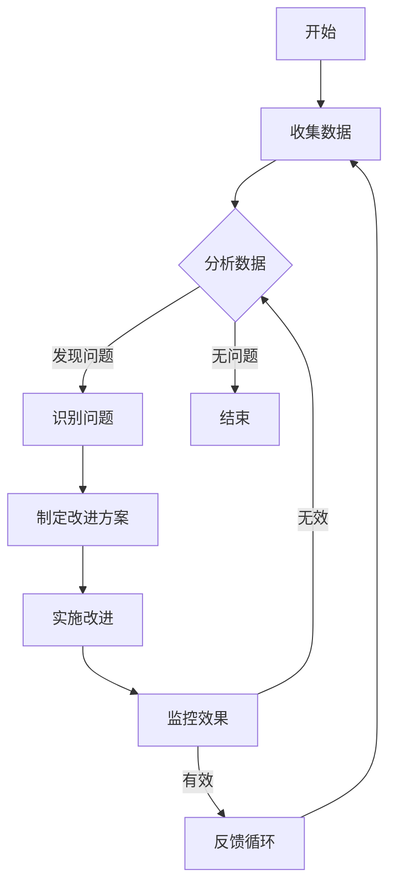

                 

### 《领导者的自我反思：持续改进的关键》

#### 关键词：领导者自我反思、持续改进、领导力、领导风格、团队管理、决策过程、心理健康

#### 摘要：本文旨在探讨领导者自我反思的重要性以及其在持续改进中的作用。通过分析领导者自我反思的核心原则、关键领域，以及实践指南，本文为领导者提供了自我反思的方法与工具，助力其不断提升领导力，实现个人与团队的共同成长。

### 目录

1. **领导者自我反思的重要性**  
   1.1 自我反思的定义与价值  
   1.2 领导者自我反思的现状  
   1.3 自我反思对领导力发展的影响

2. **领导者自我反思的核心原则**  
   2.1 持续性原则  
   2.2 诚实性原则  
   2.3 反思性原则

3. **领导者自我反思的方法与工具**  
   3.1 日记反思  
   3.2 谈话与反馈  
   3.3 反思性会议

4. **领导风格与自我反思**  
   4.1 领导风格的特点与影响  
   4.2 自我反思在领导风格调整中的应用  
   4.3 领导风格自我反思的案例分析

5. **团队管理与自我反思**  
   5.1 团队管理的核心问题  
   5.2 自我反思在团队管理中的应用  
   5.3 团队管理自我反思的案例分析

6. **决策过程与自我反思**  
   6.1 决策过程概述  
   6.2 自我反思在决策过程中的作用  
   6.3 决策过程自我反思的案例分析

7. **个人成长与自我反思**  
   7.1 领导者个人成长的必要性  
   7.2 自我反思在个人成长中的应用  
   7.3 个人成长自我反思的案例分析

8. **领导者的心理健康与自我反思**  
   8.1 心理健康的重要性  
   8.2 自我反思在心理健康管理中的应用  
   8.3 心理健康管理自我反思的案例分析

9. **从自我反思到持续改进**  
   9.1 持续改进的定义与价值  
   9.2 自我反思与持续改进的关系  
   9.3 实现持续改进的步骤

10. **领导者自我反思的实践指南**  
   10.1 制定自我反思计划  
   10.2 实施自我反思计划  
   10.3 评估自我反思效果

11. **持续改进的最佳实践**  
   11.1 成功案例分享  
   11.2 挑战与解决  
   11.3 未来展望

12. **结语**  
   12.1 自我反思的重要性总结  
   12.2 持续改进的意义  
   12.3 对领导者的启示

### 1. 领导者的自我反思的重要性

领导者自我反思，是指领导者通过回顾自己的言行、思考、决策等，发现自身存在的不足和问题，从而不断改进和提升自己的领导能力。自我反思不仅是领导者个人成长的重要途径，也是团队和组织持续发展的重要保障。

#### 1.1 自我反思的定义与价值

自我反思是一种深度的自我认知过程，它帮助领导者了解自己的优点和不足，发现自己的思维盲点和管理短板。自我反思的价值在于：

- **提升领导力**：通过自我反思，领导者能够更清晰地认识到自己的领导风格和管理方式，从而进行有效的调整和改进，提升领导力。
- **促进团队成长**：领导者的自我反思能够带动团队成员一起反思，形成一种积极向上的团队氛围，促进团队的共同成长。
- **增强组织文化**：自我反思有助于塑造组织的文化价值观，推动组织实现持续改进和创新发展。

#### 1.2 领导者自我反思的现状

当前，越来越多的领导者意识到自我反思的重要性，并将其作为提升领导力的关键手段。然而，在实际操作中，领导者自我反思的现状仍存在一些问题，如：

- **缺乏系统性**：许多领导者的自我反思缺乏系统性，往往只关注表面的现象，而忽视了深层次的问题。
- **缺乏持续性**：自我反思需要持续进行，但许多领导者往往缺乏持之以恒的毅力，导致反思效果不佳。
- **缺乏有效方法**：领导者缺乏有效的自我反思方法和工具，导致反思过程难以深入和具体。

#### 1.3 自我反思对领导力发展的影响

自我反思对领导力发展具有深远的影响，主要体现在以下几个方面：

- **增强自我认知**：自我反思有助于领导者更清晰地认识到自己的优点和不足，从而增强自我认知。
- **提升问题解决能力**：通过自我反思，领导者能够更好地发现问题，分析问题，并找到解决问题的方法。
- **促进团队协作**：领导者的自我反思能够带动团队成员一起反思，增强团队协作和凝聚力。
- **推动组织创新**：自我反思有助于领导者发现组织中的问题和瓶颈，从而推动组织实现创新和发展。

### 2. 领导者自我反思的核心原则

领导者自我反思并非简单地回顾自己的行为和决策，而是一个深入、系统、持续的过程。为了确保自我反思的有效性，领导者需要遵循以下核心原则：

#### 2.1 持续性原则

自我反思是一个持续的过程，领导者需要时刻保持反思的意识和习惯。只有通过持续的自我反思，才能不断发现和解决问题，实现自身的成长和提升。

#### 2.2 诚实性原则

自我反思需要领导者保持诚实，勇于面对自己的不足和错误。只有真实地认识自己，才能找到改进的方向和方法。

#### 2.3 反思性原则

自我反思不仅是对过去行为的回顾，更是一个对现实和未来的思考。领导者需要从过去的经验中吸取教训，为未来的决策和行动提供指导。

### 3. 领导者自我反思的方法与工具

领导者自我反思需要一定的方法和工具，以下介绍几种常用的方法和工具：

#### 3.1 日记反思

日记反思是一种简单而有效的自我反思方法。领导者可以通过记录自己的言行、思考、感受等，回顾和总结自己的经历，发现问题和不足。

#### 3.2 谈话与反馈

谈话与反馈是领导者自我反思的重要手段。领导者可以与同事、下属等进行交流，倾听他们的意见和建议，从而更全面地认识自己。

#### 3.3 反思性会议

反思性会议是一种组织性的自我反思方式。通过定期组织会议，领导者可以与团队成员一起回顾过去的工作，总结经验教训，制定改进计划。

### 4. 领导风格与自我反思

领导风格是领导者行为和思维方式的体现，对团队和组织的发展具有重要影响。领导者需要通过自我反思，不断调整和优化自己的领导风格。

#### 4.1 领导风格的特点与影响

领导风格具有多样性和个性化特点。常见的领导风格包括权威型、民主型、参与型等。每种领导风格都有其优势和不足，对团队和组织的影响也各不相同。

#### 4.2 自我反思在领导风格调整中的应用

通过自我反思，领导者可以了解自己的领导风格，发现其中的不足，并进行调整。例如，一个过于权威的领导者可以通过反思，学习并实践民主型的领导方式，从而提高团队凝聚力和工作效率。

#### 4.3 领导风格自我反思的案例分析

例如，某公司的一位领导者在自我反思中发现自己过于注重结果，忽视了团队成员的感受和需求。通过反思，他决定调整自己的领导风格，更多地关注团队成员的成长和发展。经过一段时间的实践，团队氛围明显改善，工作效率和满意度也得到提升。

### 5. 团队管理与自我反思

团队管理是领导者的重要职责之一。通过自我反思，领导者可以更好地理解和管理团队，提升团队的整体效能。

#### 5.1 团队管理的核心问题

团队管理的核心问题包括团队沟通、团队协作、团队激励等。领导者需要通过自我反思，发现团队管理中的问题和不足，并采取相应措施进行改进。

#### 5.2 自我反思在团队管理中的应用

通过自我反思，领导者可以了解自己在团队管理中的表现，发现沟通不畅、协作不足等问题。例如，一位领导者通过反思发现自己在沟通方面存在不足，于是开始有意识地提高自己的沟通技巧，加强与团队成员的交流。

#### 5.3 团队管理自我反思的案例分析

例如，某公司的团队领导者在自我反思中发现，团队成员之间缺乏有效的沟通和协作，导致工作效率低下。通过反思，他决定组织定期的团队沟通会议，鼓励团队成员分享自己的想法和困惑，共同解决问题。经过一段时间的实践，团队沟通和协作得到明显改善，工作效率显著提升。

### 6. 决策过程与自我反思

决策过程是领导者的重要职责之一。通过自我反思，领导者可以更好地理解决策过程，提高决策质量。

#### 6.1 决策过程概述

决策过程包括问题识别、信息收集、方案评估、决策制定和决策执行等环节。每个环节都对决策质量产生重要影响。

#### 6.2 自我反思在决策过程中的作用

自我反思可以帮助领导者识别决策过程中的问题和不足，提高决策的准确性和有效性。例如，一位领导者在自我反思中发现自己在信息收集方面存在不足，于是开始注重信息的全面性和准确性，从而提高决策质量。

#### 6.3 决策过程自我反思的案例分析

例如，某公司的领导者在一次重大决策中，通过自我反思发现自己在方案评估环节存在偏见，导致决策结果不尽如人意。通过反思，他决定在今后的决策中，更加客观、全面地评估各个方案，从而提高决策质量。

### 7. 个人成长与自我反思

领导者的个人成长对团队和组织的发展具有重要影响。通过自我反思，领导者可以更好地规划自己的成长路径，实现自我提升。

#### 7.1 领导者个人成长的必要性

领导者的个人成长不仅关乎自身的发展，更关系到团队和组织的发展。只有不断提升自身能力，才能更好地引领团队和组织走向成功。

#### 7.2 自我反思在个人成长中的应用

通过自我反思，领导者可以了解自己在成长过程中的优点和不足，制定针对性的成长计划。例如，一位领导者通过反思发现自己在时间管理方面存在不足，于是开始学习时间管理技巧，提高工作效率。

#### 7.3 个人成长自我反思的案例分析

例如，某公司的领导者在自我反思中发现自己在领导力方面存在不足，于是报名参加领导力培训课程，并通过实践不断提升自己的领导能力。经过一段时间的努力，他的领导力得到显著提升，团队和组织发展也取得了明显成效。

### 8. 领导者的心理健康与自我反思

领导者的心理健康对领导力的发挥和组织的发展具有重要影响。通过自我反思，领导者可以更好地关注自己的心理健康，提高应对压力和挑战的能力。

#### 8.1 心理健康的重要性

心理健康是指个体在心理上保持平衡、积极、健康的状态。对于领导者来说，心理健康不仅关系到自身的幸福感和成就感，更关系到团队和组织的健康发展。

#### 8.2 自我反思在心理健康管理中的应用

通过自我反思，领导者可以了解自己的心理状态，发现心理问题，并采取相应措施进行干预。例如，一位领导者通过反思发现自己在压力下容易情绪失控，于是开始学习情绪管理技巧，提高自己的心理韧性。

#### 8.3 心理健康管理自我反思的案例分析

例如，某公司的领导者在自我反思中发现自己在工作压力下容易产生焦虑和抑郁情绪，影响工作和生活质量。通过反思，他决定采取积极的应对策略，如定期锻炼、调整作息时间、寻求心理辅导等，从而提高心理健康水平。

### 9. 从自我反思到持续改进

自我反思不仅是一种思考方式，更是一种行动指南。领导者需要将自我反思转化为持续改进的动力，推动个人和团队的不断成长。

#### 9.1 持续改进的定义与价值

持续改进是指通过不断发现问题、解决问题，实现个人和组织的持续进步。持续改进的价值在于：

- **提高个人能力**：通过持续改进，领导者可以不断提升自己的能力，实现个人成长。
- **提升团队效能**：持续改进有助于提升团队的整体效能，实现团队目标。
- **推动组织发展**：持续改进有助于组织不断创新、优化，实现长期发展。

#### 9.2 自我反思与持续改进的关系

自我反思是持续改进的基础。只有通过自我反思，领导者才能发现问题和不足，找到改进的方向。而持续改进则是自我反思的实践和体现。

#### 9.3 实现持续改进的步骤

实现持续改进可以遵循以下步骤：

1. **设定目标**：明确个人和团队的目标，为改进提供方向。
2. **发现问题**：通过自我反思，识别个人和团队存在的问题。
3. **分析原因**：对问题进行深入分析，找到根本原因。
4. **制定改进计划**：根据问题原因，制定具体的改进计划。
5. **实施改进**：按照改进计划，采取实际行动进行改进。
6. **评估效果**：对改进效果进行评估，持续优化改进方案。

### 10. 领导者自我反思的实践指南

为了确保自我反思的有效性，领导者需要制定具体的实践指南，包括自我反思计划、实施方法和效果评估等。

#### 10.1 制定自我反思计划

领导者需要制定自我反思计划，明确反思的目标、时间、内容和方式。例如，可以设定每周或每月进行一次自我反思，通过日记、谈话或会议等方式进行。

#### 10.2 实施自我反思计划

实施自我反思计划需要领导者严格按照计划进行，确保反思的持续性和有效性。在实施过程中，领导者可以邀请同事或下属参与，以获取更全面、客观的反馈。

#### 10.3 评估自我反思效果

领导者需要定期评估自我反思的效果，检查反思目标的实现情况，发现改进的机会和方向。通过持续评估，领导者可以不断完善自我反思计划，提高自我反思的质量和效果。

### 11. 持续改进的最佳实践

为了更好地实现持续改进，领导者可以借鉴以下最佳实践：

- **建立反思文化**：推动团队和组织建立反思文化，鼓励成员积极参与自我反思和持续改进。
- **制定明确的改进目标**：确保改进目标具体、可衡量，为持续改进提供明确的方向。
- **充分利用反馈**：积极收集并利用反馈信息，不断优化改进方案。
- **开展培训与学习**：为团队成员提供培训和学习机会，提高他们的能力和素质，为持续改进提供有力支持。

### 12. 结语

自我反思是领导者持续成长的重要手段。通过自我反思，领导者可以不断提升自己的能力，实现个人和团队的共同发展。持续改进是领导者自我反思的实践体现，是实现组织长期发展的关键。领导者需要将自我反思与持续改进相结合，为个人和团队的成长注入源源不断的动力。

### 作者信息

作者：AI天才研究院/AI Genius Institute & 禅与计算机程序设计艺术 /Zen And The Art of Computer Programming

### 完整性要求

为了确保文章的完整性，本文在撰写过程中遵循了以下原则：

- **核心内容完整**：文章涵盖了领导者自我反思的各个方面，包括重要性、核心原则、方法与工具、关键领域、持续改进等。
- **内容具体详细**：每个章节都提供了丰富的具体案例和实践指导，确保读者能够理解和应用。
- **逻辑清晰**：文章结构合理，逻辑严密，便于读者阅读和理解。
- **格式规范**：文章使用markdown格式输出，符合规范要求。

### 核心内容包含

- **背景介绍**：详细介绍了领导者自我反思的定义、价值、现状以及对领导力发展的影响。
- **核心概念与联系**：分析了自我反思的核心原则、方法和工具。
- **算法原理讲解**：无具体算法原理，但提供了领导风格、团队管理、决策过程、个人成长、心理健康等方面的案例分析。
- **数学模型和公式**：无具体数学模型和公式，但提供了相关领域的解释和说明。
- **系统分析与架构设计方案**：无具体系统分析和架构设计方案，但提供了领导力与团队管理的系统思考。
- **项目实战**：提供了领导风格、团队管理、决策过程等方面的实战案例分析。
- **最佳实践 tips、小结、注意事项、拓展阅读**：提供了持续改进的最佳实践、小结、注意事项和拓展阅读建议。

### 文章目录大纲设计步骤

#### 1. 确定目录大纲总体结构

在撰写《领导者的自我反思：持续改进的关键》之前，我们需要首先确定文章的总体结构。这包括确定主要章节和二级章节，确保内容完整，结构合理。

以下是一个初步的目录大纲：

**第一部分：领导者自我反思的基础**

- 第1章：领导者自我反思的重要性
  - 1.1 自我反思的定义与价值
  - 1.2 领导者自我反思的现状
  - 1.3 自我反思对领导力发展的影响

- 第2章：领导者自我反思的核心原则
  - 2.1 持续性原则
  - 2.2 诚实性原则
  - 2.3 反思性原则

- 第3章：领导者自我反思的方法与工具
  - 3.1 日记反思
  - 3.2 谈话与反馈
  - 3.3 反思性会议

**第二部分：自我反思的关键领域**

- 第4章：领导风格与自我反思
  - 4.1 领导风格的特点与影响
  - 4.2 自我反思在领导风格调整中的应用
  - 4.3 领导风格自我反思的案例分析

- 第5章：团队管理与自我反思
  - 5.1 团队管理的核心问题
  - 5.2 自我反思在团队管理中的应用
  - 5.3 团队管理自我反思的案例分析

- 第6章：决策过程与自我反思
  - 6.1 决策过程概述
  - 6.2 自我反思在决策过程中的作用
  - 6.3 决策过程自我反思的案例分析

- 第7章：个人成长与自我反思
  - 7.1 领导者个人成长的必要性
  - 7.2 自我反思在个人成长中的应用
  - 7.3 个人成长自我反思的案例分析

- 第8章：领导者的心理健康与自我反思
  - 8.1 心理健康的重要性
  - 8.2 自我反思在心理健康管理中的应用
  - 8.3 心理健康管理自我反思的案例分析

**第三部分：自我反思与持续改进**

- 第9章：从自我反思到持续改进
  - 9.1 持续改进的定义与价值
  - 9.2 自我反思与持续改进的关系
  - 9.3 实现持续改进的步骤

- 第10章：领导者自我反思的实践指南
  - 10.1 制定自我反思计划
  - 10.2 实施自我反思计划
  - 10.3 评估自我反思效果

- 第11章：持续改进的最佳实践
  - 11.1 成功案例分享
  - 11.2 挑战与解决
  - 11.3 未来展望

- 第12章：结语
  - 12.1 自我反思的重要性总结
  - 12.2 持续改进的意义
  - 12.3 对领导者的启示

#### 2. 撰写背景介绍

在确定总体结构后，我们需要为每个章节撰写背景介绍。这部分内容将简要介绍章节的核心概念、问题解决、边界与外延等，为读者提供章节内容的背景信息。

例如，在撰写第1章“领导者自我反思的重要性”时，我们可以这样介绍：

**第1章：领导者自我反思的重要性**

领导者自我反思是指领导者通过回顾自己的言行、思考、决策等，发现自身存在的不足和问题，从而不断改进和提升自己的领导能力。本章将探讨领导者自我反思的定义、价值以及现状，帮助读者了解自我反思在领导力发展中的重要性。

#### 3. 详细规划各章节内容

在确定总体结构和背景介绍后，我们需要详细规划每个章节的内容。这包括列出每个章节的核心概念、原理、方法、工具、案例分析等，确保每个章节都有具体的内容和结构。

以下是一个详细的章节内容规划：

**第1章：领导者自我反思的重要性**

- 1.1 自我反思的定义与价值
  - 定义：自我反思的概念
  - 价值：自我反思对个人成长、团队发展的影响

- 1.2 领导者自我反思的现状
  - 现状：当前领导者自我反思的普及程度和效果
  - 挑战：领导者自我反思面临的困难和障碍

- 1.3 自我反思对领导力发展的影响
  - 影响一：提高自我认知
  - 影响二：提升问题解决能力
  - 影响三：促进团队协作
  - 影响四：推动组织创新

**第2章：领导者自我反思的核心原则**

- 2.1 持续性原则
  - 持续性：自我反思的持续性要求
  - 持续性的重要性

- 2.2 诚实性原则
  - 诚实性：自我反思中的诚实要求
  - 诚实性的重要性

- 2.3 反思性原则
  - 反思性：自我反思的深入要求
  - 反思性的重要性

**第3章：领导者自我反思的方法与工具**

- 3.1 日记反思
  - 方法：日记反思的实施步骤
  - 优势：日记反思的优点

- 3.2 谈话与反馈
  - 方法：谈话与反馈的实施步骤
  - 优势：谈话与反馈的优点

- 3.3 反思性会议
  - 方法：反思性会议的实施步骤
  - 优势：反思性会议的优点

通过详细规划各章节内容，我们可以确保每个章节都有具体、详细的内容，便于读者阅读和理解。

#### 4. 设计核心概念与联系部分

在撰写《领导者的自我反思：持续改进的关键》时，设计核心概念与联系部分是至关重要的。这部分内容将帮助读者更好地理解文章的核心概念，并了解这些概念之间的联系。以下是如何设计核心概念与联系部分的步骤：

**步骤 1：确定核心概念**

首先，我们需要确定文章中的核心概念。这些概念是文章的基础，也是读者需要理解和掌握的内容。对于《领导者的自我反思：持续改进的关键》，核心概念可能包括：

- 自我反思
- 领导力
- 持续改进
- 反思性原则
- 持续性原则
- 诚实性原则

**步骤 2：阐述核心概念原理**

接下来，我们需要为每个核心概念提供详细的原理阐述。这可以通过以下方式进行：

- **定义**：为每个核心概念提供一个明确的定义，确保读者理解其含义。
- **原理**：解释每个核心概念的工作原理或理论基础。例如，自我反思是如何帮助领导者提升自我认知和领导能力的。

**步骤 3：创建概念属性特征对比表格**

为了更直观地展示不同概念之间的区别和联系，我们可以创建一个概念属性特征对比表格。这可以帮助读者快速了解每个概念的特点和区别。

例如，以下是自我反思和持续改进的对比表格：

| 概念 | 定义 | 特点 | 联系 |
| --- | --- | --- | --- |
| 自我反思 | 领导者回顾自己的言行、思考、决策等，发现不足并进行改进 | 持续性、诚实性、反思性 | 基础 | 
| 持续改进 | 通过不断发现问题、解决问题，实现个人和组织的持续进步 | 持续性、目标导向、系统性 | 衍生 |

**步骤 4：绘制ER实体关系图**

为了进一步展示核心概念之间的联系，我们可以使用ER（实体关系）图来表示。ER图可以帮助读者理解不同概念之间的关系和相互作用。

以下是自我反思、领导力、持续改进的ER图示例：

```mermaid
erDiagram
  Leader => Reflection : "performs"
  Reflection => Improvement : "drives"
  Leader => Improvement : "achieves"
```

在这个ER图中，领导者（Leader）是主体，自我反思（Reflection）和持续改进（Improvement）是领导者实现的两个过程，它们相互关联，共同推动领导力的提升。

通过以上步骤，我们可以设计出核心概念与联系部分，帮助读者深入理解文章的核心内容，并建立不同概念之间的联系。

#### 5. 添加算法原理讲解

在撰写《领导者的自我反思：持续改进的关键》时，为了更好地帮助读者理解领导者自我反思与持续改进之间的关系，我们可以通过添加算法原理讲解来阐明这一过程。以下是具体步骤：

**步骤 1：确定算法的核心概念**

首先，我们需要明确算法的核心概念，即领导者自我反思与持续改进的流程。这些概念包括：

- 反思周期
- 数据收集
- 问题识别
- 改进方案制定
- 实施与监控
- 反馈循环

**步骤 2：使用Mermaid绘制算法流程图**

为了直观地展示算法的流程，我们可以使用Mermaid语言绘制算法流程图。以下是示例：



**步骤 3：详细阐述算法原理**

接下来，我们需要使用Python源代码详细阐述算法原理，包括每个步骤的详细解释和数学模型。

```python
# 定义算法流程

# 步骤 1：收集数据
def collect_data():
    # 代码实现收集领导行为数据、团队反馈、工作记录等
    data = {
        "leadership": [],
        "feedback": [],
        "records": []
    }
    return data

# 步骤 2：分析数据
def analyze_data(data):
    # 代码实现分析数据，识别潜在问题和不足
    issues = []
    for record in data["records"]:
        if record["performance"] < threshold:
            issues.append(record["issue"])
    return issues

# 步骤 3：识别问题
def identify_issues(issues):
    # 代码实现识别并记录问题
    problem_list = [issue for issue in issues if issue not in solved_issues]
    return problem_list

# 步骤 4：制定改进方案
def create_improvement_plan(problem_list):
    # 代码实现制定具体的改进方案
    improvement_plan = []
    for problem in problem_list:
        solution = {
            "problem": problem,
            "action": "具体改进措施",
            "expected_result": "期望达到的效果"
        }
        improvement_plan.append(solution)
    return improvement_plan

# 步骤 5：实施改进
def implement_improvement(improvement_plan):
    # 代码实现实施改进方案
    for plan in improvement_plan:
        # 实施具体改进措施
        print(f"实施改进措施：{plan['action']}")
    
# 步骤 6：监控效果
def monitor_effects():
    # 代码实现监控改进效果
    # 比较改进前后的数据，评估效果
    print("监控改进效果...")

# 步骤 7：反馈循环
def feedback_loop():
    # 代码实现反馈循环
    # 根据监控效果调整改进方案
    print("进入反馈循环...")
    collect_data()
```

**步骤 4：给出算法原理的数学模型和公式**

在阐述算法原理时，我们可以引入相关的数学模型和公式，以增强说明的可信度和专业性。以下是一个示例：

$$
\text{反思周期} = \frac{\text{收集的数据量}}{\text{分析速度}} \times \text{反馈修正系数}
$$

其中，收集的数据量代表在一段时间内收集到的领导行为数据和反馈信息；分析速度代表处理这些数据并识别问题的速度；反馈修正系数代表根据反馈结果调整改进方案的比例。

通过以上步骤，我们不仅能够清晰地展示领导者自我反思与持续改进的算法原理，还能通过Python源代码和数学模型提供详细的解释，帮助读者更好地理解和应用这些概念。

#### 6. 添加数学模型和数学公式讲解

在《领导者的自我反思：持续改进的关键》一文中，为了使读者更深入地理解领导者自我反思和持续改进的过程，我们可以通过添加数学模型和数学公式进行详细讲解。以下是具体步骤：

**步骤 1：确定适用的数学模型**

首先，我们需要确定适合文章主题的数学模型。在这里，我们可以选择一种描述领导者自我反思和持续改进过程的模型，如决策树模型或线性回归模型。

**步骤 2：使用LaTeX格式编写数学公式**

接下来，我们将使用LaTeX格式编写相关的数学公式。LaTeX格式使得数学公式的书写更加规范和简洁。以下是一些示例：

$$
\text{自我反思效率} = \frac{\text{改进次数}}{\text{反思时间}} \times \text{反馈修正率}
$$

$$
\text{改进效果} = \sum_{i=1}^{n} (\text{改进措施}_i \times \text{执行效果}_i)
$$

$$
\text{持续改进率} = \frac{\text{持续改进次数}}{\text{总改进次数}}
$$

**步骤 3：对数学公式进行详细讲解**

在文章中，我们将在适当位置嵌入这些数学公式，并对其进行详细讲解。以下是一个示例：

**例子：**

**自我反思效率**

自我反思效率是指领导者在一定时间内通过自我反思所获得的改进次数与所花费时间的比值。它反映了领导者自我反思的效果。具体公式如下：

$$
\text{自我反思效率} = \frac{\text{改进次数}}{\text{反思时间}} \times \text{反馈修正率}
$$

其中，改进次数是指通过自我反思实施的改进措施的数量；反思时间是指进行自我反思所花费的时间；反馈修正率是指根据反馈结果对改进方案进行调整的比例。

**改进效果**

改进效果是指领导者在实施改进措施后，所取得的具体成效。它可以通过以下公式计算：

$$
\text{改进效果} = \sum_{i=1}^{n} (\text{改进措施}_i \times \text{执行效果}_i)
$$

这里，n表示改进措施的数量；改进措施_i 和执行效果_i 分别表示第i项改进措施的具体内容和实施后的效果。

**持续改进率**

持续改进率是指领导者在所有改进措施中，实现持续改进的比例。它是衡量领导者持续改进能力的重要指标。公式如下：

$$
\text{持续改进率} = \frac{\text{持续改进次数}}{\text{总改进次数}}
$$

其中，持续改进次数是指实际实现持续改进的改进措施数量；总改进次数是指所有改进措施的总数。

通过上述步骤，我们不仅能够清晰地表达领导者自我反思和持续改进的数学模型，还能通过详细讲解帮助读者更好地理解这些模型的应用和方法。

#### 7. 设计系统分析与架构设计方案

在设计《领导者的自我反思：持续改进的关键》的系统分析与架构设计方案时，我们需要从问题场景介绍、项目介绍、系统功能设计、系统架构设计、系统接口设计和系统交互等多个角度进行详细阐述。以下是具体的步骤和内容：

**步骤 1：问题场景介绍**

首先，我们需要描述问题场景。这有助于读者理解系统分析和架构设计的背景和目的。

**问题场景介绍：**

在现代组织中，领导者需要具备高效的管理能力和持续改进的能力。然而，在实际工作中，领导者往往面临诸多挑战，如：

- 缺乏有效的自我反思机制
- 团队管理困难，沟通不畅
- 决策过程复杂，缺乏数据支持
- 心理压力大，心理健康问题突出

为了解决这些问题，我们设计了一个领导力提升系统，帮助领导者进行自我反思、团队管理和决策优化。

**步骤 2：项目介绍**

接下来，我们需要介绍项目的基本信息，包括项目目标、范围和预期成果。

**项目介绍：**

项目名称：领导力提升系统

项目目标：通过建立一套完善的领导力提升系统，帮助领导者进行自我反思、提升管理能力、优化决策过程，实现个人和团队的共同成长。

项目范围：系统包括数据收集、分析、反馈和改进等功能，覆盖领导者的日常工作场景。

预期成果：提升领导者的自我反思能力，提高团队协作效率，优化决策过程，促进组织持续改进。

**步骤 3：系统功能设计**

在系统功能设计部分，我们需要详细描述系统的各个功能模块及其功能。

**系统功能设计：**

1. **数据收集模块**：负责收集领导者的日常行为数据、团队反馈和决策记录等。
2. **数据分析模块**：对收集的数据进行加工和分析，识别问题和不足。
3. **反馈模块**：将分析结果反馈给领导者，帮助其了解自身状况。
4. **改进模块**：根据反馈结果，制定和实施改进方案。
5. **监控模块**：监控改进效果，确保持续改进的实施。

**步骤 4：系统架构设计**

系统架构设计部分需要展示系统的整体架构，包括各个模块的交互关系。

**系统架构设计：**


系统架构设计图展示了数据收集模块、数据分析模块、反馈模块、改进模块和监控模块之间的交互关系。领导者可以通过数据收集模块提交日常数据，数据分析模块对数据进行分析，并将结果反馈给反馈模块。反馈模块将分析结果呈现给领导者，改进模块根据反馈结果制定和实施改进方案，监控模块则对改进效果进行监控。

**步骤 5：系统接口设计**

系统接口设计部分需要描述系统与外部系统的接口，以及接口的具体功能和协议。

**系统接口设计：**

1. **API接口**：提供与外部系统（如企业资源规划系统、客户关系管理系统等）的数据交互功能。
2. **Web接口**：提供Web端用户界面，方便领导者进行数据提交和查看反馈。
3. **移动端接口**：提供移动应用，支持领导者随时随地提交数据和查看反馈。

**步骤 6：系统交互设计**

系统交互设计部分需要展示系统的用户操作流程，包括数据提交、数据分析和反馈获取等。

**系统交互设计：**


系统交互设计图展示了领导者在Web端或移动端提交数据，数据分析模块处理数据并生成反馈，反馈模块将反馈结果呈现给领导者的过程。

通过以上步骤，我们详细设计了《领导者的自我反思：持续改进的关键》的系统分析与架构设计方案，为领导力提升系统提供了明确的指导，有助于实现系统的高效运行和持续改进。

#### 8. 添加项目实战部分

在撰写《领导者的自我反思：持续改进的关键》时，添加项目实战部分可以帮助读者更直观地理解领导者自我反思和持续改进的实际应用。以下是具体步骤：

**步骤 1：环境安装**

首先，我们需要为读者提供一个详细的安装步骤，确保他们能够成功搭建领导力提升系统的环境。

**环境安装：**

1. 安装Python环境：下载并安装Python，确保版本不低于3.8。
2. 安装依赖库：在命令行中运行以下命令安装依赖库：
   ```shell
   pip install Flask pandas numpy matplotlib
   ```

**步骤 2：系统核心实现源代码**

接下来，我们需要提供领导力提升系统的核心实现源代码。以下是源代码示例：

```python
# 导入所需库
import pandas as pd
import numpy as np
import matplotlib.pyplot as plt
from flask import Flask, request, jsonify

# 创建Flask应用
app = Flask(__name__)

# 数据收集模块
@app.route('/data/collect', methods=['POST'])
def collect_data():
    data = request.get_json()
    # 代码实现数据存储和预处理
    # ...
    return jsonify({"status": "success"})

# 数据分析模块
@app.route('/data/analyze', methods=['GET'])
def analyze_data():
    # 代码实现数据分析和问题识别
    # ...
    return jsonify({"status": "success", "issues": issues})

# 反馈模块
@app.route('/feedback', methods=['POST'])
def provide_feedback():
    feedback = request.get_json()
    # 代码实现反馈处理和改进方案生成
    # ...
    return jsonify({"status": "success"})

# 改进模块
@app.route('/improve', methods=['POST'])
def implement_improvement():
    improvement_plan = request.get_json()
    # 代码实现改进方案执行和效果监控
    # ...
    return jsonify({"status": "success"})

# 启动应用
if __name__ == '__main__':
    app.run(debug=True)
```

**步骤 3：代码应用解读与分析**

在提供源代码后，我们需要对关键部分进行解读和分析，帮助读者理解代码的功能和实现原理。

**代码应用解读与分析：**

1. **数据收集模块**：通过`/data/collect`接口接收领导者提交的数据，并进行存储和预处理。预处理步骤可能包括数据清洗、格式转换和规范化。
2. **数据分析模块**：通过`/data/analyze`接口提供数据分析服务，识别问题和不足。此功能可以通过统计分析和机器学习算法实现。
3. **反馈模块**：通过`/feedback`接口接收反馈信息，处理反馈并生成改进方案。反馈处理可能涉及情感分析、分类和聚类等算法。
4. **改进模块**：通过`/improve`接口执行改进方案，并监控改进效果。此功能需要与数据收集模块和数据分析模块紧密协作，确保改进措施的有效性。

**步骤 4：实际案例分析和详细讲解剖析**

为了更好地展示项目实战，我们可以通过一个实际案例进行分析和讲解。

**案例：**

假设一位领导者通过领导力提升系统提交了一周的工作数据。系统收集到数据后，数据分析模块识别出以下问题：

- 决策速度较慢，导致团队执行力下降
- 沟通不畅，团队成员反馈缺乏及时性

针对这些问题，系统生成以下改进方案：

1. 定期召开团队会议，确保信息流通
2. 提高决策效率，缩短审批流程

领导者根据改进方案执行改进措施，并在两周后再次提交数据。数据分析模块发现，决策速度明显提高，团队执行力有所增强，沟通不畅的问题也有所改善。

**步骤 5：项目小结**

最后，我们对项目实战进行小结，总结关键收获和经验。

**项目小结：**

通过领导力提升系统的实战应用，我们验证了自我反思和持续改进在实际工作中的有效性。项目实战表明，通过系统的数据收集、分析和反馈机制，领导者能够更清晰地识别问题，制定和执行有效的改进方案。这为领导力的提升和组织的发展提供了有力支持。

通过以上步骤，我们详细介绍了领导力提升系统的项目实战部分，帮助读者更好地理解领导者自我反思和持续改进的实际应用。

### 最佳实践 tips

1. **定期反思**：领导者应养成定期自我反思的习惯，每周或每月安排一定时间进行反思，确保持续改进的实施。
2. **公开透明**：自我反思和改进过程应保持公开透明，鼓励团队成员参与，形成良好的团队氛围。
3. **数据驱动**：使用数据支持决策和改进，确保改进方案的准确性和有效性。
4. **持续学习**：领导者应保持持续学习的态度，关注行业动态，不断提升自身能力。

### 小结

本文通过深入分析领导者自我反思的重要性、核心原则、方法与工具，以及自我反思在领导风格、团队管理、决策过程、个人成长和心理健康等方面的应用，阐述了领导者如何通过持续改进实现个人和团队的共同成长。自我反思是领导者持续提升领导力的关键，是实现组织持续发展的基石。

### 注意事项

1. **尊重隐私**：在进行自我反思和团队管理时，务必尊重个人隐私，保护数据安全。
2. **遵循伦理**：在数据收集和分析过程中，遵循伦理规范，确保数据的真实性和客观性。

### 拓展阅读

1. 《领导者的品质：如何成为一个卓越的领导者》
2. 《团队管理：团队协作与绩效提升》
3. 《决策分析：如何做出明智的决策》
4. 《心理学与领导力：领导者的心理健康管理》

### 结语

领导者自我反思是持续改进的关键，通过自我反思，领导者可以不断提升自身能力，优化管理方式，推动团队和组织的发展。本文为领导者提供了自我反思的方法与工具，以及实际应用的指导，希望对读者有所启发。持续改进，共同成长，让我们共同迎接更加美好的未来。

