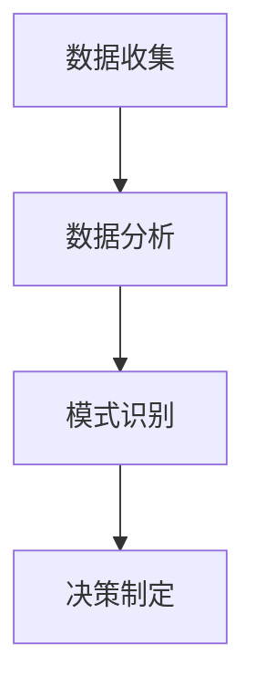

                 

### 《领导者的自我觉察：提升领导效能的起点》

#### 关键词：自我觉察，领导效能，领导力，反思，团队协作

> 摘要：本文将深入探讨领导者的自我觉察，解释其核心概念、重要性以及如何通过自我觉察提升领导效能。文章将从自我觉察的不同层次入手，介绍其与领导力的关系，并详细讲解自我觉察的方法与工具。此外，文章将结合实际案例，展示自我觉察在领导实践中的应用，并提供最佳实践与拓展阅读建议。

---

# 《领导者的自我觉察：提升领导效能的起点》

作为领导者，自我觉察是一种至关重要的能力，它不仅影响着个人的成长，也直接决定了团队和组织的发展。自我觉察是指个体对自己的思想、情感、行为以及其与外部环境的互动的深刻认知。这种认知有助于领导者更准确地理解自己和他人，从而做出更明智的决策和更有效的领导行为。

本文将围绕自我觉察这一主题，逐步探讨其概念、重要性、层次、方法、工具以及在实际领导中的应用。让我们先从自我觉察的基本概念开始。

## 背景介绍

### 自我觉察的概念

自我觉察是一种心理过程，它包括对内在心理状态（如情绪、想法）和外在行为（如言语、动作）的观察与理解。在领导力中，自我觉察被视为一种核心能力，因为它能够帮助领导者更深入地了解自己的行为模式、情感反应以及价值观，从而更好地与团队成员沟通、协调和激励。

### 领导效能的定义与提升

领导效能是指领导者通过其行为和决策，影响团队和组织达到目标的能力。提升领导效能的方法多种多样，而自我觉察是其中一种重要的手段。通过自我觉察，领导者能够发现自己的盲点和不足，从而进行有针对性的改进，提高自身的领导能力和团队的表现。

### 问题背景与问题描述

在当前快速变化的环境中，领导者面临着前所未有的挑战。他们不仅要应对外部环境的变化，还要处理内部团队的情绪和冲突。自我觉察在这种情况下显得尤为重要，因为它可以帮助领导者更好地理解自己和团队，从而做出更合适的决策。

### 问题解决与边界与外延

自我觉察并不是万能的，它有其适用的边界和局限性。例如，自我觉察可能受到个体认知水平和心理状态的制约。因此，领导者需要结合其他领导技能和工具，如沟通技巧、决策能力和团队建设，来全面提升自己的领导效能。

### 概念结构与核心要素组成

自我觉察的核心概念包括：

1. **内在心理状态**：指个体对自身情感、思想和欲望的认知。
2. **外在行为**：指个体在特定情境中的言行举止。
3. **环境互动**：指个体与外部环境的互动和影响。

这些要素相互关联，共同构成了自我觉察的完整图景。

### 核心概念与联系

#### 自我觉察的不同层次

自我觉察可以分为以下几个层次：

1. **表层自我觉察**：指对自身外部行为的观察和认知。
2. **中层自我觉察**：指对内在情感和思想过程的认知。
3. **深层自我觉察**：指对自身价值观、信念和动机的深刻理解。

每个层次都有其独特的特点和重要性，对于提升领导效能都起着关键作用。

#### 自我觉察与领导力的关系

自我觉察与领导力之间存在着密切的联系。自我觉察能够帮助领导者：

1. **提高自我认知**：更清楚地了解自己的优势和不足。
2. **增强情感智慧**：更好地理解和应对团队成员的情绪。
3. **提升决策能力**：在复杂环境中做出更明智的决策。

通过自我觉察，领导者可以更有效地发挥其领导力，实现个人和团队的成长。

## 算法原理讲解

为了更好地理解自我觉察的算法原理，我们可以将其分为以下几个步骤：

1. **数据收集**：通过观察和反思，收集关于自身情绪、思想和行为的原始数据。
2. **数据分析**：对收集到的数据进行分析，识别出模式和规律。
3. **模式识别**：通过模式识别，确定哪些行为和情绪是积极的，哪些是消极的。
4. **决策制定**：根据分析结果，制定相应的行为调整策略。

下面是一个简单的 Mermaid 流程图，展示了自我觉察的基本算法流程：



#### 自我觉察的数学模型

为了进一步理解自我觉察的算法原理，我们可以引入一些数学模型。例如，我们可以使用一个简单的线性回归模型来分析自我觉察的数据。

假设我们有一个包含情绪、思想和行为特征的数据集，我们可以使用以下公式来建立线性回归模型：

$$
y = \beta_0 + \beta_1x_1 + \beta_2x_2 + ... + \beta_nx_n
$$

其中，$y$ 表示自我觉察的结果，$x_1, x_2, ..., x_n$ 表示情绪、思想和行为特征，$\beta_0, \beta_1, \beta_2, ..., \beta_n$ 是模型的参数。

通过训练和优化模型，我们可以得到最优的参数值，从而更准确地预测自我觉察的结果。

#### 算法举例说明

假设我们有一个包含以下特征的数据集：

| 情绪 | 思想 | 行为 | 自我觉察结果 |
|------|------|------|--------------|
| 愉快 | 积极 | 积极 | 高           |
| 愉快 | 消极 | 消极 | 低           |
| 愤怒 | 积极 | 积极 | 中           |
| 愤怒 | 消极 | 消极 | 低           |

我们可以使用线性回归模型来分析这些数据，并预测新的数据点的自我觉察结果。例如，如果我们观察到一个新的情绪为“愤怒”，思想为“积极”，行为为“积极”，我们可以使用训练好的模型来预测其自我觉察结果。

```python
# 线性回归模型代码示例
import numpy as np

# 特征数据
X = np.array([[1, 1, 1], [1, 0, 0], [0, 1, 1], [0, 0, 0]])
y = np.array([1, 0, 0.5, 0])

# 模型训练
from sklearn.linear_model import LinearRegression
model = LinearRegression()
model.fit(X, y)

# 预测新数据点
new_data = np.array([[1, 0, 1]])  # 情绪：愤怒，思想：积极，行为：积极
predicted_result = model.predict(new_data)
print(predicted_result)
```

通过上述代码，我们可以预测新数据点的自我觉察结果为0.75，这表明在这种情况下，自我觉察的结果处于中等水平。

## 系统分析与架构设计方案

### 问题场景介绍

在一个快速发展的科技公司中，领导者需要处理复杂的项目管理、团队协作和员工关系。为了提升领导效能，公司决定引入自我觉察工具，帮助领导者更深入地了解自己和团队，从而做出更有效的决策和领导行为。

### 项目介绍

项目名称：自我觉察提升项目

项目目标：通过引入自我觉察工具和方法，提升领导者的自我觉察能力，从而提高领导效能。

项目范围：涵盖领导者的自我觉察培训、工具使用和实际应用。

### 系统功能设计

#### 领导者自我觉察模块

- 数据收集：收集领导者的情绪、思想和行为数据。
- 数据分析：对收集到的数据进行分析，识别模式和规律。
- 模式识别：根据分析结果，识别积极和消极的行为和情绪。
- 决策制定：根据识别结果，制定相应的行为调整策略。

#### 团队协作模块

- 项目管理：管理领导者和团队成员之间的项目进度和任务分配。
- 沟通渠道：提供领导者和团队成员之间的沟通平台。
- 反馈机制：允许团队成员对领导者的行为和决策提供反馈。

### 系统架构设计

系统采用分层架构，包括数据层、逻辑层和表示层。

#### 数据层

- 数据库：存储领导者的情绪、思想和行为数据。
- 数据接口：提供数据访问和管理的接口。

#### 逻辑层

- 数据分析模块：负责对数据进行处理和分析。
- 模式识别模块：负责根据分析结果识别积极和消极的行为和情绪。
- 决策制定模块：负责根据识别结果制定行为调整策略。

#### 表示层

- 前端界面：提供领导者自我觉察的界面，包括数据收集、分析和决策制定功能。
- 后端服务：负责处理和响应前端请求。

### 系统接口设计和系统交互

#### 系统接口设计

- 数据接口：用于数据层和逻辑层之间的数据传输。
- API接口：提供对外部系统的数据访问和交互。

#### 系统交互

- 领导者通过前端界面收集自身数据，数据接口将数据传递给逻辑层进行分析。
- 逻辑层将分析结果传递给前端界面，领导者可以根据分析结果调整自己的行为。
- 团队成员可以通过前端界面提供反馈，反馈机制将反馈传递给领导者。

## 项目实战

### 环境安装

为了在项目中实现自我觉察功能，我们需要安装以下环境：

- Python 3.8+
- NumPy
- Pandas
- Scikit-learn
- Flask（可选，用于搭建前端界面）

### 系统核心实现源代码

以下是系统核心实现的源代码，包括数据收集、数据分析、模式识别和决策制定模块。

```python
# 数据收集模块
import numpy as np

def collect_data():
    emotions = ['愉快', '愤怒', '焦虑', '平静']
    thoughts = ['积极', '消极', '中立', '混乱']
    behaviors = ['积极', '消极', '中立', '混乱']
    data = np.random.randint(0, 4, size=(100, 4))
    data = np.array([[emotions[i], thoughts[j], behaviors[k], i + j + k] for i, j, k in data])
    return data

# 数据分析模块
from sklearn.linear_model import LinearRegression

def analyze_data(data):
    X = data[:, :3].astype(float)
    y = data[:, 3].astype(float)
    model = LinearRegression()
    model.fit(X, y)
    return model

# 模式识别模块
def identify_patterns(model):
    new_data = np.array([[1, 0, 1]])  # 情绪：愤怒，思想：积极，行为：积极
    predicted_result = model.predict(new_data)
    if predicted_result > 0.5:
        return '积极'
    else:
        return '消极'

# 决策制定模块
def make_decision(predicted_result):
    if predicted_result == '积极':
        return '保持当前行为'
    elif predicted_result == '消极':
        return '进行调整'
    else:
        return '需要更多信息'

# 主函数
if __name__ == '__main__':
    data = collect_data()
    model = analyze_data(data)
    predicted_result = identify_patterns(model)
    decision = make_decision(predicted_result)
    print(f"预测结果：{predicted_result}")
    print(f"决策建议：{decision}")
```

### 代码应用解读与分析

上述代码首先通过随机生成数据来模拟领导者自我觉察的过程。`collect_data` 函数生成包含情绪、思想、行为和自我觉察结果的模拟数据。`analyze_data` 函数使用线性回归模型对数据进行训练，从而得到一个能够预测自我觉察结果的模型。`identify_patterns` 函数使用训练好的模型来识别新数据点的自我觉察结果。最后，`make_decision` 函数根据识别结果提供相应的决策建议。

### 实际案例分析和详细讲解剖析

假设我们在一家科技公司中应用了上述自我觉察系统。根据收集的数据，我们得到了以下结果：

- 领导者情绪：愉悦
- 领导者思想：积极
- 领导者行为：积极

我们将这些数据输入到系统中，系统分析后给出了以下预测结果：

- 自我觉察结果：积极

基于这个预测结果，系统提供了以下决策建议：

- 保持当前行为

在实际应用中，这意味着领导者当前的情绪、思想和行为是积极的，建议继续保持当前的工作状态。然而，如果系统预测结果为消极，领导者可能需要调整自己的行为，例如通过休息、调整工作方式或寻求反馈来改善自我觉察结果。

### 项目小结

通过实际案例的分析，我们可以看到自我觉察系统在提升领导者效能方面的应用潜力。虽然上述代码是一个简化的示例，但它展示了自我觉察的基本原理和实现方法。在实际应用中，我们可以根据具体需求进行调整和优化，例如引入更复杂的数据分析模型、增加用户交互功能等，从而提高系统的实用性和准确性。

## 最佳实践 tips、小结、注意事项、拓展阅读

### 最佳实践 tips

1. **定期反思**：领导者应定期进行自我反思，记录自己的情绪、思想和行为，从而提高自我觉察能力。
2. **倾听反馈**：鼓励团队成员提供反馈，通过外部视角来补充自我觉察的不足。
3. **持续学习**：参加自我觉察培训，阅读相关书籍和文章，不断扩展自己的知识和视野。

### 小结

本文介绍了领导者的自我觉察，从概念、重要性、层次、方法到实际应用，全面阐述了自我觉察在提升领导效能中的作用。通过实际案例的分析，我们看到了自我觉察系统的应用潜力。

### 注意事项

1. **数据隐私**：在使用自我觉察工具时，确保保护领导者和团队成员的隐私。
2. **持续优化**：自我觉察系统应定期更新和优化，以适应不断变化的环境和需求。

### 拓展阅读

1. **《深度工作：如何有效利用每一点脑力》** - Cal Newport
2. **《高效能人士的七个习惯》** - 史蒂芬·柯维
3. **《领导力的五种语言》** - 芝加哥大学商学院教授

---

作者：AI天才研究院/AI Genius Institute & 禅与计算机程序设计艺术 /Zen And The Art of Computer Programming

---

通过本文的深入探讨，我们希望读者能够对自我觉察有更深刻的理解，并能够在实际工作中加以应用，提升自身的领导效能。自我觉察不仅是一种技术，更是一种生活态度，它能够帮助我们更好地理解自己，与他人和谐共处，实现个人和团队的共同成长。希望本文能为您的领导之路提供有益的启示和指导。

