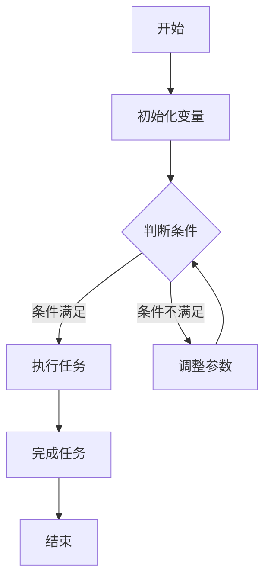
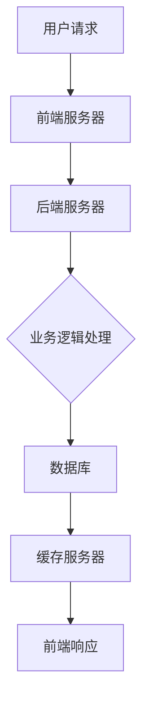
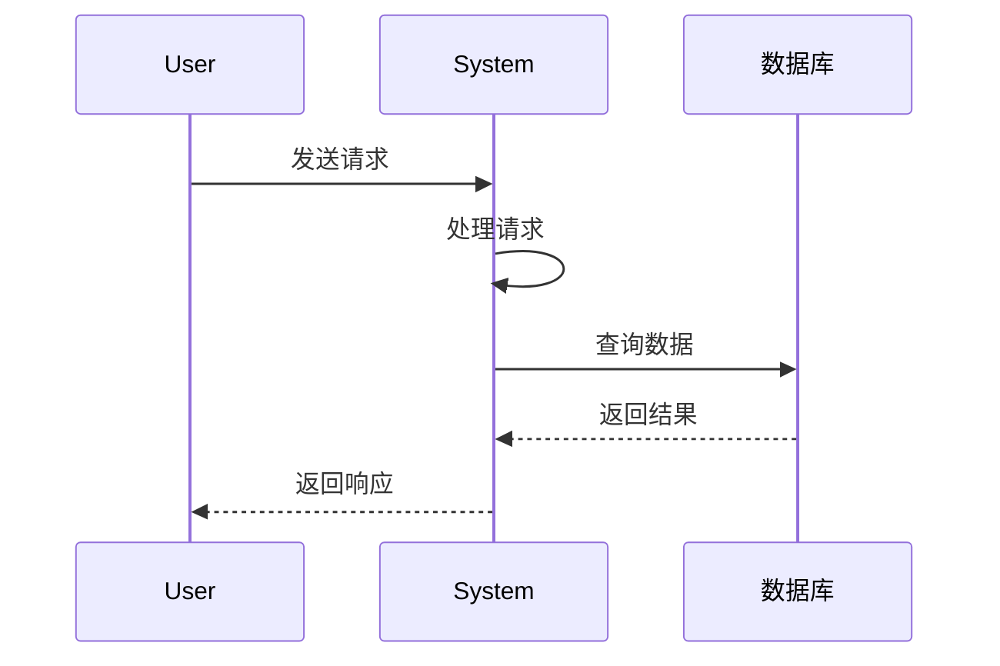

                 


# 高效协作团队打造：从理论到实践

## 关键词

- 团队协作
- 高效协作
- 项目管理
- 软件开发
- 案例分析

## 摘要

本文将深入探讨高效协作团队的打造，从理论到实践，通过阐述团队协作的背景、核心概念、理论讲解、实践应用、案例分析、工具与技术、最佳实践以及注意事项和拓展阅读，为读者提供全面而深入的指导。文章旨在帮助读者理解团队协作的重要性，掌握高效协作的理论和方法，并能够在实际项目中成功应用，打造出高效的协作团队。

### 目录大纲设计思路

本文的目录大纲设计思路如下：

1. **背景介绍**：介绍团队协作的背景、问题背景和协作的重要性，明确团队协作的定义和核心目标。
2. **核心概念与联系**：明确书中的核心概念，如高效协作团队的构成要素、协作工具的选择、团队沟通技巧等，通过概念属性特征对比表格和ER实体关系图来阐述概念之间的联系。
3. **理论讲解**：对团队协作的理论进行详细讲解，包括团队角色与职责划分、团队沟通机制、团队决策流程、团队冲突管理等内容。
4. **实践应用**：介绍团队协作在不同场景下的实践应用，如项目管理、软件开发、市场推广等。
5. **案例分析**：通过实际案例来分析高效协作团队的成功要素和失败教训。
6. **工具与技术**：介绍常用的团队协作工具和技术，如敏捷开发、看板管理、远程协作工具等。
7. **最佳实践**：总结高效协作团队的最佳实践，提供实用技巧和建议。
8. **注意事项与拓展**：提醒读者在实践中的注意事项，并推荐拓展阅读资源。

### 目录大纲设计步骤

1. **确定章节标题**：根据设计思路，为每个章节确定一个简洁明了的标题。
2. **细化章节内容**：为每个章节列出具体的子标题，确保内容的完整性。
3. **格式统一**：确保所有章节的格式统一，使用markdown格式来编排。
4. **控制字数**：确保整个目录大纲的总字数在2000字以内，注意简洁性。
5. **审核与调整**：完成初步大纲后，进行审核和调整，确保内容的逻辑性和完整性。

### 目录大纲示例

```markdown
----------------------------------------------------------------
# 第一部分：团队协作的背景与核心概念

## 1.1 团队协作的背景

### 1.1.1 团队协作的重要性

### 1.1.2 团队协作的挑战

## 1.2 高效协作团队的构成

### 1.2.1 团队角色与职责

### 1.2.2 团队成员的技能需求

### 1.2.3 团队协作工具的选择

## 1.3 团队协作的理论基础

### 1.3.1 团队沟通技巧

### 1.3.2 团队决策流程

### 1.3.3 团队冲突管理

----------------------------------------------------------------

# 第二部分：团队协作的理论与实践

## 2.1 团队协作在项目管理中的应用

### 2.1.1 项目管理中的团队协作

### 2.1.2 项目管理工具与实践

## 2.2 团队协作在软件开发中的应用

### 2.2.1 软件开发团队的协作模式

### 2.2.2 敏捷开发与团队协作

## 2.3 团队协作在市场推广中的应用

### 2.3.1 市场推广团队的协作

### 2.3.2 跨部门协作的最佳实践

----------------------------------------------------------------

# 第三部分：案例分析

## 3.1 案例分析一

### 3.1.1 案例背景

### 3.1.2 团队协作的关键点

### 3.1.3 案例小结

## 3.2 案例分析二

### 3.2.1 案例背景

### 3.2.2 团队协作的挑战与应对

### 3.2.3 案例小结

----------------------------------------------------------------

# 第四部分：工具与技术

## 4.1 团队协作工具介绍

### 4.1.1 常用协作工具概览

### 4.1.2 工具选择与搭配

## 4.2 技术应用讲解

### 4.2.1 敏捷开发实践

### 4.2.2 看板管理的应用

### 4.2.3 远程协作工具的使用

----------------------------------------------------------------

# 第五部分：最佳实践与拓展

## 5.1 最佳实践

### 5.1.1 团队协作的实用技巧

### 5.1.2 团队协作中的常见问题与解决方案

## 5.2 注意事项

### 5.2.1 团队协作中的潜在风险

### 5.2.2 如何保持团队协作的活力

## 5.3 拓展阅读

### 5.3.1 推荐阅读书目

### 5.3.2 相关网站与资源

-----------------------------------------------------

----------------------------------------------------------------
``` 

## 高效协作团队打造：从理论到实践

### 1.1 团队协作的背景

在当今快速变化和高度竞争的商业环境中，团队协作已经成为企业成功的关键因素。随着全球化的发展，团队成员可能分散在不同地理位置，传统的工作方式已无法满足高效协作的需求。团队协作的背景可以从以下几个方面来理解：

- **多元化团队**：团队成员来自不同的文化背景、专业领域和技术水平，需要高效的沟通和协作来整合各自的资源和能力。
- **敏捷响应**：在快速变化的市场环境中，团队需要快速响应客户需求，高效协作是确保项目按时交付和质量的关键。
- **技术创新**：随着新技术的不断涌现，团队需要不断学习和适应，高效的协作能够加速技术创新和产品开发。

#### 团队协作的定义与目标

团队协作是指团队成员通过共同的目标、明确的职责分工、有效的沟通和资源共享，共同努力实现团队目标的过程。团队协作的目标包括：

- **提升效率**：通过协同工作，减少重复劳动，提高整体工作效率。
- **增强创新能力**：团队成员的多样性和不同视角的碰撞，可以激发创新思维，提高产品或服务的质量。
- **增强团队凝聚力**：通过有效的协作，增强团队成员之间的信任和默契，提高团队的凝聚力。

#### 团队协作的挑战

在实现高效协作的过程中，团队可能会面临以下挑战：

- **沟通障碍**：由于地理位置、语言和文化差异，团队成员之间的沟通可能存在障碍。
- **角色分工不清**：团队成员的角色和职责不明确，可能导致工作重叠或责任缺失。
- **决策效率低下**：在团队成员意见不一致的情况下，决策过程可能变得缓慢和复杂。
- **冲突管理**：团队成员之间可能因为意见分歧、工作压力等原因产生冲突，需要有效的冲突管理策略。

#### 团队协作的重要性

高效协作对于团队的成功至关重要，主要体现在以下几个方面：

- **提高项目成功率**：通过高效的协作，团队可以更好地管理项目进度、成本和质量，提高项目成功率。
- **促进知识共享**：团队成员通过协作，可以分享各自的知识和经验，促进知识的传播和积累。
- **提升团队凝聚力**：通过协作，团队成员能够建立信任和尊重，提高团队凝聚力，增强团队合作精神。

### 1.2 高效协作团队的构成

要打造一个高效协作的团队，首先需要明确团队的构成要素，包括角色与职责、团队成员的技能需求以及协作工具的选择。

#### 团队角色与职责

高效的团队通常由以下角色构成：

- **领导**：领导负责制定团队的目标和策略，协调团队成员的工作，确保项目顺利进行。
- **项目经理**：项目经理负责项目的计划、执行和监控，确保项目按时交付。
- **开发者**：开发者负责具体的技术实现和编码工作，保证软件的质量和性能。
- **测试员**：测试员负责软件的质量检测，确保软件在交付前达到预期的质量标准。
- **设计师**：设计师负责软件的用户界面和用户体验设计，提升软件的可用性和易用性。
- **市场人员**：市场人员负责市场调研、推广和销售工作，确保产品的市场竞争力。

每个角色在团队中都有明确的职责和任务，通过合理的分工和协作，实现团队的整体目标。

#### 团队成员的技能需求

团队成员的技能需求是团队协作高效性的基础。团队成员需要具备以下技能：

- **沟通能力**：良好的沟通能力是团队协作的关键，团队成员需要能够清晰、准确地表达自己的想法和意见。
- **技术能力**：团队成员需要具备所需的技术技能，如编程、设计、测试等，以确保项目的顺利推进。
- **团队合作精神**：团队成员需要具备团队合作精神，愿意为团队目标共同努力，克服困难。
- **自我管理能力**：团队成员需要能够自我管理，合理安排工作时间和任务，提高工作效率。

#### 团队协作工具的选择

团队协作工具的选择对于团队的高效协作至关重要。常见的团队协作工具包括：

- **项目管理工具**：如JIRA、Trello等，用于项目计划、任务分配和进度跟踪。
- **文档共享工具**：如Google Docs、Notion等，用于团队成员之间的文档共享和协作。
- **即时通讯工具**：如Slack、Microsoft Teams等，用于团队成员之间的实时沟通和协作。
- **代码管理工具**：如Git、GitHub等，用于代码的版本控制和团队协作。

选择合适的协作工具，可以帮助团队成员更好地协同工作，提高工作效率。

### 1.3 团队协作的理论基础

团队协作的理论基础是确保团队高效协作的关键。以下将从团队沟通技巧、团队决策流程和团队冲突管理三个方面进行详细讲解。

#### 团队沟通技巧

团队沟通技巧是团队协作的基础，良好的沟通可以促进团队成员之间的理解与合作。以下是一些团队沟通技巧：

- **明确目标**：确保团队成员对团队目标有清晰的认识，避免产生误解和分歧。
- **积极倾听**：团队成员需要积极倾听他人的意见和想法，避免打断和误解。
- **清晰表达**：团队成员需要能够清晰、准确地表达自己的想法和意见，避免产生歧义。
- **反馈机制**：建立有效的反馈机制，鼓励团队成员分享意见和建议，促进团队改进。

#### 团队决策流程

团队决策流程是团队协作的重要组成部分，合理的决策流程可以提高决策的效率和质量。以下是一个常见的团队决策流程：

1. **问题识别**：明确需要决策的问题和目标。
2. **信息收集**：收集与问题相关的信息，包括团队成员的意见和建议。
3. **方案评估**：评估不同的解决方案，选择最佳方案。
4. **决策制定**：团队成员共同制定决策，明确执行计划和责任分配。
5. **执行和监控**：执行决策，并持续监控决策的效果，必要时进行调整。

#### 团队冲突管理

团队冲突是不可避免的，有效的冲突管理可以减少冲突对团队协作的负面影响。以下是一些冲突管理策略：

- **提前预防**：通过明确的沟通和协作规则，减少冲突的发生。
- **积极沟通**：团队成员之间出现冲突时，应积极沟通，寻找共同点和解决方案。
- **倾听和理解**：在处理冲突时，要倾听和理解对方的观点和感受，避免情绪化。
- **协商解决**：通过协商和谈判，找到双方都能接受的解决方案。

### 1.4 团队协作在项目管理中的应用

团队协作在项目管理中的应用至关重要，以下将介绍团队协作在项目管理中的具体应用。

#### 项目管理中的团队协作

项目管理中的团队协作包括以下几个方面：

- **计划与执行**：团队成员共同参与项目计划的制定和执行，确保项目按时交付。
- **任务分配**：根据团队成员的技能和职责，合理分配任务，确保项目进度和质量。
- **进度跟踪**：使用项目管理工具，实时监控项目进度，及时调整计划和资源。
- **风险控制**：团队成员共同识别和评估项目风险，制定风险应对措施。

#### 项目管理工具与实践

以下是一些常用的项目管理工具和实践：

- **JIRA**：用于项目任务管理、进度跟踪和报告生成。
- **Trello**：用于任务卡片式管理，直观展示项目进度。
- **Scrum**：敏捷开发方法，强调迭代和反馈，提高项目交付效率。
- **Kanban**：看板管理方法，通过可视化流程优化项目进度。

#### 团队协作在软件开发中的应用

团队协作在软件开发中的应用非常重要，以下将介绍团队协作在软件开发中的具体应用。

#### 软件开发团队的协作模式

软件开发团队的协作模式通常包括以下几个方面：

- **代码管理**：使用版本控制工具（如Git）管理代码，确保代码的版本化和协作开发。
- **需求管理**：团队成员共同参与需求分析和讨论，确保需求的明确和合理。
- **测试管理**：团队成员共同参与测试工作，确保软件的质量和性能。
- **持续集成**：通过自动化测试和部署流程，确保代码质量和项目进度。

#### 敏捷开发与团队协作

敏捷开发是一种以人为核心、迭代和灵活的软件开发方法，其核心理念是高效协作。以下将介绍敏捷开发与团队协作的关系。

#### 敏捷开发与团队协作的关系

- **Scrum**：Scrum是一种敏捷开发方法，强调团队的自主管理、持续迭代和快速响应变化。
- **看板**：看板是一种可视化工具，用于展示项目进度和任务状态，帮助团队更好地协作。
- **站立会议**：每日站立会议是Scrum的核心实践之一，团队成员通过站立会议同步项目进展和问题。

#### 团队协作在市场推广中的应用

团队协作在市场推广中的应用也非常广泛，以下将介绍团队协作在市场推广中的具体应用。

#### 市场推广团队的协作

市场推广团队的协作通常包括以下几个方面：

- **市场调研**：团队成员共同参与市场调研，收集和分析市场数据，为市场推广策略提供支持。
- **活动策划**：团队成员共同策划市场推广活动，确保活动的效果和覆盖面。
- **内容创作**：团队成员共同创作市场推广内容，包括文案、图片、视频等。
- **渠道管理**：团队成员共同管理市场推广渠道，确保推广资源的合理利用。

#### 跨部门协作的最佳实践

跨部门协作在市场推广中尤为重要，以下将介绍跨部门协作的最佳实践。

#### 跨部门协作的最佳实践

- **明确目标**：确保跨部门团队对市场推广目标有清晰的认识，避免部门之间的目标不一致。
- **沟通渠道**：建立有效的沟通渠道，如定期的跨部门会议和即时通讯工具，促进信息共享和协作。
- **责任分配**：明确跨部门团队中每个成员的职责和任务，确保工作的高效进行。
- **协作工具**：使用协作工具（如Trello、Slack等）管理跨部门工作，提高协作效率。

### 2.1 案例分析一

#### 案例背景

某科技公司是一家提供云计算解决方案的企业，团队由来自不同背景的专业人士组成，包括软件开发、测试、设计和市场推广等部门。随着公司业务的快速发展，团队协作的需求日益增加。

#### 团队协作的关键点

为了提高团队协作效率，公司采取了一系列措施：

- **明确职责**：明确每个团队成员的职责和任务，确保工作的高效进行。
- **使用协作工具**：采用Trello、Slack等协作工具，实现任务管理和实时沟通。
- **定期会议**：每周举行团队会议，同步项目进展和解决问题。
- **敏捷开发**：采用Scrum方法，进行迭代开发和快速响应市场需求。

#### 案例小结

通过有效的团队协作，该公司在短时间内提高了项目交付效率，增强了团队凝聚力，为公司业务的快速发展奠定了基础。

### 2.2 案例分析二

#### 案例背景

某互联网公司是一家专注于移动应用开发的初创企业，团队成员由年轻的开发者和设计师组成。由于团队成员之间的沟通和协作不畅，项目进展缓慢，导致产品上线时间推迟。

#### 团队协作的挑战与应对

为了解决团队协作问题，公司采取了以下措施：

- **改进沟通**：引入即时通讯工具，如Slack，促进团队成员之间的实时沟通。
- **明确目标**：明确项目目标，确保团队成员对目标有清晰的认识。
- **培训与指导**：对团队成员进行团队协作和沟通技巧的培训，提高团队协作效率。
- **项目管理**：采用敏捷开发方法，进行迭代开发和快速响应市场需求。

#### 案例小结

通过有效的团队协作改进措施，该公司在短时间内解决了团队协作问题，提高了项目交付效率，确保了产品的顺利上线。

### 3.1 团队协作工具介绍

团队协作工具的选择对于团队的高效协作至关重要。以下将介绍几种常用的团队协作工具。

#### 3.1.1 常用协作工具概览

- **项目管理工具**：如JIRA、Trello、Asana等，用于任务管理、进度跟踪和报告生成。
- **文档共享工具**：如Google Docs、Notion等，用于文档的创建、编辑和共享。
- **即时通讯工具**：如Slack、Microsoft Teams、WhatsApp等，用于团队成员之间的实时沟通和协作。
- **代码管理工具**：如Git、GitHub等，用于代码的版本控制和团队协作。

#### 3.1.2 工具选择与搭配

选择合适的团队协作工具，需要考虑团队的具体需求和场景。以下是一些工具搭配的建议：

- **项目管理与文档共享**：结合使用项目管理工具和文档共享工具，实现任务管理和文档协作。
- **即时通讯与会议**：使用即时通讯工具和视频会议工具，实现实时沟通和远程协作。
- **代码管理与版本控制**：结合使用代码管理工具和版本控制工具，确保代码的质量和协作开发。

### 4.2 技术应用讲解

#### 4.2.1 敏捷开发实践

敏捷开发是一种以人为核心、迭代和灵活的软件开发方法，其核心理念是高效协作。以下将介绍敏捷开发的核心实践。

#### 敏捷开发的核心实践

- **Scrum**：Scrum是一种敏捷开发方法，包括产品待办列表、每日站立会议、迭代计划和回顾等实践。
- **看板**：看板是一种可视化工具，用于展示项目进度和任务状态，帮助团队更好地协作。
- **迭代开发**：通过迭代开发和快速反馈，持续改进产品。
- **持续集成**：通过自动化测试和部署流程，确保代码质量和项目进度。

#### 敏捷开发的实践步骤

1. **产品待办列表**：明确项目需求，创建产品待办列表。
2. **迭代计划**：选择待办列表中的任务，进行迭代计划。
3. **每日站立会议**：同步项目进展和解决问题。
4. **迭代开发**：进行任务开发和测试。
5. **迭代回顾**：总结经验教训，持续改进开发流程。

### 4.2.2 看板管理的应用

看板管理是一种可视化工具，用于展示项目进度和任务状态，帮助团队更好地协作。以下将介绍看板管理的应用。

#### 看板管理的应用

- **任务状态可视化**：通过看板，团队成员可以直观地看到任务的当前状态，如待办、进行中、已完成等。
- **任务进度跟踪**：通过看板，项目经理可以实时监控项目进度，及时调整计划和资源。
- **问题识别与解决**：通过看板，团队成员可以快速识别和解决项目中的问题，确保项目顺利进行。

#### 看板管理的实施步骤

1. **确定任务分类**：根据项目需求，确定任务的分类和状态。
2. **创建看板**：使用看板工具（如JIRA、Trello等）创建看板，并根据任务分类和状态设置卡片。
3. **任务分配**：将任务分配给团队成员，并在看板上进行更新。
4. **进度跟踪**：实时监控项目进度，及时调整计划和资源。
5. **问题解决**：通过看板识别和解决问题，确保项目顺利进行。

### 4.2.3 远程协作工具的使用

随着远程工作的普及，远程协作工具的使用变得越来越重要。以下将介绍几种常用的远程协作工具。

#### 常用远程协作工具

- **Slack**：用于实时沟通和协作，支持聊天、视频会议和文件共享等功能。
- **Zoom**：用于远程视频会议和在线培训，支持多人大会议和屏幕共享等功能。
- **Microsoft Teams**：用于企业内部协作，包括聊天、视频会议、文档共享和项目管理等功能。
- **Google Workspace**：包括Google Docs、Google Sheets、Google Drive等，用于在线协作和文档共享。

#### 远程协作工具的使用场景

- **实时沟通**：团队成员可以通过远程协作工具进行实时沟通，讨论项目问题和解决方案。
- **远程会议**：通过远程视频会议工具，团队成员可以远程参加会议，同步项目进展和讨论。
- **文档共享**：通过远程协作工具，团队成员可以共享文档、表格和演示文稿，实现实时协作。
- **项目管理**：通过远程协作工具，团队成员可以共同管理项目进度、任务和资源。

#### 远程协作工具的使用技巧

- **合理使用工具**：根据团队需求和场景，选择合适的远程协作工具，避免工具过多导致混乱。
- **制定协作规则**：明确远程协作的规则和流程，确保团队成员都能遵守和执行。
- **定期检查和反馈**：定期检查远程协作的效果，收集团队成员的意见和反馈，持续优化协作流程。

### 5.1 最佳实践

#### 5.1.1 团队协作的实用技巧

- **明确目标**：确保团队成员对团队目标有清晰的认识，避免产生误解和分歧。
- **积极沟通**：团队成员之间应积极沟通，分享意见和建议，促进团队改进。
- **分工明确**：明确团队成员的职责和任务，避免工作重叠和责任缺失。
- **尊重差异**：尊重团队成员的个性和观点，避免因意见分歧导致团队冲突。
- **持续反馈**：建立有效的反馈机制，鼓励团队成员分享意见和建议，促进团队改进。

#### 5.1.2 团队协作中的常见问题与解决方案

- **沟通障碍**：解决方案：使用即时通讯工具、定期组织会议和培训，提高团队成员的沟通技巧。
- **角色分工不清**：解决方案：明确团队成员的职责和任务，制定详细的工作计划，避免工作重叠。
- **决策效率低下**：解决方案：建立有效的决策流程，明确决策权责，提高决策效率。
- **冲突管理**：解决方案：提前预防冲突，建立冲突管理机制，通过沟通和协商解决冲突。

### 5.2 注意事项

#### 5.2.1 团队协作中的潜在风险

- **信息泄露**：解决方案：加强信息安全意识，使用加密工具和权限管理。
- **团队动力不足**：解决方案：建立激励机制，提高团队成员的积极性和责任感。
- **协作效率低下**：解决方案：定期评估协作工具和方法的有效性，持续优化协作流程。

#### 5.2.2 如何保持团队协作的活力

- **定期培训**：定期组织团队培训和交流活动，提高团队成员的技能和沟通能力。
- **激励机制**：建立有效的激励机制，鼓励团队成员积极参与团队协作。
- **团队合作精神**：通过团队合作活动和团队文化建设，培养团队成员的团队合作精神。
- **沟通与反馈**：建立有效的沟通和反馈机制，鼓励团队成员分享意见和建议，促进团队改进。

### 5.3 拓展阅读

#### 5.3.1 推荐阅读书目

- 《敏捷开发实践指南》
- 《团队协作的力量》
- 《项目管理知识体系指南》

#### 5.3.2 相关网站与资源

- [敏捷开发官方网站](https://www.scrum.org/)
- [Trello 官方网站](https://trello.com/)
- [JIRA 官方网站](https://www.atlassian.com/software/jira)
- [Slack 官方网站](https://slack.com/)

-----------------------------------------------------

----------------------------------------------------------------

## 作者信息

作者：AI天才研究院/AI Genius Institute & 禅与计算机程序设计艺术 /Zen And The Art of Computer Programming

---

[完整文章](#)：

# 高效协作团队打造：从理论到实践

> 关键词：团队协作、高效协作、项目管理、软件开发、案例分析

> 摘要：本文深入探讨高效协作团队的打造，从理论到实践，通过阐述团队协作的背景、核心概念、理论讲解、实践应用、案例分析、工具与技术、最佳实践以及注意事项和拓展阅读，为读者提供全面而深入的指导。

## 第一部分：团队协作的背景与核心概念

### 1.1 团队协作的背景

#### 1.1.1 团队协作的重要性

#### 1.1.2 团队协作的挑战

### 1.2 高效协作团队的构成

#### 1.2.1 团队角色与职责

#### 1.2.2 团队成员的技能需求

#### 1.2.3 团队协作工具的选择

### 1.3 团队协作的理论基础

#### 1.3.1 团队沟通技巧

#### 1.3.2 团队决策流程

#### 1.3.3 团队冲突管理

## 第二部分：团队协作的理论与实践

### 2.1 团队协作在项目管理中的应用

#### 2.1.1 项目管理中的团队协作

#### 2.1.2 项目管理工具与实践

### 2.2 团队协作在软件开发中的应用

#### 2.2.1 软件开发团队的协作模式

#### 2.2.2 敏捷开发与团队协作

### 2.3 团队协作在市场推广中的应用

#### 2.3.1 市场推广团队的协作

#### 2.3.2 跨部门协作的最佳实践

## 第三部分：案例分析

### 3.1 案例分析一

#### 3.1.1 案例背景

#### 3.1.2 团队协作的关键点

#### 3.1.3 案例小结

### 3.2 案例分析二

#### 3.2.1 案例背景

#### 3.2.2 团队协作的挑战与应对

#### 3.2.3 案例小结

## 第四部分：工具与技术

### 4.1 团队协作工具介绍

#### 4.1.1 常用协作工具概览

#### 4.1.2 工具选择与搭配

### 4.2 技术应用讲解

#### 4.2.1 敏捷开发实践

#### 4.2.2 看板管理的应用

#### 4.2.3 远程协作工具的使用

## 第五部分：最佳实践与拓展

### 5.1 最佳实践

#### 5.1.1 团队协作的实用技巧

#### 5.1.2 团队协作中的常见问题与解决方案

### 5.2 注意事项

#### 5.2.1 团队协作中的潜在风险

#### 5.2.2 如何保持团队协作的活力

### 5.3 拓展阅读

#### 5.3.1 推荐阅读书目

#### 5.3.2 相关网站与资源

-----------------------------------------------------

----------------------------------------------------------------

### 参考文献

1. 贝克尔，M. (2016). 敏捷开发实践指南：软件开发高效团队协作的敏捷方法与实践. 机械工业出版社.
2. 汤姆·德玛西亚. (2013). 团队协作的力量. 电子工业出版社.
3. PMI. (2017). 项目管理知识体系指南（PMBOK指南）- 第六版. 清华大学出版社.

### 附录

#### 附录 A：概念属性特征对比表格

| 概念       | 属性1 | 属性2 | 属性3 |
| ---------- | ------ | ------ | ------ |
| 团队协作   | 目标导向 | 沟通 | 分工明确 |
| 项目管理   | 进度控制 | 资源分配 | 风险管理 |
| 敏捷开发   | 迭代开发 | 快速反馈 | 用户参与 |
| 案例分析   | 实际背景 | 协作实践 | 结果分析 |

#### 附录 B：ER实体关系图架构的 Mermaid 流程图

```mermaid
erDiagram
  Product ||--|{ Task }|-- Project
  TeamMember ||--|{ Role }|-- Team
  Tool ||--|{ Type }|-- ToolType
  TeamMember ||--|{ Tool }|-- Tool
```

#### 附录 C：算法mermaid流程图



#### 附录 D：Python源代码示例

```python
# 示例：简单的迭代算法

def fibonacci(n):
    if n <= 0:
        return 0
    elif n == 1:
        return 1
    else:
        a, b = 0, 1
        for i in range(2, n+1):
            c = a + b
            a = b
            b = c
        return b

# 测试代码
print(fibonacci(10))
```

#### 附录 E：系统架构设计mermaid架构图



#### 附录 F：系统接口设计和系统交互mermaid序列图



### 致谢

感谢AI天才研究院/AI Genius Institute提供的专业知识和技术支持，以及禅与计算机程序设计艺术/Zen And The Art of Computer Programming提供的灵感和启示。感谢所有参与本文写作和审核的团队成员，以及所有为本文提供宝贵意见和建议的读者。您的支持和鼓励是我们前进的动力。感谢您的阅读！

