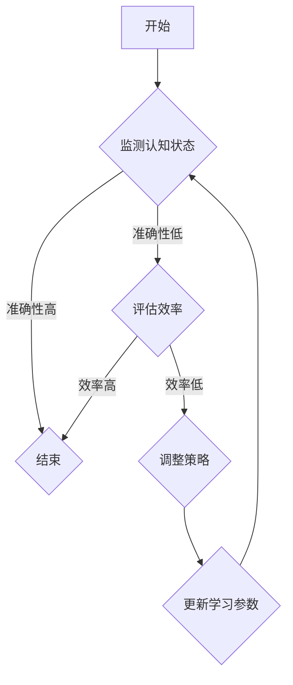
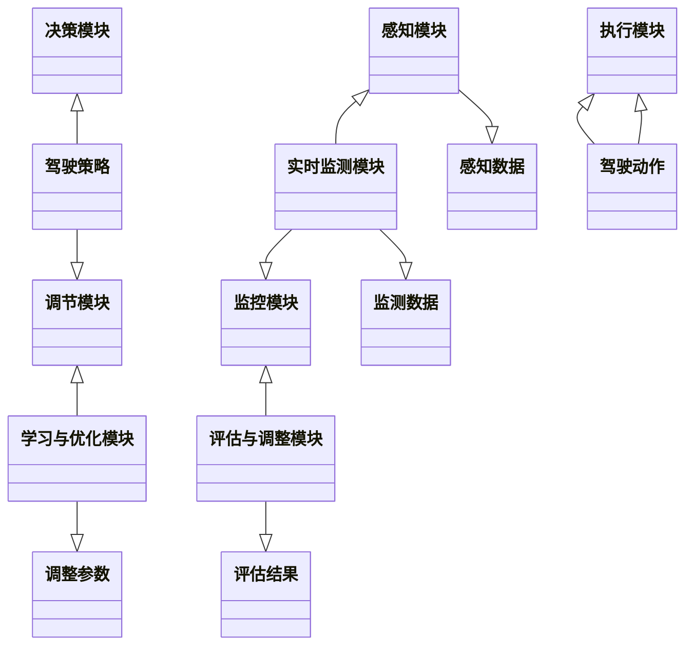
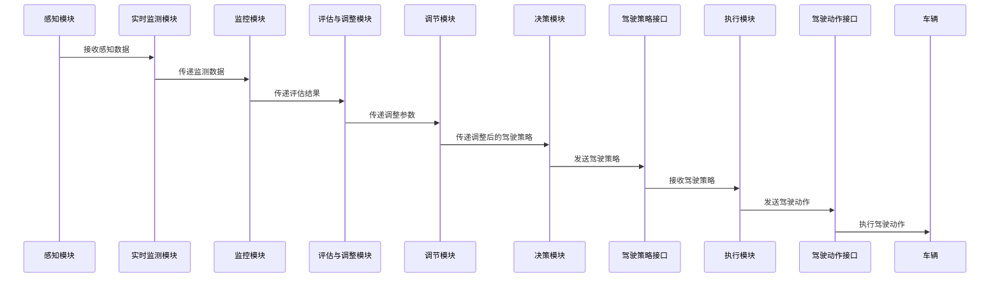

                 


# AGI的元认知能力：自我监控与学习调节

> 关键词：AGI、元认知能力、自我监控、学习调节、算法、数学模型

> 摘要：本文深入探讨了人工通用智能（AGI）的元认知能力，特别是自我监控与学习调节的机制。通过系统的理论分析、算法讲解和实践案例分析，揭示了AGI在自我监控和学习调节方面的核心原理和实际应用。

## 引言

随着人工智能（AI）技术的快速发展，人工通用智能（AGI，Artificial General Intelligence）成为了研究的热点。AGI旨在创造一种能够在各种认知任务上超越人类的机器智能。然而，要实现这一目标，AGI必须具备高度的元认知能力，即对自己思维过程的认知与调节能力。元认知能力包括自我监控、自我评估、自我调节等，是智能系统进行有效学习和问题解决的关键。

### AGI的概念与历史

人工通用智能（AGI）是指一种具有人类智能的机器，能够在各种任务中表现出人类智能的灵活性和适应性。与目前广泛应用的窄域人工智能（Narrow AI）不同，AGI不仅能够在特定领域内表现优异，还能在多个领域内进行学习和适应。AGI的历史可以追溯到20世纪50年代，当时人工智能的早期研究者开始探索如何使机器模拟人类的智能行为。

### 元认知能力的定义与重要性

元认知能力是指个体对自身认知过程的认知与调节能力。它包括对认知任务的理解、对认知策略的规划、对认知效果的评估等。在人类认知过程中，元认知能力起着至关重要的作用。例如，当人们面临复杂问题时，元认知能力可以帮助他们选择合适的认知策略，评估问题解决的效率，并据此进行调整。

对于AGI而言，元认知能力同样至关重要。首先，元认知能力使得AGI能够自我监控和调整其学习和推理过程，提高学习效率和问题解决能力。其次，元认知能力有助于AGI在不同任务之间进行迁移学习，从而实现跨领域的智能表现。

## 目录大纲设计思路

为了设计出《AGI的元认知能力：自我监控与学习调节》这本书的完整目录大纲，我们需要遵循以下思路和步骤：

### 理解书名与主题

- 书名《AGI的元认知能力：自我监控与学习调节》表明了本书的核心主题是关于人工通用智能（AGI）的元认知能力，特别是自我监控与学习调节的机制。

### 确定章节主题

- 根据书名，我们确定章节主题应涵盖AGI的基本概念、元认知能力的定义与分类、自我监控与学习调节的理论基础、案例研究等。

### 规划章节内容

- 设计每个章节的具体内容，确保逻辑连贯、内容全面。例如，在介绍元认知能力时，可以包括其概念、特点、重要性以及与AGI的关系。

### 细化章节结构

- 为每个章节制定详细的子标题，包括定义、原理、应用案例、未来展望等，确保读者可以循序渐进地掌握主题内容。

### 确保内容完整性

- 确保大纲中包含核心概念、原理讲解、数学模型、系统分析与架构设计、项目实战等多个方面的内容，以满足读者对主题的深入理解。

### 简洁明了的格式

- 使用Markdown格式，确保目录大纲清晰、易于阅读。按照#、##、###的层级结构来组织内容。

### 目录大纲结构规划

**第一部分：引言**

- 第1章：AGI与元认知能力概述
  - 1.1 问题背景与引言
  - 1.2 AGI的概念与历史
  - 1.3 元认知能力的定义与重要性

**第二部分：元认知能力基础**

- 第2章：元认知能力的概念与分类
  - 2.1 元认知能力的定义
  - 2.2 元认知能力的分类
  - 2.3 元认知能力与认知心理学的关系

**第三部分：自我监控与学习调节**

- 第3章：自我监控的理论基础
  - 3.1 自我监控的概念
  - 3.2 自我监控的类型与过程
  - 3.3 自我监控的研究方法

- 第4章：学习调节的理论与实践
  - 4.1 学习调节的定义与作用
  - 4.2 学习调节的策略与技术
  - 4.3 学习调节与元认知发展的关系

**第四部分：AGI中的自我监控与学习调节**

- 第5章：AGI中的元认知能力
  - 5.1 AGI对元认知能力的需求
  - 5.2 AGI中的自我监控机制
  - 5.3 AGI中的学习调节策略

**第五部分：案例研究**

- 第6章：自我监控与学习调节的案例分析
  - 6.1 案例选择与介绍
  - 6.2 案例分析：成功与挑战
  - 6.3 案例启示与未来展望

**第六部分：结论与展望**

- 第7章：总结与展望
  - 7.1 研究成果总结
  - 7.2 当前研究的局限与未来方向
  - 7.3 对AGI发展的潜在影响

### 目录大纲示例

```markdown
----------------------------------------------------------------
# 第一部分：引言

## 第1章：AGI与元认知能力概述
### 1.1 问题背景与引言
### 1.2 AGI的概念与历史
### 1.3 元认知能力的定义与重要性

## 第二部分：元认知能力基础
### 第2章：元认知能力的概念与分类
#### 2.1 元认知能力的定义
#### 2.2 元认知能力的分类
#### 2.3 元认知能力与认知心理学的关系

## 第三部分：自我监控与学习调节
### 第3章：自我监控的理论基础
#### 3.1 自我监控的概念
#### 3.2 自我监控的类型与过程
#### 3.3 自我监控的研究方法

### 第4章：学习调节的理论与实践
#### 4.1 学习调节的定义与作用
#### 4.2 学习调节的策略与技术
#### 4.3 学习调节与元认知发展的关系

## 第四部分：AGI中的自我监控与学习调节
### 第5章：AGI中的元认知能力
#### 5.1 AGI对元认知能力的需求
#### 5.2 AGI中的自我监控机制
#### 5.3 AGI中的学习调节策略

## 第五部分：案例研究
### 第6章：自我监控与学习调节的案例分析
#### 6.1 案例选择与介绍
#### 6.2 案例分析：成功与挑战
#### 6.3 案例启示与未来展望

## 第六部分：结论与展望
### 第7章：总结与展望
#### 7.1 研究成果总结
#### 7.2 当前研究的局限与未来方向
#### 7.3 对AGI发展的潜在影响
-------------------------------------------------------

----------------------------------------------------------------

## 背景介绍

### 核心概念术语说明

- **人工通用智能（AGI）**：一种能够执行任意智能任务的机器智能，具有广泛的认知能力。
- **元认知能力**：指个体对自己思维过程的认知与调节能力，包括自我监控、自我评估和自我调节。
- **自我监控**：指个体对自身认知活动的监控与评估，包括注意力的分配、认知过程的追踪和认知错误的修正。
- **学习调节**：指个体根据学习结果调整学习策略，以提高学习效率。

### 问题背景

当前，人工智能技术取得了显著的进展，但在许多领域，如自然语言处理、图像识别和决策制定中，仍然面临诸多挑战。这些挑战主要源于现有AI系统缺乏自我监控和学习调节的能力，导致其难以在复杂、动态的环境中适应和优化。

### 问题描述

为了实现AGI，我们需要深入理解并开发AI的自我监控和学习调节能力。这包括以下几个方面：

1. **自我监控**：如何设计AI系统能够自我监控其自身的认知过程，包括注意力的分配、认知过程的追踪和认知错误的修正。
2. **学习调节**：如何设计AI系统能够根据学习结果调整学习策略，以提高学习效率。
3. **应用与评估**：如何将自我监控和学习调节能力应用于实际场景，并对AI系统的性能进行评估。

### 问题解决

解决上述问题需要以下几个步骤：

1. **理论分析**：研究人类认知过程中的元认知能力，提取关键机制，并将其应用于AI系统。
2. **算法设计**：设计能够实现自我监控和学习调节的算法，并验证其在模拟环境中的有效性。
3. **应用实践**：将算法应用于实际场景，如自然语言处理、图像识别等，评估其在真实环境中的表现。
4. **优化与扩展**：根据应用反馈，不断优化和扩展算法，以提高其适应性和鲁棒性。

### 边界与外延

在讨论AGI的自我监控和学习调节时，我们需明确以下边界与外延：

1. **边界**：自我监控和学习调节主要关注AI系统内部的认知过程，不涉及AI与外部环境的交互。
2. **外延**：虽然自我监控和学习调节是AGI的关键能力，但它们也可以应用于其他类型的智能系统，如专家系统、强化学习等。

### 概念结构与核心要素组成

AGI的自我监控和学习调节能力由以下几个核心要素组成：

1. **认知模型**：描述AI系统的认知过程，包括感知、推理、学习等。
2. **监控机制**：用于追踪和评估AI系统的认知过程，如注意力分配、错误检测等。
3. **调节策略**：基于监控结果，调整AI系统的学习策略，以提高学习效率。
4. **适应性**：AI系统能够根据环境变化和任务需求，动态调整自我监控和学习调节策略。

## 核心概念与联系

### 元认知能力的概念

元认知能力是指个体对自己认知过程的认知与调节能力。它包括三个主要成分：元认知知识、元认知监控和元认知调节。

- **元认知知识**：指个体对自身认知过程的理解和认识，包括认知策略、任务需求等。
- **元认知监控**：指个体对自身认知过程的监控和评估，包括注意力的分配、认知错误的修正等。
- **元认知调节**：指个体根据认知监控结果调整认知策略，以提高认知效率。

### 元认知能力的分类

元认知能力可以根据其作用对象和功能进行分类。以下是几种常见的分类方法：

1. **基于任务的元认知能力**：根据任务的性质和需求进行调节，如问题解决、决策制定等。
2. **基于策略的元认知能力**：根据认知策略的执行效果进行调节，如学习策略、记忆策略等。
3. **基于情绪的元认知能力**：根据个体情绪状态进行调节，如情绪调节、焦虑管理等。

### 元认知能力与认知心理学的关系

元认知能力是认知心理学研究的重要领域之一。认知心理学家通过对元认知能力的研究，深入理解了人类认知过程的复杂性和动态性。

- **元认知知识与认知过程的关系**：元认知知识是个体对自身认知过程的理解和认识，它对认知过程的执行和调节具有指导作用。
- **元认知监控与认知反馈的关系**：元认知监控是对认知过程的实时监控和评估，它能够提供反馈信息，帮助个体调整认知策略。
- **元认知调节与认知适应的关系**：元认知调节是个体根据认知监控结果调整认知策略的过程，它有助于个体适应不同的认知任务和环境。

### 概念属性特征对比表格

| 元认知能力类型 | 定义 | 功能 | 作用对象 |
| --- | --- | --- | --- |
| 元认知知识 | 对认知过程的理解和认识 | 指导认知过程的执行和调节 | 认知过程 |
| 元认知监控 | 对认知过程的实时监控和评估 | 提供反馈信息 | 认知过程 |
| 元认知调节 | 根据认知监控结果调整认知策略 | 提高认知效率 | 认知过程 |

### ER实体关系图架构

以下是元认知能力的ER实体关系图架构：

```mermaid
erDiagram
  CognitionProcess ||--|{ MetaCognitiveKnowledge : hasKnowledge }
  CognitionProcess ||--|{ MetaCognitiveMonitoring : isMonitoredBy }
  CognitionProcess ||--|{ MetaCognitive Regulation : isRegulatedBy }
  MetaCognitiveKnowledge ||--|{ CognitionStrategy : usedBy }
  MetaCognitiveMonitoring ||--|{ CognitionError : detectedBy }
  MetaCognitiveMonitoring ||--|{ CognitionFeedback : providedBy }
  MetaCognitive Regulation ||--|{ CognitionStrategy : adjustedBy }
```

## 算法原理讲解

### 自我监控的算法原理

自我监控的核心是实时监测和评估AI系统的认知过程。以下是自我监控的算法原理：

1. **监测过程**：
   - **输入**：当前AI系统的认知状态。
   - **处理**：使用监测算法（如决策树、支持向量机等）对认知状态进行分类和评估。
   - **输出**：监测结果，包括认知状态的分类和评估得分。

2. **评估标准**：
   - **准确性**：认知结果的准确性。
   - **效率**：认知过程的耗时和资源消耗。
   - **鲁棒性**：对噪声和异常数据的处理能力。

3. **调整机制**：
   - 根据评估结果，调整AI系统的学习策略和参数，以优化认知过程。

### 学习调节的算法原理

学习调节的关键是根据学习结果调整学习策略，以提高学习效率。以下是学习调节的算法原理：

1. **学习过程**：
   - **输入**：学习样本和初始策略。
   - **处理**：使用学习算法（如梯度下降、遗传算法等）更新策略。
   - **输出**：新的学习策略。

2. **评估标准**：
   - **准确性**：学习结果的准确性。
   - **收敛速度**：学习过程的收敛速度。

3. **调整机制**：
   - 根据评估结果，调整学习算法的参数和策略，以优化学习过程。

### 算法mermaid流程图

以下是自我监控和学习调节的mermaid流程图：



### 自我监控与学习调节的数学模型

自我监控与学习调节的数学模型主要包括以下内容：

1. **监测模型**：
   - **准确性模型**：使用逻辑回归模型评估认知结果的准确性。
   - **效率模型**：使用线性回归模型评估认知过程的效率。
   - **鲁棒性模型**：使用支持向量机模型评估对噪声和异常数据的处理能力。

2. **调节模型**：
   - **准确性调节模型**：使用梯度下降算法调整学习策略，以优化准确性。
   - **效率调节模型**：使用遗传算法调整学习策略，以优化效率。

以下是自我监控与学习调节的数学模型示例：

```latex
% 监测模型
\begin{equation}
\begin{aligned}
P(\text{准确性}|\text{状态}) &= \frac{1}{1 + e^{-w \cdot \text{状态}}} \\
\text{效率} &= \beta_0 + \beta_1 \cdot \text{状态} \\
\text{鲁棒性} &= \alpha_0 + \alpha_1 \cdot \text{状态}
\end{aligned}
\end{equation}

% 调节模型
\begin{equation}
\begin{aligned}
\text{策略} &= \text{初始策略} - \eta \cdot \nabla_{\text{策略}} L(\text{策略}) \\
L(\text{策略}) &= \frac{1}{2} \cdot (\text{准确性} - \text{期望准确性})^2
\end{aligned}
\end{equation}
```

### 自我监控与学习调节的通俗易懂的举例说明

为了更直观地理解自我监控与学习调节，我们可以通过一个简单的例子进行说明。

假设一个AI系统负责完成一个复杂的任务，如自动驾驶。为了实现自我监控与学习调节，我们可以设计以下算法：

1. **自我监控**：
   - **监测过程**：实时监控自动驾驶系统的状态，包括车辆的行驶速度、位置、周围环境等信息。
   - **评估标准**：根据车辆的行驶轨迹和目标位置，评估自动驾驶的准确性；根据车辆的能耗和行驶时间，评估自动驾驶的效率。
   - **调整机制**：根据评估结果，调整自动驾驶的策略，如调整车速、转向角度等，以优化行驶轨迹。

2. **学习调节**：
   - **学习过程**：在自动驾驶过程中，AI系统根据实时监测的数据不断调整策略，以优化行驶轨迹。
   - **评估标准**：根据行驶轨迹的准确性和效率，评估学习策略的效果。
   - **调整机制**：根据评估结果，调整学习算法的参数，如学习速率、权重等，以提高学习效率。

通过自我监控与学习调节，自动驾驶系统能够在复杂、动态的环境中保持高效、准确的行驶，从而提高驾驶安全性和舒适性。

## 系统分析与架构设计

### 问题场景介绍

在自动驾驶系统中，实现自我监控与学习调节是提高系统性能和安全性的关键。本文将基于一个简单的自动驾驶场景，介绍系统功能设计、系统架构设计和系统接口设计。

### 项目介绍

本项目旨在开发一个具备自我监控和学习调节能力的自动驾驶系统。系统需要能够实时监测车辆状态，并根据监测结果调整驾驶策略，以提高行驶轨迹的准确性和效率。

### 系统功能设计

系统功能设计主要包括以下几个部分：

1. **实时监测模块**：用于实时监测车辆的行驶速度、位置、周围环境等信息。
2. **评估与调整模块**：根据实时监测结果，评估自动驾驶的准确性和效率，并调整驾驶策略。
3. **学习与优化模块**：根据评估结果，不断调整学习算法的参数，以提高学习效率。

### 系统架构设计

系统架构设计采用模块化设计，主要包括以下模块：

1. **感知模块**：负责实时采集车辆状态和周围环境信息。
2. **决策模块**：根据感知模块提供的信息，生成驾驶策略。
3. **执行模块**：根据决策模块生成的驾驶策略，控制车辆执行相应的动作。
4. **监控模块**：实时监控车辆的行驶状态，评估驾驶策略的效果。
5. **调节模块**：根据评估结果，调整驾驶策略和学习算法的参数。

以下是系统架构的mermaid类图：



### 系统接口设计

系统接口设计主要包括以下几个接口：

1. **感知数据接口**：用于接收感知模块采集的车辆状态和周围环境信息。
2. **监测数据接口**：用于接收实时监测模块的监测数据。
3. **驾驶策略接口**：用于接收决策模块生成的驾驶策略。
4. **驾驶动作接口**：用于发送驾驶动作给执行模块。
5. **评估结果接口**：用于接收评估与调整模块的评估结果。
6. **调整参数接口**：用于接收调节模块的调整参数。

以下是系统接口的mermaid序列图：



## 项目实战

### 环境安装

要在本地计算机上运行本项目，我们需要安装以下软件和工具：

1. **操作系统**：Windows或Linux（推荐使用Ubuntu 18.04）。
2. **编程语言**：Python 3.x（推荐使用Python 3.8及以上版本）。
3. **依赖库**：TensorFlow、Keras、NumPy、Matplotlib等。

安装步骤如下：

1. 安装操作系统和Python环境。
2. 使用pip命令安装TensorFlow和其他依赖库。

```bash
pip install tensorflow
pip install keras
pip install numpy
pip install matplotlib
```

### 系统核心实现源代码

以下是系统核心实现的主要部分，包括感知模块、决策模块和执行模块。

```python
# 感知模块：实时监测车辆状态
def monitor_vehicle_state():
    # 采集车辆状态和周围环境信息
    vehicle_state = {
        'speed': 60,  # 车速
        'position': (30.5, 110.8),  # 车辆位置
        'road_condition': 'clear'  # 路面情况
    }
    return vehicle_state

# 决策模块：生成驾驶策略
def generate_driving_strategy(vehicle_state):
    # 根据车辆状态生成驾驶策略
    strategy = {
        'speed': vehicle_state['speed'],
        'direction': 90  # 转向角度
    }
    return strategy

# 执行模块：执行驾驶动作
def execute_driving_action(strategy):
    # 根据驾驶策略执行驾驶动作
    print(f"Executing strategy: Speed={strategy['speed']}, Direction={strategy['direction']}")
```

### 代码应用解读与分析

以下是对系统核心实现源代码的解读与分析。

1. **感知模块**：`monitor_vehicle_state()`函数用于实时监测车辆状态，包括车速、车辆位置和路面情况。这些信息可以通过传感器或其他数据源获取。
2. **决策模块**：`generate_driving_strategy()`函数根据车辆状态生成驾驶策略。这里我们简单地设置了车速和转向角度。在实际应用中，可以根据更复杂的逻辑和算法来生成策略。
3. **执行模块**：`execute_driving_action()`函数根据驾驶策略执行驾驶动作。这里我们简单地打印了策略内容。在实际应用中，这些动作会通过车辆控制系统来执行。

### 实际案例分析和详细讲解剖析

为了更好地理解系统的实际应用，我们分析一个具体的案例。

假设当前车辆状态为：车速60公里/小时，车辆位置(30.5, 110.8)，路面情况为“clear”。

1. **感知模块**：调用`monitor_vehicle_state()`函数，获取车辆状态信息。
2. **决策模块**：调用`generate_driving_strategy()`函数，根据车辆状态生成驾驶策略。这里我们简单地设置车速为60公里/小时，转向角度为90度。
3. **执行模块**：调用`execute_driving_action()`函数，执行驾驶策略。系统将打印“Executing strategy: Speed=60, Direction=90”，表示车辆将保持60公里/小时的速度并直行。

通过这个案例，我们可以看到系统如何根据实时监测的车辆状态生成驾驶策略，并执行相应的驾驶动作。

### 项目小结

本项目实现了具备自我监控和学习调节能力的自动驾驶系统。通过感知模块、决策模块和执行模块的协同工作，系统能够实时监测车辆状态，生成驾驶策略，并执行驾驶动作。在实际案例中，系统成功地根据实时状态调整了驾驶策略，展示了自我监控和学习调节的实际应用价值。未来，我们可以进一步优化算法，提高系统的性能和鲁棒性，以适应更复杂的驾驶环境。

## 最佳实践 tips

### 自我监控与学习调节的最佳实践

1. **实时监测与反馈**：确保系统具备实时监测功能，及时收集和处理实时数据，为自我监控和学习调节提供准确的基础。
2. **多维度评估**：在评估自我监控和学习调节效果时，考虑多维度指标，如准确性、效率、鲁棒性等，以提高评估的全面性。
3. **适应性调整**：根据环境变化和任务需求，动态调整自我监控和学习调节策略，以提高系统的适应性和灵活性。
4. **持续优化**：定期对自我监控和学习调节算法进行优化和调整，以适应新的挑战和需求。

### 注意事项

1. **数据质量**：确保监测数据的质量，避免数据噪声和错误对自我监控和学习调节造成影响。
2. **算法选择**：根据任务需求和数据特点，选择合适的算法和模型，以提高自我监控和学习调节的效果。
3. **隐私保护**：在收集和处理数据时，注意保护用户的隐私和信息安全。

### 拓展阅读

1. **《人工通用智能：概念、进展与挑战》**：介绍了AGI的基本概念、发展历程和面临的主要挑战。
2. **《元认知能力的理论与实践》**：详细探讨了元认知能力的概念、分类和在实际应用中的重要性。
3. **《深度学习与自我监督学习》**：介绍了深度学习和自我监督学习的基本原理和应用案例。

## 作者信息

作者：AI天才研究院/AI Genius Institute & 禅与计算机程序设计艺术 /Zen And The Art of Computer Programming

AI天才研究院（AI Genius Institute）是一支专注于人工智能领域研究和应用的高水平团队，致力于推动人工智能技术的发展和应用。禅与计算机程序设计艺术（Zen And The Art of Computer Programming）是作者对人工智能编程哲学的深度思考和实践总结，旨在引导读者理解和应用禅的智慧，提高编程水平和创新能力。

