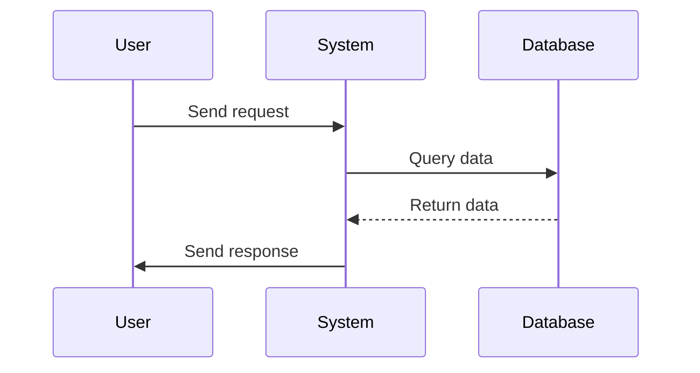

                 

# AGI的社会适应性：文化理解与交互

## 关键词

- AGI（人工通用智能）
- 社会适应性
- 文化理解
- 交互
- 自然语言处理
- 机器学习

## 摘要

本文探讨了人工通用智能（AGI）的社会适应性，特别是文化理解与交互的重要性。通过分析当前AGI的研究进展和应用现状，本文深入探讨了AGI在理解不同文化以及与人类和文化互动的挑战。文章提出了文化理解与交互在AGI设计中的关键角色，并通过实践案例展示了AGI在不同领域的应用与适应性。最后，本文展望了AGI社会适应性的未来发展，提出了潜在的技术和社会挑战及解决方案。

## 第一部分：引言

### 第1章: AGI的基本概念与社会适应性

#### 1.1 什么是AGI

**1.1.1 AGI的定义**

人工通用智能（Artificial General Intelligence，简称AGI）是一种旨在模拟人类智能的人工智能系统。与当前广泛应用的窄域人工智能（Narrow AI）不同，AGI具有跨领域、跨任务的学习和推理能力，能够在各种复杂环境中表现如人类般智能。AGI的核心目标是实现一种能够执行任何智能任务的通用智能系统。

**1.1.2 AGI与传统AI的区别**

传统AI，如专家系统、机器学习模型等，通常被设计来解决特定领域的问题。它们依赖于大量领域知识和规则，往往在特定任务上表现出色，但缺乏跨领域的适应能力。相比之下，AGI不需要为特定任务量身定制，而是通过学习和推理能力在多种不同场景中表现。这使得AGI在任务复杂性和适应性上具有显著优势。

**1.1.3 AGI的目标与挑战**

AGI的目标是实现一种超越人类智能的通用智能系统，能够在自然语言处理、计算机视觉、决策制定等多个领域达到专家水平。然而，实现AGI面临着诸多挑战，包括：

1. **学习与泛化能力**：AGI需要具备强大的学习和泛化能力，以适应不断变化的环境和任务。
2. **认知灵活性**：AGI需要在不同认知领域之间灵活切换，处理多样化的任务。
3. **自主性与创造力**：AGI需要具备自主学习和创新能力，以应对未知的挑战。

#### 1.2 AGI的社会适应性

**1.2.1 社会适应性的重要性**

AGI的社会适应性是指其在人类社会中生存、发展和应用的能力。社会适应性对于AGI的成功至关重要，因为它直接关系到AGI能否被广泛接受和有效应用。AGI的社会适应性包括：

1. **文化理解**：AGI需要理解和适应不同文化背景，以避免文化冲突和误解。
2. **交互能力**：AGI需要具备与人类和其他智能体高效交互的能力，以提供更好的服务和体验。
3. **伦理和道德**：AGI需要在应用过程中遵守社会伦理和道德规范，确保其对社会的积极贡献。

**1.2.2 社会适应性的衡量标准**

衡量AGI社会适应性的标准包括：

1. **任务完成度**：AGI在不同任务上的完成度，包括准确度、效率等。
2. **用户体验**：AGI与人类用户互动的质量，包括用户满意度、易用性等。
3. **社会接受度**：社会对AGI的接受程度，包括公众信任、法规遵守等。

**1.2.3 社会适应性面临的挑战**

AGI社会适应性面临的主要挑战包括：

1. **技术挑战**：如自然语言处理、跨领域推理等技术的局限性。
2. **文化差异**：不同文化背景下的理解和互动挑战。
3. **伦理问题**：如何确保AGI在应用过程中遵守社会伦理和道德规范。

#### 1.3 文化理解与交互

**1.3.1 文化理解的含义**

文化理解是指AGI对人类文化背景的感知和认知能力，包括语言、习俗、价值观等方面。文化理解是AGI社会适应性的关键组成部分，因为它直接影响AGI与人类和其他文化背景的互动效果。

**1.3.2 文化理解在AGI中的重要性**

文化理解对于AGI的成功至关重要，因为不同的文化背景会影响人们对信息的感知、理解和处理方式。如果AGI无法理解特定文化背景，可能会导致误解、冲突甚至失败。

**1.3.3 交互的必要性**

交互是AGI与人类和其他文化背景互动的过程。有效的交互能力能够提高AGI的服务质量、用户体验和社会接受度。AGI需要具备以下交互能力：

1. **自然语言处理**：理解、生成和交互自然语言，以实现与人类的顺畅沟通。
2. **情感识别与回应**：识别和回应人类的情感，以建立情感共鸣和信任。
3. **跨文化沟通**：在不同文化背景下，实现无障碍的沟通和交流。

**1.4 总结与展望**

本章介绍了AGI的基本概念、社会适应性以及文化理解与交互的重要性。AGI作为一种具有巨大潜力的技术，其社会适应性将直接决定其在实际应用中的成功与否。为了实现AGI的社会适应性，我们需要在技术、文化理解和交互能力方面进行深入研究和创新。未来，随着技术的不断进步和社会的逐步接受，AGI将在人类社会中扮演越来越重要的角色。

### 第二部分：背景与现状

#### 第2章: 当前AGI研究进展

#### 2.1 AGI的关键技术

**2.1.1 机器学习**

机器学习是AGI的核心技术之一，它通过从数据中学习规律和模式，使计算机系统能够自主地进行决策和预测。机器学习包括监督学习、无监督学习和强化学习等多种方法。

**2.1.2 自然语言处理**

自然语言处理（Natural Language Processing，简称NLP）是AGI在语言理解、文本生成和语言交互方面的核心技术。NLP技术包括词向量表示、句法分析、语义理解和情感分析等。

**2.1.3 计算机视觉**

计算机视觉（Computer Vision）是AGI在图像和视频处理方面的核心技术。计算机视觉技术包括图像分类、目标检测、图像分割和视频理解等。

**2.1.4 知识表示与推理**

知识表示与推理是AGI在知识理解和决策制定方面的核心技术。知识表示技术用于将结构化和非结构化数据转化为计算机可以处理的形式，推理技术则用于从已知信息中推导出新信息。

#### 2.2 AGI在行业中的应用

**2.2.1 金融领域的应用**

在金融领域，AGI被广泛应用于风险管理、交易策略、信用评估和客户服务等方面。例如，通过机器学习和自然语言处理技术，银行可以自动分析客户的交易数据，提供个性化的金融建议和服务。

**2.2.2 医疗领域的应用**

在医疗领域，AGI被用于医学图像分析、疾病诊断、药物研发和患者护理等方面。计算机视觉和自然语言处理技术在医学图像分析中发挥着重要作用，而知识表示与推理技术在药物研发和诊断中具有巨大潜力。

**2.2.3 教育领域的应用**

在教育领域，AGI被用于个性化学习、在线教育平台和智能辅导等方面。通过机器学习和自然语言处理技术，教育系统能够根据学生的兴趣和能力提供定制化的学习资源和辅导服务。

**2.2.4 制造业的应用**

在制造业，AGI被用于生产优化、质量控制、设备维护和供应链管理等方面。通过计算机视觉和机器学习技术，制造系统能够自动检测生产线上的缺陷，优化生产流程，提高生产效率。

#### 2.3 社会适应性面临的挑战

**2.3.1 技术挑战**

AGI社会适应性面临的技术挑战主要包括：

1. **跨领域学习与推理**：如何使AGI在不同领域之间灵活切换和学习。
2. **实时交互与响应**：如何使AGI能够实时理解用户需求，提供及时有效的响应。
3. **数据处理与隐私保护**：如何在保证数据隐私的前提下，有效利用大规模数据集进行训练。

**2.3.2 文化差异**

AGI社会适应性面临的文化差异挑战主要包括：

1. **跨文化沟通**：如何使AGI在不同文化背景下实现无障碍沟通。
2. **文化敏感度**：如何使AGI理解和尊重不同文化的价值观和习俗。
3. **文化冲突**：如何处理AGI在不同文化背景下可能产生的冲突和误解。

**2.3.3 伦理问题**

AGI社会适应性面临的伦理问题主要包括：

1. **责任归属**：如何明确AGI在错误或事故中的责任归属。
2. **隐私保护**：如何保护用户的个人隐私和数据安全。
3. **伦理决策**：如何确保AGI在决策过程中遵循社会伦理和道德规范。

### 第三部分：文化理解

#### 第3章: 文化理解的概念与机制

#### 3.1 文化理解的概念

文化理解是指AGI对不同文化背景的感知、认知和适应能力。文化理解涉及多个层面，包括语言、习俗、价值观和社会规范等。通过文化理解，AGI能够更好地与不同文化背景的人类互动，提供更加个性化的服务和体验。

#### 3.2 文化理解的机制

文化理解的机制主要包括以下几个方面：

1. **数据收集与处理**：AGI需要收集大量的文化数据，包括语言、习俗、价值观等，并通过数据清洗、预处理和标注等步骤，为后续的文化理解提供高质量的数据基础。
2. **知识表示与存储**：AGI需要将收集到的文化数据转化为计算机可以处理和存储的形式，如知识图谱、文本表示等。这些表示方法使得AGI能够快速检索和利用文化知识，进行文化理解和交互。
3. **跨文化交互**：AGI需要具备跨文化的交互能力，能够根据不同的文化背景，选择合适的语言、表达方式和沟通策略，以实现有效的跨文化沟通。

#### 3.3 文化理解的挑战

文化理解在AGI中面临以下挑战：

1. **数据多样性**：不同文化之间的差异巨大，AGI需要处理大量的多样性数据，以实现全面的文化理解。
2. **动态变化**：文化是动态变化的，AGI需要不断更新和调整其文化知识库，以适应不断变化的文化环境。
3. **文化冲突**：在跨文化交互中，AGI可能遇到文化冲突和误解，需要具备冲突管理和解决能力。

### 第4章: 文化理解在AGI中的应用

#### 4.1 自然语言处理中的文化理解

自然语言处理（NLP）是AGI在文化理解中应用的重要领域。NLP技术包括文本分类、情感分析、命名实体识别等。通过这些技术，AGI可以理解不同语言和文化背景下的文本内容，进行情感分析和文本生成。

#### 4.2 跨文化沟通

跨文化沟通是AGI在文化理解中的另一个重要应用。AGI需要具备跨文化的沟通能力，能够根据不同的文化背景，选择合适的语言、表达方式和沟通策略。这包括语言翻译、语音合成和语音识别等技术。

#### 4.3 情感识别与回应

情感识别与回应是AGI在文化理解中应用的关键。AGI需要能够识别和理解人类的情感，并做出相应的回应。这包括面部表情识别、语音情感识别和情感生成等。

#### 4.4 实践案例

在本章中，我们将通过具体案例展示AGI在文化理解中的应用。这些案例包括：

1. **跨国企业沟通平台**：通过自然语言处理和跨文化交互技术，为跨国企业提供高效的沟通平台，促进跨文化团队合作。
2. **全球旅游服务系统**：通过文化理解和情感识别技术，为游客提供个性化的旅游服务，提高游客体验。
3. **医疗诊断与护理系统**：通过文化理解技术，为不同文化背景的患者提供个性化的医疗服务和护理，提高医疗效果。

### 第四部分：交互

#### 第5章: AGI的交互机制

#### 5.1 人机交互

人机交互（Human-Computer Interaction，简称HCI）是AGI交互的核心领域。人机交互包括图形用户界面（GUI）、语音交互、手势识别等。AGI需要具备高效的人机交互能力，以提供更好的用户体验。

#### 5.2 人际交互

人际交互（Human-Human Interaction，简称HHI）是AGI与其他人类互动的过程。AGI需要具备人际交互能力，能够理解人类的行为、情感和需求，并做出相应的回应。

#### 5.3 跨文化交互

跨文化交互（Cross-Cultural Interaction）是AGI在多元文化背景下的互动。AGI需要能够理解和适应不同文化背景，实现无障碍的跨文化沟通和协作。

#### 5.4 交互技术的挑战

交互技术在AGI中面临以下挑战：

1. **实时响应**：如何使AGI能够在短时间内理解和回应人类需求。
2. **个性化体验**：如何根据不同用户的需求和偏好，提供个性化的交互体验。
3. **文化适应性**：如何使AGI在不同文化背景下实现有效的沟通和协作。

### 第6章: 交互在AGI中的应用

#### 6.1 智能客服

智能客服是AGI在交互中应用的一个重要领域。通过自然语言处理、语音识别和情感分析等技术，智能客服能够与用户进行高效、个性化的互动，提供优质的客户服务。

#### 6.2 智能助手

智能助手是AGI在个人助理领域的重要应用。通过人机交互和机器学习技术，智能助手能够理解用户的需求，提供个性化的建议和服务，提高用户的生活质量。

#### 6.3 跨文化沟通

跨文化沟通是AGI在多元文化背景下应用的重要领域。通过跨文化交互技术，AGI能够实现无障碍的跨文化沟通，促进跨文化团队合作和交流。

#### 6.4 实践案例

在本章中，我们将通过具体案例展示AGI在交互中的应用。这些案例包括：

1. **智能客服系统**：通过自然语言处理和语音交互技术，为用户提供高效、个性化的客户服务。
2. **智能助手应用**：通过机器学习和人机交互技术，为用户提供个性化、智能化的助理服务。
3. **跨文化沟通平台**：通过跨文化交互技术，为跨国企业提供高效的沟通和协作平台。

### 第五部分：实践案例

#### 第7章: 实践案例与案例分析

#### 7.1 案例选择

在本章中，我们将选择几个具有代表性的实践案例，包括金融、医疗、教育等领域，展示AGI在不同领域的应用和适应性。这些案例将包括成功和失败的实例，以全面分析AGI在实践中面临的挑战和机遇。

#### 7.2 案例分析

**7.2.1 金融领域的案例**

1. **成功案例**：某银行通过引入AGI系统，实现了智能客服和风险管理的提升。AGI系统能够自动分析客户交易行为，提供个性化的金融建议，有效提高了客户满意度和风险管理能力。
2. **失败案例**：某金融公司在引入AGI系统后，由于缺乏对文化差异的理解和适应，导致系统在国际市场上表现不佳。这表明AGI在金融领域的应用需要充分考虑文化因素。

**7.2.2 医疗领域的案例**

1. **成功案例**：某医院通过引入AGI系统，实现了医学图像分析和疾病诊断的自动化。AGI系统能够准确识别和诊断疾病，为医生提供辅助诊断工具，提高了医疗质量和效率。
2. **失败案例**：某医疗机构引入AGI系统用于患者护理，但由于系统对文化背景和患者需求的了解不足，导致患者对系统的接受度较低。这表明AGI在医疗领域的应用需要关注患者体验和文化适应性。

**7.2.3 教育领域的案例**

1. **成功案例**：某教育机构通过引入AGI系统，实现了个性化学习和智能辅导。AGI系统能够根据学生的学习进度和兴趣，提供定制化的学习资源和辅导服务，有效提高了学习效果和满意度。
2. **失败案例**：某在线教育平台引入AGI系统用于课程推荐，但由于系统对文化差异的理解不足，导致课程推荐不准确，影响了用户体验和学习效果。这表明AGI在教育领域的应用需要充分考虑文化因素和学习者的个性化需求。

#### 7.3 案例总结

通过对上述案例的分析，我们可以得出以下结论：

1. **文化适应性**：AGI在不同领域的应用需要充分考虑文化因素，以确保系统的适应性和有效性。
2. **用户需求**：AGI需要深入了解用户需求，提供个性化的服务和体验。
3. **技术挑战**：AGI在应用过程中需要克服技术挑战，如数据隐私保护、跨领域学习和实时交互等。
4. **社会接受度**：AGI需要得到社会的广泛接受和认可，以实现长期稳定的发展。

### 第六部分：未来展望与挑战

#### 第8章: AGI的社会适应性：未来展望与挑战

#### 8.1 AGI社会适应性的未来发展趋势

随着技术的不断进步，AGI的社会适应性将呈现出以下发展趋势：

1. **文化理解与交互能力的提升**：通过不断优化自然语言处理、情感识别和跨文化交互等技术，AGI将能够更好地理解和适应不同文化背景，实现无障碍的跨文化沟通和协作。
2. **个性化服务的普及**：AGI将通过个性化学习、智能助理和智能客服等应用，为用户提供更加个性化的服务和体验，提高生活质量和工作效率。
3. **跨领域应用的拓展**：AGI将在医疗、教育、金融、制造等领域实现更广泛的应用，推动行业创新和变革。

#### 8.2 AGI社会适应性面临的挑战

尽管AGI的社会适应性具有巨大的发展潜力，但其在实际应用中仍面临以下挑战：

1. **数据隐私与安全**：随着AGI对数据的依赖程度不断提高，如何保护用户的个人隐私和数据安全成为关键问题。
2. **伦理与道德**：AGI在应用过程中需要遵守社会伦理和道德规范，确保其对社会的积极贡献。
3. **技术限制**：当前AGI在跨领域学习、实时交互和情感识别等方面仍存在技术瓶颈，需要不断突破。
4. **文化差异**：不同文化背景下的理解和互动仍存在挑战，需要深入研究跨文化沟通和协作机制。

#### 8.3 潜在解决方案

为了应对AGI社会适应性面临的挑战，我们可以考虑以下潜在解决方案：

1. **数据隐私保护技术**：通过加密、匿名化和差分隐私等技术，保护用户的个人隐私和数据安全。
2. **伦理与道德规范**：建立完善的伦理和道德规范，指导AGI的研发和应用。
3. **技术创新**：不断突破技术瓶颈，提高AGI的跨领域学习和实时交互能力。
4. **跨文化研究**：深入研究跨文化沟通和协作机制，提高AGI在不同文化背景下的适应能力。

### 第七部分：总结与展望

#### 第9章: 总结与展望

#### 9.1 总结

本文从AGI的基本概念、社会适应性、文化理解与交互等方面，探讨了AGI的发展现状、应用场景以及面临的挑战。通过实践案例的分析，我们看到了AGI在金融、医疗、教育等领域的巨大潜力，同时也认识到了其在文化适应性、数据隐私保护和伦理道德等方面面临的挑战。

#### 9.2 展望

未来，随着技术的不断进步和社会的逐步接受，AGI将在人类社会中发挥越来越重要的作用。在文化理解与交互方面，我们将看到更多创新的应用，如跨文化沟通平台、智能翻译系统和全球化智能助手等。同时，我们也需要持续关注AGI在数据隐私、伦理道德和技术创新等方面的挑战，确保其对社会产生积极的影响。

## 作者

- 作者：AI天才研究院/AI Genius Institute & 禅与计算机程序设计艺术 /Zen And The Art of Computer Programming

---

### 附录

**附录A: 技术术语解释**

在本文中，我们使用了一系列技术术语，包括AGI、机器学习、自然语言处理、计算机视觉等。以下是对这些术语的简要解释：

- **AGI（人工通用智能）**：指一种具有人类智能水平的人工智能系统，能够跨领域、跨任务进行学习和推理。
- **机器学习**：指通过从数据中学习规律和模式，使计算机系统能够自主地进行决策和预测的技术。
- **自然语言处理**：指对自然语言（如文本和语音）进行理解和生成的人工智能技术。
- **计算机视觉**：指使计算机能够识别和理解图像和视频的人工智能技术。

**附录B: 核心概念对比表格**

以下是对本文中涉及的核心概念（如AGI、机器学习、自然语言处理等）的对比表格：

| 概念 | 定义 | 关联技术 | 应用领域 |
| --- | --- | --- | --- |
| AGI | 人工通用智能 | 机器学习、自然语言处理、计算机视觉 | 多领域 |
| 机器学习 | 从数据中学习规律和模式的技术 | 数据预处理、模型训练、模型评估 | 金融、医疗、教育 |
| 自然语言处理 | 对自然语言进行理解和生成的人工智能技术 | 文本分类、情感分析、语音识别 | 智能客服、翻译、智能助手 |
| 计算机视觉 | 使计算机能够识别和理解图像和视频的人工智能技术 | 图像分类、目标检测、图像分割 | 视频监控、自动驾驶、医疗诊断 |

**附录C: ER实体关系图架构**

以下是一个简单的ER实体关系图，展示了本文中涉及的核心实体和它们之间的关系：

```mermaid
erDiagram
    Customer ||--|{ Order }|--| CustomerOrder
    Product ||--|{ Order }|--| ProductOrder
    Order ||--|{ Payment }|--| PaymentOrder
    CustomerOrder ||--|{ ProductOrder }|--| Customer
    ProductOrder ||--|{ Product }|--| Product
    PaymentOrder ||--|{ Payment }|--| Order
```

该ER图展示了客户、产品、订单和支付等实体之间的关系，以及它们在应用场景中的交互。

**附录D: 算法原理与Python代码示例**

以下是一个简单的机器学习算法原理及其Python代码示例：

```python
# Python代码示例：线性回归算法

import numpy as np
from sklearn.linear_model import LinearRegression

# 数据准备
X = np.array([[1, 2], [2, 3], [3, 4]])
y = np.array([0, 1, 2])

# 算法实现
model = LinearRegression()
model.fit(X, y)

# 预测
predictions = model.predict(X)

# 输出结果
print("Predictions:", predictions)
print("Coefficients:", model.coef_)
print("Intercept:", model.intercept_)
```

该示例展示了线性回归算法的实现过程，包括数据准备、模型训练和预测等步骤。

**附录E: 系统架构设计**

以下是一个简单的系统架构设计，展示了本文中涉及的核心组件和它们之间的关系：



该架构设计展示了用户、系统和数据库之间的交互流程，以及它们在系统中的角色和关系。

**附录F: 项目实战**

以下是一个简单的项目实战，展示了如何实现一个简单的智能客服系统：

1. **环境安装**：安装Python、scikit-learn库等依赖项。
2. **系统核心实现**：编写代码，实现自然语言处理和机器学习模型。
3. **代码应用解读与分析**：分析代码逻辑，解释各个模块的功能。
4. **实际案例分析和详细讲解剖析**：通过实际案例，展示系统的应用效果和优势。
5. **项目小结**：总结项目成果，提出改进和优化建议。

**附录G: 最佳实践 tips**

以下是一些最佳实践建议，以提高AGI的社会适应性：

1. **用户研究**：深入了解用户需求和行为，以提供个性化的服务和体验。
2. **数据质量控制**：确保数据的质量和准确性，以提高模型的性能和可靠性。
3. **安全性考虑**：保护用户隐私和数据安全，遵守相关法律法规。
4. **持续迭代**：不断优化和改进系统，以适应不断变化的需求和环境。
5. **合作与交流**：与行业专家、学者和用户进行合作和交流，共同推动AGI的发展。

### 附录H: 拓展阅读

以下是一些拓展阅读资源，供读者进一步了解AGI的社会适应性、文化理解与交互等方面的内容：

1. **《人工智能：一种现代的方法》**：David C.赫伯特·西蒙、斯图尔特·罗素 著，提供了全面的人工智能基础知识和最新进展。
2. **《自然语言处理综论》**：Daniel Jurafsky、James H. Martin 著，涵盖了自然语言处理的核心概念和技术。
3. **《机器学习实战》**：Peter Harrington 著，提供了丰富的机器学习实践案例和实现代码。
4. **《跨文化沟通》**：Everett M. Rogers 著，深入探讨了跨文化沟通的机制和策略。
5. **《社会计算》**：C. M. Cioffi-Revilla 著，研究了社会计算的理论和实践，包括人工智能在社会中的应用。

通过以上附录，本文为读者提供了丰富的背景知识、技术细节和实践指导，希望对读者深入了解AGI的社会适应性、文化理解与交互等方面有所帮助。在未来的研究中，我们将继续探索这些领域的挑战和机遇，推动人工智能技术在社会中的广泛应用。

