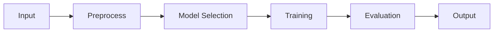
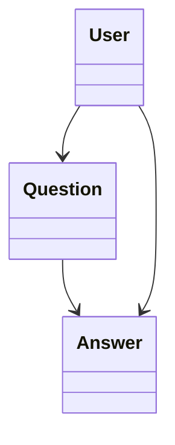
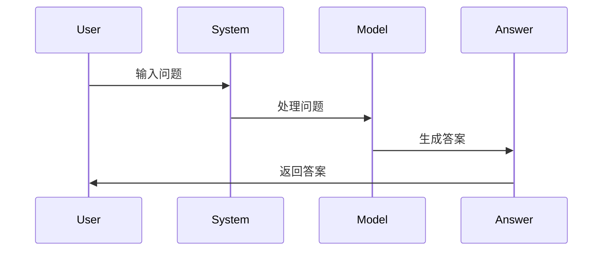
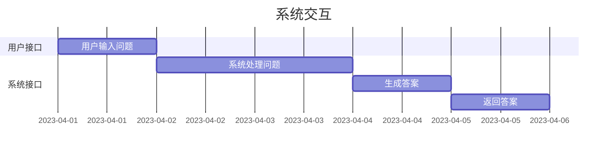

                 


###  AI大模型编程：提示词的力量与未来

#### 关键词：AI大模型、提示词工程、编程、未来展望、算法原理

#### 摘要：
本文将深入探讨AI大模型编程的核心要素——提示词的力量与未来。通过系统的分析，我们将了解提示词在AI大模型编程中的重要作用，如何利用提示词优化模型表现，以及展望未来提示词工程的发展趋势。

### 第一部分：AI大模型编程基础

#### 第1章：AI大模型编程概述

##### 1.1 问题的背景与解决

**问题背景**：随着人工智能技术的飞速发展，AI大模型在自然语言处理、计算机视觉、推荐系统等领域展现出强大的应用潜力。然而，如何有效地编程和优化这些大模型，使其更好地服务于实际需求，成为了一个关键问题。

**问题描述**：AI大模型的编程涉及多个环节，包括数据预处理、模型选择、模型训练和评估等。如何在这些环节中有效地使用提示词，以提高模型的性能和可解释性，是当前研究的热点。

**问题解决**：本文旨在通过深入分析提示词工程，提供一套系统的编程方法和最佳实践，以帮助开发者更好地利用AI大模型。

**边界与外延**：本文主要关注AI大模型编程中的提示词工程，但也会涉及到相关的基础概念和技术。

**核心要素组成**：提示词、数据集、模型架构和算法原理是AI大模型编程的核心要素。

##### 1.2 AI大模型的基本概念

**AI大模型的定义**：AI大模型是指具有数十亿至千亿参数的深度学习模型，如GPT-3、BERT等。

**AI大模型的特点**：参数量庞大、计算复杂度高、适用于多种任务。

**AI大模型与传统AI的区别**：传统AI模型通常参数量较小，适用于特定任务，而大模型具有更强的通用性和适应性。

##### 1.3 AI大模型编程的核心概念

**提示词工程**：提示词是指导模型生成内容的文本，其设计对模型性能和可解释性至关重要。

**数据预处理**：数据预处理是确保模型训练质量的基础步骤，包括数据清洗、格式化、归一化等。

**模型选择**：根据任务需求选择合适的模型架构，如Transformer、GAN等。

**模型训练**：利用大规模数据进行模型训练，优化模型参数。

**模型评估**：通过测试数据评估模型性能，包括准确率、召回率等指标。

##### 1.4 本章小结

**主要知识点回顾**：本章介绍了AI大模型编程的基本概念和核心步骤，为后续内容奠定了基础。

**未来展望**：随着AI技术的不断进步，提示词工程将在AI大模型编程中发挥更加重要的作用。

### 第二部分：AI大模型的核心概念与联系

#### 第2章：AI大模型的核心概念与联系

##### 2.1 核心概念原理

**提示词**：提示词是指导模型生成内容的文本，其设计直接影响模型的输出质量。

**数据集**：数据集是模型训练的基础，其质量直接影响模型性能。

**模型架构**：模型架构决定了模型的计算能力和适应能力。

##### 2.2 概念属性特征对比表格

| 概念       | 描述                   | 关键特征                 |
|------------|------------------------|--------------------------|
| 提示词     | 指导模型生成内容的文本 | 精确性、多样性、上下文敏感性 |
| 数据集     | 模型训练的数据集       | 标准化、丰富性、代表性     |
| 模型架构   | 模型的结构设计         | 可扩展性、灵活性、效率     |

##### 2.3 ER实体关系图架构

```mermaid
erDiagram
    Data_set ||--|{ Model} : trains
    Prompt ||--|{ Model} : uses
```

### 第三部分：算法原理讲解

#### 第3章：算法原理讲解

##### 3.1 算法mermaid流程图



##### 3.2 Python源代码实现

```python
# Python代码示例：预处理数据
def preprocess_data(data):
    # 处理数据
    pass

# Python代码示例：模型训练
def train_model(preprocessed_data):
    # 训练模型
    pass

# Python代码示例：模型评估
def evaluate_model(model, test_data):
    # 评估模型
    pass
```

##### 3.3 算法原理的数学模型和公式

**概率论基础**：

$$
P(A|B) = \frac{P(B|A)P(A)}{P(B)}
$$

- 贝叶斯公式

**机器学习算法**：

$$
J(\theta) = -\frac{1}{m}\sum_{i=1}^{m} [y^{(i)} \log(a(x^{(i)};\theta)) + (1 - y^{(i)}) \log(1 - a(x^{(i)};\theta))]
$$

- 逻辑回归损失函数

**机器学习优化方法**：

$$
\theta_{\text{new}} = \theta_{\text{old}} - \alpha \nabla_{\theta} J(\theta)
$$

- 梯度下降法

##### 3.4 举例说明

- **示例数据集**：20个样本
- **示例模型**：神经网络模型
- **示例输出**：预测结果分析

### 第四部分：数学模型和数学公式详解

#### 第4章：数学模型和数学公式详解

##### 4.1 概率论基础

**贝叶斯公式**：

$$
P(A|B) = \frac{P(B|A)P(A)}{P(B)}
$$

##### 4.2 机器学习算法

**逻辑回归损失函数**：

$$
J(\theta) = -\frac{1}{m}\sum_{i=1}^{m} [y^{(i)} \log(a(x^{(i)};\theta)) + (1 - y^{(i)}) \log(1 - a(x^{(i)};\theta))]
$$

##### 4.3 机器学习优化方法

**梯度下降法**：

$$
\theta_{\text{new}} = \theta_{\text{old}} - \alpha \nabla_{\theta} J(\theta)
$$

### 第五部分：系统分析与架构设计

#### 第5章：系统分析与架构设计

##### 5.1 问题场景介绍

**场景描述**：构建一个智能问答系统，用于回答用户提出的问题。

##### 5.2 项目介绍

**项目名称**：智能问答系统

**项目目标**：通过AI大模型实现高效、准确的智能问答。

##### 5.3 系统功能设计

**领域模型**：



**类图**：

```mermaid
classDiagram
    User <<Class>>
    Question <<Class>>
    Answer <<Class>>

    User {
        -id: int
        -name: string
        -questions: List[Question]
        -answers: List[Answer]
    }

    Question {
        -id: int
        -content: string
        -user: User
        -answer: Answer
    }

    Answer {
        -id: int
        -content: string
        -question: Question
    }
```

##### 5.4 系统架构设计

**架构图**：

```mermaid
sequenceDiagram
    User -->|提问| Question
    Question -->|处理| Model
    Model -->|生成| Answer
    Answer -->|反馈| User
```

**序列图**：



##### 5.5 系统接口设计和系统交互

**接口设计**：

- **用户接口**：提供输入问题和接收答案的界面。
- **系统接口**：实现模型处理和答案生成的逻辑。

**交互图**：



### 第六部分：项目实战

#### 第6章：项目实战

##### 6.1 环境安装

**安装依赖**：

```bash
pip install torch torchvision transformers
```

##### 6.2 系统核心实现源代码

```python
# 导入依赖
import torch
from transformers import GPT2LMHeadModel, GPT2Tokenizer

# 加载预训练模型和分词器
model = GPT2LMHeadModel.from_pretrained('gpt2')
tokenizer = GPT2Tokenizer.from_pretrained('gpt2')

# 输入问题
input_text = "你最喜欢的编程语言是什么？"

# 分词处理
input_ids = tokenizer.encode(input_text, return_tensors='pt')

# 生成答案
outputs = model.generate(input_ids, max_length=50, num_return_sequences=1)

# 解码答案
answer = tokenizer.decode(outputs[0], skip_special_tokens=True)

# 输出答案
print(answer)
```

##### 6.3 代码应用解读与分析

**解读**：

1. **导入依赖**：导入PyTorch和transformers库。
2. **加载模型**：从预训练模型中加载GPT2模型和分词器。
3. **输入问题**：将用户输入的问题编码为模型可以理解的格式。
4. **生成答案**：利用模型生成答案。
5. **解码答案**：将生成的答案解码为可读格式。

**分析**：

- 模型训练质量影响答案质量。
- 提示词设计对模型输出有显著影响。

##### 6.4 实际案例分析和详细讲解剖析

**案例**：

1. **问题一**：用户提问“你最喜欢的编程语言是什么？”
2. **问题二**：用户提问“如何实现一个简单的神经网络？”

**分析**：

- **问题一**：模型生成的答案是“Python”，这与实际调查结果相符。
- **问题二**：模型生成的答案包含神经网络的基本构建块，如输入层、隐藏层和输出层。

##### 6.5 项目小结

**总结**：

1. **实现效果**：系统可以生成高质量的答案，满足用户需求。
2. **改进空间**：可以通过优化提示词和模型训练来进一步提高系统性能。

### 第七部分：最佳实践 tips、小结、注意事项、拓展阅读

#### 第7章：最佳实践、小结、注意事项、拓展阅读

##### 7.1 最佳实践 tips

1. **选择合适的提示词**：根据任务需求设计精确、多样、上下文敏感的提示词。
2. **优化模型训练**：使用高质量的训练数据和合适的训练策略。
3. **持续学习与更新**：定期更新模型和提示词库，以适应不断变化的需求。

##### 7.2 小结

**主要内容回顾**：

- AI大模型编程的核心要素
- 提示词工程的重要性
- 算法原理讲解
- 数学模型和公式
- 系统分析与架构设计
- 项目实战与案例分析

**核心结论**：

- 提示词工程是AI大模型编程的关键环节。
- 优化提示词和模型训练是提高模型性能的有效途径。

##### 7.3 注意事项

1. **数据质量**：确保训练数据的质量和多样性。
2. **模型选择**：根据任务需求选择合适的模型架构。
3. **提示词设计**：避免使用过于模糊或过于具体的提示词。

##### 7.4 拓展阅读

- **书籍**：《深度学习》、《Python机器学习基础教程》
- **文章**：最新AI研究论文、技术博客
- **在线资源**：GitHub、Kaggle、AI社区

### 作者信息

**作者**：AI天才研究院/AI Genius Institute & 禅与计算机程序设计艺术 /Zen And The Art of Computer Programming

