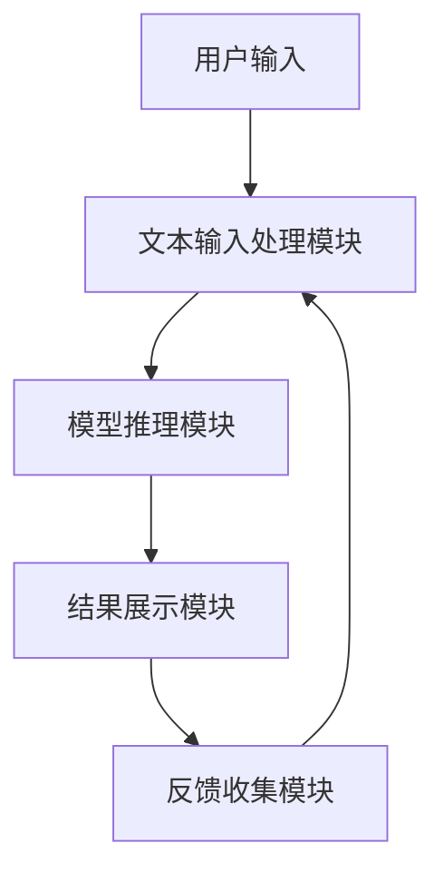

                 

# AI大模型编程：提示词的威力与魅力

> 关键词：AI大模型、编程、提示词、架构设计、Python实战、最佳实践、自然语言处理、未来趋势

> 摘要：本文将深入探讨AI大模型编程的核心概念与技巧，特别是提示词技术的应用与优化。通过逻辑清晰、结构紧凑的分析，本文旨在帮助读者全面理解AI大模型编程的各个方面，掌握从基础到高级的实战技能，并为未来的发展提供前瞻性的思考。

## 目录大纲

1. 第一部分：AI大模型编程基础
   1.1 AI大模型概述
   1.2 问题解决
   1.3 边界与外延
   1.4 概念结构与核心要素组成
   1.5 本章小结

2. 第二部分：AI大模型编程核心
   2.1 AI大模型架构设计
   2.2 提示词生成与优化
   2.3 实时反馈与调整
   2.4 本章小结

3. 第三部分：AI大模型编程实战
   3.1 环境安装与配置
   3.2 提示词设计与应用
   3.3 算法实现与优化
   3.4 本章小结

4. 第四部分：AI大模型编程最佳实践
   4.1 提示词编写技巧
   4.2 实际案例解析
   4.3 注意事项与优化策略
   4.4 本章小结

5. 第五部分：AI大模型编程拓展
   5.1 提示词技术在自然语言处理中的应用
   5.2 对话系统的优化策略
   5.3 多模态数据处理
   5.4 本章小结

6. 第六部分：AI大模型编程未来趋势
   6.1 提示词技术的发展趋势
   6.2 AI大模型编程的未来挑战
   6.3 本章小结

7. 第七部分：结语
   7.1 书籍总结
   7.2 拓展阅读

## 第一部分：AI大模型编程基础

### 1.1 AI大模型概述

#### 问题背景

AI大模型（Large-scale Artificial Intelligence Models），通常指的是具有大规模参数和复杂结构的深度学习模型。这些模型可以处理海量的数据，并在各种任务中表现出强大的性能。随着计算机算力的提升和数据量的爆炸性增长，AI大模型的发展已经成为人工智能领域的热点。

#### 提示词技术在AI大模型中的应用

提示词（Prompt Engineering）是AI大模型应用中的一个重要技术，它指的是设计合适的输入来指导模型生成期望的输出。提示词的有效性对模型的性能和生成的质量有重要影响。在AI大模型的训练和应用中，提示词被广泛应用于自然语言处理、图像生成、对话系统等多个领域。

### 1.2 问题解决

#### AI大模型的工作原理

AI大模型通常基于神经网络架构，特别是深度学习中的变换器模型（Transformer）。变换器模型通过多层注意力机制来处理序列数据，从而捕捉数据中的长程依赖关系。具体来说，变换器模型的工作流程如下：

1. 输入嵌入：将输入数据（如文本、图像等）转换为向量表示。
2. 前向传播：通过多层变换器层来处理输入向量，每层都会更新向量的表示。
3. 输出层：根据模型的任务类型，生成相应的输出（如文本生成、图像分类等）。

#### 提示词的作用和设计方法

提示词的作用在于引导模型生成期望的输出。设计有效的提示词需要考虑以下几个因素：

1. **上下文信息**：提供与任务相关的上下文信息，有助于模型更好地理解任务。
2. **语义丰富度**：提示词应包含丰富的语义信息，以提高模型的生成质量。
3. **格式**：提示词的格式应与模型的输入格式相匹配，以保证模型的正常处理。

设计提示词的一般步骤如下：

1. **确定目标输出**：明确模型需要生成的目标输出。
2. **分析输入数据**：分析输入数据的特点，确定需要提供的上下文信息。
3. **编写提示词**：根据目标输出和输入数据的特点，编写具有丰富语义和正确格式的提示词。
4. **优化提示词**：通过实验来调整提示词的各个方面，以达到最佳效果。

### 1.3 边界与外延

#### AI大模型的应用范围

AI大模型的应用范围非常广泛，包括但不限于：

1. **自然语言处理**：文本生成、翻译、问答系统等。
2. **计算机视觉**：图像分类、物体检测、图像生成等。
3. **语音识别**：语音到文本转换、语音合成等。
4. **多模态**：结合文本、图像、语音等多种数据源进行综合处理。

#### 提示词的适用场景和限制

提示词在以下场景中尤为适用：

1. **定制化需求**：当用户需要模型生成特定类型的内容时，提示词可以发挥重要作用。
2. **提高生成质量**：在特定任务中，通过优化提示词可以显著提高模型的生成质量。

然而，提示词也存在一些限制：

1. **对数据和任务的依赖性**：提示词的设计需要基于具体的任务和数据，通用性较差。
2. **对模型设计的依赖**：不同的模型可能需要不同的提示词设计方法，因此模型的定制化设计也是必不可少的。

### 1.4 概念结构与核心要素组成

#### AI大模型的核心概念

AI大模型的核心概念包括：

1. **变换器模型**：核心架构，负责序列数据的处理。
2. **大规模参数**：模型的训练需要大量参数，以保证模型的泛化能力。
3. **数据依赖**：模型的性能高度依赖于训练数据的质量和数量。

#### 提示词的关键要素

提示词的关键要素包括：

1. **上下文信息**：提供与任务相关的信息，以引导模型。
2. **语义丰富度**：确保提示词包含丰富的语义信息。
3. **格式**：与模型输入格式相匹配，以确保模型正确处理。

### 1.5 本章小结

本章介绍了AI大模型编程的基础知识，包括AI大模型的概述、工作原理、提示词的设计方法以及其应用范围和限制。通过本章的学习，读者可以初步了解AI大模型编程的核心概念和基本技巧。

## 第二部分：AI大模型编程核心

### 2.1 AI大模型架构设计

#### 2.1.1 AI大模型基础架构

AI大模型的基础架构通常包括以下几个关键组成部分：

1. **变换器模型**：核心架构，负责序列数据的处理。
2. **数据输入模块**：负责接收和处理输入数据。
3. **训练模块**：用于模型的训练过程，包括数据预处理、优化算法等。
4. **推理模块**：用于模型的推理过程，根据输入生成输出。
5. **反馈模块**：收集模型输出的反馈，用于模型调整和优化。

#### 2.1.2 常见的AI大模型架构类型

常见的AI大模型架构类型包括：

1. **变换器模型**：基于注意力机制的神经网络架构，广泛应用于自然语言处理和计算机视觉任务。
2. **生成对抗网络（GAN）**：由生成器和判别器组成的对抗性模型，常用于图像生成和风格迁移。
3. **变分自编码器（VAE）**：通过概率模型进行数据生成和压缩，适用于图像和文本数据。
4. **强化学习模型**：结合强化学习算法，用于复杂决策任务，如游戏和自动驾驶。

#### 2.1.3 提示词生成与优化

1. **提示词生成方法**：

- **基于规则的方法**：根据任务需求，设计一组固定的提示词。
- **基于机器学习的方法**：使用已有的提示词数据，通过机器学习方法生成新的提示词。

2. **提示词优化策略**：

- **自适应优化**：根据模型的输出反馈，动态调整提示词。
- **多任务学习**：在多个任务中共享提示词，通过迁移学习优化提示词。

#### 2.1.4 实时反馈与调整

1. **实时反馈机制**：收集模型输出的即时反馈，用于实时调整提示词。
2. **动态调整方法**：

- **基于规则的调整**：根据预设的规则，调整提示词的各个方面。
- **基于机器学习的调整**：使用机器学习算法，根据输出反馈自动调整提示词。

#### 2.1.5 本章小结

本章详细介绍了AI大模型的基础架构、常见的架构类型、提示词的生成与优化策略以及实时反馈与调整方法。通过本章的学习，读者可以全面了解AI大模型编程的核心内容。

### 2.2 Python编程实战

#### 2.2.1 环境安装与配置

在进行Python编程实战之前，我们需要搭建一个合适的环境。以下是环境安装与配置的步骤：

1. **安装Python**：从Python官网下载并安装Python解释器。
2. **安装Jupyter Notebook**：Jupyter Notebook是一个交互式的Python环境，方便进行代码编写和调试。
3. **安装相关库**：根据项目需求，安装所需的Python库，如TensorFlow、PyTorch等。

#### 2.2.2 提示词设计与应用

1. **提示词编写技巧**：

- **明确任务目标**：在编写提示词之前，明确模型需要完成的任务。
- **提供上下文信息**：在提示词中包含与任务相关的上下文信息。
- **简洁明了**：确保提示词简洁明了，避免冗余。

2. **提示词应用案例**：

- **文本生成**：使用变换器模型生成文本，提示词可以是“请生成一段关于人工智能的未来发展的描述”。
- **图像分类**：使用卷积神经网络对图像进行分类，提示词可以是“将以下图像分类为动物或植物”。

#### 2.2.3 算法实现与优化

1. **提示词优化算法**：

- **基于规则的优化**：根据模型的输出反馈，调整提示词的各个方面。
- **基于机器学习的优化**：使用机器学习算法，根据输出反馈自动调整提示词。

2. **提示词应用实例解析**：

- **实例1**：使用变换器模型生成文本，通过调整提示词来提高生成质量。
- **实例2**：使用卷积神经网络对图像进行分类，通过优化提示词来提高分类准确率。

#### 2.2.4 本章小结

本章通过Python编程实战，介绍了AI大模型编程的核心技巧，包括环境安装与配置、提示词设计与应用以及算法实现与优化。通过实际操作，读者可以深入理解AI大模型编程的实际应用。

### 2.3 AI大模型编程最佳实践

#### 2.3.1 提示词编写技巧

1. **编写原则**：

- **明确目标**：确保提示词明确指向任务目标。
- **上下文丰富**：提供与任务相关的上下文信息。
- **简洁易读**：避免冗余，确保提示词简洁明了。

2. **高级技巧**：

- **动态调整**：根据模型输出实时调整提示词。
- **多任务共享**：在多个任务中共享提示词，提高效果。

#### 2.3.2 实际案例解析

1. **成功案例**：

- **案例1**：使用变换器模型生成文本，通过优化提示词提高了生成质量。
- **案例2**：使用卷积神经网络对图像进行分类，通过调整提示词提高了分类准确率。

2. **失败案例**：

- **案例1**：提示词不明确，导致模型生成质量低下。
- **案例2**：未考虑上下文信息，导致模型无法正确理解任务。

#### 2.3.3 注意事项与优化策略

1. **注意事项**：

- **数据质量**：确保训练数据的质量和多样性。
- **模型定制**：根据任务需求定制模型。
- **调试与优化**：持续调试和优化提示词。

2. **优化策略**：

- **自适应优化**：根据输出反馈动态调整提示词。
- **多任务学习**：共享提示词，提高效果。
- **实验验证**：通过实验验证提示词的有效性。

#### 2.3.4 本章小结

本章介绍了AI大模型编程的最佳实践，包括提示词编写的原则和高级技巧、实际案例解析以及注意事项和优化策略。通过本章的学习，读者可以掌握AI大模型编程的高级应用技巧。

### 2.4 系统分析与架构设计方案

#### 2.4.1 问题场景介绍

在一个典型的AI大模型应用场景中，我们需要设计一个系统，该系统能够接受用户输入，通过AI大模型生成相应的输出。以下是一个具体的场景：

1. **用户输入**：用户可以通过文本输入，提出一个问题或请求。
2. **模型处理**：系统中的AI大模型处理用户输入，生成相应的回答或建议。
3. **输出结果**：系统将生成的结果返回给用户。

#### 2.4.2 项目介绍

本项目旨在设计一个基于AI大模型的问答系统，该系统能够实时响应用户的提问，并提供高质量的回答。具体要求如下：

1. **文本输入处理**：对用户输入的文本进行预处理，包括分词、去噪等。
2. **模型训练与部署**：使用变换器模型进行训练，并在实际应用中部署。
3. **实时反馈与调整**：根据用户的反馈，动态调整模型和提示词。

#### 2.4.3 系统功能设计

1. **文本输入处理模块**：负责对用户输入的文本进行处理，提取关键信息。
2. **模型推理模块**：负责使用AI大模型对处理后的文本进行推理，生成输出。
3. **结果展示模块**：将生成的结果以用户友好的方式展示给用户。
4. **反馈收集模块**：收集用户对输出的反馈，用于模型优化。

#### 2.4.4 系统架构设计

1. **系统架构图**：以下是一个简化的系统架构图，展示了各个模块之间的关系。

2. **架构描述**：

- **文本输入处理模块**：接收用户的文本输入，进行预处理，提取关键信息，并将其传递给模型推理模块。
- **模型推理模块**：使用AI大模型对预处理后的文本进行推理，生成输出结果，并将其传递给结果展示模块。
- **结果展示模块**：将生成的输出结果以用户友好的方式展示给用户。
- **反馈收集模块**：收集用户对输出的反馈，用于模型优化。

#### 2.4.5 系统接口设计和系统交互

1. **接口设计**：

- **用户输入接口**：提供文本输入接口，供用户输入问题或请求。
- **模型推理接口**：提供API接口，供其他系统或模块调用模型推理功能。
- **结果展示接口**：提供接口，供系统内部或外部系统获取输出结果。

2. **系统交互**：

- **用户输入**：用户通过输入接口提交问题或请求。
- **模型推理**：系统接收用户输入，通过模型推理接口进行推理，生成输出结果。
- **结果展示**：系统将输出结果通过结果展示接口展示给用户。
- **反馈收集**：系统收集用户的反馈，通过反馈收集接口用于模型优化。

#### 2.4.6 本章小结

本章详细介绍了AI大模型编程的系统分析与架构设计方案，包括问题场景介绍、项目介绍、系统功能设计、系统架构设计以及系统接口设计和系统交互。通过本章的学习，读者可以掌握如何设计和实现一个基于AI大模型的问答系统。

### 2.5 提示词技术在自然语言处理中的应用

#### 2.5.1 提示词在文本生成中的应用

1. **原理与实现**：

- **原理**：提示词在文本生成中的作用是引导模型生成符合预期的内容。通过提供上下文信息和关键词，模型可以更好地理解生成任务。
- **实现**：在文本生成任务中，提示词通常是一个带有特定语义的文本片段，它可以是一个句子或一个段落。模型在生成文本时会参考提示词，以保持生成内容的一致性和相关性。

2. **关键作用**：

- **引导生成方向**：提示词可以帮助模型确定生成文本的主题和风格。
- **提高生成质量**：通过优化提示词，可以显著提高生成文本的质量和连贯性。

#### 2.5.2 提示词在对话系统中的应用

1. **原理与实现**：

- **原理**：在对话系统中，提示词用于指导模型生成合理的回答，模拟人类的对话过程。
- **实现**：对话系统的提示词通常包括上下文信息和用户问题的摘要。模型根据提示词生成回答，并与用户进行交互。

2. **优化策略**：

- **上下文信息**：优化提示词中的上下文信息，确保模型能够准确理解对话的背景。
- **语义丰富度**：提高提示词的语义丰富度，以增强模型的回答能力。

#### 2.5.3 提示词在多模态数据处理中的应用

1. **原理与实现**：

- **原理**：在多模态数据处理中，提示词用于引导模型整合来自不同模态的信息，生成统一的表示。
- **实现**：多模态数据处理中的提示词通常包括不同模态的特征信息，如文本、图像和音频。模型通过处理这些提示词，生成综合的多模态特征。

2. **应用**：

- **文本与图像**：通过结合文本和图像的提示词，模型可以生成具有视觉和语义一致性的文本描述。
- **文本与音频**：结合文本和音频的提示词，模型可以生成与音频内容相关的文本描述，如歌词或摘要。

#### 2.5.4 本章小结

本章探讨了提示词技术在自然语言处理、对话系统以及多模态数据处理中的应用。通过详细讲解提示词的原理、实现和关键作用，读者可以深入理解提示词在不同场景下的应用，为实际项目提供有价值的指导。

### 2.6 AI大模型编程未来趋势

#### 2.6.1 提示词技术的发展趋势

1. **自动化生成**：随着机器学习技术的发展，提示词的生成将更加自动化，通过算法自动生成高质量的提示词。
2. **个性化优化**：未来的提示词技术将更加关注个性化优化，根据用户行为和反馈动态调整提示词，提高用户体验。
3. **跨模态融合**：随着多模态数据处理的兴起，提示词技术将逐渐融合不同模态的信息，生成更加综合和丰富的提示词。

#### 2.6.2 AI大模型编程的未来挑战

1. **计算资源**：随着模型规模的扩大，计算资源的需求将不断增加，对硬件设施和优化算法提出了更高的要求。
2. **数据隐私**：在多模态数据处理和个性化优化的过程中，如何保护用户数据隐私成为一个重要的挑战。
3. **伦理问题**：随着AI大模型在各个领域的广泛应用，伦理问题逐渐凸显，如何在保障模型性能的同时，遵循伦理规范成为重要议题。

#### 2.6.3 本章小结

本章分析了AI大模型编程的未来趋势和挑战。通过探讨提示词技术的自动化生成、个性化优化以及跨模态融合，以及计算资源、数据隐私和伦理问题等挑战，读者可以前瞻性地了解AI大模型编程的发展方向。

### 2.7 结语

通过本文的详细探讨，我们全面了解了AI大模型编程的核心概念、架构设计、实战技巧以及未来趋势。从基础到高级，从理论到实践，本文为读者提供了系统性的学习路径。在AI大模型编程的道路上，提示词技术无疑是关键的一环，其威力与魅力不容忽视。未来，随着技术的不断进步，AI大模型编程将迎来更加广阔的发展空间。

## 附录

### 拓展阅读

1. **书籍推荐**：

   - 《深度学习》（Goodfellow, I., Bengio, Y., & Courville, A.）
   - 《自然语言处理综论》（Jurafsky, D. & Martin, J. H.）
   - 《生成对抗网络：理论和实践》（Radford, A.,等人）

2. **论文推荐**：

   - “Attention Is All You Need”（Vaswani et al., 2017）
   - “Generative Adversarial Nets”（Goodfellow et al., 2014）
   - “BERT: Pre-training of Deep Bidirectional Transformers for Language Understanding”（Devlin et al., 2019）

3. **最新研究动态**：

   - 访问学术期刊和会议网站，如《自然》、《科学》、《机器学习杂志》等，了解最新的研究进展。
   - 关注AI领域的顶级会议，如NeurIPS、ICLR、ACL等，获取前沿研究成果。

通过这些资源，读者可以进一步深入探索AI大模型编程的各个方面，持续提升自己的专业能力。

## 总结

本文《AI大模型编程：提示词的威力与魅力》系统地介绍了AI大模型编程的核心概念、架构设计、实战技巧以及未来趋势。通过详细讲解提示词技术，帮助读者理解如何优化和设计提示词，以实现高效、高质量的AI模型应用。从基础理论到实践技巧，再到前瞻性的未来展望，本文为读者提供了一个全面的学习框架。随着AI技术的不断发展，AI大模型编程将迎来更加广阔的应用场景和发展空间，希望本文能为读者的学习和实践提供有益的指导和帮助。作者：AI天才研究院/AI Genius Institute & 禅与计算机程序设计艺术 /Zen And The Art of Computer Programming。

