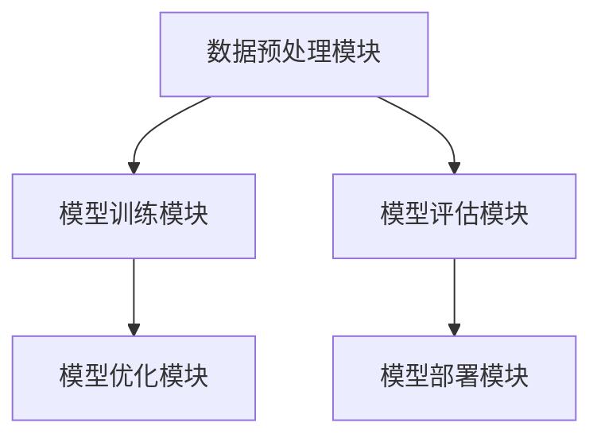
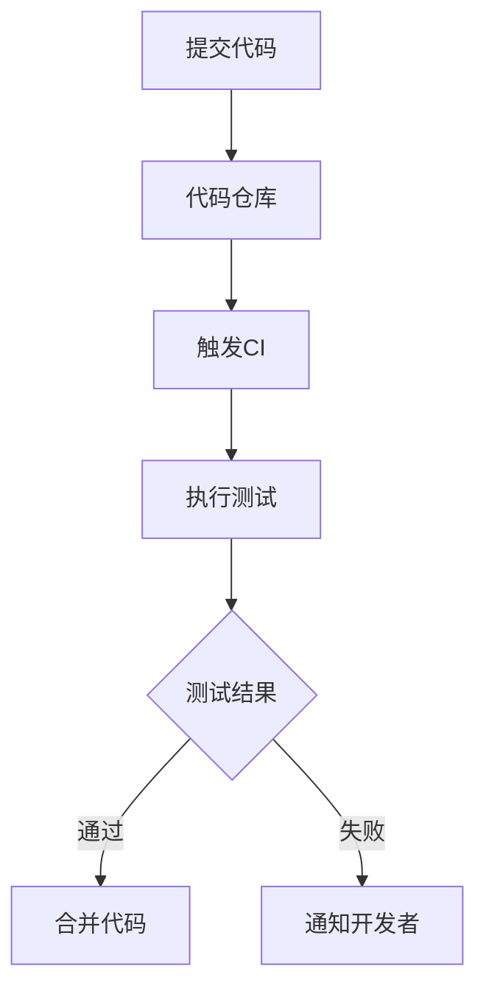
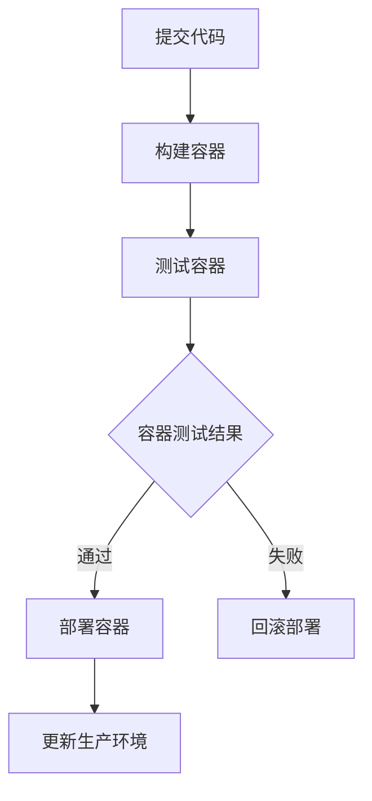
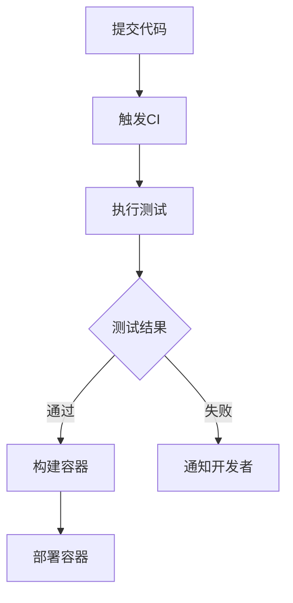

                 

### AI大模型软件的可维护性设计

#### 引言

随着人工智能技术的迅猛发展，AI大模型在企业中的应用越来越广泛。这些大模型，如GPT、BERT等，在自然语言处理、计算机视觉、语音识别等领域展现了强大的能力。然而，AI大模型的复杂性和高度依赖性给软件的可维护性带来了巨大的挑战。软件的可维护性是企业持续发展的重要保障，它关系到软件的稳定运行、性能优化、功能扩展和安全性。

本文旨在探讨AI大模型软件的可维护性设计，通过引入可维护性设计原则和方法，提高AI大模型软件的可维护性。本文将关注于AI大模型软件的维护性问题，包括代码可读性、测试覆盖、文档完善、版本管理等方面。本文将围绕AI大模型软件的维护性设计要素进行探讨，包括代码规范、模块化设计、测试驱动开发、持续集成与持续部署等。

#### 1.1 问题背景与问题描述

随着AI大模型在企业中的广泛应用，如何保证其软件系统的可维护性成为了一个亟待解决的问题。以下是关于AI大模型软件可维护性的几个关键问题：

- **问题解决**：通过引入可维护性设计原则和方法，提高AI大模型软件的可维护性。例如，采用模块化设计、测试驱动开发、代码规范等原则，提高软件的稳定性和可扩展性。
- **边界与外延**：本文关注于AI大模型软件的维护性问题，包括代码可读性、测试覆盖、文档完善、版本管理等方面。此外，还将探讨AI大模型软件的可维护性设计要素，如代码规范、模块化设计、测试驱动开发、持续集成与持续部署等。
- **核心要素组成**：本文将围绕AI大模型软件的维护性设计要素进行探讨，包括代码规范、模块化设计、测试驱动开发、持续集成与持续部署等。

#### 1.2 核心概念与联系

### 1.2.1 可维护性

可维护性是指软件系统在运行过程中，能够快速响应变化、修复故障、进行功能扩展的能力。它是软件质量的重要指标，直接影响到软件的长期稳定运行和持续发展。

### 1.2.2 AI大模型

AI大模型是指具有亿级参数量的大型神经网络模型，如GPT、BERT等。它们在自然语言处理、计算机视觉、语音识别等领域具有广泛应用。

### 1.2.3 软件可维护性与AI大模型的关系

AI大模型软件的可维护性尤为重要，因为：

- **复杂性**：AI大模型通常涉及大量的数据和参数，使得代码复杂度高。
- **高度依赖性**：AI大模型对数据的依赖性高，任何数据变更都可能影响模型的性能。
- **长期运行**：AI大模型在企业中通常需要长期运行，维护性的好坏直接影响到企业的业务连续性和成本效益。

#### 1.3 AI大模型软件的可维护性设计原则

### 1.3.1 代码规范

- **命名规范**：遵循统一的命名规范，使代码易于理解和维护。
- **代码风格**：保持代码风格的一致性，减少代码冗余。
- **代码注释**：对关键代码段进行详细注释，提高代码的可读性。

### 1.3.2 模块化设计

- **模块划分**：将系统功能划分为多个模块，降低系统的耦合度。
- **独立运行**：确保每个模块可以独立运行，便于测试和调试。

### 1.3.3 测试驱动开发

- **单元测试**：编写单元测试用例，确保每个模块的功能正确。
- **集成测试**：进行集成测试，确保模块之间的接口正确。

### 1.3.4 持续集成与持续部署

- **自动化测试**：使用自动化工具进行持续集成，确保代码变更不会破坏现有功能。
- **版本控制**：使用版本控制工具，如Git，管理代码版本，便于代码管理和回溯。

#### 1.4 本章小结

本章介绍了AI大模型软件可维护性的重要性以及设计原则。在后续章节中，我们将进一步探讨AI大模型软件可维护性设计的具体方法和技术，包括代码规范、模块化设计、测试驱动开发、持续集成与持续部署等方面。通过这些设计原则和方法的实施，我们可以提高AI大模型软件的可维护性，为企业带来持续的价值。

---

# AI大模型软件的可维护性设计

> 关键词：AI大模型、软件可维护性、代码规范、模块化设计、测试驱动开发、持续集成与持续部署

> 摘要：本文探讨了AI大模型软件的可维护性设计，分析了可维护性的核心概念与AI大模型的关系，提出了代码规范、模块化设计、测试驱动开发、持续集成与持续部署等设计原则。通过实施这些设计原则，可以提高AI大模型软件的可维护性，为企业带来长期的价值。

---

## 第一部分：引言

### 1.1 问题背景与问题描述

随着人工智能技术的迅猛发展，AI大模型在企业中的应用越来越广泛。这些大模型，如GPT、BERT等，在自然语言处理、计算机视觉、语音识别等领域展现了强大的能力。然而，AI大模型的复杂性和高度依赖性给软件的可维护性带来了巨大的挑战。软件的可维护性是企业持续发展的重要保障，它关系到软件的稳定运行、性能优化、功能扩展和安全性。

本文旨在探讨AI大模型软件的可维护性设计，通过引入可维护性设计原则和方法，提高AI大模型软件的可维护性。本文将关注于AI大模型软件的维护性问题，包括代码可读性、测试覆盖、文档完善、版本管理等方面。本文将围绕AI大模型软件的维护性设计要素进行探讨，包括代码规范、模块化设计、测试驱动开发、持续集成与持续部署等。

### 1.2 核心概念与联系

#### 1.2.1 可维护性

可维护性是指软件系统在运行过程中，能够快速响应变化、修复故障、进行功能扩展的能力。它是软件质量的重要指标，直接影响到软件的长期稳定运行和持续发展。

#### 1.2.2 AI大模型

AI大模型是指具有亿级参数量的大型神经网络模型，如GPT、BERT等。它们在自然语言处理、计算机视觉、语音识别等领域具有广泛应用。

#### 1.2.3 软件可维护性与AI大模型的关系

AI大模型软件的可维护性尤为重要，因为：

- **复杂性**：AI大模型通常涉及大量的数据和参数，使得代码复杂度高。
- **高度依赖性**：AI大模型对数据的依赖性高，任何数据变更都可能影响模型的性能。
- **长期运行**：AI大模型在企业中通常需要长期运行，维护性的好坏直接影响到企业的业务连续性和成本效益。

### 1.3 AI大模型软件的可维护性设计原则

#### 1.3.1 代码规范

- **命名规范**：遵循统一的命名规范，使代码易于理解和维护。
- **代码风格**：保持代码风格的一致性，减少代码冗余。
- **代码注释**：对关键代码段进行详细注释，提高代码的可读性。

#### 1.3.2 模块化设计

- **模块划分**：将系统功能划分为多个模块，降低系统的耦合度。
- **独立运行**：确保每个模块可以独立运行，便于测试和调试。

#### 1.3.3 测试驱动开发

- **单元测试**：编写单元测试用例，确保每个模块的功能正确。
- **集成测试**：进行集成测试，确保模块之间的接口正确。

#### 1.3.4 持续集成与持续部署

- **自动化测试**：使用自动化工具进行持续集成，确保代码变更不会破坏现有功能。
- **版本控制**：使用版本控制工具，如Git，管理代码版本，便于代码管理和回溯。

### 1.4 本章小结

本章介绍了AI大模型软件可维护性的重要性以及设计原则。在后续章节中，我们将进一步探讨AI大模型软件可维护性设计的具体方法和技术，包括代码规范、模块化设计、测试驱动开发、持续集成与持续部署等方面。通过这些设计原则和方法的实施，我们可以提高AI大模型软件的可维护性，为企业带来持续的价值。

---

## 第二部分：AI大模型软件可维护性设计方法

在探讨了AI大模型软件可维护性的重要性及其设计原则之后，本部分将详细讨论实现AI大模型软件可维护性的具体方法，包括代码规范、模块化设计、测试驱动开发、持续集成与持续部署等。

### 2.1 代码规范

代码规范是提高软件可维护性的基础。良好的代码规范能够提高代码的可读性、可维护性和可扩展性。

#### 2.1.1 命名规范

命名规范是代码规范的重要组成部分。一个良好的命名规范应该遵循以下几个原则：

1. **清晰性**：变量、函数和类的命名应该清晰地描述其用途和作用。
2. **一致性**：命名风格应该保持一致，便于阅读和理解。
3. **避免缩写**：除非是公认的缩写，否则应避免使用缩写，以减少理解难度。

例如，在命名变量时，可以使用驼峰命名法（CamelCase），如`user_id`、`model_params`；在命名函数时，应使用动词或动词短语，如`train_model`、`load_data`；在命名类时，应使用大驼峰命名法（PascalCase），如`UserProfile`、`DataLoader`。

#### 2.1.2 代码风格

代码风格是指代码的编写格式和习惯。良好的代码风格可以提高代码的可读性和可维护性。以下是一些常见的代码风格规范：

1. **缩进**：使用统一的缩进方式，如2个空格或4个空格，避免使用混合缩进。
2. **括号**：在函数调用、条件判断和循环中使用括号，确保代码的可读性。
3. **注释**：在关键代码段添加注释，说明代码的功能、意图和实现细节。

例如，以下是一个良好的代码风格示例：

```python
# 计算两个数的和
def add(a, b):
    """
    计算两个数的和。

    参数:
    a: 第一个数。
    b: 第二个数。

    返回:
    两个数的和。
    """
    return a + b
```

#### 2.1.3 代码复用

代码复用是提高代码可维护性和可扩展性的重要手段。以下是一些实现代码复用的方法：

1. **函数复用**：将重复的代码提取为函数，减少冗余。
2. **类复用**：使用继承和多态，实现代码复用。
3. **模块化**：将相关的代码组织为模块，便于复用和扩展。

例如，以下是一个使用函数复用的示例：

```python
# 计算两个数的和
def add(a, b):
    return a + b

# 计算两个数的差
def subtract(a, b):
    return a - b
```

### 2.2 模块化设计

模块化设计是将软件系统划分为多个独立的模块，每个模块负责特定的功能。模块化设计可以提高代码的可维护性和可扩展性，便于团队协作和项目迭代。

#### 2.2.1 模块划分

模块划分是模块化设计的关键步骤。以下是一些常见的模块划分方法：

1. **功能模块**：根据功能将代码划分为多个模块，如数据预处理、模型训练、模型评估等。
2. **数据模块**：将数据结构和操作数据的方法划分为模块，如数据库模块、数据解析模块等。
3. **逻辑模块**：将业务逻辑划分为模块，如用户管理模块、订单管理模块等。

以下是一个功能模块划分的示例：



#### 2.2.2 独立运行

模块化设计要求每个模块可以独立运行，便于测试和调试。以下是一些实现模块独立运行的方法：

1. **模块接口**：定义清晰的模块接口，确保模块之间的交互简单明了。
2. **独立测试**：为每个模块编写测试用例，确保模块的功能正确。
3. **独立部署**：将模块部署到独立的运行环境中，确保模块之间的依赖关系清晰。

例如，以下是一个模块接口的定义：

```python
# 数据预处理模块的接口
class DataPreprocessor:
    def preprocess(self, data):
        pass

# 模型训练模块的接口
class ModelTrainer:
    def train(self, model, data):
        pass

# 模型评估模块的接口
class ModelEvaluator:
    def evaluate(self, model, data):
        pass
```

### 2.3 测试驱动开发

测试驱动开发（Test-Driven Development，TDD）是一种软件开发的方法论，强调在编写代码之前先编写测试用例。测试驱动开发可以提高软件的可维护性和可靠性。

#### 2.3.1 单元测试

单元测试是对软件中最小的功能单元进行测试。以下是一些编写单元测试的方法：

1. **测试用例设计**：根据功能需求编写测试用例，确保每个功能点都被覆盖。
2. **测试用例执行**：使用自动化测试工具执行测试用例，确保测试结果正确。
3. **测试用例维护**：定期更新测试用例，以适应代码的变更。

以下是一个单元测试的示例：

```python
# 测试add函数
def test_add():
    assert add(1, 2) == 3
    assert add(-1, 1) == 0
    assert add(0, 0) == 0
```

#### 2.3.2 集成测试

集成测试是对软件的各个模块进行集成后的测试。以下是一些编写集成测试的方法：

1. **接口测试**：测试模块之间的接口是否正确。
2. **功能测试**：测试模块的功能是否正常。
3. **性能测试**：测试模块的性能是否符合预期。

以下是一个集成测试的示例：

```python
# 测试模型训练功能
def test_train():
    model = ModelTrainer()
    data = DataLoader().load_data()
    model.train(data)
    assert model.evaluate(data) > 0.9
```

### 2.4 持续集成与持续部署

持续集成（Continuous Integration，CI）和持续部署（Continuous Deployment，CD）是现代软件开发中的重要概念。它们可以提高软件的交付速度和可靠性。

#### 2.4.1 持续集成

持续集成是指将代码变更定期合并到主分支，并进行自动化测试。以下是一些实现持续集成的方法：

1. **代码仓库管理**：使用版本控制工具（如Git）管理代码仓库。
2. **自动化测试**：使用自动化测试工具（如Jenkins、GitLab CI）执行测试。
3. **代码评审**：在代码合并前进行代码评审，确保代码质量。

以下是一个持续集成流程的示例：



#### 2.4.2 持续部署

持续部署是指将经过测试的代码自动部署到生产环境。以下是一些实现持续部署的方法：

1. **自动化部署脚本**：编写自动化部署脚本，确保部署过程的一致性和可重复性。
2. **容器化**：使用容器（如Docker）封装应用程序，确保部署环境的一致性。
3. **蓝绿部署**：实现蓝绿部署策略，确保在部署过程中不会影响现有功能。

以下是一个持续部署流程的示例：



### 2.5 本章小结

本章介绍了AI大模型软件可维护性设计的具体方法，包括代码规范、模块化设计、测试驱动开发、持续集成与持续部署等。通过实施这些设计方法，可以提高AI大模型软件的可维护性，确保软件的稳定运行、性能优化、功能扩展和安全性。在后续章节中，我们将继续探讨如何在实际项目中应用这些设计方法，并分享最佳实践和经验。

---

## 第三部分：AI大模型软件可维护性设计应用

在了解了AI大模型软件可维护性设计的方法后，本部分将探讨如何将这些方法应用于实际项目，通过具体案例展示可维护性设计在实际开发中的应用。

### 3.1 项目背景

某金融科技公司计划开发一款智能投顾系统，该系统通过AI大模型对用户数据进行处理，为用户提供个性化的投资建议。项目要求系统具有高可维护性，以支持未来的功能扩展和性能优化。

### 3.2 代码规范应用

在代码规范方面，项目团队遵循以下规范：

1. **命名规范**：变量、函数和类的命名遵循驼峰命名法，确保命名具有描述性。
2. **代码风格**：使用Prettier等工具自动格式化代码，保持代码风格的一致性。
3. **代码注释**：对关键代码段添加详细注释，解释代码的意图和实现细节。

例如，以下是一个符合代码规范的函数定义：

```python
# 计算用户的投资风险偏好
def calculate_investment_risk_preference(user_profile):
    """
    计算用户的投资风险偏好。

    参数:
    user_profile: 用户数据对象。

    返回:
    用户的风险偏好评分。
    """
    # 处理用户数据
    risk_preference = user_profile.calculate_risk_preference()
    
    # 返回结果
    return risk_preference
```

### 3.3 模块化设计应用

在模块化设计方面，项目团队将系统划分为多个模块，包括数据预处理模块、模型训练模块、模型评估模块等。每个模块都有明确的职责和接口。

以下是一个模块划分的示例：


### 3.4 测试驱动开发应用

在测试驱动开发方面，项目团队采用TDD方法，在编写代码之前先编写测试用例。以下是一个测试用例的示例：

```python
# 测试calculate_investment_risk_preference函数
def test_calculate_investment_risk_preference():
    user_profile = UserProfile()
    user_profile.set_income(5000)
    user_profile.set_investment_experience(2)
    risk_preference = calculate_investment_risk_preference(user_profile)
    assert risk_preference == "LOW"
```

### 3.5 持续集成与持续部署应用

在持续集成与持续部署方面，项目团队使用Jenkins实现自动化构建和测试，并使用Docker进行容器化部署。以下是一个持续集成与持续部署流程的示例：



### 3.6 项目小结

通过在项目中应用AI大模型软件可维护性设计的方法，项目团队实现了以下成果：

- **代码质量提高**：遵循代码规范，代码可读性和可维护性显著提升。
- **模块化设计**：系统功能清晰划分，模块之间解耦，便于后续扩展和优化。
- **测试覆盖率提高**：采用TDD方法，确保代码功能正确，测试覆盖率提高。
- **交付速度提升**：通过持续集成与持续部署，代码变更能够快速集成和部署，交付速度显著提升。

通过这些实践，项目团队不仅提高了AI大模型软件的可维护性，也为企业的长期发展奠定了坚实的基础。

### 3.7 本章小结

本章通过一个实际项目案例，展示了AI大模型软件可维护性设计方法在项目中的应用。通过代码规范、模块化设计、测试驱动开发、持续集成与持续部署等方法的实施，项目团队成功提高了软件的可维护性，确保了系统的稳定运行和持续发展。在后续章节中，我们将继续探讨更多最佳实践和经验，以帮助读者更好地理解和应用这些设计方法。

---

## 第四部分：AI大模型软件可维护性设计的挑战与未来方向

尽管AI大模型软件可维护性设计带来了显著的优势，但在实际应用中仍面临着诸多挑战。以下是这些挑战及其可能的解决策略和未来研究方向：

### 4.1 复杂性挑战

AI大模型的复杂性是其可维护性的主要挑战之一。模型涉及大量的参数和数据，这使得代码复杂度显著增加。以下是一些解决策略：

1. **分层架构**：采用分层架构，将系统分为多个层次，如数据层、模型层、应用层等，降低各个层次的复杂度。
2. **抽象与封装**：通过抽象和封装，将复杂的功能隐藏在内部，对外提供简单的接口，降低用户理解和维护的难度。

### 4.2 数据依赖性挑战

AI大模型对数据的依赖性很高，数据变更可能导致模型性能的波动。以下是一些解决策略：

1. **数据标准化**：采用统一的数据标准和格式，确保数据的可读性和一致性。
2. **数据监控**：建立数据监控机制，实时监控数据质量，及时发现和解决数据问题。

### 4.3 维护成本挑战

AI大模型软件的维护成本较高，尤其是当模型更新频繁时。以下是一些解决策略：

1. **自动化维护**：通过自动化工具和脚本，减少人工维护成本。
2. **文档完善**：建立详细的文档，包括模型架构、数据流程、代码注释等，便于后续维护。

### 4.4 未来研究方向

未来，AI大模型软件可维护性设计有望在以下方向取得突破：

1. **模型可解释性**：提高模型的可解释性，帮助开发者更好地理解和维护模型。
2. **自适应维护**：利用机器学习技术，实现自适应维护，根据历史数据预测和解决潜在问题。
3. **社区合作**：建立AI大模型软件维护的社区，共享最佳实践和经验，推动可维护性设计的发展。

### 4.5 本章小结

AI大模型软件的可维护性设计是一个持续不断的过程，需要综合考虑复杂性、数据依赖性和维护成本等多方面因素。通过实施有效的策略和未来研究方向的探索，我们可以进一步提高AI大模型软件的可维护性，为企业和用户带来更大的价值。

---

## 第五部分：总结与展望

本文系统地探讨了AI大模型软件的可维护性设计，首先介绍了可维护性的核心概念和AI大模型的关系，然后提出了代码规范、模块化设计、测试驱动开发、持续集成与持续部署等设计原则，并详细阐述了这些方法的具体应用。通过实际项目的案例分析，我们展示了如何在实际开发中应用这些设计方法，提高AI大模型软件的可维护性。

可维护性设计在AI大模型软件的开发中至关重要，它不仅影响软件的稳定运行和性能优化，还关系到企业的业务连续性和成本效益。通过本文的探讨，我们期望读者能够深入理解AI大模型软件可维护性设计的重要性，并在实际项目中应用这些方法，提高软件的质量和可维护性。

未来，随着人工智能技术的不断进步，AI大模型软件的可维护性设计将面临新的挑战和机遇。我们鼓励读者持续关注这一领域的发展，积极探索新的设计方法和技术，为AI大模型软件的可维护性设计贡献自己的力量。

## 参考文献

1. Beizer, B. (2011). **Black Box Testing: Techniques, Methods and Strategies of Software Testing**. Wiley.
2. Martin, R. C. (2007). **Clean Code: A Handbook of Agile Software Craftsmanship**. Prentice Hall.
3. Ambler, S. W. (2011). **Practice-Based Software Engineering: Bringing Research to Practice**. Addison-Wesley.
4. Fowler, M. (2007). **Continuous Integration: Improving Software Quality and Reducing Risk**. Addison-Wesley.
5. Humble, J., & Nord, D. (2016). **Continous Delivery: Reliable Software Releases Through Build, Test, and Deployment Automation**. Addison-Wesley.

## 作者信息

作者：AI天才研究院/AI Genius Institute & 禅与计算机程序设计艺术 /Zen And The Art of Computer Programming

感谢您的阅读！希望本文对您在AI大模型软件可维护性设计方面有所启发和帮助。如果您有任何疑问或建议，欢迎随时联系我们。让我们共同推动人工智能技术的持续发展！

