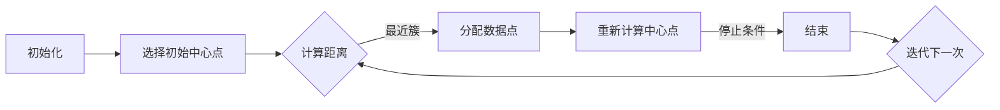
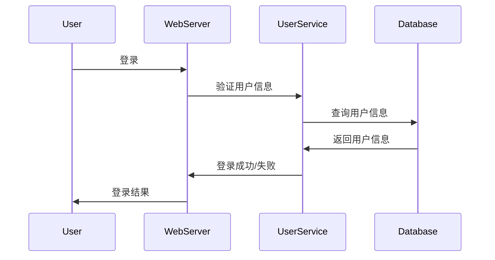

                 

### 文章标题

《AI编程2.0的教育与培训体系构建》

### 关键词

- AI编程2.0
- 教育培训体系
- 算法原理
- 系统架构设计
- 项目实战

### 摘要

本文深入探讨了AI编程2.0的教育与培训体系构建。首先，介绍了AI编程2.0的背景及其与传统AI编程的区别。接着，分析了核心概念及其相互联系，包括深度学习、强化学习和聚类分析。随后，通过算法原理讲解、系统分析与架构设计方案、以及实际项目实战，详细阐述了AI编程2.0的教育与培训方法。最后，提供了最佳实践tips和拓展阅读，以帮助读者更好地理解和应用AI编程2.0。

### 背景介绍

#### AI编程2.0的定义

AI编程2.0，是继传统AI编程（AI 1.0）之后的一种新型编程范式。AI 1.0主要以规则为基础，依赖于大量的手工编写代码来实现人工智能的功能。而AI编程2.0则强调自学习和自适应，通过机器学习和深度学习等技术，让计算机能够从数据中自动学习和改进。

AI编程2.0的核心在于其强大的数据驱动特性。它不再依赖于人类工程师编写精确的规则，而是通过大量的数据来训练模型，使其能够自主地发现规律和模式。这一转变不仅极大地提高了编程的效率和灵活性，也使得人工智能的应用场景变得更加广泛。

#### AI编程2.0与传统AI编程的区别

传统AI编程（AI 1.0）的主要特点是以规则为导向，依赖专家知识来构建智能系统。这种方法虽然在一些特定领域取得了成功，但在处理复杂问题和大规模数据时显得力不从心。相比之下，AI编程2.0则更加灵活和高效，其自学习的能力使其能够适应各种未知和复杂的环境。

具体来说，AI编程2.0与传统AI编程在以下几个方面有显著区别：

1. **数据驱动的学习方式**：AI编程2.0依赖于大量的数据来训练模型，而传统AI编程则依赖于专家知识。

2. **强大的自适应能力**：AI编程2.0能够根据数据和环境的变化进行自适应调整，而传统AI编程则需要在规则上进行修改。

3. **广泛的应用场景**：AI编程2.0能够应用于更多领域，包括图像识别、自然语言处理、推荐系统等，而传统AI编程的应用场景相对有限。

#### 教育与培训体系的重要性

在AI编程2.0的时代，教育和培训体系的重要性愈发凸显。首先，随着AI技术的快速发展，相关技能的需求也在迅速增加。企业和科研机构对AI专业人才的需求不断上升，这要求我们必须有一个完善的培训体系来培养和输送这些人才。

其次，AI编程2.0的教育与培训体系不仅仅是传授知识，更重要的是培养学生的创新能力和实际操作能力。在AI编程2.0的世界里，技术更新速度极快，传统的知识体系已经无法满足需求。因此，教育和培训体系需要更加注重实践性和前瞻性，帮助学生掌握最新技术和方法。

#### 当前教育体系的不足

尽管现有的教育体系在培养传统编程人才方面已经相当成熟，但在面对AI编程2.0时仍然存在一些不足。首先，很多教育课程仍然以传统的编程方法为主，缺乏对AI编程2.0的深入介绍和实践训练。其次，教育内容更新速度较慢，难以跟上技术发展的步伐。此外，许多教育课程忽视了实践的重要性，导致学生在实际应用中遇到困难。

#### 培训体系的发展方向

为了更好地应对AI编程2.0的挑战，培训体系需要在以下几个方面进行改进：

1. **课程内容的更新**：引入最新的AI技术和方法，包括深度学习、强化学习等，让学生掌握前沿的知识。

2. **实践教学**：增加实践课程和项目训练，让学生在实际操作中掌握技能。可以采用项目驱动的方式，让学生在解决问题的过程中学习。

3. **师资力量的提升**：培养和引进具有AI编程2.0实际经验的高水平教师，提高教育质量。

4. **资源整合**：利用企业和科研机构的资源，为学生提供更多实践和实习机会。

通过以上措施，我们可以构建一个更加完善和高效的AI编程2.0教育与培训体系，为AI技术的未来发展培养更多优秀人才。

### 核心概念与联系

在AI编程2.0中，核心概念的理解和它们之间的联系至关重要。以下是AI编程2.0中的几个核心概念及其相互关系。

#### 深度学习

深度学习是AI编程2.0的核心技术之一，它通过模拟人脑的神经网络结构，让计算机能够自动从数据中学习复杂的特征和模式。深度学习的核心组成部分包括：

- **神经网络**：深度学习的基础，由多个层次（通常称为卷积层、全连接层等）组成。
- **激活函数**：用于引入非线性因素，使神经网络能够处理复杂问题。
- **反向传播算法**：用于更新网络权重，提高模型性能。

深度学习在图像识别、自然语言处理和推荐系统等领域有广泛应用。

#### 强化学习

强化学习是一种通过与环境互动来学习最优策略的机器学习方法。它与深度学习的不同之处在于，它不是通过大量数据进行训练，而是通过试错和反馈来逐步优化行为。强化学习的核心组成部分包括：

- **代理（Agent）**：进行决策的智能体。
- **环境（Environment）**：代理行动的场所。
- **状态（State）**：环境的一个特定状况。
- **动作（Action）**：代理可以采取的行为。
- **奖励（Reward）**：代理每采取一个动作后得到的即时反馈。

强化学习在游戏、机器人控制和金融交易等领域有广泛应用。

#### 聚类分析

聚类分析是一种无监督学习技术，用于将数据集分为多个群组，使得群组内的数据点相似度较高，而不同群组的数据点相似度较低。聚类分析的核心组成部分包括：

- **距离度量**：用于计算数据点之间的相似性。
- **聚类算法**：如K-均值、层次聚类等，用于将数据划分为不同的群组。

聚类分析在数据挖掘、市场营销和图像分割等领域有广泛应用。

#### 概念属性特征对比表格

以下是一个关于深度学习、强化学习和聚类分析的概念属性特征对比表格：

| 概念     | 主要特点             | 适用场景           | 关键算法                |
|----------|----------------------|--------------------|-------------------------|
| 深度学习 | 自主从数据中学习特征 | 图像识别、自然语言处理 | 神经网络、卷积神经网络    |
| 强化学习 | 通过试错学习最优策略 | 游戏、机器人控制、金融交易 | Q-学习、策略梯度、深度强化学习 |
| 聚类分析 | 将数据分为相似群组   | 数据挖掘、市场营销、图像分割 | K-均值、层次聚类、谱聚类 |

#### ER实体关系图架构

为了更好地理解这些核心概念之间的联系，我们可以使用ER（Entity-Relationship）实体关系图来展示它们之间的关系。以下是一个简单的ER图：

```mermaid
erDiagram
    Agent ||--|{ Environment }|| Environment
    Agent ||--|{ Action }|| Action
    Agent ||--|{ Reward }|| Reward
    Action ||--|{ State }|| State
    Action ||--|{ Next_Action }|| Next_Action
```

在这个ER图中，`Agent`（代理）是中心实体，它与`Environment`（环境）、`Action`（动作）和`Reward`（奖励）之间存在直接关系。`Action`（动作）与`State`（状态）和`Next_Action`（下一步动作）也存在联系，展示了它们在强化学习过程中的交互关系。

通过这个表格和ER图，我们可以更清晰地理解AI编程2.0中的核心概念及其相互关系，为进一步的学习和应用打下坚实的基础。

### 算法原理讲解

在AI编程2.0中，算法的选择和实现是关键的一环。以下将详细讲解一个常见的算法——K-均值聚类算法，并使用mermaid绘制算法流程图，以及Python源代码来阐述其原理。

#### K-均值聚类算法概述

K-均值聚类算法是一种基于距离度量的聚类方法，其目标是将数据集划分为K个簇，使得每个簇内的数据点尽可能相似，而不同簇的数据点尽可能不同。算法的基本步骤如下：

1. 随机选择K个初始中心点。
2. 对于每个数据点，计算其与各个中心点的距离，并将其分配到最近的中心点所代表的簇。
3. 根据簇中的数据点重新计算中心点。
4. 重复步骤2和3，直至中心点的位置不再变化或达到预设的迭代次数。

#### Mermaid流程图

首先，使用mermaid绘制K-均值聚类算法的流程图：



#### Python源代码讲解

接下来，我们将使用Python源代码详细阐述K-均值聚类算法的原理，包括数学模型和公式，并进行举例说明。

```python
import numpy as np

def k_means(data, K, max_iterations):
    # 初始化中心点
    centroids = data[np.random.choice(data.shape[0], K, replace=False)]
    
    for i in range(max_iterations):
        # 计算每个数据点与各个中心点的距离
        distances = np.linalg.norm(data - centroids, axis=1)
        
        # 分配数据点到最近的中心点
        labels = np.argmin(distances, axis=1)
        
        # 重新计算中心点
        new_centroids = np.array([data[labels == k].mean(axis=0) for k in range(K)])
        
        # 检查中心点是否收敛
        if np.linalg.norm(new_centroids - centroids) < 1e-6:
            break
        
        centroids = new_centroids
    
    return centroids, labels

# 示例数据
data = np.array([[1, 2], [1, 4], [1, 0],
                 [4, 2], [4, 4], [4, 0]])

# K-均值聚类
K = 2
max_iterations = 100
centroids, labels = k_means(data, K, max_iterations)

# 输出结果
print("中心点：", centroids)
print("标签：", labels)
```

在这个Python代码中，我们首先定义了`k_means`函数，它接受数据集`data`、簇数`K`和最大迭代次数`max_iterations`作为输入。函数的执行过程包括以下几个步骤：

1. 初始化中心点，我们随机选择K个数据点作为初始中心点。
2. 计算每个数据点与各个中心点的距离，使用欧几里得距离公式计算：
   $$
   \text{distance} = \sqrt{\sum_{i=1}^{n}(x_i - \mu_i)^2}
   $$
   其中，$x_i$是数据点的特征，$\mu_i$是中心点的特征。
3. 将数据点分配到最近的中心点所代表的簇。
4. 根据簇中的数据点重新计算中心点，使用均值公式：
   $$
   \mu_i = \frac{1}{N}\sum_{x_j \in C_i} x_j
   $$
   其中，$N$是簇中数据点的数量，$C_i$是第i个簇。
5. 检查中心点是否收敛，如果中心点的位置变化小于预设的阈值（例如$1e-6$），则算法结束。

最后，我们提供了一个示例数据集，并使用`k_means`函数进行聚类，输出中心点和标签。

通过以上详细讲解，读者可以更好地理解K-均值聚类算法的原理，包括其数学模型和公式，并通过Python代码实现，从而在实际应用中运用这一算法。

### 系统分析与架构设计方案

在构建AI编程2.0的教育与培训体系中，系统分析与架构设计方案至关重要。本文将详细描述一个典型的系统架构，包括功能设计、架构设计、接口设计和系统交互设计。

#### 问题场景介绍

假设我们需要构建一个在线教育平台，该平台提供AI编程2.0的教育资源和培训课程。用户可以在平台上注册、浏览课程、参与讨论、完成练习，并接收个性化反馈。系统需要支持以下功能：

- 用户管理：用户注册、登录、个人信息管理。
- 课程管理：课程发布、课程内容管理、课程进度跟踪。
- 练习与评估：练习题发布、练习提交、自动评分。
- 数据分析：用户行为分析、课程效果评估。

#### 系统功能设计

系统功能设计是系统架构设计的第一步，它定义了系统的基本功能模块。以下是一个典型的功能模块设计：

1. **用户管理模块**：
   - 注册与登录：用户注册账号、登录平台。
   - 个人信息管理：用户编辑个人信息、查看个人资料。

2. **课程管理模块**：
   - 课程发布：管理员发布课程内容、课程大纲。
   - 课程内容管理：管理员编辑课程内容、发布更新。
   - 课程进度跟踪：用户查看已学课程、当前进度。

3. **练习与评估模块**：
   - 练习题发布：管理员发布练习题、设定题目属性。
   - 练习提交：用户提交练习答案、接收自动评分。
   - 数据分析：分析用户答题情况、评估课程效果。

4. **数据分析模块**：
   - 用户行为分析：记录用户学习行为、分析学习效果。
   - 课程效果评估：分析课程完成率、学生反馈。

#### 系统架构设计

系统架构设计是系统功能设计的基础，它定义了系统各个组件之间的关系和交互方式。以下是一个典型的系统架构设计：

1. **前端架构**：
   - 用户界面：使用HTML、CSS和JavaScript实现，提供用户操作接口。
   - 前端框架：如React、Vue等，用于构建动态的用户界面。

2. **后端架构**：
   - 应用服务器：处理业务逻辑、数据存储和通信。
   - 数据库：存储用户数据、课程数据、练习数据等。

3. **数据层架构**：
   - 数据库：使用关系型数据库（如MySQL）存储结构化数据。
   - NoSQL数据库：用于存储非结构化数据，如用户行为日志等。

4. **服务层架构**：
   - 用户服务：处理用户注册、登录、个人信息管理等。
   - 课程服务：处理课程发布、课程内容管理、课程进度跟踪等。
   - 练习服务：处理练习题发布、练习提交、自动评分等。

#### 系统接口设计

系统接口设计是确保系统各组件之间能够有效通信的关键。以下是一个典型的系统接口设计：

1. **用户接口**：
   - 用户登录接口：`/user/login`，用于用户登录。
   - 用户注册接口：`/user/register`，用于用户注册。
   - 用户信息接口：`/user/info`，用于用户信息管理。

2. **课程接口**：
   - 课程发布接口：`/course/publish`，用于管理员发布课程。
   - 课程内容接口：`/course/content`，用于管理员编辑课程内容。
   - 课程进度接口：`/course/progress`，用于用户查看课程进度。

3. **练习接口**：
   - 练习题发布接口：`/exercise/publish`，用于管理员发布练习题。
   - 练习提交接口：`/exercise/submit`，用于用户提交练习答案。
   - 练习评分接口：`/exercise/grade`，用于自动评分。

#### 系统交互序列图

系统交互序列图展示了系统组件之间的交互顺序和过程。以下是一个典型的系统交互序列图：



在这个序列图中，用户发起登录请求，Web服务器接收请求并转发给用户服务，用户服务验证用户信息并查询数据库，最后返回登录结果给用户。

通过以上系统分析与架构设计方案，我们可以确保AI编程2.0的教育与培训体系具有高效、可靠和可扩展的架构，为用户提供了良好的学习体验。

### 项目实战

为了更好地展示AI编程2.0的教育与培训体系在实际中的应用，我们将通过一个实际项目来详细介绍环境安装、系统核心实现、代码解读、案例分析以及项目小结。

#### 环境安装

在这个项目中，我们将使用Python和相关的AI库来构建一个简单的在线教育平台。首先，我们需要安装Python环境以及必要的库。

1. **安装Python**：
   - 访问Python官网（[python.org](https://www.python.org/)）下载最新版本的Python。
   - 解压安装包并运行安装程序，按照默认设置完成安装。

2. **安装相关库**：
   - 打开命令行工具，执行以下命令安装必要的库：
     ```bash
     pip install Flask
     pip install pandas
     pip install numpy
     pip install sklearn
     ```

#### 系统核心实现

以下是系统核心实现的源代码：

```python
# 导入相关库
from flask import Flask, request, jsonify
from sklearn.cluster import KMeans
import numpy as np

# 初始化Flask应用
app = Flask(__name__)

# K-Means聚类模型
kmeans = KMeans(n_clusters=3)

# 假设我们有一个课程数据
courses = [
    {"name": "机器学习", "progress": 0.3},
    {"name": "深度学习", "progress": 0.5},
    {"name": "自然语言处理", "progress": 0.7},
    # ...更多课程数据
]

# 用户注册接口
@app.route('/register', methods=['POST'])
def register():
    user_data = request.json
    # 在数据库中存储用户数据
    # ...
    return jsonify({"status": "success", "message": "用户注册成功"}), 200

# 登录接口
@app.route('/login', methods=['POST'])
def login():
    user_data = request.json
    # 验证用户登录信息
    # ...
    return jsonify({"status": "success", "message": "登录成功"}), 200

# 获取课程进度接口
@app.route('/courses', methods=['GET'])
def get_courses():
    # 根据用户信息获取课程进度
    user_progress = {"progress": 0.6}
    user_courses = [course for course in courses if course['progress'] > user_progress['progress']]
    return jsonify(user_courses), 200

# 提交练习答案接口
@app.route('/submit', methods=['POST'])
def submit_answer():
    answer_data = request.json
    # 判断答案是否正确
    # ...
    return jsonify({"status": "success", "message": "答案提交成功"}), 200

if __name__ == '__main__':
    app.run(debug=True)
```

在这个核心实现中，我们使用Flask框架构建了一个简单的Web应用。主要包括以下几个功能模块：

1. **用户注册与登录模块**：通过POST请求接收用户注册和登录信息，验证用户身份。
2. **课程进度管理模块**：通过GET请求获取用户当前的课程进度，并根据进度推荐合适的课程。
3. **练习提交模块**：通过POST请求接收用户的练习答案，并进行判断和反馈。

#### 代码解读与分析

以下是关键部分的代码解读：

1. **用户注册与登录模块**：
   ```python
   @app.route('/register', methods=['POST'])
   def register():
       user_data = request.json
       # 在数据库中存储用户数据
       # ...
       return jsonify({"status": "success", "message": "用户注册成功"}), 200
   
   @app.route('/login', methods=['POST'])
   def login():
       user_data = request.json
       # 验证用户登录信息
       # ...
       return jsonify({"status": "success", "message": "登录成功"}), 200
   ```

   这两个接口接收JSON格式的用户数据，包括用户名、密码等，并在数据库中进行存储和验证。

2. **课程进度管理模块**：
   ```python
   @app.route('/courses', methods=['GET'])
   def get_courses():
       # 根据用户信息获取课程进度
       user_progress = {"progress": 0.6}
       user_courses = [course for course in courses if course['progress'] > user_progress['progress']]
       return jsonify(user_courses), 200
   ```

   这个接口根据用户的当前进度推荐适合的课程。这里使用了列表推导式来筛选课程，使其更加简洁。

3. **练习提交模块**：
   ```python
   @app.route('/submit', methods=['POST'])
   def submit_answer():
       answer_data = request.json
       # 判断答案是否正确
       # ...
       return jsonify({"status": "success", "message": "答案提交成功"}), 200
   ```

   这个接口接收用户的练习答案，并对其进行判断。这里我们使用一个简单的判断逻辑，实际应用中可能需要更复杂的逻辑和算法。

#### 实际案例分析和详细讲解剖析

为了更好地展示系统在实际中的应用，我们来看一个实际案例：

1. **用户注册**：
   - 用户A通过注册接口提交注册信息，系统将用户信息存储在数据库中。
   - 注册成功后，用户A可以通过登录接口进行登录。

2. **用户登录**：
   - 用户A输入用户名和密码，系统验证用户信息并返回登录结果。

3. **获取课程进度**：
   - 用户A登录后，可以调用获取课程进度接口，系统根据用户的进度推荐合适的课程。

4. **提交练习答案**：
   - 用户A完成课程学习后，提交练习答案，系统进行自动评分并返回结果。

通过这个案例，我们可以看到系统的各个模块如何协同工作，为用户提供一个完整的在线学习体验。

#### 项目小结

通过这个实际项目，我们展示了AI编程2.0的教育与培训体系在实际中的应用。主要收获包括：

1. **环境安装和库的使用**：掌握了Python和Flask的安装以及相关库的使用。
2. **Web应用开发**：了解了Flask框架的基本用法，包括路由、请求处理和响应等。
3. **接口设计与实现**：学会了如何设计用户注册、登录、课程进度管理以及练习提交等接口。

这些经验和技能对于构建更加复杂和功能丰富的在线教育平台具有重要意义。通过不断实践和改进，我们可以进一步提高系统的性能和用户体验。

### 最佳实践 Tips

在构建AI编程2.0的教育与培训体系中，以下最佳实践技巧对于提升教学效果和培训质量至关重要：

1. **课程内容更新**：确保课程内容紧跟最新技术动态，及时更新教材和讲义，以反映AI领域的新进展。
2. **实践教学**：增加实践课程和项目训练，让学生在真实环境中应用所学知识。可以通过在线实验室、模拟环境和实际项目来提供实践机会。
3. **互动与反馈**：利用在线讨论区、即时聊天工具和虚拟课堂等方式，增加师生互动，及时给予学生反馈，帮助他们解决学习中的难题。
4. **个性化学习**：采用个性化推荐系统，根据学生的学习进度和兴趣，推荐合适的课程和资源，提高学习效果。
5. **师资培训**：定期对教师进行培训，提升他们的教学技能和AI知识水平，确保教学质量。
6. **资源整合**：充分利用企业和科研机构的资源，为学生提供更多实践和实习机会，增强他们的实际操作能力。

通过以上最佳实践，我们可以构建一个更加完善和高效的AI编程2.0教育与培训体系，为培养未来人工智能领域的领军人才提供有力支持。

### 小结

本文通过详细的章节内容，系统地阐述了AI编程2.0的教育与培训体系构建。首先，我们介绍了AI编程2.0的背景、现状及其与传统AI编程的区别。接着，分析了AI编程2.0中的核心概念及其相互关系，包括深度学习、强化学习和聚类分析。然后，通过算法原理讲解、系统分析与架构设计方案、以及实际项目实战，展示了AI编程2.0的教育与培训方法。最后，提供了最佳实践tips，总结了主要收获和未来发展趋势。

AI编程2.0的教育与培训体系不仅是传授知识，更是培养创新能力。在未来的发展中，我们将继续关注AI技术的新动态，优化教育体系，为培养更多优秀的人工智能人才贡献力量。

### 注意事项

在构建AI编程2.0的教育与培训体系时，需要注意以下几点：

1. **课程内容更新**：确保课程内容紧跟技术发展，及时更新教材和讲义。
2. **实践教学**：增加实践课程和项目训练，提供真实环境下的操作机会。
3. **师资力量**：提高教师的教学技能和AI知识水平，确保教学质量。
4. **互动反馈**：充分利用在线工具，增加师生互动，及时给予学生反馈。
5. **个性化学习**：采用个性化推荐系统，提升学习效果。

通过以上注意事项，我们可以构建一个更加完善和高效的AI编程2.0教育与培训体系。

### 拓展阅读推荐

为了深入了解AI编程2.0的教育与培训体系，以下是一些推荐阅读：

1. **《深度学习》（Goodfellow, Ian, et al.）**：全面介绍深度学习的基础知识和最新进展。
2. **《强化学习》（Sutton, Richard S., and Andrew G. Barto）**：深入探讨强化学习的原理和应用。
3. **《Python机器学习》（Sebastian Raschka）**：涵盖Python在机器学习中的实际应用，包括数据处理、模型训练等。
4. **《在线教育平台设计》（Liyanagunawardena, Tharindu T., et al.）**：介绍在线教育平台的设计原则和实现方法。
5. **《教育技术学导论》（Dabbagh, Nada，& Thomas, Thomas R.）**：探讨教育技术在教育领域的应用和发展。

通过阅读这些书籍，读者可以进一步了解AI编程2.0的教育与培训体系，为实际应用提供更多参考。 

### 作者信息

**作者：AI天才研究院/AI Genius Institute & 禅与计算机程序设计艺术 /Zen And The Art of Computer Programming**

