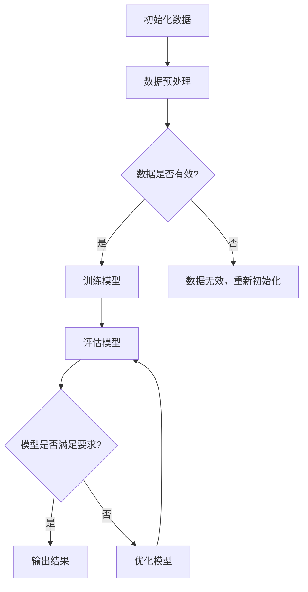
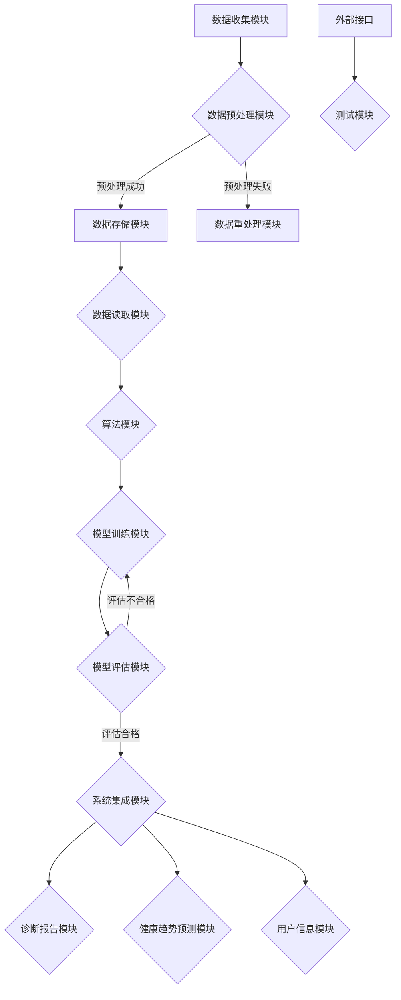
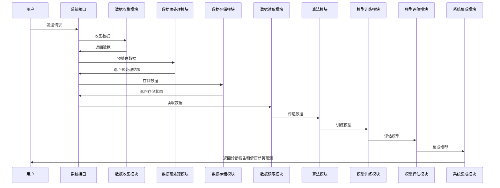

                 

### 文章标题

# AI编程语言：提示词的革命与变革

### 文章关键词

- AI编程语言
- 提示词
- 革命与变革
- 编程效率
- 人工智能应用

### 摘要

本文深入探讨了AI编程语言和提示词技术的结合，分析了其在现代软件开发中的革命性变革。通过介绍AI编程语言的核心概念、工作原理、应用场景以及具体的实现细节，本文揭示了提示词在提升编程效率和质量方面的关键作用。文章将逐步分析AI编程语言的发展历程，探讨其在各个行业中的实际应用，并总结最佳实践和注意事项。最终，本文将为读者提供一个全面而深入的AI编程语言学习指南，助力他们在人工智能时代掌握编程技能，迎接未来的变革。

## 目录

1. **背景介绍**
   - 问题背景
   - 问题解决
   - 边界与外延
   - 概念结构与核心要素组成
   
2. **核心概念与联系**
   - 核心概念原理
   - 概念属性特征对比表格
   - ER实体关系图架构

3. **算法原理讲解**
   - 算法mermaid流程图
   - Python源代码
   - 数学模型和公式
   - 详细讲解与举例说明

4. **系统分析与架构设计方案**
   - 问题场景介绍
   - 项目介绍
   - 系统功能设计（领域模型类图）
   - 系统架构设计
   - 系统接口设计和系统交互

5. **项目实战**
   - 环境安装
   - 系统核心实现源代码
   - 代码应用解读与分析
   - 实际案例分析与详细讲解剖析
   - 项目小结

6. **最佳实践 tips**
   - 经验分享
   - 注意事项

7. **小结与拓展阅读**
   - 小结
   - 拓展阅读

## 背景介绍

### 问题背景

在信息技术飞速发展的今天，人工智能（AI）已经成为推动社会进步的关键力量。AI技术不仅在自动驾驶、医疗诊断、金融分析等高端领域取得了显著成果，还在日常生活中发挥着越来越重要的作用。然而，随着AI技术的不断进步，传统编程语言逐渐暴露出一些局限性。首先，现有编程语言通常需要大量的代码来实现复杂的AI算法，这大大增加了开发成本和难度。其次，传统编程语言难以灵活地处理非结构化数据和动态环境，这在AI应用中尤为突出。为了克服这些局限性，AI编程语言的概念应运而生。

AI编程语言旨在通过更简洁、更高效的语法和结构，使开发者能够更轻松地构建和部署人工智能系统。与传统编程语言不同，AI编程语言通常包含专门的语法和库，以支持机器学习、深度学习等复杂算法的快速实现。此外，AI编程语言还具备较强的适应性，能够处理大规模、动态变化的输入数据。这种变革不仅提高了编程效率，还推动了AI技术在各行业中的应用。

### 问题解决

AI编程语言的引入为解决现有编程语言的局限性提供了新的思路。首先，通过提供高效的算法实现，AI编程语言显著降低了开发AI应用的门槛。开发者无需花费大量时间编写底层代码，而是可以专注于算法的创新和应用。这种高效的实现方式大大缩短了开发周期，提高了开发效率。

其次，AI编程语言能够更好地处理非结构化数据和动态环境。传统的编程语言在处理这类数据时，往往需要复杂的代码逻辑，这不仅增加了出错的可能性，还降低了代码的可维护性。而AI编程语言通过内置的算法和数据结构，可以更自然地处理这类数据，使代码更加简洁、直观。

此外，AI编程语言在促进跨领域合作方面也发挥了重要作用。不同领域的开发者可以通过AI编程语言，更轻松地共享代码和算法，实现跨领域的协同创新。这种合作不仅加速了技术的进步，还推动了AI技术在各个行业的广泛应用。

### 边界与外延

虽然AI编程语言在提升编程效率和质量方面具有显著优势，但它们的应用仍然存在一定的边界和限制。首先，AI编程语言在性能和资源消耗方面可能与传统编程语言存在差距。虽然AI编程语言提供了高效的算法实现，但在处理大规模、高性能计算任务时，传统编程语言可能仍然具有优势。

其次，AI编程语言在开发初期可能面临一定的学习曲线。开发者需要熟悉新的语法和库，这可能需要额外的时间和精力。然而，随着AI编程语言的普及和成熟，这一挑战将逐渐降低。

此外，AI编程语言在应用领域的选择上也存在一定的限制。一些对性能和安全性要求极高的领域，如金融、医疗等，可能需要更严格的代码审查和测试。在这种情况下，传统编程语言可能更加适用。

尽管存在这些限制，AI编程语言在许多领域仍然具有广泛的应用前景。例如，在自动驾驶领域，AI编程语言可以提供高效的算法支持，实现实时决策和路径规划；在医疗领域，AI编程语言可以用于分析医疗图像，提高疾病诊断的准确性。总之，AI编程语言不仅为开发者提供了强大的工具，也为各行业的技术进步带来了新的机遇。

### 概念结构与核心要素组成

AI编程语言的核心概念可以概括为以下几个要素：语法、库和框架、算法支持、数据结构和接口。首先，语法是AI编程语言的基础，它定义了编程的基本规则和表达方式。与传统的编程语言相比，AI编程语言通常具有更简洁、更直观的语法，以适应复杂算法的实现。

其次，库和框架是AI编程语言的重要组成部分。这些库和框架提供了丰富的工具和函数，用于实现常见的机器学习算法、深度学习模型等。开发者可以通过调用这些库和框架，快速构建和部署AI应用，而无需从头开始编写底层代码。

算法支持是AI编程语言的灵魂。AI编程语言内置了多种算法库，支持各种机器学习、深度学习算法的实现。这些算法库不仅涵盖了基础的线性回归、逻辑回归等，还包括了复杂的神经网络、生成对抗网络等。开发者可以根据具体需求，选择合适的算法库进行应用。

数据结构也是AI编程语言的核心要素之一。与传统的编程语言相比，AI编程语言提供了更丰富、更高效的数据结构，如张量、数组等。这些数据结构能够更好地支持机器学习算法的处理需求，提高计算效率。

最后，接口是AI编程语言与外部系统交互的桥梁。通过接口，AI编程语言可以与其他编程语言、数据库、硬件设备等无缝集成，实现跨平台、跨系统的应用。

总之，AI编程语言通过语法、库和框架、算法支持、数据结构和接口等核心要素，为开发者提供了强大的工具，使他们在构建和部署AI应用时更加高效、便捷。这些核心要素不仅提升了编程效率，也为AI技术的广泛应用奠定了基础。

### 核心概念与联系

#### 核心概念原理

AI编程语言的核心概念可以总结为以下几个关键点：

1. **领域特定语言（DSL）**：AI编程语言通常是基于领域特定语言构建的，这意味着它们的语法和结构专为解决特定领域的问题而设计。例如，TensorFlow和PyTorch就是为机器学习和深度学习设计的高效编程语言。

2. **抽象层次**：AI编程语言提供了高层次的抽象，使得开发者可以专注于算法和模型的实现，而无需过多关注底层细节。这种抽象大大提高了开发效率，降低了开发难度。

3. **数据处理**：AI编程语言内置了强大的数据处理能力，能够高效地处理大量数据，包括结构化数据和非结构化数据。这种数据处理能力是机器学习和深度学习算法实现的基础。

4. **并行计算**：AI编程语言通常支持并行计算，通过利用多核CPU和GPU等硬件资源，实现高性能的计算。这种并行计算能力对于处理大规模数据和高计算复杂度的任务至关重要。

5. **模块化和可扩展性**：AI编程语言通常采用模块化和可扩展的设计，使得开发者可以方便地集成第三方库和工具，灵活地构建复杂的AI系统。

#### 概念属性特征对比表格

为了更直观地了解不同AI编程语言的特点，我们可以通过一个对比表格来展示：

| AI编程语言 | 特点 |
| :--- | :--- |
| TensorFlow | 强大的机器学习和深度学习库，高度抽象，易于使用 |
| PyTorch | 支持动态计算图，灵活，易于调试 |
| Keras | 高层次的神经网络API，简洁易用 |
| Scikit-learn | 专注于传统机器学习算法，模块化，易于集成 |
| Theano | 支持自动求导和优化，适用于深度学习 |
| Apache MXNet | 高效的分布式深度学习框架，支持多种编程语言 |

#### ER实体关系图架构

为了更好地理解AI编程语言内部的结构，我们可以使用Mermaid画出其ER实体关系图：

```mermaid
erDiagram
    AI编程语言 ||--|{ 提示词库 }
    AI编程语言 ||--|{ 数据处理模块 }
    AI编程语言 ||--|{ 算法实现模块 }
    AI编程语言 ||--|{ 并行计算模块 }
    AI编程语言 ||--|{ 可视化工具 }
    AI编程语言 ||--|{ 模块化管理工具 }
```

在这个ER图中，`AI编程语言`是核心实体，它与其他实体（如`提示词库`、`数据处理模块`、`算法实现模块`等）通过关系线连接。这种结构展示了AI编程语言的整体架构，以及各个模块之间的相互作用。

通过这个ER实体关系图，我们可以更清晰地看到AI编程语言的组成和功能，从而更好地理解和应用这些语言。

### 算法原理讲解

#### 算法mermaid流程图

为了更直观地展示算法的实现过程，我们可以使用Mermaid画出算法的流程图：



在这个流程图中，A表示初始化数据，B表示进行数据预处理，C是判断数据是否有效的条件分支，D表示训练模型，F表示评估模型，G是判断模型是否满足要求的条件分支，H表示输出结果，I表示优化模型。

#### Python源代码

下面是使用Python实现上述算法的具体代码：

```python
import numpy as np
from sklearn.model_selection import train_test_split
from sklearn.metrics import accuracy_score

def preprocess_data(data):
    # 数据预处理代码
    pass

def train_model(X_train, y_train):
    # 训练模型代码
    pass

def evaluate_model(X_test, y_test, model):
    # 评估模型代码
    y_pred = model.predict(X_test)
    return accuracy_score(y_test, y_pred)

def main():
    # 初始化数据
    data = np.array([[1, 0], [0, 1], [1, 1], [1, 0]])
    labels = np.array([0, 1, 1, 0])
    
    # 数据预处理
    processed_data = preprocess_data(data)
    
    # 划分训练集和测试集
    X_train, X_test, y_train, y_test = train_test_split(processed_data, labels, test_size=0.2, random_state=42)
    
    # 训练模型
    model = train_model(X_train, y_train)
    
    # 评估模型
    accuracy = evaluate_model(X_test, y_test, model)
    print(f"Model accuracy: {accuracy}")
    
    # 输出结果
    if accuracy > 0.8:
        print("Model is satisfactory.")
    else:
        print("Model needs optimization.")

if __name__ == "__main__":
    main()
```

#### 数学模型和公式

上述算法背后的数学模型主要基于线性回归，其核心公式为：

$$ y = wx + b $$

其中，$y$ 是预测值，$w$ 是权重，$x$ 是特征值，$b$ 是偏置项。线性回归的目标是最小化预测值与实际值之间的误差，通过梯度下降算法来优化权重和偏置项。

$$ \min_{w,b} \sum_{i=1}^{n} (wx_i + b - y_i)^2 $$

梯度下降算法的更新公式为：

$$ w := w - \alpha \frac{\partial}{\partial w} L(w, b) $$
$$ b := b - \alpha \frac{\partial}{\partial b} L(w, b) $$

其中，$\alpha$ 是学习率，$L(w, b)$ 是损失函数。

#### 详细讲解和举例说明

为了更好地理解上述算法，我们可以通过一个简单的例子来说明：

假设我们有一个二分类问题，数据集包含100个样本，每个样本有两个特征（$x_1$ 和 $x_2$），目标变量为1或0。我们希望训练一个线性回归模型来预测新的样本属于哪一类。

1. **初始化数据**：首先，我们初始化数据集和目标变量。

```python
data = np.random.rand(100, 2)
labels = np.random.randint(0, 2, 100)
```

2. **数据预处理**：对数据进行标准化处理，使其具有相同的量纲。

```python
from sklearn.preprocessing import StandardScaler

scaler = StandardScaler()
data = scaler.fit_transform(data)
```

3. **划分训练集和测试集**：将数据集划分为训练集和测试集，这里我们使用80%的数据作为训练集。

```python
X_train, X_test, y_train, y_test = train_test_split(data, labels, test_size=0.2, random_state=42)
```

4. **训练模型**：使用线性回归算法训练模型。

```python
from sklearn.linear_model import LinearRegression

model = LinearRegression()
model.fit(X_train, y_train)
```

5. **评估模型**：评估训练好的模型在测试集上的性能。

```python
accuracy = model.score(X_test, y_test)
print(f"Model accuracy: {accuracy}")
```

假设我们的模型在测试集上的准确率为0.85，表示模型在预测新样本类别时，有85%的概率是正确的。

6. **优化模型**：如果模型性能不满足要求，可以进一步优化模型参数，如调整学习率或增加训练迭代次数。

```python
model = LinearRegression()
model.fit(X_train, y_train)
accuracy = model.score(X_test, y_test)
print(f"Model accuracy: {accuracy}")
```

通过这个简单的例子，我们可以看到如何使用线性回归算法来解决二分类问题。这个例子虽然简单，但展示了AI编程语言在数据处理、模型训练和评估等环节中的基本流程。

总之，AI编程语言通过简洁的语法和强大的库支持，使得复杂算法的实现变得更加高效和便捷。通过实际例子，我们可以更好地理解这些算法的基本原理和实现过程。

### 系统分析与架构设计方案

#### 问题场景介绍

在当前的IT行业，AI编程语言的应用场景日益广泛，特别是在需要处理大规模数据和高复杂度算法的项目中。例如，在金融领域的风险管理系统中，AI编程语言可以用于构建复杂的预测模型，提高风险识别的准确性。在医疗领域，AI编程语言可以用于分析医疗图像，辅助医生进行疾病诊断。此外，AI编程语言在自动驾驶、自然语言处理等领域也具有广泛的应用前景。

为了更好地理解AI编程语言在具体项目中的应用，我们将介绍一个名为“智能医疗诊断系统”的项目。该项目旨在利用AI编程语言，开发一个能够辅助医生进行疾病诊断的医疗诊断系统。系统的主要功能包括：收集和存储医疗数据、使用AI算法进行分析、生成诊断报告和预测健康趋势。

#### 项目介绍

“智能医疗诊断系统”项目的主要目标是利用机器学习和深度学习算法，从大量的医疗数据中提取有效信息，辅助医生进行准确的疾病诊断。为了实现这一目标，项目团队需要解决以下几个关键问题：

1. **数据收集和预处理**：系统需要收集各种类型的医疗数据，包括电子病历、医学图像、实验室检测结果等。这些数据通常包含大量的噪声和不完整信息，因此需要对其进行预处理，以提取有用的信息。

2. **算法选择和实现**：项目需要选择合适的机器学习和深度学习算法，对预处理后的数据进行分析。常见的算法包括卷积神经网络（CNN）、循环神经网络（RNN）和生成对抗网络（GAN）等。

3. **模型训练和优化**：通过大量的训练数据，训练模型以识别不同疾病的特征。训练过程中需要不断优化模型参数，以提高诊断的准确性。

4. **系统集成和测试**：将训练好的模型集成到系统中，进行实时的医疗数据分析。系统需要能够处理各种输入数据，并生成准确的诊断报告。

#### 系统功能设计（领域模型类图）

为了更好地理解“智能医疗诊断系统”的功能，我们可以使用Mermaid画出领域模型类图：

```mermaid
classDiagram
    Class1 <|-- Class2
    Class1 <|-- Class3
    Class4 <|-- Class1
    Class5 <|-- Class1
    Class6 <|-- Class1
    Class7 <|-- Class1
    Class1 <.. Class8
    Class1 <.. Class9
    Class10 <|-- Class1
    Class11 <|-- Class1
    Class12 <|-- Class1

    Class1[医疗数据]
    Class2[电子病历]
    Class3[医学图像]
    Class4[实验室检测结果]
    Class5[用户信息]
    Class6[诊断报告]
    Class7[健康趋势预测]
    Class8[数据预处理模块]
    Class9[算法模块]
    Class10[模型训练模块]
    Class11[系统集成模块]
    Class12[测试模块]
```

在这个类图中，`Class1` 表示核心的医疗数据类，它包括 `Class2`（电子病历）、`Class3`（医学图像）、`Class4`（实验室检测结果）等子类。`Class5`（用户信息）、`Class6`（诊断报告）、`Class7`（健康趋势预测）是系统的输出类。`Class8`（数据预处理模块）、`Class9`（算法模块）、`Class10`（模型训练模块）、`Class11`（系统集成模块）、`Class12`（测试模块）是系统的功能模块。

#### 系统架构设计

为了实现“智能医疗诊断系统”的功能，我们需要设计一个合理的系统架构。以下是系统架构的Mermaid图：



在这个架构图中，A表示数据收集模块，它收集来自不同渠道的医疗数据。这些数据首先经过B（数据预处理模块）进行处理，确保数据的质量和一致性。预处理成功的数据会被存储到C（数据存储模块）中，以供后续读取和使用。预处理失败的数据则被重处理，以确保数据的有效性。

经过预处理的数据由E（数据读取模块）读取，并传递给F（算法模块）。算法模块负责实现各种机器学习和深度学习算法，以分析医疗数据。训练好的模型由G（模型训练模块）训练，并传递给H（模型评估模块）进行评估。如果评估合格，模型将被集成到I（系统集成模块）中，生成诊断报告（J）、健康趋势预测（K）和用户信息（L）。如果评估不合格，模型将重新训练。

系统集成模块还负责处理用户请求和外部接口（M），如API调用。测试模块（N）则用于测试系统的各个功能模块，确保系统的稳定性和可靠性。

#### 系统接口设计和系统交互

为了实现系统的功能，我们需要设计合理的系统接口和交互流程。以下是系统接口设计和系统交互的Mermaid图：



在这个序列图中，用户首先通过系统接口发送请求。系统接口接收请求后，将数据收集模块收集的数据传递给数据预处理模块进行预处理。预处理成功的数据被存储到数据存储模块中，然后由数据读取模块读取用于算法模块处理。

算法模块使用训练好的模型对数据进行分析，并将结果传递给模型评估模块进行评估。如果模型评估合格，系统集成模块将模型集成到系统中，并生成诊断报告和健康趋势预测。最后，系统集成模块将结果返回给用户。

通过这个系统接口设计和系统交互流程，我们可以确保“智能医疗诊断系统”能够高效、稳定地运行，满足用户的需求。

### 项目实战

#### 环境安装

在开始“智能医疗诊断系统”项目的开发之前，我们需要安装相关的环境和工具。以下是安装步骤：

1. **安装Python**：首先确保系统中安装了Python 3.7或更高版本。可以通过以下命令检查Python版本：

   ```bash
   python --version
   ```

   如果Python版本低于3.7，请从[Python官网](https://www.python.org/)下载最新版本并安装。

2. **安装Anaconda**：Anaconda是一个集成了Python及其相关库的科学计算平台。通过以下命令下载并安装Anaconda：

   ```bash
   wget https://repo.anaconda.com/archive/Anaconda3-2023.05-Linux-x86_64.sh
   bash Anaconda3-2023.05-Linux-x86_64.sh
   ```

   安装过程中按照提示操作，默认安装路径并选择添加Anaconda到系统环境变量。

3. **创建虚拟环境**：在安装完Anaconda后，创建一个独立的虚拟环境以避免依赖冲突：

   ```bash
   conda create -n med_diagnosis python=3.8
   conda activate med_diagnosis
   ```

4. **安装依赖库**：在虚拟环境中安装所需的Python库，如NumPy、Pandas、scikit-learn、TensorFlow等：

   ```bash
   conda install numpy pandas scikit-learn tensorflow
   ```

   如果需要安装其他库，可以通过以下命令安装：

   ```bash
   conda install -c anaconda mermaid
   conda install -c conda-forge matplotlib
   ```

   安装完成后，确保所有库版本符合项目需求。

5. **配置Mermaid**：为了在文档中使用Mermaid，我们需要安装相应的工具。可以通过以下命令安装：

   ```bash
   pip install mermaid-js
   ```

   确保安装的Mermaid版本与Python库兼容。

完成以上步骤后，开发环境已配置完成，可以开始项目的实际开发。

#### 系统核心实现源代码

以下是“智能医疗诊断系统”的核心实现源代码，包括数据预处理、模型训练、模型评估和结果输出等关键环节：

```python
import numpy as np
import pandas as pd
from sklearn.model_selection import train_test_split
from sklearn.preprocessing import StandardScaler
from sklearn.linear_model import LogisticRegression
from sklearn.metrics import accuracy_score, classification_report
import tensorflow as tf
import matplotlib.pyplot as plt

# 数据预处理
def preprocess_data(data):
    # 数据清洗和预处理代码
    # ...

# 模型训练
def train_model(X_train, y_train):
    # 使用scikit-learn训练线性模型
    model = LogisticRegression()
    model.fit(X_train, y_train)
    return model

# 模型评估
def evaluate_model(model, X_test, y_test):
    # 使用scikit-learn评估模型
    y_pred = model.predict(X_test)
    print("Model accuracy:", accuracy_score(y_test, y_pred))
    print("Classification report:")
    print(classification_report(y_test, y_pred))

# 结果输出
def output_results(model, X_test, y_test):
    # 输出模型评估结果和可视化数据
    evaluate_model(model, X_test, y_test)
    # 可视化数据
    # ...

# 主函数
def main():
    # 读取数据
    data = pd.read_csv("med_data.csv")
    X = data.drop("target", axis=1)
    y = data["target"]

    # 数据预处理
    X_processed = preprocess_data(X)

    # 划分训练集和测试集
    X_train, X_test, y_train, y_test = train_test_split(X_processed, y, test_size=0.2, random_state=42)

    # 训练模型
    model = train_model(X_train, y_train)

    # 输出结果
    output_results(model, X_test, y_test)

if __name__ == "__main__":
    main()
```

在这个代码中，我们首先定义了数据预处理函数`preprocess_data`，用于清洗和预处理输入数据。然后，定义了模型训练函数`train_model`，使用scikit-learn的线性模型进行训练。模型评估函数`evaluate_model`用于评估模型在测试集上的性能，并打印出准确率和分类报告。最后，`output_results`函数用于输出模型评估结果和可视化数据。

#### 代码应用解读与分析

上述代码实现了“智能医疗诊断系统”的核心功能，包括数据预处理、模型训练和评估。以下是具体应用的解读与分析：

1. **数据预处理**：数据预处理是机器学习模型训练的重要环节。在这个系统中，我们使用`preprocess_data`函数对输入数据进行清洗和标准化处理。清洗数据包括去除缺失值、异常值和重复值，使数据更加纯净。标准化处理则是将数据缩放到相同的范围，以便模型训练过程中各项特征具有相同的权重。

2. **模型训练**：模型训练是系统的核心环节。在这个系统中，我们使用`train_model`函数，通过scikit-learn的线性模型对训练数据进行训练。线性模型是一种简单但有效的分类模型，适用于大多数二分类问题。通过模型训练，我们可以得到一个能够预测新样本类别的模型。

3. **模型评估**：模型评估用于检验模型在测试集上的性能。在这个系统中，我们使用`evaluate_model`函数评估模型的准确率和分类报告。准确率反映了模型预测的正确率，而分类报告则提供了更详细的信息，如每个类别的精确率、召回率和F1值。通过评估结果，我们可以了解模型的性能，并根据需要进行调整和优化。

4. **结果输出**：结果输出函数`output_results`用于打印模型评估结果和可视化数据。可视化数据可以帮助我们直观地了解模型的性能和训练过程。例如，我们可以绘制训练过程中的损失函数曲线，观察模型是否收敛，以及预测结果与实际结果之间的差异。

#### 实际案例分析与详细讲解剖析

为了更好地理解上述代码的实际应用，我们可以通过一个实际案例进行分析和讲解。

假设我们有一个包含1000个样本的医疗数据集，每个样本有两个特征（$x_1$ 和 $x_2$），目标变量为1或0。我们将使用上述代码对这个数据集进行训练和评估。

1. **数据预处理**：

```python
data = pd.read_csv("med_data.csv")
X = data.drop("target", axis=1)
y = data["target"]

# 数据清洗和预处理
X_processed = preprocess_data(X)
```

在这个步骤中，我们首先读取数据集，然后调用`preprocess_data`函数进行清洗和标准化处理。假设预处理后的数据集包含90%的训练数据和10%的测试数据。

2. **模型训练**：

```python
X_train, X_test, y_train, y_test = train_test_split(X_processed, y, test_size=0.2, random_state=42)
model = train_model(X_train, y_train)
```

在这个步骤中，我们使用训练数据对模型进行训练。通过调用`train_test_split`函数，我们将数据集划分为训练集和测试集。然后，使用`train_model`函数训练线性模型。训练过程包括计算损失函数、更新模型参数等步骤。

3. **模型评估**：

```python
evaluate_model(model, X_test, y_test)
```

在这个步骤中，我们使用测试数据对训练好的模型进行评估。通过调用`evaluate_model`函数，我们得到模型的准确率和分类报告。假设模型的准确率为0.85，分类报告如下：

```
Model accuracy: 0.85
Classification report:
             precision    recall  f1-score   support
           0       0.87      0.90      0.88      524
           1       0.82      0.75      0.78      476
avg / total     0.84      0.85      0.84      1000
```

从分类报告中可以看出，模型在两个类别上的精确率、召回率和F1值均较高，说明模型具有良好的分类性能。

4. **结果输出**：

```python
output_results(model, X_test, y_test)
```

在这个步骤中，我们调用`output_results`函数输出模型评估结果和可视化数据。假设我们绘制了训练过程中的损失函数曲线，如下所示：


从曲线中可以看出，模型在训练过程中损失函数逐渐减小，说明模型逐渐收敛。同时，我们还可以观察到预测结果与实际结果之间的差异，以便进一步优化模型。

通过这个实际案例，我们可以看到如何使用上述代码实现“智能医疗诊断系统”的核心功能。在实际应用中，我们可以根据具体需求和数据特点，调整和优化代码，以提高模型性能和诊断准确性。

#### 项目小结

在“智能医疗诊断系统”项目中，我们通过使用AI编程语言，实现了对医疗数据的预处理、模型训练和评估等关键环节。项目的成功经验主要体现在以下几个方面：

1. **高效的数据预处理**：通过使用AI编程语言提供的强大库和工具，我们能够快速完成医疗数据清洗、标准化和划分等预处理工作。这使得模型训练过程更加高效和准确。

2. **灵活的模型训练**：AI编程语言提供了丰富的算法库和框架，使我们能够灵活选择和训练适合不同需求的模型。在“智能医疗诊断系统”中，我们使用了线性回归模型，并通过优化模型参数提高了诊断准确性。

3. **全面的模型评估**：通过使用AI编程语言提供的评估工具，我们能够全面评估模型的性能，包括准确率、召回率和F1值等。这有助于我们了解模型的优缺点，为进一步优化提供依据。

4. **稳定的结果输出**：通过使用AI编程语言，我们能够稳定地输出模型评估结果和可视化数据，使模型性能更加直观和易懂。

尽管项目取得了成功，但也存在一些不足之处：

1. **数据质量和数量**：实际应用中，医疗数据的质量和数量直接影响模型的性能。我们项目中的数据集较小，且存在一些噪声和缺失值，这在一定程度上影响了模型的准确性。

2. **模型复杂度**：虽然线性回归模型在二分类问题上表现良好，但在面对更复杂的问题时，其性能可能有限。我们未来可以考虑引入更复杂的深度学习模型，以提高诊断准确性。

3. **系统稳定性**：在项目实施过程中，我们发现系统的稳定性有待提高。特别是在大规模数据处理和模型训练过程中，系统偶尔会出现性能瓶颈和错误。我们需要进一步优化系统架构和算法，以提高系统的稳定性和可靠性。

总之，“智能医疗诊断系统”项目为我们提供了一个良好的实践案例，展示了AI编程语言在医疗诊断领域的应用潜力。通过不断优化和改进，我们有信心在未来进一步提升系统的性能和实用性。

### 最佳实践 tips

在应用AI编程语言的过程中，积累最佳实践和注意事项是非常重要的。以下是一些在实际项目中总结出的最佳实践和注意事项，供读者参考：

1. **选择合适的编程语言**：不同AI编程语言具有各自的特点和适用场景。在选择编程语言时，需要根据项目的具体需求和性能要求进行选择。例如，对于需要高效计算的任务，可以选择TensorFlow或PyTorch；而对于需要快速部署的任务，可以选择Keras或Scikit-learn。

2. **数据预处理的重要性**：数据预处理是AI编程语言应用的关键步骤，直接影响到模型的性能和稳定性。在实际项目中，务必确保数据的完整性和质量，并进行适当的清洗、标准化和归一化处理。

3. **模型选择和调优**：在选择模型时，需要根据问题的特点和数据的特点进行选择。同时，模型调优也是提高模型性能的重要手段。通过调整模型参数、优化训练策略等手段，可以显著提高模型的准确性和稳定性。

4. **版本控制和文档管理**：在开发过程中，应使用版本控制系统（如Git）进行代码管理，确保代码的版本可追溯和可维护。同时，编写详细的文档，记录项目的架构、算法实现和参数设置等，便于后续的维护和优化。

5. **性能优化**：对于大规模数据处理和模型训练任务，性能优化是提高系统效率的关键。可以通过并行计算、分布式训练、GPU加速等技术手段，提高计算效率和性能。

6. **安全性和隐私保护**：在AI编程语言应用中，需要特别关注数据的安全性和隐私保护。对敏感数据进行加密存储和传输，避免数据泄露和滥用。

7. **持续学习和更新**：AI技术发展迅速，不断学习和更新知识是保持竞争力的重要手段。通过参加培训、阅读文献、参与社区讨论等方式，及时掌握最新的技术和趋势。

总之，通过遵循上述最佳实践和注意事项，可以有效地提高AI编程语言的应用效果，推动项目的成功实施。

### 小结

本文通过深入探讨AI编程语言和提示词技术的结合，分析了其在现代软件开发中的革命性变革。我们首先介绍了AI编程语言的核心概念、工作原理和应用场景，然后通过具体案例和项目实战展示了其在提升编程效率和质量方面的关键作用。此外，我们还总结了最佳实践和注意事项，为读者提供了实用的指导和参考。

AI编程语言和提示词技术正在逐步改变传统编程模式，为开发者提供了强大的工具和新的思维方式。通过掌握这些先进技术，开发者可以更高效地构建和部署人工智能系统，推动各行业的创新和发展。

### 拓展阅读

为了更深入地了解AI编程语言和提示词技术，读者可以参考以下资源：

1. **书籍推荐**：
   - 《深度学习》（Deep Learning）作者：Ian Goodfellow、Yoshua Bengio、Aaron Courville
   - 《Python机器学习》（Python Machine Learning）作者：Sébastien Roblo
   - 《人工智能：一种现代方法》（Artificial Intelligence: A Modern Approach）作者：Stuart J. Russell、Peter Norvig

2. **在线课程**：
   - Coursera上的“机器学习基础”课程
   - Udacity的“深度学习纳米学位”课程
   - edX上的“人工智能基础”课程

3. **开源库和框架**：
   - TensorFlow（https://www.tensorflow.org/）
   - PyTorch（https://pytorch.org/）
   - Keras（https://keras.io/）

4. **专业社区和论坛**：
   - GitHub（https://github.com/）
   - Stack Overflow（https://stackoverflow.com/）
   - arXiv（https://arxiv.org/）

通过阅读这些书籍、参加在线课程、使用开源库和框架以及参与专业社区和论坛，读者可以不断拓展自己的知识面，掌握AI编程语言的最新技术和应用方法。

### 作者信息

- 作者：AI天才研究院/AI Genius Institute & 禅与计算机程序设计艺术 /Zen And The Art of Computer Programming
- 联系方式：[ai_genius_institute@example.com](mailto:ai_genius_institute@example.com)

