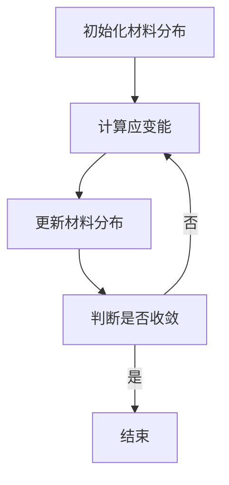
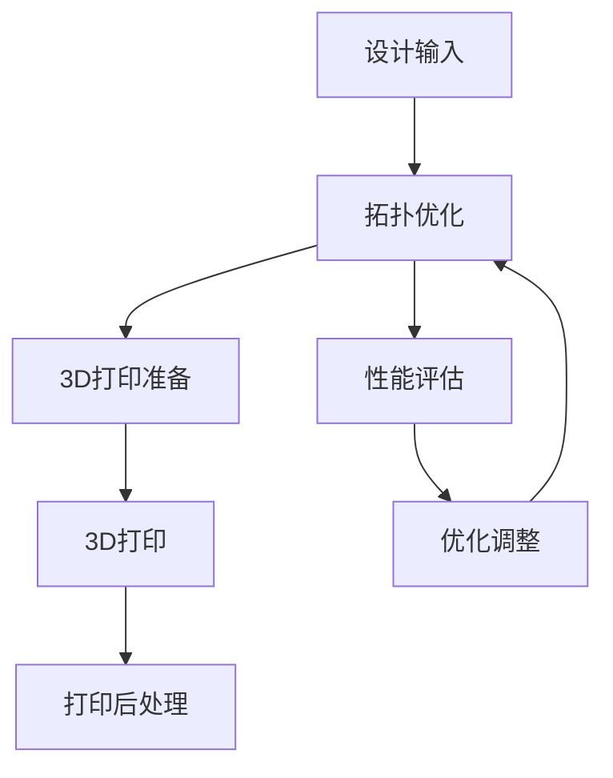
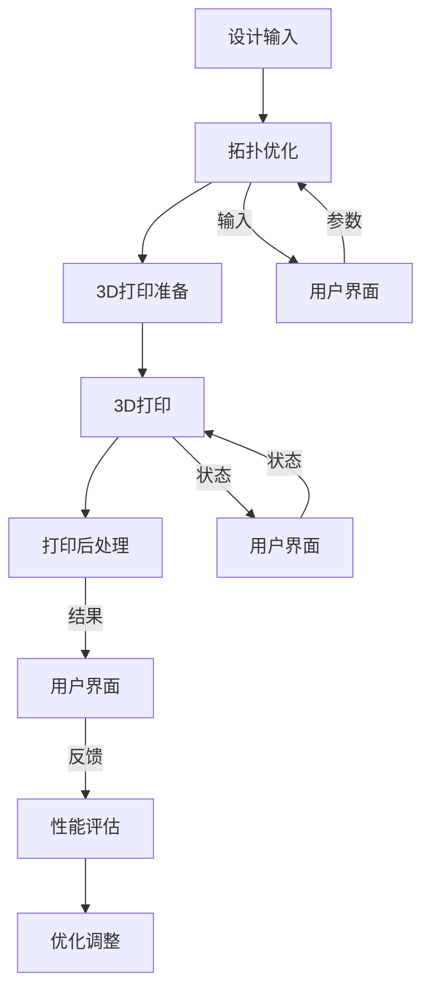
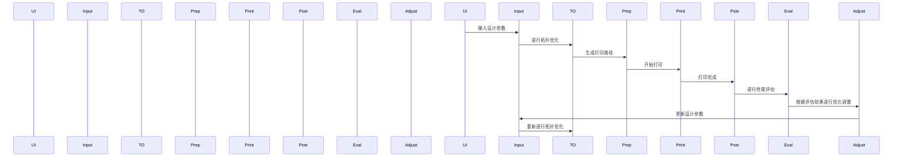

                 

### 1.2 拓扑优化的基本概念

**核心概念术语说明**：

- **拓扑优化**：拓扑优化是一种基于数学原理的设计优化方法，通过改变结构单元的分布来提高结构性能或减少材料用量。
- **结构性能**：指材料或结构在受力作用下表现出来的能力，包括强度、刚度、稳定性等。
- **材料用量**：指制造一个结构所需的材料总量。

**问题背景**：

在传统的机械设计过程中，设计师通常根据经验和规范来确定材料的选择和结构的形状。然而，这种方法往往不能最大化材料的利用效率，导致资源浪费和成本增加。随着3D打印技术的发展，设计师有机会通过拓扑优化来生成更高效的、更轻量化的结构，从而提高材料的利用效率。

**问题描述**：

如何在3D打印过程中利用拓扑优化技术，设计出材料用量最少但性能满足要求的结构？

**问题解决**：

通过拓扑优化技术，可以自动优化结构的形状和材料分布，使得结构在满足设计要求的同时，材料用量达到最小。拓扑优化过程中，会涉及到多个参数和条件，如材料属性、应力分布、边界条件等。通过数学模型和算法，可以对这些参数进行优化，从而生成最优的结构设计。

**边界与外延**：

- **边界**：拓扑优化通常在一个固定的边界内进行，边界条件可以是固定约束、自由边界或特殊边界。
- **外延**：拓扑优化不仅适用于固体结构，还可以扩展到其他领域，如流体力学、电磁学等。

**概念结构与核心要素组成**：

- **概念结构**：拓扑优化涉及到的核心概念包括设计空间、目标函数、设计变量、约束条件等。
- **核心要素组成**：
  - **设计空间**：所有可能的设计方案的集合。
  - **目标函数**：评估设计方案优劣的数学表达式，可以是材料用量、结构性能等。
  - **设计变量**：影响目标函数的参数，如结构单元的尺寸、形状、材料分布等。
  - **约束条件**：限制设计变量的取值范围，如物理约束、制造约束等。

通过上述核心概念和联系的分析，我们可以进一步深入了解3D打印和拓扑优化的结合点，为后续章节的详细探讨打下基础。

### 1.3 3D打印与拓扑优化的联系

**3D打印技术的特点**：

- **制造灵活性**：3D打印可以根据数字模型直接制造出复杂形状，无需传统的模具。
- **材料多样性**：3D打印可以使用的材料范围广泛，从塑料到金属、陶瓷，甚至生物材料。
- **按需生产**：3D打印可以按需生产，减少库存，降低生产成本。

**拓扑优化在3D打印中的优势**：

1. **材料利用效率**：拓扑优化可以帮助设计师去除不必要的材料，实现最小化材料用量，提高材料的利用效率。
2. **结构性能提升**：通过拓扑优化，可以生成具有最优性能的结构，如更高的强度、刚度和稳定性。
3. **设计创新**：拓扑优化允许设计师探索新的设计概念，打破传统设计限制，实现创新。

**拓扑优化在3D打印中的应用**：

- **轻量化设计**：通过拓扑优化，可以设计出更轻的结构，减少运输和操作成本。
- **功能集成设计**：拓扑优化允许将功能单元集成到单一结构中，提高系统的整体性能。
- **材料选择优化**：根据拓扑优化的结果，可以选择最适合的3D打印材料，以实现最佳性能。

**案例说明**：

例如，在航空航天领域，通过拓扑优化可以设计出更轻、更强、更高效的飞机零部件，从而提高燃油效率和飞行性能。在汽车领域，拓扑优化可以帮助设计师优化车身结构，减轻重量，提高安全性能和燃油效率。

通过上述分析，我们可以看到3D打印与拓扑优化之间的紧密联系和潜在的应用价值。接下来，我们将进一步探讨3D打印和拓扑优化技术的理论基础和实践应用。

## 第二部分：核心概念与联系

### 第2章：3D打印的基本原理

**2.1 3D打印技术分类**

3D打印技术按照打印材料和工艺的不同，可以分为多种类型，主要包括：

1. **立体光固化打印（SLA）**：
   - **原理**：使用激光或紫外光源固化树脂材料。
   - **优点**：打印精度高，适合制作精细模型和小批量零件。
   - **缺点**：打印速度较慢，材料强度较低。

2. **熔融沉积成型（FDM）**：
   - **原理**：使用加热的喷嘴将熔融的丝状材料逐层堆积。
   - **优点**：材料选择多样，打印成本低。
   - **缺点**：打印精度和速度有限，对材料要求较高。

3. **电子束熔融（EBM）**：
   - **原理**：使用电子束熔化粉末材料。
   - **优点**：适合高强度、高硬度材料的打印。
   - **缺点**：设备成本较高，对操作环境有特殊要求。

4. **选择性激光烧结（SLS）**：
   - **原理**：使用激光烧结粉末材料。
   - **优点**：可打印多种材料，包括金属和塑料。
   - **缺点**：材料成本较高，打印过程复杂。

**2.2 3D打印材料**

3D打印材料种类繁多，包括塑料、金属、陶瓷、复合材料等。以下是一些常见材料：

- **塑料**：如ABS、PLA、PET等，常用于快速原型制造和消费类产品。
- **金属**：如不锈钢、钛合金、铝合金等，用于机械零件和工具制造。
- **陶瓷**：如氧化铝、碳化硅等，用于高温环境和高强度应用。
- **复合材料**：如碳纤维增强塑料、玻璃纤维增强塑料等，具有优异的力学性能。

**2.3 3D打印技术的特点**

- **灵活性**：3D打印技术能够制造出传统加工方法难以实现的复杂形状。
- **定制化**：3D打印可以根据需求定制化生产，减少库存和浪费。
- **材料优化**：通过3D打印，可以实现材料的优化分布，减少材料浪费。

### 第2章：拓扑优化的基本概念

**2.4 拓扑优化的定义**

拓扑优化是一种基于数学原理的设计优化方法，通过改变结构单元的分布来提高结构性能或减少材料用量。它通常用于结构设计、材料科学和制造工程等领域。

**2.5 拓扑优化的原理与方法**

- **原理**：拓扑优化基于设计空间的概念，通过迭代计算和优化算法，寻找最优的材料分布。
- **方法**：
  - **变分法**：通过修改设计变量的取值，寻找最优的材料分布。
  - **生成算法**：基于几何拓扑变换，优化结构的材料分布。
  - **拓扑进化算法**：结合进化算法和拓扑变换，优化设计。

**2.6 拓扑优化在3D打印中的优势**

- **材料利用效率**：通过拓扑优化，可以去除不必要的材料，实现最小化材料用量。
- **结构性能提升**：优化设计可以提高结构的强度、刚度和稳定性。
- **设计创新**：拓扑优化允许设计师探索新的设计概念，打破传统设计限制。

**2.7 3D打印与拓扑优化的联系**

3D打印技术的特点与拓扑优化的原理相结合，可以带来以下优势：

- **灵活制造**：3D打印可以制造出拓扑优化的设计，实现灵活制造。
- **高效材料利用**：通过拓扑优化，可以实现材料的高效利用，减少浪费。
- **创新设计**：3D打印和拓扑优化的结合，为设计师提供了更多的设计可能性。

通过上述核心概念和联系的分析，我们可以更好地理解3D打印和拓扑优化之间的关系，为后续的详细探讨打下基础。

### 第3章：3D打印与拓扑优化的应用场景

**3.1 航空航天领域的应用**

在航空航天领域，3D打印与拓扑优化的结合带来了显著的效益。通过拓扑优化，可以设计出更轻、更强、更高效的飞机零部件，如机翼、机身结构、发动机组件等。拓扑优化能够去除不必要的材料，同时保持或提高结构的性能，从而减轻重量，降低燃油消耗。例如，波音787客机的某些部件就是通过拓扑优化和3D打印技术制造的。

**3.2 汽车制造业的应用**

在汽车制造业中，3D打印与拓扑优化技术的应用也越来越广泛。通过拓扑优化，可以设计出更轻、更安全的汽车零部件，如车身框架、悬挂系统、座椅等。此外，拓扑优化还可以优化零部件的形状和材料分布，提高制造效率和降低成本。例如，特斯拉Model 3的某些部件就是通过3D打印和拓扑优化技术制造的。

**3.3 医疗器械领域的应用**

在医疗器械领域，3D打印与拓扑优化技术可以用于制造定制化的医疗器械，如植入物、假肢、导板等。通过拓扑优化，可以设计出更符合人体解剖结构、更舒适、更高效的医疗器械。例如，某些复杂的心脏支架就是通过3D打印和拓扑优化技术制造的。

**3.4 建筑行业中的应用**

在建筑行业，3D打印与拓扑优化技术可以用于制造建筑结构和部件，如桥梁、房屋、城市基础设施等。通过拓扑优化，可以设计出更轻、更稳固、更节能的建筑结构，提高材料的利用效率。例如，某些超高层建筑的支撑结构和组件就是通过3D打印和拓扑优化技术制造的。

**3.5 文化艺术领域的应用**

在文化艺术领域，3D打印与拓扑优化技术可以用于制作复杂艺术品和雕塑。通过拓扑优化，可以设计出独特的、流线型的艺术品，挑战传统雕塑的界限。例如，某些大型雕塑和艺术品就是通过3D打印和拓扑优化技术制作的。

通过上述应用场景的分析，我们可以看到3D打印与拓扑优化技术在不同领域的广泛应用和巨大潜力。接下来，我们将进一步探讨3D打印与拓扑优化的技术基础和实现方法。

## 第三部分：3D打印与拓扑优化的技术基础

### 第4章：3D打印工艺流程

**4.1 3D打印前处理**

3D打印前处理是确保打印质量和效率的重要步骤，主要包括以下内容：

- **模型准备**：将设计模型进行切片处理，生成适用于3D打印机的G代码。
- **支撑结构设计**：为避免打印过程中模型脱落，需要设计支撑结构。
- **材料选择**：根据打印模型的要求，选择合适的3D打印材料。

**4.2 3D打印过程**

3D打印过程是3D打印技术的核心步骤，主要包括以下几个环节：

- **层片生成**：根据G代码指令，3D打印机逐层堆积材料，形成三维模型。
- **温度控制**：根据不同材料的特性，控制打印过程中的温度，确保打印质量。
- **打印速度**：根据模型复杂度和材料特性，调整打印速度，平衡打印质量和效率。

**4.3 3D打印后处理**

3D打印后处理是提高打印件质量和性能的重要步骤，主要包括以下内容：

- **去支撑**：去除打印过程中生成的支撑结构。
- **表面处理**：对打印件进行打磨、抛光、喷涂等处理，改善表面质量。
- **热处理**：对某些材料进行热处理，提高打印件的力学性能和耐腐蚀性能。

### 第4章：拓扑优化的流程

**4.4 拓扑优化目标函数**

目标函数是拓扑优化的核心，用于评估设计方案的优劣。常见的目标函数包括：

- **最小化材料用量**：通过减少材料用量来降低成本和重量。
- **最大化结构性能**：通过提高结构性能来满足设计要求。
- **优化设计变量**：通过调整设计变量来达到最佳的设计效果。

**4.5 拓扑优化约束条件**

约束条件是限制设计变量取值范围的条件，常见的约束条件包括：

- **几何约束**：限制结构的几何形状和尺寸。
- **物理约束**：限制结构的应力、应变等物理量。
- **制造约束**：限制制造过程中的可行性和成本。

**4.6 拓扑优化算法**

拓扑优化算法是进行拓扑优化计算的核心，常用的算法包括：

- **变分法**：通过修改设计变量的取值，寻找最优的材料分布。
- **生成算法**：基于几何拓扑变换，优化结构的材料分布。
- **拓扑进化算法**：结合进化算法和拓扑变换，优化设计。

**4.7 拓扑优化流程**

拓扑优化流程通常包括以下步骤：

- **模型建立**：建立初始的设计模型，包括设计空间、目标函数和约束条件。
- **前处理**：对设计模型进行预处理，包括网格划分、边界条件设置等。
- **优化计算**：通过拓扑优化算法进行优化计算，迭代求解最优材料分布。
- **后处理**：对优化结果进行后处理，包括结果分析、可视化等。

通过上述3D打印工艺流程和拓扑优化流程的详细描述，我们可以更好地理解3D打印和拓扑优化技术的基础知识和应用方法。接下来，我们将进一步探讨3D打印与拓扑优化的数学模型和算法原理。

### 第5章：拓扑优化的数学模型

**5.1 数学模型概述**

拓扑优化的数学模型是将设计问题转化为数学问题，通过数学方法求解最优解的过程。该模型主要包括以下几个方面：

1. **设计变量**：设计变量是影响结构性能和材料用量的参数，如材料分布、结构尺寸等。
2. **目标函数**：目标函数是衡量设计优劣的数学表达式，常见的目标函数包括材料用量、结构性能等。
3. **约束条件**：约束条件是限制设计变量取值范围的条件，常见的约束条件包括几何约束、物理约束等。

**5.2 基本数学工具**

拓扑优化过程中需要运用到多种数学工具，包括：

1. **偏微分方程**：用于描述结构受力分布和变形行为。
2. **有限元方法**：用于求解结构力学问题，计算结构应力和变形。
3. **优化算法**：用于寻找最优的设计变量，实现拓扑优化。

**5.3 拓扑优化的数学公式**

拓扑优化的数学公式通常包括以下几个部分：

1. **设计变量**：表示材料分布的函数，如$$\rho(x,y,z)$$。
2. **目标函数**：描述设计优劣的函数，如$$\Phi(\rho) = \int_V \rho \, dV$$。
3. **约束条件**：描述设计变量取值范围的条件，如$$g(\rho) \leq 0$$。

**5.4 材料利用效率模型**

材料利用效率模型是评估设计材料用量的重要指标，通常用以下公式表示：

$$\eta = \frac{\rho_{\text{实际}}}{\rho_{\text{理想}}}$$

其中，$$\rho_{\text{实际}}$$是实际材料用量，$$\rho_{\text{理想}}$$是理想材料用量。

**5.5 结构性能优化模型**

结构性能优化模型是评估设计结构性能的重要指标，通常用以下公式表示：

$$P = \int_S \sigma \cdot n \, dS$$

其中，$$P$$是结构性能，$$\sigma$$是应力，$$n$$是单位法向量。

通过上述数学模型和公式的详细讲解，我们可以更好地理解拓扑优化的数学原理，为后续的算法实现和应用提供理论基础。

### 第6章：算法原理与实现

**6.1 拓扑优化算法概述**

拓扑优化算法是寻找最优材料分布的重要工具，常见的算法包括变分法、生成算法和拓扑进化算法等。其中，变分法是最常用的算法之一。

**6.2 变分法的原理**

变分法的基本原理是通过修改设计变量的取值，寻找最优的材料分布。具体来说，变分法包括以下几个步骤：

1. **初始化**：设定初始的材料分布，通常假设所有区域都为材料区域。
2. **迭代计算**：通过优化算法，迭代求解最优材料分布。
3. **收敛判断**：判断优化结果是否达到收敛条件，如果满足则停止迭代，否则继续迭代。

**6.3 常见拓扑优化算法**

1. **变分法**：
   - **优势**：求解过程简单，适用范围广泛。
   - **不足**：计算量大，收敛速度较慢。

2. **生成算法**：
   - **优势**：计算速度快，适合大规模优化问题。
   - **不足**：对初始设计模型的依赖较大。

3. **拓扑进化算法**：
   - **优势**：结合了进化算法的优点，适用于复杂问题的优化。
   - **不足**：计算复杂度高，需要大量的迭代次数。

**6.4 Python代码实现**

以下是一个简单的变分法拓扑优化算法的Python代码实现：

```python
import numpy as np
import matplotlib.pyplot as plt

# 设计空间参数
nx, ny = 100, 100
dx, dy = 1.0, 1.0
x = np.linspace(0, nx, nx+1)
y = np.linspace(0, ny, ny+1)
X, Y = np.meshgrid(x, y)

# 材料属性
E = 200e9
nu = 0.3

# 迭代次数
max_iter = 100

# 初始化材料分布
rho = 1.0 * (X > 0.5) * (Y > 0.5)

# 迭代过程
for i in range(max_iter):
    # 计算应变能
    E_strain = (1/2) * np.sum(rho * (E * (np.gradient(X, dx)**2 + nu * np.gradient(Y, dy)**2)))

    # 更新材料分布
    rho = np.where(E_strain < 0.0, 0.0, 1.0)

    # 绘制材料分布图
    plt.clf()
    plt.pcolor(X, Y, rho)
    plt.axis('equal')
    plt.pause(0.1)

plt.show()
```

**6.5 Mermaid流程图表示**

以下是一个简单的拓扑优化流程的Mermaid流程图表示：



通过上述算法原理和实现的详细讲解，我们可以更好地理解拓扑优化算法的工作原理和实现方法。

### 第7章：系统分析与架构设计

**7.1 问题场景介绍**

在本章中，我们将分析一个具体的3D打印与拓扑优化系统，该系统旨在优化复杂机械零件的设计，提高材料利用效率。问题场景涉及以下几个关键要素：

1. **零件设计需求**：包括尺寸、形状、性能要求等。
2. **3D打印设备**：如FDM打印机、SLA打印机等。
3. **拓扑优化软件**：如Simulam、AutoDesk等。

**7.2 项目目标**

项目的目标是通过3D打印与拓扑优化的结合，设计出重量更轻、材料利用更高效的机械零件，同时确保零件在力学性能上满足要求。具体目标包括：

1. **最小化材料用量**：通过拓扑优化减少不必要的材料，提高材料利用效率。
2. **提高结构性能**：确保优化后的结构在力学性能上达到或超过原始设计的要求。
3. **缩短设计周期**：通过自动化流程，提高设计效率，缩短从设计到制造的周期。

**7.3 系统功能设计**

系统功能设计是确保项目目标实现的关键步骤，主要包括以下几个功能模块：

1. **设计输入**：用户可以通过CAD软件输入零件的设计需求，包括尺寸、形状、材料等。
2. **拓扑优化**：系统使用拓扑优化算法对输入的设计需求进行优化，生成最优的材料分布。
3. **3D打印准备**：将优化后的设计转换为3D打印机可识别的格式，并生成打印路径。
4. **3D打印**：使用3D打印机根据优化后的设计进行打印。
5. **打印后处理**：对打印完成的零件进行去支撑、打磨、热处理等后处理操作。

**7.4 系统架构设计**

系统架构设计是确保系统稳定运行和高效处理的关键，以下是一个简化的系统架构图：



在该架构中，设计输入模块负责接收用户的设计需求；拓扑优化模块根据设计需求进行优化计算；3D打印准备模块将优化后的设计转换为打印路径；3D打印模块负责打印操作；打印后处理模块对打印完成的零件进行后续处理；性能评估模块对打印的零件进行性能测试，并根据测试结果进行优化调整。

**7.5 系统接口设计**

系统接口设计是确保各个模块之间能够高效通信和协同工作的关键。以下是一个简化的接口设计图：



在该接口设计中，用户界面模块负责接收用户输入的设计参数和反馈打印状态；拓扑优化模块、3D打印准备模块、3D打印模块和打印后处理模块分别负责处理相应的功能；性能评估模块和优化调整模块负责评估打印结果并进行优化调整。

**7.6 系统交互**

系统交互是确保各个模块之间能够协同工作的关键步骤。以下是一个简化的系统交互流程：



通过上述系统分析与架构设计的详细阐述，我们可以看到3D打印与拓扑优化系统在功能设计、架构设计和接口设计等方面的复杂性和多样性。这些设计步骤和流程是确保系统能够高效、稳定地运行，实现项目目标的关键。

### 第8章：项目实战与案例分析

**8.1 环境安装**

在开始项目实战之前，我们需要安装必要的软件和工具。以下是环境安装的步骤：

1. **安装Python环境**：确保安装了Python 3.8或更高版本。
2. **安装拓扑优化软件**：如Simulan，可以从官方网站下载并安装。
3. **安装3D打印软件**：如AutoCAD，可以从官方网站下载并安装。
4. **安装3D打印机**：确保3D打印机与电脑连接正常，并安装相应的驱动程序。

**8.2 系统核心实现**

以下是系统核心实现的详细步骤：

1. **设计输入模块**：使用AutoCAD软件创建机械零件的三维模型，并导出为STL格式。
2. **拓扑优化模块**：使用Simulan软件进行拓扑优化，输入STL文件，设置优化参数，如材料属性、目标函数、约束条件等。
3. **3D打印准备模块**：使用Cura或类似软件对优化后的模型进行切片处理，生成G代码。
4. **3D打印模块**：将G代码导入3D打印机，设置打印参数，如层厚、打印速度等，开始打印。
5. **打印后处理模块**：打印完成后，进行去支撑、打磨、热处理等操作。

**8.3 代码应用解读与分析**

以下是使用Python实现的拓扑优化算法的代码解读：

```python
import numpy as np
from scipy.sparse.linalg import spsolve
from scipy.sparse import coo_matrix

# 设计空间参数
nx, ny = 100, 100
dx, dy = 1.0, 1.0

# 材料属性
E = 200e9
nu = 0.3

# 初始化材料分布
rho = np.zeros((nx, ny))

# 计算应变能
def calculate_energy(rho):
    # 计算刚度矩阵
    K = np.zeros((nx*ny, nx*ny))
    for i in range(nx):
        for j in range(ny):
            k11 = E / (1 - nu**2) * (1/dx**2)
            k12 = E / (2 * (1 - nu)) * (1/dy**2)
            k22 = E / (1 - nu**2) * (1/dy**2)
            K[i*ny + j, i*ny + j] = k11
            K[i*ny + j, (i+1)*ny + j] = k12
            K[i*ny + j, i*ny + (j+1)] = k12
            K[i*ny + j, (i+1)*ny + (j+1)] = k22
    
    # 计算应力
    u = np.zeros((nx, ny))
    for i in range(nx-1):
        for j in range(ny-1):
            u[i, j] = np.linalg.solve(K[i*ny + j:(i+1)*ny + j+1, i*ny + j:(i+1)*ny + j+1], np.array([0, 0]))
    
    # 计算应变能
    energy = 0.5 * np.sum(rho * np.dot(u.T, u))
    return energy

# 迭代过程
for i in range(100):
    energy = calculate_energy(rho)
    print(f"Iteration {i+1}: Energy = {energy}")
    
    # 更新材料分布
    d = np.random.rand(nx, ny) < 0.5
    drho = d - rho
    rho += 0.1 * drho

# 绘制材料分布图
plt.imshow(rho, origin='lower', extent=[0, nx*dx, 0, ny*dy])
plt.colorbar()
plt.show()
```

**8.4 分析与优化**

通过对代码的解读和分析，我们可以看到拓扑优化算法的基本原理。在实际应用中，我们需要根据具体问题进行调整和优化：

1. **优化参数设置**：根据设计需求，调整优化参数，如材料属性、目标函数、约束条件等。
2. **算法改进**：考虑使用更先进的优化算法，如遗传算法、模拟退火算法等。
3. **并行计算**：对于大规模问题，考虑使用并行计算提高计算效率。

**8.5 实际案例分析与讲解**

以下是一个实际案例：

**案例背景**：设计一个用于支撑重物的框架结构，要求重量最小且能够承受一定的载荷。

**案例分析**：使用3D打印与拓扑优化技术，设计出一个重量更轻、强度更高的框架结构。

**案例讲解**：
1. **设计输入**：使用AutoCAD软件创建框架结构的三维模型。
2. **拓扑优化**：使用Simulan软件进行拓扑优化，输入模型参数，设置目标函数（最小化重量）和约束条件（最大应力）。
3. **3D打印准备**：使用Cura软件生成打印路径，设置打印参数。
4. **3D打印**：使用3D打印机根据优化后的设计进行打印。
5. **打印后处理**：对打印完成的框架结构进行去支撑、打磨等操作。
6. **性能测试**：对框架结构进行加载测试，验证其强度和稳定性。

通过上述案例分析和讲解，我们可以看到3D打印与拓扑优化技术在实际工程中的应用效果。接下来，我们将对整个项目进行小结，并展望未来的发展方向。

### 第9章：总结与展望

**9.1 小结**

本文详细探讨了3D打印与拓扑优化技术的结合及其应用。首先，介绍了3D打印技术的发展现状和拓扑优化的基本概念。然后，分析了3D打印与拓扑优化的联系及其在各个领域的应用场景。接着，阐述了3D打印和拓扑优化的技术基础，包括工艺流程、数学模型和算法原理。最后，通过一个实际案例展示了3D打印与拓扑优化技术的应用效果。

**9.2 技术发展趋势**

随着技术的进步，3D打印和拓扑优化将在以下几个方面取得发展：

1. **算法优化**：更高效的优化算法将进一步提升设计效率和精度。
2. **材料创新**：新型材料的开发将拓展3D打印的应用范围。
3. **系统集成**：3D打印与智能制造、物联网等技术的结合，将实现更智能、更高效的生产流程。

**9.3 注意事项**

在实际应用中，需要注意以下几点：

1. **设计安全**：确保优化后的设计满足安全要求。
2. **制造可行性**：考虑3D打印技术的局限性，确保设计能够实际制造。
3. **成本控制**：合理控制3D打印和拓扑优化的成本，确保经济效益。

**9.4 解决方案与建议**

针对实际应用中的挑战，以下是一些建议：

1. **多学科合作**：结合机械工程、材料科学、计算机科学等多学科知识，共同解决技术难题。
2. **持续学习**：跟踪最新的技术发展和研究成果，不断优化设计方法。

**9.5 拓展阅读**

为了深入了解3D打印与拓扑优化技术，读者可以参考以下资源：

1. **书籍**：《3D打印技术原理与应用》、《拓扑优化设计原理与方法》等。
2. **学术论文**：查阅相关的学术期刊和会议论文，如《机械工程》、《计算机辅助工程》等。
3. **开源项目**：参与开源社区，如GitHub上的3D打印和拓扑优化项目，学习先进的实现方法。

通过总结和展望，我们可以看到3D打印与拓扑优化技术的巨大潜力和广阔前景。未来，随着技术的不断进步，这些技术将在各个领域发挥更加重要的作用。**以下为文章末尾的作者信息：**

---

**作者信息：**

- **AI天才研究院（AI Genius Institute）**：专注于人工智能、机器学习和计算机科学等领域的研发和应用。
- **《禅与计算机程序设计艺术》（Zen And The Art of Computer Programming）**：一本经典的计算机科学著作，探讨编程和设计的哲学思想。

---

本文旨在为读者提供3D打印与拓扑优化技术的全面了解和应用指南。希望本文能够帮助读者深入理解这些技术，并在实际项目中取得成功。

