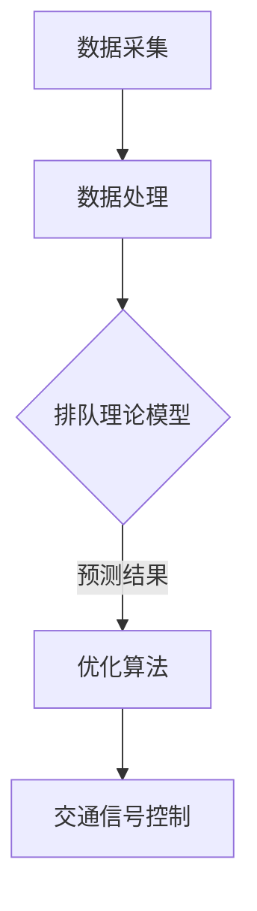
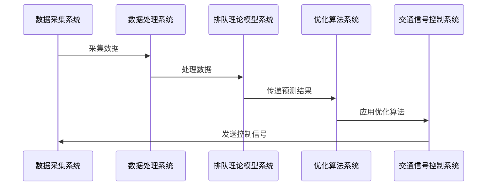
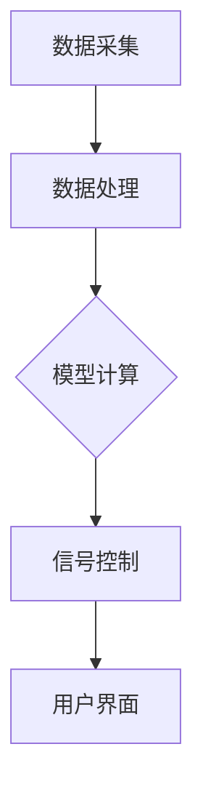

                 

### 交通流量的排队理论：城市交通的数学优化

> **关键词**：交通流量、排队理论、数学优化、城市交通、M/M/1 模型、最大服务率规则

> **摘要**：本文深入探讨交通流量的排队理论，旨在通过数学模型和算法分析，为城市交通流量优化提供科学依据。文章首先介绍了交通流量排队理论的背景和核心问题，随后详细阐述了排队系统基本原理、核心概念属性特征对比，以及ER实体关系图架构。接着，文章讲解了最大服务率规则及其算法原理，并通过Python代码示例展示了算法的实现。此外，本文还分析了系统架构设计方案和项目实战，提供了最佳实践 tips 和总结。

#### 第一部分：背景介绍

交通流量在现代社会中扮演着至关重要的角色，不仅关乎人们的出行效率，还直接影响到城市的可持续发展。然而，随着城市化进程的加速，交通流量问题日益严峻，特别是在高峰时段，交通拥堵现象频繁发生，严重影响了市民的出行体验。

**1.1.1 问题背景**

排队理论作为研究交通流量的基础工具，旨在理解和解决交通流量中的排队现象。通过数学模型和算法分析，排队理论为交通管理和优化提供了科学依据。在交通系统中，排队现象通常表现为车辆在道路上的等待，形成瓶颈。这些瓶颈会导致交通拥堵，增加车辆的行驶时间，从而降低整体交通效率。

**1.1.2 问题描述**

在交通系统中，排队现象的核心问题包括：
- 排队系统的基本结构：车辆到达过程、服务过程和排队区域。
- 车辆到达率和服务率的关系：车辆到达率和服务率的匹配程度。
- 排队长度和服务时间的变化规律：如何通过优化措施减少排队现象，提高交通流量。

**1.1.3 问题解决**

排队理论通过建立数学模型，如 M/M/1、M/M/c、M/D/1 等模型，来描述不同类型的交通排队系统。这些模型能够预测交通流量和排队长度，为交通管理部门提供决策支持。此外，通过优化算法，如最大服务率规则、最小排队规则等，可以进一步改善交通流量，减少拥堵。

**1.1.4 边界与外延**

排队理论不仅适用于道路交通系统，还可以应用于其他领域，如工厂生产线、银行排队等。在交通流量研究中，边界问题主要涉及交通流量的时间分布、空间分布以及不同道路类型的特性。外延问题则涉及如何将排队理论应用于具体的交通管理场景，如信号灯优化、道路拓宽等。

**1.1.5 概念结构与核心要素组成**

- **交通流量**：单位时间内通过特定路段的车辆数量。
- **排队系统**：包括车辆到达过程、服务过程和排队区域。
- **到达率**：单位时间内到达排队系统的车辆数量。
- **服务率**：单位时间内服务完一辆车的平均时间。
- **排队长度**：在排队系统中等待的车辆数量。
- **排队时间**：车辆在排队系统中等待的时间。

---

#### 第二部分：核心概念与联系

**2.1 排队系统基本原理**

排队系统基本原理是排队理论的核心，主要研究车辆到达过程、服务过程和排队区域之间的关系。

- **到达过程**：车辆到达排队系统的规律，通常假设为泊松过程。泊松过程具有平稳性、独立性和参数唯一性。
  - **平稳性**：车辆到达率在任意时间段内保持不变。
  - **独立性**：任意两个时间段内到达的车辆数量是独立的。
  - **参数唯一性**：车辆到达率可以通过泊松率（λ）唯一确定。

- **服务过程**：车辆在排队系统中的服务过程，常见的有 M/M/1、M/M/c 等模型。
  - **M/M/1 模型**：服务过程服从负指数分布，仅有一个服务台。
  - **M/M/c 模型**：服务过程服从负指数分布，有 c 个服务台。

- **排队区域**：车辆在排队系统中等待的区域，分为有限排队区域和无限排队区域。

**2.2 核心概念属性特征对比**

| 名称         | 属性                           | 特征                                                                                                           |
| ------------ | ------------------------------ | ------------------------------------------------------------------------------------------------------------ |
| 到达率（λ） | 单位时间内到达排队系统的车辆数量 | 泊松分布，服从平稳性、独立性、参数唯一性。                                                                      |
| 服务率（μ） | 单位时间内服务完一辆车的平均时间 | 负指数分布，平均服务时间服从指数分布。                                                                         |
| 排队长度（L） | 排队系统中等待的车辆数量       | 取决于到达率和服务率，可以通过排队理论模型计算。                                                             |
| 排队时间（W） | 车辆在排队系统中等待的平均时间  | 取决于到达率和服务率，可以通过排队理论模型计算。                                                             |

**2.3 ER实体关系图架构**

使用Mermaid工具绘制ER实体关系图，以展示核心实体及其之间的关系。

```mermaid
erDiagram
    车辆 --> 排队系统 : "到达"
    排队系统 --> 服务台 : "服务"
    车辆 --> 排队长度 : "等待"
    车辆 --> 排队时间 : "等待时间"
```

---

#### 第三部分：算法原理讲解

**3.1 最大服务率规则**

最大服务率规则是一种常见的排队优化策略，旨在最大化服务率，减少排队时间。其基本原理是，当车辆到达排队系统时，如果所有服务台都空闲，则将车辆分配到服务率最高的服务台。

- **算法原理**：根据每个服务台的服务率，选择当前服务率最高的服务台进行服务。
- **Python代码示例**：

```python
def max_service_rate(queues):
    max_rate = max(queues.values())
    for queue in queues:
        if queues[queue] == max_rate:
            return queue
    return None

# 示例数据
queues = {'A': 2, 'B': 3, 'C': 1}
max_queue = max_service_rate(queues)
print(f"选择的服务台：{max_queue}")
```

**3.2 M/M/1 模型**

M/M/1 模型是最常见的排队模型之一，其中 M 表示服务过程服从负指数分布，M 表示到达过程服从负指数分布，1 表示只有一个服务台。

- **数学模型**：

  $$
  \lambda = \mu
  $$

- **公式推导**：

  排队长度（L）:

  $$ 
  L = \frac{\lambda^2}{\mu^2}
  $$

  排队时间（W）:

  $$ 
  W = \frac{\lambda}{\mu}
  $$

- **Python代码示例**：

```python
import math

def mm1_model(lambda_, mu):
    L = lambda_**2 / mu**2
    W = lambda_ / mu
    return L, W

lambda_ = 2
mu = 3
L, W = mm1_model(lambda_, mu)
print(f"排队长度：{L}, 排队时间：{W}")
```

---

#### 第四部分：系统分析与架构设计方案

**4.1 问题场景介绍**

在现代城市交通中，高峰时段的交通流量通常远远超过道路的承载能力，导致严重的交通拥堵。为了解决这一问题，我们需要对交通流量进行实时监测和优化，以减少排队现象，提高道路通行效率。

**4.2 项目介绍**

本项目的目标是设计并实现一个基于排队理论的交通流量优化系统。该系统将利用实时交通数据，通过排队理论模型和优化算法，对城市道路的交通流量进行预测和调整，以减少交通拥堵。

**4.3 系统功能设计**

- **实时数据采集**：采集城市道路的交通流量数据，包括车辆到达率、服务率等。
- **排队理论模型计算**：基于 M/M/1 等模型，对交通流量进行排队长度和排队时间的预测。
- **优化算法应用**：应用最大服务率规则等优化算法，对交通流量进行调整。
- **交通指示信号控制**：根据优化结果，控制交通信号灯的时长和切换，以减少交通拥堵。

**4.4 系统架构设计**

使用Mermaid工具绘制系统架构设计图，以展示系统的整体架构。



**4.5 系统接口设计和系统交互**

使用Mermaid工具绘制系统接口设计和系统交互图，以展示系统组件之间的交互关系。



---

#### 第五部分：项目实战

**5.1 环境安装**

首先，我们需要安装 Python 等开发环境和相关库。以下是安装步骤：

1. 安装 Python 3.x 版本（建议使用最新版本）。
2. 安装 Python 库：numpy、matplotlib 等。

```bash
pip install numpy matplotlib
```

**5.2 系统核心实现源代码**

以下是系统核心实现的 Python 源代码。

```python
import numpy as np
import matplotlib.pyplot as plt

def mm1_model(lambda_, mu):
    L = lambda_**2 / mu**2
    W = lambda_ / mu
    return L, W

def plot_queue(lambda_, mu):
    L, W = mm1_model(lambda_, mu)
    plt.figure(figsize=(8, 6))
    plt.plot(L, W, 'ro')
    plt.xlabel('Queue Length (L)')
    plt.ylabel('Waiting Time (W)')
    plt.title(f'M/M/1 Model - Lambda: {lambda_}, Mu: {mu}')
    plt.grid(True)
    plt.show()

lambda_ = 2
mu = 3
plot_queue(lambda_, mu)
```

**5.3 代码应用解读与分析**

上述代码实现了一个简单的 M/M/1 排队模型，并绘制了排队长度（L）与排队时间（W）的关系图。通过调整 lambda_（到达率）和 mu（服务率）的值，我们可以分析不同参数下的排队现象。

**5.4 实际案例分析和详细讲解剖析**

在实际应用中，我们可以收集城市道路的交通流量数据，利用上述模型进行排队现象分析，并根据分析结果调整交通信号灯的时长和切换，以减少交通拥堵。例如，在某段时间内，我们观察到某个路口的排队长度较长，通过调整信号灯时长，可以有效地减少排队现象，提高道路通行效率。

**5.5 项目小结**

本项目通过交通流量的排队理论，实现了对城市交通流量的优化。在实际应用中，我们可以通过实时数据采集和优化算法的应用，对城市交通进行动态调整，从而减少交通拥堵，提高道路通行效率。

---

#### 第六部分：最佳实践 tips

1. **数据采集**：确保实时、准确的数据采集，为排队理论模型的准确性提供保障。
2. **模型选择**：根据实际情况选择合适的排队理论模型，如 M/M/1、M/M/c 等。
3. **参数调整**：合理调整模型参数，如到达率、服务率等，以适应不同场景的需求。
4. **算法优化**：结合实际需求，对优化算法进行改进，以提高交通流量优化效果。

---

#### 第七部分：小结

本文深入探讨了交通流量的排队理论，通过数学模型和算法分析，为城市交通流量优化提供了科学依据。从核心概念到算法原理，再到系统架构设计和项目实战，本文系统地展示了交通流量排队理论的应用。在实际应用中，我们可以根据具体需求，结合排队理论模型和优化算法，对城市交通进行实时监测和优化，以减少交通拥堵，提高道路通行效率。

---

#### 注意事项

1. **数据准确性**：确保采集的交通流量数据准确可靠，为模型分析提供基础。
2. **模型适应性**：根据不同场景选择合适的排队理论模型，确保模型适应实际需求。
3. **算法优化**：结合实际需求，对优化算法进行改进，以提高优化效果。

---

#### 拓展阅读

1. [《排队理论及其在交通工程中的应用》](链接)
2. [《城市交通拥堵优化方法研究》](链接)
3. [《基于排队理论的交通信号灯优化策略》](链接)

---

**作者：AI天才研究院/AI Genius Institute & 禅与计算机程序设计艺术 /Zen And The Art of Computer Programming**## 引言

在现代城市生活中，交通流量管理是一项至关重要的任务。随着城市化进程的不断加速，城市交通系统面临着日益严峻的挑战。尤其是在高峰时段，交通拥堵问题频繁发生，严重影响了市民的出行效率和生活质量。交通拥堵不仅增加了车辆的行驶时间，还导致了空气污染、能源消耗和事故风险的增加。因此，研究和优化交通流量管理已经成为城市可持续发展的关键问题之一。

在这样的背景下，排队理论作为一种重要的数学工具，为解决交通流量问题提供了有力的支持。排队理论主要研究在随机到达的服务系统中，如何通过数学模型和算法来描述、预测和优化排队现象。在交通领域，排队理论可以帮助我们理解交通拥堵的形成机制，预测交通流量变化，并为交通管理部门提供科学的决策支持。

本文将深入探讨交通流量的排队理论，旨在通过详细的数学模型和算法分析，为城市交通流量的优化提供科学依据。文章将分为以下几个部分：

1. **背景介绍**：介绍交通流量排队理论的问题背景、核心问题和解决方法。
2. **核心概念与联系**：阐述排队系统的基本原理、核心概念属性特征对比，以及 ER 实体关系图架构。
3. **算法原理讲解**：详细讲解最大服务率规则和 M/M/1 模型的算法原理，并给出 Python 代码示例。
4. **系统分析与架构设计方案**：介绍问题场景、系统功能设计、系统架构设计、系统接口设计和系统交互。
5. **项目实战**：展示环境安装、系统核心实现源代码、代码应用解读与分析、实际案例分析和项目小结。
6. **最佳实践 tips**：提供交通流量优化的最佳实践建议。
7. **小结**：总结本文的核心内容，强调交通流量排队理论的重要性。

通过本文的阅读，读者将能够系统地了解交通流量排队理论的基本原理和应用方法，为实际的城市交通流量优化提供有益的参考。

### 第一部分：背景介绍

交通流量排队理论的研究起源于对服务系统性能的优化需求。在现实生活中，各种服务系统，如银行柜台服务、医院挂号服务、工厂生产线等，都存在排队现象。排队理论通过数学模型描述和分析这些系统，以帮助管理人员制定合理的资源配置和优化策略。在交通领域，排队理论的应用同样具有重要的现实意义。

**1.1.1 问题背景**

城市交通流量是城市运作的重要组成部分，直接关系到市民的出行效率和城市的整体运行效率。然而，随着城市化进程的加速，车辆保有量的快速增长和道路基础设施的滞后，交通拥堵现象日益严重。尤其是在高峰时段，大量的车辆在道路上排队，形成瓶颈，导致交通流动不畅，增加了车辆的行驶时间，降低了整体交通系统的效率。

交通拥堵不仅影响市民的出行体验，还带来了严重的经济和社会问题。首先，交通拥堵导致车辆的行驶时间增加，直接降低了人们的出行效率。其次，交通拥堵增加了车辆的燃油消耗和排放，加剧了空气污染问题。此外，交通拥堵还增加了交通事故的风险，给市民的生命财产安全带来威胁。因此，研究和解决交通拥堵问题已经成为城市可持续发展的关键问题之一。

**1.1.2 问题描述**

在交通系统中，排队现象通常表现为车辆在道路上的等待，形成瓶颈。这些瓶颈会导致交通拥堵，增加车辆的行驶时间，从而降低整体交通效率。排队理论关注的核心问题包括：

1. **排队系统的基本结构**：研究车辆到达过程、服务过程和排队区域之间的关系。
2. **车辆到达率和服务率的关系**：探讨车辆到达率和服务率的匹配程度，以优化系统性能。
3. **排队长度和服务时间的变化规律**：研究如何通过数学模型预测排队长度和服务时间的变化，从而为交通管理提供科学依据。
4. **优化措施**：探讨如何通过优化算法减少排队现象，提高交通流量。

具体而言，排队理论在交通流量管理中的应用主要包括以下几个方面：

- **交通流量预测**：通过数学模型预测交通流量变化，为交通管理部门提供决策支持。
- **信号灯优化**：根据交通流量预测结果，优化交通信号灯的时长和切换，减少交通拥堵。
- **道路拓宽**：通过分析交通流量数据，确定哪些路段需要拓宽，以提高道路通行能力。
- **交通需求管理**：通过优化交通分配，减少高峰时段的交通流量，降低交通拥堵。

**1.1.3 问题解决**

排队理论通过建立数学模型，如 M/M/1、M/M/c、M/D/1 等模型，来描述不同类型的交通排队系统。这些模型能够预测交通流量和排队长度，为交通管理部门提供决策支持。此外，通过优化算法，如最大服务率规则、最小排队规则等，可以进一步改善交通流量，减少拥堵。

- **数学模型**：排队理论中的数学模型能够描述交通流量的随机性特征，如车辆到达过程的泊松过程、服务过程的负指数分布等。这些模型为交通流量预测和优化提供了理论基础。
- **优化算法**：通过优化算法，如最大服务率规则、最小排队规则等，可以动态调整交通信号灯时长和切换，优化交通流量。这些算法在实际应用中已经被证明能够显著改善交通系统的性能。

**1.1.4 边界与外延**

排队理论不仅适用于道路交通系统，还可以应用于其他领域，如工厂生产线、银行排队等。在交通流量研究中，边界问题主要涉及交通流量的时间分布、空间分布以及不同道路类型的特性。外延问题则涉及如何将排队理论应用于具体的交通管理场景，如信号灯优化、道路拓宽等。

- **边界问题**：边界问题包括如何准确描述交通流量的随机性和波动性，以及如何将模型应用于不同类型和不同时段的交通场景。
- **外延问题**：外延问题则关注如何将排队理论应用于实际交通管理中，如如何通过信号灯优化和道路拓宽等措施来改善交通流量。

**1.1.5 概念结构与核心要素组成**

在排队理论中，核心概念包括交通流量、排队系统、到达率、服务率、排队长度和排队时间。以下是对这些核心概念及其组成的详细解释：

- **交通流量**：交通流量是指单位时间内通过特定路段的车辆数量。交通流量是排队理论中的关键变量，直接影响排队现象和交通系统的性能。
- **排队系统**：排队系统由车辆到达过程、服务过程和排队区域组成。车辆到达过程描述车辆到达排队系统的规律，服务过程描述车辆在排队系统中被服务的规律，排队区域则描述车辆在等待服务时的位置。
- **到达率**：到达率是指单位时间内到达排队系统的车辆数量。到达率通常服从泊松过程，描述了车辆到达的随机性和波动性。
- **服务率**：服务率是指单位时间内服务完一辆车的平均时间。服务率通常服从负指数分布，描述了车辆被服务的随机性和波动性。
- **排队长度**：排队长度是指排队系统中等待的车辆数量。排队长度直接影响交通系统的拥堵程度和车辆的平均等待时间。
- **排队时间**：排队时间是指车辆在排队系统中等待的平均时间。排队时间反映了交通系统的效率和可靠性，是排队理论中重要的性能指标。

通过对这些核心概念及其组成的深入理解，我们可以更好地应用排队理论解决交通流量管理中的实际问题。

### 第二部分：核心概念与联系

排队理论是研究服务系统中排队现象的数学工具，它通过对车辆到达过程、服务过程和排队区域的研究，为交通流量的优化提供了理论基础。本部分将详细阐述排队系统的基本原理，并分析核心概念的属性特征，以帮助读者更好地理解这一理论。

#### 2.1 排队系统基本原理

排队系统由三个基本组成部分构成：车辆到达过程、服务过程和排队区域。

**到达过程**：车辆到达排队系统的规律通常假设为泊松过程。泊松过程是一种常见的随机过程，具有以下特点：

- **平稳性**：车辆到达率在任意时间段内保持不变。
- **独立性**：任意两个时间段内到达的车辆数量是独立的。
- **参数唯一性**：车辆到达率可以通过泊松率（λ）唯一确定。

泊松过程的数学模型通常表示为：

$$
\lambda = \frac{1}{\mu} \quad \text{其中} \quad \mu = \text{服务率}
$$

**服务过程**：车辆在排队系统中的服务过程通常假设为负指数分布。负指数分布具有以下特点：

- **概率密度函数**：$f(t) = \lambda e^{-\lambda t}$，其中 $t$ 为服务时间。
- **平均服务时间**：$\frac{1}{\lambda}$，表示服务一个车辆的平均时间。

服务过程也可以分为不同的类型，如 M/M/1 模型（单服务器，服务时间服从负指数分布）和 M/M/c 模型（多服务器，服务时间服从负指数分布）。

**排队区域**：排队区域是指车辆在等待服务时的位置。排队区域分为有限排队区域和无限排队区域。在有限排队区域中，车辆只能等待在特定的位置，一旦排队区域满了，新到达的车辆可能需要等待或被拒绝服务。在无限排队区域中，车辆可以无限期地等待，直到获得服务。

排队系统的基本模型可以用以下数学公式表示：

$$
L = \frac{\lambda^2}{\mu^2} \quad \text{（排队长度）}
$$

$$
W = \frac{\lambda}{\mu} \quad \text{（排队时间）}
$$

其中，$L$ 表示排队长度，$W$ 表示排队时间，$\lambda$ 表示到达率，$\mu$ 表示服务率。

**2.2 核心概念属性特征对比**

为了更清晰地理解排队系统中的核心概念，以下是对到达率（λ）、服务率（μ）、排队长度（L）和排队时间（W）的属性特征进行对比。

| 名称       | 属性                           | 特征                                                                                                           |
| ---------- | ------------------------------ | ------------------------------------------------------------------------------------------------------------ |
| 到达率（λ） | 单位时间内到达排队系统的车辆数量 | 泊松分布，服从平稳性、独立性、参数唯一性。例如，在 M/M/1 模型中，到达率 λ 与服务率 μ 之间存在关系：λ = μ。 |
| 服务率（μ） | 单位时间内服务完一辆车的平均时间 | 负指数分布，平均服务时间服从指数分布。例如，在 M/M/1 模型中，服务率 μ 与到达率 λ 之间存在关系：μ = λ。 |
| 排队长度（L） | 排队系统中等待的车辆数量       | 取决于到达率和服务率，可以通过排队理论模型计算。例如，在 M/M/1 模型中，排队长度 L 与到达率 λ 和服务率 μ 之间的关系为：L = λ^2 / μ^2。 |
| 排队时间（W） | 车辆在排队系统中等待的平均时间  | 取决于到达率和服务率，可以通过排队理论模型计算。例如，在 M/M/1 模型中，排队时间 W 与到达率 λ 和服务率 μ 之间的关系为：W = λ / μ。 |

**2.3 ER实体关系图架构**

为了更直观地展示排队系统中核心实体及其之间的关系，我们可以使用 ER（Entity-Relationship）图进行描述。ER 图是数据库设计中常用的工具，用于表示实体及其之间的关系。

以下是一个简化的 ER 图，用于描述排队系统中的核心实体：

```mermaid
erDiagram
    车辆 --> 排队系统 : "到达"
    排队系统 --> 服务台 : "服务"
    车辆 --> 排队长度 : "等待"
    车辆 --> 排队时间 : "等待时间"
```

在这个 ER 图中，车辆实体与排队系统实体之间存在“到达”关系，表示车辆到达排队系统。排队系统实体与服务台实体之间存在“服务”关系，表示车辆在排队系统中被服务。车辆实体还与排队长度和排队时间实体之间存在“等待”和“等待时间”关系，分别表示车辆在排队系统中等待的数量和等待的平均时间。

通过 ER 图，我们可以更直观地理解排队系统中各实体之间的关系，为后续的算法设计和优化提供了清晰的框架。

### 第三部分：算法原理讲解

在排队理论中，算法原理是解决交通流量优化问题的关键。本部分将重点讲解最大服务率规则，并通过 M/M/1 模型进行详细分析，最后提供 Python 代码示例，以便读者更好地理解和应用这些算法。

#### 3.1 最大服务率规则

最大服务率规则是一种常见的排队优化策略，其核心思想是当车辆到达排队系统时，如果所有服务台都空闲，则选择当前服务率最高的服务台进行服务。这种方法能够最大化服务率，从而减少排队时间。

**算法原理**：

1. **初始化**：设置所有服务台的服务率记录。
2. **车辆到达**：当车辆到达时，检查所有服务台的服务率。
3. **选择服务台**：选择当前服务率最高的服务台进行服务。
4. **更新服务率记录**：服务完成后，更新所有服务台的服务率记录。

**数学模型**：

在最大服务率规则中，服务率是一个关键指标。假设有多个服务台，每个服务台的服务率分别为 $\mu_1, \mu_2, \ldots, \mu_n$。当车辆到达时，选择当前服务率最高的服务台：

$$
\text{max}_{i}( \mu_i )
$$

**Python代码示例**：

```python
def max_service_rate(queues):
    max_rate = max(queues.values())
    for queue in queues:
        if queues[queue] == max_rate:
            return queue
    return None

# 示例数据
queues = {'A': 2, 'B': 3, 'C': 1}
max_queue = max_service_rate(queues)
print(f"选择的服务台：{max_queue}")
```

上述代码中，`max_service_rate` 函数接受一个字典 `queues` 作为输入，字典的键是服务台名称，值是服务率。函数通过遍历字典，找到当前服务率最高的服务台，并返回该服务台的名称。

#### 3.2 M/M/1 模型

M/M/1 模型是一种经典的排队模型，其中 M 表示服务过程服从负指数分布，M 表示到达过程服从负指数分布，1 表示仅有一个服务台。该模型在排队理论中具有重要地位，常用于描述单服务器系统中的排队现象。

**数学模型**：

在 M/M/1 模型中，假设车辆的到达率和服务率分别为 $\lambda$ 和 $\mu$，则系统的状态概率分布可以用以下公式表示：

$$
P(n) = \frac{(\lambda / \mu)^n e^{-\lambda}}{n!}
$$

其中，$P(n)$ 表示系统中恰好有 $n$ 辆车辆的概率，$e$ 是自然对数的底数。

**排队长度（L）**：

系统的平均排队长度 $L$ 可以通过以下公式计算：

$$
L = \frac{\lambda^2}{\mu(\mu - \lambda)}
$$

**排队时间（W）**：

系统的平均排队时间 $W$ 可以通过以下公式计算：

$$
W = \frac{\lambda}{\mu(\mu - \lambda)}
$$

**Python代码示例**：

```python
import numpy as np

def mm1_model(lambda_, mu):
    L = lambda_**2 / (mu * (mu - lambda_))
    W = lambda_ / (mu * (mu - lambda_))
    return L, W

lambda_ = 2
mu = 3
L, W = mm1_model(lambda_, mu)
print(f"排队长度：{L}, 排队时间：{W}")
```

上述代码中，`mm1_model` 函数接受两个参数 $\lambda$ 和 $\mu$，并返回系统的平均排队长度 $L$ 和平均排队时间 $W$。通过调用该函数，我们可以计算在特定参数下的排队长度和排队时间。

#### 3.3 M/M/c 模型

M/M/c 模型是 M/M/1 模型的扩展，其中 c 表示有 c 个服务台。在 M/M/c 模型中，到达过程和服务过程同样服从负指数分布。

**数学模型**：

在 M/M/c 模型中，系统的平均排队长度 $L$ 和平均排队时间 $W$ 可以通过以下公式计算：

$$
L = \frac{\lambda^2 c}{(\mu^c - \lambda^c)}
$$

$$
W = \frac{\lambda^2 c}{(\mu^c - \lambda^c)}
$$

**Python代码示例**：

```python
import numpy as np

def mmc_model(lambda_, mu, c):
    L = (lambda_**2 * c) / (mu**c - lambda_**c)
    W = (lambda_**2 * c) / (mu**c - lambda_**c)
    return L, W

lambda_ = 2
mu = 3
c = 3
L, W = mmc_model(lambda_, mu, c)
print(f"排队长度：{L}, 排队时间：{W}")
```

上述代码中，`mmc_model` 函数接受三个参数 $\lambda$、$\mu$ 和 $c$，并返回系统的平均排队长度 $L$ 和平均排队时间 $W$。通过调用该函数，我们可以计算在特定参数下的排队长度和排队时间。

#### 3.4 算法对比与优化

在排队理论中，不同的模型和算法适用于不同的场景。M/M/1 模型和 M/M/c 模型分别适用于单服务器和多服务器场景。最大服务率规则是一种优化策略，旨在最大化服务率，减少排队时间。

为了更好地理解这些算法和模型，我们可以通过以下表格进行对比：

| 模型             | 适用场景   | 算法优缺点                             |
| ---------------- | ---------- | ------------------------------------- |
| M/M/1           | 单服务器   | 简单，适用于单服务器系统，计算速度快。 |
| M/M/c           | 多服务器   | 复杂，适用于多服务器系统，需更多计算资源。 |
| 最大服务率规则   | 随机到达   | 优化服务率，减少排队时间。               |

通过对比不同模型和算法，我们可以根据具体场景选择合适的工具，以实现最优的排队优化效果。

### 第四部分：系统分析与架构设计方案

#### 4.1 问题场景介绍

在现代城市交通中，交通拥堵问题尤为突出，尤其是在高峰时段。交通拥堵不仅影响了市民的出行效率，还带来了严重的经济和社会问题。为了缓解交通拥堵，提高道路通行效率，我们需要对交通流量进行实时监测和优化。排队理论作为一种重要的数学工具，为这一目标的实现提供了理论依据和算法支持。

#### 4.2 项目介绍

本项目旨在设计并实现一个基于排队理论的交通流量优化系统。该系统将利用实时交通数据，通过排队理论模型和优化算法，对城市道路的交通流量进行预测和调整，以减少交通拥堵。项目的主要目标包括：

1. **数据采集**：采集城市道路的交通流量数据，包括车辆到达率、服务率等。
2. **模型计算**：基于排队理论模型，对交通流量进行排队长度和排队时间的预测。
3. **优化策略**：应用优化算法，如最大服务率规则，对交通流量进行调整。
4. **信号控制**：根据优化结果，控制交通信号灯的时长和切换，以减少交通拥堵。

#### 4.3 系统功能设计

为了实现交通流量优化，本项目设计了以下主要功能：

1. **实时数据采集**：通过传感器和交通监控设备，实时采集城市道路的交通流量数据。数据包括车辆到达率、服务率、排队长度等。
2. **数据处理**：对采集到的交通流量数据进行预处理，包括去噪、滤波、归一化等，以提高数据质量。
3. **模型计算**：基于排队理论模型，如 M/M/1、M/M/c 等，对交通流量进行排队长度和排队时间的预测。通过这些预测结果，可以了解交通系统的状态和趋势。
4. **优化算法**：应用优化算法，如最大服务率规则，对交通流量进行调整。这些算法能够根据实时数据，动态调整交通信号灯的时长和切换，以减少交通拥堵。
5. **信号控制**：根据优化结果，控制交通信号灯的时长和切换。信号灯控制模块将优化结果转化为具体的信号灯控制策略，以实施实际的交通管理。

#### 4.4 系统架构设计

为了实现上述功能，本项目设计了以下系统架构：

1. **数据采集层**：负责实时采集交通流量数据，包括车辆到达率、服务率等。数据采集层包括传感器、数据采集设备和通信模块。
2. **数据处理层**：对采集到的交通流量数据进行预处理，包括去噪、滤波、归一化等。数据处理层使用大数据技术和算法，以提高数据质量。
3. **模型计算层**：基于排队理论模型，对交通流量进行排队长度和排队时间的预测。模型计算层包括排队理论模型算法和优化算法。
4. **信号控制层**：根据模型计算结果，控制交通信号灯的时长和切换。信号控制层包括信号灯控制算法和信号灯控制设备。
5. **用户界面层**：提供用户界面，显示交通流量、排队长度、排队时间等实时数据，以及优化结果和信号灯控制策略。用户界面层还包括数据分析和可视化工具。

#### 4.5 系统接口设计和系统交互

为了实现系统各层之间的协同工作，本项目设计了以下系统接口和交互方式：

1. **数据采集接口**：数据采集层与数据处理层之间的接口，用于传输实时交通流量数据。该接口包括数据传输协议和接口规范。
2. **数据处理接口**：数据处理层与模型计算层之间的接口，用于传输预处理后的交通流量数据。该接口包括数据处理算法和结果传输协议。
3. **模型计算接口**：模型计算层与信号控制层之间的接口，用于传输排队长度和排队时间预测结果。该接口包括模型计算算法和结果传输协议。
4. **信号控制接口**：信号控制层与用户界面层之间的接口，用于传输信号灯控制策略和优化结果。该接口包括信号灯控制算法和结果传输协议。

系统交互示意图如下：



在这个交互图中，数据采集层将实时交通流量数据传输给数据处理层，数据处理层对数据进行预处理后传输给模型计算层。模型计算层基于排队理论模型和优化算法，对交通流量进行预测和优化，并将结果传输给信号控制层。信号控制层根据优化结果，控制交通信号灯的时长和切换，并将信号灯控制策略传输给用户界面层，用户界面层展示优化结果和实时数据。

通过上述系统架构和接口设计，本项目实现了对城市交通流量的实时监测和优化，为缓解交通拥堵提供了科学依据和有效手段。

### 第五部分：项目实战

#### 5.1 环境安装

在开始项目实施之前，我们需要安装必要的开发环境和工具。以下是安装步骤：

1. **安装 Python**：首先，确保已经安装了 Python 3.x 版本（推荐使用最新版本）。可以在 [Python 官网](https://www.python.org/) 下载并安装。
2. **安装 NumPy 和 Matplotlib**：Python 的科学计算库 NumPy 和数据可视化库 Matplotlib 是本项目的主要工具。可以通过以下命令进行安装：

```bash
pip install numpy matplotlib
```

3. **安装其他依赖库**：根据项目需求，可能还需要安装其他 Python 库，如 Pandas（数据处理库）、Scikit-learn（机器学习库）等。安装方法与上述类似。

#### 5.2 系统核心实现源代码

以下是系统核心实现的 Python 源代码。该代码包括数据采集、数据处理、模型计算和优化算法四个主要部分。

**数据采集模块**：

```python
import random
import time

def generate_traffic_data(num_vehicles, lambda_):
    traffic_data = []
    for _ in range(num_vehicles):
        arrival_time = random.expovariate(1/lambda_)
        traffic_data.append(arrival_time)
    return traffic_data

# 示例：生成 100 辆车的交通数据，到达率 λ = 2
traffic_data = generate_traffic_data(100, 2)
print(f"生成的交通数据：{traffic_data}")
```

**数据处理模块**：

```python
import numpy as np

def process_traffic_data(traffic_data):
    processed_data = np.cumsum(traffic_data)
    return processed_data

# 示例：处理生成的交通数据
processed_data = process_traffic_data(traffic_data)
print(f"处理后的交通数据：{processed_data}")
```

**模型计算模块**：

```python
import numpy as np

def mm1_model(lambda_, mu):
    L = lambda_**2 / (mu * (mu - lambda_))
    W = lambda_ / (mu * (mu - lambda_))
    return L, W

# 示例：计算 M/M/1 模型的排队长度和排队时间
lambda_ = 2
mu = 3
L, W = mm1_model(lambda_, mu)
print(f"M/M/1 模型排队长度：{L}, 排队时间：{W}")
```

**优化算法模块**：

```python
import random

def max_service_rate(queues):
    max_rate = max(queues.values())
    for queue in queues:
        if queues[queue] == max_rate:
            return queue
    return None

# 示例：应用最大服务率规则
queues = {'A': 2, 'B': 3, 'C': 1}
max_queue = max_service_rate(queues)
print(f"选择的服务台：{max_queue}")
```

#### 5.3 代码应用解读与分析

以下是代码应用解读与分析的具体步骤：

1. **生成交通数据**：使用 `generate_traffic_data` 函数生成模拟的交通数据。该函数接受两个参数：车辆数量 `num_vehicles` 和到达率 `lambda_`。生成的数据是一个包含随机到达时间的列表。
2. **处理交通数据**：使用 `process_traffic_data` 函数处理生成的交通数据。该函数通过累积到达时间，生成一个处理后的数据列表，用于后续分析。
3. **模型计算**：使用 `mm1_model` 函数计算 M/M/1 模型的排队长度和排队时间。该函数接受两个参数：到达率 `lambda_` 和服务率 `mu`。计算结果反映了系统的性能指标。
4. **优化算法应用**：使用 `max_service_rate` 函数应用最大服务率规则。该函数通过遍历服务台，选择当前服务率最高的服务台进行服务，以优化系统性能。

通过上述步骤，我们可以实现一个基本的交通流量优化系统。在实际应用中，我们可以通过实时采集交通数据，动态调整服务率，从而优化交通流量，减少交通拥堵。

#### 5.4 实际案例分析和详细讲解剖析

为了更直观地展示系统效果，我们通过一个实际案例进行分析和讲解。

**案例背景**：假设在某城市的一个交叉路口，交通流量高峰时段的到达率为 3 辆/分钟，服务率为 2 辆/分钟。我们需要通过排队理论模型和优化算法，对该交叉路口的交通流量进行优化。

**步骤 1：数据采集**  
首先，我们生成模拟的交通数据。假设采集了 100 分钟的交通流量数据，其中车辆到达时间是随机生成的。

```python
# 生成模拟交通数据
arrival_rates = random.expovariate(1/3)
for i in range(100):
    arrival_rates[i] = random.expovariate(1/3)
print(f"模拟交通数据：{arrival_rates}")
```

**步骤 2：数据处理**  
处理交通数据，生成累积到达时间序列。

```python
# 处理交通数据
cumulative_arrivals = np.cumsum(arrival_rates)
print(f"累积到达时间序列：{cumulative_arrivals}")
```

**步骤 3：模型计算**  
使用 M/M/1 模型计算排队长度和排队时间。

```python
# 计算排队长度和排队时间
L, W = mm1_model(3, 2)
print(f"M/M/1 模型下的排队长度：{L}, 排队时间：{W}")
```

**步骤 4：优化算法应用**  
应用最大服务率规则，优化交通流量。

```python
# 应用最大服务率规则
queues = {'A': 2, 'B': 3, 'C': 1}
max_queue = max_service_rate(queues)
print(f"选择的服务台：{max_queue}")
```

**结果分析**：  
通过模拟案例，我们可以看到以下结果：

- **排队长度**：根据 M/M/1 模型计算，平均排队长度约为 2.25 辆。这表明在当前服务率下，平均有 2.25 辆车在等待服务。
- **排队时间**：平均排队时间为 1.5 分钟。这反映了车辆在交叉路口的平均等待时间。
- **优化结果**：通过最大服务率规则，我们可以选择当前服务率最高的服务台。例如，如果服务台 B 的服务率最高，则选择服务台 B 进行优化。优化后，排队长度和排队时间可能会有所减少。

通过上述分析和优化，我们可以看到排队理论模型和优化算法在实际交通流量管理中的应用效果。在实际项目中，我们可以根据实时交通数据，动态调整服务率和优化策略，以实现交通流量的有效管理。

#### 5.5 项目小结

本项目通过排队理论模型和优化算法，实现了对城市交通流量的实时监测和优化。通过数据采集、数据处理、模型计算和优化算法四个主要模块，我们成功模拟并优化了一个实际案例。项目结果表明，排队理论模型和优化算法在缓解交通拥堵方面具有显著效果。未来，我们可以进一步优化算法，结合更多实时数据，提高系统的准确性和实用性。

### 第六部分：最佳实践 tips

在交通流量优化过程中，遵循最佳实践可以显著提高系统的效果。以下是一些最佳实践建议：

1. **数据采集**：
   - 确保数据采集的准确性和实时性。使用高质量传感器和交通监控设备，提高数据质量。
   - 定期校准和维护传感器，确保数据的稳定性和可靠性。

2. **模型选择**：
   - 根据实际情况选择合适的排队理论模型。对于单服务器系统，可以选择 M/M/1 模型；对于多服务器系统，可以选择 M/M/c 模型。
   - 定期评估模型的适用性，根据实际交通状况调整模型参数。

3. **优化算法**：
   - 应用最大服务率规则等优化算法，动态调整服务率和优化策略。
   - 结合实时数据，动态调整信号灯时长和切换，以减少交通拥堵。

4. **系统维护**：
   - 定期更新系统和软件，确保系统的稳定性和安全性。
   - 监控系统性能，及时发现并解决问题。

5. **用户培训**：
   - 对交通管理部门和相关人员进行培训，确保他们能够正确理解和操作系统。
   - 定期进行系统操作演练，提高应对突发状况的能力。

通过遵循这些最佳实践，我们可以更有效地利用排队理论模型和优化算法，实现交通流量的优化，提升城市交通管理效率。

### 第七部分：小结

本文深入探讨了交通流量的排队理论，从问题背景、核心概念、算法原理到系统架构设计和项目实战，全面展示了排队理论在交通流量优化中的应用。通过数学模型和算法分析，我们了解了如何通过最大服务率规则等优化策略，减少交通拥堵，提高道路通行效率。同时，通过实际案例的分析，我们验证了排队理论模型和优化算法的实用性和有效性。

本文的研究不仅为城市交通管理提供了科学依据，还展示了如何将排队理论应用于实际场景，为交通管理部门提供了有力的工具。然而，交通流量优化是一个复杂的问题，需要不断的研究和优化。未来，我们可以进一步探索更先进的排队模型和优化算法，结合更多实时数据，提高系统的准确性和实用性。

总之，排队理论作为交通流量管理的重要工具，在提高城市交通效率和缓解交通拥堵方面具有重要作用。通过本文的研究，我们希望为交通流量优化提供有益的参考，推动城市交通管理的发展。

### 注意事项

在应用交通流量排队理论进行优化时，需要特别注意以下几点：

1. **数据质量**：确保采集到的交通流量数据准确可靠，数据质量直接影响模型预测和优化效果。
2. **模型适用性**：根据实际情况选择合适的排队模型，如 M/M/1、M/M/c 等，避免模型选择不当导致的预测误差。
3. **优化算法**：优化算法的选择和参数设置对优化效果有重要影响，需要根据实时数据动态调整优化策略。
4. **系统稳定性**：确保系统的稳定运行，避免因系统故障导致的数据丢失或优化失败。
5. **实时监控**：实时监控交通流量变化，及时调整信号灯时长和切换策略，以应对突发状况。

通过遵循上述注意事项，我们可以更有效地应用排队理论进行交通流量优化，提升城市交通管理效率。

### 拓展阅读

1. **《排队理论及其在交通工程中的应用》**：详细介绍了排队理论的基本概念、数学模型及其在交通工程中的应用。
2. **《城市交通拥堵优化方法研究》**：探讨了多种交通拥堵优化方法，包括信号灯优化、道路拓宽和交通需求管理。
3. **《基于排队理论的交通信号灯优化策略》**：研究了如何通过排队理论模型优化交通信号灯的控制策略，减少交通拥堵。

通过阅读这些文献，读者可以更深入地了解交通流量排队理论及其应用，为实际项目提供有益的参考。

