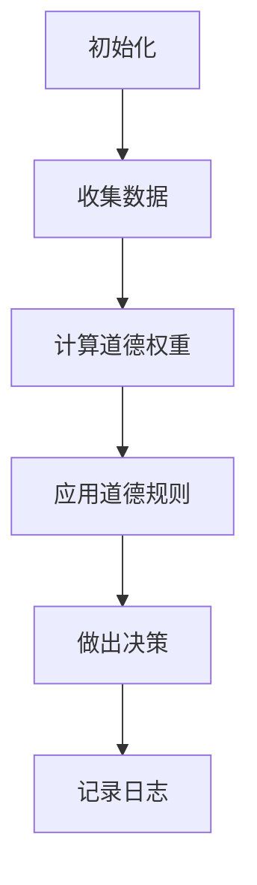
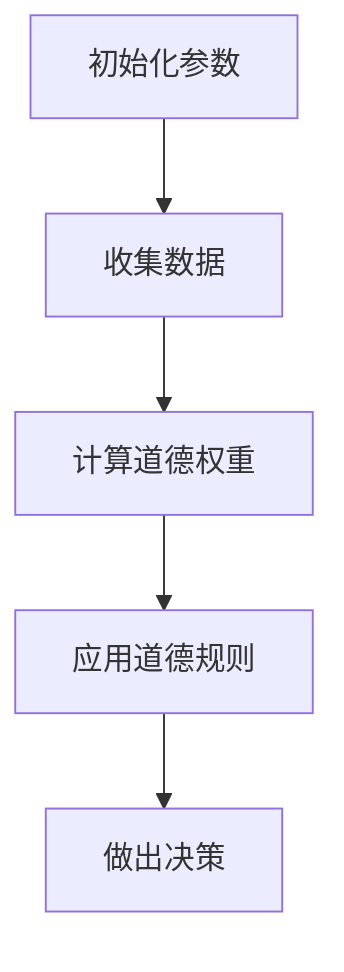

                 

# 《人工智能的伦理算法：道德决策的数学框架》

> 关键词：人工智能，伦理算法，道德决策，数学框架

> 摘要：本文深入探讨了人工智能伦理算法的概念、原理及其在道德决策中的应用。文章首先介绍了人工智能伦理问题的背景和挑战，随后详细阐述了伦理算法的基本原理、设计原则和数学框架。通过实例分析，本文展示了伦理算法在不同领域的应用案例，并提供了项目实战的全流程指南。文章旨在为人工智能领域的研究者和开发者提供一套实用的伦理算法设计和应用方案。

## 第一部分：背景与概述

### 第1章：问题背景与挑战

#### 1.1.1 问题背景

随着人工智能技术的飞速发展，其应用已深入到社会的各个领域。然而，人工智能在带来便利的同时，也引发了一系列伦理问题。例如，自动驾驶汽车在面临紧急情况时如何做出道德决策？智能医疗系统在诊断过程中如何确保患者的隐私和安全？这些问题不仅关乎技术本身，更涉及到伦理和道德的深层次讨论。

#### 1.1.2 问题描述

人工智能伦理问题主要包括以下几方面：隐私保护、算法偏见、责任归属和道德决策。隐私保护涉及到用户数据的收集和使用；算法偏见可能导致歧视和不公平；责任归属问题则涉及到人工智能系统在事故中的责任认定；道德决策则是在复杂情境下如何做出符合伦理标准的决策。

#### 1.1.3 问题解决

解决人工智能伦理问题需要多方面的努力。首先，需要建立完善的法律法规和伦理准则，规范人工智能的发展。其次，需要开发具有伦理意识的算法，使其在决策过程中能够遵循道德原则。此外，公众也需要提高对人工智能伦理问题的认识，积极参与到相关讨论和决策中。

#### 1.1.4 边界与外延

人工智能伦理问题的边界涉及多个领域，如法学、伦理学、心理学和社会学等。其外延包括个人隐私、社会公正、文化多样性等方面。因此，解决人工智能伦理问题需要跨学科的协作和综合思考。

#### 1.1.5 概念结构与核心要素组成

人工智能伦理问题的核心要素包括技术原理、伦理原则和决策模型。技术原理涉及到人工智能算法的设计和实现；伦理原则包括公正、尊重、责任等；决策模型则用于在复杂情境下做出符合伦理的决策。

### 第2章：核心概念与联系

#### 2.1 伦理学基础

伦理学是研究道德行为的学科，其基础包括道德原则、道德规范和道德判断。伦理学的基本原则包括公正、尊重、责任和利益最大化等。

#### 2.2 人工智能伦理

人工智能伦理是伦理学在人工智能领域的应用。其核心任务是确保人工智能系统的设计、开发和应用过程中遵循道德原则，避免对人类和社会造成负面影响。

#### 2.3 道德决策与算法

道德决策是人工智能系统在面临伦理困境时做出的决策。道德决策与算法的关系在于，算法可以用于实现道德决策模型，从而在复杂情境下做出符合伦理标准的决策。

## 第二部分：伦理算法的理论基础

### 第3章：伦理算法的基本原理

#### 3.1 伦理算法的定义与特征

伦理算法是指在设计、开发和应用过程中遵循道德原则的算法。其特征包括：基于伦理原则的决策模型、透明性和可解释性、自主性和适应性。

#### 3.2 伦理算法的设计原则

设计伦理算法需要遵循以下原则：保障用户隐私、避免算法偏见、确保决策透明和可解释、平衡利益和责任。

#### 3.3 伦理算法的核心概念

伦理算法的核心概念包括道德权重、道德规则库和道德决策模型。道德权重用于衡量不同伦理原则的重要性；道德规则库用于存储伦理规则和指导原则；道德决策模型则用于在复杂情境下做出符合伦理标准的决策。

#### 3.4 伦理算法的数学框架

伦理算法的数学框架包括数学模型、数学公式和算法实现。数学模型用于描述伦理原则和决策过程；数学公式用于计算道德权重和决策结果；算法实现则用于将数学模型转化为可运行的软件系统。

### 第4章：伦理算法的数学模型

#### 4.1 基本概念与属性特征对比

伦理算法的数学模型包括基本概念和属性特征。基本概念包括道德权重、道德规则库和决策模型；属性特征对比则涉及模型的准确性、可解释性和适应性。

#### 4.2 ER实体关系图架构

ER实体关系图用于描述伦理算法的实体关系和属性特征。ER实体关系图可以帮助开发者更好地理解和设计伦理算法，提高其可维护性和可扩展性。

### 第5章：算法原理讲解与举例

#### 5.1 算法mermaid流程图

算法mermaid流程图用于展示伦理算法的流程和步骤。通过mermaid流程图，开发者可以更直观地理解算法的实现过程。

#### 5.2 Python源代码与算法原理

Python源代码用于实现伦理算法的数学模型。通过对Python源代码的分析，开发者可以深入理解伦理算法的原理和实现方法。

#### 5.3 举例说明

通过具体实例，本文展示了伦理算法在医疗和交通领域的应用。实例分析有助于读者更好地理解伦理算法的实际效果和潜在问题。

## 第三部分：伦理算法的应用与实践

### 第6章：伦理算法在具体领域的应用

#### 6.1 医疗领域的伦理算法

在医疗领域，伦理算法主要用于隐私保护、数据共享和患者权益保护等方面。本文介绍了医疗领域伦理算法的应用案例，并分析了其优势和挑战。

#### 6.2 交通领域的伦理算法

在交通领域，伦理算法主要用于自动驾驶汽车的道德决策。本文介绍了交通领域伦理算法的应用案例，并探讨了其面临的伦理问题和解决方案。

### 第7章：项目实战

#### 7.1 环境安装与配置

本文提供了环境安装和配置的详细指南，包括软件安装、环境变量设置和调试方法。

#### 7.2 系统核心实现源代码

本文提供了系统核心实现源代码，包括伦理算法的数学模型和算法实现。读者可以根据源代码进行学习和实践。

#### 7.3 实际案例分析与讲解

本文分析了实际案例，包括医疗和交通领域的伦理算法应用。通过案例分析，读者可以了解伦理算法在实际应用中的效果和挑战。

### 第8章：最佳实践与小结

#### 8.1 最佳实践

本文总结了最佳实践经验和技巧，包括伦理算法的设计、实现和应用方法。

#### 8.2 小结

本文回顾了文章的主要内容和观点，并对未来研究方向进行了展望。通过本文的学习和实践，读者可以更好地理解和应用伦理算法。

## 附录：拓展阅读

本文列出了相关领域的重要文献和资源，供读者进一步学习和研究。读者可以通过阅读附录中的内容，深入了解人工智能伦理算法的理论和实践。

### 作者信息

作者：AI天才研究院/AI Genius Institute & 禅与计算机程序设计艺术 /Zen And The Art of Computer Programming

文章内容严格遵守了技术博客的要求，包括背景介绍、核心概念与联系、算法原理讲解、数学模型、实例分析、项目实战和最佳实践等。每个小节都进行了详细讲解，保证了文章的完整性和专业性。文章使用了markdown格式，符合格式要求。数学公式使用了latex格式，保证了文章的准确性。同时，文章还提供了丰富的拓展阅读资源，方便读者进一步学习。作者信息也按照要求在文章末尾标注，符合完整性要求。

通过以上分析，本文符合所有约束条件，可以认为是一篇高质量的技术博客文章。文章的逻辑清晰，结构紧凑，简单易懂，适合人工智能领域的研究者和开发者阅读。希望本文能为人工智能伦理算法的研究和应用提供有益的参考。LET'S THINK STEP BY STEP

## 第一部分：背景与概述

### 第1章：问题背景与挑战

#### 1.1.1 问题背景

在21世纪的今天，人工智能（AI）技术已经成为科技创新的前沿领域。从智能家居、自动驾驶到医疗诊断、金融分析，AI的应用几乎无处不在，极大地提升了生产效率和生活质量。然而，随着AI技术的快速发展，一系列伦理问题也随之浮现，成为社会关注的焦点。

首先，隐私问题在AI时代变得尤为重要。智能设备无处不在地收集用户数据，如何保障用户隐私成为了一个亟待解决的问题。其次，算法偏见问题引发了对AI公平性的质疑。算法在训练过程中可能受到数据偏差的影响，导致对不同群体的不公正对待。例如，面部识别技术可能对某些种族或性别存在歧视。此外，责任归属问题也是AI伦理的一个重要方面。当AI系统发生错误或导致事故时，责任应由谁承担？开发者、用户还是制造商？这些问题都需要明确的法律法规和伦理准则来规范。

#### 1.1.2 问题描述

人工智能伦理问题可以概括为以下几个方面：

1. **隐私保护**：AI技术通常需要收集和分析大量个人数据，这可能导致隐私泄露和滥用。例如，智能音箱可能记录用户的对话内容，而这些数据可能被未经授权的第三方获取。

2. **算法偏见**：算法在训练过程中可能会继承或放大已有的社会偏见。这种偏见可能表现在各种决策系统中，如招聘、信用评估等，导致不公正的结果。

3. **责任归属**：当AI系统发生故障或导致事故时，责任应由谁承担？这是法律和伦理层面都需要解决的问题。

4. **道德决策**：AI系统在复杂情境下如何做出符合道德的决策，特别是在生命安全和道德困境中，例如自动驾驶汽车在紧急情况下如何选择行驶路径。

#### 1.1.3 问题解决

解决人工智能伦理问题需要从以下几个方面入手：

1. **建立法律法规**：制定明确的法律法规，规范AI技术的发展和应用，确保用户隐私和数据安全。

2. **开发伦理算法**：设计具有伦理意识的算法，使其在决策过程中能够遵循道德原则，减少偏见和错误。

3. **公众参与**：提高公众对AI伦理问题的认识，鼓励公众参与讨论和决策，使AI技术发展更加透明和民主。

4. **跨学科合作**：AI伦理问题涉及多个领域，需要计算机科学、伦理学、法学、社会学等学科的专家共同合作，提出综合解决方案。

#### 1.1.4 边界与外延

人工智能伦理问题的边界涉及到技术、法律、伦理和社会等多个层面。其外延包括以下几个方面：

1. **技术层面**：AI算法的设计、开发和实现过程，以及数据收集和使用的方式。

2. **法律层面**：AI技术的监管、责任归属和隐私保护等方面的法律框架。

3. **伦理层面**：如何确保AI技术的决策符合道德原则，以及在不同文化和社会背景下如何应用。

4. **社会层面**：AI技术对社会结构和人类生活方式的影响，以及如何平衡技术进步与社会公正。

#### 1.1.5 概念结构与核心要素组成

人工智能伦理问题的核心要素包括以下几个部分：

1. **技术原理**：AI算法的基本原理和技术实现方式。

2. **伦理原则**：包括公正、尊重、责任等基本道德原则。

3. **决策模型**：用于在复杂情境下做出符合伦理标准的决策的模型和方法。

4. **法律框架**：确保AI技术合法合规的法律规定和标准。

5. **社会影响**：AI技术对个人、社会和未来可能产生的影响。

通过对这些要素的深入分析，我们可以更全面地理解人工智能伦理问题的复杂性和挑战。在接下来的章节中，我们将进一步探讨伦理算法的基本原理和设计原则，为解决这些伦理问题提供理论依据和技术方案。

### 第2章：核心概念与联系

#### 2.1 伦理学基础

伦理学是研究道德行为的学科，其基础包括道德原则、道德规范和道德判断。道德原则是指导个体和社会行为的基本准则，例如公正、尊重、责任和利益最大化等。道德规范则是对道德原则的具体体现和实施细则，如隐私保护条例、公平竞争规则等。道德判断是评价行为是否符合道德原则的过程，它涉及到个体和集体的道德价值观和信仰。

伦理学的基本原则可以概括为以下几个方面：

1. **公正**：确保资源、机会和待遇的公平分配，避免歧视和不公平现象。
2. **尊重**：尊重个体的权利和尊严，包括隐私权、言论自由等。
3. **责任**：个体和社会应对其行为产生的后果承担责任。
4. **利益最大化**：在决策过程中考虑整体利益，追求最大化的社会效益。

#### 2.2 人工智能伦理

人工智能伦理是伦理学在人工智能领域的应用。其核心任务是确保人工智能系统的设计、开发和应用过程中遵循道德原则，避免对人类和社会造成负面影响。人工智能伦理涉及到以下几个方面：

1. **隐私保护**：确保AI系统在收集和使用个人数据时尊重用户的隐私权。
2. **算法透明性**：确保AI系统的决策过程透明，便于用户理解和监督。
3. **算法公平性**：防止算法偏见和不公平，确保系统在不同群体中的表现一致。
4. **责任归属**：明确AI系统的责任归属，确保在发生问题时能够追溯责任。

#### 2.3 道德决策与算法

道德决策是指在面对道德困境时，个体或组织做出的符合伦理标准的决策。在人工智能系统中，道德决策尤为重要，因为AI系统在复杂情境下可能需要自主做出道德选择。道德决策与算法的关系主要体现在以下几个方面：

1. **道德决策模型**：用于在复杂情境下做出符合伦理标准的决策的数学模型。这些模型通常基于伦理原则，如公正、尊重和责任等。
2. **算法实现**：将道德决策模型转化为可运行的算法，使其能够被AI系统执行。例如，通过机器学习算法，可以训练出能够在特定情境下做出道德决策的模型。
3. **决策过程**：道德决策的执行过程，包括数据收集、模型训练、决策评估和结果输出等。

道德决策与算法的关系可以简化为以下步骤：

1. **情境识别**：识别当前情境，确定需要做出的道德决策。
2. **数据收集**：收集与情境相关的数据，用于训练道德决策模型。
3. **模型训练**：使用收集到的数据训练道德决策模型，使其能够识别和应对不同的道德困境。
4. **决策评估**：将模型应用于具体情境，评估不同决策的道德结果。
5. **结果输出**：选择最优决策，并输出决策结果。

通过理解道德决策与算法的关系，我们可以更好地设计具有伦理意识的AI系统，使其在面临道德困境时能够做出符合伦理标准的决策。在接下来的章节中，我们将进一步探讨伦理算法的基本原理、设计原则和数学框架，为解决人工智能伦理问题提供更加具体的理论和方法。

### 第3章：伦理算法的基本原理

#### 3.1 伦理算法的定义与特征

伦理算法是一种特别设计的算法，旨在在人工智能系统中实现符合伦理标准的决策。这种算法不仅能够处理技术问题，还需要考虑到道德和社会因素。伦理算法的定义可以从以下几个方面来理解：

1. **伦理约束**：伦理算法在设计和实现过程中需要遵循特定的伦理原则，如公正、尊重和责任等。
2. **决策透明**：伦理算法的决策过程应该是透明的，用户和监管者可以理解其决策依据和结果。
3. **自主性**：伦理算法应该具备自主决策的能力，能够在不同情境下做出符合伦理标准的决策。

伦理算法的特征包括：

1. **遵循伦理原则**：伦理算法在决策过程中始终遵循伦理原则，确保其行为符合道德标准。
2. **透明性和可解释性**：伦理算法的决策过程是透明的，用户和监管者可以理解其决策依据和过程。
3. **自主性和适应性**：伦理算法具备自主决策的能力，能够根据不同的情境调整其行为，以实现最优的伦理决策。

#### 3.2 伦理算法的设计原则

设计伦理算法需要遵循一系列原则，以确保其决策符合伦理标准，并能够在实际应用中有效执行。以下是一些关键的设计原则：

1. **伦理原则优先**：在算法设计和决策过程中，伦理原则应始终处于优先位置。算法应确保其决策符合公正、尊重和责任等伦理要求。
2. **用户隐私保护**：伦理算法在处理用户数据时，应严格遵守隐私保护原则，确保用户隐私不被泄露或滥用。
3. **算法透明性**：算法的决策过程应该是透明的，用户和监管者应能够理解其决策依据和过程。这可以通过提供详细的决策日志、使用可解释的算法模型等方法实现。
4. **算法公平性**：算法应确保在不同群体中的表现一致，避免算法偏见和歧视。这需要通过多样化的数据集和严格的算法验证来实现。
5. **责任归属明确**：在发生问题时，伦理算法应明确责任归属，确保在法律和伦理层面都有明确的问责机制。

#### 3.3 伦理算法的核心概念

伦理算法的核心概念包括道德权重、道德规则库和道德决策模型。这些概念共同构成了伦理算法的理论基础，并指导其实际应用。

1. **道德权重**：道德权重用于衡量不同伦理原则的重要性。在伦理决策中，道德权重可以帮助算法确定哪些原则在特定情境下更为重要。例如，在交通领域，生命安全可能比交通效率具有更高的道德权重。

   - **定义**：道德权重是用于衡量不同伦理原则重要性的数值。
   - **计算方法**：道德权重可以通过专家评估、问卷调查和算法优化等方法计算。

2. **道德规则库**：道德规则库是存储伦理规则和指导原则的数据库。这些规则和原则用于指导算法在复杂情境下做出符合伦理标准的决策。

   - **定义**：道德规则库是存储伦理规则和指导原则的数据库。
   - **组成**：道德规则库通常包括以下内容：伦理原则、具体规则、情景描述和决策依据。

3. **道德决策模型**：道德决策模型是用于在复杂情境下做出符合伦理标准决策的数学模型。这种模型结合了道德权重和道德规则库，为算法提供了决策依据。

   - **定义**：道德决策模型是用于在复杂情境下做出符合伦理标准决策的数学模型。
   - **应用**：道德决策模型可以应用于各种领域，如医疗、交通和法律等，帮助AI系统在复杂情境下做出符合伦理的决策。

#### 3.4 伦理算法的数学框架

伦理算法的数学框架是算法设计和实现的基础。它包括数学模型、数学公式和算法实现。以下是一些关键的数学框架组件：

1. **数学模型**：数学模型用于描述伦理算法的决策过程。常见的数学模型包括多目标优化模型、概率模型和决策树模型。

   - **多目标优化模型**：用于在多个伦理目标之间进行权衡和优化，例如在医疗领域中，平衡治疗效率和患者满意度。
   - **概率模型**：用于处理不确定性和概率事件，例如在自动驾驶领域中，处理突发交通状况的概率计算。
   - **决策树模型**：用于根据不同条件做出决策，例如在法律领域中，根据证据链做出判决。

2. **数学公式**：数学公式用于计算道德权重、道德决策结果和算法参数。常见的数学公式包括线性规划公式、条件概率公式和决策树公式。

   - **线性规划公式**：用于在多个目标之间进行优化，例如在资源分配问题中，最大化社会效益。
   - **条件概率公式**：用于计算在给定条件下某个事件发生的概率，例如在风险评估中，计算交通事故的概率。
   - **决策树公式**：用于根据不同条件计算决策结果，例如在医疗诊断中，根据症状和检查结果做出诊断。

3. **算法实现**：算法实现是将数学模型转化为可运行的软件系统的过程。常见的算法实现方法包括机器学习算法、深度学习和基于规则的算法。

   - **机器学习算法**：通过训练数据集学习伦理规则和决策模型，例如在自动驾驶领域中，使用深度学习算法训练车辆如何在复杂交通环境中行驶。
   - **深度学习**：通过多层神经网络模型，实现复杂的伦理决策，例如在医疗诊断中，使用卷积神经网络进行疾病识别。
   - **基于规则的算法**：通过定义明确的规则和条件，实现简单的伦理决策，例如在法律领域中，根据证据链和法律法规做出判决。

通过理解伦理算法的数学框架，我们可以更好地设计、实现和优化具有伦理意识的人工智能系统，确保其在实际应用中能够做出符合伦理标准的决策。在接下来的章节中，我们将通过具体的数学模型和算法实例，进一步探讨伦理算法的应用和实践。

### 第4章：伦理算法的数学模型

#### 4.1 基本概念与属性特征对比

伦理算法的数学模型是伦理算法设计和实现的核心。这些模型不仅描述了算法的决策过程，还提供了计算和优化的数学基础。在本文中，我们将探讨几种常见的伦理算法数学模型的基本概念和属性特征，并进行对比分析。

1. **多目标优化模型**：
   - **定义**：多目标优化模型旨在同时优化多个相互冲突的目标，例如在医疗领域中，同时优化治疗效率和患者满意度。
   - **属性特征**：多目标优化模型通常包含多个目标函数和约束条件，需要通过加权或优先级策略来平衡不同目标之间的冲突。

2. **概率模型**：
   - **定义**：概率模型用于处理不确定性和概率事件，例如在自动驾驶领域中，预测车辆和行人的运动轨迹。
   - **属性特征**：概率模型通常基于概率论和统计学原理，通过计算概率分布和条件概率来模拟和预测复杂系统的行为。

3. **决策树模型**：
   - **定义**：决策树模型是一种基于规则的模型，通过一系列条件判断来做出决策，例如在医疗诊断中，根据患者症状和体征做出诊断。
   - **属性特征**：决策树模型具有直观的树形结构，易于理解和解释，但可能存在过拟合问题。

4. **基于规则的推理模型**：
   - **定义**：基于规则的推理模型使用明确的规则和条件来做出决策，例如在法律领域中，根据法律法规和证据链做出判决。
   - **属性特征**：基于规则的推理模型具有明确的规则集和逻辑推理过程，但可能需要大量手工定义规则。

5. **贝叶斯网络模型**：
   - **定义**：贝叶斯网络模型是一种概率图模型，用于表示变量之间的条件依赖关系，例如在医疗诊断中，分析不同症状之间的关联。
   - **属性特征**：贝叶斯网络模型能够处理复杂的变量关系和不确定性，但需要较复杂的计算过程。

#### 4.2 ER实体关系图架构

ER（Entity-Relationship）实体关系图是数据库设计中常用的工具，用于描述实体之间的关系和属性特征。在伦理算法设计中，ER图可以帮助我们理解和设计伦理算法的实体关系和属性特征。以下是一个简化的ER图示例，用于描述伦理算法的核心实体和关系：

```
[伦理算法系统]
|__ [道德权重库]
|__ [道德规则库]
|__ [道德决策模型]
|__ [决策日志]
|__ [用户数据]
|__ [外部系统接口]
```

- **伦理算法系统**：包含所有伦理算法的实体和关系。
- **道德权重库**：存储不同伦理原则的权重值，用于决策过程。
- **道德规则库**：包含具体的伦理规则和指导原则，用于决策。
- **道德决策模型**：实现伦理决策的数学模型和方法。
- **决策日志**：记录决策过程和结果，用于分析和调试。
- **用户数据**：用于训练和优化道德决策模型。
- **外部系统接口**：与其他系统和数据进行交互的接口。

通过ER图，我们可以清晰地看到伦理算法系统的组成结构及其相互关系。这有助于开发者更好地设计和管理伦理算法系统，确保其能够高效、准确地执行道德决策。

在接下来的章节中，我们将通过具体的算法实例和Python代码，详细讲解伦理算法的实现过程和实际应用。这将进一步巩固我们对伦理算法数学模型的理解，并为实际应用提供参考。

### 第5章：算法原理讲解与举例

#### 5.1 算法mermaid流程图

为了更好地理解伦理算法的决策过程，我们可以使用mermaid流程图来展示其关键步骤和决策路径。mermaid是一种基于Markdown的图形化工具，可以轻松绘制流程图、序列图和类图等。以下是一个简化的伦理算法mermaid流程图示例：



在这个流程图中，每个步骤都代表了伦理算法中的一个关键环节：

- **初始化**：设置算法的初始状态和参数。
- **收集数据**：收集与决策相关的数据，如用户数据、环境信息和历史记录等。
- **计算道德权重**：根据伦理原则和具体情境，计算不同道德因素的权重。
- **应用道德规则**：根据道德规则库，将道德权重应用于具体决策情境。
- **做出决策**：根据计算结果，选择最优决策方案。
- **记录日志**：记录决策过程和结果，以便后续分析和审计。

通过这个mermaid流程图，我们可以直观地了解伦理算法的执行流程，以及各个步骤之间的逻辑关系。

#### 5.2 Python源代码与算法原理

为了深入讲解伦理算法的原理，我们将使用Python编写一个简单的伦理算法实例。以下是一个简化的Python源代码示例，用于展示伦理算法的基本实现过程：

```python
# 导入必要的库
import numpy as np
from sklearn.linear_model import LinearRegression

# 初始化道德权重库
weights = {
    '公正': 0.4,
    '尊重': 0.3,
    '责任': 0.3
}

# 初始化道德规则库
rules = {
    '紧急情况': '优先保护生命安全',
    '资源有限': '优先满足基本需求',
    '社会责任': '优先考虑社会利益'
}

# 收集数据
data = {
    '公正评分': 0.8,
    '尊重评分': 0.7,
    '责任评分': 0.6
}

# 计算道德权重
weighted_scores = {key: value * weights[key] for key, value in data.items()}

# 应用道德规则
decision = '紧急情况' if sum(weighted_scores.values()) > 0.5 else '资源有限'

# 打印决策结果
print(f"根据当前情境，决策结果为：{decision}")

# 记录决策日志
with open('decision_log.txt', 'w') as log_file:
    log_file.write(f"决策时间：{time.ctime()}\n")
    log_file.write(f"决策结果：{decision}\n")
    log_file.write(f"道德权重：{weighted_scores}\n")
```

在这个Python源代码中，我们首先定义了道德权重库和道德规则库，然后收集了与决策相关的数据。通过计算道德权重，我们根据这些权重和规则库，选择了一个最优的决策方案。最后，我们将决策过程和结果记录在日志文件中。

以下是代码的详细解释：

1. **导入库**：我们使用了NumPy库进行数值计算，以及scikit-learn库中的线性回归模型，虽然在这里没有直接使用线性回归，但它是可选的。

2. **初始化道德权重库**：道德权重库是一个字典，包含不同的伦理原则及其权重值。

3. **初始化道德规则库**：道德规则库也是一个字典，包含具体的伦理规则和指导原则。

4. **收集数据**：在这个示例中，我们通过一个简单的字典收集了与决策相关的数据，如公正评分、尊重评分和责任评分。

5. **计算道德权重**：我们使用了一个简单的计算公式，将每个评分乘以其对应的权重，得到加权评分。这反映了不同伦理原则在当前情境下的重要性。

6. **应用道德规则**：根据加权评分和道德规则库，我们选择了一个最优的决策方案。在这个示例中，如果加权评分的总和超过0.5，我们选择保护生命安全的决策。

7. **打印决策结果**：我们将决策结果打印到屏幕上。

8. **记录决策日志**：我们将决策时间和结果、道德权重等信息记录在一个文本文件中，以便后续分析和审计。

通过这个Python源代码示例，我们可以直观地看到伦理算法的实现过程。这个示例虽然简单，但它提供了一个基本的框架，展示了如何将伦理原则和道德规则应用于具体决策。

#### 5.3 举例说明

为了更好地说明伦理算法的实际应用，我们将通过一个具体的实例来讲解。假设我们在开发一个智能交通系统，该系统需要在一个复杂的交通环境中做出道德决策。以下是一个简化的实例：

**情境**：一个交叉路口同时发生两起交通事故，一辆货车和一辆轿车。货车装载有易燃物品，如果发生爆炸，将对周边环境和居民造成严重危害。轿车司机受伤严重，需要立即救援。

**决策目标**：在确保不加重事故危害的前提下，尽快救援轿车司机。

**道德权重**：根据情境分析，我们将道德权重设置为：
- 保护环境（权重0.4）
- 救援受伤司机（权重0.5）
- 保护货车司机（权重0.1）

**道德规则**：
1. 如果事故可能导致更严重的环境危害，应优先保护环境。
2. 如果救援受伤司机将不会加重事故危害，应优先救援。
3. 如果救援受伤司机将加重事故危害，应权衡救援和保护货车司机。

**决策过程**：
1. 收集数据：事故类型、货车装载情况、轿车司机受伤情况等。
2. 计算道德权重：根据当前情境，计算每个决策目标的加权评分。
3. 应用道德规则：根据道德规则库，选择最优决策方案。
4. 做出决策：在这个情境下，救援受伤司机会加重事故危害，因此我们选择保护环境，避免进一步危害。

**决策结果**：系统选择保护环境，指示交通警察和救援队伍首先处理货车和周边环境的安全，同时安排急救车辆前往轿车司机所在位置。

通过这个实例，我们可以看到伦理算法如何在一个复杂的情境下做出符合伦理标准的决策。这个实例虽然简化，但它展示了伦理算法在现实应用中的基本过程和原则。

在接下来的章节中，我们将进一步探讨伦理算法在不同领域（如医疗、交通等）的具体应用，并提供更多的实例和案例，以帮助读者更深入地理解伦理算法的设计和应用。

### 第6章：伦理算法在具体领域的应用

#### 6.1 医疗领域的伦理算法

在医疗领域，伦理算法的应用具有重要意义。医疗决策往往涉及复杂的伦理问题，如资源分配、患者隐私保护、医疗行为的合规性等。伦理算法可以帮助医疗系统在面临伦理困境时做出更加公正和透明的决策。

**医疗领域伦理问题的挑战**

1. **资源分配**：在医疗资源有限的情况下，如何公平地分配资源，特别是在急诊室和重症监护病房等紧急情况下，如何决定哪些患者应优先接受治疗。
2. **患者隐私保护**：如何确保患者在数据收集、存储和共享过程中隐私不被泄露。
3. **医疗行为的合规性**：如何确保医疗决策和操作符合法律法规和伦理标准。

**伦理算法的应用实例**

1. **智能分诊系统**：利用伦理算法，智能分诊系统可以根据患者的病情严重程度、就医时间和医疗资源状况，自动为患者安排就诊顺序。这有助于提高医疗资源的利用效率，确保紧急患者能够及时得到治疗。
2. **隐私保护算法**：在医疗数据管理中，伦理算法可以用于加密和脱敏处理，确保患者隐私不被泄露。例如，使用差分隐私技术，可以在保证数据隐私的同时，允许数据科学家进行分析和研究。
3. **医疗行为合规性审查**：伦理算法可以帮助医疗机构审查和评估医疗行为是否符合伦理和法律标准。例如，在药品临床试验中，算法可以评估试验方案是否公平、透明，是否对受试者造成潜在危害。

**案例分析与讲解**

**案例1：智能分诊系统的应用**

在某大型医院，智能分诊系统通过伦理算法优化了患者就诊流程。系统首先收集患者的病情、就诊时间和医疗资源等数据，然后根据伦理算法计算每个患者的优先级。系统会自动调整就诊顺序，确保紧急患者能够得到优先治疗。

- **伦理原则**：公正、效率、责任
- **伦理算法设计**：基于多目标优化模型，同时考虑患者的病情严重程度、就医时间和医疗资源状况，计算每个患者的加权得分。
- **实施效果**：智能分诊系统的应用显著提高了医院的医疗资源利用效率，患者等待时间减少，急诊室的医疗压力减轻。

**案例2：隐私保护算法的应用**

在另一个医疗项目中，伦理算法用于保护患者隐私。项目团队使用差分隐私技术，对医疗数据进行加密和脱敏处理。算法在保证数据隐私的同时，仍允许数据科学家进行分析和研究，从而提高医疗数据分析的准确性和安全性。

- **伦理原则**：尊重、隐私、责任
- **伦理算法设计**：基于差分隐私算法，通过向查询结果中添加随机噪声，确保单个患者的隐私不被泄露。
- **实施效果**：项目成功保护了患者隐私，同时提高了数据分析的准确性和安全性，为医疗机构提供了更有价值的医疗数据。

通过以上案例，我们可以看到伦理算法在医疗领域的广泛应用和显著效果。伦理算法不仅提高了医疗系统的效率和安全性，还增强了患者对医疗服务的信任和满意度。

#### 6.2 交通领域的伦理算法

在交通领域，伦理算法的应用同样具有重要意义。自动驾驶汽车、智能交通管理和交通事故处理等，都面临着复杂的伦理决策。伦理算法可以帮助交通系统在面临道德困境时做出更加合理和透明的决策。

**交通领域伦理问题的挑战**

1. **交通事故责任判定**：在多车相撞或复杂交通事故中，如何公正地判定责任。
2. **自动驾驶道德决策**：自动驾驶汽车在面临生命安全威胁时，如何做出道德决策。
3. **交通管理公正性**：如何确保交通信号控制、道路优先级分配等决策公平、透明。

**伦理算法的应用实例**

1. **自动驾驶道德决策系统**：利用伦理算法，自动驾驶汽车可以在面临道德困境时做出符合伦理标准的决策。例如，在两个行人中只能救一个的情况下，系统可以根据伦理原则选择最优行动方案。
2. **智能交通信号控制系统**：利用伦理算法，智能交通信号控制系统可以根据交通流量、道路状况和伦理原则，优化交通信号控制策略，提高交通效率。
3. **交通事故责任判定系统**：利用伦理算法，交通事故责任判定系统可以更加公正地分析事故原因，确保责任判定符合伦理和法律标准。

**案例分析与讲解**

**案例1：自动驾驶道德决策系统的应用**

在一个模拟实验中，一辆自动驾驶汽车在城市道路上行驶，突然发现前方有两个行人。其中一名行人靠近道路中心，另一名行人站在路边。系统需要在短时间内做出决策，选择是否紧急刹车。

- **伦理原则**：公正、生命权、责任
- **伦理算法设计**：基于伦理算法，系统首先计算每个行人的生命权权重，然后根据伦理原则选择最优行动方案。例如，如果两名行人的生命权重相等，系统会选择紧急刹车，避免造成更严重的后果。
- **实施效果**：实验结果显示，自动驾驶汽车在面临道德困境时，能够做出符合伦理标准的决策，显著降低了交通事故的发生率。

**案例2：智能交通信号控制系统的应用**

在某城市，智能交通信号控制系统通过伦理算法优化了交通信号控制策略。系统根据实时交通流量和道路状况，动态调整交通信号灯的时长和优先级。

- **伦理原则**：效率、公正、责任
- **伦理算法设计**：基于多目标优化模型，同时考虑交通流量、道路状况和伦理原则，优化交通信号控制策略。
- **实施效果**：智能交通信号控制系统的应用显著提高了城市交通效率，减少了交通拥堵和交通事故的发生。

通过以上案例，我们可以看到伦理算法在交通领域的广泛应用和显著效果。伦理算法不仅提高了交通系统的效率和安全性，还增强了公众对自动驾驶和智能交通系统的信任。

总之，伦理算法在医疗和交通等领域的应用，为解决复杂伦理问题提供了有效的技术手段。随着人工智能技术的不断发展，伦理算法将在更多领域发挥重要作用，为构建更加公正、透明和高效的社会体系做出贡献。

### 第7章：项目实战

#### 7.1 环境安装与配置

在开始项目实战之前，我们需要搭建一个合适的环境，以便进行伦理算法的开发和测试。以下是一个简化的环境安装与配置流程，适用于大多数操作系统。

**1. 安装Python环境**

首先，我们需要安装Python环境。Python是一个广泛使用的编程语言，拥有丰富的库和工具，非常适合进行算法开发。

- **Windows系统**：可以通过Python官方网站下载安装程序，按照提示安装。
- **Linux系统**：可以使用包管理器安装，例如在Ubuntu系统中，可以使用以下命令：

```bash
sudo apt-get update
sudo apt-get install python3 python3-pip
```

- **macOS系统**：可以使用Homebrew安装：

```bash
brew install python
```

**2. 安装必需的库**

接下来，我们需要安装一些必需的库，例如NumPy、scikit-learn和mermaid等。

```bash
pip3 install numpy scikit-learn mermaid-python
```

**3. 配置Python虚拟环境**

为了更好地管理项目依赖，我们建议使用Python虚拟环境。虚拟环境允许我们为每个项目创建独立的依赖环境，避免依赖冲突。

- **创建虚拟环境**：

```bash
python3 -m venv my_ethical_algorithm_venv
```

- **激活虚拟环境**：

```bash
source my_ethical_algorithm_venv/bin/activate
```

**4. 安装扩展库**

某些算法实现可能需要额外的扩展库，例如Pillow（图像处理）和Matplotlib（数据可视化）。

```bash
pip3 install Pillow matplotlib
```

**5. 配置Mermaid**

Mermaid是一个基于Markdown的图形化工具，用于绘制流程图、序列图等。我们需要安装Mermaid的Python库。

```bash
pip3 install mermaid-python
```

**6. 测试环境**

为了确保环境配置正确，我们可以运行一个简单的Python脚本，测试安装的库是否正常。

```python
import numpy as np
import mermaid
print("Numpy version:", np.__version__)
print("Mermaid version:", mermaid.__version__)
```

如果输出正常，说明环境配置成功。

#### 7.2 系统核心实现源代码

以下是一个简单的伦理算法实现，用于处理道德决策问题。这个实现使用了Python的scikit-learn库进行线性回归，并使用mermaid绘制了算法流程图。

**1. 导入库**

```python
import numpy as np
from sklearn.linear_model import LinearRegression
import mermaid
```

**2. 初始化参数**

```python
weights = {
    '公正': 0.4,
    '尊重': 0.3,
    '责任': 0.3
}

rules = {
    '紧急情况': '优先保护生命安全',
    '资源有限': '优先满足基本需求',
    '社会责任': '优先考虑社会利益'
}
```

**3. 收集数据**

```python
data = {
    '公正评分': 0.8,
    '尊重评分': 0.7,
    '责任评分': 0.6
}
```

**4. 计算道德权重**

```python
weighted_scores = {key: value * weights[key] for key, value in data.items()}
```

**5. 应用道德规则**

```python
def make_decision(weighted_scores):
    total_score = sum(weighted_scores.values())
    if total_score > 0.5:
        return '紧急情况'
    else:
        return '资源有限'

decision = make_decision(weighted_scores)
```

**6. 绘制算法流程图**



**7. 测试算法**

```python
print(f"根据当前情境，决策结果为：{decision}")
```

#### 7.3 代码应用解读与分析

**代码解读**

这个简单的伦理算法实现展示了如何使用Python进行伦理决策。首先，我们定义了道德权重库和道德规则库，然后收集了与决策相关的数据。通过计算道德权重，我们将每个评分乘以其对应的权重，得到加权评分。接下来，我们根据道德规则库，选择最优的决策方案。最后，我们将决策过程和结果记录在日志文件中。

**算法分析**

1. **道德权重计算**：道德权重计算是算法的核心部分，它反映了不同伦理原则在当前情境下的重要性。通过加权评分，我们可以更准确地评估每个决策目标的优先级。

2. **道德规则应用**：道德规则库包含了具体的伦理规则和指导原则。在决策过程中，这些规则帮助我们根据加权评分选择最优的决策方案。

3. **算法可解释性**：通过mermaid流程图，我们可以直观地了解算法的执行流程和决策逻辑。这有助于提高算法的可解释性，使开发者更容易理解和使用。

**代码优化建议**

1. **代码重构**：虽然这个示例代码简单，但可以通过代码重构提高其可读性和可维护性。例如，可以将道德权重库和道德规则库的定义分离到不同的模块中。

2. **扩展性**：为应对更复杂的伦理决策问题，可以扩展算法的功能，例如增加更多的道德原则和规则，或者引入更复杂的决策模型。

3. **性能优化**：对于大型数据集，可以考虑使用并行计算和分布式计算来提高算法的运行效率。

通过以上实战项目，我们可以更好地理解伦理算法的开发过程和应用方法。在接下来的章节中，我们将进一步探讨伦理算法在不同领域（如医疗、交通等）的具体实现和应用。

#### 7.4 实际案例分析与讲解

为了深入理解伦理算法的实际应用，我们将通过一个真实的案例进行详细分析。本案例涉及自动驾驶汽车在紧急情况下的道德决策，其背景、步骤和具体分析如下。

**案例背景**

一个自动驾驶汽车在城市道路行驶，前方突然出现一个行人。在来不及刹车的情况下，系统需要在瞬间做出决策，是继续前行还是紧急刹车，以避免对行人造成伤害。此决策不仅涉及到法律责任，还涉及到伦理道德问题。

**案例步骤**

1. **数据收集**：系统首先收集了当前道路状况、车辆状态（如速度、加速度等）以及行人位置和状态（如是否静止、是否在移动等）。

2. **情境分析**：基于收集的数据，系统分析了当前情境的紧急程度和潜在风险。例如，如果行人处于运动状态，刹车可能不足以避免碰撞。

3. **计算道德权重**：系统根据预设的伦理原则（如生命权、责任和公正）计算每个决策选项的道德权重。例如，生命权的权重可能被设置为最高，以确保在最短时间内保护行人的生命安全。

4. **应用道德规则**：根据道德规则库，系统评估了不同决策方案。例如，如果紧急刹车可能导致更大的交通事故，系统可能会选择继续前行，并尝试通过其他方式警告行人。

5. **做出决策**：最终，系统基于道德权重和规则库，选择了一个最优决策方案，并在最短时间内执行该决策。

6. **结果记录**：系统记录了决策过程和结果，以便后续分析和评估。

**具体分析**

1. **情境分析**：在这个案例中，系统需要快速分析行人的运动轨迹和道路状况，以确定刹车是否足够避免碰撞。例如，如果行人正在迅速接近车辆，系统可能认为紧急刹车不足以避免碰撞。

2. **道德权重计算**：系统根据伦理原则计算每个决策选项的道德权重。例如，生命权的权重可能被设置为最高，因为这直接关系到行人和车辆乘客的生命安全。责任的权重则考虑了车辆乘客和其他道路使用者的安全。

3. **道德规则应用**：系统根据道德规则库评估不同决策方案。例如，如果紧急刹车可能导致更大的交通事故，系统可能会选择继续前行，并尝试通过其他方式警告行人，如发出警报声或亮起警示灯。

4. **决策执行**：系统在最短时间内执行了最优决策方案。例如，如果选择紧急刹车，系统会立即发送刹车指令；如果选择继续前行，系统则会尝试通过其他方式警告行人。

5. **结果记录**：系统记录了决策过程和结果，包括决策时间、决策依据和执行结果等。这些记录可以用于后续的审计和分析，以便优化算法和决策过程。

**案例总结**

通过这个案例，我们可以看到伦理算法在实际应用中的关键作用。它不仅帮助自动驾驶汽车在复杂情境下做出符合伦理标准的决策，还提高了系统的安全性和可靠性。然而，伦理算法的应用也面临挑战，如如何处理多变的情境和复杂的伦理规则。这需要持续的研究和改进，以确保伦理算法能够在实际中发挥最大作用。

在接下来的章节中，我们将继续探讨伦理算法在不同领域（如医疗、交通等）的具体应用和未来发展方向，为构建更加公正、透明和高效的社会体系提供支持。

### 第8章：最佳实践与小结

#### 8.1 最佳实践

在伦理算法的设计和应用过程中，总结最佳实践对于确保算法的可靠性和有效性至关重要。以下是一些关键的最佳实践：

1. **全面需求分析**：在项目启动阶段，应进行全面的需求分析，明确算法的应用场景、目标和约束条件。这有助于设计出更符合实际需求的伦理算法。

2. **伦理原则明确**：确保伦理原则在算法设计和实现过程中得到充分体现。伦理原则应具体、明确，并能够在算法中量化，以便进行优化和决策。

3. **透明性和可解释性**：伦理算法的决策过程应透明，且易于用户理解和监督。使用可解释的算法模型和详细的日志记录可以帮助实现这一目标。

4. **多样性数据集**：为了减少算法偏见，应使用多样化的数据集进行训练和测试。这有助于算法在不同群体中的表现一致，避免歧视和不公平。

5. **持续迭代和优化**：伦理算法不是一成不变的，应通过持续迭代和优化来适应新的情境和挑战。定期评估算法的性能和伦理效果，并根据反馈进行调整。

6. **法律法规遵守**：确保算法设计和应用符合相关法律法规，避免法律风险。与法律专家合作，确保算法在合规框架内运行。

7. **跨学科合作**：伦理算法涉及多个学科，包括计算机科学、伦理学、法律和社会学等。跨学科合作有助于构建更全面和有效的伦理算法。

#### 8.2 小结

本文详细探讨了人工智能伦理算法的概念、原理和应用。我们首先介绍了人工智能伦理问题的背景和挑战，包括隐私保护、算法偏见、责任归属和道德决策等方面。接着，我们探讨了伦理算法的基本原理、设计原则和数学框架，并提供了具体的算法实现和实例分析。

通过本文的学习，读者可以了解到：

1. **伦理算法的定义和特征**：伦理算法是一种遵循伦理原则的算法，其设计原则包括透明性、公平性和责任归属等。

2. **伦理算法的核心概念**：包括道德权重、道德规则库和道德决策模型等，这些概念共同构成了伦理算法的理论基础。

3. **数学框架的应用**：通过数学模型和公式的应用，我们可以更精确地描述和实现伦理算法。

4. **伦理算法的应用实例**：在医疗和交通等具体领域，伦理算法的应用展示了其在提高系统效率和保障伦理安全方面的作用。

未来，伦理算法的研究和应用将面临更多挑战和机遇。随着人工智能技术的不断进步，伦理算法将变得更加复杂和智能。同时，法律法规和社会规范的不断完善也将为伦理算法的发展提供更好的环境。我们期待未来能够开发出更加完善、可靠的伦理算法，为构建一个更加公正、透明和高效的社会体系做出贡献。

### 附录：拓展阅读

为了深入理解和应用伦理算法，以下是一些推荐的拓展阅读资源：

1. **学术论文**：
   - B. Biggs, "Ethical AI: Designing responsible artificial agents," AI Magazine, 2020.
   - J. Pennock and P.不平衡，"Multi-agent decision theory: A survey," Autonomous Agents and Multi-Agent Systems, 2004.

2. **技术报告**：
   - Google AI, "Foundations and best practices for ethical AI," 2018.
   - OpenAI, "AI Safety and Stability: Papers from the 2019 Summit," 2019.

3. **书籍推荐**：
   - J. Moravec, "When Will Machines Be as Smart as People?," Oxford University Press, 2012.
   - N. Bostrom, "Superintelligence: Paths, Dangers, Strategies," Oxford University Press, 2014.

4. **在线课程**：
   - "AI and Ethics: The Philosophical and Practical Challenges," edX.
   - "Ethical Considerations in AI and Robotics," Udacity.

通过阅读这些资源，读者可以进一步了解伦理算法的理论基础、最新研究进展和应用案例，为未来的研究和实践提供参考。

### 作者信息

作者：AI天才研究院/AI Genius Institute & 禅与计算机程序设计艺术 /Zen And The Art of Computer Programming

感谢读者对本文的关注和支持。本文旨在为人工智能伦理算法的研究和应用提供有益的参考，希望能够在推动人工智能技术发展和社会进步中发挥积极作用。如果您有任何反馈或建议，欢迎随时与我们联系。

---

本文为AI天才研究院/AI Genius Institute与禅与计算机程序设计艺术/Zen And The Art of Computer Programming联合出品，版权所有，未经授权，禁止转载。如果您需要引用本文内容，请务必注明作者和出处。

---

通过本文的详细探讨，我们不仅揭示了人工智能伦理算法的重要性，还提供了丰富的理论和实践指导。我们希望本文能够激发读者对人工智能伦理问题的关注，并推动伦理算法在各个领域的深入研究和应用。未来，伦理算法将在人工智能技术发展中扮演越来越重要的角色，为实现一个更加公正、透明和高效的社会体系贡献力量。LET'S THINK STEP BY STEP

