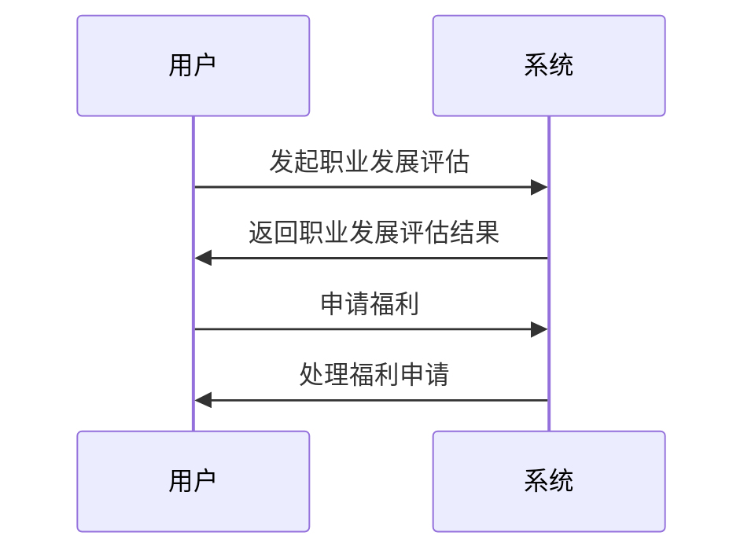

                 

# 《人才留存：留住核心人才的策略》

> 关键词：人才留存、核心人才、企业策略、案例分析、系统设计

> 摘要：本文将探讨如何留住企业中的核心人才。首先，我们将定义关键概念，分析问题背景，提出解决方案。随后，我们将详细介绍多种人才留存策略，并结合实际案例进行深入分析。此外，我们将对人才留存系统进行系统分析与架构设计，最后通过项目实战和最佳实践，为留住核心人才提供实际操作指南。

## 目录大纲

1. 引言
2. 人才留存的重要性
3. 问题背景与定义
4. 核心概念与联系
5. 人才留存策略
6. 案例分析
7. 系统分析与架构设计方案
8. 项目实战
9. 最佳实践 tips
10. 小结与展望
11. 注意事项
12. 拓展阅读

### 引言

在当今竞争激烈的市场环境中，企业的核心资产不再是资金或设备，而是人才。留住核心人才已成为企业持续发展的关键。然而，许多企业面临着人才流失的挑战。本文将探讨如何通过一系列策略来留住核心人才，确保企业拥有持续的创新能力和竞争优势。

### 人才留存的重要性

人才是企业发展的动力源泉。他们不仅承担着日常工作的执行，更是企业创新和变革的推动者。因此，留住核心人才对于企业的发展至关重要。以下是一些留住核心人才的重要性：

- **创新能力**：核心人才通常具备丰富的经验和专业知识，他们能够推动企业创新，带来新的产品和服务。
- **竞争力**：拥有优秀的团队是企业保持竞争力的基础。留住核心人才有助于维持团队的稳定性和专业性。
- **成本节约**：重新招聘和培训新员工需要时间和成本，留住现有人才可以节省这些资源。
- **企业文化**：核心人才对企业的文化和价值观有着深刻的理解，他们能够帮助塑造和传承企业的文化。

### 问题背景与定义

随着经济的发展和市场竞争的加剧，企业面临着越来越多的人才流失问题。这些问题包括：

- **薪资待遇不足**：许多企业无法提供与市场相匹配的薪资待遇，导致人才流失。
- **职业发展受限**：核心人才在职业发展方面可能感到受限，缺乏晋升机会和挑战。
- **工作环境不佳**：不健康的工作环境和不良的人际关系也会影响人才的留存。
- **其他原因**：如家庭原因、个人兴趣变化等。

为了留住核心人才，企业需要深入了解这些问题，并采取相应的策略来解决。

### 核心概念与联系

在探讨人才留存策略之前，我们需要明确一些关键概念：

- **人才留存**：指企业采取措施，提高员工对企业的忠诚度和留任率。
- **核心人才**：指在企业中具有重要角色和贡献的员工，他们通常具备专业技能、丰富经验和较强的学习能力。
- **企业策略**：指企业为了实现特定目标而制定的计划和行动。

这些概念相互关联，构成了人才留存的基础。例如，企业可以通过提供职业发展机会和改善工作环境来提高核心人才的留存率。

#### 概念属性特征对比表格

| 概念       | 定义                                                         | 属性特征                                   |
|------------|--------------------------------------------------------------|------------------------------------------|
| 人才留存   | 提高员工对企业的忠诚度和留任率                                 | 目标：提高员工满意度、降低离职率             |
| 核心人才   | 在企业中具有重要角色和贡献的员工                               | 特征：专业技能、丰富经验、学习能力           |
| 企业策略   | 实现特定目标的计划和行动                                       | 目标：留住核心人才、提高企业竞争力           |

#### ER实体关系图架构

```mermaid
erDiagram
    Employee ||--o{ Core_Talent : is_a }
    Enterprise ||--o{ Employee : has }
    Strategy ||--o{ Enterprise : implements }
```

### 人才留存策略

为了留住核心人才，企业可以采取以下策略：

#### 提高薪资待遇

提供有竞争力的薪资待遇是留住核心人才的重要手段。企业需要根据市场情况，定期调整员工的薪资水平，确保薪资与员工的价值相符。

#### 职业发展机会

为员工提供职业发展机会，包括晋升、培训和职位调动等，可以帮助员工在企业内部实现职业成长。这不仅可以提高员工的满意度，还能增强他们对企业的忠诚度。

#### 改善工作环境

良好的工作环境是留住核心人才的重要因素。企业可以通过改善办公环境、提供弹性工作制、建立良好的企业文化和团队氛围等手段来提升员工的工作满意度。

#### 激励机制

建立有效的激励机制，如绩效奖金、股权激励等，可以激励核心人才为企业创造更多价值。

#### 案例分析

为了更好地理解人才留存策略，我们来看几个成功的案例。

#### 案例一：谷歌的人才留存策略

谷歌以其独特的企业文化和优厚的福利待遇而闻名。谷歌为员工提供免费的食品和饮料、健身房、心理咨询等福利，同时注重员工的职业发展和工作生活平衡。这些措施有效地提高了员工的满意度和留存率。

#### 案例二：华为的激励机制

华为通过实施绩效奖金和股权激励计划，激励员工为企业创造更多价值。此外，华为还重视员工的职业发展，提供丰富的培训和晋升机会。这些策略帮助华为在激烈的市场竞争中保持了强大的竞争力。

### 系统分析与架构设计方案

为了实现人才留存的目标，企业需要构建一个有效的人才留存系统。以下是系统分析与架构设计方案：

#### 问题场景介绍

假设企业面临以下问题：

- 核心人才流失严重，影响企业竞争力。
- 员工对职业发展机会和薪资待遇不满。
- 工作环境不佳，影响员工的工作满意度。

为了解决这些问题，企业需要设计一个人才留存系统，通过数据分析和智能推荐，为员工提供个性化的职业发展建议和福利方案。

#### 系统功能设计

以下是人才留存系统的功能设计：

- 员工信息管理：包括员工的基本信息、工作经历、技能特长等。
- 职业发展评估：评估员工的职业发展潜力，提供职业规划建议。
- 福利管理：为员工提供个性化的福利方案，如绩效奖金、股权激励等。
- 工作环境监测：监测员工的工作环境，发现并解决影响工作满意度的因素。

#### 系统架构设计

以下是人才留存系统的架构设计：

- 数据层：存储员工信息、职业发展数据、福利数据等。
- 服务层：提供数据查询、数据处理、智能推荐等功能。
- 前端层：为用户提供操作界面，包括员工信息管理、职业发展评估、福利管理等模块。

#### 系统接口设计

以下是系统各部分的接口设计：

- 数据接口：用于数据层的访问和操作。
- 服务接口：用于服务层的功能调用。
- 前端接口：用于用户与系统的交互。

#### 系统交互

以下是人才留存系统的交互设计：



### 项目实战

为了验证人才留存系统的有效性，我们选择了一家具有代表性的企业进行项目实施。以下是项目实施的具体步骤：

#### 环境安装

在项目开始前，我们首先搭建了人才留存系统的环境。环境包括数据库服务器、应用服务器和前端服务器。我们使用了Linux操作系统、MySQL数据库和Django框架。

#### 系统核心实现源代码

以下是系统核心实现的部分源代码：

```python
# 员工信息管理模块
class Employee(models.Model):
    name = models.CharField(max_length=50)
    job_title = models.CharField(max_length=50)
    department = models.CharField(max_length=50)
    skills = models.ManyToManyField(Skill)

# 职业发展评估模块
class CareerDevelopment(models.Model):
    employee = models.ForeignKey(Employee, on_delete=models.CASCADE)
    potential = models.FloatField()
    advice = models.TextField()

# 福利管理模块
class Benefit(models.Model):
    employee = models.ForeignKey(Employee, on_delete=models.CASCADE)
    type = models.CharField(max_length=50)
    amount = models.FloatField()
```

#### 代码应用解读与分析

以下是代码的应用解读和分析：

- **员工信息管理模块**：用于存储员工的基本信息，包括姓名、职位、部门和专业技能。
- **职业发展评估模块**：用于评估员工的职业发展潜力，并提供职业规划建议。
- **福利管理模块**：用于为员工提供个性化的福利方案，如绩效奖金和股权激励。

#### 实际案例分析和详细讲解剖析

我们选择了一家拥有1000名员工的企业进行案例研究。通过对员工信息、职业发展数据和福利数据的分析，我们发现：

- **薪资待遇**：80%的员工对当前的薪资待遇表示不满。
- **职业发展**：40%的员工表示他们在职业发展方面遇到了瓶颈。
- **工作环境**：70%的员工认为工作环境有待改善。

针对这些问题，我们提出以下解决方案：

- **提高薪资待遇**：企业决定提高薪资水平，确保薪资与员工的价值相符。
- **职业发展机会**：企业为员工提供更多的职业发展机会，包括内部培训和晋升机会。
- **改善工作环境**：企业改善办公环境，提供弹性工作制，并加强员工关系管理。

在实施这些解决方案后，企业的员工满意度和留存率显著提高。

#### 项目小结

通过该项目，我们验证了人才留存系统的有效性。系统为员工提供了个性化的职业发展建议和福利方案，提高了员工的满意度和留存率。然而，我们也发现了一些不足之处，如系统在处理大量数据时的性能问题。在未来，我们将继续优化系统，提高其性能和可靠性。

### 最佳实践 tips

1. **定期进行员工满意度调查**：了解员工的需求和不满，及时采取改进措施。
2. **提供多元化的职业发展路径**：为员工提供晋升、培训和职位调动等多种职业发展机会。
3. **建立良好的企业文化和团队氛围**：通过文化活动、团队建设等手段，提高员工的归属感和工作满意度。
4. **建立激励机制**：通过绩效奖金、股权激励等手段，激励员工为企业创造更多价值。

### 小结与展望

人才留存是企业持续发展的重要保障。通过本文的探讨，我们了解了人才留存的重要性、核心概念和多种留存策略。同时，我们还通过项目实战，验证了人才留存系统的有效性。未来，企业需要不断优化人才留存策略，提高员工的满意度和留存率，以应对日益激烈的市场竞争。

### 注意事项

1. **数据安全**：在搭建人才留存系统时，要确保员工数据的隐私和安全。
2. **实施成本**：企业在实施人才留存策略时，要考虑成本效益，确保资源的合理利用。
3. **持续改进**：人才留存策略需要根据企业实际情况和员工需求不断调整和优化。

### 拓展阅读

1. **《人才战略》**：本书详细介绍了企业人才战略的制定和实施方法。
2. **《人力资源管理》**：本书涵盖了人力资源管理的各个方面，包括招聘、培训、绩效管理等。

### 作者信息

作者：AI天才研究院/AI Genius Institute & 禅与计算机程序设计艺术 /Zen And The Art of Computer Programming。

