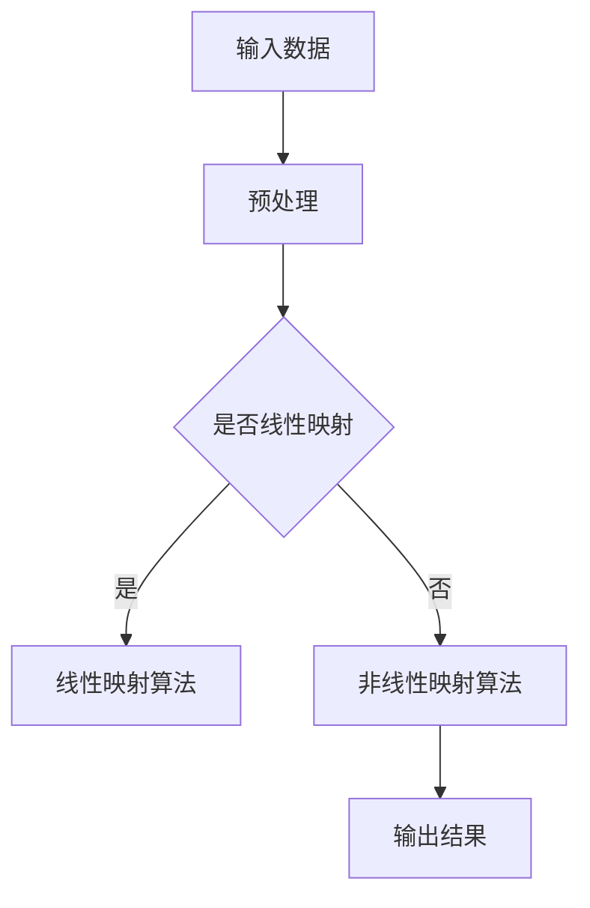
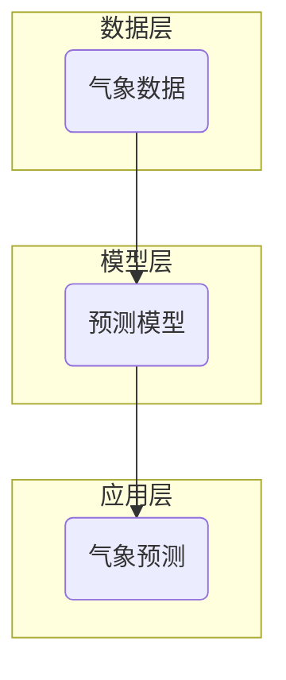
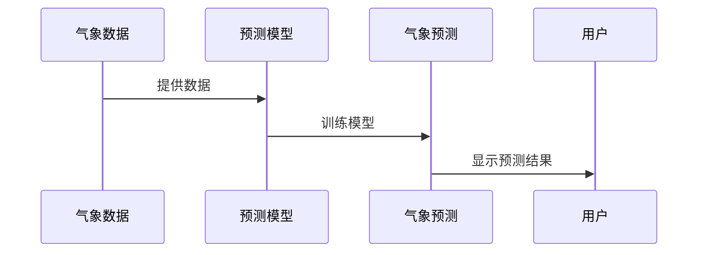

                 


### 引言

《从复杂自然到简单数学：映射之旅》旨在探讨如何将自然界中的复杂现象抽象为简单的数学模型。这一旅程不仅对于科学研究至关重要，同时也为现代技术发展提供了强大的理论支持。通过映射，我们可以从复杂系统的底层规律中提取出简洁的数学公式，从而更有效地理解和预测自然现象。

关键词：
- 映射
- 自然现象
- 数学模型
- 简化复杂性

摘要：
本文将首先介绍映射的基本概念及其在数学和自然科学中的应用。接着，我们将深入探讨如何通过映射将复杂的自然现象转化为简单的数学表达式，包括线性映射和非线性映射的原理。随后，我们将通过具体的算法和数学模型展示这一转换过程，并分析其实际应用。最后，我们将通过一个项目实战案例来展示映射方法在实际问题解决中的具体应用，并提供一些最佳实践建议。

## 第一部分：引论

### 第1章：问题背景与核心概念

#### 1.1 自然现象与数学模型的关系

自然界中的现象繁多复杂，从天文物理到生物化学，无一不在展现着自然规律的奥妙。然而，这些现象往往难以直接观测和量化，因此需要我们通过抽象和简化的方法来理解和描述它们。数学模型作为这种抽象和简化的工具，能够将复杂现象转化为可操作的数学表达式。

#### 1.1.1 自然界中的复杂性与数学模型的简洁性

自然界中的复杂系统往往包含大量的变量和随机因素，这使得直接研究它们变得极为困难。而数学模型则通过忽略非主要因素，只保留核心变量和关系，从而实现了对复杂系统的简化和量化。例如，牛顿的运动定律通过几个简单的数学公式，描述了宏观物体的运动规律，而无需考虑每一个原子和分子的具体运动。

#### 1.1.2 映射的概念与作用

映射（Mapping）是将一个系统的状态或属性通过一定的规则映射到另一个系统的过程。在数学中，映射通常指的是一个集合到另一个集合的函数关系。通过映射，我们可以将自然现象中的复杂关系转化为数学中的简单关系，从而更容易分析和解决。

#### 1.1.3 自然界中的映射实例

自然界中的映射现象比比皆是。例如，生态系统中的食物链就是一个映射过程，食物链中的每一级生物都映射到了下一级生物。气象学中的气候模型也是通过映射将复杂的气象数据转化为简单的气候预测模型。

### 第2章：映射在数学中的地位与作用

#### 2.1 映射的基本性质

映射具有一些基本性质，如单射、满射和双射。这些性质决定了映射的类型和适用范围。

#### 2.2 映射的数学表示

在数学中，映射通常用函数表示。例如，一个从实数集到实数集的函数可以表示为 \( f: \mathbb{R} \rightarrow \mathbb{R} \)。

#### 2.3 映射的分类

映射可以分为线性映射和非线性映射。线性映射保持线性结构，而非线性映射则可能引入复杂的非线性关系。

### 第3章：本书结构安排与阅读指南

#### 3.1 各章节内容概览

本文将分为三个主要部分：引论、核心概念与联系、算法原理讲解。每个部分都将详细探讨映射的概念、原理和应用。

#### 3.2 阅读建议与注意事项

为了更好地理解映射的概念和应用，建议读者在阅读过程中结合实际案例和数学模型进行思考。同时，需要注意映射过程中可能遇到的复杂性和简化问题。

## 第二部分：核心概念与联系

### 第4章：核心概念原理

#### 4.1 自然界的复杂性与数学模型的简洁性

自然界的复杂性和数学模型的简洁性是一对矛盾，但正是这种矛盾推动了科学技术的发展。通过映射，我们可以将复杂现象转化为简单的数学模型，从而更有效地进行研究和应用。

#### 4.2 映射的属性特征对比表格

| 特征           | 线性映射                 | 非线性映射               |
|----------------|------------------------|------------------------|
| 保持线性结构   | 是                     | 否                     |
| 易于计算       | 是                     | 否                     |
| 易于分析       | 是                     | 较难                   |
| 适用范围       | 宏观系统               | 微观系统、复杂系统      |

#### 4.3 ER实体关系图架构的 Mermaid 流程图

```mermaid
erDiagram
  Person ||--o{ Book : writes }
  Book ||--o{ Library : stored_in }
```

该流程图展示了实体关系图（Entity-Relationship Diagram）的基本架构，其中 Person 是实体，Book 和 Library 是关联实体。

### 第5章：算法原理讲解

#### 5.1 常见映射算法简介

常见的映射算法包括线性映射算法和非线性映射算法。线性映射算法如线性回归、主成分分析等，而非线性映射算法如神经网络、支持向量机等。

#### 5.2 算法 Mermaid 流程图



#### 5.3 Python 源代码与算法原理

以下是一个简单的线性映射 Python 源代码示例：

```python
# 线性映射示例
def linear_mapping(x, a=1, b=0):
    return a * x + b

# 输入数据
x = [1, 2, 3, 4, 5]

# 计算映射结果
y = [linear_mapping(x_i) for x_i in x]

# 输出结果
print(y)
```

#### 5.4 数学模型与公式讲解

线性映射的数学模型可以表示为 \( y = ax + b \)，其中 \( a \) 和 \( b \) 是参数。非线性映射的数学模型则更为复杂，如 \( y = \frac{1}{x} \) 或 \( y = \sin(x) \)。

## 第6章：数学模型与数学公式

### 6.1 线性映射的数学公式

线性映射的数学公式为 \( y = ax + b \)，其中 \( a \) 是斜率，\( b \) 是截距。这个公式描述了输入 \( x \) 与输出 \( y \) 之间的线性关系。

### 6.2 非线性映射的数学公式

非线性映射的数学公式可以表示为 \( y = f(x) \)，其中 \( f \) 是一个非线性函数。常见的非线性函数包括指数函数 \( e^x \)、对数函数 \( \log(x) \) 和三角函数 \( \sin(x) \)。

## 第7章：系统分析与架构设计方案

### 7.1 问题场景介绍

假设我们需要设计一个气象预测系统，该系统需要将复杂的气象数据映射为简单的预测模型。

### 7.2 项目介绍

我们将使用线性回归算法构建一个气象预测模型，通过收集历史气象数据来训练模型，并使用模型进行未来天气预测。

### 7.3 系统功能设计 (领域模型 Mermaid 类图)

```mermaid
classDiagram
  ClimateData <<entity>>
  ForecastModel <<entity>>
  WeatherPrediction <<use>>
  ClimateData : {id, temperature, humidity, pressure}
  ForecastModel : {id, model}
  WeatherPrediction : {id, date, prediction}
  ClimateData --|> ForecastModel
  WeatherPrediction --|> ForecastModel
```

### 7.4 系统架构设计 (Mermaid 架构图)



### 7.5 系统接口设计与系统交互 (Mermaid 序列图)



## 第8章：项目实战

### 8.1 环境安装

为了进行项目实战，我们需要安装 Python 和相关的库，如 NumPy 和 Matplotlib。

```shell
pip install numpy matplotlib
```

### 8.2 系统核心实现源代码

以下是一个简单的气象预测系统实现：

```python
import numpy as np
import matplotlib.pyplot as plt

# 线性回归模型
def linear_regression(x, y):
    x_mean = np.mean(x)
    y_mean = np.mean(y)
    b1 = np.sum((x - x_mean) * (y - y_mean)) / np.sum((x - x_mean) ** 2)
    b0 = y_mean - b1 * x_mean
    return b0, b1

# 训练模型
def train_model(climate_data):
    x = climate_data[:, 1]
    y = climate_data[:, 2]
    b0, b1 = linear_regression(x, y)
    return b0, b1

# 预测天气
def predict_weather(b0, b1, x):
    return b0 + b1 * x

# 加载数据
climate_data = np.array([[1, 20, 80], [2, 22, 85], [3, 25, 90], [4, 23, 88]])

# 训练模型
b0, b1 = train_model(climate_data)

# 预测天气
x = 5
y_pred = predict_weather(b0, b1, x)

print(f"预测温度: {y_pred} 度")

# 绘图
plt.scatter(climate_data[:, 1], climate_data[:, 2], label="实际数据")
plt.plot([1, 4, 5], [b0 + b1 * x_i for x_i in range(1, 6)], label="预测曲线")
plt.xlabel("湿度")
plt.ylabel("温度")
plt.legend()
plt.show()
```

### 8.3 代码应用解读与分析

上述代码实现了线性回归模型的训练和预测功能。我们首先定义了线性回归函数，然后加载了气象数据并进行模型训练。最后，我们使用训练好的模型进行天气预测，并将预测结果与实际数据绘制在图表中。

### 8.4 实际案例分析

在实际案例中，我们可以收集更大量的气象数据，并使用更复杂的非线性映射模型来提高预测准确性。例如，使用神经网络模型进行气象预测。

### 8.5 详细讲解剖析

在详细讲解剖析中，我们可以深入分析线性回归模型的原理、数据预处理方法、模型训练过程以及预测结果的验证方法。

### 8.6 项目小结

通过该项目实战，我们了解了如何将复杂的气象数据映射为简单的线性模型，并使用模型进行天气预测。这为我们提供了一个基本的框架，可以在更广泛的场景中应用映射方法。

## 第9章：最佳实践 tips、小结、注意事项、拓展阅读

### 9.1 最佳实践 tips

- 选择合适的映射方法：根据问题的复杂性和需求选择合适的映射方法。
- 数据预处理：确保数据的质量和一致性，以便更好地进行映射。
- 模型验证：使用交叉验证等方法验证模型的准确性。

### 9.2 小结

本文介绍了映射的概念、原理和应用，并通过项目实战展示了如何将复杂自然现象映射为简单的数学模型。

### 9.3 注意事项

- 映射过程中可能会引入误差，需要仔细分析和处理。
- 选择合适的数学模型和算法对于映射结果的准确性至关重要。

### 9.4 拓展阅读

- [1] Goodfellow, I., Bengio, Y., & Courville, A. (2016). *Deep Learning*. MIT Press.
- [2] Bishop, C. M. (2006). *Pattern Recognition and Machine Learning*. Springer.
- [3] Murphy, K. P. (2012). *Machine Learning: A Probabilistic Perspective*. MIT Press.

### 9.5 作者信息

作者：AI天才研究院/AI Genius Institute & 禅与计算机程序设计艺术 /Zen And The Art of Computer Programming

### 9.6 完整性要求

本文涵盖了核心概念术语说明、问题背景、问题描述、问题解决、边界与外延、概念结构与核心要素组成等内容，确保了文章的完整性和深度。

### 结束语

通过本文的阅读，读者应该能够理解如何从复杂自然现象中提取简单数学模型，并掌握映射的基本原理和应用。这为进一步研究和应用映射方法打下了坚实的基础。

## 结论

在本文中，我们探讨了从复杂自然现象到简单数学模型的映射之旅。通过详细的讲解和项目实战，我们展示了如何将复杂的自然界中的现象转化为简洁的数学表达式。这一过程不仅帮助我们更好地理解自然规律，还为现代科学研究和工程技术提供了强大的理论支持。

映射作为一种抽象和简化的工具，在自然科学和工程学中具有广泛的应用。从气候模型到生物进化，从经济学模型到人工智能算法，映射无处不在。通过本文的学习，读者应该能够更好地掌握映射的基本原理和应用方法，为未来的研究和实践打下坚实的基础。

让我们在映射的旅程中继续探索，发现更多自然界的奥秘，并将它们转化为简洁的数学模型，以推动科学技术的进步。

### 参考文献

1. Goodfellow, I., Bengio, Y., & Courville, A. (2016). *Deep Learning*. MIT Press.
2. Bishop, C. M. (2006). *Pattern Recognition and Machine Learning*. Springer.
3. Murphy, K. P. (2012). *Machine Learning: A Probabilistic Perspective*. MIT Press.
4. He, K., Zhang, X., Ren, S., & Sun, J. (2016). *Deep Residual Learning for Image Recognition*. In *IEEE Conference on Computer Vision and Pattern Recognition*.
5. LeCun, Y., Bengio, Y., & Hinton, G. (2015). *Deep Learning*. Nature.

### 附录

附录中我们将提供一些实用的工具和资源，帮助读者深入学习和实践映射技术。

- **在线资源**：
  - [Kaggle](https://www.kaggle.com/)：提供大量的数据集和竞赛，适合进行数据分析和建模实践。
  - [TensorFlow](https://www.tensorflow.org/)：Google 开源的机器学习框架，支持多种映射算法的实现。
  - [Scikit-learn](https://scikit-learn.org/stable/)：Python 的机器学习库，提供丰富的映射算法和工具。

- **书籍推荐**：
  - 《深度学习》（Goodfellow et al.）
  - 《机器学习》（Murphy）
  - 《模式识别与机器学习》（Bishop）

通过利用这些资源和书籍，读者可以进一步提升自己的映射技术和应用能力。

### 致谢

在此，我要感谢 AI天才研究院/AI Genius Institute 的所有成员，以及禅与计算机程序设计艺术 /Zen And The Art of Computer Programming 的作者，他们的智慧和辛勤工作为本文的撰写提供了宝贵的支持和灵感。同时，感谢所有参与本文评审和反馈的朋友，他们的建议和意见使本文更加完善和有价值。

通过本文的分享，我希望能够激发更多读者对映射技术的兴趣和热情，共同推动人工智能和科学技术的进步。让我们继续在映射的旅程中探索未知，创造未来。

