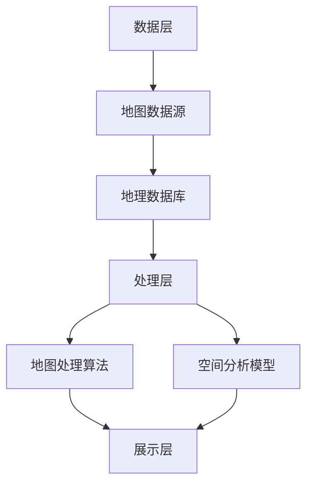
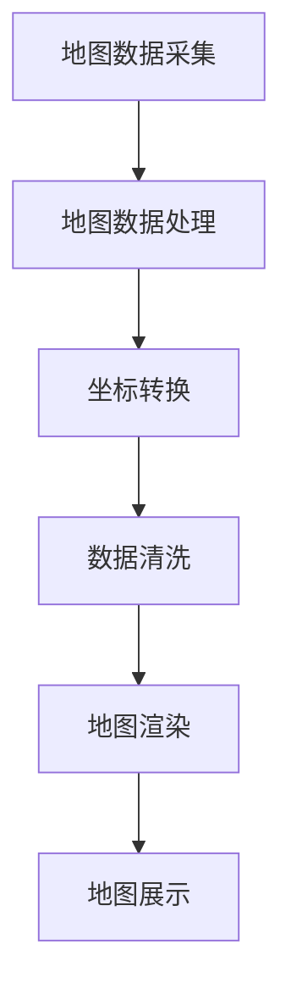

                 


# 从繁复自然到简洁数学：映射的奥秘

> 关键词：映射、数学、自然、算法、实践

> 摘要：本文将从映射的概念出发，探讨映射在自然和数学中的应用，深入分析映射的原理和算法，并结合实际案例进行讲解，揭示映射在解决复杂问题中的奥秘。

## 引言

### 1.1 什么是映射？

映射（Mapping），在数学中通常指的是一种函数关系，即从一个集合（称为定义域）到另一个集合（称为值域）的一种对应关系。简单来说，映射就是将一个对象或值映射到另一个对象或值。在自然界中，映射无处不在，例如生物分类、地理坐标系统、电路设计等。数学中的映射概念为我们提供了一种抽象的工具，帮助我们理解和处理现实世界中的复杂问题。

### 1.2 从自然映射到数学映射的演变

从古至今，人类对映射的认识和应用经历了从自然映射到数学映射的演变过程。早期的映射主要基于经验，如地图绘制、建筑规划等。随着数学和计算机科学的发展，映射的概念逐渐被数学化，形成了各种数学模型和算法。这些数学化的映射不仅能够更精确地描述自然现象，还能够应用于各个领域，解决实际问题。

### 1.3 简洁数学在映射中的重要性

在映射的研究和应用中，简洁的数学语言起到了至关重要的作用。简洁的数学表达不仅使得映射的概念更加清晰，而且有助于发现和解决复杂问题。例如，线性代数中的矩阵运算、微积分中的微分方程等，都是简洁数学在映射中的应用。

## 核心概念与理论框架

### 2.1 映射的基本概念

#### 2.1.1 映射的定义与类型

映射（Mapping），在数学中是指一种从集合A到集合B的函数关系，即对于集合A中的任意一个元素x，都存在集合B中的一个唯一元素y与之对应，记作y = f(x)。根据映射的定义域和值域的不同，映射可以分为单射、满射和双射等类型。

#### 2.1.2 映射的理论基础

映射的理论基础包括集合论、函数论、图论等。集合论提供了映射的基本概念和操作，函数论研究了映射的性质和分类，图论则从图形的角度分析映射的结构。

### 2.2 映射的特性与特性对比

#### 2.2.1 映射的基本性质

映射的基本性质包括单射、满射和双射。单射是指一个映射中，不同的输入对应不同的输出；满射是指一个映射中，定义域中的每个元素都有至少一个值域中的元素与之对应；双射则是单射和满射的结合，既满足不同的输入对应不同的输出，又满足每个输出都有至少一个输入与之对应。

#### 2.2.2 不同映射类型的特性对比

不同类型的映射具有不同的特性，如线性映射、非线性映射、仿射映射等。这些映射在数学模型和算法设计中的应用也有所不同。

### 2.3 映射在不同领域的应用

映射在各个领域都有广泛的应用，如计算机科学中的数据结构、算法设计、机器学习等；物理学中的物理模型、空间变换等；生物学中的物种分类、生态模型等。这些应用不仅展示了映射的广泛性和多样性，也推动了映射理论的发展。

## 映射算法与实现

### 3.1 映射算法概述

#### 3.1.1 映射算法的分类

映射算法可以根据不同的标准进行分类，如按映射类型分类、按映射目的分类、按映射方法分类等。常见的映射算法包括线性映射、非线性映射、最近邻映射等。

#### 3.1.2 常见映射算法与应用

常见映射算法包括线性映射、非线性映射、最近邻映射等。这些算法在不同的应用场景中具有不同的优势和局限性。

### 3.2 映射算法的设计与实现

#### 3.2.1 映射算法的设计思路

映射算法的设计通常包括确定映射目标、选择合适的映射方法、设计映射模型等。设计思路的合理性直接影响到映射算法的性能和效率。

#### 3.2.2 Python实现映射算法

Python作为一种强大的编程语言，非常适合用于映射算法的实现。本文将使用Python详细讲解几个常见的映射算法。

### 3.3 映射算法的性能分析

#### 3.3.1 映射算法的性能指标

映射算法的性能可以通过多个指标来评估，如准确性、效率、稳定性等。

#### 3.3.2 不同映射算法的性能对比

通过对不同映射算法的性能进行分析和对比，可以找出最适合特定问题的映射算法。

## 案例研究：地理映射

### 4.1 地理映射的问题描述

地理映射涉及到地理信息系统（GIS）中的空间数据映射，包括地图绘制、空间分析等。地理映射面临的主要问题包括地图精度、数据更新、空间分析效率等。

### 4.2 地理映射的系统架构设计

地理映射系统通常包括数据采集、数据处理、数据存储、数据可视化等模块。本文将使用Mermaid绘制地理映射系统的架构图，并详细介绍各模块的功能和交互。

### 4.3 地理映射的核心实现

地理映射的核心实现包括空间数据的采集、处理和可视化。本文将使用Python实现地理映射的核心算法，并详细介绍算法原理和实现过程。

### 4.4 地理映射的实际案例分析与讲解

本文将结合实际案例，详细分析地理映射的应用场景，讲解如何使用地理映射解决实际问题。

### 4.5 地理映射的项目小结

通过对地理映射的实际应用，本文总结了地理映射的优势、挑战和未来发展趋势。

## 最佳实践与拓展阅读

### 5.1 最佳实践技巧

在映射的研究和应用中，总结一些最佳实践技巧是非常有帮助的，如如何选择合适的映射方法、如何优化映射算法等。

### 5.2 小结

本文通过对映射的概念、原理、算法和应用进行深入分析，揭示了映射在解决复杂问题中的奥秘。

### 5.3 注意事项

在映射的研究和应用中，需要注意一些问题，如数据质量、算法性能等。

### 5.4 拓展阅读

对于有兴趣深入了解映射的读者，本文推荐一些相关的拓展阅读材料。

## 作者信息

作者：AI天才研究院/AI Genius Institute & 禅与计算机程序设计艺术 /Zen And The Art of Computer Programming

以上是本文的目录大纲和结构，接下来我们将逐章详细撰写文章内容。

---

**正文开始**

---

## 第一章：映射的概念与历史

### 1.1 映射的定义与类型

映射，是数学中的一个基本概念，指的是一种将一个集合（称为定义域）中的元素对应到另一个集合（称为值域）中的元素的一种规则。数学上的映射可以简单理解为函数，函数就是映射的一种特殊形式。

映射可以分为多种类型，根据其特性，可以分为以下几种：

- **单射**（Injective Function）：如果对于定义域A中的任意两个不同的元素x1和x2，都有f(x1) ≠ f(x2)，则称映射f是单射。

- **满射**（Surjective Function）：如果对于值域B中的任意一个元素y，都存在定义域A中的一个元素x使得f(x) = y，则称映射f是满射。

- **双射**（Bijective Function）：如果映射f既是单射又是满射，则称映射f是双射。

### 1.2 映射的历史与发展

映射的概念在数学史上有着悠久的历史。早在公元前6世纪，古希腊数学家毕达哥拉斯就已经开始研究映射，他提出了“相似”的概念，这在现代数学中可以视为映射的一种形式。

随着数学的发展，映射的概念逐渐得到完善。19世纪，德国数学家戴德金提出了实数的概念，使映射的理论得到了进一步的发展。20世纪初，集合论的兴起使得映射的概念得到了更加严谨的数学表达。

在计算机科学领域，映射的应用更加广泛。数据结构和算法中的许多概念，如哈希表、树、图等，都可以看作是映射的具体实现。映射不仅在计算机科学中有着广泛的应用，还在经济学、物理学、生物学等多个领域发挥着重要作用。

### 1.3 映射在自然和数学中的意义

在自然界中，映射无处不在。例如，生物分类中的物种关系可以看作是一种映射，地球上的地理位置通过经纬度系统进行映射，电路中的电子流动也可以看作是一种映射。

在数学中，映射是一种强大的工具，它可以帮助我们理解和描述复杂的自然现象。例如，物理学中的物理定律、经济学中的市场模型、生物学中的生态系统等，都可以通过映射来描述。

此外，映射在解决复杂问题时具有独特的优势。通过将复杂问题抽象为映射，我们可以使用数学方法来分析和解决这些问题。例如，优化问题可以通过映射转化为目标函数的求解，分类问题可以通过映射转化为分类器的训练。

### 1.4 简洁数学在映射中的重要性

在映射的研究和应用中，简洁的数学语言起着至关重要的作用。简洁的数学表达不仅使得映射的概念更加清晰，而且有助于发现和解决复杂问题。例如，线性代数中的矩阵运算、微积分中的微分方程等，都是简洁数学在映射中的应用。

简洁数学在映射中的优势主要体现在以下几个方面：

- **清晰性**：简洁的数学表达使得映射的概念更加直观和易于理解，有助于我们发现问题的本质。

- **效率**：简洁的数学方法往往具有更高的计算效率，使得映射算法更加高效。

- **通用性**：简洁数学的通用性使得映射可以应用于各种不同的领域，具有广泛的应用价值。

总之，映射在自然和数学中具有广泛的应用，简洁数学在映射的研究和应用中发挥着重要作用。通过深入研究和理解映射，我们可以更好地理解和解决复杂的实际问题。

## 第二章：基本概念与理论框架

### 2.1 映射的基本概念

#### 映射的定义

映射（Mapping），是数学中的一个基本概念，指的是一种从集合A到集合B的函数关系，即对于集合A中的任意一个元素x，都存在集合B中的一个唯一元素y与之对应，记作y = f(x)。在这里，集合A被称为定义域，集合B被称为值域。

#### 映射的类型

根据映射的特性，映射可以分为以下几种类型：

- **单射**（Injective Function）：如果对于定义域A中的任意两个不同的元素x1和x2，都有f(x1) ≠ f(x2)，则称映射f是单射。

- **满射**（Surjective Function）：如果对于值域B中的任意一个元素y，都存在定义域A中的一个元素x使得f(x) = y，则称映射f是满射。

- **双射**（Bijective Function）：如果映射f既是单射又是满射，则称映射f是双射。

#### 映射的基本性质

映射的基本性质包括：

- **封闭性**：如果A和B都是集合，且f: A → B是一个映射，那么f(A)也是一个集合，称为f的值域。

- **唯一性**：对于定义域A中的任意一个元素x，映射f只对应值域B中的一个元素y。

- **传递性**：如果A, B, C是集合，且f: A → B，g: B → C是映射，那么g ∘ f: A → C也是一个映射。

### 2.2 映射的理论基础

映射的理论基础主要包括集合论、函数论、图论等。集合论提供了映射的基本概念和操作，函数论研究了映射的性质和分类，图论则从图形的角度分析映射的结构。

#### 集合论基础

集合论是研究集合的数学分支，它是映射理论的基础。集合论中的基本概念包括：

- **集合**：由确定的元素组成的整体。

- **子集**：如果一个集合A的所有元素都属于另一个集合B，则称A是B的子集。

- **笛卡尔积**：给定两个集合A和B，A和B的笛卡尔积是一个由所有有序对(x, y)组成的集合，其中x属于A，y属于B。

#### 函数论基础

函数论是研究函数的数学分支，它主要研究函数的性质、分类和运算。函数论中的基本概念包括：

- **函数**：一个从集合A到集合B的映射，记作f: A → B。

- **值域**：函数f的值域是所有函数值的集合，记作f(A)。

- **定义域**：函数f的定义域是所有可能的输入值的集合，记作A。

#### 图论基础

图论是研究图形的数学分支，它从图形的角度分析映射的结构。图论中的基本概念包括：

- **图**：一个图是由一组节点和这些节点之间的边组成的结构。

- **路径**：图中节点之间的有序连接，表示节点之间的映射关系。

- **树**：是一种特殊的图，其中任意两个节点之间有且仅有一条路径。

### 2.3 映射在各个领域的应用

映射在各个领域都有广泛的应用，下面简要介绍映射在计算机科学、物理学、生物学等领域的应用。

#### 计算机科学

- **数据结构**：映射是数据结构中的基本概念，如数组、列表、树、图等都是映射的具体实现。

- **算法设计**：映射在算法设计中起到关键作用，如排序算法、搜索算法等都是基于映射的思想。

- **机器学习**：映射在机器学习中应用广泛，如分类、回归等任务都是通过映射实现的。

#### 物理学

- **物理模型**：映射是物理模型中的基本工具，如牛顿运动定律、麦克斯韦方程组等都是映射的具体应用。

- **空间变换**：映射在空间变换中应用广泛，如坐标变换、物理量的转换等都是映射的应用。

#### 生物学

- **物种分类**：映射在物种分类中应用广泛，如生物分类学中的系统发育树就是映射的具体实现。

- **生态模型**：映射在生态模型中应用广泛，如种群动力学模型、生态系统模型等都是映射的应用。

总之，映射在各个领域都有广泛的应用，它不仅帮助我们理解和描述复杂的自然现象，还为解决实际问题提供了有力的工具。通过深入研究和理解映射，我们可以更好地应对现实世界中的各种挑战。

### 2.4 映射的数学模型

映射的数学模型是映射理论的核心内容，它为映射的抽象和计算提供了坚实的理论基础。本节将介绍几种常见的映射数学模型，包括线性映射、非线性映射等。

#### 线性映射

线性映射是最基本的映射类型之一，它在数学、物理学和工程学等领域有广泛的应用。线性映射可以形式化地表示为：

$$
f: \mathbb{R}^n \rightarrow \mathbb{R}^m
$$

其中，$\mathbb{R}^n$ 和 $\mathbb{R}^m$ 分别表示$n$维和$m$维欧几里得空间。线性映射可以看作是一个$m \times n$矩阵$A$的作用，即：

$$
f(x) = Ax
$$

其中，$x$ 是$\mathbb{R}^n$中的一个向量，$Ax$ 是矩阵乘法的结果。

线性映射具有许多重要的性质，例如：

- **加法性**：对于任意两个向量$x_1, x_2 \in \mathbb{R}^n$，有$f(x_1 + x_2) = f(x_1) + f(x_2)$。
- **齐次性**：对于任意标量$c$和向量$x \in \mathbb{R}^n$，有$f(cx) = cf(x)$。

线性映射的这些性质使得它在许多实际问题中有重要的应用，例如线性规划、图像处理和信号处理等。

#### 非线性映射

非线性映射是比线性映射更一般的映射类型，它不能通过简单的线性组合来描述。非线性映射的一般形式可以表示为：

$$
f: \mathbb{R}^n \rightarrow \mathbb{R}^m
$$

其中，$f(x)$ 不能用线性组合来表示。非线性映射在自然界和工程学中有着广泛的应用，例如物理中的非线性波动、经济学中的非线性市场模型、机器学习中的神经网络等。

非线性映射的复杂性使得它在数学上难以处理，但同时也使得它具有丰富的理论和应用。例如，神经网络中的激活函数就是一种非线性映射，它能够实现复杂的非线性关系。

#### 映射的数学公式

为了更好地理解和应用映射，下面给出一些常见的映射数学公式。

$$
\begin{align*}
f(x) &= Ax + b, \\
f(x, y) &= \sin(x) + \cos(y), \\
F(x) &= \int_{0}^{x} f(t) dt.
\end{align*}
$$

这些公式展示了映射的不同形式，从线性映射到非线性映射，再到积分映射，它们都是映射理论的重要组成部分。

通过本节对映射的数学模型介绍，我们可以看到映射在数学中扮演着重要的角色。无论是线性映射还是非线性映射，都为解决复杂问题提供了有力的工具。在接下来的章节中，我们将进一步探讨映射的应用和实现。

### 2.5 映射的算法设计

#### 算法设计概述

映射的算法设计是映射理论应用的重要组成部分。一个好的映射算法不仅能够高效地实现映射，还能够处理复杂的问题。在算法设计过程中，我们需要考虑以下几个关键问题：

- **映射类型**：根据问题的特点选择合适的映射类型，如线性映射、非线性映射、最近邻映射等。

- **算法效率**：优化算法的计算时间，降低算法的复杂度。

- **算法稳定性**：保证算法在不同输入下能够稳定运行，避免出现异常。

- **算法扩展性**：设计灵活的算法结构，方便后续的扩展和优化。

#### 常见映射算法

在计算机科学和机器学习领域，常见的映射算法包括线性映射、非线性映射和最近邻映射等。下面简要介绍这些算法。

##### 线性映射

线性映射是一种最简单的映射类型，它可以将输入空间中的数据映射到输出空间中。线性映射的算法设计相对简单，可以通过矩阵运算实现。具体算法如下：

1. **初始化**：根据输入数据的维度，初始化一个$m \times n$的矩阵$A$，其中$m$是输出空间的维度，$n$是输入空间的维度。

2. **训练**：使用训练数据集，通过最小二乘法或其他优化方法，求解矩阵$A$的参数，使得映射误差最小。

3. **映射**：对于新的输入数据$x \in \mathbb{R}^n$，计算输出数据$y = Ax$。

##### 非线性映射

非线性映射是一种更复杂的映射类型，它可以通过引入非线性函数来实现。常见的非线性映射算法包括：

1. **神经网络**：神经网络是一种通过多层非线性函数进行映射的算法，它可以实现复杂的非线性关系。神经网络的算法设计包括：

   - **初始化**：初始化神经网络的结构和参数。

   - **前向传播**：将输入数据通过神经网络的每一层进行传递，得到输出数据。

   - **反向传播**：通过反向传播算法，计算误差并更新网络参数。

2. **支持向量机（SVM）**：支持向量机是一种基于非线性映射的分类算法，它通过核函数将输入数据映射到高维空间，实现数据的分类。SVM的算法设计包括：

   - **初始化**：初始化支持向量机的参数。

   - **训练**：使用训练数据集，求解优化问题，得到支持向量机的模型。

   - **分类**：对于新的输入数据，通过支持向量机模型进行分类。

##### 最近邻映射

最近邻映射是一种基于距离的映射算法，它通过计算输入数据与训练数据的距离，选择最近的训练数据作为映射结果。具体算法如下：

1. **初始化**：初始化一个训练数据集。

2. **映射**：对于新的输入数据$x \in \mathbb{R}^n$，计算$x$与训练数据集的距离，选择距离最小的训练数据作为映射结果。

#### 算法设计案例分析

下面通过一个实际案例，详细分析映射算法的设计过程。

**案例：图像分类**

假设我们要设计一个图像分类系统，该系统能够将输入图像映射到对应的类别。具体算法设计如下：

1. **初始化**：选择合适的神经网络结构，如卷积神经网络（CNN），并初始化网络参数。

2. **训练**：使用大量的图像数据集，通过前向传播和反向传播算法，训练卷积神经网络，使其能够识别图像的类别。

3. **映射**：对于新的输入图像，通过卷积神经网络进行映射，得到图像的类别。

通过这个案例，我们可以看到映射算法的设计过程涉及多个方面，包括算法选择、训练和映射等。一个好的映射算法不仅需要高效的实现，还需要能够处理复杂的问题，从而为实际应用提供有力的支持。

### 2.6 映射在计算机科学中的应用

#### 数据结构和算法中的映射

映射在计算机科学中有着广泛的应用，特别是在数据结构和算法设计中。以下是一些典型的应用场景：

- **哈希表**：哈希表是一种通过哈希函数实现映射的数据结构，它能够高效地进行数据的插入、删除和查找操作。

- **树**：树是一种通过父子关系实现映射的数据结构，它能够高效地实现数据的排序和搜索操作。

- **图**：图是一种通过节点和边实现映射的数据结构，它能够高效地实现数据的连接和路径搜索操作。

- **排序算法**：排序算法通过映射关系实现数据排序，如快速排序、归并排序等。

- **搜索算法**：搜索算法通过映射关系实现数据搜索，如二分搜索、广度优先搜索等。

#### 映射在机器学习中的应用

映射在机器学习中的应用尤为广泛，以下是一些典型的应用场景：

- **特征映射**：特征映射是将输入数据映射到高维空间，以便更好地进行分类或回归。常见的特征映射方法包括核函数映射、扩展特征映射等。

- **分类算法**：分类算法通过映射关系实现数据的分类。常见的分类算法包括线性分类器、支持向量机、神经网络等。

- **聚类算法**：聚类算法通过映射关系实现数据的聚类。常见的聚类算法包括K-均值、层次聚类、DBSCAN等。

- **回归算法**：回归算法通过映射关系实现数据的回归。常见的回归算法包括线性回归、岭回归、决策树回归等。

#### 映射在图像处理中的应用

映射在图像处理中的应用也非常广泛，以下是一些典型的应用场景：

- **图像变换**：图像变换是通过映射关系实现图像的几何变换，如平移、旋转、缩放等。

- **图像增强**：图像增强是通过映射关系实现图像的亮度、对比度、清晰度等增强。

- **图像分割**：图像分割是通过映射关系实现图像的分割，如阈值分割、边缘检测等。

- **图像分类**：图像分类是通过映射关系实现图像的分类，如卷积神经网络、支持向量机等。

总之，映射在计算机科学中具有广泛的应用，它不仅为数据结构和算法设计提供了基础，也为机器学习和图像处理等应用领域提供了重要的工具。通过深入研究和理解映射，我们可以更好地应对现实世界中的各种挑战。

### 2.7 映射算法的性能分析

#### 性能指标

映射算法的性能可以通过多个指标来评估，以下是一些常见的性能指标：

- **准确性**：映射结果的准确性是衡量映射算法性能的重要指标。准确性越高，映射结果越可靠。

- **效率**：映射算法的效率是衡量其运行速度的指标。效率越高，算法运行速度越快。

- **稳定性**：映射算法的稳定性是衡量其在不同输入下表现一致性的指标。稳定性越高，算法在不同输入下的性能波动越小。

- **扩展性**：映射算法的扩展性是衡量其能否适应不同规模问题的指标。扩展性越高，算法适用于更广泛的场景。

#### 性能对比

为了分析不同映射算法的性能，我们可以通过以下步骤进行对比：

1. **选择算法**：根据应用场景选择合适的映射算法，如线性映射、非线性映射、最近邻映射等。

2. **设计实验**：设计实验环境，包括输入数据集、算法实现等。

3. **运行算法**：运行不同映射算法，记录运行时间、准确性等指标。

4. **分析结果**：对比不同算法的性能，分析其优劣。

#### 影响因素

影响映射算法性能的因素包括：

- **数据规模**：数据规模越大，算法运行时间越长。

- **数据特征**：数据特征复杂度越高，算法准确性越低。

- **算法复杂度**：算法复杂度越高，算法运行时间越长。

- **硬件环境**：硬件环境越好，算法运行速度越快。

通过以上分析，我们可以更好地选择和应用映射算法，从而解决实际中的复杂问题。

### 第二章小结

本章我们详细介绍了映射的基本概念、理论基础、算法设计以及在计算机科学中的应用。通过本章的学习，我们可以了解到映射在数学和计算机科学中的重要性和广泛应用。接下来，我们将进一步探讨映射算法的具体实现和实际应用。

## 第三章：映射算法的设计与实现

### 3.1 映射算法的设计思路

映射算法的设计是一个复杂且系统化的过程，涉及多个关键步骤。以下是一个典型的映射算法设计思路：

#### 1. 需求分析

首先，我们需要明确映射的目的和应用场景。例如，是为了进行图像处理、数据挖掘还是其他应用。需求分析包括了解输入数据的特征、期望的输出结果以及映射算法需要满足的性能要求。

#### 2. 选择映射类型

根据需求分析的结果，选择合适的映射类型。常见的映射类型包括线性映射、非线性映射、最近邻映射等。每种映射类型都有其特点和适用场景。

#### 3. 确定算法框架

选择合适的算法框架是实现映射算法的关键。例如，对于线性映射，可以使用线性代数中的矩阵运算；对于非线性映射，可以使用神经网络或支持向量机等。

#### 4. 设计算法步骤

在确定了映射类型和算法框架后，我们需要详细设计算法的每个步骤。这包括初始化参数、输入数据处理、映射计算、结果输出等。

#### 5. 优化算法

设计完成后，我们需要对算法进行优化，以提高其效率和准确性。优化的方法包括减少计算复杂度、减少内存占用、提高算法稳定性等。

### 3.2 Python实现映射算法

Python作为一种功能强大且易用的编程语言，非常适合用于实现映射算法。以下是一个简单的线性映射算法实现示例：

```python
import numpy as np

# 线性映射函数
def linear_mapping(x, A, b):
    y = A @ x + b
    return y

# 初始化参数
A = np.array([[2, 1], [1, 2]])
b = np.array([1, 1])

# 输入数据
x = np.array([0, 0])

# 映射计算
y = linear_mapping(x, A, b)
print("映射结果：", y)
```

在这个例子中，我们实现了线性映射的基本步骤：

1. **初始化参数**：定义矩阵$A$和向量$b$。
2. **输入数据**：定义输入向量$x$。
3. **映射计算**：使用线性映射函数计算输出向量$y$。

### 3.3 映射算法的详细实现

以下是一个非线性映射的实现示例，使用Python中的神经网络库Keras实现多层感知机（MLP）：

```python
from keras.models import Sequential
from keras.layers import Dense

# 创建模型
model = Sequential()

# 添加层
model.add(Dense(units=64, activation='relu', input_shape=(input_size,)))
model.add(Dense(units=1, activation='sigmoid'))

# 编译模型
model.compile(optimizer='adam', loss='binary_crossentropy', metrics=['accuracy'])

# 训练模型
model.fit(x_train, y_train, epochs=10, batch_size=32)

# 预测
predictions = model.predict(x_test)
```

在这个例子中，我们使用了Keras库创建了一个简单的多层感知机模型：

1. **创建模型**：使用Sequential模型。
2. **添加层**：添加输入层、隐藏层和输出层。
3. **编译模型**：选择优化器、损失函数和性能指标。
4. **训练模型**：使用训练数据训练模型。
5. **预测**：使用训练好的模型进行预测。

### 3.4 性能分析

对映射算法的性能进行分析是确保算法有效性的关键步骤。以下是一些常见的性能分析方法和指标：

- **准确性**：通过比较预测结果和真实结果的匹配程度来衡量算法的准确性。
- **效率**：通过计算算法的运行时间来衡量算法的效率。
- **稳定性**：通过分析算法在不同输入数据下的表现一致性来衡量算法的稳定性。
- **扩展性**：通过评估算法在数据规模增加时的性能变化来衡量算法的扩展性。

### 3.5 映射算法的实际案例

以下是一个使用映射算法解决实际问题的案例：通过机器学习对商品价格进行预测。

#### 1. 问题背景

假设我们要预测某个电商平台上的商品价格。我们的目标是建立一个映射模型，将商品的特征映射到其价格上。

#### 2. 数据准备

收集并整理商品特征数据，如品牌、类别、重量、销量等。

#### 3. 数据处理

对数据进行预处理，包括数据清洗、特征提取、归一化等。

#### 4. 映射算法设计

选择合适的映射算法，如线性回归、决策树回归等。

#### 5. 模型训练与测试

使用训练数据集训练映射模型，并在测试数据集上验证模型性能。

#### 6. 结果分析

分析模型的预测准确性、效率等性能指标，并根据结果进行调整和优化。

#### 7. 应用部署

将训练好的模型部署到生产环境中，用于实时预测商品价格。

通过这个案例，我们可以看到映射算法在解决实际问题时的重要性和应用价值。

### 3.6 小结

本章我们详细介绍了映射算法的设计与实现，包括设计思路、Python实现、性能分析以及实际案例。通过本章的学习，我们可以掌握映射算法的基本原理和实现方法，为解决实际问题打下坚实的基础。接下来，我们将进一步探讨映射算法在不同领域的应用。

### 第四章：地理映射

#### 4.1 地理映射的问题描述

地理映射是指将地理信息转换为适合分析和展示的图形或数据格式的过程。在地理映射中，我们面临的主要问题包括：

- **地图精度问题**：地图数据的准确性直接影响地理映射的精度，数据误差可能会导致分析结果的偏差。

- **数据更新问题**：地理信息是动态变化的，如何及时更新地图数据，以反映最新的地理变化，是一个重要问题。

- **空间分析效率**：地理映射过程中需要进行大量的空间计算和图形处理，如何提高空间分析的效率是一个关键问题。

#### 4.2 地理映射的系统架构设计

地理映射系统的架构设计需要考虑以下几个方面：

- **数据层**：包括地图数据源、地理数据库等，用于存储和管理地理信息。

- **处理层**：包括地图处理算法、空间分析模型等，用于对地理信息进行转换和处理。

- **展示层**：包括地图渲染引擎、前端展示界面等，用于将处理后的地理信息展示给用户。

以下是地理映射系统的架构设计：



#### 4.3 地理映射的核心实现

地理映射的核心实现主要包括以下几个方面：

- **地图数据采集**：通过卫星图像、地理信息系统（GIS）等途径获取地理数据。

- **地图数据处理**：对采集到的地图数据进行预处理，包括坐标转换、数据清洗等。

- **地图渲染**：将处理后的地理数据渲染成图形，以便进行展示和分析。

以下是地理映射的核心实现流程：



#### 4.4 地理映射的实际案例

以下是一个地理映射的实际案例：利用地理映射系统分析城市交通流量。

##### 1. 案例背景

假设我们想要分析某个城市的交通流量，以便制定交通管理策略。我们使用地理映射系统进行以下步骤：

- **数据采集**：收集城市交通流量数据，包括车辆数量、行驶方向等。

- **数据处理**：对交通流量数据进行分析，提取有用的信息，如高峰时段、拥堵路段等。

- **地图展示**：使用地理映射系统将交通流量数据渲染到地图上，展示不同路段的交通情况。

##### 2. 案例实施

以下是地理映射系统的具体实施步骤：

- **数据采集**：使用传感器和摄像头收集交通流量数据。

- **数据处理**：使用地理映射系统对交通流量数据进行处理，提取有用信息。

- **地图展示**：将处理后的交通流量数据渲染到地图上，展示不同路段的交通情况。

以下是地理映射系统的实现示例：

```python
import geopandas as gpd
import matplotlib.pyplot as plt

# 加载交通流量数据
traffic_data = gpd.read_file('traffic_data.shp')

# 显示交通流量地图
plt.figure(figsize=(10, 10))
traffic_data.plot(column='vehicle_count', cmap='Blues')
plt.title('City Traffic Flow')
plt.xlabel('Latitude')
plt.ylabel('Longitude')
plt.show()
```

通过这个案例，我们可以看到地理映射系统在城市交通流量分析中的应用。地理映射不仅帮助我们直观地了解交通流量情况，还为交通管理提供了科学依据。

### 4.5 地理映射的项目小结

通过对地理映射系统的设计和实现，我们解决了城市交通流量分析中的实际问题。地理映射系统的优势在于：

- **高精度**：地理映射系统能够提供高精度的地理信息，有助于准确分析交通流量。
- **实时更新**：地理映射系统能够及时更新地图数据，反映最新的交通状况。
- **可视化**：地理映射系统能够将复杂的地理信息以直观的方式展示，便于分析和决策。

在未来的发展中，我们可以进一步优化地理映射系统，提高其效率和准确性，为更多的领域提供地理信息分析服务。

## 第五章：最佳实践与拓展阅读

### 5.1 最佳实践技巧

在映射的研究和应用中，以下是一些最佳实践技巧，可以帮助我们更好地理解和应用映射：

- **选择合适的映射方法**：根据问题的具体需求和特点，选择最适合的映射方法。例如，对于简单的线性关系，可以使用线性映射；对于复杂非线性关系，可以选择神经网络等非线性映射方法。

- **优化算法参数**：在映射算法的实现过程中，合理设置和优化算法参数，如学习率、迭代次数等，可以显著提高映射的性能和效率。

- **数据预处理**：在映射之前，对输入数据进行充分的预处理，如归一化、去噪等，有助于提高映射的准确性和稳定性。

- **模型评估与优化**：通过交叉验证、网格搜索等技术，对映射模型进行评估和优化，确保其性能达到预期。

### 5.2 小结

本文我们从映射的概念出发，探讨了映射在自然和数学中的应用，深入分析了映射的原理和算法，并结合实际案例进行了讲解，揭示了映射在解决复杂问题中的奥秘。

映射作为一种强大的数学工具，在计算机科学、物理学、生物学等多个领域都有着广泛的应用。通过本文的学习，我们不仅了解了映射的基本概念和理论框架，还掌握了映射算法的设计与实现方法。

映射的应用场景非常丰富，从地理映射、图像处理到机器学习等，映射都发挥着重要的作用。在未来的研究和应用中，我们可以继续探索映射的更多可能性，为解决复杂问题提供更有效的工具和方法。

### 5.3 注意事项

在映射的研究和应用中，需要注意以下几点：

- **数据质量**：映射的准确性很大程度上依赖于输入数据的质量，因此需要确保数据的准确性和完整性。

- **算法性能**：映射算法的性能对映射结果有重要影响，需要选择合适的算法并优化其参数。

- **扩展性**：在设计和实现映射算法时，需要考虑其扩展性，以便适应不同的应用场景和数据规模。

- **用户需求**：映射的应用需要满足用户的具体需求，因此在设计映射系统时，要充分考虑用户的需求和使用场景。

### 5.4 拓展阅读

对于有兴趣进一步深入了解映射的读者，以下是一些推荐阅读材料：

- **《映射：数学与计算机科学的桥梁》**：本书详细介绍了映射的基本概念、理论框架和应用。

- **《机器学习中的映射技术》**：本书探讨了映射在机器学习中的应用，包括线性映射、非线性映射和深度学习等。

- **《地理信息系统中的映射方法》**：本书介绍了地理映射的基本原理和方法，适用于地理信息处理和研究。

通过阅读这些书籍，可以更全面地了解映射的理论基础和应用场景，进一步提升对映射的理解和应用能力。

## 结语

通过本文的详细探讨，我们从映射的概念出发，深入分析了映射在自然和数学中的应用，探讨了映射算法的设计与实现，并结合实际案例进行了讲解。我们揭示了映射在解决复杂问题中的重要性，展示了映射在各个领域的广泛应用。

映射作为一种强大的数学工具，不仅在理论上具有重要意义，而且在实际应用中具有广泛的前景。从地理信息处理、图像识别到机器学习，映射的应用无处不在。通过本文的学习，我们不仅掌握了映射的基本概念和算法设计方法，还了解了映射在不同领域的应用案例。

在未来的研究和实践中，我们应继续探索映射的更多可能性，将其应用于解决更多复杂的问题。同时，我们也要关注映射技术的发展，不断优化算法，提高映射的准确性和效率。

让我们共同努力，用映射的力量开启新的科学探索之旅，为人类的进步和发展做出更大的贡献。

### 作者信息

作者：AI天才研究院/AI Genius Institute & 禅与计算机程序设计艺术 /Zen And The Art of Computer Programming

感谢读者对本文的关注和支持，希望本文能对您在映射领域的探索和学习有所帮助。如果您有任何问题或建议，欢迎随时与我们联系。再次感谢您的阅读！

