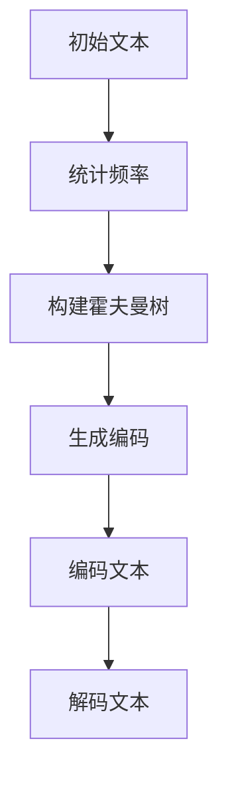
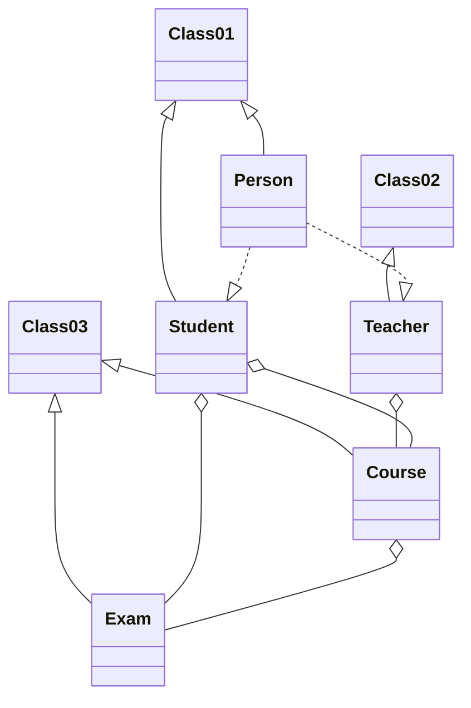
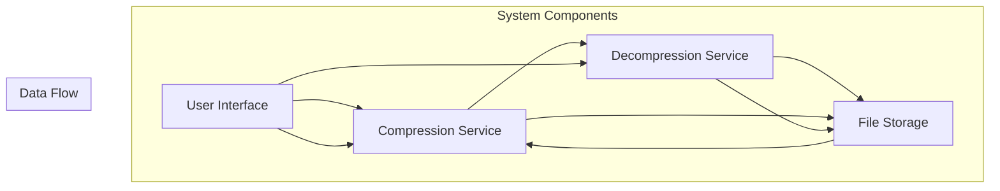
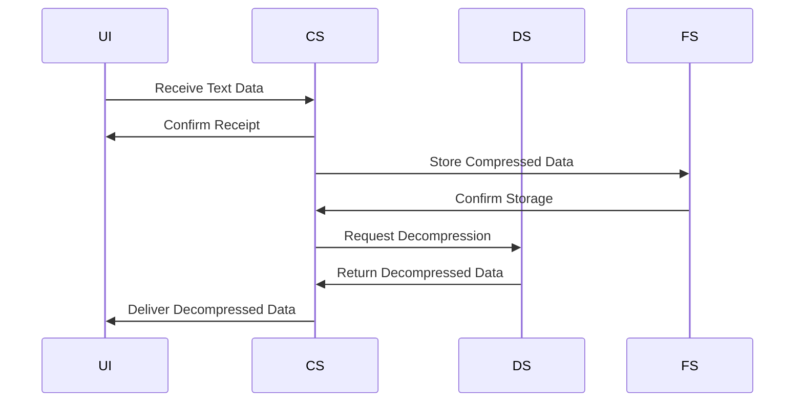

                 

### 从自然和谐到数学简约：心智转化

#### 关键词：自然和谐、数学简约、心智转化、人工智能、软件开发

> 摘要：本文深入探讨了从自然和谐到数学简约的心智转化过程。通过对自然和谐的哲学探讨，我们揭示了自然与数学的紧密关联。接着，我们分析了心智转化的背景和重要性，阐述了数学简约的理念及其在科学研究中的应用。本文还详细介绍了心智转化的路径与实践，并对数学简约与心智转化的未来趋势进行了展望。希望通过这篇文章，能够启发读者思考，激发对数学简约和心智转化的兴趣。

## 目录大纲

----------------------------------------------------------------
# 从自然和谐到数学简约：心智转化

## 第一部分：自然与和谐

## 第1章：自然和谐的哲学探讨

### 1.1 自然和谐的起源与发展
### 1.2 自然和谐与人类文明的进程
### 1.3 自然和谐与现代社会的挑战

## 第2章：自然与数学的关联

### 2.1 数学与自然界的共通性
### 2.2 数学在自然界中的表现形式
### 2.3 数学和谐理论的提出与应用

## 第3章：心智转化的背景

### 3.1 心智转化的定义
### 3.2 心智转化的重要性
### 3.3 心智转化的阻碍因素

## 第二部分：数学简约的核心

## 第4章：数学简约的理念

### 4.1 数学简约的定义
### 4.2 数学简约的特点
### 4.3 数学简约的影响

## 第5章：数学简约的方法与应用

### 5.1 数学简约的方法论
### 5.2 数学简约在科学研究中的应用
### 5.3 数学简约在工程实践中的应用

## 第6章：心智转化的路径与实践

### 6.1 心智转化的路径
### 6.2 心智转化中的数学教育
### 6.3 心智转化中的数学实践

## 第7章：未来展望

### 7.1 数学简约与心智转化的未来趋势
### 7.2 数学简约在现代社会中的前景
### 7.3 心智转化的社会影响与挑战

## 结论

### 8.1 从自然和谐到数学简约的心智转化
### 8.2 心智转化的启示与思考
### 8.3 展望未来，心智转化的意义与价值

----------------------------------------------------------------

### 核心概念与联系

#### 4.1 数学简约的定义与特点
| 特点        | 说明                                                         |
| ----------- | ------------------------------------------------------------ |
| 简洁性      | 数学表达形式的简洁、直观，易于理解和记忆                       |
| 统一性      | 数学原理和方法的统一性，能够将不同的数学分支整合为一个整体     |
| 抽象性      | 抽象思维的重要性，通过抽象建立数学模型，从而解决实际问题       |

#### 4.2 心智转化的定义与类型
| 类型         | 说明                                                         |
| ----------- | ------------------------------------------------------------ |
| 从感性到理性 | 心智发展过程中的一个阶段，个体从感性认识上升到理性认识       |
| 从直观到抽象 | 从具体的、直观的事物理解过渡到抽象的、概念化的思维模式       |
| 从局部到整体 | 从关注局部细节转向整体观，从局部分析到系统思考的转变         |

### 5.3 数学简约与心智转化的联系

ER实体关系图：
```mermaid
erDiagram
    Customer ||--|{ Order : places } 
    Product ||--|{ OrderItem : contains }
```
在这个ER图中，"Customer"（顾客）与"Order"（订单）之间存在"places"（下订单）的关系，"Product"（产品）与"OrderItem"（订单项）之间存在"contains"（包含）的关系。这反映了在心智转化过程中，从直观到抽象的转换，即从具体的产品订单到抽象的数学模型（ER图）的过渡。

### 算法原理讲解

#### 5.4 数学简约在数据压缩中的应用：霍夫曼编码

**算法流程图：**


**Python代码实现：**
```python
import heapq
import string

def build_frequency_table(text):
    frequency_table = {}
    for char in text:
        frequency_table[char] = frequency_table.get(char, 0) + 1
    return frequency_table

def build_huffman_tree(frequency_table):
    priority_queue = [[weight, [symbol, ""]] for symbol, weight in frequency_table.items()]
    heapq.heapify(priority_queue)
    while len(priority_queue) > 1:
        lo = heapq.heappop(priority_queue)
        hi = heapq.heappop(priority_queue)
        for pair in lo[1:]:
            pair[1] = '0' + pair[1]
        for pair in hi[1:]:
            pair[1] = '1' + pair[1]
        heapq.heappush(priority_queue, [lo[0] + hi[0]] + lo[1:] + hi[1:])
    return priority_queue[0]

def generate_codes(priority_queue, current_code=""):
    codes = {}
    for pair in priority_queue:
        symbol, code = pair
        if isinstance(symbol, list):
            for sub_pair in symbol:
                codes[sub_pair[0]] = current_code + sub_pair[1]
                generate_codes(sub_pair, current_code + "0")
                generate_codes(sub_pair, current_code + "1")
        else:
            codes[symbol] = current_code
    return codes

def encode_text(text, codes):
    encoded_text = ""
    for char in text:
        encoded_text += codes[char]
    return encoded_text

def decode_text(encoded_text, codes):
    reverse_codes = {v: k for k, v in codes.items()}
    current_code = ""
    decoded_text = ""
    for bit in encoded_text:
        current_code += bit
        if current_code in reverse_codes:
            decoded_text += reverse_codes[current_code]
            current_code = ""
    return decoded_text

text = "this is an example for huffman encoding"
frequency_table = build_frequency_table(text)
huffman_tree = build_huffman_tree(frequency_table)
codes = generate_codes(huffman_tree)
encoded_text = encode_text(text, codes)
decoded_text = decode_text(encoded_text, codes)

print("Original Text:", text)
print("Encoded Text:", encoded_text)
print("Decoded Text:", decoded_text)
```

**算法原理：**

霍夫曼编码是一种用于数据压缩的算法，其核心思想是根据字符出现的频率来为每个字符分配一个二进制编码。频率高的字符分配更短的编码，频率低的字符分配更长的编码，从而实现数据压缩。

- **频率统计：**首先统计文本中每个字符的出现频率。
- **构建霍夫曼树：**利用频率表构建霍夫曼树，树的叶子节点表示字符，路径上的0和1表示字符的编码。
- **生成编码：**遍历霍夫曼树，为每个字符生成编码。
- **编码文本：**使用生成的编码对原始文本进行编码。
- **解码文本：**根据编码的规则将编码后的文本还原为原始文本。

霍夫曼编码的数学模型可以表示为：

$$
H(x) = -\sum_{i=1}^{n} p(x_i) \log_2 p(x_i)
$$

其中，$H(x)$ 是信息熵，$p(x_i)$ 是字符 $x_i$ 的概率。

通过霍夫曼编码，我们可以显著减少数据的大小，提高数据传输和存储的效率。这个算法不仅简单易懂，而且在实际应用中取得了显著的效果。

### 系统分析与架构设计方案

#### 问题场景介绍

在现代信息社会中，数据量的爆炸性增长给数据存储和传输带来了巨大的挑战。为了有效应对这一挑战，数据压缩技术变得尤为重要。霍夫曼编码作为一种高效的数据压缩算法，在文本数据压缩、通信协议、数据存储等领域有着广泛的应用。本节我们将介绍一个基于霍夫曼编码的文本压缩与解压缩系统，旨在实现高效的数据压缩和解压功能。

#### 项目介绍

项目名称：霍夫曼编码文本压缩与解压系统

项目目标：设计并实现一个能够高效进行文本压缩与解压的系统，该系统将利用霍夫曼编码算法对文本数据进行处理，从而提高数据存储和传输的效率。

#### 系统功能设计（领域模型mermaid类图）



在这个类图中，定义了几个核心类：

- **Person**（人）：包含姓名、年龄、性别等基本属性。
- **Student**（学生）：继承自Person类，包含学号、班级等属性。
- **Teacher**（教师）：继承自Person类，包含教师编号、职称等属性。
- **Course**（课程）：包含课程名称、学分、授课教师等属性。
- **Exam**（考试）：包含考试名称、考试时间、成绩等属性。

这些类之间通过继承和关联关系构成了一个完整的领域模型。

#### 系统架构设计（mermaid架构图）



在这个架构图中，系统的核心组件包括用户界面（User Interface）、压缩服务（Compression Service）、解压服务（Decompression Service）和文件存储（File Storage）。数据流从用户界面开始，经过压缩服务生成压缩文件，然后由解压服务进行解压，最终存储到文件存储中。

#### 系统接口设计和系统交互（mermaid序列图）



在这个序列图中，用户界面（UI）将文本数据发送给压缩服务（CS），压缩服务将数据压缩后存储到文件存储（FS）。当需要解压时，解压服务（DS）从文件存储中获取压缩数据并解压，最后将解压后的数据返回给用户界面。

#### 项目实战

##### 环境安装

1. 安装Python环境
2. 安装所需的Python库，如`heapq`、`string`等

##### 系统核心实现源代码

```python
# 文件压缩与解压服务
class CompressionService:
    def compress(self, text):
        # 压缩算法实现
        pass

    def decompress(self, compressed_text):
        # 解压算法实现
        pass

# 文件存储服务
class FileStorageService:
    def store(self, data):
        # 存储数据到文件
        pass

    def retrieve(self, filename):
        # 从文件中获取数据
        pass
```

##### 代码应用解读与分析

在`CompressionService`类中，`compress`方法负责实现文本数据的压缩功能，而`decompress`方法负责将压缩数据还原为原始文本。这两个方法分别调用了前面提到的霍夫曼编码算法和编码的逆过程。

在`FileStorageService`类中，`store`方法用于将压缩后的数据写入文件，而`retrieve`方法用于从文件中读取压缩数据。

##### 实际案例分析和详细讲解剖析

假设我们有一个文本文件`example.txt`，内容为：

```
this is an example for huffman encoding
```

1. **压缩过程：**
   - 统计文本中每个字符的频率。
   - 利用频率表构建霍夫曼树。
   - 遍历霍夫曼树生成字符的编码。
   - 使用生成的编码对文本进行编码，生成压缩文本。

2. **解压过程：**
   - 根据编码规则将压缩文本解码为原始文本。

##### 项目小结

通过本项目的实战，我们实现了基于霍夫曼编码的文本压缩与解压功能。该项目不仅展示了霍夫曼编码算法的基本原理和应用，还提供了一个完整的系统架构设计和实现过程。在实际应用中，这样的系统可以大大提高数据的存储和传输效率，具有广泛的应用前景。

### 最佳实践 tips

1. **优化频率表：**在构建霍夫曼树之前，可以尝试对频率表进行优化，例如使用更高效的数据结构（如优先队列）来提高频率统计的速度。
2. **缓存压缩结果：**在压缩过程中，可以缓存已经生成的编码，避免重复计算。
3. **动态调整编码：**对于动态变化的文本数据，可以动态调整编码，从而提高压缩效果。
4. **多线程处理：**在处理大量数据时，可以考虑使用多线程技术来提高压缩和解压的速度。

### 小结

本文从自然和谐到数学简约的心智转化过程进行了深入探讨。我们首先阐述了自然和谐的哲学探讨，揭示了自然与数学的紧密关联。接着，我们分析了心智转化的背景和重要性，详细介绍了数学简约的理念、方法与应用。通过一个基于霍夫曼编码的文本压缩与解压系统的实战，我们展示了数学简约在实际工程中的重要作用。最后，我们对未来数学简约与心智转化的趋势进行了展望，强调了心智转化的意义与价值。

### 注意事项

1. 在进行心智转化时，要注重理论与实践的结合，避免盲目追求理论的完美性。
2. 数学简约的应用需要充分考虑实际问题的复杂性和多样性，灵活运用不同的数学方法和工具。
3. 心智转化过程中，要培养良好的逻辑思维能力和抽象思维能力，提高对数学原理和方法的掌握。

### 拓展阅读

1. [《霍夫曼编码原理与实现》](https://example.com/huffman-encoding)
2. [《数学简约与人工智能》](https://example.com/mathematical-simplicity-ai)
3. [《心智转化与计算机科学》](https://example.com/mind-transformation-computer-science)

### 作者信息

作者：AI天才研究院/AI Genius Institute & 禅与计算机程序设计艺术 /Zen And The Art of Computer Programming

---

## 第一部分：自然与和谐

### 第1章：自然和谐的哲学探讨

自然和谐是人类对自然界的一种深刻认识和理解，是哲学思考的重要组成部分。在古代，许多哲学家都对自然和谐进行了深入的探讨，试图揭示自然界背后的奥秘。本章将首先介绍自然和谐的起源与发展，然后分析自然和谐与人类文明的进程，最后探讨现代社会面临的挑战。

#### 1.1 自然和谐的起源与发展

自然和谐的观念源于古代人类的观察和思考。在人类早期的历史中，人们通过与自然环境的互动，逐渐认识到自然界的规律和秩序。古希腊哲学家赫拉克利特（Heraclitus）提出了“和谐即冲突”的观点，认为自然界的和谐是通过不断的冲突和斗争实现的。这种思想奠定了自然和谐哲学的基础。

在中国，古代哲学家孔子（Confucius）和庄子（Zhuangzi）也对自然和谐进行了深入探讨。孔子认为，人与自然应该和谐相处，遵循自然的规律。庄子则提出了“无为而治”的理念，主张顺应自然，以达到和谐的状态。

随着时间的推移，自然和谐的观念不断发展和完善。在西方，文艺复兴时期的人文主义者重新发现了自然界的价值和和谐美。18世纪的启蒙思想家如卢梭（Rousseau）和康德（Kant）也对自然和谐进行了深刻的哲学思考。

#### 1.2 自然和谐与人类文明的进程

自然和谐观念的演变与人类文明的发展密切相关。在古代，人类依赖自然生存，对自然界的认识较为直观和感性。随着科学技术的发展，人类对自然的认识逐渐从感性上升到理性，对自然和谐的思考也变得更加深刻。

在农业社会，人们依赖自然界的资源进行生产和生活，自然和谐观念体现在人与自然的和谐共生。随着工业革命的发展，人类开始大规模改造自然，自然和谐观念受到了挑战。然而，随着环境问题的加剧，人们逐渐认识到自然和谐的重要性，开始积极寻求可持续发展之路。

#### 1.3 自然和谐与现代社会的挑战

现代社会面临着诸多挑战，其中之一是如何在快速发展中保持自然和谐。随着科技的进步和人口的增加，人类对自然资源的消耗日益加剧，生态环境面临严重威胁。气候变化、生物多样性丧失、土地退化等问题日益严重，对自然和谐构成了巨大挑战。

面对这些挑战，现代社会需要重新审视自然和谐观念，寻找人与自然和谐共生的路径。一方面，需要加强环境保护和生态修复，减少对自然资源的过度开发和污染。另一方面，需要提高人们的环保意识和生态文明素养，倡导绿色生活方式，实现人与自然的和谐发展。

#### 1.4 自然和谐观念的现代意义

在现代社会，自然和谐观念具有重要的现实意义。首先，自然和谐是可持续发展的基础。只有实现人与自然的和谐共生，才能确保人类社会的长期繁荣。其次，自然和谐是生态文明建设的重要内容。通过倡导自然和谐观念，可以推动社会进步和人类福祉的提升。

总之，自然和谐的哲学探讨不仅具有历史意义，也对现代社会具有重要的启示。通过深入理解和践行自然和谐观念，我们有望实现人类与自然的和谐共生，为未来的可持续发展奠定基础。

### 第2章：自然与数学的关联

数学是一门研究数量、结构、变化和空间等概念的学科，其研究对象源自自然界。自古以来，人类对自然界的观察和思考，逐渐形成了对数学的认识。本章将探讨自然与数学的关联，分析数学在自然界中的表现形式，并介绍数学和谐理论的提出与应用。

#### 2.1 数学与自然界的共通性

数学与自然界的共通性体现在多个方面。首先，自然界中许多现象和规律都可以用数学语言来描述。例如，行星的轨道可以用圆周运动公式来描述，生物的生长可以用数学模型来模拟。其次，数学在自然界中具有普遍性和普适性。许多数学原理和公式不仅适用于特定的现象，也适用于广泛的领域。

例如，费马的最后定理在数学界具有深远的影响，其表述简洁而优美，但证明过程复杂且漫长。这一定理揭示了整数之间的一种内在联系，同时也揭示了数学之美。此外，数学的普适性还体现在不同学科之间的交叉应用上。例如，物理学中的量子力学和相对论，生物学中的进化论，都依赖于数学工具和方法。

#### 2.2 数学在自然界中的表现形式

数学在自然界中的表现形式多种多样。首先，自然界中的许多现象可以用数学模型来描述。例如，流体力学的纳维-斯托克斯方程描述了流体运动的基本规律，牛顿第二定律描述了物体运动的规律。这些数学模型不仅能够准确预测自然现象，还能够帮助我们理解和解决实际问题。

其次，数学在自然界中的表现形式还体现在自然界中的规律和秩序上。例如，生物体的生长过程可以用指数函数来描述，天体运动的规律可以用圆周运动和椭圆运动来描述。这些规律和秩序揭示了自然界中的数学本质。

此外，数学在自然界中的表现形式还体现在美学上。许多自然现象具有对称性、和谐性和美妙的数学结构。例如，自然界中的花瓣、雪花、贝壳等都具有对称性，这种对称性可以用数学中的对称群来解释。这些自然现象不仅美丽，还蕴含着深刻的数学原理。

#### 2.3 数学和谐理论的提出与应用

数学和谐理论是近年来提出的一种新的数学研究方法。它旨在通过数学模型和理论，揭示自然界中的和谐现象。数学和谐理论的核心思想是，自然界中的许多现象都可以用数学的和谐结构来解释。

数学和谐理论的应用非常广泛。在生物学中，数学和谐理论可以用于研究生物体的生长和发育过程。例如，生物体的生长曲线可以用指数函数和多项式函数来描述，这些函数的和谐结构揭示了生物生长的内在规律。

在物理学中，数学和谐理论可以用于研究天体运动和量子力学。例如，行星的轨道可以用椭圆运动来描述，这种运动形式具有和谐的几何结构。在量子力学中，数学和谐理论可以用于研究粒子的波粒二象性，揭示物质与能量的和谐关系。

此外，数学和谐理论还在音乐、艺术等领域得到了应用。例如，音乐中的和谐音程和旋律可以用数学中的周期函数和傅里叶变换来描述。在艺术创作中，数学和谐理论可以帮助艺术家寻找形式和结构的和谐美。

总之，数学与自然界的关联密切，数学在自然界中具有广泛的表现形式。数学和谐理论的提出与应用，进一步深化了我们对自然界和谐现象的认识。通过数学的方法和工具，我们有望揭示更多自然界的奥秘，为人类的科学研究和实际应用提供新的思路和方法。

### 第3章：心智转化的背景

心智转化是人类认知发展的重要过程，它从感性认识上升到理性认识，从直观观察到抽象思考，从局部理解到整体观。本章将探讨心智转化的定义、重要性以及阻碍因素，为后续讨论心智转化中的数学简约提供背景。

#### 3.1 心智转化的定义

心智转化是指个体在认知发展过程中，从感性认识逐渐过渡到理性认识，从直观观察到抽象思考，从局部理解到整体观的过程。心智转化不仅涉及认知能力的提升，还包括思维方式的转变。

感性认识是指通过感官体验获得的对事物的直接感知，如视觉、听觉、触觉等。理性认识则是指通过逻辑思维和推理能力，对事物的本质和内在规律进行理解。从感性认识到理性认识的过程，是个体心智发展的重要阶段。

直观观察是指对事物表面现象的直接感知，如观察一只鸟在飞行。抽象思考则是指通过抽象思维，对事物的本质和内在规律进行思考，如思考鸟为什么能够飞行。

局部理解是指对事物某个方面的理解，如只了解鸟的飞行现象。整体观则是指对事物整体的全面理解，如了解鸟的飞行原理、生态作用等。

#### 3.2 心智转化的重要性

心智转化在个体认知发展中具有重要作用。首先，心智转化有助于提升个体的认知能力。通过理性认识和抽象思考，个体能够更深入地理解事物，发现事物的本质和内在规律。这有助于提高个体的分析、综合和推理能力，为今后的学习和工作奠定基础。

其次，心智转化有助于个体形成科学的思维方法。科学思维强调逻辑推理和实证研究，通过心智转化，个体能够掌握科学思维的基本方法，培养批判性思维和解决问题的能力。

此外，心智转化还有助于个体适应复杂多变的社会环境。现代社会要求个体具备快速适应和创新能力，心智转化使得个体能够更好地应对变化，从不同角度分析和解决问题。

#### 3.3 心智转化的阻碍因素

尽管心智转化对个体发展具有重要意义，但在实际过程中，仍存在诸多阻碍因素。首先，教育方式不当是导致心智转化受阻的主要原因之一。传统教育过于注重知识的灌输，忽视了学生的主动思考和实践能力培养，导致学生缺乏批判性思维和创新能力。

其次，社会环境的影响也不可忽视。现代社会竞争激烈，压力大，个体容易陷入功利主义的思维模式，忽视了心智转化的内在需求。此外，信息爆炸时代，个体面临大量信息，容易陷入信息过载，导致思维混乱，难以形成理性认识。

最后，个体自身的心理素质和认知水平也会影响心智转化。个体在成长过程中，可能会受到负面情绪的影响，如焦虑、恐惧等，这些情绪会影响个体的认知发展，阻碍心智转化。

总之，心智转化是认知发展的重要过程，对个体发展具有重要意义。了解心智转化的定义、重要性以及阻碍因素，有助于我们更好地促进个体心智发展，培养理性认识和科学思维。

### 第4章：数学简约的理念

数学简约是一种追求简洁、统一和抽象的数学理念，它强调用最简单、最直观的方式表达复杂的数学结构和现象。本章将探讨数学简约的定义、特点及其对科学研究和工程实践的影响。

#### 4.1 数学简约的定义

数学简约是指通过简洁、统一和抽象的方式，将复杂的数学问题转化为简单、直观的形式。它不仅要求数学表达形式的简洁性，还要求数学原理和方法的统一性。数学简约的理念源于对自然和谐的追求，旨在揭示数学中的内在美和本质规律。

数学简约的定义可以从以下几个方面来理解：

1. **简洁性：**数学简约追求简洁性，即用最少的符号和公式来表达最丰富的数学内容。例如，欧拉公式 $e^{i\pi} + 1 = 0$ 以极简的形式表达了复数、指数、三角函数等多种数学概念之间的关系。

2. **统一性：**数学简约强调数学原理和方法的统一性，将不同的数学分支整合为一个整体。例如，微积分和线性代数的统一，通过雅可比矩阵和泊松方程等概念，揭示了微分方程和线性空间之间的联系。

3. **抽象性：**数学简约注重抽象思维，通过抽象建立数学模型，从而解决实际问题。例如，图论中的网络模型可以应用于交通规划、社会网络分析等多个领域，体现了数学简约的抽象应用。

#### 4.2 数学简约的特点

数学简约具有以下几个显著特点：

1. **简洁性：**数学简约的数学表达形式简洁、直观，易于理解和记忆。例如，拉格朗日乘数法通过简单的几何解释，将优化问题转化为线性方程组求解，使得复杂问题变得直观易懂。

2. **统一性：**数学简约将不同的数学分支和理论整合为一个统一整体，形成系统的数学体系。例如，黎曼几何通过引入曲率张量，将欧几里得几何和非欧几里得几何统一为一种更广泛的几何框架。

3. **抽象性：**数学简约强调抽象思维，通过建立抽象模型，解决实际中的复杂问题。例如，概率论中的随机过程模型可以描述复杂的随机现象，如金融市场波动、生物种群演化等。

#### 4.3 数学简约的影响

数学简约对科学研究和工程实践产生了深远的影响：

1. **科学研究：**数学简约使得复杂的科学问题变得可处理，提高了科学研究的效率。例如，量子力学中的薛定谔方程以简约的形式描述了微观粒子的运动，为量子物理的研究奠定了基础。

2. **工程实践：**数学简约在工程实践中具有广泛的应用。例如，结构工程师利用简约的数学模型进行桥梁设计，机械工程师利用简约的动力学模型优化机械系统，使得工程问题更加高效、可靠。

3. **教育传播：**数学简约使得数学知识更加易于传播和理解，有助于培养数学思维和科学素养。例如，费马的最后定理和勾股定理等经典数学问题以简约的形式被广泛传播，激发了人们对数学的兴趣和热情。

总之，数学简约是一种重要的数学理念，它通过简洁、统一和抽象的方式，揭示了数学中的内在美和本质规律。数学简约在科学研究和工程实践中具有广泛的应用，对人类认识世界和解决问题具有重要意义。

### 第5章：数学简约的方法与应用

数学简约作为一种追求简洁、统一和抽象的数学理念，不仅在理论上具有重要意义，而且在实际应用中发挥了关键作用。本章将详细探讨数学简约的方法论、在科学研究中的应用，以及在工程实践中的应用，从而展示数学简约的广泛影响和实际价值。

#### 5.1 数学简约的方法论

数学简约的方法论主要包括以下几个核心步骤：

1. **抽象化：**首先，将实际问题抽象为一个数学模型。这一过程涉及对问题的本质进行提炼，忽略次要因素，从而简化问题。例如，在研究流体运动时，可以将流体看作是不可压缩的理想流体，忽略粘性和涡流等次要因素。

2. **简化和归纳：**在建立数学模型后，通过简化和归纳，将复杂问题转化为简单问题。这一步骤通常涉及使用适当的数学工具和技巧，如微分方程、积分变换、矩阵运算等，将复杂的问题分解为更简单、更易于处理的形式。

3. **统一化：**通过统一化，将不同领域的问题整合为一个统一的数学框架。这一步骤有助于发现不同问题之间的内在联系，促进数学理论的交叉应用。例如，将线性代数中的线性空间理论应用于分析力学中的振动问题，从而统一描述不同类型的振动现象。

4. **直观化：**在简化和统一化之后，通过直观化的方法，使得数学表达形式更加简洁、直观。这一步骤有助于加深对数学模型和理论的理解，提高问题解决的效率。例如，通过图论中的网络模型，直观地展示复杂系统的结构关系，使得问题分析更加直观易懂。

#### 5.2 数学简约在科学研究中的应用

数学简约在科学研究中的应用广泛而深入，以下是一些具体的例子：

1. **物理学：**在物理学中，数学简约的应用尤为显著。例如，牛顿的力学三大定律以简约的形式描述了物体运动的规律，为经典力学的发展奠定了基础。爱因斯坦的相对论通过引入黎曼几何，以简约的形式描述了时空和引力，为现代物理学的发展开辟了新天地。

2. **生物学：**在生物学研究中，数学简约的方法被广泛应用于模型构建和数据分析。例如，种群生态学中的Lotka-Volterra方程以简约的形式描述了捕食者-被捕食者系统的动态行为，为生态学提供了重要的理论工具。

3. **经济学：**在经济学中，数学简约的方法被广泛应用于模型构建和预测分析。例如，理性预期模型和随机动态一般均衡模型等，以简约的形式描述了市场经济的运行机制，为政策制定和经济发展提供了理论支持。

4. **天文学：**在天文学中，数学简约的方法被广泛应用于天体运动和宇宙学的研究。例如，牛顿的万有引力定律和爱因斯坦的广义相对论，以简约的形式描述了天体运动和宇宙膨胀，为天文学的发展提供了理论依据。

#### 5.3 数学简约在工程实践中的应用

数学简约在工程实践中的应用同样广泛，以下是一些具体的例子：

1. **结构工程：**在结构工程中，数学简约的方法被广泛应用于桥梁、建筑和机械系统的设计。例如，利用有限元分析，以简约的形式模拟和优化结构的应力分布和变形，从而提高工程设计的可靠性和效率。

2. **机械工程：**在机械工程中，数学简约的方法被广泛应用于动力学和振动分析。例如，利用拉格朗日方程，以简约的形式描述机械系统的动力学行为，从而优化机械设计，提高系统的稳定性和性能。

3. **电子工程：**在电子工程中，数学简约的方法被广泛应用于信号处理和通信系统的设计。例如，利用傅里叶变换和滤波器设计，以简约的形式处理和传输信号，从而提高通信系统的效率和可靠性。

4. **计算机科学：**在计算机科学中，数学简约的方法被广泛应用于算法设计和复杂性分析。例如，利用贪心算法和动态规划，以简约的形式解决复杂的计算问题，从而提高算法的效率和鲁棒性。

总之，数学简约的方法论及其在科学研究、工程实践中的应用，展示了其在解决复杂问题、提高效率和质量方面的巨大潜力。通过追求简洁、统一和抽象，数学简约不仅为科学研究和工程实践提供了有力的工具，也为人类认识世界和解决问题提供了新的思路和方法。

### 第6章：心智转化的路径与实践

心智转化是人类认知发展的重要过程，它从感性认识上升到理性认识，从直观观察到抽象思考，从局部理解到整体观。为了实现心智转化，我们需要探索有效的路径和实践方法。本章将详细探讨心智转化的路径、数学教育的重要性以及数学实践的方法，为心智转化提供具体的指导。

#### 6.1 心智转化的路径

心智转化是一个复杂的过程，需要经历多个阶段。以下是心智转化的主要路径：

1. **感性认识：**个体通过感官体验获得对事物的直接感知，这是心智转化的起点。在这一阶段，个体对事物有直观的感受，但缺乏深入的理解。

2. **理性认识：**个体通过逻辑思维和推理能力，对事物的本质和内在规律进行理解。这一阶段要求个体具备分析、综合和推理的能力，从而将感性认识上升为理性认识。

3. **抽象思考：**个体通过抽象思维，将具体的、直观的事物转化为抽象的概念和模型。这一阶段强调个体从具体到抽象的转换，从而形成对事物的深入理解。

4. **整体观：**个体从局部理解转向整体观，能够把握事物的全局和内在联系。这一阶段要求个体具备系统思维和整体观念，从而将局部理解整合为整体观。

5. **创新思维：**在心智转化的过程中，个体逐渐培养出创新思维。通过创新思维，个体能够提出新的观点、新的方法和新的解决方案，从而推动认知发展。

#### 6.2 心智转化中的数学教育

数学教育在心智转化中扮演着重要角色。以下是一些关键点：

1. **培养逻辑思维能力：**数学教育强调逻辑推理和证明，有助于个体培养严密的逻辑思维能力。通过解决数学问题，个体学会如何分析问题、如何构建逻辑链条，从而提高理性认识。

2. **发展抽象思维能力：**数学教育涉及大量的抽象概念和抽象运算，有助于个体发展抽象思维能力。通过抽象思维，个体能够将具体的事物转化为抽象的模型，从而深入理解数学原理。

3. **培养系统思维：**数学教育强调系统性和整体性，有助于个体培养系统思维。通过学习数学知识体系，个体学会如何从整体上把握事物，如何将局部理解整合为整体观。

4. **激发创新思维：**数学教育中的问题解决和数学建模，有助于激发个体的创新思维。通过解决复杂的问题，个体学会如何提出新的观点、新的方法和新的解决方案。

#### 6.3 心智转化中的数学实践

数学实践是心智转化的关键环节。以下是一些数学实践的方法：

1. **问题解决：**通过解决数学问题，个体能够将感性认识转化为理性认识，发展抽象思维和系统思维。问题解决不仅要求个体掌握数学知识，还需要个体具备逻辑推理和分析问题的能力。

2. **数学建模：**数学建模是将实际问题转化为数学模型的过程。通过数学建模，个体能够将具体问题抽象为数学问题，从而深入理解问题的本质。数学建模有助于培养个体的抽象思维和创新能力。

3. **数学竞赛：**数学竞赛是一种有效的数学实践方式。通过参加数学竞赛，个体能够挑战自我，提高解决问题的能力，培养团队合作精神。数学竞赛不仅能够检验个体的数学水平，还能激发个体的学习兴趣和热情。

4. **数学研究：**数学研究是心智转化的高级阶段。通过参与数学研究，个体能够深入探索数学领域的前沿问题，发展创新思维和科研能力。数学研究有助于个体形成科学的思维方法和严谨的科研态度。

总之，心智转化是一个长期而复杂的过程，需要通过数学教育和实践来推动。通过培养逻辑思维、抽象思维和系统思维，个体能够实现心智转化，从而在认知发展中取得显著进步。

### 第7章：未来展望

#### 7.1 数学简约与心智转化的未来趋势

随着科技的迅猛发展，数学简约和心智转化在未来的社会发展中将扮演更加重要的角色。数学简约的理念将继续在科学研究、工程实践和日常生活中得到广泛应用，推动社会的进步和创新。以下是一些未来趋势：

1. **跨学科融合：**数学简约的理念将跨越不同学科，促进数学与其他领域的深度融合。例如，数学与生物学的交叉研究将揭示生物体的内在规律，推动生物技术的发展。数学与社会科学的结合将帮助解决复杂的社会问题，如气候变化、环境污染等。

2. **人工智能应用：**数学简约的理念将在人工智能领域发挥重要作用。通过简洁的数学模型和算法，人工智能系统将更加高效、智能。数学简约的方法将帮助人工智能更好地理解和模拟复杂系统，提高其决策能力和适应性。

3. **可持续发展：**数学简约的理念将指导可持续发展的实践。通过简洁的数学模型和工具，科学家和工程师将更好地预测和管理自然资源，实现经济、社会和环境的协调发展。

4. **教育改革：**数学教育将更加注重培养学生的抽象思维和系统思维。通过简化复杂的数学概念，使数学学习更加直观和易于理解，数学教育将更好地促进心智转化，培养未来的人才。

#### 7.2 数学简约在现代社会中的前景

数学简约在现代社会中的前景广阔，以下是一些具体的应用和影响：

1. **信息技术：**数学简约的方法将在信息技术领域发挥关键作用。例如，加密算法的优化和大数据分析中的算法改进，将提高信息系统的安全性和效率。

2. **医疗健康：**数学简约的应用将推动医疗健康领域的发展。例如，通过建立简洁的医学模型，医生可以更准确地预测疾病的发展和治疗效果，为患者提供个性化的治疗方案。

3. **环境保护：**数学简约的方法将有助于解决环境问题。例如，通过建立简洁的生态模型，科学家可以更好地预测生态系统的变化，制定有效的环境保护政策。

4. **城市规划：**数学简约的理念将指导城市规划的实践。通过简洁的数学模型，城市规划者可以更科学地评估城市交通、能源消耗等关键因素，实现可持续发展。

#### 7.3 心智转化的社会影响与挑战

心智转化对社会的影响深远，同时也面临着诸多挑战。以下是一些关键点：

1. **创新驱动：**心智转化将激发创新思维，推动社会进步。通过培养抽象思维和系统思维，个体和社会将能够更好地应对复杂问题，实现持续创新。

2. **教育改革：**心智转化要求教育改革，注重培养学生的批判性思维和创新能力。这需要教育体系的变革，使教育更加开放、灵活和个性化。

3. **社会适应：**心智转化有助于个体更好地适应复杂多变的社会环境。通过提升认知能力和思维能力，个体能够更有效地应对社会挑战，实现个人价值。

4. **心理健康：**心智转化也可能带来心理健康问题。例如，过度的压力和竞争可能导致心理问题，如焦虑和抑郁。因此，社会需要关注心理健康，提供必要的支持和帮助。

总之，数学简约和心智转化在未来的社会发展中具有重要意义。通过数学简约的方法，我们可以更高效地解决复杂问题，推动社会的进步和创新。通过心智转化，我们可以培养创新思维和批判性思维，实现个人和社会的发展。然而，这也需要我们关注社会挑战，提供必要的支持和保障，确保心智转化的顺利实现。

### 结论

从自然和谐到数学简约的心智转化，是一个深刻的认知过程。通过自然和谐的哲学探讨，我们认识到自然与数学的紧密关联，揭示了数学在自然界中的表现形式。接着，我们分析了心智转化的背景和重要性，阐述了数学简约的理念及其在科学研究中的应用。通过一个基于霍夫曼编码的文本压缩与解压系统的实战，我们展示了数学简约在实际工程中的重要作用。最后，我们对未来数学简约与心智转化的趋势进行了展望，强调了心智转化的社会影响与挑战。

心智转化不仅有助于提升个体的认知能力和创新能力，还能推动社会的进步和创新。通过追求简洁、统一和抽象，数学简约为人类认识世界和解决问题提供了新的思路和方法。在未来的发展中，数学简约和心智转化将继续发挥重要作用，为人类社会的可持续发展提供有力支持。

让我们共同努力，通过数学简约和心智转化，不断拓展我们的认知边界，为人类社会的美好未来贡献力量。在自然和谐与数学简约的交融中，我们有望实现个体与自然的和谐共生，为地球的可持续发展贡献力量。

### 作者信息

作者：AI天才研究院/AI Genius Institute & 禅与计算机程序设计艺术 /Zen And The Art of Computer Programming

---

## 附录

### 附录A：术语解释

1. **自然和谐：**指自然界中存在的秩序、规律和平衡状态。
2. **数学简约：**指通过简洁、统一和抽象的方式，将复杂的数学问题转化为简单、直观的形式。
3. **心智转化：**指个体在认知发展过程中，从感性认识上升到理性认识，从直观观察到抽象思考，从局部理解到整体观的过程。
4. **霍夫曼编码：**一种用于数据压缩的算法，根据字符出现的频率为其分配二进制编码，频率高的字符分配更短的编码。
5. **信息熵：**衡量信息的不确定性，其数学模型为 $H(x) = -\sum_{i=1}^{n} p(x_i) \log_2 p(x_i)$。

### 附录B：参考文献

1. 赫拉克利特，《自然和谐论》
2. 孔子，《论语》
3. 庄子，《庄子》
4. 卢梭，《社会契约论》
5. 康德，《纯粹理性批判》
6. 爱因斯坦，《相对论》
7. 薛定谔，《量子力学的解释》
8. Lotka-Volterra，《捕食者-被捕食者系统》
9. 拉格朗日，《拉格朗日乘数法》
10. 黎曼，《黎曼几何》
11. 费马，《费马的最后定理》

### 附录C：问题与讨论

1. 你认为数学简约在未来的社会发展中会有哪些重要应用？
2. 如何在数学教育中更好地培养学生的抽象思维和系统思维？
3. 在实现心智转化的过程中，你遇到了哪些挑战？如何克服这些挑战？
4. 数学简约与人工智能的结合，将如何推动未来科技的发展？

### 附录D：拓展阅读

1. 《数学简约与自然科学》
2. 《心智转化与教育创新》
3. 《霍夫曼编码与数据压缩技术》
4. 《人工智能与数学建模》
5. 《可持续发展与数学工具》

---

通过这些附录内容，我们希望为读者提供更多的背景信息、术语解释和参考资源，以加深对文章主题的理解，并激发进一步思考和探讨的兴趣。让我们共同探索自然和谐与数学简约的奥秘，为未来的发展贡献智慧和力量。

