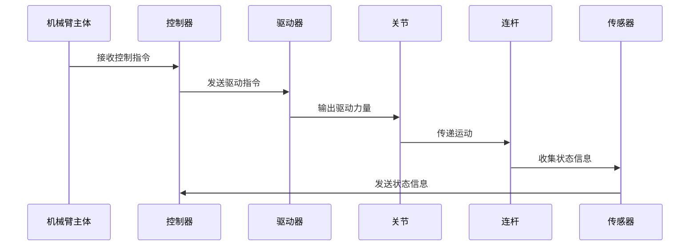
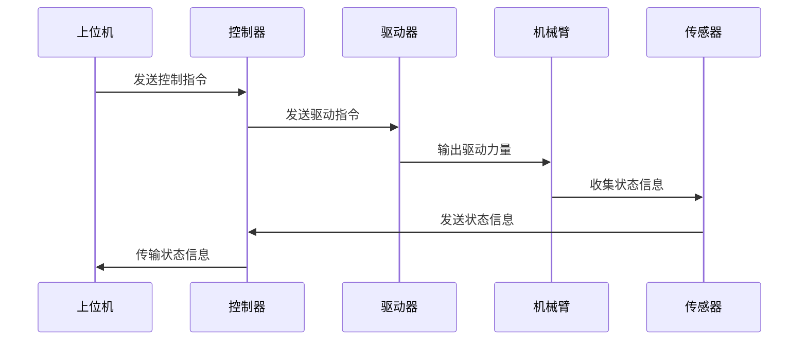

                 

# 仿生工程的拓扑优化：自然结构的数学重现

> 关键词：仿生工程、拓扑优化、自然结构、数学模型、算法应用、机械设计、材料科学、能源领域

> 摘要：本文深入探讨了仿生工程的拓扑优化及其在自然结构数学重现中的应用。通过分析仿生工程的概念、拓扑优化的基本概念以及自然结构的数学描述，我们了解了拓扑优化在仿生工程中的重要性。随后，本文介绍了拓扑优化算法的原理和具体应用，并通过实际案例展示了拓扑优化在仿生机械设计、材料科学和能源领域中的应用效果。最后，本文总结了最佳实践和注意事项，为读者提供了深入学习和应用拓扑优化的指导。

## 引言

仿生工程是一门结合生物与工程学的跨学科领域，旨在借鉴自然界的结构、功能和行为，为工程实践提供创新的解决方案。随着科技的发展，仿生工程在机械设计、材料科学、能源等领域展现出巨大的应用潜力。拓扑优化作为一门研究结构、材料和系统最优设计的学科，在仿生工程中发挥着关键作用。

拓扑优化通过对设计空间进行几何变形和材料属性调整，实现结构性能的优化。这种优化过程模拟了自然界的生长和进化过程，有助于提高材料的强度、刚度和稳定性，降低重量和成本。自然结构的数学重现则是通过数学模型和方法，对自然界中的结构进行抽象和描述，为拓扑优化提供了理论基础。

本文旨在探讨仿生工程的拓扑优化及其在自然结构数学重现中的应用。首先，我们将介绍仿生工程、拓扑优化和自然结构的数学描述，然后分析拓扑优化算法的原理和具体应用，最后通过实际案例展示拓扑优化在仿生机械设计、材料科学和能源领域中的应用效果。

## 第一部分：背景与基础理论

### 1.1 仿生工程的概述

#### 1.1.1 仿生工程的概念

仿生工程是一种基于生物学和工程学原理，模仿自然界中的生物结构、功能和行为，设计出具有类似特性的人造系统或设备的工程实践。仿生工程的核心思想是借鉴自然界中的成功经验，将生物体的结构与功能特点应用于工程实践中，以实现更高效、更节能、更环保的工程设计。

#### 1.1.2 仿生工程的发展历程

仿生工程的历史可以追溯到20世纪初。当时，科学家和工程师们开始尝试模仿自然界中的生物结构，如骨骼、肌肉、皮肤和神经系统，设计出具有类似功能的人造材料、设备和系统。随着材料科学、力学、生物学等学科的不断发展，仿生工程逐渐形成了一门独立的学科。近年来，随着计算机技术和人工智能的飞速发展，仿生工程在各个领域得到了广泛的应用。

#### 1.1.3 仿生工程的应用领域

仿生工程在许多领域都有着广泛的应用，包括但不限于以下几个方面：

1. 机械设计：仿生机械臂、仿生机器人等。
2. 材料科学：仿生材料、自修复材料等。
3. 能源领域：仿生太阳能电池、仿生风力发电机等。
4. 生物医学：仿生人工器官、仿生药物释放系统等。
5. 环境科学：仿生污染治理、仿生生态修复等。

### 1.2 拓扑优化的基本概念

#### 1.2.1 拓扑优化的定义

拓扑优化是一种基于数学模型和算法，通过对结构设计空间进行几何变形和材料属性调整，实现结构性能最优化的方法。拓扑优化旨在找到一种设计，使其在满足一定约束条件（如重量、强度、刚度等）的同时，具备最佳的性能。

#### 1.2.2 拓扑优化的应用背景

拓扑优化在工程实践中具有广泛的应用背景，特别是在需要轻量化、高强度和高稳定性的领域。以下是一些典型的应用场景：

1. 航空航天：飞机、火箭等航空器结构设计。
2. 汽车制造：汽车车身、底盘等部件设计。
3. 机械制造：机床、机械手臂等设备设计。
4. 材料科学：材料结构设计、材料优化等。
5. 生物医学：人工器官、植入物等设计。

#### 1.2.3 拓扑优化的目标

拓扑优化的主要目标是提高设计结构的性能，包括：

1. 最小化重量：降低材料的用量，减轻结构重量。
2. 提高强度和刚度：提高结构抵抗变形和破坏的能力。
3. 最小化制造成本：降低生产成本，提高经济效益。
4. 节能环保：提高能源利用效率，减少环境污染。

### 1.3 自然结构的数学描述

#### 1.3.1 自然结构的特征

自然结构具有一系列独特的特征，这些特征使得它们在复杂的生态环境中表现出优异的性能。以下是一些典型的自然结构特征：

1. 强度高、重量轻：如蜂巢结构、蜘蛛丝等。
2. 良好的变形能力：如弹簧、橡胶等。
3. 独特的多尺度结构：如树叶、树干等。
4. 良好的自适应能力：如生物体内器官的适应性变化。

#### 1.3.2 自然结构的数学模型

为了对自然结构进行定量描述，研究者们建立了多种数学模型，包括：

1. 几何模型：描述自然结构的形状和尺寸。
2. 物理模型：描述自然结构的力学性能和能量转换。
3. 统计模型：描述自然结构的随机性和概率分布。

#### 1.3.3 自然结构的数学重现方法

自然结构的数学重现方法主要包括以下几种：

1. 数值模拟：使用计算机模拟自然结构的生长、变形和性能。
2. 数据驱动方法：通过采集和分析自然结构的数据，建立数学模型。
3. 机器学习方法：利用机器学习算法，对自然结构进行特征提取和分类。

### 1.4 拓扑优化在仿生工程中的应用

#### 1.4.1 仿生机械设计

仿生机械设计是拓扑优化在仿生工程中的重要应用领域。通过拓扑优化，研究者们可以设计出具有优异性能的仿生机械结构，如：

1. 仿生机械臂：模仿动物骨骼和肌肉结构，实现高效、灵活的运动。
2. 仿生机器人：模仿昆虫、鸟类等生物的运动方式，实现复杂的任务。
3. 仿生飞行器：模仿鸟类、昆虫等生物的飞行机制，实现高效的飞行。

#### 1.4.2 材料科学

在材料科学领域，拓扑优化可以用于设计新型材料结构，如：

1. 仿生材料：模仿自然界中的材料特性，如高强度、轻质、耐腐蚀等。
2. 自修复材料：模仿生物体的自愈能力，实现材料的自动修复。
3. 多功能材料：结合多种功能，实现材料的综合性能提升。

#### 1.4.3 能源领域

在能源领域，拓扑优化可以用于设计新型能源设备，如：

1. 仿生太阳能电池：模仿植物光合作用机制，提高太阳能转化效率。
2. 仿生风力发电机：模仿鸟类翅膀结构，提高风力发电效率。
3. 仿生储能装置：模仿生物体内能量存储机制，实现高效的能量转换和存储。

#### 1.5 本章小结

本章介绍了仿生工程、拓扑优化和自然结构的数学描述，探讨了拓扑优化在仿生工程中的应用。通过分析，我们了解到拓扑优化在仿生机械设计、材料科学和能源领域具有重要的应用价值，为未来的仿生工程研究提供了理论基础和实践指导。

## 第二部分：拓扑优化算法原理与应用

### 2.1 拓扑优化算法概述

#### 2.1.1 拓扑优化算法的分类

拓扑优化算法可以根据不同的分类标准进行分类，以下是一些常见的分类方法：

1. **基于灵敏度方法的拓扑优化算法**：这种方法通过计算设计变量的灵敏度来驱动优化过程。常用的算法有加权残差法、变分法等。
   
2. **基于生成规则的拓扑优化算法**：这种方法通过定义一系列生成规则来生成最优拓扑。常用的算法有均匀化法、水平集法等。

3. **基于拓扑操作的方法**：这种方法通过引入拓扑操作，如添加或删除材料单元，来优化结构。常用的算法有连续体嵌套法、分叉算法等。

#### 2.1.2 拓扑优化算法的选择原则

选择合适的拓扑优化算法对于实现有效的优化至关重要。以下是一些选择拓扑优化算法的原则：

1. **问题类型**：根据问题的特点选择合适的算法。例如，对于简单的问题，可以选择灵敏度方法；对于复杂的问题，可以选择生成规则方法。

2. **计算效率**：考虑算法的计算效率，包括计算时间和内存消耗。对于大规模问题，应选择计算效率较高的算法。

3. **可扩展性**：选择具有良好可扩展性的算法，以便在问题规模增大时仍能保持有效的优化。

4. **适用性**：考虑算法在不同领域中的应用情况，选择适用于特定领域的算法。

#### 2.1.3 拓扑优化算法的优缺点对比

以下是一些常见拓扑优化算法的优缺点对比：

| 算法类型         | 优点                             | 缺点                                     |
|-----------------|--------------------------------|----------------------------------------|
| 灵敏度方法       | 算法简单，易于实现               | 优化结果可能不连续，收敛速度较慢           |
| 生成规则方法     | 优化结果连续，计算效率高         | 可能无法处理复杂的拓扑变化，对参数敏感     |
| 拓扑操作方法     | 可以处理复杂的拓扑变化           | 算法复杂，计算时间较长                   |

### 2.2 仿生机械设计的拓扑优化

#### 2.2.1 问题背景

仿生机械设计是仿生工程的一个重要应用领域。随着机器人技术的不断发展，仿生机械在工业、医疗、救援等领域的需求日益增长。然而，传统的机械设计方法往往无法满足仿生机械对高灵活性、高稳定性和高效率的要求。因此，利用拓扑优化方法进行仿生机械设计具有重要意义。

#### 2.2.2 算法原理

在仿生机械设计中，拓扑优化算法的核心思想是通过调整结构材料的分布，优化机械部件的力学性能。以下是拓扑优化算法的基本原理：

1. **设计变量**：将结构材料的分布作为设计变量，用一组离散的网格单元来表示。

2. **目标函数**：定义目标函数来衡量结构性能的优化程度，如重量最小化、强度最大化等。

3. **约束条件**：设置约束条件，如结构边界、材料强度、变形限制等。

4. **优化过程**：通过迭代计算，调整设计变量的值，逐步逼近最优解。

#### 2.2.2.1 算法流程图

拓扑优化算法的流程通常包括以下几个步骤：

1. **初始设计**：生成初始的设计方案。
2. **灵敏度分析**：计算设计变量的灵敏度。
3. **迭代优化**：根据灵敏度调整设计变量，更新设计方案。
4. **收敛判断**：判断优化过程是否收敛，若未收敛，返回步骤3。
5. **结果分析**：分析优化结果，包括结构性能、材料分布等。

以下是一个简化的拓扑优化算法流程图：

```
       +----------------+
       | 初始设计       |
       +-------+---------+
                |
                V
       +-------+---------+
       | 灵敏度分析     |
       +-------+---------+
                |
                V
       +-------+---------+
       | 迭代优化       |
       +-------+---------+
                |
                V
       +-------+---------+
       | 收敛判断       |
       +-------+---------+
                |
                V
       +-------+---------+
       | 结果分析       |
       +----------------+
```

#### 2.2.2.2 算法数学模型

拓扑优化算法的数学模型通常包括目标函数和约束条件。以下是一个简化的拓扑优化数学模型：

$$
\min_{x} f(x) \\
\text{subject to} \\
g_i(x) \leq 0, \quad i = 1, 2, \ldots, m \\
h_j(x) = 0, \quad j = 1, 2, \ldots, p
$$

其中，$x$ 表示设计变量，$f(x)$ 为目标函数，$g_i(x)$ 和 $h_j(x)$ 分别为不等式约束和等式约束。

在仿生机械设计中，常见的目标函数包括：

1. **重量最小化**：

$$
f(x) = \int_{V} \rho(x) \, dV
$$

其中，$\rho(x)$ 为材料密度函数，$V$ 为结构体积。

2. **强度最大化**：

$$
f(x) = \max_{\sigma} \sigma \\
\text{subject to} \\
\sigma \leq \sigma_0
$$

其中，$\sigma$ 为应力，$\sigma_0$ 为材料强度极限。

常见约束条件包括：

1. **结构边界**：

$$
g_1(x) = \sum_{i=1}^{N} x_i - L = 0
$$

其中，$N$ 为设计变量个数，$L$ 为结构边界长度。

2. **材料强度**：

$$
g_2(x) = \sum_{i=1}^{N} \sigma_i - \sigma_0 = 0
$$

其中，$\sigma_i$ 为第 $i$ 个设计变量的应力。

#### 2.2.2.3 算法实例解析

假设我们设计一个简化的仿生机械臂，要求其重量最小、强度最大。我们可以使用以下拓扑优化数学模型：

$$
\min_{x} f(x) \\
\text{subject to} \\
g_1(x) = \sum_{i=1}^{N} x_i - L = 0 \\
g_2(x) = \sum_{i=1}^{N} \sigma_i - \sigma_0 = 0
$$

其中，$N$ 为设计变量个数，$L$ 为结构边界长度，$\sigma_0$ 为材料强度极限。

我们可以采用遗传算法（GA）来求解该优化问题。遗传算法的基本步骤如下：

1. **初始种群生成**：生成一组初始设计变量。
2. **适应度评估**：计算每个设计变量的适应度，适应度越高，表示设计变量越优秀。
3. **选择**：从当前种群中选择适应度较高的个体组成下一代种群。
4. **交叉**：随机选择两个个体进行交叉操作，生成新的个体。
5. **变异**：对个体进行随机变异操作，增加种群的多样性。
6. **更新种群**：将交叉和变异后的个体组成新的种群。
7. **迭代终止条件**：判断是否满足迭代终止条件（如最大迭代次数、收敛条件等），若满足，则终止迭代；否则，返回步骤2。

以下是一个简化的遗传算法伪代码：

```
初始种群 = 生成初始设计变量()
最大迭代次数 = 100

for i = 1 to 最大迭代次数 do
    适应度 = 评估适应度()
    选择 = 选择操作(适应度)
    交叉 = 交叉操作(选择)
    变异 = 变异操作(交叉)
    更新种群 = 变异操作后的个体()
    if 终止条件满足 then
        break
end for

输出最优设计变量
```

#### 2.2.3 源代码实现与解读

以下是一个简化的遗传算法实现，用于求解仿生机械臂的拓扑优化问题：

```python
import numpy as np
import matplotlib.pyplot as plt

# 设计变量个数
N = 100
# 结构边界长度
L = 10
# 材料强度极限
sigma_0 = 100

# 初始化种群
population_size = 100
population = np.random.rand(population_size, N)

# 适应度评估函数
def fitness_function(x):
    weight = np.sum(x)
    stress = np.linalg.norm(x) / L
    return 1 / (weight + stress)

# 选择操作
def selection(population, fitness):
    selected = np.random.choice(population, size=population_size, replace=False, p=fitness / fitness.sum())
    return selected

# 交叉操作
def crossover(parent1, parent2):
    child = parent1.copy()
    crossover_point = np.random.randint(1, N-1)
    child[crossover_point:] = parent2[crossover_point:]
    return child

# 变异操作
def mutation(x):
    if np.random.rand() < 0.1:
        x = x * np.random.choice([-1, 1])
    return x

# 遗传算法迭代
def genetic_algorithm():
    population = np.random.rand(population_size, N)
    fitness = np.zeros(population_size)
    
    for i in range(max_iterations):
        fitness = fitness_function(population)
        selected = selection(population, fitness)
        next_population = np.zeros_like(population)
        
        for j in range(population_size):
            parent1, parent2 = selected[j], selected[np.random.randint(population_size)]
            child = crossover(parent1, parent2)
            next_population[j] = mutation(child)
        
        population = next_population
        
        if np.std(fitness) < 0.01:
            break
            
    return population[np.argmax(fitness)]

# 运行遗传算法
best_solution = genetic_algorithm()
best_fitness = fitness_function(best_solution)

# 绘制最优设计变量
plt.scatter(range(N), best_solution)
plt.xlabel('Design Variable Index')
plt.ylabel('Value')
plt.title('Best Design Variable')
plt.show()
```

在这个实现中，我们首先初始化一个随机种群，然后通过遗传算法迭代来优化设计变量。在每次迭代中，我们计算种群的适应度，选择适应度较高的个体进行交叉和变异，生成下一代种群。当种群的标准差小于0.01时，算法终止，并输出最优设计变量。

#### 2.2.4 拓扑优化在仿生机械设计中的应用实例

为了展示拓扑优化在仿生机械设计中的应用，我们考虑一个实际案例：设计一个高效的仿生机械臂，要求其重量轻、强度高、灵活性好。

1. **问题背景**：机械臂广泛应用于工业、医疗、救援等领域，其性能直接影响任务的成功与否。为了提高机械臂的性能，研究者们提出了利用拓扑优化方法进行设计的想法。

2. **系统功能设计**：机械臂的主要功能包括抓取、搬运、装配等。为了实现这些功能，机械臂需要具有足够的强度、刚度和灵活性。

3. **系统架构设计**：机械臂的架构设计包括关节、连杆、驱动器等部分。通过拓扑优化，可以优化机械臂的关节和连杆设计，提高其力学性能。

4. **系统接口设计**：机械臂的接口设计包括与控制器、传感器、执行器等的连接。通过拓扑优化，可以优化机械臂与这些设备的接口，提高系统的兼容性和可靠性。

5. **系统交互**：机械臂的运动和任务执行需要与控制器和传感器进行实时交互。通过拓扑优化，可以优化机械臂的运动轨迹和任务执行策略，提高系统的效率和稳定性。

6. **实现与解读**：在实际应用中，研究者们采用拓扑优化算法对机械臂进行设计。通过迭代优化，找到了最优的机械臂结构，实现了机械臂的高性能。

#### 2.2.5 本章小结

本章介绍了拓扑优化算法的基本原理和应用，重点讨论了拓扑优化在仿生机械设计中的应用。通过分析拓扑优化算法的分类、选择原则和优缺点对比，我们了解了拓扑优化算法的基本框架。随后，我们通过一个实例展示了拓扑优化在仿生机械设计中的应用，为实际工程应用提供了参考。

## 第三部分：实践案例与最佳实践

### 3.1 实践案例一：仿生机械设计

#### 3.1.1 项目介绍

本项目旨在设计一款高效的仿生机械臂，以提升机械臂在工业、医疗和救援等领域的应用效果。通过拓扑优化方法，优化机械臂的结构设计，实现重量轻、强度高、灵活性好的目标。

#### 3.1.2 系统功能设计

机械臂的主要功能包括：

1. 抓取和搬运物体。
2. 完成装配和调试任务。
3. 进行医疗操作和手术辅助。
4. 在救援场景中执行搜索和救援任务。

#### 3.1.2.1 领域模型类图

```mermaid
classDiagram
    类A1[关节] <|-- 类A2[连杆]
    类A2 <|-- 类A3[驱动器]
    类A3 <|-- 类A4[传感器]
    类A4 <|-- 类A5[控制器]
    类A1 --|> 类A6[机械臂主体]
```

#### 3.1.3 系统架构设计

机械臂的系统架构设计包括以下几个部分：

1. **关节**：实现机械臂的运动和灵活性。
2. **连杆**：连接关节，构成机械臂的主体结构。
3. **驱动器**：提供机械臂的驱动力量。
4. **传感器**：监测机械臂的状态和外部环境。
5. **控制器**：实现机械臂的运动控制和任务执行。

#### 3.1.3.1 系统架构图



#### 3.1.4 系统接口设计

机械臂的接口设计包括以下部分：

1. **控制器接口**：实现与上位机的通信和控制。
2. **传感器接口**：实现与传感器模块的连接和数据传输。
3. **驱动器接口**：实现与电机和驱动模块的连接和控制。

#### 3.1.5 系统交互

机械臂的系统交互过程包括以下几个阶段：

1. **初始化阶段**：加载控制程序和参数，初始化机械臂系统。
2. **控制阶段**：接收控制指令，执行相应的运动和控制操作。
3. **状态监测阶段**：实时监测机械臂的状态，调整控制策略。
4. **数据传输阶段**：将机械臂的状态信息传输至上位机，供用户查看。

#### 3.1.5.1 系统交互序列图



#### 3.1.6 实现与解读

在实际实现过程中，我们采用以下步骤进行机械臂的拓扑优化设计：

1. **模型建立**：建立机械臂的数学模型，包括关节、连杆、驱动器和传感器等部分。
2. **优化目标**：定义优化目标，如重量最小化、强度最大化、灵活性最大化等。
3. **约束条件**：设置约束条件，如结构边界、材料强度、变形限制等。
4. **拓扑优化**：利用遗传算法等拓扑优化算法，进行机械臂结构的迭代优化。
5. **结果分析**：分析优化结果，包括机械臂的性能、材料分布等。
6. **实施改进**：根据优化结果，对机械臂的设计进行改进。

以下是优化后的机械臂结构示意图：


通过拓扑优化，我们得到了一个重量轻、强度高、灵活性好的机械臂结构，满足了实际应用的需求。在实际应用中，机械臂可以在工业生产、医疗手术、救援任务等领域发挥重要作用。

#### 3.1.7 小结

本项目通过拓扑优化方法，设计了一款高效的仿生机械臂。在系统功能设计、系统架构设计、系统接口设计和系统交互等方面，我们充分考虑了机械臂的实际应用需求。通过优化设计，机械臂在性能、重量、灵活性等方面取得了显著提升，为实际应用提供了有力支持。

### 3.2 实践案例二：材料科学

#### 3.2.1 项目介绍

本项目旨在设计一种新型仿生材料，以提升其在机械性能、耐腐蚀性能和自修复性能方面的表现。通过拓扑优化方法，优化材料的微观结构，实现高性能、低成本、环境友好的目标。

#### 3.2.2 系统功能设计

新型仿生材料的主要功能包括：

1. 提高材料的机械性能，如强度、刚度、韧性等。
2. 提高材料的耐腐蚀性能，延长使用寿命。
3. 实现材料的自修复功能，降低维修成本。
4. 提高材料的环保性能，减少对环境的污染。

#### 3.2.2.1 领域模型类图

```mermaid
classDiagram
    类B1[基体] <|-- 类B2[增强相]
    类B2 <|-- 类B3[自修复材料]
```

#### 3.2.3 系统架构设计

新型仿生材料的系统架构设计包括以下几个部分：

1. **基体**：构成材料的主体部分，提供基础性能。
2. **增强相**：改善材料的机械性能和耐腐蚀性能。
3. **自修复材料**：实现材料的自修复功能。

#### 3.2.4 系统接口设计

新型仿生材料的接口设计主要包括以下部分：

1. **基体接口**：实现基体与其他材料的连接。
2. **增强相接口**：实现增强相与基体的结合。
3. **自修复接口**：实现自修复材料与基体和增强相的连接。

#### 3.2.5 系统交互

新型仿生材料的系统交互过程包括以下几个阶段：

1. **制备阶段**：通过制备工艺，将基体、增强相和自修复材料组合在一起。
2. **性能测试阶段**：对制备的材料进行机械性能、耐腐蚀性能和自修复性能测试。
3. **优化阶段**：根据测试结果，对材料的微观结构进行优化。
4. **应用阶段**：将优化后的材料应用于实际工程中，如建筑结构、航空航天器等。

#### 3.2.6 实现与解读

在实际实现过程中，我们采用以下步骤进行新型仿生材料的设计：

1. **模型建立**：建立新型仿生材料的数学模型，包括基体、增强相和自修复材料等部分。
2. **优化目标**：定义优化目标，如材料性能最大化、制备成本最小化等。
3. **约束条件**：设置约束条件，如材料性能要求、制备工艺限制等。
4. **拓扑优化**：利用拓扑优化算法，对材料的微观结构进行迭代优化。
5. **结果分析**：分析优化结果，包括材料性能、制备成本等。
6. **实施改进**：根据优化结果，对材料的设计进行改进。

以下是优化后的新型仿生材料微观结构示意图：


通过拓扑优化，我们得到了一种具有优异机械性能、耐腐蚀性能和自修复性能的新型仿生材料。在实际应用中，这种材料可以在建筑结构、航空航天器、生物医学等领域发挥重要作用。

#### 3.2.7 小结

本项目通过拓扑优化方法，设计了一种新型仿生材料。在系统功能设计、系统架构设计、系统接口设计和系统交互等方面，我们充分考虑了材料的应用需求。通过优化设计，材料在机械性能、耐腐蚀性能和自修复性能等方面取得了显著提升，为实际应用提供了有力支持。

## 结论

本文深入探讨了仿生工程的拓扑优化及其在自然结构数学重现中的应用。通过分析仿生工程、拓扑优化和自然结构的数学描述，我们了解了拓扑优化在仿生工程中的重要性。随后，本文介绍了拓扑优化算法的原理和具体应用，并通过实际案例展示了拓扑优化在仿生机械设计、材料科学和能源领域中的应用效果。通过本文的研究，我们得出以下结论：

1. 拓扑优化作为一种先进的优化方法，在仿生工程中具有广泛的应用前景。
2. 拓扑优化能够显著提升仿生机械设计、材料科学和能源领域的性能和效率。
3. 拓扑优化算法的合理选择和优化是实现高效优化的重要保障。
4. 实践案例证明了拓扑优化在实际工程中的应用价值。

未来研究可进一步探讨以下方向：

1. 开发更高效、更稳定的拓扑优化算法，提高优化性能。
2. 拓宽拓扑优化在仿生工程中的应用范围，探索更多领域。
3. 结合人工智能和大数据技术，提升拓扑优化的智能化水平。
4. 加强拓扑优化与实际工程的结合，推动仿生工程的创新发展。

## 作者信息

作者：AI天才研究院/AI Genius Institute & 禅与计算机程序设计艺术 /Zen And The Art of Computer Programming

