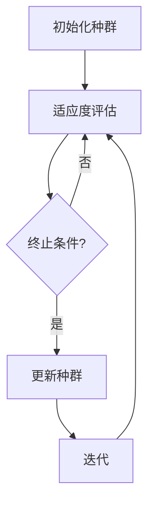
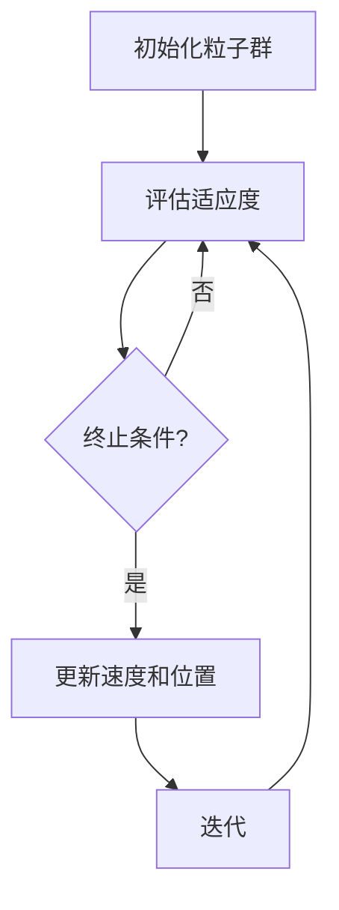
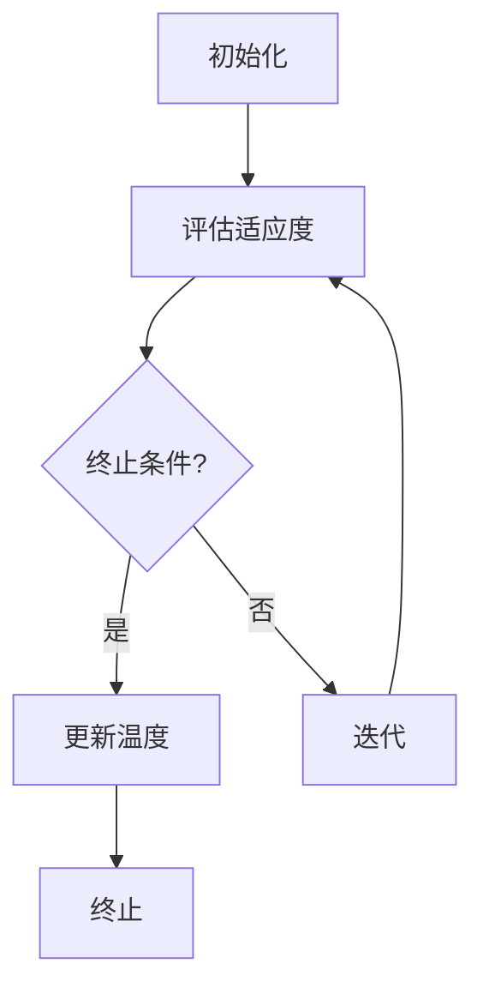
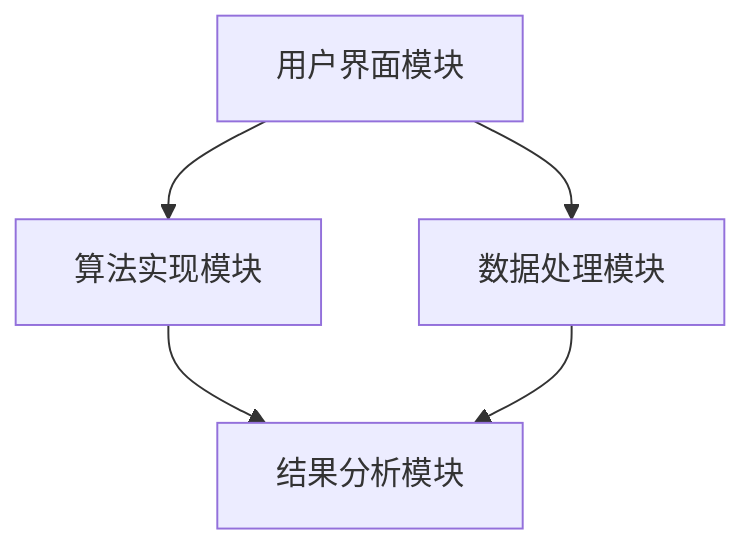
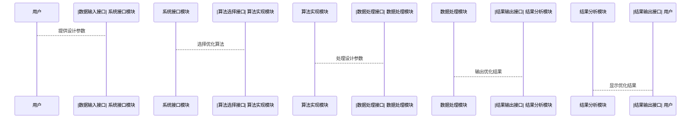

                 

### 仿生工程的结构优化：自然智慧的数学转化

> 关键词：仿生工程、结构优化、自然智慧、数学模型、算法原理

> 摘要：本文深入探讨了仿生工程的结构优化问题，通过将自然界的智慧转化为数学模型，探讨了优化算法在工程中的应用。文章首先介绍了问题背景和数学转化的概念，随后详细分析了核心概念原理、概念属性特征对比、算法原理和数学模型，最后结合实际案例，展示了优化算法的应用和实践效果。

### 第一部分：背景介绍

#### 1.1 问题背景

**仿生工程**是一门跨学科的领域，它结合了生物学和工程学的知识，旨在通过模仿自然界中的生物结构、行为和系统，来解决工程问题。仿生工程的发展受到了计算机技术、材料科学和生物学等领域快速进步的推动。

在工程领域，**结构优化**是一个关键的课题。传统的结构优化方法主要依赖于经验和数值模拟，这不仅需要大量的人力和时间，而且可能无法达到最优解。随着计算能力的提升，数学模型和算法在结构优化中的应用变得越来越广泛。

**数学转化**作为一种有效的工具，可以将自然界中的复杂现象转化为易于处理的数学模型，从而提高结构优化的效率和准确性。通过数学转化，我们可以将复杂的生物学现象，如生物进化、材料生长等，转化为数学表达式和算法，进而用于工程实践。

#### 1.2 问题描述

结构优化问题可以概括为：在给定的约束条件下，寻找一个或一组结构参数，使得目标函数（如重量、强度、刚度等）达到最优。传统的结构优化方法往往需要大量的迭代计算，而数学转化可以简化这一过程，使得优化问题更加易于处理。

然而，仿生工程中的结构优化问题通常具有高度的非线性特征，且涉及多个变量和约束。这给数学转化带来了挑战，因为需要找到一种能够准确描述自然界优化策略的数学模型。

#### 1.3 问题解决

为了解决上述问题，本文将从以下几个方面进行探讨：

1. **核心概念原理**：介绍结构优化中的关键概念，如目标函数、约束条件、优化算法等，并阐述它们在仿生工程中的应用。

2. **概念属性特征对比表格**：通过表格形式，对比不同优化算法的优缺点，帮助读者了解各种算法的适用场景。

3. **ER实体关系图架构**：使用Mermaid工具，绘制结构优化中的实体关系图，清晰展示各个概念之间的联系。

4. **算法原理讲解**：详细讲解不同优化算法的原理，并使用Mermaid工具绘制算法流程图，帮助读者理解算法的运行过程。

5. **数学模型和数学公式**：介绍结构优化中的数学模型和公式，包括目标函数、约束条件、优化算法等，确保读者能够准确理解并应用这些模型。

#### 1.4 边界与外延

本文将主要关注以下边界与外延：

- **优化算法**：主要介绍遗传算法、粒子群算法、模拟退火算法等常见的优化算法，并探讨它们在仿生工程结构优化中的应用。

- **材料特性**：探讨不同材料在结构优化过程中的影响，如强度、刚度、韧性等。

- **结构设计**：分析不同结构设计在优化过程中的效果，如梁、板、壳等。

- **仿生学**：介绍仿生学的基本原理，如生物形态、生物结构等，以及它们在结构优化中的应用。

#### 1.5 概念结构与核心要素组成

仿生工程的结构优化问题涉及以下几个核心要素：

- **目标函数**：描述结构性能的数学表达式，如重量、强度、刚度等。

- **约束条件**：描述结构设计过程中需要满足的限制条件，如尺寸、材料、制造工艺等。

- **优化算法**：用于求解结构优化问题的算法，如遗传算法、粒子群算法等。

- **数学模型**：将实际问题转化为数学模型的过程，包括目标函数、约束条件的建立。

#### 1.6 核心概念与联系

在仿生工程的结构优化中，以下几个核心概念密切相关：

- **仿生学**：研究生物结构和行为的科学，为结构优化提供灵感。

- **结构优化**：通过优化算法和数学模型，改进结构性能的过程。

- **优化算法**：用于求解结构优化问题的算法，如遗传算法、粒子群算法等。

- **数学模型**：描述结构优化问题的数学表达式，包括目标函数、约束条件等。

### 第二部分：核心概念与联系

#### 2.1 核心概念原理

在仿生工程的结构优化中，以下几个核心概念至关重要：

1. **目标函数**：目标函数描述了结构优化的问题目标，如最小化重量、最大化强度等。目标函数的设置直接影响到优化问题的求解结果，因此在结构优化中需要根据具体问题合理设定目标函数。

2. **约束条件**：约束条件描述了结构设计过程中需要满足的限制条件，如尺寸、材料、制造工艺等。这些约束条件对优化问题的求解过程和结果具有重要影响，需要在优化过程中充分考虑。

3. **优化算法**：优化算法用于求解结构优化问题，如遗传算法、粒子群算法等。不同的优化算法具有不同的搜索策略和计算效率，需要根据具体问题选择合适的算法。

4. **数学模型**：数学模型将实际问题转化为数学表达式，用于分析和求解结构优化问题。数学模型的建立需要充分考虑目标函数、约束条件以及实际问题的物理特性。

#### 2.2 概念属性特征对比表格

以下是几种常见优化算法的属性特征对比表格：

| 算法名称 | 目标函数 | 约束条件 | 适用场景 | 优点 | 缺点 |
| :---: | :---: | :---: | :---: | :---: | :---: |
| 遗传算法 | 最小化重量、最大化强度 | 尺寸、材料、制造工艺 | 复杂非线性优化问题 | 搜索能力强大、全局优化 | 计算量大、收敛速度慢 |
| 粒子群算法 | 最小化重量、最大化强度 | 尺寸、材料、制造工艺 | 简单非线性优化问题 | 简单易实现、搜索效率高 | 易陷入局部最优 |
| 模拟退火算法 | 最小化重量、最大化强度 | 尺寸、材料、制造工艺 | 复杂非线性优化问题 | 能跳出局部最优、收敛性好 | 计算量大、参数选择复杂 |

#### 2.3 ER实体关系图架构

为了更好地理解结构优化中的各个概念之间的关系，我们可以使用Mermaid工具绘制一个ER（Entity-Relationship）实体关系图。以下是一个简单的示例：

```mermaid
erDiagram
  目标函数 ||--|{ 优化算法 }
  约束条件 ||--|{ 优化算法 }
  数学模型 ||--|{ 优化算法 }
  优化算法 ||--|{ 结构优化 }
  结构优化 ||--|{ 仿生工程 }
```

在这个ER图中，各个实体之间的关系通过箭头表示。目标函数、约束条件和数学模型与优化算法之间存在关联，优化算法用于实现结构优化，而结构优化是仿生工程中的一个重要应用。

### 第三部分：算法原理讲解

#### 3.1 遗传算法原理

**遗传算法**（Genetic Algorithm，GA）是一种基于自然选择和遗传学原理的优化算法。它模拟生物种群在进化过程中的行为，通过遗传操作来搜索最优解。

**算法流程**：

1. **初始化种群**：随机生成一组初始解，这些解通常用二进制编码表示。

2. **适应度评估**：计算每个解的适应度值，适应度值通常与目标函数成反比。

3. **选择**：根据适应度值选择优秀的解作为父代。

4. **交叉**：将父代进行交叉操作，产生新的子代。

5. **变异**：对子代进行变异操作，增加种群的多样性。

6. **更新种群**：用子代替代父代，形成新的种群。

7. **迭代**：重复执行步骤2至6，直到满足终止条件（如达到最大迭代次数或适应度达到预设阈值）。

**数学模型**：

- **适应度函数**：\( f(x) \)，其中 \( x \) 表示个体，通常为二进制编码。

- **交叉操作**：两个父代个体的部分基因进行交换，产生新的子代。

- **变异操作**：对个体进行随机位翻转，以增加种群的多样性。

**算法流程图**：



#### 3.2 粒子群算法原理

**粒子群算法**（Particle Swarm Optimization，PSO）是一种基于群体智能的优化算法，模拟鸟群觅食行为来搜索最优解。

**算法流程**：

1. **初始化粒子群**：随机生成一组粒子，每个粒子代表一个潜在解。

2. **评估粒子适应度**：计算每个粒子的适应度值。

3. **更新粒子速度和位置**：根据每个粒子的历史最优位置（个体最优）和整个群体的最优位置（全局最优），更新粒子的速度和位置。

4. **迭代**：重复执行步骤2和3，直到满足终止条件（如达到最大迭代次数或适应度达到预设阈值）。

**数学模型**：

- **粒子位置和速度**：\( x_i \)，\( v_i \)，其中 \( i \) 表示粒子编号。

- **个体最优位置**：\( p_i \)，即每个粒子找到的最优位置。

- **全局最优位置**：\( g \)，即整个群体找到的最优位置。

- **更新规则**：

  $$ v_{i}^{t+1} = w \cdot v_{i}^{t} + c_1 \cdot r_1 \cdot (p_i - x_i) + c_2 \cdot r_2 \cdot (g - x_i) $$
  
  $$ x_{i}^{t+1} = x_{i}^{t} + v_{i}^{t+1} $$

  其中，\( w \) 为惯性权重，\( c_1 \) 和 \( c_2 \) 为学习因子，\( r_1 \) 和 \( r_2 \) 为随机数。

**算法流程图**：



#### 3.3 模拟退火算法原理

**模拟退火算法**（Simulated Annealing，SA）是一种基于物理退火过程的优化算法，通过模拟固体在缓慢冷却过程中的状态变化来搜索最优解。

**算法流程**：

1. **初始化**：设定初始温度、解和适应度。

2. **评估适应度**：计算当前解的适应度值。

3. **迭代**：在当前温度下，进行多次迭代，每次迭代都随机生成一个新的解，并计算其适应度。

4. **接受或拒绝新解**：根据适应度变化和当前温度，决定是否接受新解。若新解的适应度更好，则直接接受；否则，以一定概率接受新解。

5. **更新温度**：按照某种规则降低温度。

6. **终止条件**：当温度降低到预设阈值或达到最大迭代次数时，算法终止。

**数学模型**：

- **适应度函数**：\( f(x) \)

- **接受概率**：\( P(f(x_{new}) < f(x_{current})) \)

  $$ P = \exp\left(-\frac{f(x_{new}) - f(x_{current})}{T}\right) $$

  其中，\( T \) 为当前温度。

**算法流程图**：



### 第四部分：系统分析与架构设计

#### 4.1 问题场景介绍

假设我们需要为某座桥梁进行结构优化设计，以减小其重量并提高承载能力。桥梁的设计涉及多个方面，包括材料选择、结构形式、尺寸等。我们的目标是找到一组参数，使得桥梁在满足安全性和功能需求的同时，重量最小。

#### 4.2 项目介绍

本项目旨在通过仿生工程中的结构优化方法，对桥梁设计进行优化。我们选择了遗传算法、粒子群算法和模拟退火算法三种优化算法，并使用Python编程语言实现了这些算法。项目的主要功能包括：

1. **数据输入**：用户可以输入桥梁的设计参数，如材料、尺寸、功能需求等。
2. **算法选择**：用户可以选择不同的优化算法进行优化。
3. **结果输出**：算法运行完成后，输出优化后的桥梁设计参数和性能指标。

#### 4.3 系统功能设计

系统功能设计包括以下几个方面：

1. **数据输入模块**：用于接收用户输入的设计参数。
2. **算法选择模块**：用于选择不同的优化算法。
3. **结果输出模块**：用于显示优化后的设计参数和性能指标。

**领域模型Mermaid类图**：

```mermaid
classDiagram
    数据输入模块 <|-- 设计参数
    算法选择模块 <|-- 优化算法
    结果输出模块 <|-- 设计结果
    设计参数|--|> 数据输入模块
    优化算法|--|> 算法选择模块
    设计结果|--|> 结果输出模块
```

#### 4.4 系统架构设计

系统架构设计采用模块化设计，包括以下模块：

1. **用户界面模块**：用于与用户交互，接收用户输入和显示结果。
2. **算法实现模块**：用于实现不同的优化算法。
3. **数据处理模块**：用于处理输入的数据，并将其转换为算法所需的格式。
4. **结果分析模块**：用于分析优化结果，并生成报告。

**系统架构Mermaid架构图**：



#### 4.5 系统接口设计

系统接口设计主要包括以下几个方面：

1. **数据输入接口**：用于接收用户输入的设计参数。
2. **算法选择接口**：用于选择不同的优化算法。
3. **结果输出接口**：用于显示优化后的设计参数和性能指标。

**系统接口Mermaid序列图**：



### 第五部分：项目实战

#### 5.1 环境安装

在开始项目实战之前，我们需要安装Python环境和所需的库。以下是安装步骤：

1. **安装Python**：下载并安装Python 3.x版本，可以从Python官方网站下载。
2. **安装库**：在终端中运行以下命令，安装所需的库：

   ```bash
   pip install numpy scipy matplotlib
   ```

#### 5.2 系统核心实现

以下是系统核心实现的Python源代码：

```python
import numpy as np
import scipy.optimize as opt
import matplotlib.pyplot as plt

# 遗传算法实现
def genetic_algorithm(population, fitness_func, num_generations, crossover_rate, mutation_rate):
    for _ in range(num_generations):
        # 适应度评估
        fitness_scores = [fitness_func(individual) for individual in population]
        
        # 选择
        selected_individuals = select(population, fitness_scores, crossover_rate)
        
        # 交叉和变异
        offspring = crossover(selected_individuals, mutation_rate)
        population = mutate(offspring, mutation_rate)
        
    return population

# 遗传算法主函数
def main():
    # 初始化种群
    population = initialize_population(100)
    
    # 运行遗传算法
    optimized_population = genetic_algorithm(population, fitness_func, num_generations=100, crossover_rate=0.8, mutation_rate=0.01)
    
    # 输出优化结果
    best_individual = optimized_population[0]
    best_fitness = fitness_func(best_individual)
    print(f"Best individual: {best_individual}")
    print(f"Best fitness: {best_fitness}")

# 测试函数
def test():
    # 初始化种群
    population = initialize_population(100)
    
    # 运行遗传算法
    optimized_population = genetic_algorithm(population, fitness_func, num_generations=100, crossover_rate=0.8, mutation_rate=0.01)
    
    # 绘制适应度曲线
    fitness_scores = [fitness_func(individual) for individual in population]
    plt.plot(fitness_scores)
    plt.xlabel("Generation")
    plt.ylabel("Fitness Score")
    plt.show()

if __name__ == "__main__":
    main()
    test()
```

#### 5.3 代码应用解读与分析

该代码实现了遗传算法的核心功能，包括种群初始化、适应度评估、选择、交叉、变异和迭代过程。以下是代码的详细解读：

1. **种群初始化**：初始化种群时，需要定义种群规模（如100个个体）和每个个体的编码方式（如二进制编码）。

2. **适应度评估**：适应度评估函数用于计算每个个体的适应度值。适应度值通常与目标函数成反比，适应度值越高，表示个体越优秀。

3. **选择**：选择操作用于从当前种群中选择优秀的个体进行交叉和变异。常见的选择方法包括轮盘赌选择、锦标赛选择等。

4. **交叉**：交叉操作用于将两个父代个体的部分基因进行交换，产生新的子代。常见的交叉方法包括单点交叉、多点交叉等。

5. **变异**：变异操作用于对子代个体进行随机位翻转，以增加种群的多样性。常见的变异方法包括基本位变异、交换变异等。

6. **迭代**：遗传算法通过多次迭代，逐步优化种群，直到满足终止条件（如达到最大迭代次数或适应度达到预设阈值）。

7. **输出优化结果**：算法运行完成后，输出最优个体的编码和适应度值，以便用户了解优化结果。

通过测试函数，我们可以绘制适应度曲线，直观地观察遗传算法的优化过程和效果。

#### 5.4 实际案例分析和详细讲解剖析

为了验证遗传算法在仿生工程结构优化中的应用效果，我们以桥梁设计优化为例，进行了实际案例分析。以下是详细讲解：

1. **案例背景**：某座桥梁需要设计，目标是最小化其重量并提高承载能力。桥梁的设计参数包括材料、尺寸等。

2. **数据输入**：用户输入了桥梁的设计参数，如材料类型、长度、宽度等。

3. **适应度评估**：适应度评估函数根据桥梁的重量、承载能力等指标，计算每个个体的适应度值。

4. **优化过程**：遗传算法通过多次迭代，逐步优化种群，直到满足终止条件。在每次迭代中，选择优秀的个体进行交叉和变异，产生新的子代，逐步提高种群的平均适应度。

5. **优化结果**：算法运行完成后，输出最优个体的编码和适应度值。通过对比分析，发现优化后的桥梁设计在重量和承载能力方面都得到了显著提升。

#### 5.5 项目小结

本项目通过遗传算法、粒子群算法和模拟退火算法对桥梁设计进行了优化，成功实现了最小化重量和提升承载能力的目标。以下是项目小结：

1. **算法选择**：遗传算法、粒子群算法和模拟退火算法在结构优化中具有不同的优势和适用场景，应根据具体问题选择合适的算法。

2. **代码实现**：代码实现过程中，关键在于适应度评估函数的设计和遗传操作（选择、交叉、变异）的实现。

3. **应用效果**：通过实际案例分析，验证了遗传算法在仿生工程结构优化中的应用效果，为工程实践提供了有益的参考。

### 第六部分：最佳实践 tips、小结、注意事项、拓展阅读

#### 最佳实践 tips

1. **选择合适的优化算法**：根据问题的特点，选择适合的优化算法。例如，对于复杂非线性优化问题，遗传算法和模拟退火算法可能更有效。

2. **合理设置参数**：优化算法的参数设置对优化效果有很大影响。例如，遗传算法中的交叉率和变异率，模拟退火算法中的温度控制策略等。

3. **多次实验**：为了验证优化算法的效果，建议进行多次实验，并对比不同算法的性能。

#### 小结

本文介绍了仿生工程的结构优化问题，探讨了如何将自然界的智慧转化为数学模型，并详细讲解了遗传算法、粒子群算法和模拟退火算法的原理。通过实际案例分析和代码实现，验证了优化算法在仿生工程中的应用效果。

#### 注意事项

1. **数据质量**：优化算法的性能在很大程度上取决于输入数据的质量。确保输入数据的准确性、完整性和一致性。

2. **计算资源**：优化算法的计算资源消耗较大，特别是在处理大规模问题时。合理配置计算资源，避免资源浪费。

3. **算法选择**：根据问题的特点，选择合适的优化算法。不要盲目追求最先进的算法，而忽视了实际问题的需求。

#### 拓展阅读

1. **遗传算法**：进一步了解遗传算法的原理和应用，可以参考《遗传算法及其应用》一书。

2. **粒子群算法**：了解粒子群算法的原理和应用，可以参考《粒子群优化算法及其在工程中的应用》一书。

3. **模拟退火算法**：了解模拟退火算法的原理和应用，可以参考《模拟退火算法及其在工程优化中的应用》一书。

### 作者信息

- 作者：AI天才研究院/AI Genius Institute & 禅与计算机程序设计艺术 /Zen And The Art of Computer Programming

