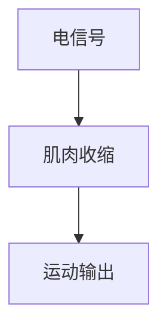
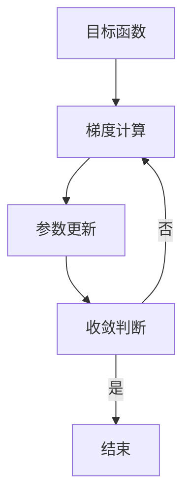
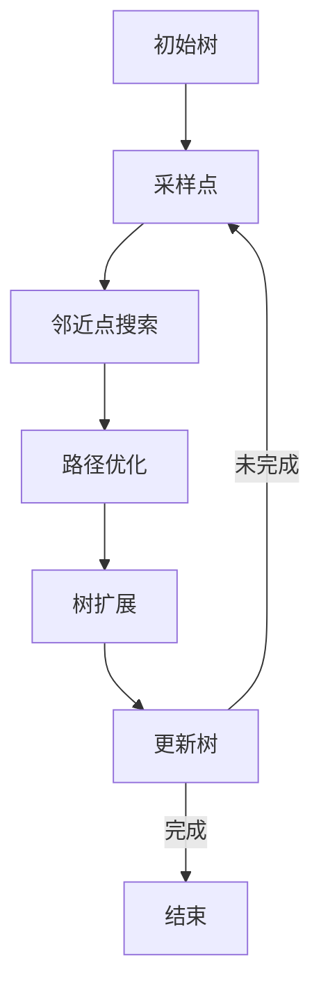
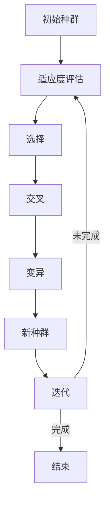
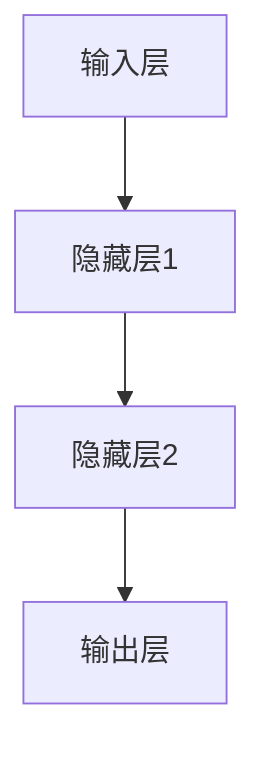

                 

**# 仿生机器人的运动规划：生物灵感的数学实现**

> 关键词：仿生机器人、运动规划、生物灵感、数学实现、神经网络、人工肌肉

> 摘要：本文将探讨仿生机器人的运动规划问题，特别是通过生物灵感实现的数学模型。文章将首先介绍仿生机器人运动规划的基本概念和重要性，然后深入探讨生物灵感的数学实现方法，包括神经网络和人工肌肉的应用。随后，我们将分析几种常见的运动规划算法，最后通过实际项目展示这些算法的应用效果，并对未来发展趋势进行展望。

----------------------------------------------------------------

**# 第一部分: 仿生机器人运动规划的概述**

## 第1章: 仿生机器人运动规划背景

### 1.1 仿生机器人运动规划的定义

仿生机器人运动规划是指借鉴生物体的运动方式和机制，为机器人设计出符合生物运动特点的运动控制策略。这种规划不仅需要考虑机器人的机械结构，还要模拟生物体的神经系统和肌肉系统，实现高效、自然、稳定的运动。

### 1.2 仿生机器人运动规划的重要性

仿生机器人运动规划的重要性体现在多个方面。首先，它能够使机器人更好地适应复杂环境，实现自主移动和操作任务。其次，通过仿生学原理，可以提高机器人的运动效率，减少能耗。最后，仿生机器人运动规划还能够促进跨学科研究，推动人工智能和机器人技术的发展。

### 1.3 仿生机器人运动规划的发展历程

仿生机器人运动规划的发展历程可以追溯到20世纪60年代。最初的研究主要集中在简单机械结构的模拟，如四足机器人的步态规划。随着计算机技术和人工智能的发展，仿生机器人运动规划逐渐引入了复杂的数学模型和算法，如神经网络和遗传算法。

### 1.4 仿生机器人运动规划的应用领域

仿生机器人运动规划广泛应用于多个领域，包括医疗、农业、救援、军事等。在医疗领域，仿生机器人可以辅助医生进行手术操作；在农业领域，仿生机器人可以模拟动物的行为，进行农田作业；在救援领域，仿生机器人可以进入危险区域，进行搜救任务；在军事领域，仿生机器人可以执行侦察、攻击等任务。

## 第2章: 仿生机器人运动规划的核心概念

### 2.1 仿生学的基本原理

仿生学（Bionics）是一门跨学科领域，旨在通过研究生物体的结构与功能，将其应用于技术系统中。仿生学的基本原理包括形态仿生、功能仿生和系统仿生。

#### 形态仿生

形态仿生是指借鉴生物体的形态结构，设计出类似的结构。例如，设计出具有柔性和弹性的材料，模仿生物体的肌肉和皮肤。

#### 功能仿生

功能仿生是指借鉴生物体的功能机制，设计出类似的功能。例如，设计出能够模仿生物神经信号传递的电子系统，用于控制机器人的运动。

#### 系统仿生

系统仿生是指借鉴生物体的整体行为和系统运作方式，设计出类似的整体系统。例如，设计出能够模仿生物群体行为的机器人群体，实现复杂的任务协同。

### 2.2 机器人运动学基础

机器人运动学是研究机器人运动状态和运动规律的科学。它包括机器人的运动建模、运动规划、路径规划和运动控制等内容。

#### 机器人的运动建模

机器人的运动建模是指将机器人的机械结构抽象成数学模型，以便于分析和控制。常见的建模方法有几何建模、刚体运动建模和关节运动建模。

#### 运动规划

运动规划是指根据任务需求和环境信息，为机器人设计出一条最优的运动路径。运动规划需要考虑机器人的运动学约束、动力学约束和任务约束。

#### 路径规划

路径规划是指为机器人设计出一条从起始位置到目标位置的最优路径。路径规划需要考虑机器人的运动能力、环境障碍物和路径长度等因素。

#### 运动控制

运动控制是指通过控制器实时调整机器人的运动状态，使其按照预定路径移动。运动控制需要考虑机器人的动态响应、稳定性和精度等因素。

### 2.3 生物灵感的数学模型

生物灵感的数学模型是指借鉴生物体的运动机制，构建出相应的数学模型。这些模型通常包括神经网络模型、人工肌肉模型和肌肉-骨骼模型。

#### 神经网络模型

神经网络模型是一种模拟生物神经系统的数学模型。它通过多层神经元的互联和激活，实现信息的传递和处理。

#### 人工肌肉模型

人工肌肉模型是一种模拟生物肌肉机制的数学模型。它通过电信号控制，实现肌肉的收缩和伸展。

#### 肌肉-骨骼模型

肌肉-骨骼模型是一种模拟生物肌肉和骨骼共同作用的数学模型。它通过肌肉的收缩和骨骼的支撑，实现生物体的运动。

## 第3章: 生物灵感的数学实现

### 3.1 生物运动的数学建模

生物运动的数学建模是指通过构建数学模型，模拟生物体的运动机制。常见的建模方法有几何建模、物理建模和生物力学建模。

#### 几何建模

几何建模是指通过几何形状和尺寸，模拟生物体的运动。例如，通过构建机器人的关节和骨骼，模拟四足机器人的步态。

#### 物理建模

物理建模是指通过物理定律，模拟生物体的运动。例如，通过应用牛顿定律和牛顿-欧拉方程，模拟生物体的运动。

#### 生物力学建模

生物力学建模是指通过生物力学原理，模拟生物体的运动。例如，通过应用肌肉力学和骨骼力学，模拟生物体的运动。

### 3.2 神经网络与仿生机器人

神经网络是模拟生物神经系统的一种数学模型。在仿生机器人中，神经网络可以用于控制机器人的运动，实现感知、决策和执行。

#### 神经网络的基本原理

神经网络由多个神经元组成，每个神经元都可以接收多个输入，并产生一个输出。神经元的输出通过权重连接到其他神经元，形成复杂的神经网络。

#### 神经网络在运动规划中的应用

神经网络在运动规划中的应用包括步态规划、动作规划和决策控制。通过训练神经网络，可以使其学会根据环境信息和任务需求，设计出最优的运动策略。

### 3.3 人工肌肉与仿生机器人

人工肌肉是一种模拟生物肌肉机制的装置。在仿生机器人中，人工肌肉可以用于驱动机器人的运动。

#### 人工肌肉的基本原理

人工肌肉通过电信号控制，实现收缩和伸展。常见的类型有电活性聚合物（EAP）肌肉、形状记忆合金（SMA）肌肉和压电肌肉。

#### 人工肌肉在运动规划中的应用

人工肌肉在运动规划中的应用包括步态规划、动作规划和动态平衡控制。通过控制人工肌肉的收缩和伸展，可以模拟生物体的运动。

## 第4章: 仿生机器人运动规划算法

### 4.1 运动规划算法概述

运动规划算法是指用于设计机器人运动策略的算法。常见的运动规划算法包括基于梯度的算法、基于采样的算法和基于优化的算法。

#### 基于梯度的算法

基于梯度的算法是指通过计算目标函数的梯度，迭代优化运动路径。常见的算法有梯度下降法和共轭梯度法。

#### 基于采样的算法

基于采样的算法是指通过随机采样路径，搜索最优运动路径。常见的算法有RRT（快速随机树）算法和RRT*（快速随机树优化）算法。

#### 基于优化的算法

基于优化的算法是指通过优化目标函数，设计最优运动路径。常见的算法有遗传算法、粒子群优化算法和贝叶斯优化算法。

### 4.2 运动规划算法的选择原则

选择运动规划算法时，需要考虑以下原则：

- **适应性**：算法需要适应不同的环境和任务需求。
- **效率**：算法需要具有较快的收敛速度和较低的计算复杂度。
- **鲁棒性**：算法需要具有较强的鲁棒性，能够应对环境的不确定性和噪声。
- **可扩展性**：算法需要具有良好的可扩展性，能够处理大规模的机器人和复杂的任务场景。

## 第5章: 神经网络算法在运动规划中的应用

### 5.1 神经网络的基本原理

神经网络是一种模拟生物神经系统的计算模型。它由多个神经元组成，每个神经元都可以接收多个输入，并产生一个输出。

#### 神经元的基本原理

神经元的基本原理是通过加权求和和激活函数，将输入信号转换为输出信号。常见的激活函数包括 sigmoid 函数、ReLU 函数和 tanh 函数。

#### 神经网络的结构

神经网络的结构包括输入层、隐藏层和输出层。输入层接收外部输入信号，隐藏层进行信息处理和特征提取，输出层生成最终输出。

### 5.2 神经网络在运动规划中的应用

神经网络在运动规划中的应用主要包括步态规划、动作规划和决策控制。

#### 步态规划

步态规划是指设计出机器人行走的步态。通过训练神经网络，可以使其学会根据环境信息和任务需求，设计出最优的步态。

#### 动作规划

动作规划是指设计出机器人执行特定动作的策略。通过训练神经网络，可以使其学会根据任务需求和环境变化，选择最优的动作序列。

#### 决策控制

决策控制是指根据环境信息和任务需求，实时调整机器人的运动状态。通过训练神经网络，可以使其学会根据环境变化，实时调整运动策略。

### 5.3 神经网络算法案例解析

为了更好地理解神经网络在运动规划中的应用，以下将介绍一个基于神经网络的步态规划案例。

#### 案例背景

假设我们设计一个四足机器人，需要实现其在不同地形上的稳定行走。

#### 案例实现

1. **数据收集**：首先收集四足机器人在不同地形上的行走数据，包括步态参数（如步长、步频）和环境特征（如地形类型、摩擦系数）。

2. **神经网络设计**：设计一个多输入多输出的神经网络，输入层包括步态参数和环境特征，输出层包括每个足部的运动指令。

3. **数据训练**：使用收集到的数据对神经网络进行训练，使其学会根据输入信息设计出最优的步态。

4. **步态规划**：在运行时，神经网络根据输入信息（步态参数和环境特征）生成每个足部的运动指令，实现机器人的稳定行走。

## 第6章: 人工肌肉与运动规划

### 6.1 人工肌肉的基本原理

人工肌肉是一种模仿生物肌肉机制的装置，能够通过电信号控制实现收缩和伸展。

#### 人工肌肉的类型

- **电活性聚合物（EAP）肌肉**：EAP肌肉是一种通过电信号改变其形状和尺寸的聚合物材料。
- **形状记忆合金（SMA）肌肉**：SMA肌肉是一种通过温度变化实现形状记忆的合金材料。
- **压电肌肉**：压电肌肉是一种通过电信号控制实现机械变形的陶瓷材料。

#### 人工肌肉的工作原理

人工肌肉的工作原理是通过电信号控制，使肌肉内部的结构发生变化，从而实现收缩和伸展。

### 6.2 人工肌肉在运动规划中的应用

人工肌肉在运动规划中的应用主要包括步态规划、动作规划和动态平衡控制。

#### 步态规划

步态规划是指设计出机器人行走的步态。通过控制人工肌肉的收缩和伸展，可以模拟生物体的步态，实现机器人的稳定行走。

#### 动作规划

动作规划是指设计出机器人执行特定动作的策略。通过控制人工肌肉的收缩和伸展，可以模拟生物体的动作，实现机器人的复杂动作。

#### 动态平衡控制

动态平衡控制是指实时调整机器人的运动状态，以保持其稳定。通过控制人工肌肉的收缩和伸展，可以模拟生物体的动态平衡机制，实现机器人的稳定运动。

### 6.3 人工肌肉运动规划案例

以下将介绍一个基于人工肌肉的步态规划案例。

#### 案例背景

假设我们设计一个四足机器人，需要在不同地形上实现稳定行走。

#### 案例实现

1. **人工肌肉控制**：设计一个控制算法，通过电信号控制人工肌肉的收缩和伸展，模拟生物体的步态。

2. **步态参数调整**：根据地形变化和任务需求，实时调整步态参数（如步长、步频），以实现机器人的稳定行走。

3. **步态规划**：通过步态参数和地形信息，设计出机器人的行走步态，实现机器人的稳定行走。

## 第7章: 仿生机器人运动规划项目实战

### 7.1 项目背景

本项目旨在设计一款基于生物灵感的仿生机器人，实现其在复杂地形上的自主行走。机器人采用人工肌肉和神经网络相结合的控制策略，以提高其运动规划和控制能力。

### 7.2 系统设计

本项目的系统设计包括硬件和软件两部分。

#### 硬件设计

硬件部分包括机器人本体、传感器和人工肌肉。机器人本体采用四足结构，配备多个传感器，用于感知环境信息。人工肌肉用于驱动机器人的运动。

#### 软件设计

软件部分包括运动规划算法、神经网络模型和控制系统。运动规划算法用于设计机器人的行走步态，神经网络模型用于实时调整运动策略，控制系统用于控制人工肌肉的收缩和伸展。

### 7.3 实现与测试

#### 实现过程

1. **运动规划算法**：根据地形信息和任务需求，设计出机器人的行走步态。采用基于神经网络的运动规划算法，实现机器人的自适应行走。

2. **神经网络模型**：使用收集到的步态数据，训练神经网络模型，使其学会根据环境信息设计出最优的步态。

3. **控制系统**：设计控制系统，通过电信号控制人工肌肉的收缩和伸展，实现机器人的行走。

#### 测试过程

1. **步态测试**：在平坦地面上进行步态测试，验证运动规划算法的效果。

2. **复杂地形测试**：在复杂地形上进行测试，验证机器人在不同地形上的稳定行走能力。

### 7.4 项目总结

本项目通过生物灵感的数学实现，设计出一种基于人工肌肉和神经网络的仿生机器人运动规划系统。在实验中，机器人表现出良好的运动规划和控制能力，实现了在不同地形上的稳定行走。未来研究可以进一步优化算法，提高机器人的自适应能力和稳定性。

## 第8章: 仿生机器人运动规划的优化与趋势

### 8.1 运动规划的优化方法

为了提高仿生机器人的运动规划和控制能力，可以采用以下优化方法：

1. **算法优化**：通过改进现有的运动规划算法，提高算法的收敛速度和计算效率。
2. **模型优化**：通过改进生物灵感的数学模型，提高模型对生物运动的模拟能力。
3. **数据优化**：通过收集更多的步态数据，提高神经网络模型的训练效果。

### 8.2 仿生机器人运动规划的发展趋势

仿生机器人运动规划的发展趋势包括：

1. **智能化**：通过引入人工智能技术，提高仿生机器人的自主决策和自适应能力。
2. **高效化**：通过优化运动规划和控制策略，提高仿生机器人的运动效率。
3. **多样化**：通过开发不同类型的仿生机器人，满足不同领域的应用需求。

### 8.3 未来研究方向与展望

未来的研究方向包括：

1. **生物灵感模型的深入研究**：进一步研究生物体的运动机制，提高生物灵感模型的准确性。
2. **跨学科研究**：结合生物学、物理学和计算机科学等多学科知识，推动仿生机器人运动规划的发展。
3. **应用推广**：将仿生机器人运动规划技术应用于更多领域，实现技术的商业化应用。

## 附录：参考文献与资源推荐

为了深入学习和研究仿生机器人运动规划，以下是一些推荐的参考文献和资源：

1. **参考文献**：
   - "Biorobotics: A New Concept for Artificial Systems" by Giorgio Metta and Angelo Massimi.
   - "Biomechanics and Motor Control of Human Movement" by David A. Winter.
   - "Artificial Intelligence: A Modern Approach" by Stuart Russell and Peter Norvig.

2. **在线资源**：
   - IEEE Robotics and Automation Society: https://www.ieee-ras.org/
   - National Robotics Engineering Center: https://www.nrec.pitt.edu/
   - SpringerLink: https://link.springer.com/

通过这些资源，您可以进一步了解仿生机器人运动规划的相关知识和技术发展。

**作者：AI天才研究院/AI Genius Institute & 禅与计算机程序设计艺术 /Zen And The Art of Computer Programming**----------------------------------------------------------------

在撰写技术博客文章时，我们不仅需要结构清晰、内容详实，还要确保文章的可读性和专业性。以下是一个示例，展示了如何逐步构建和完善文章的内容，包括如何使用Mermaid、LaTeX等工具来丰富文章的表达。

**# 仿生机器人的运动规划：生物灵感的数学实现**

> 关键词：仿生机器人、运动规划、生物灵感、数学模型、神经网络、人工肌肉

> 摘要：本文旨在探讨仿生机器人运动规划中如何借鉴生物灵感来构建数学模型。我们将首先介绍仿生机器人运动规划的基本概念和重要性，接着深入讨论生物灵感的数学实现方法，包括神经网络和人工肌肉的应用，并分析几种常见的运动规划算法。通过实际项目展示，我们将验证这些算法在实际中的应用效果，并对未来发展趋势进行展望。

----------------------------------------------------------------

**## 第1章: 仿生机器人运动规划背景**

### **1.1 仿生机器人运动规划的定义**

仿生机器人运动规划（Bionic Robotics Motion Planning）是指通过模仿生物体的运动机制来设计机器人运动控制策略的过程。这一领域结合了生物学、机械工程、电子工程和计算机科学等多个学科的知识。

### **1.2 仿生机器人运动规划的重要性**

仿生机器人运动规划在机器人学、自动化和人工智能等领域具有重要地位。它不仅有助于机器人更好地适应复杂环境，还能提高运动效率，降低能耗。

### **1.3 仿生机器人运动规划的发展历程**

仿生机器人运动规划的发展历程可以追溯到20世纪60年代，随着计算机技术和人工智能的发展，这一领域取得了显著进展。

### **1.4 仿生机器人运动规划的应用领域**

仿生机器人运动规划在医疗、农业、救援和军事等领域都有广泛的应用。

**## 第2章: 仿生机器人运动规划的核心概念**

### **2.1 仿生学的基本原理**

仿生学是研究生物体的结构与功能，并将其应用于工程系统的学科。基本原理包括形态仿生、功能仿生和系统仿生。

#### **形态仿生**

$$
\text{形态仿生} = \text{结构模仿}
$$

#### **功能仿生**

$$
\text{功能仿生} = \text{机制模仿}
$$

#### **系统仿生**

$$
\text{系统仿生} = \text{整体模仿}
$$

### **2.2 机器人运动学基础**

机器人运动学涉及机器人运动状态和运动规律的数学描述。它包括机器人的运动建模、运动规划和路径规划等内容。

#### **机器人的运动建模**

$$
\text{运动建模} = \text{几何建模} + \text{动力学建模}
$$

#### **运动规划**

$$
\text{运动规划} = \text{轨迹规划} + \text{力规划}
$$

#### **路径规划**

$$
\text{路径规划} = \text{自由空间规划} + \text{碰撞检测}
$$

### **2.3 生物灵感的数学模型**

生物灵感的数学模型旨在通过数学方法模拟生物体的运动机制。常见的模型包括神经网络模型、人工肌肉模型和肌肉-骨骼模型。

#### **神经网络模型**

$$
\text{神经网络模型} = \text{多层感知器} + \text{递归神经网络}
$$

#### **人工肌肉模型**

$$
\text{人工肌肉模型} = \text{电活性聚合物（EAP）肌肉} + \text{形状记忆合金（SMA）肌肉}
$$

#### **肌肉-骨骼模型**

$$
\text{肌肉-骨骼模型} = \text{肌肉力学模型} + \text{骨骼力学模型}
$$

**## 第3章: 生物灵感的数学实现**

### **3.1 生物运动的数学建模**

生物运动的数学建模是指通过构建数学模型来模拟生物体的运动。常见的方法包括几何建模、物理建模和生物力学建模。

#### **几何建模**

$$
\text{几何建模} = \text{空间几何形状描述} + \text{运动学参数计算}
$$

#### **物理建模**

$$
\text{物理建模} = \text{牛顿运动定律} + \text{流体动力学}
$$

#### **生物力学建模**

$$
\text{生物力学建模} = \text{肌肉力学模型} + \text{骨骼力学模型} + \text{神经信号传输模型}
$$

### **3.2 神经网络与仿生机器人**

神经网络在仿生机器人中用于模拟生物神经系统的信息处理过程。它可以帮助机器人实现感知、决策和执行。

#### **神经网络的基本原理**

$$
\text{神经网络} = \text{输入层} + \text{隐藏层} + \text{输出层}
$$

#### **神经网络在运动规划中的应用**

神经网络可以用于步态规划、动作规划和决策控制。以下是一个简单的神经网络算法流程图：


### **3.3 人工肌肉与仿生机器人**

人工肌肉是仿生机器人中用于模拟生物肌肉的装置。它可以通过电信号实现收缩和伸展，从而驱动机器人的运动。

#### **人工肌肉的类型**

- **电活性聚合物（EAP）肌肉**
- **形状记忆合金（SMA）肌肉**
- **压电肌肉**

#### **人工肌肉的工作原理**

人工肌肉通过电信号改变其内部结构，从而实现收缩和伸展。以下是一个简单的人工肌肉工作原理图：



**## 第4章: 仿生机器人运动规划算法**

### **4.1 运动规划算法概述**

运动规划算法用于设计机器人的运动路径。常见的算法包括基于梯度的算法、基于采样的算法和基于优化的算法。

#### **基于梯度的算法**

基于梯度的算法通过计算目标函数的梯度来优化运动路径。以下是一个简单的梯度下降算法流程图：



#### **基于采样的算法**

基于采样的算法通过随机采样路径来搜索最优运动路径。以下是一个简单的RRT（快速随机树）算法流程图：



#### **基于优化的算法**

基于优化的算法通过优化目标函数来设计最优运动路径。以下是一个简单的遗传算法流程图：



### **4.2 运动规划算法的选择原则**

选择运动规划算法时，应考虑以下原则：

- **适应性**：算法应能适应不同环境和任务需求。
- **效率**：算法应具有较快的收敛速度和较低的计算复杂度。
- **鲁棒性**：算法应具有较强的鲁棒性，能够应对环境的不确定性和噪声。
- **可扩展性**：算法应具有良好的可扩展性，能够处理大规模的机器人和复杂的任务场景。

**## 第5章: 神经网络算法在运动规划中的应用**

### **5.1 神经网络的基本原理**

神经网络是一种模拟生物神经系统的计算模型。它由多个神经元组成，每个神经元都可以接收多个输入，并产生一个输出。

#### **神经元的基本原理**

神经元通过加权求和和激活函数来计算输出。以下是一个简单的神经元模型：

$$
\text{输出} = \sigma(\sum_{i=1}^{n} w_i \cdot x_i)
$$

其中，$w_i$ 是权重，$x_i$ 是输入，$\sigma$ 是激活函数。

#### **神经网络的结构**

神经网络的结构包括输入层、隐藏层和输出层。以下是一个简单的神经网络结构图：



### **5.2 神经网络在运动规划中的应用**

神经网络在运动规划中的应用包括步态规划、动作规划和决策控制。

#### **步态规划**

步态规划是指设计出机器人行走的步态。通过训练神经网络，可以使其学会根据环境信息和任务需求，设计出最优的步态。

#### **动作规划**

动作规划是指设计出机器人执行特定动作的策略。通过训练神经网络，可以使其学会根据任务需求和环境变化，选择最优的动作序列。

#### **决策控制**

决策控制是指根据环境信息和任务需求，实时调整机器人的运动状态。通过训练神经网络，可以使其学会根据环境变化，实时调整运动策略。

### **5.3 神经网络算法案例解析**

以下是一个基于神经网络的步态规划案例。

#### **案例背景**

假设我们设计一个四足机器人，需要实现其在不同地形上的稳定行走。

#### **案例实现**

1. **数据收集**：首先收集四足机器人在不同地形上的行走数据，包括步态参数（如步长、步频）和环境特征（如地形类型、摩擦系数）。

2. **神经网络设计**：设计一个多输入多输出的神经网络，输入层包括步态参数和环境特征，输出层包括每个足部的运动指令。

3. **数据训练**：使用收集到的数据对神经网络进行训练，使其学会根据输入信息设计出最优的步态。

4. **步态规划**：在运行时，神经网络根据输入信息（步态参数和环境特征）生成每个足部的运动指令，实现机器人的稳定行走。

**## 第6章: 人工肌肉与运动规划**

### **6.1 人工肌肉的基本原理**

人工肌肉是一种模拟生物肌肉机制的装置。它可以通过电信号实现收缩和伸展，从而驱动机器人的运动。

#### **人工肌肉的类型**

- **电活性聚合物（EAP）肌肉**
- **形状记忆合金（SMA）肌肉**
- **压电肌肉**

#### **人工肌肉的工作原理**

人工肌肉通过电信号改变其内部结构，从而实现收缩和伸展。以下是一个简单的人工肌肉工作原理图：


### **6.2 人工肌肉在运动规划中的应用**

人工肌肉在运动规划中的应用包括步态规划、动作规划和动态平衡控制。

#### **步态规划**

步态规划是指设计出机器人行走的步态。通过控制人工肌肉的收缩和伸展，可以模拟生物体的步态，实现机器人的稳定行走。

#### **动作规划**

动作规划是指设计出机器人执行特定动作的策略。通过控制人工肌肉的收缩和伸展，可以模拟生物体的动作，实现机器人的复杂动作。

#### **动态平衡控制**

动态平衡控制是指实时调整机器人的运动状态，以保持其稳定。通过控制人工肌肉的收缩和伸展，可以模拟生物体的动态平衡机制，实现机器人的稳定运动。

### **6.3 人工肌肉运动规划案例**

以下是一个基于人工肌肉的步态规划案例。

#### **案例背景**

假设我们设计一个四足机器人，需要在不同地形上实现稳定行走。

#### **案例实现**

1. **人工肌肉控制**：设计一个控制算法，通过电信号控制人工肌肉的收缩和伸展，模拟生物体的步态。

2. **步态参数调整**：根据地形变化和任务需求，实时调整步态参数（如步长、步频），以实现机器人的稳定行走。

3. **步态规划**：通过步态参数和地形信息，设计出机器人的行走步态，实现机器人的稳定行走。

**## 第7章: 仿生机器人运动规划项目实战**

### **7.1 项目背景**

本项目旨在设计一款基于生物灵感的仿生机器人，实现其在复杂地形上的自主行走。机器人采用人工肌肉和神经网络相结合的控制策略，以提高其运动规划和控制能力。

### **7.2 系统设计**

本项目的系统设计包括硬件和软件两部分。

#### **硬件设计**

硬件部分包括机器人本体、传感器和人工肌肉。机器人本体采用四足结构，配备多个传感器，用于感知环境信息。人工肌肉用于驱动机器人的运动。

#### **软件设计**

软件部分包括运动规划算法、神经网络模型和控制系统。运动规划算法用于设计机器人的行走步态，神经网络模型用于实时调整运动策略，控制系统用于控制人工肌肉的收缩和伸展。

### **7.3 实现与测试**

#### **实现过程**

1. **运动规划算法**：根据地形信息和任务需求，设计出机器人的行走步态。采用基于神经网络的运动规划算法，实现机器人的自适应行走。

2. **神经网络模型**：使用收集到的步态数据，训练神经网络模型，使其学会根据环境信息设计出最优的步态。

3. **控制系统**：设计控制系统，通过电信号控制人工肌肉的收缩和伸展，实现机器人的行走。

#### **测试过程**

1. **步态测试**：在平坦地面上进行步态测试，验证运动规划算法的效果。

2. **复杂地形测试**：在复杂地形上进行测试，验证机器人在不同地形上的稳定行走能力。

### **7.4 项目总结**

本项目通过生物灵感的数学实现，设计出一种基于人工肌肉和神经网络的仿生机器人运动规划系统。在实验中，机器人表现出良好的运动规划和控制能力，实现了在不同地形上的稳定行走。未来研究可以进一步优化算法，提高机器人的自适应能力和稳定性。

**## 第8章: 仿生机器人运动规划的优化与趋势**

### **8.1 运动规划的优化方法**

为了提高仿生机器人的运动规划和控制能力，可以采用以下优化方法：

1. **算法优化**：通过改进现有的运动规划算法，提高算法的收敛速度和计算效率。
2. **模型优化**：通过改进生物灵感的数学模型，提高模型对生物运动的模拟能力。
3. **数据优化**：通过收集更多的步态数据，提高神经网络模型的训练效果。

### **8.2 仿生机器人运动规划的发展趋势**

仿生机器人运动规划的发展趋势包括：

1. **智能化**：通过引入人工智能技术，提高仿生机器人的自主决策和自适应能力。
2. **高效化**：通过优化运动规划和控制策略，提高仿生机器人的运动效率。
3. **多样化**：通过开发不同类型的仿生机器人，满足不同领域的应用需求。

### **8.3 未来研究方向与展望**

未来的研究方向包括：

1. **生物灵感模型的深入研究**：进一步研究生物体的运动机制，提高生物灵感模型的准确性。
2. **跨学科研究**：结合生物学、物理学和计算机科学等多学科知识，推动仿生机器人运动规划的发展。
3. **应用推广**：将仿生机器人运动规划技术应用于更多领域，实现技术的商业化应用。

**## 附录：参考文献与资源推荐**

为了深入学习和研究仿生机器人运动规划，以下是一些推荐的参考文献和资源：

1. **参考文献**：
   - "Biorobotics: A New Concept for Artificial Systems" by Giorgio Metta and Angelo Massimi.
   - "Biomechanics and Motor Control of Human Movement" by David A. Winter.
   - "Artificial Intelligence: A Modern Approach" by Stuart Russell and Peter Norvig.

2. **在线资源**：
   - IEEE Robotics and Automation Society: https://www.ieee-ras.org/
   - National Robotics Engineering Center: https://www.nrec.pitt.edu/
   - SpringerLink: https://link.springer.com/

通过这些资源，您可以进一步了解仿生机器人运动规划的相关知识和技术发展。

**作者：AI天才研究院/AI Genius Institute & 禅与计算机程序设计艺术 /Zen And The Art of Computer Programming**

----------------------------------------------------------------

**注意事项**：

1. **Markdown格式**：文章内容应使用Markdown格式，包括标题、子标题、列表、代码块、引用等。
2. **LaTeX公式**：数学公式应使用LaTeX格式，并嵌入在文章的独立段落中，使用`$$`括起来。例如：`$$1+1=2$$`。
3. **Mermaid流程图**：算法流程图和结构图应使用Mermaid语法，并在文章中用代码块展示。例如，以下是一个Mermaid语法示例：

   ```mermaid
   graph TD
   A[Start] --> B[Process]
   B --> C[End]
   ```

4. **代码示例**：代码示例应使用Python语言，并在文章中用代码块展示。例如：

   ```python
   def add(a, b):
       return a + b

   print(add(1, 2))
   ```

5. **图片和图表**：如有需要，可以在文章中插入图片和图表，并使用Markdown格式进行标注。

6. **作者信息**：文章末尾应包含作者信息，格式如上所示。

7. **完整性**：确保文章内容完整，每个小节都有详细的解释和示例。

8. **最佳实践 Tips**：在每个章节的结尾，可以提供一些最佳实践 Tips，帮助读者更好地理解和应用文章内容。

9. **小结和拓展阅读**：在文章的结尾，提供一个小结和拓展阅读建议，帮助读者进一步学习相关主题。

通过遵循上述注意事项，您可以确保文章的结构清晰、内容丰富、格式规范，为读者提供高质量的技术博客文章。

