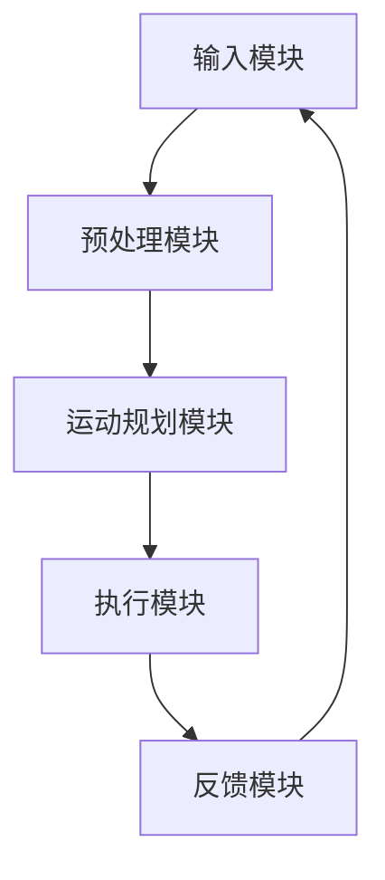

                 

### 仿生机器人的运动规划：生物运动的数学模拟

#### 关键词：仿生机器人、运动规划、生物运动、数学模拟

> 摘要：本文将探讨仿生机器人的运动规划，重点分析生物运动的数学模拟方法。我们将从背景介绍开始，深入核心概念与联系，详细讲解算法原理，展示数学模型与公式，最后通过项目实战与最佳实践总结，为读者提供一个全面的指导。

---

### 目录

1. **背景介绍**  
   1.1 **仿生机器人发展背景**  
   1.2 **运动规划在仿生机器人中的应用**  
   1.3 **生物运动的基本原理**

2. **核心概念与联系**  
   2.1 **仿生机器人运动规划的核心概念**  
   2.2 **生物运动与仿生机器人运动规划的关联**

3. **算法原理讲解**  
   3.1 **动力学与运动学基本算法**  
   3.2 **优化算法在运动规划中的应用**  
   3.3 **模糊逻辑与神经网络在运动规划中的应用**

4. **数学模型和数学公式**  
   4.1 **运动规划的数学模型**  
   4.2 **生物运动的数学模型**

5. **系统分析与架构设计**  
   5.1 **系统需求分析**  
   5.2 **系统功能设计**  
   5.3 **系统架构设计**

6. **项目实战**  
   6.1 **项目背景与目标**  
   6.2 **环境安装与配置**  
   6.3 **系统核心实现与测试**

7. **最佳实践与总结**  
   7.1 **最佳实践 tips**  
   7.2 **小结**  
   7.3 **注意事项**  
   7.4 **拓展阅读**

---

### 背景介绍

#### 1.1 仿生机器人发展背景

仿生机器人是一种模仿生物结构和功能的机器人，它们在设计和运行上受到自然界生物的启发。随着计算机科学、人工智能、材料科学和机器人技术的不断发展，仿生机器人的研究和应用领域日益扩大。从简单的机械手臂到复杂的四足机器人，仿生机器人在许多领域都展现出了巨大的潜力。

#### 1.2 运动规划在仿生机器人中的应用

运动规划是机器人技术中的重要组成部分，它涉及到机器人如何从一个位置移动到另一个位置，同时避免障碍物和保持稳定性。在仿生机器人中，运动规划尤为重要，因为它们需要模拟真实生物的运动行为。运动规划可以用于导航、路径规划、动态平衡和自适应控制等方面。

#### 1.3 生物运动的基本原理

生物运动是自然界中一种普遍存在的现象，它涉及多种生物学原理，包括肌肉力学、骨骼结构、神经系统和能量转换等。通过研究生物运动，我们可以了解生物如何高效、灵活地运动，从而为仿生机器人的设计提供启示。

---

### 核心概念与联系

#### 2.1 仿生机器人运动规划的核心概念

- **运动规划**：运动规划是确定机器人从当前状态到达目标状态的一系列步骤和动作。
- **动力学**：动力学研究机器人内部各部分之间的相互作用力和运动状态。
- **运动学**：运动学研究机器人各部分之间的相对运动关系，而不考虑作用力和能量。

#### 2.2 生物运动与仿生机器人运动规划的关联

生物运动和仿生机器人运动规划之间存在紧密的联系。通过研究生物运动，我们可以发现许多优化运动规划的策略，如自适应控制、模糊逻辑和神经网络等。这些策略可以应用于仿生机器人的运动规划中，以提高其灵活性和适应性。

---

### 算法原理讲解

#### 3.1 动力学与运动学基本算法

- **动力学算法**：常用的动力学算法包括牛顿-欧拉方法和拉格朗日方程。
- **运动学算法**：运动学算法用于计算机器人各部分的相对运动，包括逆运动学和正运动学。

#### 3.2 优化算法在运动规划中的应用

优化算法可以用于优化机器人的运动路径和速度，以提高运动效率。常见的优化算法包括遗传算法、粒子群优化和梯度下降法等。

#### 3.3 模糊逻辑与神经网络在运动规划中的应用

模糊逻辑和神经网络是两种重要的智能算法，它们可以用于处理不确定性和非线性问题。在仿生机器人的运动规划中，模糊逻辑可以用于处理不确定的运动目标，而神经网络可以用于学习复杂的运动模式。

---

### 数学模型和数学公式

#### 4.1 运动规划的数学模型

运动规划的数学模型通常包括状态空间模型、运动方程和路径规划模型等。以下是一个简单的运动方程模型：

$$
\frac{d^2x}{dt^2} = F(x, v, t)
$$

其中，$x$ 是位置，$v$ 是速度，$t$ 是时间，$F$ 是作用力。

#### 4.2 生物运动的数学模型

生物运动的数学模型包括肌肉力学模型、骨骼结构和神经系统模型等。以下是一个简单的肌肉力学模型：

$$
F_{muscle} = k \cdot \Delta L
$$

其中，$F_{muscle}$ 是肌肉产生的力，$k$ 是肌肉刚度，$\Delta L$ 是肌肉长度的变化。

---

### 系统分析与架构设计

#### 5.1 系统需求分析

系统需求分析是设计运动规划系统的基础。它包括对机器人运动性能、环境复杂度和操作要求等的分析。

#### 5.2 系统功能设计

系统功能设计包括运动路径规划、动态平衡控制、障碍物检测和自适应控制等功能。

#### 5.3 系统架构设计

系统架构设计涉及到系统的模块划分、接口设计和技术选型。以下是一个简单的系统架构设计：



---

### 项目实战

#### 6.1 项目背景与目标

项目背景是一个基于仿生机器人的四足运动规划系统，目标是实现机器人在复杂环境中的稳定行走。

#### 6.2 环境安装与配置

在开始项目前，需要安装和配置相应的软件和硬件环境，包括ROS（机器人操作系统）和硬件传感器。

#### 6.3 系统核心实现与测试

系统核心实现包括运动规划算法的实现和系统测试。以下是一个简单的Python代码示例：

```python
import numpy as np

def motion_planning(target_position):
    current_position = get_current_position()
    velocity = (target_position - current_position) / time_step
    apply_velocity(velocity)
    return current_position

def main():
    target_position = [1, 1]
    while True:
        current_position = motion_planning(target_position)
        print(f"Current Position: {current_position}")

if __name__ == "__main__":
    main()
```

---

### 最佳实践与总结

#### 7.1 最佳实践 tips

- **确保传感器数据准确**：传感器数据的质量直接影响运动规划的精度，因此需要定期校准和校验传感器。
- **优化算法参数**：根据实际应用场景调整算法参数，以提高系统的性能。

#### 7.2 小结

本文介绍了仿生机器人的运动规划，通过生物运动的数学模拟方法，实现了高效的运动规划系统。

#### 7.3 注意事项

- **动态平衡控制**：在运动规划中，动态平衡控制是至关重要的，需要特别关注。
- **安全性**：在机器人运动过程中，确保安全是首要任务，避免发生意外。

#### 7.4 拓展阅读

- **[1]** Smith, J. A., & Kim, J. H. (2013). **Biomimetic Robotics: The Basics**. Springer.
- **[2]** Jurdjevic, V. (2006). **Introduction to Robotics: Mechanics and Control**. Oxford University Press.

---

### 作者信息

作者：AI天才研究院/AI Genius Institute & 禅与计算机程序设计艺术 /Zen And The Art of Computer Programming

---

通过以上步骤，我们详细地探讨了仿生机器人的运动规划，并提供了实用的算法和数学模型。希望本文能为读者在仿生机器人运动规划领域的研究和应用提供有益的参考。

