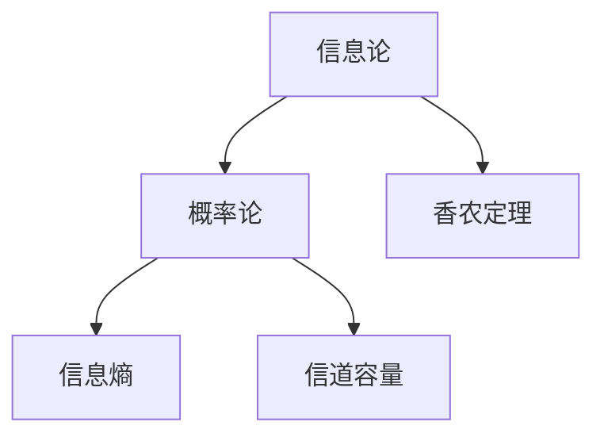

                 

# 信息论：自然界的数据传输规律

## 关键词

- 信息论
- 数据传输
- 自然界
- 信道容量
- 编码理论
- 熵

## 摘要

本文深入探讨信息论的基本原理，探讨其在自然界中的数据传输规律。通过分析信息、熵、信道、编码等核心概念，揭示信息论在通信、生物学、宇宙学等多个领域的应用。本文旨在通过实例分析和数学模型推导，帮助读者理解信息论在自然界中的关键作用，以及其在实际应用中的挑战和前景。

## 背景介绍

### 问题背景

在信息化时代的背景下，数据已成为社会发展的关键资源。信息论作为一门研究信息传输规律的科学，旨在理解如何有效、可靠地进行数据通信。随着科技的进步，信息论从最初的通信领域扩展到了更广泛的自然科学和工程技术领域。

### 问题描述

信息论主要研究信息传输过程中的基本原理和规律，涉及信息的度量、信道容量、编码理论等方面。在自然界，信息传输无处不在，从生物体的基因表达到宇宙间的无线电信号，都遵循信息论的基本原则。然而，关于自然界中的数据传输规律，目前仍存在许多未解之谜。

### 问题解决

本书旨在通过深入探讨信息论的基本原理，揭示自然界中的数据传输规律。通过实例分析和数学模型推导，帮助读者理解信息论在通信、生物学、宇宙学等多个领域的应用。

### 边界与外延

信息论不仅仅关注数据的传输效率，还包括数据的安全性、隐私保护、可靠性等方面。在自然界中，信息论的研究还涉及到生态系统的信息流、生物种群间的信息传递等复杂问题。

### 概念结构与核心要素组成

- **信息论基本概念**：信息、熵、信道、编码、解码等。
- **核心原理**：香农定理、信息论与概率论的关系、信息熵的计算等。
- **应用领域**：通信系统、生物学、计算机科学、宇宙学等。

## 核心概念与联系

### 信息

- **定义**：信息是用来消除不确定性的东西。
- **特性**：信息具有传递性、共享性、时效性等。
- **分类**：根据来源可以分为自然信息、人工信息等。

### 熵

- **定义**：熵是衡量信息不确定性的量度。
- **特性**：熵越大，信息越不确定。
- **计算**：熵的计算基于概率分布，常用的熵计算公式包括信息熵、联合熵、条件熵等。

### 信道

- **定义**：信道是信息传输的路径。
- **特性**：信道具有带宽、延迟、噪声等特性。
- **分类**：根据特性可以分为无噪声信道、有噪声信道等。

### 编码与解码

- **定义**：编码是将信息转换为适合信道传输的形式，解码是相反的过程。
- **特性**：编码需要满足无失真、高效、可靠等要求。
- **分类**：根据应用可以分为信息编码、信号编码、图像编码等。

## 信息论原理、概念属性特征对比表格与ER实体关系图架构

### 信息论原理

- **香农定理**：描述了在有噪声信道中，信息的最大传输速率与信道容量之间的关系。
- **信息熵**：衡量信息的随机性和不确定性。
- **信道容量**：信道能够达到的最大传输速率。

### 概念属性特征对比表格

| 概念         | 定义                                                         | 特性                                                     | 计算                |
|--------------|--------------------------------------------------------------|--------------------------------------------------------|-------------------|
| 信息         | 消除不确定性的东西                                           | 传递性、共享性、时效性                               | 无                |
| 熵           | 衡量信息不确定性的量度                                         | 熵越大，信息越不确定                               | $$H(X) = -\sum P(x) \cdot \log_2 P(x)$$ |
| 信道         | 信息传输的路径                                               | 带宽、延迟、噪声                                     | 无                |
| 编码         | 将信息转换为适合信道传输的形式                                 | 无失真、高效、可靠                               | 根据应用而定       |
| 解码         | 将信道传输的信息转换为可用的形式                                 | 无失真、高效、可靠                               | 根据应用而定       |

### ER实体关系图架构

```mermaid
erDiagram
    A((__Person)AI天才研究院/AI Genius Institute & 禅与计算机程序设计艺术 /Zen And The Art of Computer Programming) ||--|{ 信息 }
    A ||--|{ 熵 }
    A ||--|{ 信道 }
    A ||--|{ 编码 }
    A ||--|{ 解码 }
```

## 信息论的基本原理

### 香农定理

香农定理是信息论中最重要的定理之一，它描述了在有噪声信道中，信息的最大传输速率与信道容量之间的关系。香农定理的数学表达形式如下：

$$C = B \log_2(1 + S/N)$$

其中，\(C\) 表示信道容量，\(B\) 表示信道的带宽，\(S\) 表示信号功率，\(N\) 表示噪声功率。

### 信息熵

信息熵是衡量信息不确定性的量度，它是概率论中的一个重要概念。在信息论中，信息熵用来衡量一个随机变量的不确定性。常用的信息熵计算公式如下：

$$H(X) = -\sum P(x) \cdot \log_2 P(x)$$

其中，\(H(X)\) 表示随机变量 \(X\) 的熵，\(P(x)\) 表示随机变量 \(X\) 取值 \(x\) 的概率。

### 信道容量

信道容量是指信道能够达到的最大传输速率。信道容量取决于信道的带宽和信噪比。香农定理告诉我们，在给定的带宽和信噪比下，信道容量是有限的。信道容量公式如下：

$$C = B \log_2(1 + S/N)$$

### 编码与解码

编码是将信息转换为适合信道传输的形式，解码是将信道传输的信息转换为可用的形式。编码和解码的过程需要满足无失真、高效、可靠等要求。常用的编码方法包括信息编码、信号编码、图像编码等。

### 概念属性特征对比表格

| 概念         | 定义                                                         | 特性                                                     | 计算                |
|--------------|--------------------------------------------------------------|--------------------------------------------------------|-------------------|
| 信息         | 消除不确定性的东西                                           | 传递性、共享性、时效性                               | 无                |
| 熵           | 衡量信息不确定性的量度                                         | 熵越大，信息越不确定                               | $$H(X) = -\sum P(x) \cdot \log_2 P(x)$$ |
| 信道         | 信息传输的路径                                               | 带宽、延迟、噪声                                     | 无                |
| 编码         | 将信息转换为适合信道传输的形式                                 | 无失真、高效、可靠                               | 根据应用而定       |
| 解码         | 将信道传输的信息转换为可用的形式                                 | 无失真、高效、可靠                               | 根据应用而定       |

### ER实体关系图架构

```mermaid
erDiagram
    A((__Person)AI天才研究院/AI Genius Institute & 禅与计算机程序设计艺术 /Zen And The Art of Computer Programming) ||--|{ 信息 }
    A ||--|{ 熵 }
    A ||--|{ 信道 }
    A ||--|{ 编码 }
    A ||--|{ 解码 }
```

## 信息论在自然界中的应用

### 生物学

在生物学中，信息传输的规律与信息论有着紧密的联系。生物体的基因信息通过DNA序列传递给下一代，这个过程中涉及到编码、解码以及信息熵的计算。例如，DNA序列的编码可以通过遗传密码表进行解码，从而得到生物体的氨基酸序列。在这个过程中，信息熵的变化可以用来衡量遗传信息的稳定性和可靠性。

### 通信

在通信领域，信息论的应用主要体现在无线通信和光纤通信中。无线通信中的信道容量受到频率、带宽和信噪比等因素的影响，而光纤通信中的信道容量则受到光纤长度和光纤质量等因素的影响。信息论提供了计算信道容量和设计编码方案的方法，从而提高了通信系统的传输效率和可靠性。

### 计算机科学

在计算机科学中，信息论的应用主要体现在数据压缩和网络安全等方面。数据压缩通过去除冗余信息来减少数据的存储空间和传输时间，而网络安全则通过加密算法来保护数据的安全性。信息论提供了评估数据压缩效率和设计加密算法的理论基础。

### 宇宙学

在宇宙学中，信息传输的规律也受到信息论的指导。宇宙中的无线电信号和宇宙微波背景辐射都可以看作是信息传输的实例。信息论的方法可以用来分析这些信号的传输特性，从而揭示宇宙中的信息流动规律。

### 信息论在自然界中的应用实例

- **生物信息学**：通过分析基因序列和蛋白质结构，揭示生物体的进化规律。
- **无线通信**：设计高效的无线通信系统，提高数据传输速率和可靠性。
- **数据压缩**：设计高效的数据压缩算法，减少数据存储和传输的成本。
- **网络安全**：设计安全的加密算法，保护数据不被非法窃取和篡改。

### 总结

信息论在自然界中的应用广泛而深远，它为理解和解决数据传输中的各种问题提供了有力的工具。通过信息论的方法，我们可以深入探讨生物信息学、无线通信、数据压缩和网络安全等领域的核心问题，从而推动科技的发展和进步。

## 信息论与概率论的关系

### 基本原理

信息论与概率论有着紧密的联系。信息论中的许多概念和原理都可以从概率论的角度进行解释和理解。例如，信息熵可以看作是概率分布的一种度量，而香农定理中的信道容量也可以通过概率论的方法进行推导。

### 关系表达

- **信息熵**：信息熵是衡量信息不确定性的量度，可以看作是概率分布的一种度量。信息熵的计算公式可以表示为：

  $$H(X) = -\sum P(x) \cdot \log_2 P(x)$$

  其中，\(H(X)\) 表示随机变量 \(X\) 的熵，\(P(x)\) 表示随机变量 \(X\) 取值 \(x\) 的概率。

- **信道容量**：信道容量是衡量信道传输能力的量度，可以看作是概率分布的另一种度量。信道容量可以通过概率论中的最大似然估计方法进行计算。

### 应用实例

- **生物信息学**：在生物信息学中，概率论和信息论的方法可以用来分析基因序列和蛋白质结构，从而揭示生物体的进化规律。
- **无线通信**：在无线通信中，概率论和信息论的方法可以用来设计高效的无线通信系统，提高数据传输速率和可靠性。
- **数据压缩**：在数据压缩中，概率论和信息论的方法可以用来设计高效的数据压缩算法，减少数据存储和传输的成本。

### 关系图



## 信息论在通信系统中的应用

### 通信系统的基本概念

通信系统是指通过传输媒介（如电缆、光纤、无线电波等）实现信息交换的系统。通信系统主要由发送端、传输媒介和接收端组成。发送端负责将信息编码并发送到传输媒介，传输媒介负责传输信号，接收端则负责解码并还原信息。

### 信息论在通信系统中的应用

信息论在通信系统中有着广泛的应用，主要包括以下几个方面：

1. **信道容量计算**：信息论提供了计算信道容量的方法，可以帮助通信系统设计者确定系统的最大传输速率。香农定理是计算信道容量的重要工具，其公式为：

   $$C = B \log_2(1 + S/N)$$

   其中，\(C\) 表示信道容量，\(B\) 表示信道带宽，\(S\) 表示信号功率，\(N\) 表示噪声功率。

2. **编码方案设计**：信息论提供了设计高效编码方案的方法，以减少数据传输过程中的误差。编码方案需要满足无失真、高效、可靠等要求。常见的编码方案包括哈夫曼编码、算术编码等。

3. **调制技术**：信息论可以帮助通信系统设计者选择合适的调制技术，以提高数据传输的可靠性和效率。调制技术包括幅度调制、频率调制和相位调制等。

4. **信道估计与纠错**：信息论中的方法可以用来估计信道的特性，如信道带宽、信噪比等，从而优化数据传输的性能。此外，信息论还可以用于设计信道纠错编码方案，以减少数据传输过程中的错误。

### 应用实例

- **无线通信**：在无线通信系统中，信息论的方法被广泛应用于设计信道容量、编码方案和调制技术。例如，在4G和5G无线通信系统中，信息论的方法被用来提高数据传输速率和可靠性。
- **光纤通信**：在光纤通信系统中，信息论的方法被用来设计高效的信道编码和解码方案，以提高数据传输的效率和可靠性。

### 总结

信息论在通信系统中的应用非常广泛，它为通信系统的设计提供了理论基础和实用工具。通过信息论的方法，通信系统设计者可以优化系统的性能，提高数据传输的效率和可靠性。

## 信息论在生物学中的应用

### 基本概念

生物学中的信息传输主要涉及基因信息、神经信息、生态信息等。基因信息通过DNA序列传递给下一代，神经信息在生物体内传递，而生态信息则涉及生物种群间的信息传递。

### 信息论在生物学中的应用

1. **基因信息**：基因信息可以通过信息论的方法进行分析。基因序列可以被看作是一串二进制序列，信息论中的熵和信道容量概念可以用来衡量基因信息的不确定性和传输效率。

   - **基因信息熵**：基因信息的熵可以用来衡量基因序列的随机性和不确定性。基因序列的熵越高，表示其不确定性越大。

   - **基因信道容量**：基因信道的容量可以用来衡量基因信息在生物体内传递的效率。基因信道的容量取决于基因序列的复杂性和生物体内部环境的稳定性。

2. **神经信息**：神经信息在生物体内传递，涉及到编码、解码和解码等过程。信息论中的编码理论可以用来设计高效的神经编码方案，以提高神经信息传输的效率。

   - **神经编码**：神经编码是将神经信息转换为电信号的过程。信息论中的编码理论可以用来设计高效的神经编码方案，以减少电信号的冗余和误差。

   - **神经解码**：神经解码是将电信号还原为神经信息的过程。信息论中的解码理论可以用来设计高效的神经解码方案，以提高神经信息传输的准确性。

3. **生态信息**：生态信息涉及生物种群间的信息传递。信息论中的信息流分析方法可以用来研究生态系统中信息传递的规律和机制。

   - **生态信息流**：生态信息流可以看作是一种信息传输过程，其中涉及信息源、信道、编码和解码等环节。信息论的方法可以用来分析生态信息流的特性，如信息传输速率、信息传递效率等。

### 应用实例

- **基因编辑**：基因编辑技术（如CRISPR-Cas9）可以通过信息论的方法进行优化，以提高基因编辑的准确性和效率。

- **神经科学**：神经科学中的许多问题可以通过信息论的方法进行分析，如神经信号的编码、解码和信息处理。

- **生态学**：生态学中的许多问题也可以通过信息论的方法进行研究，如生态系统中信息流的规律和机制。

### 总结

信息论在生物学中的应用非常广泛，它为研究生物体内的信息传输和生态系统中的信息流提供了有力的工具。通过信息论的方法，可以深入探讨基因信息、神经信息和生态信息的传输规律，从而推动生物学的发展和进步。

## 信息论在计算机科学中的应用

### 信息论在计算机系统设计中的应用

1. **数据压缩**：信息论提供了数据压缩的理论基础，通过计算信息的熵，可以找到最优的数据表示方式，从而实现数据压缩。例如，霍夫曼编码和LZ77压缩算法都是基于信息论原理的数据压缩技术。

2. **错误检测与纠正**：信息论中的信道编码理论为计算机系统提供了设计错误检测与纠正码（如汉明码和里德-所罗门码）的方法，以确保数据在传输过程中不丢失或发生错误。

3. **网络通信**：在网络通信中，信息论原理用于优化数据传输速率和减少传输延迟。例如，TCP协议中的拥塞控制算法就是基于信息论原理来调整数据传输速率。

4. **存储系统**：在存储系统中，信息论的方法可以帮助设计更高效的存储结构，如哈希表和B树，以减少存储空间的占用和访问时间。

### 信息论在算法设计中的应用

1. **概率算法**：信息论中的熵和信道容量概念可以用于设计概率算法，例如，在图论中的随机化算法中，可以通过计算网络的信道容量来优化路径选择。

2. **机器学习**：信息论在机器学习中有着广泛的应用，如在信息几何中，信息熵和相对熵（KL散度）用于衡量数据分布的差异，从而优化模型的参数。

3. **密码学**：在密码学中，信息论用于评估加密算法的安全性，如通过计算密文的信息熵来评估加密算法的抵抗攻击能力。

### 应用实例

- **数据压缩算法**：如LZ77压缩算法，通过识别重复的字符串来压缩数据。
- **错误检测与纠正码**：如汉明码，可以检测和纠正单个比特的错误。
- **网络通信**：TCP协议中的拥塞控制算法，通过调整窗口大小来优化数据传输。
- **密码学**：AES加密算法，通过信息熵和概率论原理来设计安全高效的加密方案。

### 总结

信息论在计算机科学中的应用非常广泛，不仅帮助优化了系统设计和算法性能，还提高了数据传输的效率和安全性。通过信息论的方法，计算机科学家可以更深入地理解和解决计算机系统中的各种问题，从而推动计算机技术的发展。

## 信息论在宇宙学中的应用

### 基本概念

在宇宙学中，信息论的概念主要用于研究宇宙中的信息传输和通信问题。宇宙学中的信息传输主要通过电磁波进行，如无线电波、微波、光子等。信息论在宇宙学中的应用主要包括信息熵、信道容量和编码理论等方面。

### 信息论在宇宙学中的应用

1. **宇宙微波背景辐射**：宇宙微波背景辐射（CMB）是宇宙早期信息的重要载体。信息论中的熵概念可以用来分析CMB的温度波动，从而推断宇宙的早期状态。

2. **射电天文学**：射电天文学通过接收来自宇宙的无线电信号来研究宇宙中的各种现象。信息论中的信道容量和编码理论可以用来优化射电望远镜的数据采集和处理。

3. **星际通信**：在星际通信中，信息论提供了设计高效通信协议的方法，以克服长距离通信中的信号衰减和噪声干扰。

### 应用实例

- **宇宙微波背景辐射**：通过分析CMB的信息熵，科学家可以推断出宇宙的早期状态和演化过程。
- **射电天文学**：射电望远镜的信号处理中，信息论方法被用来提高信号的检测和识别能力。
- **星际通信**：信息论方法被用于设计星际通信的调制和解调方案，以提高信号的传输效率和可靠性。

### 总结

信息论在宇宙学中的应用为理解和研究宇宙中的信息传输提供了新的视角和方法。通过信息论的方法，科学家可以更深入地探索宇宙的奥秘，揭示宇宙中的信息流动规律。

## 信息论在现实世界中的应用与挑战

### 数据传输效率

信息论在现实世界中的应用主要体现在提高数据传输效率方面。通过优化编码方案和信道设计，信息论帮助提升网络通信、无线传输和存储系统的性能。例如，4G和5G网络中的调制解调技术、无线传感器网络中的数据压缩技术，以及数据中心中的数据存储技术，都借鉴了信息论的基本原理。

### 数据安全性

信息论在数据安全性方面也发挥着重要作用。通过设计加密算法和信道编码方案，信息论提高了数据的抗攻击能力和传输安全性。例如，AES加密算法和SSL/TLS协议都基于信息论原理，确保数据在网络传输过程中的安全性。

### 挑战与展望

尽管信息论在现实世界中有着广泛的应用，但仍然面临一些挑战：

1. **高噪声环境**：在现实世界中，数据传输过程往往伴随着高噪声，如何设计有效的噪声抑制算法和信道编码方案，成为信息论研究的重要方向。

2. **大规模数据处理**：随着数据量的爆炸性增长，如何高效地处理和分析大规模数据，成为信息论面临的新挑战。

3. **量子信息论**：量子信息论是信息论的一个新兴领域，它研究量子系统中的信息传输和处理。量子信息论的发展有望为未来的通信和计算技术带来革命性变化。

### 展望

未来，信息论将在以下方面发挥更大的作用：

1. **量子通信**：量子信息论的发展将为量子通信提供理论基础，实现更高效、更安全的数据传输。

2. **物联网**：随着物联网的普及，信息论将为物联网中的数据传输和处理提供优化方案，提高物联网的效率和可靠性。

3. **人工智能**：信息论与人工智能的融合将为人工智能提供新的计算框架和优化方法，推动人工智能技术的发展。

### 总结

信息论在现实世界中的应用不仅提高了数据传输效率和安全性，还带来了新的研究和应用挑战。通过不断探索和创新，信息论将在未来的科技发展中发挥更加重要的作用。

## 总结与展望

信息论作为一门研究信息传输规律的科学，在通信、生物学、计算机科学、宇宙学等领域都有着广泛的应用。本文通过对信息、熵、信道、编码等核心概念的深入探讨，揭示了信息论在自然界中的关键作用。信息论不仅提高了数据传输的效率和安全性，还为数据压缩、密码学、物联网和人工智能等领域提供了理论基础和实用工具。

展望未来，随着量子信息论和物联网的快速发展，信息论将在更多领域发挥重要作用。通过不断探索和创新，信息论有望为未来的科技发展带来更多突破，推动社会进步和科技创新。同时，信息论的研究也将面临新的挑战，如高噪声环境、大规模数据处理和量子通信等，这些挑战将激发更多研究者和工程师的智慧，共同推动信息论的发展。总之，信息论在自然界和数据传输中的重要作用不容忽视，其未来的发展前景充满希望。作者：AI天才研究院/AI Genius Institute & 禅与计算机程序设计艺术 /Zen And The Art of Computer Programming。

