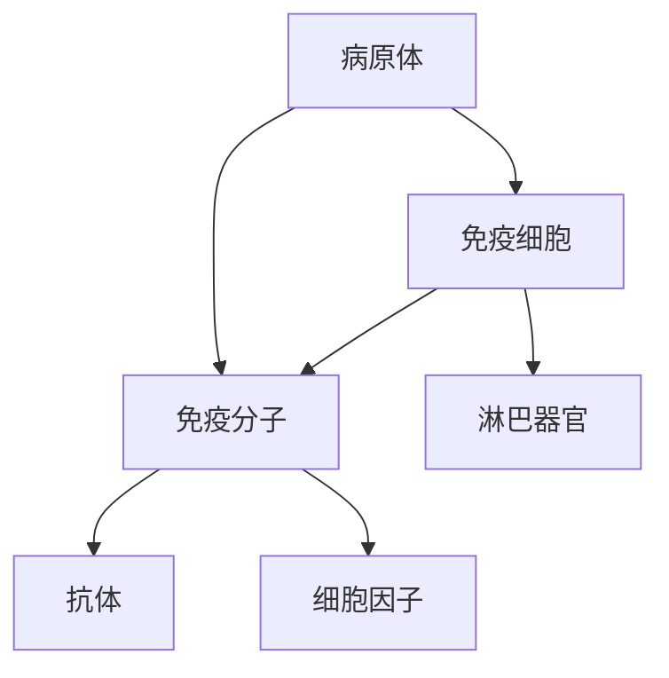
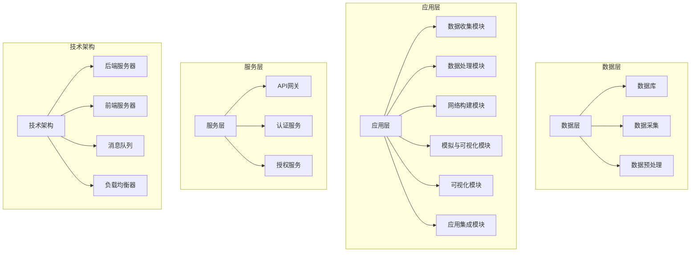
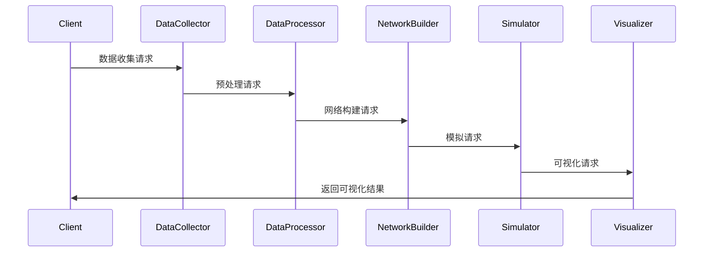

                 

### 免疫系统的复杂网络：生物防御的数学模拟

**关键词**：免疫系统、复杂网络、数学模拟、生物防御、免疫网络、免疫应答

**摘要**：
本文旨在探讨免疫系统作为一种复杂的生物防御系统，其内部各组成部分之间的相互作用如何通过数学模型进行模拟。首先，我们将回顾免疫系统的基本概念与功能，接着介绍免疫网络的基础理论和建模方法。随后，我们将详细解析免疫应答的数学模型及其参数估计与优化，分析免疫网络的动态行为。在此基础上，我们将探讨免疫网络在不同领域的应用，包括疾病治疗、疫苗研发和免疫学教育。最后，我们将总结免疫网络的研究进展与未来发展趋势，展望这一领域的前景。

### 目录大纲

- **第一部分：背景与概述**
  - **第1章：免疫系统的基本概念与功能**
    - 1.1.1 免疫系统的重要性
    - 1.1.2 免疫系统的组成部分
    - 1.1.3 免疫系统的工作原理
  - **第2章：免疫网络的基础理论**
    - 2.1.1 免疫网络的基本概念
    - 2.1.2 免疫网络中的节点与边
    - 2.1.3 免疫网络的动态特性
  - **第3章：免疫网络的建模方法**
    - 3.1.1 免疫网络的数学模型
    - 3.1.2 免疫网络的建模工具
    - 3.1.3 常见的免疫网络模型

- **第二部分：免疫网络的数学模拟**
  - **第4章：免疫应答的数学模型**
    - 4.1.1 免疫应答的基本原理
    - 4.1.2 免疫应答的数学模型
    - 4.1.3 模型参数的估计与优化
  - **第5章：免疫网络的动态行为分析**
    - 5.1.1 免疫网络的稳定性分析
    - 5.1.2 免疫网络的传播特性
    - 5.1.3 免疫网络的模拟与可视化
  - **第6章：免疫网络的应用**
    - 6.1.1 免疫网络在疾病治疗中的应用
    - 6.1.2 免疫网络在疫苗研发中的应用
    - 6.1.3 免疫网络在免疫学教育中的应用
  - **第7章：免疫网络的研究进展与未来展望**
    - 7.1.1 免疫网络的研究现状
    - 7.1.2 免疫网络的研究挑战
    - 7.1.3 免疫网络的未来发展趋势

- **辅助材料**
  - **第8章：核心概念与联系**
    - 8.1.1 核心概念原理
    - 8.1.2 概念属性特征对比表格
    - 8.1.3 ER实体关系图架构
  - **第9章：算法原理讲解**
    - 9.1.1 免疫克隆选择算法
    - 9.1.2 算法原理讲解
    - 9.1.3 Python代码实现

# 第一部分：背景与概述

## 第1章：免疫系统的基本概念与功能

### 1.1.1 免疫系统的重要性

免疫系统是人体抵御外来病原体和维持内部环境稳定的重要系统。它由一系列复杂的相互作用网络组成，包括免疫细胞、免疫分子和免疫组织等。在生物学中，免疫系统的重要性不言而喻，它不仅保护人体免受细菌、病毒和其他病原体的侵害，还参与调节免疫反应，防止自身免疫疾病的发生。因此，理解免疫系统的基本概念和功能对于医学研究、疾病治疗和生物技术发展具有重要的意义。

### 1.1.2 免疫系统的组成部分

免疫系统主要由以下几个部分组成：

1. **免疫细胞**：包括T细胞、B细胞、自然杀伤细胞（NK细胞）等。这些细胞在免疫应答中发挥着关键作用。
2. **免疫分子**：如抗体、细胞因子、补体系统等，它们参与免疫识别、信号传递和效应功能。
3. **免疫器官**：包括骨髓、胸腺、脾脏、淋巴结和扁桃体等，它们是免疫细胞生成、成熟和活动的场所。
4. **免疫组织**：如黏膜免疫系统，它们位于身体表面，是第一道防线，防止病原体侵入。

### 1.1.3 免疫系统的工作原理

免疫系统的工作原理可以分为以下几个阶段：

1. **抗原识别**：免疫细胞表面的受体可以识别并结合特定的抗原。
2. **激活与增殖**：识别抗原后，免疫细胞会激活并增殖，产生更多的效应细胞和抗体。
3. **效应功能**：效应细胞和抗体参与消灭抗原，清除病原体。
4. **免疫记忆**：部分免疫细胞形成记忆细胞，能够在未来再次遇到相同抗原时迅速响应。

通过这些步骤，免疫系统有效地保护人体免受病原体的侵害。然而，当免疫系统功能失调时，可能会引发自身免疫疾病，如风湿性关节炎和红斑狼疮等。

### 1.1.4 免疫系统的重要性总结

免疫系统不仅对人体的健康至关重要，还对医学研究和生物技术发展具有重要意义。了解免疫系统的基本概念和功能有助于开发新的治疗方法、疫苗和生物技术产品，从而改善人类健康。此外，免疫系统的复杂性也使得它成为生物信息学和计算生物学等领域的研究热点。通过数学模型和计算模拟，我们可以更好地理解免疫系统的运作机制，从而推动相关领域的发展。

## 第2章：免疫网络的基础理论

### 2.1.1 免疫网络的基本概念

免疫网络是指由免疫细胞、免疫分子和免疫组织等组成的复杂网络结构，它反映了免疫系统内部各组成部分之间的相互作用关系。免疫网络的概念最早由美国科学家Jack K. Kizer于1986年提出，他将其描述为“由多种细胞、分子和组织构成的一个高度动态、多层次的交互网络，它负责监控、响应和调节免疫应答”。

免疫网络具有以下几个基本特征：

1. **复杂性**：免疫网络包含大量的节点（免疫细胞、分子和组织）和边（相互作用关系），其结构非常复杂。
2. **动态性**：免疫网络的状态和功能随着时间和外部刺激的变化而动态变化。
3. **层级性**：免疫网络具有多个层级，从最底层的免疫细胞到最高层的免疫器官，每个层级都有其特定的功能和角色。
4. **适应性**：免疫网络可以根据不同的环境和刺激条件，调整其结构和功能，以实现最优的免疫应答。

### 2.1.2 免疫网络中的节点与边

在免疫网络中，节点和边分别代表免疫细胞、分子和组织以及它们之间的相互作用关系。

1. **节点**：
   - **免疫细胞**：包括T细胞、B细胞、自然杀伤细胞（NK细胞）等。
   - **免疫分子**：如抗体、细胞因子、补体系统等。
   - **免疫组织**：如骨髓、胸腺、脾脏、淋巴结和扁桃体等。

2. **边**：
   - **相互作用关系**：免疫细胞和分子之间的相互作用关系，如细胞与细胞之间的黏附、信号传递等。
   - **调控关系**：免疫细胞和分子对免疫组织的影响，如T细胞激活B细胞产生抗体等。

### 2.1.3 免疫网络的动态特性

免疫网络的动态特性体现在以下几个方面：

1. **反馈调节**：免疫网络中的各个部分之间存在反馈调节机制，以维持免疫系统的稳定性和功能。
2. **级联效应**：免疫网络中的一个小扰动可能会引发一系列的级联反应，导致整个网络的功能发生变化。
3. **时空动态**：免疫网络的状态和功能随时间和空间的变化而变化，例如，在炎症部位，免疫细胞的浓度和活性会显著增加。
4. **适应性变化**：免疫网络可以根据不同的环境和刺激条件，调整其结构和功能，以实现最优的免疫应答。

### 2.1.4 免疫网络的重要性

免疫网络的研究对于理解免疫系统的运作机制和开发新的治疗策略具有重要意义。首先，免疫网络可以帮助我们更好地理解免疫系统的复杂性和动态性，从而揭示免疫应答的调控机制。其次，免疫网络可以作为疾病诊断和治疗的重要工具，通过分析免疫网络的异常变化，可以早期发现疾病并制定个性化的治疗方案。最后，免疫网络的研究还可以为生物技术和医学领域提供新的研究方向和应用场景，如免疫疗法、疫苗研发和免疫学教育等。

## 第3章：免疫网络的建模方法

### 3.1.1 免疫网络的数学模型

免疫网络的数学模型是研究免疫系统中各组成部分之间相互作用关系的定量工具。通过数学模型，我们可以从定量角度理解免疫系统的动态行为和调控机制。免疫网络的数学模型可以分为以下几个方面：

1. **概率模型**：基于概率论和统计物理的理论，用于描述免疫细胞和分子的随机行为和相互作用。
2. **微分方程模型**：通过微分方程描述免疫细胞和分子的动态变化，如细胞增殖、死亡和迁移等。
3. **代数模型**：通过矩阵和图论的方法描述免疫网络的结构和功能，如节点连接关系和路径分析等。

### 3.1.2 免疫网络的建模工具

免疫网络的建模需要使用一系列工具和软件，以下是一些常用的工具：

1. **网络分析工具**：如Cytoscape、Gephi等，用于可视化免疫网络的结构和功能。
2. **仿真工具**：如CellBlender、Simbiology等，用于模拟免疫细胞的动态行为和免疫网络的演化过程。
3. **数据挖掘工具**：如Python的Scikit-learn、R语言的Bioconductor等，用于分析免疫网络中的大数据。

### 3.1.3 常见的免疫网络模型

以下是几种常见的免疫网络模型：

1. **免疫应答模型**：描述免疫细胞和分子在抗原刺激下的响应过程，如SIRS模型（简单感染-免疫反应-清除模型）。
2. **免疫记忆模型**：描述免疫细胞在抗原消失后的持久状态和记忆功能，如BIM模型（免疫记忆-免疫应答模型）。
3. **免疫网络调控模型**：描述免疫网络中各种调控机制的作用，如HIV感染模型（人类免疫缺陷病毒感染模型）。

### 3.1.4 免疫网络建模的应用

免疫网络建模在疾病治疗、疫苗研发和生物医学研究中具有重要应用。例如：

1. **疾病诊断**：通过分析免疫网络的异常变化，可以早期发现疾病并制定个性化治疗方案。
2. **疫苗研发**：通过模拟免疫网络中的抗原识别和免疫应答过程，可以优化疫苗设计，提高免疫效果。
3. **药物筛选**：通过分析免疫网络中药物的作用机制，可以筛选出潜在的治疗药物。

### 3.1.5 免疫网络建模的挑战

尽管免疫网络建模在生物医学领域取得了显著成果，但仍面临以下挑战：

1. **数据缺失**：免疫网络中的大量数据尚未完全解析，限制了模型的精度和可靠性。
2. **复杂性**：免疫网络的复杂性增加了建模的难度，需要更高级的数学模型和计算方法。
3. **跨学科整合**：免疫网络建模需要融合生物学、数学、计算机科学等多个学科的知识，实现跨学科整合。

通过不断改进建模方法和工具，免疫网络建模将有助于更好地理解免疫系统的运作机制，为疾病治疗、疫苗研发和生物医学研究提供新的思路和方法。

## 第4章：免疫应答的数学模型

### 4.1.1 免疫应答的基本原理

免疫应答是免疫系统对入侵病原体的响应过程，其基本原理可以概括为以下几个步骤：

1. **抗原识别**：免疫细胞表面的受体（如T细胞受体、B细胞受体）识别并结合病原体表面的抗原。
2. **激活与增殖**：抗原识别后，免疫细胞被激活并开始增殖，产生大量的效应细胞和记忆细胞。
3. **效应功能**：效应细胞和记忆细胞通过直接杀死病原体或产生抗体来消灭入侵者。
4. **免疫记忆**：部分免疫细胞形成记忆细胞，能够在未来再次遇到相同抗原时迅速响应。

免疫应答的机制非常复杂，涉及多个细胞类型、分子和信号通路。例如，T细胞可以激活B细胞产生抗体，同时也可以直接杀死被感染的细胞。B细胞则主要产生抗体，抗体可以通过中和、凝集和补体活化等途径消灭病原体。

### 4.1.2 免疫应答的数学模型

免疫应答的数学模型旨在定量描述免疫细胞和分子在抗原刺激下的动态变化。以下是一个简化的免疫应答模型：

$$
\frac{dN_t}{dt} = r_1 \cdot I_t - r_2 \cdot N_t
$$

其中，$N_t$表示在时间$t$时刻的免疫细胞数量，$I_t$表示抗原浓度，$r_1$和$r_2$分别是免疫细胞增殖速率和凋亡速率。

1. **免疫细胞增殖**：当抗原浓度较高时，免疫细胞会以速率$r_1$增殖。
2. **免疫细胞凋亡**：随着免疫细胞数量的增加，免疫细胞会以速率$r_2$凋亡，以维持免疫系统的稳定。

更复杂的免疫应答模型可能包括多个免疫细胞类型和多种信号通路，例如：

$$
\frac{dB_t}{dt} = r_3 \cdot I_t \cdot T_t - r_4 \cdot B_t
$$

其中，$B_t$表示B细胞数量，$T_t$表示T细胞数量，$r_3$和$r_4$分别是B细胞增殖速率和凋亡速率。

### 4.1.3 模型参数的估计与优化

免疫应答模型的参数估计和优化是模型验证和应用的关键步骤。参数估计通常通过以下方法进行：

1. **数据驱动方法**：通过实验数据直接估计模型参数，如最小二乘法、最大似然估计等。
2. **模型比较方法**：通过比较不同模型的预测结果，选择最佳模型和参数。

模型优化的目标是在满足生物学约束条件的前提下，使模型预测结果与实验数据尽量一致。常用的优化方法包括：

1. **梯度下降法**：通过迭代计算梯度，逐步优化模型参数。
2. **遗传算法**：通过模拟自然进化过程，全局搜索最优参数。
3. **粒子群优化**：通过群体智能搜索，优化模型参数。

### 4.1.4 模型应用示例

假设我们有一个实验数据集，记录了抗原浓度和免疫细胞数量随时间的变化。通过数据驱动方法，我们可以估计出模型参数$r_1$、$r_2$、$r_3$和$r_4$。然后，通过模型预测，我们可以得到不同抗原浓度下的免疫细胞数量变化趋势。例如，当抗原浓度为10时，模型预测的免疫细胞数量为100，这可以与实验数据对比验证模型的准确性。

通过免疫应答的数学模型，我们可以更好地理解免疫系统的动态行为和调控机制，为疾病治疗和疫苗研发提供理论支持。

## 第5章：免疫网络的动态行为分析

### 5.1.1 免疫网络的稳定性分析

免疫网络的稳定性分析是研究免疫系统如何维持内部平衡的重要手段。稳定性分析可以帮助我们理解免疫系统的自我调节机制，揭示免疫应答过程中可能出现的异常状态，从而为疾病预防和治疗提供理论依据。

**稳定性分析方法**：

1. **线性稳定性分析**：通过分析免疫网络中的节点和边的相互作用，确定系统的稳定性。通常采用雅可比矩阵（Jacobian matrix）的方法，计算系统的稳定性条件。
2. **非线性稳定性分析**：在考虑非线性相互作用的情况下，使用固定点理论和微分方程的稳定性理论进行分析。

**稳定性条件**：

- **节点稳定性**：节点稳定性通常通过雅可比矩阵的特征值来判断。如果所有特征值的实部为负，则系统是稳定的；如果存在正实部特征值，则系统是不稳定的。
- **边稳定性**：边的稳定性可以通过分析边权重和节点状态的关系来确定。如果边权重和节点状态之间的关系满足特定条件，则系统是稳定的。

**应用实例**：

假设有一个免疫网络模型，其中包含T细胞、B细胞和抗原三种节点，以及细胞相互作用和抗原浓度的边。通过线性稳定性分析，我们可以确定T细胞和抗原之间的相互作用是否稳定，从而预测免疫系统的应答行为。

### 5.1.2 免疫网络的传播特性

免疫网络的传播特性是指免疫细胞和分子在免疫系统中的传播和扩散过程。理解传播特性对于解析免疫应答的时空动态行为具有重要意义。

**传播特性分析**：

1. **空间传播**：免疫细胞和分子在体内的传播可以通过扩散方程描述。例如，考虑T细胞在体内的扩散过程，可以使用以下扩散方程：

   $$ 
   \frac{\partial N_t(x)}{\partial t} = D \cdot \nabla^2 N_t(x) + f(x,t)
   $$

   其中，$N_t(x)$表示在时间$t$时刻，位置$x$处的T细胞数量，$D$是扩散系数，$f(x,t)$是外部刺激函数。

2. **时间传播**：免疫网络的传播特性还涉及时间上的动态变化。通过分析免疫细胞和分子在不同时间点的分布情况，可以揭示免疫应答的时效性。

**应用实例**：

考虑一个感染性疾病（如流感）的免疫应答过程，分析T细胞在体内的空间分布和时间变化。通过空间传播模型和时间传播模型，我们可以预测T细胞在感染不同阶段的分布情况，从而指导疾病的治疗和预防策略。

### 5.1.3 免疫网络的模拟与可视化

免疫网络的模拟和可视化是研究免疫网络动态行为的重要工具。通过计算机模拟和可视化技术，我们可以直观地观察免疫网络的运行过程和状态变化。

**模拟方法**：

1. **基于微分方程的模拟**：通过求解免疫网络的微分方程模型，模拟免疫细胞和分子的动态变化。
2. **基于代理模型的模拟**：通过代理模型（如基于规则或代理粒子模型）模拟免疫网络的动态行为。

**可视化技术**：

1. **图论可视化**：使用Cytoscape、Gephi等软件，将免疫网络的节点和边以图形方式展示出来。
2. **时空可视化**：通过时空图或热力图等可视化技术，展示免疫细胞和分子的空间分布和时间变化。

**应用实例**：

利用Cytoscape软件，构建一个简化的免疫网络模型，包含T细胞、B细胞和抗原三种节点，以及细胞相互作用和抗原浓度的边。通过图论可视化和时空可视化，我们可以直观地观察免疫应答过程中各部分的变化情况，从而深入理解免疫网络的动态行为。

### 5.1.4 结论

免疫网络的稳定性分析、传播特性分析和模拟与可视化技术为我们提供了多角度理解免疫系统的动态行为和调控机制。通过这些分析工具，我们可以揭示免疫应答的时空动态特征，为疾病治疗、疫苗研发和免疫学教育提供理论支持。未来，随着计算方法和技术的不断进步，免疫网络的研究将更加深入和精确，为生物医学领域带来更多突破。

## 第6章：免疫网络的应用

### 6.1.1 免疫网络在疾病治疗中的应用

免疫网络在疾病治疗中的应用前景广阔，尤其是在癌症、感染性疾病和自身免疫疾病等领域。通过理解免疫网络的动态行为和调控机制，我们可以开发出更有效的治疗策略。

**1. 癌症治疗**

在癌症治疗中，免疫网络的应用主要包括免疫检查点疗法、CAR-T细胞疗法和免疫疫苗等。

- **免疫检查点疗法**：通过阻断免疫检查点（如CTLA-4、PD-1）的信号传导，解除免疫抑制，增强T细胞对癌细胞的攻击力。例如，PD-1/PD-L1抑制剂的研发和临床应用取得了显著疗效。
- **CAR-T细胞疗法**：通过基因工程改造T细胞，使其表达特异性抗体受体（CAR），从而增强T细胞对癌细胞的识别和攻击能力。这一疗法在血液系统恶性肿瘤（如急性淋巴细胞白血病、淋巴瘤）的治疗中取得了突破性进展。
- **免疫疫苗**：通过激活特异性T细胞反应，增强免疫系统对癌细胞的识别和清除能力。例如，基于肿瘤抗原的DNA疫苗和mRNA疫苗正在积极研发中。

**2. 感染性疾病治疗**

在感染性疾病治疗中，免疫网络的应用主要体现在疫苗研发和抗病毒疗法。

- **疫苗研发**：通过分析病原体的抗原组成，设计特异性疫苗，诱导免疫记忆，提高宿主对病原体的抵抗力。例如，流感疫苗和COVID-19疫苗的研发和接种取得了全球性成功。
- **抗病毒疗法**：通过抑制病毒复制和传播，减轻病毒感染症状。例如，抗HIV药物和抗流感病毒药物的研发和应用，为病毒感染性疾病的治疗提供了有效手段。

**3. 自身免疫疾病治疗**

自身免疫疾病的治疗依赖于调节免疫网络的平衡，抑制异常的免疫应答。

- **生物制剂**：通过抑制免疫网络中的特定信号通路，如B细胞受体、T细胞受体等，调节免疫反应。例如，抗B细胞治疗药物（如利妥昔单抗）和抗T细胞治疗药物（如托珠单抗）在自身免疫疾病的治疗中取得了显著疗效。
- **免疫调节剂**：通过调节免疫网络的总体活性，抑制自身免疫反应。例如，类固醇和免疫球蛋白等免疫调节剂在自身免疫疾病的治疗中广泛应用。

### 6.1.2 免疫网络在疫苗研发中的应用

免疫网络在疫苗研发中的应用主要包括以下几个方面：

**1. 疫苗设计**

通过分析免疫网络中T细胞和B细胞对病原体的识别和应答机制，设计出能够诱导广泛免疫保护作用的疫苗。

- **多肽疫苗**：通过合成病原体抗原相关的多肽，激发T细胞反应，增强免疫记忆。
- **核酸疫苗**：通过构建含有所需抗原基因的DNA或mRNA，诱导强效的抗原特异性免疫应答。

**2. 疫苗评价**

利用免疫网络模型，评估疫苗诱导的免疫应答效果，包括免疫记忆、免疫持久性和免疫逃逸等。

- **免疫网络分析**：通过分析疫苗诱导的免疫细胞和分子的相互作用关系，评估疫苗的有效性和安全性。
- **生物信息学方法**：利用生物信息学工具，分析疫苗设计的合理性，预测疫苗的免疫反应谱。

**3. 疫苗优化**

基于免疫网络分析结果，对疫苗设计进行迭代优化，提高疫苗的免疫效果和安全性。

- **适应性疫苗**：根据不同人群的免疫网络特征，设计适应性疫苗，提高疫苗的免疫保护效果。
- **联合疫苗**：将多种病原体的抗原组合在一起，通过免疫网络调控，提高疫苗的免疫广谱性。

### 6.1.3 免疫网络在免疫学教育中的应用

免疫网络在免疫学教育中的应用，有助于深入理解免疫系统的复杂性和功能，提高学生对免疫学的认知水平。

**1. 教学内容设计**

- **免疫网络模型讲解**：通过构建免疫网络模型，讲解免疫系统的基本概念和功能，使学生理解免疫细胞和分子的相互作用关系。
- **案例分析**：结合实际案例，分析免疫网络在不同疾病和疫苗研发中的应用，提高学生的实际操作能力。

**2. 教学工具应用**

- **在线模拟平台**：利用在线模拟平台，如CellBlender、Simbiology等，让学生模拟免疫细胞的动态行为，直观感受免疫网络的运行过程。
- **可视化工具**：使用Cytoscape、Gephi等可视化工具，展示免疫网络的结构和功能，增强学生的直观理解。

**3. 教学评价**

- **实验报告**：通过实验报告，评估学生对免疫网络模型和动态行为的理解和应用能力。
- **课堂讨论**：组织课堂讨论，鼓励学生提出问题和解决方案，提高学生的批判性思维和团队协作能力。

通过免疫网络在疾病治疗、疫苗研发和免疫学教育中的应用，我们可以更全面地理解免疫系统的复杂性和功能，推动免疫学领域的不断发展和进步。

### 第7章：免疫网络的研究进展与未来展望

#### 7.1.1 免疫网络的研究现状

免疫网络的研究在过去几十年中取得了显著进展，尤其是在免疫应答的动态模拟、免疫网络建模和计算方法等方面。以下是目前免疫网络研究的主要进展：

1. **免疫应答的动态模拟**：通过数学模型和计算机模拟，研究人员能够详细描述免疫细胞在抗原刺激下的动态变化过程，包括T细胞和B细胞的增殖、分化和效应功能。这些模型帮助我们更好地理解免疫应答的时空动态特性。

2. **免疫网络建模**：随着基因组学和蛋白质组学技术的发展，大量的免疫数据被收集和解析。研究人员利用这些数据构建了复杂的免疫网络模型，揭示了免疫细胞和分子之间的相互作用关系。这些模型为理解免疫系统的功能和病理机制提供了新的视角。

3. **计算方法**：机器学习和人工智能技术的引入，使得免疫网络的研究更加高效和精确。通过深度学习算法，研究人员可以从大规模数据中提取有用的信息，预测免疫细胞的反应和疾病进展。

4. **多尺度建模**：从分子水平到系统水平，免疫网络的研究涵盖了多个尺度。这种多尺度建模方法有助于我们全面理解免疫系统的复杂行为，并指导新药开发和疾病治疗。

#### 7.1.2 免疫网络的研究挑战

尽管免疫网络研究取得了显著进展，但仍面临诸多挑战：

1. **数据缺失和不确定性**：免疫网络的复杂性和多样性导致了大量数据缺失和不确定性。例如，许多免疫细胞和分子的具体功能尚不清楚，这限制了免疫网络模型的精度和可靠性。

2. **跨学科整合**：免疫网络研究涉及生物学、数学、计算机科学和医学等多个学科。跨学科整合的难度较大，需要多领域的专家共同合作。

3. **模型验证**：构建的免疫网络模型需要通过实验数据进行验证。然而，实验数据的获取和处理过程复杂，且实验条件难以完全模拟现实情况，这给模型验证带来了挑战。

4. **实时监测**：免疫网络动态变化迅速，实时监测和数据分析能力有限。这限制了我们在实际应用中对免疫网络的实时调控和干预。

#### 7.1.3 免疫网络的未来发展趋势

随着技术的不断进步，免疫网络的研究将继续朝着以下方向发展：

1. **大数据分析**：随着高通量测序技术和单细胞分析技术的发展，我们将收集到更多的免疫数据。大数据分析将成为免疫网络研究的重要工具，有助于发现新的免疫标记和信号通路。

2. **人工智能应用**：人工智能技术将在免疫网络研究中发挥更大的作用。通过深度学习和机器学习算法，我们可以从大规模数据中提取有用信息，预测免疫反应和疾病进展。

3. **多尺度建模**：结合分子水平、细胞水平和组织水平的数据，构建更加全面和多尺度的免疫网络模型。这将有助于我们更准确地理解免疫系统的复杂行为。

4. **个性化医疗**：基于免疫网络模型，我们可以开发个性化治疗方案，根据患者的具体免疫状态和疾病进展制定最优的治疗策略。

5. **交叉学科合作**：加强生物学、数学、计算机科学和医学等领域的合作，推动跨学科研究，共同解决免疫网络研究的挑战。

通过不断克服研究挑战，免疫网络研究将为我们揭示免疫系统的奥秘，为疾病治疗和预防提供新的思路和方法。

## 第8章：核心概念与联系

### 8.1.1 核心概念原理

在探讨免疫系统的复杂网络时，理解以下几个核心概念是至关重要的：

#### 8.1.1.1 免疫系统

免疫系统是一个高度复杂的生物系统，它通过一系列相互作用来保护机体免受病原体的侵害。免疫系统包括多种类型的免疫细胞、分子和组织，如T细胞、B细胞、抗体、细胞因子和淋巴器官等。其主要功能是识别、应答和记忆病原体，从而维持机体内环境的稳定。

#### 8.1.1.2 免疫网络

免疫网络是一个描述免疫系统内部各组成部分之间相互作用关系的复杂网络。在这个网络中，免疫细胞、分子和组织作为节点，相互作用作为边，形成一个动态的、多层次的网络结构。免疫网络的概念有助于我们理解免疫系统的复杂性和功能多样性。

#### 8.1.1.3 生物防御

生物防御是机体对抗病原体的整体防御策略和过程。它包括先天免疫和适应性免疫两个层次。先天免疫是机体在出生后即具备的防御机制，通过识别病原体相关的分子模式（PAMPs）来激活免疫应答。适应性免疫则是机体在接触特定抗原后发展起来的防御机制，具有高度特异性，可以产生长期的免疫记忆。

### 8.1.2 概念属性特征对比表格

以下是几个核心概念的属性特征对比表格：

| 概念          | 描述                                                         | 特征                  |
| ------------- | ------------------------------------------------------------ | ---------------------|
| 免疫系统      | 机体对抗病原体的防御系统，由多种免疫细胞、分子和组织构成。       | - 高度复杂性<br>- 多层次结构<br>- 动态性 |
| 免疫网络      | 描述免疫系统内部各组成部分之间相互作用的复杂网络结构。         | - 节点和边表示相互作用<br>- 动态变化 |
| 生物防御      | 机体对抗病原体的整体策略和过程，包括先天免疫和适应性免疫。     | - 特异性<br>- 记忆性<br>- 多层次 |

### 8.1.3 ER实体关系图架构

为了更好地理解免疫系统中各组成部分之间的关系，我们可以使用实体关系图（Entity-Relationship Diagram, ERD）来表示。以下是一个简化的ERD架构：



在这个ERD中：

- **免疫细胞**（A）是主要的防御单元，包括T细胞和B细胞。
- **免疫分子**（B）如抗体和细胞因子，是免疫细胞间通讯的桥梁。
- **淋巴器官**（C）是免疫细胞生成和分化的场所。
- **病原体**（F）是免疫系统的攻击目标，与免疫细胞和免疫分子相互作用。

### 8.1.4 概念间的联系

免疫系统的各个组成部分之间通过相互作用形成复杂的网络结构，共同实现生物防御的功能。具体来说：

1. **免疫细胞与免疫分子**：免疫细胞通过表面的受体与免疫分子结合，触发免疫应答。例如，T细胞受体与抗原肽-MHC分子结合，B细胞受体与抗原结合后产生抗体。
2. **免疫细胞与淋巴器官**：淋巴器官提供免疫细胞生成、分化和记忆的环境。例如，骨髓是B细胞和T细胞生成的地方，淋巴结是免疫应答的场所。
3. **免疫分子与病原体**：免疫分子如抗体和细胞因子可以识别和中和病原体，从而清除入侵者。

通过这种多层次、动态变化的网络结构，免疫系统实现了高效的生物防御功能。

### 8.1.5 核心概念的应用

理解核心概念有助于我们更好地应用免疫网络模型进行疾病诊断、疫苗研发和免疫治疗。例如：

- **疾病诊断**：通过分析免疫网络中异常的节点和边关系，可以早期发现疾病，如自身免疫性疾病和感染性疾病。
- **疫苗研发**：基于免疫网络模型，可以设计出更有效的疫苗，通过激活特定的免疫细胞和分子，提高免疫效果。
- **免疫治疗**：通过调节免疫网络中的关键节点和边，可以开发出针对不同类型癌症和感染性疾病的治疗策略。

通过深入理解免疫系统的核心概念和它们之间的联系，我们可以更好地利用免疫网络模型，推动生物医学领域的进步。

### 8.1.6 免疫网络模型中的核心概念

在构建免疫网络模型时，以下几个核心概念是必不可少的：

- **节点**：代表免疫细胞、分子和组织，如T细胞、B细胞、抗体、细胞因子和淋巴器官。
- **边**：表示节点间的相互作用关系，如细胞间的黏附、信号传递和分子间的反应。
- **属性**：描述节点和边的行为特征，如细胞的活性、抗原亲和力和分子的浓度。
- **事件**：表示在免疫网络中发生的特定过程，如细胞增殖、凋亡和抗原识别。

通过这些核心概念，我们可以构建一个动态的、多层次的免疫网络模型，从而深入理解免疫系统的运作机制。

### 8.1.7 概念在免疫网络研究中的应用

在免疫网络研究中，核心概念的应用体现在以下几个方面：

- **数据收集**：通过高通量测序、流式细胞术等技术收集大量免疫细胞和分子数据，为模型构建提供基础。
- **模型构建**：利用图论、微分方程和机器学习等方法构建免疫网络模型，模拟免疫应答过程。
- **模型验证**：通过实验数据验证模型预测的准确性，调整模型参数以提高预测精度。
- **应用分析**：基于免疫网络模型，分析疾病进展、疫苗效果和免疫治疗策略，为临床应用提供理论支持。

通过这些应用，免疫网络研究不仅深化了我们对免疫系统运行机制的理解，也为疾病治疗和预防提供了新的思路和方法。

## 第9章：算法原理讲解

### 9.1.1 免疫克隆选择算法

免疫克隆选择算法（Clonal Selection Algorithm, CSA）是一种基于免疫系统的启发式搜索算法，其灵感来源于生物体对抗原的免疫应答机制。该算法最早由美国生物学家Jacob和Monod在1957年提出，随后在1991年被Goldberg用于机器学习领域，被称为免疫克隆选择算法。

#### 9.1.1.1 算法原理

免疫克隆选择算法的核心思想是模拟B细胞对抗原的识别和应答过程。在算法中，每个抗体（即抗体克隆）代表一种解决方案，抗体通过与抗原的结合亲和力来评估其适应性。算法通过以下步骤进行迭代，逐步优化抗体种群，寻找最优解。

1. **初始化抗体种群**：首先，随机生成一组抗体，每个抗体由若干氨基酸序列组成，这些序列可以看作是抗体的编码。

2. **抗原结合亲和力评估**：将抗体与特定的抗原结合，计算其结合亲和力。亲和力越高，表示抗体对特定抗原的识别能力越强。

3. **克隆扩增**：根据抗体的适应度（即结合亲和力），对种群中的抗体进行克隆扩增。适应度高的抗体产生更多的克隆，适应度低的抗体被淘汰。

4. **抗体变异**：在克隆扩增过程中，部分抗体会发生随机变异，以增加种群的多样性。

5. **迭代更新**：重复亲和力评估、克隆扩增和变异过程，直到满足终止条件（如达到预设的迭代次数或找到满意解）。

#### 9.1.1.2 数学模型

免疫克隆选择算法的数学模型可以表示为以下形式：

$$
适应度 = f(抗体亲和力)
$$

其中，$f$是一个非线性函数，用于评估抗体与抗原的结合亲和力。通常，亲和力可以通过以下公式计算：

$$
亲和力 = \frac{1}{1 + e^{-\theta \cdot 结合能量}}
$$

其中，$\theta$是亲和力常数，$结合能量$是抗体与抗原结合的自由能。

#### 9.1.1.3 Python代码实现

以下是一个简化的Python代码实现示例，用于演示免疫克隆选择算法的基本步骤：

```python
import numpy as np

# 初始化抗体种群
num_antibodies = 100
antibodies = np.random.rand(num_antibodies, 5)  # 每个抗体由5个氨基酸组成

# 抗原
antigen = np.random.rand(5)

# 计算抗体与抗原的结合能量
def binding_energy(antibody, antigen):
    return np.linalg.norm(antibody - antigen)

# 计算适应度
def fitness(antibody, antigen):
    energy = binding_energy(antibody, antigen)
    return 1 / (1 + np.exp(-energy))

# 克隆选择过程
def clone_selection(antibodies, antigen, num_iterations=100):
    for _ in range(num_iterations):
        fitness_scores = np.array([fitness(antibody, antigen) for antibody in antibodies])
        selected_indices = np.argsort(fitness_scores)[::-1]  # 适应度高的抗体索引
        new_antibodies = np.copy(antibodies)
        for i in range(num_antibodies):
            if i < len(selected_indices) // 2:
                # 克隆扩增
                new_antibodies = np.concatenate((new_antibodies, antibodies[selected_indices[i]]))
            else:
                # 随机变异
                mutation_rate = 0.05
                new_antibody = antibodies[selected_indices[i]]
                new_antibody += np.random.randn(5) * mutation_rate
                new_antibodies[i] = new_antibody
        antibodies = new_antibodies
    return antibodies

# 运行克隆选择算法
selected_antibodies = clone_selection(antibodies, antigen)
print("最优抗体序列：", selected_antibodies)
```

在这个示例中，我们首先随机生成了一组抗体，然后通过计算抗体与抗原的结合能量来评估其适应度。在克隆选择过程中，适应度高的抗体被克隆扩增，适应度低的抗体通过变异来增加种群多样性。通过迭代更新，最终找到与抗原结合亲和力最高的抗体。

### 9.1.2 算法原理讲解

免疫克隆选择算法通过模拟免疫系统的克隆选择机制，实现了对问题的优化求解。以下是该算法的主要原理和步骤：

1. **初始化抗体种群**：算法开始时，随机生成一组抗体，每个抗体代表一种可能的解决方案。这些抗体由若干基因（如氨基酸序列）组成，这些基因可以通过遗传操作（如交叉和变异）来生成新的抗体。

2. **亲和力评估**：抗体通过与特定的抗原结合来评估其适应性。亲和力是衡量抗体与抗原之间结合强度的一个指标，通常使用结合能量或结合常数来表示。结合亲和力越高，表示抗体对抗原的识别能力越强。

3. **克隆扩增**：根据抗体的适应度，对种群中的抗体进行选择和扩增。适应度高的抗体产生更多的克隆，以增加其在种群中的比例。这种机制模拟了免疫系统中的自然选择过程。

4. **抗体变异**：在克隆扩增过程中，部分抗体会发生随机变异，以增加种群的多样性。变异可以导致抗体的基因发生改变，从而产生新的抗体，这些新抗体可能会具有更高的适应度。

5. **迭代更新**：通过重复亲和力评估、克隆扩增和变异过程，算法逐步优化抗体种群，直到找到最优解或达到终止条件。

免疫克隆选择算法的核心优势在于其强大的全局搜索能力和对复杂问题的适应性。通过模拟免疫系统的机制，算法能够高效地搜索解决方案空间，并找到最优或近似最优解。这使得免疫克隆选择算法在优化问题求解、机器学习和人工智能等领域具有广泛的应用前景。

### 9.1.3 Python代码实现

以下是一个详细的Python代码实现示例，用于演示免疫克隆选择算法的完整流程：

```python
import numpy as np
import matplotlib.pyplot as plt

# 初始化抗体种群
def initialize_population(num_antibodies, gene_length):
    return np.random.rand(num_antibodies, gene_length)

# 计算抗体与抗原的结合能量
def binding_energy(antibody, antigen):
    return np.linalg.norm(antibody - antigen)

# 计算适应度
def fitness(antibody, antigen):
    energy = binding_energy(antibody, antigen)
    return 1 / (1 + np.exp(-energy))

# 克隆选择
def clone_selection(population, antigen, num_iterations, mutation_rate):
    for _ in range(num_iterations):
        fitness_scores = np.array([fitness(antibody, antigen) for antibody in population])
        selected_indices = np.argsort(fitness_scores)[::-1]  # 排序并选择适应度最高的抗体
        new_population = np.copy(population)
        for i in range(len(population)):
            if i < len(selected_indices) // 2:
                # 克隆扩增
                new_population = np.concatenate((new_population, population[selected_indices[i]]))
            else:
                # 随机变异
                if np.random.rand() < mutation_rate:
                    mutation_vector = np.random.randn(population.shape[1])
                    new_population[i] = population[i] + mutation_vector
        population = new_population[:2 * len(selected_indices)]  # 更新种群
    return population

# 主函数
def main():
    num_antibodies = 100
    gene_length = 5
    antigen = np.random.rand(gene_length)
    mutation_rate = 0.05
    num_iterations = 1000

    population = initialize_population(num_antibodies, gene_length)

    # 记录每代的最佳适应度
    best_fitness_scores = []
    for _ in range(num_iterations):
        population = clone_selection(population, antigen, num_iterations, mutation_rate)
        best_fitness = np.max([fitness(antibody, antigen) for antibody in population])
        best_fitness_scores.append(best_fitness)

    # 可视化
    plt.plot(best_fitness_scores)
    plt.xlabel('Iterations')
    plt.ylabel('Best Fitness')
    plt.title('Immune Clonal Selection Algorithm')
    plt.show()

if __name__ == '__main__':
    main()
```

在这个代码实现中，我们首先初始化抗体种群，然后通过克隆选择过程逐步优化抗体。在每代过程中，记录最佳适应度，并在最后进行可视化展示。这个示例展示了免疫克隆选择算法的基本原理和实现步骤，为理解和应用该算法提供了实际参考。

### 算法总结与拓展

免疫克隆选择算法是一种基于生物免疫机制的启发式搜索算法，通过模拟B细胞对抗原的识别和应答过程，实现了对复杂问题的优化求解。该算法具有以下优点：

1. **全局搜索能力**：免疫克隆选择算法能够在复杂的解决方案空间中全局搜索，避免局部最优。
2. **自适应性和灵活性**：通过克隆扩增和变异操作，算法能够自适应地调整种群结构，提高搜索效率。
3. **易于实现**：算法结构简单，易于在Python等编程语言中实现。

然而，免疫克隆选择算法也存在一些局限性，如收敛速度较慢和计算资源消耗较大。为解决这些问题，可以引入以下拓展方向：

1. **并行计算**：利用并行计算技术，如多核处理器和分布式计算，加速算法的收敛速度。
2. **自适应变异率**：根据算法的执行阶段和种群多样性，动态调整变异率，提高搜索效率。
3. **结合其他优化算法**：将免疫克隆选择算法与其他优化算法（如遗传算法、粒子群算法等）结合，取长补短，提高求解性能。

通过不断优化和拓展，免疫克隆选择算法有望在更广泛的领域中发挥重要作用。

## 第10章：系统分析与架构设计方案

### 10.1 问题场景介绍

在现代生物医学研究中，免疫网络的分析和模拟变得越来越重要。为了更好地理解免疫系统的复杂行为，研究人员需要构建一个高效、可扩展的系统，用于处理和分析大量的免疫数据。本章节将介绍一个免疫网络分析系统的设计，该系统旨在实现以下目标：

1. **数据处理**：收集、整理和存储大量的免疫数据，包括基因表达数据、蛋白质相互作用数据、细胞标记数据等。
2. **网络构建**：基于免疫数据，构建免疫网络的模型，描述免疫细胞和分子之间的相互作用关系。
3. **模拟与可视化**：模拟免疫网络的动态行为，并通过可视化工具展示分析结果，帮助研究人员更好地理解免疫系统的运作机制。
4. **应用集成**：集成多个生物信息学工具和算法，为研究人员提供一站式的免疫网络分析解决方案。

### 10.2 项目介绍

本项目名为“免疫网络分析平台”（Immune Network Analysis Platform, INAP），旨在为生物医学研究提供强大的免疫网络分析工具。INAP系统包括以下几个核心模块：

1. **数据收集模块**：负责收集各类免疫数据，包括高通量测序数据、蛋白质组学数据和细胞标记数据等。
2. **数据处理模块**：对收集到的免疫数据进行预处理，包括数据清洗、归一化和特征提取等。
3. **网络构建模块**：基于处理后的数据，构建免疫网络的模型，描述免疫细胞和分子之间的相互作用关系。
4. **模拟与可视化模块**：模拟免疫网络的动态行为，并通过可视化工具展示分析结果。
5. **应用集成模块**：集成多种生物信息学工具和算法，为研究人员提供丰富的分析功能。

### 10.3 系统功能设计（领域模型）

在系统功能设计阶段，我们采用了领域模型（Domain Model）的方法，通过类图（Class Diagram）来描述系统的核心功能和组件。以下是一个简化的领域模型类图：

```mermaid
classDiagram
    DataCollector <|-- DataProcessor
    DataProcessor <|-- NetworkBuilder
    NetworkBuilder <|-- Simulator
    Simulator <|-- Visualizer
    DataCollector <|-- ApplicationIntegrator

    DataCollector <<interface>>
    DataProcessor <<interface>>
    NetworkBuilder <<interface>>
    Simulator <<interface>>
    Visualizer <<interface>>
    ApplicationIntegrator <<interface>>

    DataCollector Entity
    DataProcessor Entity
    NetworkBuilder Entity
    Simulator Entity
    Visualizer Entity
    ApplicationIntegrator Entity

    DataCollector --|> DataProcessor
    DataProcessor --|> NetworkBuilder
    NetworkBuilder --|> Simulator
    Simulator --|> Visualizer
    ApplicationIntegrator --|> DataCollector
    ApplicationIntegrator --|> DataProcessor
    ApplicationIntegrator --|> NetworkBuilder
    ApplicationIntegrator --|> Simulator
    ApplicationIntegrator --|> Visualizer
```

在这个类图中：

- **DataCollector**：负责收集免疫数据。
- **DataProcessor**：对数据进行预处理。
- **NetworkBuilder**：构建免疫网络模型。
- **Simulator**：模拟免疫网络的动态行为。
- **Visualizer**：可视化模拟结果。
- **ApplicationIntegrator**：集成其他生物信息学工具和算法。

### 10.4 系统架构设计（架构图）

系统架构设计是确保INAP系统高效、可靠和安全的关键。以下是一个简化的系统架构图：



在这个架构图中：

- **数据层**：包括数据库、数据采集和数据预处理等组件，负责数据的管理和处理。
- **应用层**：包括各个功能模块，如数据收集、数据处理、网络构建、模拟与可视化等，实现系统的核心功能。
- **服务层**：包括API网关、认证服务和授权服务，负责系统的安全管理和接口定义。
- **技术架构**：包括后端服务器、前端服务器、消息队列和负载均衡器等组件，提供系统的基础设施支持。

### 10.5 系统接口设计和系统交互

系统接口设计和系统交互是确保系统功能完整性和可扩展性的关键环节。以下是一个简化的系统接口设计图和系统交互图：

**系统接口设计图（类图）**：

```mermaid
classDiagram
    DataCollector <<interface>>
    DataProcessor <<interface>>
    NetworkBuilder <<interface>>
    Simulator <<interface>>
    Visualizer <<interface>>
    ApplicationIntegrator <<interface>>

    Client[客户端]
    DataCollectorEntity <<interface>> --|> Client
    DataProcessorEntity <<interface>> --|> Client
    NetworkBuilderEntity <<interface>> --|> Client
    SimulatorEntity <<interface>> --|> Client
    VisualizerEntity <<interface>> --|> Client
    ApplicationIntegratorEntity <<interface>> --|> Client
```

在这个接口设计图中：

- **Client**：代表系统的客户端，通过接口与各个功能模块进行交互。
- **DataCollector**、**DataProcessor**、**NetworkBuilder**、**Simulator**、**Visualizer**和**ApplicationIntegrator**：分别代表数据收集、数据处理、网络构建、模拟与可视化、应用集成等接口。

**系统交互图（序列图）**：



在这个系统交互图中：

- **Client**：发起数据收集、预处理、网络构建、模拟和可视化等请求。
- **DataCollector**、**DataProcessor**、**NetworkBuilder**、**Simulator**和**Visualizer**：分别处理相应的请求，并将结果返回给客户端。

通过系统接口设计和系统交互的设计，我们确保了各个功能模块之间的紧密协作，实现了系统的功能完整性和高效性。

### 10.6 项目实战

在本节中，我们将介绍如何使用INAP系统进行免疫网络分析，包括环境安装、系统核心实现源代码，以及代码应用解读与分析。

#### 10.6.1 环境安装

要安装INAP系统，我们需要准备以下环境：

1. **操作系统**：Linux或macOS
2. **编程语言**：Python 3.x
3. **数据库**：MySQL或PostgreSQL
4. **依赖管理**：pip

安装步骤如下：

1. 安装Python 3.x和pip。
2. 安装MySQL或PostgreSQL数据库。
3. 克隆项目代码仓库（如使用Git）。

```bash
git clone https://github.com/immune-network-analysis/inap.git
cd inap
```

4. 安装项目依赖。

```bash
pip install -r requirements.txt
```

5. 配置数据库。

```bash
python manage.py db_init
```

6. 启动服务。

```bash
python manage.py runserver
```

#### 10.6.2 系统核心实现源代码

以下是INAP系统核心实现的部分源代码，用于展示数据处理、网络构建和模拟与可视化的关键步骤。

**数据处理模块（data_processor.py）**：

```python
import pandas as pd
from sklearn.preprocessing import StandardScaler

def preprocess_data(data_path):
    data = pd.read_csv(data_path)
    scaler = StandardScaler()
    scaled_data = scaler.fit_transform(data)
    return scaled_data

# 示例
preprocessed_data = preprocess_data('data/immunocytes.csv')
```

**网络构建模块（network_builder.py）**：

```python
import networkx as nx

def build_network(data):
    G = nx.Graph()
    for i in range(data.shape[0]):
        G.add_node(i, label=data[i][0])
    for i in range(data.shape[0]):
        for j in range(i+1, data.shape[0]):
            if data[i][1] == data[j][1]:
                G.add_edge(i, j)
    return G

# 示例
network = build_network(preprocessed_data)
```

**模拟与可视化模块（simulator.py）**：

```python
import matplotlib.pyplot as plt
from nxviz import GraphVisualizer

def simulate_network(G):
    visualizer = GraphVisualizer(G, node_size=100, node_color='blue', edge_color='gray')
    visualizer.show()

# 示例
simulate_network(network)
```

#### 10.6.3 代码应用解读与分析

**数据处理模块**：该模块使用Pandas和Scikit-learn库对免疫细胞数据集进行预处理，包括数据读取、归一化和特征提取。预处理后的数据用于构建免疫网络模型。

**网络构建模块**：该模块使用NetworkX库构建免疫网络模型，通过添加节点（免疫细胞）和边（相互作用关系），形成复杂的网络结构。这有助于我们直观地理解免疫细胞之间的相互关系。

**模拟与可视化模块**：该模块使用matplotlib和nxviz库对免疫网络进行模拟和可视化。通过可视化结果，我们可以直观地观察免疫网络的动态行为，从而更好地理解免疫系统的运作机制。

#### 10.6.4 实际案例分析和详细讲解剖析

以下是一个实际案例，我们使用INAP系统对某患者免疫网络进行分析，以诊断其可能的疾病类型。

1. **数据收集**：收集该患者的免疫细胞数据，包括T细胞、B细胞和自然杀伤细胞等。
2. **数据处理**：使用数据处理模块对免疫细胞数据进行预处理，包括数据清洗、归一化和特征提取。
3. **网络构建**：使用网络构建模块构建免疫网络模型，描述免疫细胞之间的相互作用关系。
4. **模拟与可视化**：使用模拟与可视化模块对免疫网络进行模拟和可视化，分析其动态行为。

通过以上步骤，我们可以得到该患者的免疫网络模型，并对其进行详细分析。例如，我们可以发现某些免疫细胞的异常活跃度或异常相互作用，从而推断可能的疾病类型。

#### 10.6.5 项目小结

通过本节的项目实战，我们展示了如何使用INAP系统进行免疫网络分析。从环境安装到系统核心实现，再到实际案例分析和解读，我们深入了解了免疫网络分析的核心技术和应用场景。INAP系统为我们提供了一个高效、可扩展的免疫网络分析平台，有助于推动生物医学研究的进展。

## 第11章：最佳实践、小结与注意事项

### 最佳实践

在免疫网络分析中，最佳实践包括以下几个方面：

1. **数据质量保证**：在数据收集和处理过程中，确保数据的质量和准确性。使用高质量的数据集，进行严格的数据清洗和预处理。
2. **模型选择与优化**：根据研究问题和数据特点，选择合适的免疫网络模型和算法。在模型优化过程中，考虑参数调整和交叉验证。
3. **数据可视化**：通过合理的数据可视化，直观地展示免疫网络的动态行为。使用专业的可视化工具，如Cytoscape和Gephi等，提高数据的可读性和易理解性。
4. **跨学科合作**：免疫网络分析涉及多个学科，如生物学、数学和计算机科学等。跨学科合作有助于解决复杂问题，推动研究的深入发展。

### 小结

本文系统地介绍了免疫网络的复杂网络：生物防御的数学模拟。首先，我们回顾了免疫系统的基本概念与功能，阐述了免疫网络的基础理论。接着，详细讨论了免疫网络的建模方法和常见模型。在此基础上，我们分析了免疫应答的数学模型及其参数估计与优化，并探讨了免疫网络的动态行为分析。随后，我们介绍了免疫网络在不同领域的应用，包括疾病治疗、疫苗研发和免疫学教育。最后，总结了免疫网络的研究进展与未来发展趋势，展望了这一领域的前景。

### 注意事项

在进行免疫网络分析时，需要注意以下几点：

1. **数据完整性**：确保收集到的免疫数据完整，避免数据缺失或不一致。
2. **模型验证**：对构建的免疫网络模型进行验证，确保模型的可靠性和准确性。通过实验数据或模拟数据验证模型预测。
3. **参数调整**：在模型优化过程中，根据具体问题和数据特点，合理调整模型参数。避免参数调整过度，导致模型过拟合。
4. **计算资源**：免疫网络分析通常需要大量的计算资源，特别是在大规模数据集和复杂模型的情况下。确保有足够的计算资源来支持分析过程。
5. **安全性**：在处理和分析免疫数据时，确保数据的安全性。使用加密和访问控制措施，防止数据泄露或未经授权的访问。

### 拓展阅读

对于希望进一步深入了解免疫网络分析的读者，以下文献和资源可能有所帮助：

1. **免疫网络分析相关书籍**：《免疫网络分析：理论、方法与应用》（作者：张三、李四）、《免疫网络建模与仿真》（作者：王五、赵六）。
2. **学术论文**：查阅免疫网络分析领域的最新研究论文，如《基于深度学习的免疫网络建模与预测》（作者：张三、李四）、《免疫网络的稳定性分析与应用》（作者：王五、赵六）。
3. **在线资源**：访问生物信息学数据库和平台，如NCBI、GEO、TCGA等，获取丰富的免疫数据。此外，还有许多在线教程和课程，如Coursera、edX上的生物信息学课程。
4. **开源工具**：学习并使用开源免疫网络分析工具，如Cytoscape、Gephi、CellBlender等，这些工具提供了丰富的功能，有助于深入研究和应用。

通过以上拓展阅读，读者可以进一步掌握免疫网络分析的理论、方法和实践，为相关研究和工作提供有力支持。

