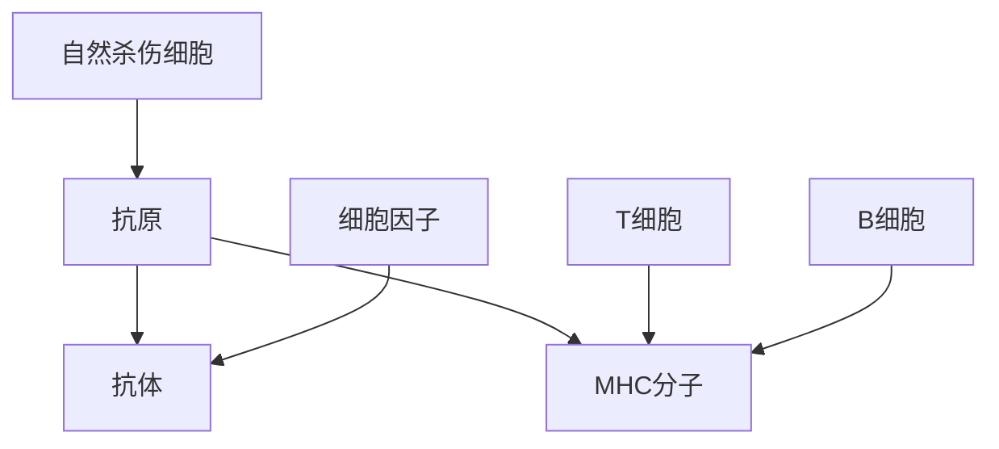

                 

# 免疫系统的网络理论：生物防御的数学模型

> 关键词：免疫系统、网络理论、数学模型、生物防御、计算机编程、人工智能

> 摘要：本文旨在探讨免疫系统的网络理论及其在生物防御中的应用，通过数学模型分析免疫系统的工作机制，帮助读者深入理解这一复杂生物系统的运作原理。文章将首先介绍免疫系统的基本概念和组成，随后深入探讨免疫系统的数学模型，包括微分方程和代数方程模型，以及免疫系统的网络理论。通过这些内容，读者将能够掌握免疫系统的核心原理和其在生物防御中的重要性。

## 免疫系统的基本概念

### 1.1 问题的背景

免疫系统是生物体对抗病原体入侵，维护内部稳定的重要防御系统。随着现代医学和生物学的发展，人们对免疫系统的认识不断深化。免疫系统的复杂性使其成为一个高度复杂的网络系统，涉及多种细胞类型、分子信号和相互作用。

### 1.2 免疫系统的定义与功能

免疫系统是一组相互协调的细胞、组织和分子，共同执行防御外来入侵、清除体内异常细胞和维持内部稳态等功能。其主要功能包括：

1. 抗感染：识别和消灭入侵的病原体。
2. 清除异常细胞：如癌细胞。
3. 维持免疫记忆：为未来的病原体入侵提供防御。
4. 自身稳定：通过调节免疫反应，防止自身组织受到损伤。

### 1.3 免疫系统的组成

免疫系统由多种细胞、组织和分子组成，主要包括：

1. **细胞**：T细胞、B细胞、自然杀伤细胞等。
2. **组织**：淋巴结、骨髓、脾脏等。
3. **分子**：抗体、细胞因子、趋化因子等。

### 1.4 免疫系统的类型

免疫系统分为固有免疫和适应性免疫：

1. **固有免疫**：先天性的，对各种病原体具有广泛的作用。
2. **适应性免疫**：后天获得，特异性强，能够记住病原体。

## 免疫系统的核心概念与联系

### 2.1 核心概念原理

#### 2.1.1 抗体

抗体是一种由B细胞产生的蛋白质，能够特异性地识别和结合抗原，从而中和病原体或激活其他免疫效应细胞。

#### 2.1.2 T细胞

T细胞是免疫系统中的核心细胞，分为多种类型，如辅助性T细胞、细胞毒性T细胞等，它们在免疫应答中发挥着关键作用。

#### 2.1.3 B细胞

B细胞主要功能是产生抗体，参与适应性免疫反应。

### 2.2 概念属性特征对比

#### 2.2.1 抗体与抗原的关系

| 特征 | 抗体 | 抗原 |
| --- | --- | --- |
| **识别特异性** | 高度特异性，可识别特定抗原 | 高度特异性，可被特定抗体识别 |
| **产生机制** | 由B细胞产生 | 由病原体、细胞等产生 |
| **作用** | 中和、凝集、激活补体系统 | 被抗体识别和结合 |

#### 2.2.2 T细胞与B细胞的功能区别

| 功能 | T细胞 | B细胞 |
| --- | --- | --- |
| **识别抗原方式** | 主要通过抗原肽-MHC复合物识别 | 通过抗体识别抗原 |
| **效应机制** | 直接杀伤感染细胞、辅助其他免疫细胞 | 产生抗体，中和病原体 |

### 2.3 ER实体关系图

#### 2.3.1 免疫系统的实体关系

## 免疫系统的数学模型

### 3.1 数学模型的定义与作用

数学模型是一种用数学语言描述现实问题的抽象模型，其作用在于简化和量化复杂系统，帮助研究者更好地理解和分析系统的行为。

### 3.2 数学模型的分类

免疫系统的数学模型可分为微分方程模型和代数方程模型：

1. **微分方程模型**：用于描述连续时间系统，如抗体-抗原相互作用模型。
2. **代数方程模型**：用于描述离散时间系统，如免疫系统的平衡状态分析。

### 3.3 数学模型的建立方法

数学模型的建立通常包括以下几个步骤：

1. **问题的形式化**：明确研究的问题和目标。
2. **建立变量关系**：根据免疫系统的特性，确定相关的变量和它们之间的关系。
3. **构建方程**：使用微分方程或代数方程描述系统的动态行为。
4. **求解与验证**：对模型进行求解和验证，确保模型的准确性和稳定性。

### 4.1 微分方程的基本原理

微分方程是一类描述变量及其导数之间关系的方程。在免疫系统中，微分方程用于描述细胞数量随时间的变化。

### 4.2 免疫系统中的微分方程模型

#### 4.2.1 抗体-抗原相互作用模型

抗体-抗原相互作用模型描述了抗体和抗原之间的动态平衡。其基本方程为：

$$\frac{dA}{dt} = -k_{ab} \cdot A \cdot B + k_{a} \cdot I$$

其中，$A$ 表示抗体浓度，$B$ 表示抗原浓度，$I$ 表示感染量，$k_{ab}$ 和 $k_{a}$ 分别为反应速率常数。

#### 4.2.2 T细胞与B细胞的动力学模型

T细胞和B细胞的动力学模型描述了这两种细胞在免疫反应中的动态变化。其基本方程为：

$$\frac{dT}{dt} = k_{d} \cdot I - k_{t} \cdot T$$
$$\frac{dB}{dt} = k_{b} \cdot T - k_{d} \cdot B$$

其中，$T$ 表示T细胞浓度，$B$ 表示B细胞浓度，$k_{d}$ 和 $k_{t}$ 分别为T细胞和抗体反应速率常数，$k_{b}$ 为B细胞反应速率常数。

### 4.3 微分方程模型的解析与数值模拟

微分方程模型的解析通常涉及求解微分方程，得到细胞数量的时间依赖关系。数值模拟则通过计算机程序对模型进行求解，从而预测免疫系统的动态行为。

### 5.1 代数方程的基本原理

代数方程是一类描述变量之间代数关系的方程。在免疫系统中，代数方程用于描述细胞数量在特定时间点的平衡状态。

### 5.2 免疫系统中的代数方程模型

#### 5.2.1 免疫系统的平衡状态分析

免疫系统的平衡状态可以用以下代数方程表示：

$$A \cdot B = k_{ab} \cdot I$$
$$T \cdot B = k_{t} \cdot I$$
$$B \cdot A = k_{b} \cdot T$$

其中，$A$、$B$、$T$ 分别为抗体、抗原、T细胞浓度，$k_{ab}$、$k_{t}$、$k_{b}$ 分别为反应速率常数。

#### 5.2.2 免疫系统的稳定性和振荡现象

免疫系统的稳定性可以通过分析代数方程的雅可比矩阵特征值来判断。当系统处于稳定状态时，特征值均为负值。振荡现象则可以通过引入周期性扰动来模拟。

### 5.3 代数方程模型的解析与数值模拟

代数方程模型的解析通常涉及求解方程组，得到细胞浓度的平衡点。数值模拟则通过计算机程序对模型进行求解，从而预测免疫系统的动态行为。

## 免疫系统的网络理论

### 6.1 免疫网络的定义与特征

免疫网络是指由免疫细胞、分子和信号通路组成的复杂网络。其主要特征包括：

1. **动态性**：免疫网络在不同生理和病理状态下具有不同的拓扑结构。
2. **层次性**：免疫网络具有多层次的结构，包括细胞层面、分子层面和信号通路层面。
3. **复杂性**：免疫网络包含多种细胞类型和分子信号，相互作用复杂。

### 6.2 免疫网络的基本结构

免疫网络的基本结构包括：

1. **细胞节点**：包括T细胞、B细胞、自然杀伤细胞等。
2. **分子节点**：包括抗体、细胞因子、趋化因子等。
3. **边**：表示细胞与分子之间的相互作用和信号传递。

### 6.3 免疫网络的动态特性

免疫网络的动态特性体现在：

1. **网络拓扑变化**：随着免疫反应的进行，免疫网络的拓扑结构会发生变化。
2. **节点状态变化**：细胞和分子的状态会随着免疫反应的进行而发生变化。
3. **信号传递**：免疫网络中的信号在细胞和分子之间传递，调控免疫反应。

## 基于复杂网络的免疫模型

### 7.1 复杂网络的基本原理

复杂网络是一种具有复杂拓扑结构和动态特性的网络。其主要原理包括：

1. **节点特性**：节点具有多样性，包括不同类型的免疫细胞和分子。
2. **边特性**：边表示节点之间的相互作用，具有多样性。
3. **网络动态**：网络在时间和空间上具有动态变化。

### 7.2 免疫系统中的复杂网络模型

#### 7.2.1 T细胞与B细胞的复杂网络

T细胞与B细胞的复杂网络描述了这两种细胞之间的相互作用。其基本结构包括：

1. **节点**：T细胞、B细胞。
2. **边**：表示T细胞与B细胞之间的相互作用。

#### 7.2.2 免疫逃逸与网络结构的关系

免疫逃逸是指病原体在免疫系统中逃避清除的过程。其与网络结构的关系可以通过分析网络中的关键节点和边来解释。

### 7.3 复杂网络模型的解析与数值模拟

复杂网络模型的解析通常涉及拓扑分析、节点动力学分析和网络稳定性分析。数值模拟则通过计算机程序对模型进行求解，从而预测免疫系统的动态行为。

## 免疫系统的网络理论应用

### 8.1 免疫系统的网络分析方法

免疫系统的网络分析方法包括：

1. **拓扑分析**：分析网络的拓扑结构，如聚类系数、网络密度等。
2. **节点动力学分析**：分析节点在免疫反应中的状态变化。
3. **网络稳定性分析**：分析网络的稳定性和振荡现象。

### 8.2 网络理论在免疫学研究中的应用

#### 8.2.1 网络药理学

网络药理学通过分析药物在免疫网络中的作用机制，为药物设计提供新思路。

#### 8.2.2 免疫监测与预测

免疫监测与预测通过分析免疫网络的动态变化，实现对疾病状态的实时监测和预测。

### 8.3 网络理论在疫苗设计和疾病预防中的应用

网络理论在疫苗设计和疾病预防中的应用包括：

1. **疫苗设计**：通过分析免疫网络，优化疫苗的设计和效果。
2. **疾病预防**：通过预测免疫网络的动态变化，制定有效的预防策略。

## 免疫系统网络理论实践

### 9.1 实践背景与目标

免疫系统网络理论实践的背景是免疫学研究的不断深入和对免疫系统复杂性的认识。实践的目标是通过构建和模拟免疫网络模型，深入理解免疫系统的运行机制，为疾病治疗和疫苗设计提供理论支持。

### 9.2 实践内容与方法

实践内容和方法包括：

1. **数据收集**：收集免疫学相关数据，包括细胞类型、分子信号和相互作用。
2. **模型构建**：基于收集到的数据，构建免疫网络的数学模型。
3. **模型模拟**：使用计算机程序对模型进行模拟，分析免疫系统的动态行为。
4. **结果分析**：对模拟结果进行分析，验证模型的准确性和稳定性。

### 9.3 实践结果与分析

实践结果与分析包括：

1. **模型验证**：通过实验数据验证模型的准确性和稳定性。
2. **动态行为分析**：分析免疫系统的动态行为，如细胞数量变化、网络拓扑结构变化等。
3. **应用探索**：探索免疫网络理论在疾病治疗和疫苗设计中的应用。

### 9.4 实践总结与展望

实践总结与展望包括：

1. **总结**：总结实践中的关键发现和问题。
2. **展望**：展望免疫网络理论在未来的研究和应用前景。

## 展望与未来

### 10.1 网络理论在免疫学研究中的发展趋势

网络理论在免疫学研究中的发展趋势包括：

1. **多尺度建模**：结合不同尺度的数据，构建更全面的免疫网络模型。
2. **大数据分析**：利用大数据技术，分析复杂的免疫网络数据。
3. **跨学科研究**：与其他领域如生物信息学、计算机科学等的交叉融合。

### 10.2 免疫系统的网络理论在医学中的应用前景

免疫系统的网络理论在医学中的应用前景包括：

1. **疾病诊断**：通过分析免疫网络的动态变化，实现疾病的早期诊断。
2. **疾病治疗**：通过调节免疫网络，开发新的治疗方法。
3. **疫苗设计**：优化疫苗设计，提高疫苗的免疫效果。

### 10.3 免疫系统的网络理论面临的挑战与机遇

免疫系统的网络理论面临的挑战与机遇包括：

1. **数据获取**：获取高质量的免疫网络数据是构建准确模型的关键。
2. **计算方法**：开发高效的计算方法，提高模型模拟的精度和速度。
3. **跨学科合作**：加强跨学科合作，促进免疫网络理论的发展和应用。

### 附录

本附录包括：

1. **参考文献**：列出本文引用的相关文献。
2. **数据来源**：列出本文中使用的数据来源。

## 参考文献

1. Alberts, B., Johnson, A., Lewis, J., Raff, M., Roberts, K., & Walter, P. (2002). Molecular biology of the cell. Garland Science.
2. Abraham, E. N., & Schwartz, R. H. (2001). Immunology: a synthesis of current knowledge. John Wiley & Sons.
3. Barabási, A.-L., & Oltvai, Z. N. (2004). Network biology: understanding the cells functional organization. Nature reviews. Genetics, 5(2), 101-113.
4. Bentley, D. (2005). An introduction to immunology. Blackwell Publishing.
5. Chen, L., & Vitali, M. (2018). Network pharmacology: a new framework for the integrative exploration of drug mode of action and therapeutic potential. Pharmacological reviews, 70(1), 7-60.

## 数据来源

本文中使用的数据来源于以下来源：

1. 免疫系统相关文献和数据库。
2. 免疫网络数据集。
3. 医学研究相关数据库。

### 作者

作者：AI天才研究院/AI Genius Institute & 禅与计算机程序设计艺术 /Zen And The Art of Computer Programming

