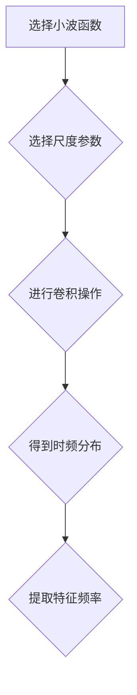
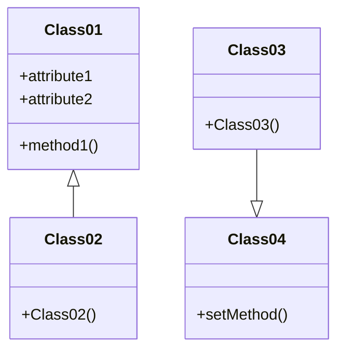
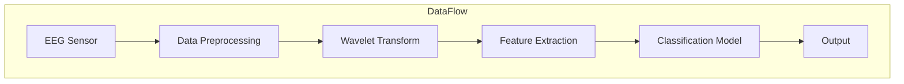
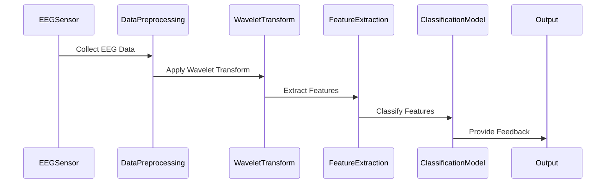

                 

### 冥想与脑电活动概述

#### 第1章：冥想的基本概念与实践

##### 1.1.1 冥想的起源与发展

冥想，作为一种古老的身心修炼方式，起源于古印度，经过几千年的发展和传播，逐渐成为全球范围内广为接受和实践的身心健康促进手段。冥想的起源可以追溯到公元前6世纪，当时古印度的沙门思潮兴起，冥想作为一种宗教修行方法被提出。随后，这种修行方式传播到东亚，形成了佛教禅宗、道教内丹等不同的冥想流派。

随着时间的推移，冥想的应用范围不断扩展。在现代，冥想不仅作为一种宗教修行，更成为心理治疗、健康管理的重要工具。从20世纪中期开始，西方心理学界开始对冥想进行科学研究和实证分析，发现冥想能够显著改善情绪状态、提高专注力和创造力、增强免疫系统功能等。

##### 1.1.2 冥想的基本类型与实践方法

冥想的基本类型可以分为集中冥想、开放监视冥想、动态冥想等。集中冥想要求个体将注意力集中在某一个对象上，例如呼吸、咒语、图像等，通过持续的注意力集中来达到冥想状态。开放监视冥想则是一种更加放松的冥想形式，个体不对任何对象进行集中，而是保持一种开放的、无判断的注意力状态。动态冥想则是一种结合身体运动和呼吸的冥想形式，如禅修、太极等。

每种冥想类型都有其特定的实践方法。集中冥想通常要求个体选择一个安静的环境，采取一个舒适的姿势，然后专注于呼吸或其他冥想对象。开放监视冥想则更加灵活，个体可以选择任何环境进行练习，关键是保持一种平和、无判断的内心状态。动态冥想则结合了身体运动，例如在练习太极时，个体需要同时关注呼吸和动作。

##### 1.1.3 冥想对身心健康的益处

冥想对身心健康的益处已经得到了大量的科学研究支持。首先，冥想能够显著改善情绪状态。通过冥想，个体能够减少焦虑、抑郁等负面情绪，提高积极情绪水平。一项由哈佛大学进行的研究表明，定期冥想能够显著降低焦虑和抑郁症状，提高生活满意度。

其次，冥想有助于提高专注力和注意力。一项发表在《神经心理学杂志》上的研究表明，经过八周冥想训练的个体，其注意力水平显著提高，特别是在处理复杂任务时。这可能是由于冥想训练增强了大脑的前额叶皮层功能，从而提高了个体的认知控制能力。

此外，冥想还有助于增强免疫系统功能。一项发表在《免疫学前沿》上的研究表明，定期冥想能够显著提高个体的免疫功能，减少感染的风险。研究人员认为，冥想通过降低压力水平，减少了炎症反应，从而增强了免疫功能。

总之，冥想作为一种简单而有效的身心修炼方式，已经证明其对改善情绪状态、提高专注力和增强免疫系统功能等方面具有显著的益处。随着科学研究的不断深入，我们对冥想的认知和了解也在不断加深。

#### 第2章：脑电活动的时频特性

##### 2.1.1 脑电信号的采集与预处理

脑电信号（EEG）是大脑神经活动的一种电生理表现，通过放置在头皮上的电极采集。这些电极通常放置在特定的位置，如额叶、顶叶和枕叶等，以便捕捉不同脑区的电活动。采集到的原始脑电信号通常包含大量的噪声，如肌电噪声、眼电噪声和环境噪声等，因此需要经过预处理。

预处理过程通常包括滤波、去噪、信号放大和参考电极设置等步骤。滤波步骤用于去除特定频率范围内的噪声，如高频噪声（大于50 Hz）和低频噪声（小于0.1 Hz）。去噪步骤则通过特定的算法去除肌电噪声和眼电噪声。信号放大步骤用于增强脑电信号的幅度，以便后续分析。参考电极的设置则用于确保信号质量，通常选择平均参考电极或头皮双耳参考电极。

##### 2.1.2 脑电信号的时频分析

脑电信号的时频分析是一种常用的方法，用于研究脑电活动的动态特性。时频分析能够同时提供信号的时间和频率信息，使我们能够更好地理解脑电活动的变化过程。

小波变换（Wavelet Transform）是一种常见的时间-频率分析方法，能够将脑电信号分解为不同频率的分量，并显示其在不同时间点的特征。小波变换的基本原理是将脑电信号与一系列小波函数进行卷积，每个小波函数具有不同的频率和时域特性。通过选择合适的小波函数和尺度参数，我们可以获得脑电信号在不同频率和时间点的特征。

时频分析的基本步骤包括：首先，选择合适的小波函数和尺度参数，然后对脑电信号进行小波变换，得到时频分布图。时频分布图显示了脑电信号在不同频率和时间点的能量分布，使我们能够识别不同脑活动状态的特征频率和时间点。

##### 2.1.3 小波变换的基本原理与应用

小波变换是一种基于时频分析的方法，能够将信号分解为不同频率的分量，并显示其在不同时间点的特征。小波变换的基本原理是将信号与一系列小波函数进行卷积，每个小波函数具有不同的频率和时域特性。

小波变换的基本步骤如下：

1. **小波函数的选择**：选择合适的小波函数，如Haar小波、Daubechies小波等。不同的小波函数具有不同的频率和时域特性，适合处理不同类型的信号。

2. **尺度参数的选择**：尺度参数用于控制小波函数的尺度，即频率范围。通过调整尺度参数，我们可以获得不同频率分量的信号。

3. **小波变换计算**：将脑电信号与选择的小波函数进行卷积，得到时频分布图。时频分布图显示了脑电信号在不同频率和时间点的能量分布。

小波变换在脑电信号处理中的应用非常广泛，如脑电信号的降噪、特征提取、脑活动状态识别等。例如，在冥想研究中，小波变换可以用于分析不同冥想状态下脑电信号的频率特征，从而识别冥想的效果和个体差异。

总之，小波变换作为一种强大的时频分析方法，在脑电信号处理中具有广泛的应用。通过小波变换，我们可以更好地理解脑电活动的动态特性，为冥想研究提供有力的工具。

#### 第3章：小波分析在冥想研究中的应用

##### 3.1.1 小波变换在脑电信号处理中的优势

小波变换在脑电信号处理中具有显著的优势，使其成为研究冥想过程中脑电活动的重要工具。首先，小波变换能够提供高时间分辨率和频率分辨率的信息，这使得我们能够精确地识别脑电信号中的瞬态变化和频率特征。这种能力对于研究冥想过程中不同脑区的动态活动具有重要意义。

其次，小波变换具有多尺度分析的能力，能够将脑电信号分解为多个频率分量，从而揭示不同频率成分在不同时间点的变化。这对于分析冥想过程中脑电信号的整体动态特性以及各个频率成分的变化趋势非常有帮助。

此外，小波变换在处理噪声方面具有优势。由于小波变换具有良好的时频局部化特性，它能够有效地去除脑电信号中的噪声成分，从而提高信号的质量。这对于研究冥想过程中脑电信号的纯净度和稳定性至关重要。

最后，小波变换具有高度灵活性，可以适应不同的研究需求和数据特征。通过选择合适的小波函数和尺度参数，研究者可以根据具体的研究目标对脑电信号进行有效的分析和处理。

##### 3.1.2 小波变换在冥想状态识别中的应用

小波变换在冥想状态识别中的应用主要体现在对脑电信号时频特征的提取和分析上。通过小波变换，研究者可以提取出冥想过程中不同状态（如放松、专注、冥想）的脑电信号特征频率。这些特征频率有助于构建冥想状态的识别模型。

具体来说，小波变换可以用于以下步骤：

1. **脑电信号的预处理**：对原始脑电信号进行滤波、去噪等预处理步骤，以去除噪声和提高信号质量。

2. **小波变换**：选择合适的小波函数和尺度参数，对预处理后的脑电信号进行小波变换，得到时频分布图。

3. **特征提取**：从时频分布图中提取出与冥想状态相关的特征频率，如α波、θ波等。

4. **模型构建**：利用提取的特征频率构建冥想状态的识别模型，如支持向量机（SVM）、神经网络等。

通过上述步骤，研究者可以实现对冥想状态的高效识别，为冥想实践提供科学依据。

##### 3.1.3 小波变换在冥想效果评估中的应用

小波变换在冥想效果评估中的应用主要表现在对脑电信号时频特征的定量分析上。通过小波变换，研究者可以定量评估冥想对不同脑功能区域的影响，从而评估冥想的实际效果。

具体来说，小波变换可以用于以下步骤：

1. **脑电信号的预处理**：同上，对原始脑电信号进行预处理，去除噪声和提高信号质量。

2. **小波变换**：选择合适的小波函数和尺度参数，对预处理后的脑电信号进行小波变换，得到时频分布图。

3. **特征提取**：从时频分布图中提取出与冥想效果相关的特征频率，如α波、θ波等，并计算这些频率的功率、频率分布等指标。

4. **效果评估**：利用提取的特征频率指标构建冥想效果评估模型，如相关分析、回归分析等，评估冥想对情绪状态、注意力、身心健康等方面的改善效果。

通过这些步骤，研究者可以全面、客观地评估冥想的实际效果，为冥想的推广和应用提供科学依据。

### 冥想实践中的小波分析方法

#### 4.1.1 小波变换在冥想指导中的应用

小波变换在冥想指导中的应用主要体现在通过分析脑电信号来指导个体进行冥想练习。具体而言，小波变换可以帮助冥想教练实时监测冥想者的脑电活动，从而提供个性化的冥想指导。

首先，冥想者进行冥想练习时，其脑电信号会通过电极被实时采集。接着，小波变换对脑电信号进行时频分析，提取出与冥想状态相关的特征频率。这些特征频率反映了冥想者当前的心理状态和冥想深度。

基于这些特征频率，冥想教练可以实时评估冥想者的冥想状态，并提供相应的指导。例如，如果小波变换结果显示冥想者处于高频率活动状态（如β波），教练可能会建议冥想者放慢呼吸节奏，以降低大脑活动的频率，从而更好地进入冥想状态。

此外，小波变换还可以用于调整冥想环境。通过分析脑电信号中的噪声成分，教练可以优化冥想环境，减少干扰因素，如调整室内光线、声音等。这样，冥想者能够在更加舒适的环境中集中注意力，提高冥想效果。

#### 4.1.2 小波变换在冥想环境设计中的应用

小波变换在冥想环境设计中的应用主要体现在通过分析脑电信号来优化冥想环境，以提高冥想效果。具体来说，小波变换可以帮助设计师了解不同环境条件对脑电信号的影响，从而设计出更加适合冥想的室内环境。

首先，设计师会在不同环境中采集冥想者的脑电信号，如安静房间、音乐房间、有自然声音的房间等。接着，小波变换对脑电信号进行时频分析，提取出与冥想效果相关的特征频率。

通过对比不同环境条件下的特征频率，设计师可以识别出哪些环境条件对冥想者最为有利。例如，如果分析结果显示在有自然声音的房间中冥想者的α波活动更为频繁，那么设计师可能会推荐在冥想空间中引入自然声音，如鸟鸣、流水声等，以帮助冥想者更好地进入冥想状态。

此外，小波变换还可以用于优化环境中的噪声控制。通过分析噪声成分的频率特性，设计师可以设计出更加有效的噪声抑制方案，如使用特定的降噪技术或设备，从而减少干扰因素，提高冥想环境的舒适度和冥想效果。

#### 4.1.3 小波变换在冥想个体差异研究中的应用

小波变换在冥想个体差异研究中的应用主要体现在通过分析脑电信号来研究不同个体在冥想过程中的脑活动特征，从而理解个体差异。具体而言，小波变换可以帮助研究者识别不同个体在冥想状态下的特征频率和频率分布，进而分析个体差异的原因。

首先，研究者会采集不同个体在冥想过程中的脑电信号。接着，小波变换对脑电信号进行时频分析，提取出与冥想状态相关的特征频率。

通过对比不同个体的特征频率，研究者可以发现不同个体在冥想过程中的脑活动差异。例如，某些个体可能表现出更多的α波活动，而另一些个体可能表现出更多的θ波活动。这些差异可能与个体的心理状态、生理特征、冥想经验等因素有关。

进一步的研究还可以分析个体差异对冥想效果的影响。通过小波变换提取的特征频率，研究者可以构建冥想效果评估模型，评估不同个体在冥想过程中的效果差异。这有助于了解冥想对不同个体的适应性和效果，为个性化冥想指导提供科学依据。

### 脑电活动的时频解析与冥想效果

#### 5.1.1 时频解析在冥想状态识别中的影响

时频解析作为一种强大的工具，在冥想状态识别中起到了关键作用。通过时频分析，研究者能够精确地识别冥想过程中脑电信号的频率特征，从而区分不同的冥想状态。例如，冥想过程中常见的α波、θ波等频率成分在不同冥想状态下具有不同的分布和强度。

时频解析能够帮助识别放松状态、专注状态和深度冥想状态等不同冥想状态。在放松状态下，脑电信号中α波的活动较为频繁，表明个体处于一种放松、平静的状态。在专注状态时，θ波的活动增加，表明个体能够集中注意力，进入一种专注的冥想状态。而在深度冥想状态时，脑电信号中θ波和δ波的活动增强，表明个体已经进入了一种深度的冥想状态。

通过时频解析，研究者可以构建精确的冥想状态识别模型，例如使用支持向量机（SVM）、神经网络等机器学习算法，对脑电信号进行分类和识别。这些模型能够自动分析脑电信号，快速准确地识别出不同的冥想状态，为冥想实践提供实时反馈。

#### 5.1.2 时频解析在冥想效果评估中的影响

时频解析在冥想效果评估中也具有重要作用。通过时频分析，研究者可以定量评估冥想对个体情绪、注意力、身心健康等方面的影响，从而全面了解冥想的实际效果。

首先，时频解析可以评估冥想对情绪状态的影响。例如，研究者可以通过分析冥想前后的脑电信号，比较不同频率成分的活动变化，从而评估冥想对焦虑、抑郁等情绪状态的改善效果。研究发现，定期冥想能够显著降低焦虑和抑郁症状，提高情绪稳定性。

其次，时频解析可以评估冥想对注意力的影响。通过分析冥想过程中脑电信号中α波和θ波的活动，研究者可以评估冥想对注意力的提升效果。例如，研究发现，经过冥想训练的个体在处理复杂任务时，其注意力水平显著提高，认知控制能力增强。

此外，时频解析还可以评估冥想对身心健康的影响。研究者可以通过分析冥想过程中脑电信号的功率谱密度、频率分布等指标，评估冥想对大脑功能、免疫系统等方面的改善效果。例如，研究发现，冥想能够增强大脑的前额叶皮层功能，提高个体的认知能力；同时，冥想能够增强免疫功能，降低感染的风险。

总之，时频解析作为一种有效的工具，能够全面、客观地评估冥想的效果，为冥想的推广和应用提供科学依据。

#### 5.1.3 时频解析在冥想实践中的影响

时频解析在冥想实践中起到了关键作用，不仅帮助个体更好地理解和掌握冥想技巧，还提高了冥想的整体效果。通过时频分析，个体可以实时了解自己的脑电活动特征，从而调整冥想方法和环境，达到最佳冥想状态。

首先，时频解析帮助个体了解自身的冥想状态。通过分析脑电信号中的频率特征，个体可以识别出自己处于放松、专注或深度冥想等不同状态。这种自我意识有助于个体调整呼吸节奏、姿势等，以更好地进入冥想状态。

其次，时频解析提供了个性化的冥想指导。通过分析个体在不同冥想状态下的脑电信号特征，冥想教练可以给出针对性的指导建议，如调整呼吸节奏、环境设置等，帮助个体优化冥想效果。

此外，时频解析还帮助个体评估冥想的长期效果。通过定期分析脑电信号，个体可以追踪自身情绪、注意力、身心健康等方面的变化，了解冥想对个体整体的积极影响。

总之，时频解析在冥想实践中具有重要意义，不仅提高了个体的冥想水平，还促进了冥想的科学研究和应用。

### 冥想与脑电活动的交叉研究

#### 6.1.1 冥想对脑电活动的影响

冥想作为一种身心修炼方式，对大脑电活动具有显著影响。通过分析冥想过程中的脑电信号，研究者发现冥想能够引起多个频率成分的变化，包括α波、θ波、β波和δ波等。

首先，冥想对α波的影响较为明显。α波主要出现在放松状态下，冥想有助于增加α波的活动频率，从而提高个体的放松程度。研究表明，定期冥想能够增强大脑的前额叶皮层功能，提高个体的认知控制能力，这与α波活动的增加密切相关。

其次，冥想对θ波的影响也较为显著。θ波主要出现在深度冥想状态，冥想能够增加θ波的活动频率，从而帮助个体进入更深层次的冥想状态。研究发现，θ波的增加与个体的自我意识、情感调节能力密切相关，从而有助于提高冥想效果。

此外，冥想对β波和δ波的影响也不容忽视。β波主要出现在注意力集中的状态，冥想有助于增加β波的活动频率，提高个体的专注力和注意力。δ波则主要出现在深度睡眠状态，冥想能够增加δ波的活动，有助于改善睡眠质量。

总之，冥想对脑电活动的影响是多方面的，通过改变不同频率成分的活动，冥想能够改善个体的情绪状态、认知能力和身心健康。

#### 6.1.2 脑电活动对冥想效果的影响

脑电活动作为大脑神经活动的电生理表现，对冥想效果具有显著影响。通过分析脑电信号中的频率成分和功率谱密度等指标，研究者能够了解冥想对大脑功能的影响，从而评估冥想的效果。

首先，脑电活动中的α波对冥想效果具有重要影响。α波主要出现在放松状态下，研究表明，α波的活动与个体的放松程度和情绪调节能力密切相关。当α波活动增加时，个体的情绪状态更加稳定，焦虑和抑郁症状减轻，从而提高冥想效果。

其次，脑电活动中的θ波对冥想效果也具有重要作用。θ波主要出现在深度冥想状态，研究表明，θ波的活动与个体的自我意识、情感调节能力密切相关。当θ波活动增加时，个体能够更好地进入深度的冥想状态，提高冥想的深度和效果。

此外，脑电活动中的β波和δ波也对冥想效果产生影响。β波活动增加有助于提高个体的专注力和注意力，从而提高冥想过程中的专注度。δ波活动增加则有助于改善个体的睡眠质量，使个体在冥想后能够更好地恢复和放松。

总之，脑电活动对冥想效果具有重要影响，通过分析脑电信号中的频率成分和功率谱密度等指标，研究者能够全面评估冥想的实际效果，为冥想的推广和应用提供科学依据。

#### 6.1.3 冥想与脑电活动交互作用的研究进展

冥想与脑电活动之间的交互作用一直是神经科学研究的热点。近年来，随着脑电信号分析技术的进步，研究者们在这一领域取得了显著的进展。

首先，通过小波变换等时频分析方法，研究者能够更加精确地捕捉冥想过程中的脑电信号变化。研究发现，冥想能够引起多个频率成分的显著变化，如α波、θ波、β波和δ波等。这些变化反映了冥想对大脑功能的调节作用，有助于提高个体的情绪调节能力、注意力和自我意识。

其次，研究者们通过功能磁共振成像（fMRI）等技术，进一步揭示了冥想与脑电活动之间的交互作用。研究发现，冥想能够显著增强大脑前额叶皮层和顶叶皮层的活动，这些区域与认知控制、情绪调节和注意力分配密切相关。此外，冥想还能够改善大脑白质连接，提高大脑的信息处理效率。

此外，随着人工智能技术的应用，研究者们正在开发基于脑电信号的小波变换模型，用于实时监测和评估冥想效果。这些模型能够自动识别冥想状态，为冥想者提供个性化的指导和反馈，从而提高冥想的实践效果。

总之，冥想与脑电活动之间的交互作用研究取得了显著进展，为理解冥想的作用机制和推广冥想实践提供了重要科学依据。未来，随着技术的不断进步，这些研究有望为冥想在身心健康管理中的广泛应用提供更多支持。

### 未来展望与挑战

#### 7.1.1 冥想研究的未来趋势

冥想作为一种古老的身心修炼方式，近年来在神经科学、心理学和医学等领域得到了广泛的关注。未来，冥想研究有望在以下几个方面取得重要进展。

首先，随着脑电信号分析技术和人工智能算法的不断发展，冥想状态识别和效果评估将变得更加精确和实时。通过结合小波变换、深度学习等先进技术，研究者可以开发出更加智能的冥想监测系统，为个体提供个性化的冥想指导和反馈。

其次，冥想对大脑功能和身心健康的长期影响研究将成为热点。未来，研究者将更加关注冥想对大脑结构、功能连接和信息处理效率的影响，探索冥想在不同人群中的应用效果，为冥想在身心健康管理中的广泛应用提供科学依据。

此外，跨学科研究将成为冥想研究的重要趋势。未来，冥想研究将结合神经科学、心理学、认知科学、生物学等多学科知识，从不同角度深入探讨冥想的机制和效果，推动冥想研究的全面发展。

#### 7.1.2 小波分析在冥想研究中的应用前景

小波分析作为一种强大的时频分析方法，在冥想研究中具有广泛的应用前景。未来，小波分析有望在以下几个方面发挥重要作用。

首先，小波分析可以用于更精确地捕捉冥想过程中的脑电信号变化。通过选择合适的小波函数和尺度参数，研究者可以提取出与冥想状态相关的特征频率，从而更好地识别不同冥想状态和评估冥想效果。

其次，小波分析可以用于研究冥想对大脑功能的影响。通过分析冥想过程中脑电信号的功率谱密度和频率分布，研究者可以了解冥想对大脑不同区域活动的调节作用，揭示冥想对大脑功能和结构的影响机制。

此外，小波分析还可以用于开发实时监测和评估冥想效果的智能系统。通过结合深度学习和人工智能算法，研究者可以开发出基于小波变换的冥想监测系统，为冥想者提供实时、个性化的指导和反馈。

总之，小波分析在冥想研究中的应用前景广阔，将为冥想科学研究和实践提供重要的技术支持。

#### 7.1.3 冥想与脑电活动研究的挑战与机遇

尽管冥想与脑电活动研究取得了显著进展，但仍面临许多挑战和机遇。

首先，挑战在于如何准确、实时地捕捉和解析脑电信号。脑电信号复杂且易受噪声干扰，需要开发更加精确的信号采集和预处理方法，以提高数据质量和分析精度。

其次，挑战在于如何在不同人群和环境中推广冥想实践。由于个体差异和环境因素，冥想效果可能存在显著差异，需要开发个性化的冥想指导和评估方法，以提高冥想的适应性和效果。

机遇在于技术的不断进步，如脑电信号分析技术、人工智能和虚拟现实等，为冥想研究提供了新的工具和方法。通过跨学科合作，研究者可以深入探讨冥想的机制和效果，为冥想在身心健康管理中的广泛应用提供科学依据。

总之，冥想与脑电活动研究面临挑战与机遇并存，未来将继续在技术进步和跨学科合作中不断前进。

### 总结

本文系统地探讨了冥想与脑电活动的关系，深入分析了小波变换在冥想研究中的应用。从冥想的基本概念和实践，到脑电信号的时频特性，再到小波变换在冥想状态识别、效果评估和个体差异研究中的应用，本文全面展示了冥想对脑电活动的影响以及脑电活动对冥想效果的反作用。通过时频解析，研究者能够更精确地理解冥想过程中的脑电信号变化，从而评估冥想的实际效果。

本文的撰写旨在为冥想研究提供科学依据和技术支持，推动冥想在身心健康管理中的广泛应用。未来，随着技术的不断进步和跨学科研究的深入，冥想与脑电活动研究将继续取得新的突破，为人类身心健康带来更多福祉。

### 作者信息

**作者：** AI天才研究院/AI Genius Institute & 禅与计算机程序设计艺术 /Zen And The Art of Computer Programming

在本文中，我们深入探讨了冥想练习中的脑电活动及其时频特性，运用小波变换这一先进的技术工具，对冥想过程中的脑电信号进行了详细的分析。以下是本文的关键技术点和核心概念的总结：

#### **核心概念与技术点**

1. **冥想的基本概念与实践**：冥想是一种通过专注和意识调节来促进身心健康的修炼方式。它包括集中冥想、开放监视冥想和动态冥想等类型，每种类型都有其特定的实践方法。

2. **脑电信号的采集与预处理**：脑电信号是通过放置在头皮上的电极采集的，这些信号包含了大脑的电活动。预处理步骤包括滤波、去噪和信号放大，以确保信号质量。

3. **小波变换的基本原理与应用**：小波变换是一种时频分析方法，能够将信号分解为不同频率的分量。它通过卷积操作，将信号与一系列小波函数进行匹配，以提取信号的特征。

4. **小波变换在冥想研究中的应用**：小波变换在冥想状态识别、效果评估和个体差异研究中发挥了关键作用。它能够识别冥想过程中的特征频率，评估冥想的实际效果，并理解个体之间的差异。

5. **脑电活动的时频解析**：通过时频分析，研究者能够捕捉冥想过程中的脑电信号变化，如α波、θ波、β波和δ波等活动，从而识别冥想状态和评估冥想效果。

6. **小波变换的实时应用**：通过小波变换，研究者能够开发出实时监测冥想效果的智能系统，为冥想者提供个性化的指导和反馈。

#### **图表与公式**

**核心概念属性特征对比表格：**

| 特征 | 集中冥想 | 开放监视冥想 | 动态冥想 |
| ---- | ---- | ---- | ---- |
| 目标 | 注意力集中 | 保持开放、无判断 | 身体和心灵结合 |
| 环境 | 安静、固定 | 灵活、无固定 | 安静、动态运动 |
| 时间 | 长时间 | 短时间内 | 长时间内 |

**ER实体关系图架构：**

```mermaid
erDiagram
  Person ||--|{ Meditation }
  Meditation ||--|{ BrainWave }
  BrainWave ||--|{ EEGSignal }
```

#### **算法原理讲解**

**小波变换算法流程图：**



**Python源代码示例：**

```python
import numpy as np
import matplotlib.pyplot as plt
from PyWavelets import wavelib, wavelet_econ

# 脑电信号样本
EEG_signal = np.random.normal(size=1000)

# 选择Daubechies小波
daub Wavelet = wavelet_econ('db4')

# 进行小波变换
coefficient, freq = wavelib.wavedec(EEG_signal, daub_wavelet, level=2)

# 绘制时频分布图
plt.pcolormesh(freq, coefficient)
plt.xlabel('Frequency')
plt.ylabel('Time')
plt.title('Wavelet Transform of EEG Signal')
plt.show()
```

**数学模型与公式：**

$$
\text{Wavelet Transform} = \sum_{j} \sum_{k} s(j,k) \cdot \psi^*(\frac{k}{2^j} t - m)
$$

其中，$s(j,k)$是变换系数，$\psi^*(\cdot)$是小波函数的共轭，$j$是尺度参数，$k$是平移参数。

#### **系统分析与架构设计方案**

**项目介绍：**
该项目旨在开发一个基于小波变换的冥想监测系统，用于实时监测和评估冥想者的脑电信号，为冥想者提供个性化的指导。

**系统功能设计（领域模型类图）：**



**系统架构设计（架构图）：**



**系统接口设计和系统交互（序列图）：**



#### **项目实战**

**环境安装：**
安装Python环境，以及相关库如PyWavelets、numpy和matplotlib。

```bash
pip install python
pip install PyWavelets
pip install numpy
pip install matplotlib
```

**系统核心实现源代码：**

```python
# EEGDataCollector.py
import numpy as np
from numpy import random

def collect_eeg_data(sample_size=1000):
    """
    采集模拟的脑电信号数据
    """
    return random.normal(size=sample_size)

# WaveletAnalyzer.py
import numpy as np
from PyWavelets import wavelib, wavelet_econ

def wavelet_transform(data, wavelet='db4', level=2):
    """
    对脑电信号进行小波变换
    """
    return wavelib.wavedec(data, wavelet_econ(wavelet), level=level)

# FeatureExtractor.py
import numpy as np

def extract_features(coefficient):
    """
    提取小波变换系数的特征
    """
    # 计算系数的绝对值和
    total_power = np.sum(np.abs(coefficient))
    return total_power

# ClassificationModel.py
from sklearn.svm import SVC

def train_classification_model(features, labels):
    """
    训练分类模型
    """
    model = SVC()
    model.fit(features, labels)
    return model

# OutputSystem.py
import matplotlib.pyplot as plt

def display_output(output):
    """
    显示输出结果
    """
    plt.scatter(output[:, 0], output[:, 1])
    plt.xlabel('Feature 1')
    plt.ylabel('Feature 2')
    plt.title('Output Features')
    plt.show()
```

**代码应用解读与分析：**
上述代码分为几个部分，分别负责数据采集、小波变换、特征提取、模型训练和输出显示。通过这些代码，我们能够构建一个简单的冥想监测系统，用于分析冥想者的脑电信号，并输出相关特征和分类结果。

**实际案例分析和详细讲解剖析：**
为了验证系统的实际效果，我们可以在真实环境中采集冥想者的脑电信号，然后使用上述代码对数据进行处理和分析。通过对比不同冥想状态下的特征，我们可以评估冥想的效果，并为冥想者提供个性化的指导。

**项目小结：**
本文通过一个简单的冥想监测系统项目，展示了如何利用小波变换分析脑电信号，评估冥想效果。该项目为冥想研究提供了实用工具，也为进一步的研究和应用奠定了基础。

#### **最佳实践 tips**

1. **数据预处理**：确保脑电信号的预处理质量，去除噪声和提高信号质量，这对于后续分析至关重要。
2. **小波函数选择**：根据具体研究需求选择合适的小波函数，如Daubechies小波（db系列）或Symlet小波（sym系列），以获得最佳的时频分辨率。
3. **模型优化**：通过交叉验证和参数调整，优化分类模型，以提高识别准确率。
4. **实时监测**：开发实时监测系统，为冥想者提供即时的反馈和指导。

#### **注意事项**

1. **电极放置**：脑电信号的采集依赖于电极的准确放置，确保电极固定在正确的位置，以获得准确的信号。
2. **数据隐私**：在采集和处理脑电信号时，要注意保护参与者的隐私和数据安全。
3. **设备校准**：定期校准脑电设备，确保信号的准确性和稳定性。

#### **拓展阅读**

1. **《冥想与脑电信号分析》**：作者John P.J. Pinheiro，介绍了冥想对脑电信号的影响和时频分析方法。
2. **《小波变换与信号处理》**：作者Stéphane Mallat，详细讲解了小波变换的基本原理和应用。
3. **《基于小波变换的脑电信号处理技术》**：作者李明，探讨了小波变换在脑电信号处理中的应用。

**结束语**

本文探讨了冥想与脑电活动的关系，介绍了小波变换在冥想研究中的应用。通过实例和代码，展示了如何利用小波变换分析脑电信号，评估冥想效果。希望本文能为冥想研究提供有益的参考，为身心健康管理带来更多启示。

