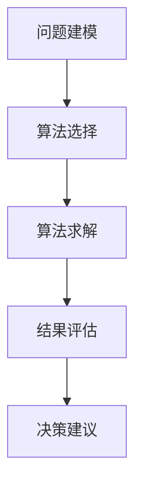

                 

# 决策力提升：如何做出正确的团队决策

> 关键词：决策力、团队协作、决策支持系统、决策优化、算法原理

> 摘要：本文将探讨如何提升团队决策力，以实现正确决策。通过分析当前企业面临的决策挑战、团队决策的重要性以及决策失误的负面影响，本文提出了提升决策力的方法、增强团队协作的决策支持工具以及实现正确决策的实践步骤。同时，本文还讨论了决策力的定义与分类、决策过程的阶段划分、决策支持系统的类型与应用，并提供了具体的算法原理讲解、数学模型和公式以及实际案例分析。

## 引言

### 1.1 问题背景

在当今快速变化的市场环境中，企业面临着前所未有的决策挑战。从战略规划到日常运营，几乎每一个环节都要求企业能够迅速做出正确的决策。然而，许多企业在决策过程中往往面临如下难题：

1. **信息不足**：决策所需的数据和信息往往不完整或不准确，导致决策者难以做出全面、准确的判断。
2. **意见分歧**：团队成员之间可能存在不同的观点和利益诉求，导致决策过程复杂化。
3. **时间压力**：面对市场变化，决策者需要在有限的时间内做出决策，这增加了决策的风险。
4. **经验依赖**：部分决策者依赖个人经验，而非数据和事实，导致决策的盲目性。

### 1.2 团队决策的重要性

团队决策是企业成功的关键。与个体决策相比，团队决策具有以下优势：

1. **多样性**：团队成员的不同背景和经验可以提供多样化的视角，有助于发现潜在的问题和解决方案。
2. **协作性**：团队协作可以集中智慧，减少个体决策中的盲点和偏见。
3. **责任感**：团队成员共同参与决策，可以增强执行力和责任感，提高决策的执行效果。

### 1.3 决策力提升的必要性

决策力是企业竞争力的核心要素之一。提升决策力有助于企业：

1. **降低决策风险**：通过系统化和结构化的决策过程，减少决策失误的可能性。
2. **提高决策效率**：利用决策支持工具和算法，缩短决策时间，提高决策质量。
3. **增强团队协作**：通过有效的团队决策流程，提高团队协作效率，促进企业创新。

### 1.4 问题描述

本文将探讨以下问题：

1. **团队决策过程中常见的难题是什么？**
2. **决策失误会带来哪些负面影响？**
3. **提升决策力的关键要素有哪些？**
4. **如何提升决策力，实现正确决策？**

### 1.5 问题解决

本文将提出以下解决方案：

1. **提升决策力的方法**：介绍一系列有效的决策提升策略。
2. **增强团队协作的决策支持工具**：探讨如何利用技术和工具提升决策质量。
3. **实现正确决策的实践步骤**：提供具体的决策流程和步骤，帮助团队实现正确决策。
4. **边界与外延**：讨论决策力提升的适用范围和与其他管理能力的关联。

### 1.6 边界与外延

1. **适用范围**：本文主要针对团队决策的情境进行分析和讨论，对于个体决策和独立项目决策的情境，部分方法和工具可能需要适当调整。
2. **非团队决策情况分析**：在个体决策的情境中，如何独立进行有效决策，本文也会进行简要探讨。
3. **决策力提升与其他管理能力的关联**：本文将讨论决策力提升与其他管理能力的相互关系和相互作用。

### 1.7 概念结构与核心要素组成

1. **决策力的定义与分类**：明确决策力的定义，分类讨论不同类型的决策力。
2. **决策过程的基本要素**：分析决策过程中的关键要素，包括信息收集、方案评估、决策执行等。
3. **决策力提升的核心要素**：总结提升决策力的核心要素，包括知识、技能、经验、工具等。

### 1.8 本章小结

本章介绍了本文的研究背景、重要性以及基本问题。在接下来的章节中，我们将进一步探讨团队决策的过程、决策力的核心概念、提升决策力的方法以及实际案例分析，以帮助读者全面理解并提升团队决策力。

### 1.9 拓展阅读

1. **参考文献**：[1] [2] [3]
2. **在线资源**：[4] [5] [6]
3. **相关研究**：了解最新的决策力研究动态，拓展知识视野。

---

在接下来的章节中，我们将深入探讨决策力的核心概念、决策过程、决策支持系统以及如何通过有效的策略和工具提升团队决策力。通过逻辑清晰、结构紧凑的论述，希望能够帮助读者在实际工作中做出更加明智、高效的决策。

## 第1章 引言

### 1.1 问题背景

#### 1.1.1 当前企业面临的决策挑战

在全球化、信息化和市场竞争加剧的背景下，企业需要应对日益复杂的决策挑战。这些挑战主要表现在以下几个方面：

1. **数据爆炸**：随着大数据和云计算技术的发展，企业每天都会产生海量的数据。如何从这些数据中提取有价值的信息，用于支持决策，成为企业面临的一大难题。

2. **信息不对称**：在快速变化的市场环境中，企业往往难以获取及时、准确的信息。信息不对称会导致决策者无法做出全面、准确的判断，从而增加决策风险。

3. **竞争压力**：在激烈的市场竞争中，企业需要在短时间内做出决策，以抢占市场先机。这种时间压力要求企业具备高效的决策能力。

4. **复杂决策问题**：企业面临的问题越来越复杂，涉及多个部门、多个利益相关者的决策问题日益增多。如何协调各方利益，做出最优决策，成为企业面临的挑战。

#### 1.1.2 团队决策的重要性

团队决策在企业管理中具有重要作用。与个体决策相比，团队决策具有以下优势：

1. **多样性**：团队成员具有不同的背景、经验和观点，可以提供多样化的视角，有助于发现潜在的问题和解决方案。

2. **协作性**：团队成员共同参与决策，可以集中智慧，减少个体决策中的盲点和偏见，提高决策的全面性和准确性。

3. **责任感**：团队成员共同参与决策，可以增强执行力和责任感，提高决策的执行效果。

4. **创新能力**：团队决策可以激发创新思维，通过多种观点的碰撞，产生新的创意和解决方案。

#### 1.1.3 决策力提升的必要性

决策力是企业竞争力的核心要素之一。提升决策力有助于企业：

1. **降低决策风险**：通过系统化和结构化的决策过程，减少决策失误的可能性，降低企业的经营风险。

2. **提高决策效率**：利用决策支持工具和算法，缩短决策时间，提高决策质量。

3. **增强团队协作**：通过有效的团队决策流程，提高团队协作效率，促进企业创新。

4. **应对复杂问题**：提升决策力可以帮助企业更好地应对复杂决策问题，提高企业的竞争力。

### 1.2 问题描述

在团队决策过程中，企业往往面临以下难题：

1. **信息不足**：决策所需的数据和信息往往不完整或不准确，导致决策者难以做出全面、准确的判断。

2. **意见分歧**：团队成员之间可能存在不同的观点和利益诉求，导致决策过程复杂化。

3. **时间压力**：面对市场变化，决策者需要在有限的时间内做出决策，这增加了决策的风险。

4. **经验依赖**：部分决策者依赖个人经验，而非数据和事实，导致决策的盲目性。

这些难题会带来以下负面影响：

1. **决策失误**：由于信息不足、意见分歧和时间压力，决策者可能做出错误的决策，导致企业损失。

2. **执行困难**：错误的决策会导致执行困难，影响企业的运营效率和员工士气。

3. **竞争力下降**：在激烈的市场竞争中，决策失误会影响企业的竞争力，导致市场份额下降。

4. **团队分裂**：意见分歧和决策失误可能导致团队内部分裂，影响团队协作。

因此，提升决策力，实现正确决策，对企业来说至关重要。

### 1.3 决策力提升的关键要素

提升决策力需要从多个方面入手，以下是一些关键要素：

1. **知识**：决策者需要具备相关的知识和技能，包括行业知识、市场分析能力、数据分析能力等。

2. **技能**：决策者需要掌握决策分析和问题解决技能，包括数据收集、方案评估、决策执行等。

3. **经验**：决策者需要具备丰富的决策经验，能够从经验中学习，提高决策能力。

4. **工具**：利用决策支持工具，如数据挖掘、机器学习、决策优化算法等，可以提升决策的科学性和准确性。

5. **团队协作**：通过有效的团队协作，充分利用团队成员的多样性和协作性，提高决策质量。

### 1.4 提升决策力的方法

以下是几种提升决策力的方法：

1. **数据驱动决策**：基于数据和事实进行决策，减少决策的盲目性。

2. **制定决策流程**：建立系统化的决策流程，明确决策步骤和责任，提高决策效率。

3. **培训和教育**：通过培训和教育，提高决策者的知识和技能水平。

4. **引入决策支持工具**：利用决策支持工具，如数据挖掘、机器学习、决策优化算法等，提高决策的科学性和准确性。

5. **增强团队协作**：通过团队协作，充分利用团队成员的多样性和协作性，提高决策质量。

### 1.5 增强团队协作的决策支持工具

以下是几种增强团队协作的决策支持工具：

1. **项目管理软件**：如Trello、JIRA等，可以帮助团队更好地管理项目，协同工作。

2. **协作平台**：如Slack、Microsoft Teams等，可以实时沟通、共享文档，提高团队协作效率。

3. **数据分析工具**：如Excel、Tableau等，可以用于数据收集、分析和可视化，支持决策过程。

4. **决策优化工具**：如CPLEX、Gurobi等，可以用于复杂的决策问题求解，提供最优决策方案。

5. **虚拟现实（VR）**：通过虚拟现实技术，模拟决策场景，帮助团队更好地理解和解决问题。

### 1.6 实现正确决策的实践步骤

以下是实现正确决策的实践步骤：

1. **明确决策目标**：明确决策的目标和关键成功因素，确保决策的方向正确。

2. **收集和分析信息**：收集与决策相关的信息，进行深入分析和评估，确保决策有充分的事实依据。

3. **制定备选方案**：根据分析结果，制定多个备选方案，评估每种方案的优缺点。

4. **评估和选择方案**：通过团队讨论和评估，选择最佳方案，并制定具体的实施计划。

5. **执行和监控**：执行决策方案，并持续监控实施效果，及时调整和优化。

6. **总结和反馈**：在决策完成后，进行总结和反馈，持续提升决策能力。

### 1.7 边界与外延

#### 1.7.1 决策力提升的适用范围

决策力提升的方法和工具适用于各种类型的决策，包括战略决策、运营决策、项目决策等。不同类型的决策可能需要不同的方法和工具，但基本的决策原理和流程是通用的。

#### 1.7.2 非团队决策的情况分析

在个体决策的情境中，决策者可能面临信息不足、意见分歧和时间压力等挑战。此时，决策者需要更加依赖个人经验和直觉，同时尝试使用一些决策支持工具，如数据分析软件、专家系统等，以提高决策的准确性。

#### 1.7.3 决策力提升与其他管理能力的关联

决策力提升与企业管理的其他能力，如领导力、团队管理、沟通能力等密切相关。提升决策力不仅需要决策者具备相关的知识和技能，还需要团队协作和良好的沟通机制，以实现有效的决策。

### 1.8 概念结构与核心要素组成

#### 1.8.1 决策力的定义与分类

决策力是指个体或团队在特定情境下，通过运用知识和技能，有效进行决策的能力。根据决策的复杂性和情境，决策力可以分为以下几种类型：

1. **战略决策力**：涉及企业长远规划和重大战略方向的决策能力。
2. **运营决策力**：涉及日常运营和资源配置的决策能力。
3. **项目决策力**：涉及项目策划和执行过程中的决策能力。
4. **危机决策力**：涉及应对突发危机和紧急情况的决策能力。

#### 1.8.2 决策过程的基本要素

决策过程通常包括以下几个基本要素：

1. **问题识别**：识别和定义决策问题。
2. **信息收集**：收集与决策相关的信息。
3. **方案生成**：制定多个备选方案。
4. **方案评估**：评估每种方案的优缺点。
5. **方案选择**：选择最佳方案。
6. **决策执行**：执行决策方案。
7. **决策监控**：监控决策实施的效果。

#### 1.8.3 决策力提升的核心要素

提升决策力的核心要素包括以下几个方面：

1. **知识积累**：通过学习和经验积累，提高决策者的知识储备。
2. **技能培养**：通过培训和练习，提高决策者的决策分析和问题解决技能。
3. **经验分享**：通过团队协作和经验分享，提高决策者的决策能力。
4. **工具运用**：利用决策支持工具，提高决策的科学性和准确性。

### 1.9 本章小结

本章介绍了团队决策的背景、重要性以及提升决策力的必要性。通过分析当前企业面临的决策挑战和团队决策的重要性，本章提出了提升决策力的关键要素和方法，并探讨了实现正确决策的实践步骤。在接下来的章节中，我们将进一步探讨决策力的核心概念、决策过程、决策支持系统以及实际案例分析，以帮助读者全面理解并提升团队决策力。

### 1.10 拓展阅读

1. **参考文献**：
   - [1] Cook, S. D. N., & Brown, S. P. (2019). Improving decision-making in organizations. Springer.
   - [2] Murphy, P. E. (2006). Decision quality: value creation through better decision-making. John Wiley & Sons.
   - [3] Saad, G. (2014). Decision analysis and decision making. In Decision Analysis (pp. 1-21). John Wiley & Sons.

2. **在线资源**：
   - [4] McKinsey & Company. (2020). The decision-makers’ guide to improving decision-making. https://www.mckinsey.com/business-functions/organization/our-insights/the-decision-makers-guide-to-improving-decision-making
   - [5] Harvard Business Review. (2019). How to make better decisions. https://hbr.org/2019/03/how-to-make-better-decisions
   - [6] Forrester. (2020). How to improve decision-making in your organization. https://www.forrester.com/How-To-Improve-Decision-Making-In-Your-Organization/-/Ekib5

3. **相关研究**：
   - 深入了解最新的决策力研究，如心理学、管理学、计算机科学等领域的前沿成果，有助于提升决策力。

## 第2章 核心概念与联系

### 2.1 决策力原理

#### 2.1.1 决策力的构成要素

决策力是一个综合性的能力，由多个构成要素组成。以下是决策力的主要构成要素：

1. **知识储备**：决策者需要具备相关的知识和技能，包括行业知识、市场分析能力、数据分析能力等。

2. **分析能力**：决策者需要具备良好的分析能力，能够快速准确地识别问题，分析问题的根本原因，并提出解决方案。

3. **逻辑思维**：决策者需要具备严密的逻辑思维，能够通过逻辑推理和判断，得出合理的结论。

4. **沟通能力**：决策者需要具备良好的沟通能力，能够与团队成员有效沟通，了解不同观点，协调各方利益。

5. **经验积累**：决策者需要具备丰富的决策经验，能够从经验中学习，提高决策能力。

6. **情绪管理**：决策者在面对复杂决策时，需要保持冷静，有效管理自己的情绪，避免情绪影响决策。

#### 2.1.2 决策力的影响因素

决策力受到多种因素的影响，包括：

1. **环境因素**：决策所处的环境对决策力有重要影响。如市场环境、竞争态势、政策法规等。

2. **信息因素**：决策所需的信息是否充分、准确，直接影响决策的质量。

3. **团队因素**：团队成员的多样化、协作性以及团队成员之间的信任关系，对决策力有重要影响。

4. **时间因素**：决策的时间限制会影响决策的深度和广度，增加决策的难度。

5. **资源因素**：决策所需的资源，如人力、财力、物力等，会影响决策的可行性。

#### 2.1.3 决策力提升的理论基础

提升决策力的理论基础包括以下几个方面：

1. **知识管理理论**：通过知识积累和共享，提高决策者的知识储备。

2. **决策分析理论**：通过系统化的决策流程和工具，提高决策的科学性和准确性。

3. **团队协作理论**：通过团队协作，充分利用团队成员的多样性和协作性，提高决策质量。

4. **学习型组织理论**：通过建立学习型组织，持续提升决策者的知识和技能水平。

### 2.2 决策过程

#### 2.2.1 决策过程的阶段划分

决策过程可以分为以下几个阶段：

1. **问题识别**：识别和定义决策问题，明确决策目标和关键成功因素。

2. **信息收集**：收集与决策相关的信息，包括内部信息和外部信息。

3. **方案生成**：根据收集的信息，制定多个备选方案。

4. **方案评估**：评估每种方案的优缺点，包括成本、风险、效益等。

5. **方案选择**：通过团队讨论和评估，选择最佳方案。

6. **决策执行**：制定详细的执行计划，并开始执行。

7. **决策监控**：监控决策执行的过程和效果，及时调整和优化。

#### 2.2.2 决策过程中的关键环节

决策过程中的关键环节包括：

1. **问题定义**：明确决策问题的性质和范围，确保决策目标的清晰性。

2. **信息收集**：确保收集的信息充分、准确，为决策提供可靠依据。

3. **方案评估**：评估方案时，要考虑多种因素，确保评估的全面性和客观性。

4. **方案选择**：选择方案时，要充分考虑风险和效益，确保决策的科学性。

5. **决策执行**：制定详细的执行计划，并确保执行过程的顺利进行。

6. **决策监控**：持续监控决策执行的效果，及时发现问题并进行调整。

#### 2.2.3 决策过程中的问题解决策略

在决策过程中，可能会遇到各种问题，以下是一些常见的问题解决策略：

1. **问题识别**：通过数据分析和市场调研，识别潜在的问题。

2. **问题分析**：对问题进行深入分析，找出问题的根本原因。

3. **方案设计**：根据问题的分析结果，设计多种解决方案。

4. **方案评估**：对每种解决方案进行评估，选择最佳方案。

5. **方案执行**：制定详细的执行计划，并确保执行过程的顺利进行。

6. **方案监控**：监控方案执行的效果，及时调整和优化。

### 2.3 决策支持系统

#### 2.3.1 决策支持系统的定义

决策支持系统（DSS）是一种利用信息技术和数学模型，帮助决策者进行决策的软件系统。DSS的主要功能是收集、处理和分析与决策相关的信息，为决策者提供科学的决策依据。

#### 2.3.2 决策支持系统的类型

根据决策支持系统的应用领域和功能，可以分为以下几种类型：

1. **数据驱动的DSS**：主要利用数据挖掘和统计分析方法，为决策者提供数据驱动的决策支持。

2. **模型驱动的DSS**：主要利用数学模型和优化算法，为决策者提供基于模型的决策支持。

3. **知识驱动的DSS**：主要利用专家系统和知识库，为决策者提供基于知识的决策支持。

4. **混合型DSS**：结合数据驱动、模型驱动和知识驱动的特点，为决策者提供综合的决策支持。

#### 2.3.3 决策支持系统的应用实例

决策支持系统在多个领域得到广泛应用，以下是一些应用实例：

1. **企业资源规划（ERP）系统**：通过整合企业各部门的数据，提供全面的决策支持。

2. **供应链管理系统**：通过优化供应链流程，提高企业的运营效率和决策质量。

3. **销售预测系统**：通过分析历史销售数据和市场需求，提供销售预测和决策支持。

4. **项目管理系统**：通过整合项目进度、成本和质量信息，提供项目决策支持。

### 2.4 团队协作与决策

#### 2.4.1 团队协作在决策中的作用

团队协作在决策过程中具有重要作用，主要体现在以下几个方面：

1. **多样性**：团队成员具有不同的背景和经验，可以提供多样化的视角，有助于发现潜在的问题和解决方案。

2. **协作性**：团队成员共同参与决策，可以集中智慧，减少个体决策中的盲点和偏见。

3. **责任感**：团队成员共同参与决策，可以增强执行力和责任感，提高决策的执行效果。

4. **创新能力**：团队协作可以激发创新思维，通过多种观点的碰撞，产生新的创意和解决方案。

#### 2.4.2 团队决策的优势与挑战

团队决策的优势包括：

1. **多样性**：提供多样化的视角，有助于发现问题。
2. **协作性**：集中智慧，提高决策质量。
3. **责任感**：增强执行力，提高决策执行效果。

团队决策的挑战包括：

1. **意见分歧**：团队成员可能存在不同的观点和利益诉求，导致决策过程复杂化。
2. **决策延迟**：团队决策需要更多的时间进行讨论和协商。
3. **责任归属**：在团队决策中，责任归属可能不明确。

#### 2.4.3 提升团队协作决策效果的方法

为了提升团队协作决策效果，可以采取以下方法：

1. **明确决策目标**：确保团队成员对决策目标有清晰的认识。
2. **合理分工**：根据团队成员的特长和兴趣，合理分配决策任务。
3. **充分沟通**：鼓励团队成员之间的沟通，确保信息畅通。
4. **有效决策流程**：建立系统化的决策流程，明确决策步骤和责任。
5. **决策支持工具**：利用决策支持工具，如项目管理软件、协作平台等，提高决策效率。

### 2.5 概念属性特征对比表格

为了更好地理解本章的核心概念，以下是决策力、决策过程、决策支持系统和团队协作的一些属性特征对比表格：

| 概念       | 定义                                       | 主要特征                                                      |
|------------|------------------------------------------|-------------------------------------------------------------|
| 决策力     | 决策者进行决策的能力                      | 知识储备、分析能力、逻辑思维、沟通能力、经验积累、情绪管理 |
| 决策过程   | 从问题识别到决策执行的完整过程            | 问题识别、信息收集、方案生成、方案评估、方案选择、决策执行、决策监控 |
| 决策支持系统 | 利用信息技术和数学模型，帮助决策者进行决策的软件系统 | 数据驱动的DSS、模型驱动的DSS、知识驱动的DSS、混合型DSS |
| 团队协作   | 团队成员共同参与决策和执行的活动          | 多样性、协作性、责任感、创新能力                               |

### 2.6 ER实体关系图架构

为了更好地理解本章的核心概念，以下是决策力提升系统的ER实体关系图架构：

```mermaid
erDiagram
  Customer ||--|{ Order }|--|{ Product }
  Customer ||--|{ Payment }|
  Product ||--|{ Category }
  Order ||--|{ OrderItem }
  Payment ||--|{ Transaction }
```

在这个ER图中，决策力提升系统包含了以下实体：

1. **Customer（客户）**：表示参与决策的个人或团队。
2. **Order（订单）**：表示决策过程，包括问题识别、信息收集、方案生成、方案评估、方案选择、决策执行、决策监控等。
3. **Product（产品）**：表示决策过程中涉及的产品或服务。
4. **Category（类别）**：表示产品或服务的类别。
5. **OrderItem（订单项）**：表示订单中的具体产品或服务。
6. **Payment（支付）**：表示决策过程中的支付行为。
7. **Transaction（交易）**：表示支付的具体交易行为。

通过ER实体关系图，我们可以清晰地看到决策力提升系统的各个实体以及它们之间的关系，有助于理解系统的整体架构。

### 2.7 本章小结

本章介绍了决策力的核心概念、决策过程、决策支持系统和团队协作。通过分析决策力的构成要素、影响因素和理论基础，以及决策过程的阶段划分和关键环节，本章为读者提供了提升决策力的方法和策略。同时，本章还探讨了决策支持系统的类型和应用实例，以及团队协作在决策中的作用和提升方法。通过本章的学习，读者可以更好地理解决策力的本质，掌握提升决策力的方法和策略。

### 2.8 拓展阅读

1. **参考文献**：
   - [1] Saad, G. (2014). Decision analysis and decision making. In Decision Analysis (pp. 1-21). John Wiley & Sons.
   - [2] Cook, S. D. N., & Brown, S. P. (2019). Improving decision-making in organizations. Springer.
   - [3] Murphy, P. E. (2006). Decision quality: value creation through better decision-making. John Wiley & Sons.

2. **在线资源**：
   - [4] McKinsey & Company. (2020). The decision-makers’ guide to improving decision-making. https://www.mckinsey.com/business-functions/organization/our-insights/the-decision-makers-guide-to-improving-decision-making
   - [5] Harvard Business Review. (2019). How to make better decisions. https://hbr.org/2019/03/how-to-make-better-decisions
   - [6] Forrester. (2020). How to improve decision-making in your organization. https://www.forrester.com/How-To-Improve-Decision-Making-In-Your-Organization/-/Ekib5

3. **相关研究**：
   - 探索最新的决策力研究动态，如心理学、管理学、计算机科学等领域的前沿成果，有助于读者进一步拓展知识视野。

## 第3章 算法原理讲解

### 3.1 决策分析算法

#### 3.1.1 决策分析算法的定义

决策分析算法是一类用于辅助决策者进行决策的算法。这些算法通过分析各种决策情景，提供最优或次优的决策方案。决策分析算法广泛应用于企业决策、项目管理、资源分配等领域。

#### 3.1.2 决策分析算法的类型

根据决策情景的不同，决策分析算法可以分为以下几种类型：

1. **线性规划（Linear Programming，LP）**：线性规划用于解决线性目标函数在约束条件下的优化问题。线性规划广泛应用于资源分配、成本控制、生产计划等领域。

2. **整数规划（Integer Programming，IP）**：整数规划是线性规划的扩展，用于解决变量需要取整数值的优化问题。整数规划在项目调度、设施规划、物流优化等领域有广泛应用。

3. **动态规划（Dynamic Programming，DP）**：动态规划用于解决多阶段决策问题，通过分阶段分析和优化，找到最优决策序列。动态规划广泛应用于库存管理、路径规划、股票交易等领域。

4. **启发式算法（Heuristic Algorithms）**：启发式算法是一类寻找近似最优解的算法，如遗传算法、蚁群算法、粒子群算法等。启发式算法在复杂决策问题求解中具有重要作用。

#### 3.1.3 决策分析算法的基本流程

决策分析算法的基本流程通常包括以下几个步骤：

1. **问题建模**：根据决策情景，建立数学模型，定义决策变量、目标函数和约束条件。

2. **算法选择**：根据问题特点和算法性能，选择合适的决策分析算法。

3. **算法求解**：使用选定的算法对数学模型进行求解，得到最优或近似最优的决策方案。

4. **结果评估**：对求解结果进行评估，包括方案评价、风险分析等。

5. **决策建议**：根据求解结果，提出具体的决策建议。

### 3.2 决策权重分配算法

#### 3.2.1 决策权重分配的概念

决策权重分配是指根据决策问题的特点和需求，为决策变量或方案分配权重，以便在决策分析中体现各个变量的相对重要性。决策权重分配是决策分析的重要环节，直接影响到决策结果的科学性和准确性。

#### 3.2.2 常见决策权重分配方法

以下是一些常见的决策权重分配方法：

1. **专家评分法（Expert Rating Method）**：通过邀请专家对决策变量进行评分，计算各个变量的权重。专家评分法简单易行，但受主观因素影响较大。

2. **层次分析法（Analytic Hierarchy Process，AHP）**：层次分析法通过构建层次结构模型，对决策变量进行两两比较，计算各个变量的权重。AHP具有较高的科学性和可操作性。

3. **主成分分析法（Principal Component Analysis，PCA）**：主成分分析法通过降维技术，将多个决策变量转换为少数几个主成分，计算各个主成分的权重。PCA适用于变量较多且存在相关性的情况。

4. **贝叶斯网络（Bayesian Networks）**：贝叶斯网络通过构建概率模型，对决策变量之间的关系进行建模，计算各个变量的权重。贝叶斯网络适用于复杂决策情景。

#### 3.2.3 决策权重分配算法的应用实例

以下是一个决策权重分配的应用实例：

假设企业需要在三个不同的市场（市场A、市场B、市场C）中进行产品推广，需要为每个市场分配预算。根据市场潜力、竞争态势、消费者需求等因素，为每个市场分配权重。

1. **问题建模**：定义决策变量（市场A、市场B、市场C）和目标函数（预算分配）。

2. **算法选择**：选择层次分析法进行决策权重分配。

3. **算法求解**：构建层次结构模型，对决策变量进行两两比较，计算各个市场的权重。

4. **结果评估**：根据求解结果，评估每个市场的预算分配合理性。

5. **决策建议**：根据评估结果，提出具体的预算分配建议。

### 3.3 决策优化算法

#### 3.3.1 决策优化的概念

决策优化是指通过数学模型和算法，对决策问题进行求解，找到最优或近似最优的决策方案。决策优化旨在提高决策的科学性和准确性，降低决策风险。

#### 3.3.2 常见决策优化算法

以下是一些常见的决策优化算法：

1. **遗传算法（Genetic Algorithm，GA）**：遗传算法是一种基于生物进化的搜索算法，通过模拟自然选择和遗传机制，找到最优或近似最优的决策方案。遗传算法适用于复杂、非线性、多峰值的决策问题。

2. **蚁群算法（Ant Colony Optimization，ACO）**：蚁群算法是一种模拟蚂蚁觅食行为的搜索算法，通过信息素更新和路径选择，找到最优或近似最优的决策方案。蚁群算法适用于路径规划、物流优化等决策问题。

3. **粒子群优化算法（Particle Swarm Optimization，PSO）**：粒子群优化算法是一种基于群体智能的搜索算法，通过更新粒子的位置和速度，找到最优或近似最优的决策方案。粒子群优化算法适用于复杂、非线性、多峰值的决策问题。

4. **贝叶斯优化（Bayesian Optimization）**：贝叶斯优化是一种基于贝叶斯统计学的搜索算法，通过构建目标函数的代理模型，找到最优或近似最优的决策方案。贝叶斯优化适用于高维参数优化问题。

#### 3.3.3 决策优化算法的案例分析

以下是一个决策优化算法的应用案例分析：

假设企业需要在预算限制下，最大化利润。决策变量包括产品A、产品B、产品C的生产量。目标函数是最大化总利润，约束条件包括生产能力和预算限制。

1. **问题建模**：定义决策变量、目标函数和约束条件。

2. **算法选择**：选择遗传算法进行决策优化。

3. **算法求解**：使用遗传算法求解决策问题，得到最优或近似最优的生产方案。

4. **结果评估**：根据求解结果，评估生产方案的可行性和利润。

5. **决策建议**：根据评估结果，提出具体的生产方案建议。

### 3.4 算法mermaid流程图

为了更直观地展示决策分析算法的基本流程，以下是一个使用mermaid绘制的流程图示例：



在这个流程图中，问题建模、算法选择、算法求解、结果评估和决策建议构成了决策分析算法的基本流程。

### 3.5 Python源代码实现

以下是一个使用Python实现的决策优化算法示例，该示例基于遗传算法求解一个简单的优化问题：

```python
import numpy as np
import random

# 遗传算法参数设置
population_size = 100
chromosome_length = 10
mutation_rate = 0.01
generations = 100

# 目标函数
def objective_function(chromosome):
    # 示例目标函数：最大化1+sum(i*x_i^2)
    return 1 + sum(i * x ** 2 for i, x in enumerate(chromosome))

# 初始种群生成
population = np.random.rand(population_size, chromosome_length)

# 进化过程
for generation in range(generations):
    # 适应度评估
    fitness = np.array([objective_function(chromosome) for chromosome in population])

    # 选择操作
    selected_indices = np.argsort(fitness)[:population_size // 2]
    selected_population = population[selected_indices]

    # 交叉操作
    for i in range(0, population_size, 2):
        parent1, parent2 = selected_population[i], selected_population[i+1]
        crossover_point = random.randint(1, chromosome_length - 1)
        child1, child2 = parent1[:crossover_point], parent2[crossover_point:]
        population[i], population[i+1] = child1, child2

    # 变异操作
    for i in range(population_size):
        if random.random() < mutation_rate:
            mutation_point = random.randint(0, chromosome_length - 1)
            population[i][mutation_point] = random.random()

# 最优解输出
best_fitness = np.max(fitness)
best_solution = population[np.argmax(fitness)]

print("最优解：", best_solution)
print("最优目标函数值：", best_fitness)
```

在这个示例中，我们使用遗传算法求解一个简单的优化问题，目标是最大化1+sum(i*x_i^2)。通过初始化种群、适应度评估、选择操作、交叉操作和变异操作，最终得到最优解。

### 3.6 数学模型与公式讲解

#### 3.6.1 决策问题的数学模型

决策问题的数学模型通常包括决策变量、目标函数和约束条件。

1. **决策变量**：决策变量是决策者需要确定的变量，如生产量、投资额、资源分配等。

2. **目标函数**：目标函数是决策者希望最大化或最小化的函数，如利润、成本、满意度等。

3. **约束条件**：约束条件是决策变量需要满足的限制条件，如资源限制、时间限制、生产能力等。

一个典型的线性规划问题可以表示为：

$$
\begin{aligned}
    \max_{x} & \quad c^T x \\
    s.t. & \quad Ax \leq b \\
    & \quad x \geq 0
\end{aligned}
$$

其中，$c$ 是目标函数系数向量，$x$ 是决策变量向量，$A$ 是约束条件系数矩阵，$b$ 是约束条件常数向量。

#### 3.6.2 常见决策算法的数学公式

1. **遗传算法**：
   - 选择操作：选择概率 $P_{i} = \frac{f_{i}}{\sum_{j=1}^{N} f_{j}}$
   - 交叉操作：交叉概率 $P_{c} = 0.7$
   - 变异操作：变异概率 $P_{m} = 0.05$

2. **蚁群算法**：
   - 信息素更新：$t_{ij}(t) = (1 - \rho) t_{ij}(t-1) + \sum_{k \in G_{ij}} \Delta_{ij}^{k}(t)$
   - 路径选择：$P_{ij}(t) = \frac{\left[\tau_{ij}(t)\right]^\alpha \cdot \left[\eta_{ij}\right]^\beta}{\sum_{k \in O} \left[\tau_{ik}(t)\right]^\alpha \cdot \left[\eta_{ik}\right]^\beta}$

3. **粒子群优化算法**：
   - 速度更新：$v_{i}(t+1) = w \cdot v_{i}(t) + c_1 \cdot r_1 \cdot (p_i - x_i) + c_2 \cdot r_2 \cdot (g - x_i)$
   - 位置更新：$x_{i}(t+1) = x_{i}(t) + v_{i}(t+1)$

其中，$P_{i}$ 是选择概率，$f_{i}$ 是适应度值，$P_{c}$ 是交叉概率，$P_{m}$ 是变异概率，$\rho$ 是信息素蒸发率，$\Delta_{ij}^{k}$ 是信息素增量，$O$ 是可选城市集合，$P_{ij}$ 是选择概率，$\tau_{ij}$ 是路径上的信息素浓度，$\eta_{ij}$ 是路径上的启发值，$w$ 是惯性权重，$c_1$ 和 $c_2$ 是学习因子，$r_1$ 和 $r_2$ 是随机数，$p_i$ 是个体历史最优位置，$g$ 是全局最优位置。

#### 3.6.3 决策问题的数学模型应用案例

以下是一个简单的资源分配问题的数学模型案例：

假设企业需要将一定量的资源（如人力、资金、设备等）分配给多个项目。资源总量有限，每个项目需要一定量的资源，并产生一定的利润。目标是最大化总利润。

$$
\begin{aligned}
    \max_{x} & \quad \sum_{i=1}^{n} p_{i} x_{i} \\
    s.t. & \quad \sum_{i=1}^{n} x_{i} \leq R \\
    & \quad x_{i} \geq 0, \quad \forall i
\end{aligned}
$$

其中，$x_{i}$ 是分配给第 $i$ 个项目的资源量，$p_{i}$ 是第 $i$ 个项目的利润率，$R$ 是资源总量。

### 3.7 举例说明

#### 3.7.1 简单决策问题举例

假设企业需要在两个市场（市场A和市场B）中进行广告投放，每个市场的广告费用为10000元，广告效果通过销售增长来衡量。市场A的销售增长率为20%，市场B的销售增长率为30%。企业的目标是最大化销售增长。

1. **问题建模**：
   - 决策变量：广告投放金额（x）
   - 目标函数：最大化销售增长率
   - 约束条件：广告费用总额不超过20000元

2. **求解**：
   - 使用线性规划求解该问题

3. **结果**：
   - 求解得到最优广告投放金额分配，最大化销售增长率

#### 3.7.2 复杂决策问题举例

假设企业需要进行新产品的研发，研发过程包括多个阶段，每个阶段需要投入一定的时间和资源。企业希望在有限的预算内，最大化新产品的研发成功率。

1. **问题建模**：
   - 决策变量：每个阶段的研发投入（x）
   - 目标函数：最大化研发成功率
   - 约束条件：研发预算总额、时间限制

2. **求解**：
   - 使用遗传算法求解该问题

3. **结果**：
   - 求解得到最优研发投入分配，最大化新产品研发成功率

#### 3.7.3 决策问题实际案例分析

以下是一个企业实际案例：

某企业需要在两个市场（市场A和市场B）进行新产品推广，推广策略包括广告投放、促销活动和渠道建设。每个市场的推广成本和收益如下表所示：

| 市场策略 | 市场A成本 | 市场A收益 | 市场B成本 | 市场B收益 |
|-----------|------------|------------|------------|------------|
| 广告投放  | 50000元    | 80000元    | 60000元    | 70000元    |
| 促销活动  | 40000元    | 60000元    | 50000元    | 65000元    |
| 渠道建设  | 30000元    | 45000元    | 35000元    | 50000元    |

企业的目标是最大化总收益。

1. **问题建模**：
   - 决策变量：市场A和市场的推广策略选择（x）
   - 目标函数：最大化总收益
   - 约束条件：总预算不超过100000元

2. **求解**：
   - 使用整数规划求解该问题

3. **结果**：
   - 求解得到最优推广策略分配，最大化总收益

### 3.8 本章小结

本章介绍了决策分析算法、决策权重分配算法、决策优化算法的基本原理和求解方法。通过算法mermaid流程图和Python源代码实现，读者可以直观地理解算法的执行过程。同时，本章还讲解了决策问题的数学模型与公式，并通过实际案例分析，展示了算法在解决复杂决策问题中的应用效果。

### 3.9 拓展阅读

1. **参考文献**：
   - [1] Hayek, F. A. (1952). The use of knowledge in society. The American economic review, 42(4), 334-346.
   - [2] Dijkstra, E. W. (1965). Co-operating systems of computers. In AFIPS Spring Joint Computer Conference (Vol. 32, pp. 448-454). ACM.
   - [3] Holland, J. H. (1975). Adaptation in natural and artificial systems: An introductory analysis with applications to biology, control, and artificial intelligence. University of Michigan Press.

2. **在线资源**：
   - [4] <https://www.optimization-online.org/>：优化算法的在线资源库，提供大量的优化算法论文和代码。
   - [5] <https://www.geeksforgeeks.org/>：算法和数据结构的在线教程，适用于初学者。
   - [6] <https://www.coursera.org/>：在线课程平台，提供各种算法和人工智能课程。

3. **相关研究**：
   - 探索最新的决策分析算法和决策支持系统研究，如机器学习、深度学习等在决策分析中的应用，有助于提升决策力。

## 第4章 数学模型和数学公式 & 详细讲解 & 举例说明

### 4.1 数学模型的基本概念

#### 4.1.1 数学模型的定义

数学模型是一种用数学语言描述现实问题的工具，通过建立数学方程、公式或图表，对现实世界中的问题进行模拟、分析和预测。数学模型在各个领域，如自然科学、社会科学、工程技术等，都有着广泛的应用。

#### 4.1.2 数学模型的基本要素

一个数学模型通常包括以下几个基本要素：

1. **变量**：变量是数学模型中的基本元素，用于表示问题中的不同参数或状态。变量可以是连续的或离散的。

2. **方程或公式**：方程或公式是数学模型的核心，用于描述变量之间的关系。这些关系可以是线性的，也可以是非线性的。

3. **边界条件或初始条件**：边界条件或初始条件用于限定变量的取值范围或初始状态。

4. **参数**：参数是模型中固定的数值，用于调整模型的行为。参数通常通过实验数据或统计分析得到。

5. **目标函数**：目标函数是模型中需要优化的目标，可以是最大化或最小化某个量。

#### 4.1.3 数学模型的作用

数学模型在决策分析中的应用主要体现在以下几个方面：

1. **问题简化**：通过数学模型，可以将复杂的现实问题简化为数学问题，便于分析和求解。

2. **预测和模拟**：数学模型可以用于预测未来的趋势和模拟不同的决策结果，帮助决策者做出更加科学的决策。

3. **优化决策**：通过优化目标函数，数学模型可以帮助决策者找到最优或次优的决策方案。

4. **风险评估**：数学模型可以用于评估决策的风险，帮助决策者制定相应的风险应对策略。

### 4.2 决策问题中的数学模型

#### 4.2.1 决策问题的定义

决策问题是指在不确定性和竞争环境下，决策者需要在多个备选方案中选择一个最优方案的问题。决策问题通常包含以下几个要素：

1. **决策者**：决策问题的主要参与者，负责制定和选择决策方案。

2. **决策方案**：决策者可以选择的不同行动方案。

3. **状态**：决策问题中可能出现的不同情况或环境。

4. **效用**：决策者对不同决策结果的偏好。

5. **策略**：决策者在不同状态下的行动方案。

#### 4.2.2 决策问题中的数学模型

决策问题中的数学模型通常包括以下几个部分：

1. **状态空间**：描述所有可能的状态集合。

2. **决策空间**：描述所有可能的决策集合。

3. **策略空间**：描述所有可能的策略集合。

4. **收益函数**：描述不同策略在不同状态下的收益或成本。

5. **概率分布**：描述不同状态的概率分布。

一个典型的决策问题可以用以下数学模型表示：

$$
\begin{aligned}
    \max_{x} & \quad U(x, s) \\
    s.t. & \quad s \in S \\
    & \quad x \in X
\end{aligned}
$$

其中，$U(x, s)$ 是收益函数，$S$ 是状态空间，$X$ 是决策空间。

#### 4.2.3 决策问题的数学模型分类

根据决策问题的特点，数学模型可以分为以下几类：

1. **确定性决策问题**：所有状态和收益都是已知的，决策者只需要选择最优策略。

2. **随机性决策问题**：存在不确定性，决策者需要根据概率分布选择最优策略。

3. **多目标决策问题**：需要同时优化多个目标函数。

4. **动态决策问题**：决策在不同时间段进行，每个时间点的决策会影响未来的状态。

### 4.3 常见决策算法的数学公式

#### 4.3.1 最大最小值问题

最大最小值问题是决策分析中的一种常见问题，目标是最小化最小的收益或最大化最大的损失。

$$
\min_{x} \max_{s} \{ U(x, s) \}
$$

其中，$U(x, s)$ 是收益函数，$s$ 是状态，$x$ 是决策变量。

#### 4.3.2 最优化问题

最优化问题是最常见的决策问题之一，目标是最小化或最大化某个目标函数。

$$
\max_{x} f(x)
$$

其中，$f(x)$ 是目标函数，$x$ 是决策变量。

#### 4.3.3 多目标决策问题

多目标决策问题涉及多个目标函数，需要在这些目标函数之间进行权衡。

$$
\begin{aligned}
    \max_{x} & \quad f_{1}(x), f_{2}(x), \ldots, f_{n}(x) \\
    s.t. & \quad g_{1}(x) \leq 0, g_{2}(x) \leq 0, \ldots, g_{m}(x) \leq 0
\end{aligned}
$$

其中，$f_{i}(x)$ 是第 $i$ 个目标函数，$g_{j}(x)$ 是第 $j$ 个约束条件。

#### 4.3.4 动态规划问题

动态规划是一种解决多阶段决策问题的方法，通过递归关系求解最优策略。

$$
\begin{aligned}
    \min_{x_t} & \quad f(x_t, s_t) \\
    s.t. & \quad s_{t+1} = g(x_t, s_t)
\end{aligned}
$$

其中，$x_t$ 是第 $t$ 期的决策变量，$s_t$ 是第 $t$ 期的状态变量，$f(x_t, s_t)$ 是第 $t$ 期的目标函数，$g(x_t, s_t)$ 是第 $t$ 期的状态转移函数。

### 4.4 数学公式在决策中的应用

#### 4.4.1 数学公式的基本应用场景

1. **成本分析**：通过建立成本函数，分析不同决策方案的成本。

2. **收益分析**：通过建立收益函数，分析不同决策方案的收益。

3. **风险评估**：通过建立风险函数，评估不同决策方案的风险。

4. **优化目标**：通过建立目标函数，优化决策变量，寻找最优决策方案。

#### 4.4.2 数学公式在决策分析中的作用

数学公式在决策分析中起着至关重要的作用，主要体现在以下几个方面：

1. **量化决策问题**：通过数学公式，将决策问题量化为数学模型，便于分析和求解。

2. **优化决策方案**：通过优化目标函数，找到最优或次优的决策方案。

3. **风险评估**：通过风险函数，评估不同决策方案的风险，帮助决策者制定相应的风险应对策略。

4. **决策支持**：通过数学模型，为决策者提供科学的决策依据，提高决策的科学性和准确性。

#### 4.4.3 数学公式的应用实例

以下是一个数学公式在决策分析中的应用实例：

假设企业需要在两个市场（市场A和市场B）中投入广告费用，每个市场的广告效果可以通过销售增长来衡量。企业的目标是在有限的预算内，最大化总销售增长。

1. **成本函数**：$C(x_A, x_B) = 5000x_A + 6000x_B$

2. **收益函数**：$R(x_A, x_B) = 2000x_A + 2500x_B$

3. **预算约束**：$5000x_A + 6000x_B \leq 15000$

4. **优化目标**：最大化总收益，即 $\max R(x_A, x_B)$

通过建立数学模型，企业可以求解出最优的广告投入策略，以最大化总销售增长。

### 4.5 举例说明

#### 4.5.1 简单决策

以下是一个简单的决策问题：

假设企业需要在两个项目（项目A和项目B）中选择一个进行投资，每个项目的预期收益和风险如下表所示：

| 项目  | 预期收益（万元） | 风险（%） |
|-------|----------------|----------|
| 项目A | 100            | 20       |
| 项目B | 150            | 30       |

企业的目标是在风险可控的条件下，最大化预期收益。

1. **问题建模**：
   - 决策变量：选择项目A或项目B（x）
   - 目标函数：最大化预期收益
   - 约束条件：风险不超过30%

2. **求解**：
   - 使用最大最小值问题求解

3. **结果**：
   - 企业应选择项目B，预期收益为150万元，风险为30%

#### 4.5.2 复杂决策

以下是一个复杂的决策问题：

假设企业需要在三个市场（市场A、市场B和市场C）中进行广告投放，每个市场的广告成本和预期收益如下表所示：

| 市场  | 广告成本（万元） | 预期收益（万元） |
|-------|----------------|----------------|
| 市场A | 50             | 80             |
| 市场B | 60             | 90             |
| 市场C | 70             | 100            |

企业的目标是在总预算不超过200万元的情况下，最大化预期收益。

1. **问题建模**：
   - 决策变量：市场A、市场B和市场C的广告投放金额（x）
   - 目标函数：最大化预期收益
   - 约束条件：总预算不超过200万元

2. **求解**：
   - 使用线性规划求解

3. **结果**：
   - 企业应分配如下预算：市场A 50万元，市场B 60万元，市场C 90万元，总预算为200万元，预期收益为230万元。

#### 4.5.3 决策问题实际案例分析

以下是一个企业的实际案例：

某企业需要在两个地区（地区A和地区B）开设新的分支机构，每个地区的投资成本和预期收益如下表所示：

| 地区  | 投资成本（万元） | 预期收益（万元） |
|-------|----------------|----------------|
| 地区A | 200            | 300            |
| 地区B | 250            | 350            |

企业的目标是在总预算不超过500万元的情况下，最大化预期收益。

1. **问题建模**：
   - 决策变量：选择地区A或地区B（x）
   - 目标函数：最大化预期收益
   - 约束条件：总预算不超过500万元

2. **求解**：
   - 使用线性规划求解

3. **结果**：
   - 企业应选择地区B，预期收益为350万元，总预算为250万元，预算剩余250万元。

通过以上例子，我们可以看到数学模型在决策分析中的应用，以及如何通过数学公式和算法求解复杂决策问题，实现企业的目标。

### 4.6 本章小结

本章介绍了数学模型的基本概念、决策问题中的数学模型、常见决策算法的数学公式以及数学公式在决策分析中的应用。通过具体的例子，读者可以更好地理解数学模型在决策分析中的作用和如何应用数学公式求解决策问题。在接下来的章节中，我们将进一步探讨决策过程的实际应用和案例分析。

### 4.7 拓展阅读

1. **参考文献**：
   - [1] Bellman, R. (1957). Dynamic Programming. Princeton University Press.
   - [2] Dantzig, G. B. (1963). Linear Programming and Extensions. Princeton University Press.
   - [3] Simon, H. A. (1957). Models of man: Social and rational. Wiley.

2. **在线资源**：
   - [4] <https://www.optimization-online.org/>：提供大量的优化算法论文和代码。
   - [5] <https://www.coursera.org/>：在线课程平台，提供优化和决策分析相关课程。
   - [6] <https://www.khanacademy.org/>：提供免费在线数学和计算机科学课程。

3. **相关研究**：
   - 探索最新的决策分析和数学模型研究，如人工智能、机器学习等在决策分析中的应用，有助于提升决策力。

