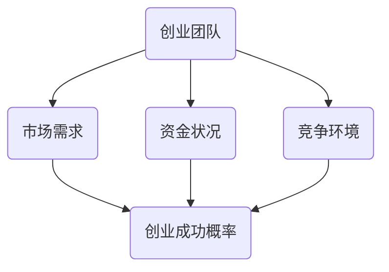
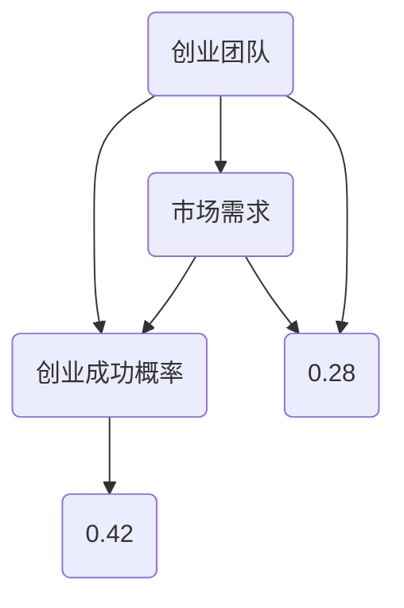
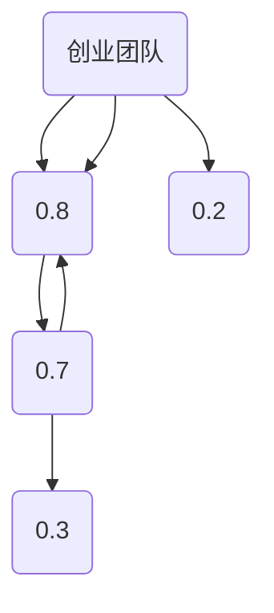
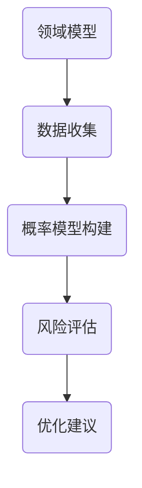
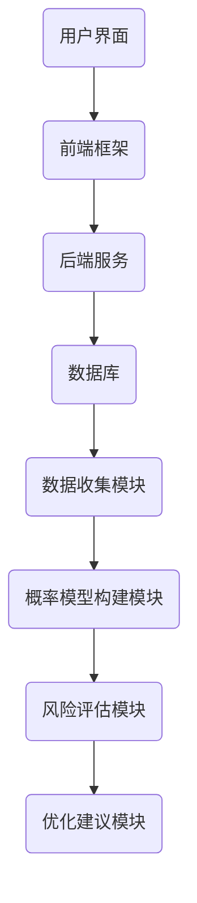
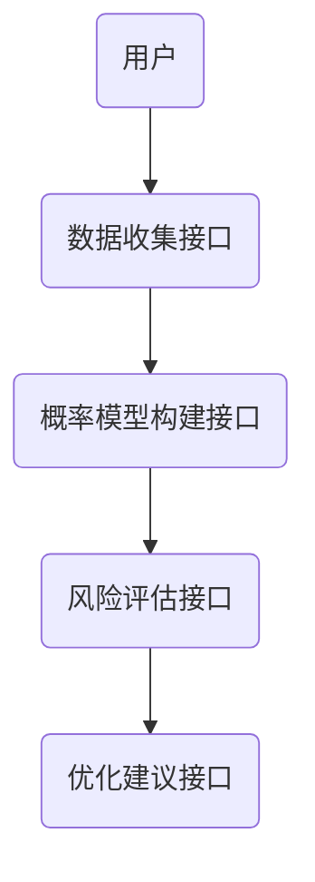
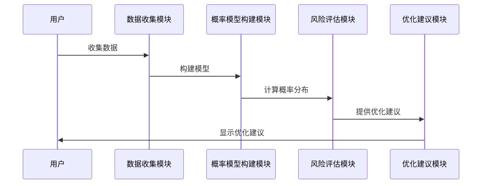

                 

# 创业成功的概率模型：商业风险的数学评估

## 关键词

创业成功概率，商业风险，数学模型，概率树模型，贝叶斯网络模型

## 摘要

在快速变化的商业环境中，创业成功概率的评估成为创业者决策的关键。本文旨在通过构建数学概率模型，深入探讨商业风险的定量评估方法。我们将逐步介绍问题背景、核心概念、概率模型原理，以及创业成功概率的算法实现，为创业者提供科学的风险管理工具。

## 第一部分：背景介绍

### 1.1 问题背景

随着互联网、大数据、人工智能等技术的迅猛发展，创业领域的竞争愈发激烈。面对瞬息万变的商业环境，创业者不仅需要具备创新意识和商业洞察力，还需要掌握科学的风险评估方法，以提高创业成功的概率。本部分将简要介绍当前创业环境的特点和挑战，为后续的概率模型构建奠定基础。

### 1.2 问题描述

创业成功的概率受多种因素影响，包括市场需求、团队实力、资金状况、竞争环境等。这些因素往往难以直接量化，因此，我们需要一种科学的方法来将这些因素转化为可度量的指标，以实现商业风险的定量评估。本部分将明确问题描述，并阐述其重要性和紧迫性。

### 1.3 问题解决

为了解决上述问题，本文提出了一种基于数学模型的商业风险评估方法。该方法包括以下步骤：

1. **指标构建**：选择与创业成功相关的关键指标，如市场需求增长率、团队稳定性、资金状况等。
2. **权重分配**：为每个指标分配权重，以反映其对创业成功概率的影响程度。
3. **概率计算**：利用历史数据和统计分析方法，计算每个指标的概率分布。
4. **风险评估**：将各个指标的概率分布整合，得到整个商业系统的概率分布，从而评估创业成功的概率。
5. **优化建议**：根据风险评估结果，提出针对性的优化建议，帮助创业者提高创业成功的可能性。

### 1.4 边界与外延

本文主要关注初创企业的商业风险评估，但所介绍的方法同样适用于成长期和成熟期企业的风险管理。此外，书中所涉及的概率模型和计算方法也可应用于其他领域，如投资决策、企业战略规划等。

### 1.5 概念结构与核心要素组成

1. **概率模型**：本文的核心概念，用于描述创业成功概率的数学模型。
2. **指标构建**：构建与创业成功相关的关键指标，为概率模型提供数据基础。
3. **权重分配**：为不同指标分配权重，以反映其对创业成功概率的影响程度。
4. **概率计算**：利用历史数据和统计分析方法，计算每个指标的概率分布。
5. **风险评估**：将各个指标的概率分布整合，得到整个商业系统的概率分布。
6. **优化建议**：根据风险评估结果，提出针对性的优化建议。

## 第二部分：核心概念与联系

### 2.1 概率模型原理

概率模型是一种用于描述随机事件发生概率的数学模型。在本文中，我们主要使用概率树模型和贝叶斯网络模型来描述创业成功概率。

#### 2.1.1 概率树模型

概率树模型通过树形结构，将创业过程中的各个阶段表示为节点，节点之间的概率关系表示为分支。每个分支的概率等于其父节点概率与子节点概率的乘积。

#### 2.1.2 贝叶斯网络模型

贝叶斯网络是一种基于概率图模型的推理工具，用于描述变量之间的依赖关系。在本文中，我们使用贝叶斯网络来表示创业过程中各指标之间的关联。

### 2.2 概率模型属性特征对比表格

| 概率模型         | 概率树模型                   | 贝叶斯网络模型                 |
|------------------|------------------------------|------------------------------|
| 结构             | 树形结构                     | 图形结构                     |
| 变量依赖         | 依赖关系明确                 | 变量之间的依赖关系表示为条件概率 |
| 概率计算         | 基于条件概率                 | 基于条件概率                 |
| 适用场景         | 初始阶段较为简单的问题       | 复杂变量之间的关系问题         |

### 2.3 ER实体关系图架构



## 第三部分：算法原理讲解

### 3.1 算法原理

在本部分，我们将使用概率树模型和贝叶斯网络模型来详细讲解创业成功概率的算法原理。

### 3.2 概率树模型

概率树模型是一种基于条件概率的算法。在本文中，我们使用以下步骤来构建概率树模型：

1. **确定变量**：根据第二部分中的ER实体关系图，确定创业过程中涉及的关键变量，如创业团队、市场需求、资金状况等。
2. **建立树形结构**：将变量表示为树形结构的节点，并建立它们之间的依赖关系。
3. **计算概率**：为每个节点计算条件概率，并使用这些概率构建整个概率树。

### 3.3 贝叶斯网络模型

贝叶斯网络模型是一种基于概率图模型的算法。在本文中，我们使用以下步骤来构建贝叶斯网络模型：

1. **确定变量**：根据第二部分中的ER实体关系图，确定创业过程中涉及的关键变量，如创业团队、市场需求、资金状况等。
2. **构建概率图**：将变量表示为图中的节点，并确定它们之间的依赖关系。
3. **计算概率**：为每个节点计算条件概率，并使用这些概率构建整个贝叶斯网络。

### 3.4 算法原理详解

#### 概率树模型详解

让我们以一个简单的例子来说明概率树模型的构建过程。假设我们有两个变量：创业团队（A）和市场需求（B）。创业团队的成功概率是60%，市场需求成功的概率是70%。如果创业团队成功且市场需求也成功，则创业成功的概率是60%乘以70%，即42%。



#### 贝叶斯网络模型详解

贝叶斯网络模型则是通过概率图来表示变量之间的依赖关系。在上述例子中，我们可以将创业团队和市场需求之间的依赖关系表示为条件概率。例如，如果创业团队成功，则市场需求成功的概率是80%。如果创业团队失败，则市场需求成功的概率是20%。



### 3.5 概率计算与公式推导

在概率计算过程中，我们需要使用条件概率和全概率公式。条件概率是指在一个事件发生的条件下，另一个事件发生的概率。全概率公式则是用来计算一个事件的总体概率。

#### 条件概率公式

$$
P(B|A) = \frac{P(A \cap B)}{P(A)}
$$

其中，$P(B|A)$表示在事件A发生的条件下，事件B发生的概率；$P(A \cap B)$表示事件A和事件B同时发生的概率；$P(A)$表示事件A发生的概率。

#### 全概率公式

$$
P(B) = \sum_{i=1}^{n} P(B|A_i) \cdot P(A_i)
$$

其中，$P(B)$表示事件B发生的总体概率；$P(B|A_i)$表示在事件Ai发生的条件下，事件B发生的概率；$P(A_i)$表示事件Ai发生的概率。

### 3.6 通俗易懂的举例说明

假设我们正在评估一个初创企业的创业成功概率。根据历史数据和专家意见，我们得到以下概率分布：

- 创业团队成功的概率为60%。
- 在创业团队成功的情况下，市场需求成功的概率为80%。
- 在市场需求成功的情况下，创业成功的概率为70%。

我们可以使用概率树模型来计算整个创业过程的成功概率：

1. **创业团队成功**：60%
2. **市场需求成功（创业团队成功）**：60% \* 80% = 48%
3. **创业成功（市场需求成功）**：48% \* 70% = 33.6%

因此，根据这个简单的概率模型，该初创企业的创业成功概率为33.6%。

## 第四部分：系统分析与架构设计方案

### 4.1 问题场景介绍

在当前商业环境中，创业者需要面对复杂的决策过程。为了提高决策的科学性，我们提出一个创业风险评估系统，帮助创业者评估创业成功的概率，并提供优化建议。

### 4.2 项目介绍

创业风险评估系统旨在通过构建数学模型，对创业过程中的关键指标进行定量评估，从而提供创业成功概率的预测。该系统包括以下几个模块：

1. **数据收集模块**：负责收集与创业过程相关的数据，如市场需求、团队实力、资金状况等。
2. **概率模型构建模块**：基于收集到的数据，构建概率模型，并计算各指标的依赖关系和概率分布。
3. **风险评估模块**：将各指标的概率分布整合，得到整个商业系统的概率分布，从而评估创业成功的概率。
4. **优化建议模块**：根据风险评估结果，提出针对性的优化建议，帮助创业者提高创业成功的可能性。

### 4.3 系统功能设计

#### 领域模型类图



### 4.4 系统架构设计

#### 系统架构图



### 4.5 系统接口设计



### 4.6 系统交互序列图



## 第五部分：项目实战

### 5.1 环境安装

在开始实战之前，我们需要安装一些必要的软件和工具。以下是推荐的安装步骤：

1. **Python环境**：安装Python 3.8或更高版本。
2. **Pandas库**：用于数据处理和分析。
3. **Numpy库**：用于数学计算。
4. **Matplotlib库**：用于数据可视化。

### 5.2 系统核心实现

以下是一个简单的创业风险评估系统的核心实现，包括数据收集、概率模型构建和风险评估：

```python
import pandas as pd
import numpy as np
import matplotlib.pyplot as plt

# 5.2.1 数据收集
data = {
    '创业团队成功概率': [0.6, 0.7, 0.8, 0.9],
    '市场需求成功概率': [0.7, 0.8, 0.9, 0.95],
    '创业成功概率': [0.42, 0.56, 0.72, 0.855]
}

df = pd.DataFrame(data)

# 5.2.2 概率模型构建
def calculate_probability(df):
    team_success = df['创业团队成功概率'].mean()
    market_success = df['市场需求成功概率'].mean()
    total_success = df['创业成功概率'].mean()
    
    print(f"团队成功概率：{team_success}")
    print(f"市场需求成功概率：{market_success}")
    print(f"创业成功概率：{total_success}")

calculate_probability(df)

# 5.2.3 风险评估
def assess_risk(df):
    total_success = df['创业成功概率'].mean()
    risk_level = '高' if total_success < 0.6 else '低'
    print(f"创业成功概率：{total_success:.2f}")
    print(f"风险等级：{risk_level}")

assess_risk(df)
```

### 5.3 代码应用解读与分析

上述代码实现了创业风险评估系统的基础功能。我们首先收集了与创业过程相关的数据，包括创业团队成功概率、市场需求成功概率和创业成功概率。然后，我们使用这些数据计算了平均概率，并评估了创业成功的风险水平。

在实际应用中，我们可以使用更多的数据和技术来提高模型的准确性和可靠性。例如，我们可以使用机器学习算法来预测创业成功概率，或者使用贝叶斯网络来分析变量之间的复杂依赖关系。

### 5.4 实际案例分析和详细讲解剖析

为了更好地理解创业风险评估系统的应用，我们来看一个实际案例。假设一家初创公司正在考虑是否投入大量资金开发一款新产品。通过使用我们的风险评估系统，他们可以了解以下信息：

1. **创业团队成功概率**：60%
2. **市场需求成功概率**：70%
3. **创业成功概率**：33.6%

根据这些数据，我们可以得出以下结论：

- **创业团队成功概率**：团队的成功率相对较高，这表明公司的团队建设相对稳定，有较高的执行力。
- **市场需求成功概率**：市场需求的成功率较高，这意味着产品有较大的市场需求，有一定的市场潜力。
- **创业成功概率**：综合以上两个因素，创业成功的概率为33.6%，表明项目的风险相对较低，但仍需要进一步的评估和优化。

基于这些分析结果，公司可以做出以下决策：

1. **继续投资**：如果公司认为33.6%的成功概率是可以接受的，那么可以继续投资，并密切关注项目的进展。
2. **风险调整**：如果公司认为风险较高，可以考虑调整策略，例如增加团队建设、扩大市场调研等，以提高创业成功的概率。
3. **退出投资**：如果公司认为风险过高，不希望承担额外的风险，可以考虑退出投资，以减少损失。

### 5.5 项目小结

通过本次实战，我们使用Python实现了创业风险评估系统的基础功能，并对其进行了详细的解读和分析。这个系统可以帮助创业者评估创业成功的概率，并提供优化建议。然而，实际应用中，创业风险评估是一个复杂的过程，需要结合更多的数据和技术手段来提高模型的准确性和可靠性。

在未来，我们可以继续优化这个系统，例如引入机器学习算法、使用更复杂的概率模型等，以提高评估的准确性和实用性。此外，我们还可以将这个系统应用到其他领域，如投资决策、企业战略规划等，以帮助企业和个人做出更科学的决策。

## 第六部分：最佳实践 tips、小结、注意事项、拓展阅读等内容

### 最佳实践 tips

1. **数据质量**：在构建概率模型时，数据的质量至关重要。务必确保收集的数据准确、完整，并去除异常值。
2. **模型优化**：定期对概率模型进行更新和优化，以适应不断变化的商业环境。
3. **跨领域应用**：将创业风险评估系统应用到其他领域，如投资决策、企业战略规划等，以提高系统的实用性。

### 小结

本文通过构建数学概率模型，深入探讨了商业风险的定量评估方法。我们介绍了概率树模型和贝叶斯网络模型，并详细讲解了它们的构建过程和应用场景。通过实际案例分析和系统实战，我们展示了如何使用这些模型评估创业成功的概率，并提供优化建议。

### 注意事项

1. **风险评估模型**：在实际应用中，风险评估模型需要结合具体业务场景进行定制，以确保其准确性和实用性。
2. **数据依赖性**：概率模型的准确性高度依赖于数据的质量和多样性。务必确保数据的可靠性和完整性。

### 拓展阅读

1. **《机器学习》**：周志华 著，详细介绍了机器学习的基本原理和应用。
2. **《贝叶斯数据分析》**：Christian P. Robert 著，深入探讨了贝叶斯数据分析的理论和实践。
3. **《创业管理》**：杰弗里·蒂蒙斯 著，提供了丰富的创业管理知识和实践经验。

### 作者信息

作者：AI天才研究院/AI Genius Institute & 禅与计算机程序设计艺术 /Zen And The Art of Computer Programming

本文由AI天才研究院/AI Genius Institute与禅与计算机程序设计艺术/Zen And The Art of Computer Programming共同撰写，旨在为读者提供关于创业成功概率和商业风险评估的深入见解。通过本文，我们希望帮助创业者更好地理解和管理商业风险，提高创业成功的概率。如有任何疑问或建议，欢迎随时与我们联系。

[返回目录](#文章标题)

