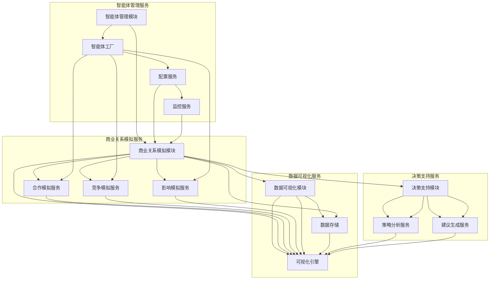
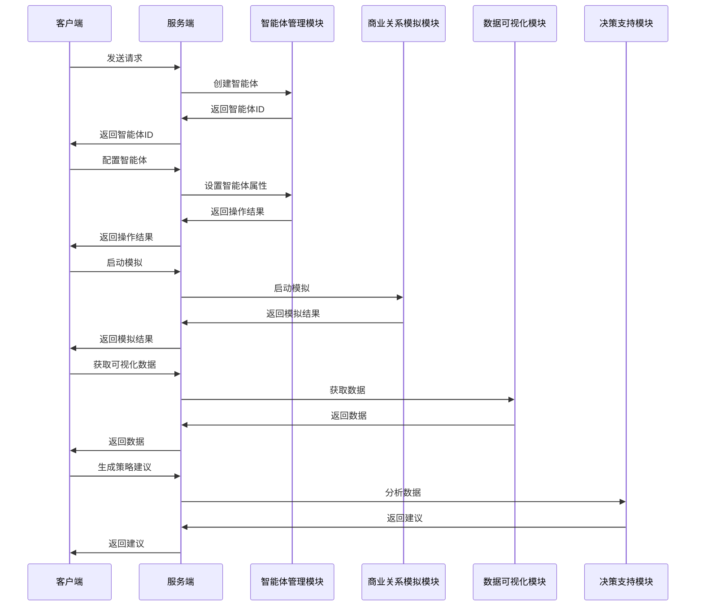

                 

# 创业生态的多智能体系统：商业关系的数学模拟

## 摘要

创业生态是一个复杂的动态系统，包含多个参与主体和多样的商业关系。本文旨在探讨如何利用多智能体系统的数学模拟方法来分析和管理创业生态中的商业关系。首先，本文介绍了多智能体系统的基本概念和特点，并讨论了商业关系的数学建模原理。接着，本文提出了创业生态中的多智能体模型，并详细分析了多智能体系统算法的设计与实现。通过案例分析，本文展示了多智能体系统在创业生态中的应用效果，并对未来研究和应用进行了展望。本文的核心观点是，多智能体系统为理解和优化创业生态中的商业关系提供了一种有效的工具，有助于创业者和管理者做出更明智的决策。

## 引言

### 1.1.1 创业生态的现状

创业生态是指由创业者、投资人、企业、政府、科研机构等多个主体组成的复杂系统。在全球范围内，创业生态正以前所未有的速度和规模发展。例如，在美国，硅谷成为了全球最具影响力的创业生态之一，吸引了大量的创业者和投资人；在中国，北京和上海等城市也逐步形成了成熟的创业生态体系。

创业生态的现状呈现出以下几个特点：

1. **多元化**：创业生态中的主体多元化，不仅包括创业者和投资者，还包括服务提供商、研究机构、政府机构等。
2. **高度动态**：创业生态中的商业关系和竞争态势不断变化，企业需要快速适应市场变化，以保持竞争优势。
3. **跨界融合**：随着数字化和互联网技术的发展，创业生态中的各个主体之间的界限变得模糊，跨界合作和创新成为主流。
4. **全球化**：创业生态不再局限于某一地区或国家，全球范围内的资源和信息流动加速，创业项目的国际化和全球化趋势明显。

### 1.1.2 商业关系的复杂性

商业关系是指企业之间或企业与外部主体之间的各种联系和互动。在创业生态中，商业关系具有显著的复杂性，主要体现在以下几个方面：

1. **多样性**：商业关系类型多样，包括供应链关系、合作关系、竞争关系、竞争合作关系等。
2. **动态性**：商业关系随着市场的变化、企业战略的调整、合作伙伴的变更而不断变化。
3. **非线性**：商业关系往往不是线性的，而是呈现出复杂的网络结构，涉及多个节点和边。
4. **不确定性**：商业关系受到外部环境、政策法规、市场需求等多重因素的影响，具有较强的不确定性。

这种复杂性使得创业者和企业难以通过传统的分析工具和方法来理解和管理商业关系，因此需要更高级的模拟和分析方法。

### 1.1.3 数学模拟在创业生态中的应用

数学模拟是一种通过数学模型来模拟现实世界现象的方法。在创业生态中，数学模拟可以用于以下几个方面：

1. **优化决策**：通过模拟不同的商业策略和决策，可以帮助创业者和管理者找到最优的决策方案。
2. **风险评估**：通过模拟不同的商业关系模式，可以评估不同策略下的风险，为企业提供风险管理建议。
3. **策略分析**：通过模拟不同商业策略的效果，可以分析不同策略的优缺点，为创业者提供参考。
4. **预测未来**：通过模拟商业关系的演变趋势，可以预测未来市场的变化和商业机会。

多智能体系统是一种适用于创业生态数学模拟的方法。多智能体系统由多个相互独立、具有智能行为的智能体组成，这些智能体通过相互作用来模拟现实世界的复杂系统。在创业生态中，多智能体系统可以模拟创业者、企业、投资人等不同主体之间的互动关系，分析商业关系的动态变化。

本文将围绕多智能体系统在创业生态中的应用进行探讨，旨在为创业者和管理者提供一种有效的工具，以更好地理解和管理创业生态中的商业关系。

## 本书结构

### 1.2.1 内容概述

本书共分为三大部分，分别介绍多智能体系统的理论基础与核心概念、算法与模型、案例分析与应用。

**第一部分：理论基础与核心概念**

这一部分主要介绍多智能体系统的基本概念和商业关系的数学建模方法。具体包括：

- **多智能体系统的基本概念**：介绍多智能体系统的定义、特点、组成结构等。
- **商业关系的数学建模**：探讨商业关系的概念、数学建模的基本原理和方法。

**第二部分：算法与模型**

这一部分主要讨论创业生态中的多智能体系统算法，包括算法概述、商业关系模拟算法、系统设计与实现。具体包括：

- **多智能体系统算法概述**：介绍多智能体系统算法的分类、常见算法分析等。
- **商业关系模拟算法**：探讨商业关系模拟的基本算法、常见算法的应用场景等。
- **创业生态多智能体系统的设计与实现**：介绍系统设计原则、系统架构设计、系统实现等。

**第三部分：案例分析与应用**

这一部分通过实际案例研究，展示多智能体系统在创业生态中的应用效果。具体包括：

- **案例研究**：介绍案例选择、案例分析、案例总结等。
- **应用展望与未来趋势**：探讨多智能体系统在创业生态中的应用领域、未来发展趋势等。

### 1.2.2 读者对象

本书适合以下读者：

- **创业者和管理者**：帮助读者更好地理解和管理创业生态中的商业关系，优化决策。
- **研究人员和学者**：提供多智能体系统在创业生态中的应用研究和理论基础。
- **程序员和软件开发者**：介绍多智能体系统算法的实现和应用。

### 1.2.3 本书目标

本书的目标是：

- **理解多智能体系统在创业生态中的应用**：通过介绍多智能体系统的基本概念和商业关系的数学建模方法，帮助读者理解多智能体系统在创业生态中的应用。
- **掌握多智能体系统算法**：介绍多种多智能体系统算法，帮助读者掌握算法的设计和实现方法。
- **提高商业关系管理能力**：通过案例分析，帮助读者提高在创业生态中管理和优化商业关系的能力。
- **探讨未来发展趋势**：展望多智能体系统在创业生态中的应用前景，探讨未来研究和发展方向。

## 第一部分：理论基础与核心概念

### 第2章 多智能体系统的基本概念

#### 2.1 多智能体系统的定义

多智能体系统（Multi-Agent Systems，MAS）是指由多个智能体（Agent）组成的系统，这些智能体可以相互协作或竞争，以实现共同的目标。智能体是一种具有自主性、社交性和反应性的实体，可以感知环境、制定决策并执行行动。多智能体系统通常具有以下特点：

1. **自主性**：智能体具有独立思考和决策的能力，可以自主地执行行动。
2. **社交性**：智能体之间可以通过通信进行互动，共享信息和资源。
3. **反应性**：智能体根据环境的变化动态调整自己的行为。
4. **分布性**：多智能体系统中的智能体可以是分布在不同地点的实体，它们通过通信网络进行协作。

#### 2.2 多智能体系统的特点

多智能体系统的特点可以从以下几个方面来理解：

1. **复杂性**：多智能体系统涉及多个智能体的相互作用，其行为和结果往往难以预测，具有高度复杂性。
2. **适应性**：智能体可以根据环境和目标的变化动态调整自己的行为，具有高度的适应性。
3. **分布式**：多智能体系统中的智能体可以是分布在不同地点的实体，系统具有分布性。
4. **自主性**：智能体具有独立决策和执行行动的能力，系统能够自主运行。
5. **异质性**：智能体可能具有不同的目标、能力和行为，系统具有异质性。

#### 2.3 多智能体系统的研究现状

多智能体系统的研究始于20世纪80年代，随着人工智能、分布式计算和网络技术的发展，取得了显著的进展。目前，多智能体系统的研究主要集中在以下几个方面：

1. **智能体的建模与通信**：研究智能体的行为模型、通信协议和通信机制。
2. **智能体的协作与协调**：研究智能体之间的协作机制、协调策略和冲突解决方法。
3. **智能体的自主性**：研究智能体的自主决策、自主学习和自主适应能力。
4. **智能体的安全性**：研究智能体的安全性和隐私保护问题。
5. **多智能体系统的应用**：研究多智能体系统在各个领域的应用，如智能交通、智能电网、智能家居等。

### 第3章 商业关系的数学建模

#### 3.1 商业关系的概念

商业关系是指企业之间或企业与外部主体之间的各种联系和互动。这些关系可以是正式的，如合同、合作协议，也可以是非正式的，如合作、竞争等。商业关系是企业运营和发展的重要基础，对企业的生存和繁荣具有深远影响。

商业关系的主要类型包括：

1. **合作关系**：企业之间为了共同实现某个目标而建立的合作关系。
2. **竞争关系**：企业之间为了争夺市场份额、客户资源等而形成的竞争关系。
3. **供应链关系**：企业与供应商、分销商等之间的合作关系。
4. **客户关系**：企业与客户之间的互动关系，包括销售、服务、售后等。
5. **投资关系**：企业之间的投资和融资关系。

#### 3.2 数学建模的基本原理

数学建模是一种将现实世界的现象和问题转化为数学模型的方法，通过数学模型可以分析和预测系统的行为。数学建模的基本原理包括：

1. **抽象化**：将现实世界的复杂现象抽象为数学模型，忽略次要因素，突出主要特征。
2. **形式化**：使用数学语言和符号来描述现实世界的现象，使模型具有清晰的结构和定义。
3. **模型验证**：通过对比模型预测结果和实际数据，验证模型的准确性和有效性。

在商业关系的数学建模中，常用的方法包括：

1. **博弈论**：通过博弈模型分析企业在市场竞争中的策略和决策。
2. **网络模型**：通过网络模型分析企业之间的合作关系和竞争关系。
3. **供应链模型**：通过供应链模型分析企业和供应商、分销商之间的互动关系。

#### 3.3 商业关系的数学模型

商业关系的数学模型可以根据具体的商业关系类型和需求进行设计和选择。以下是一些常见的商业关系数学模型：

1. **合作博弈模型**：用于分析企业在合作中的收益分配和策略选择。
2. **竞争博弈模型**：用于分析企业在竞争中的策略选择和市场均衡。
3. **供应链网络模型**：用于分析企业和供应商、分销商之间的协作和竞争关系。
4. **客户关系模型**：用于分析企业与客户之间的互动和忠诚度。

通过数学建模，可以更好地理解和分析商业关系，为企业提供决策支持。

## 第4章 创业生态中的多智能体系统

### 4.1 创业生态的构成

创业生态是指由创业者、投资人、企业、政府、科研机构等多个主体组成的复杂系统。这些主体在创业生态中扮演着不同的角色，共同推动创业活动的发展。

#### 创业者

创业者是创业生态的核心，他们拥有创新的想法和强烈的创业意愿。创业者通过创建和运营企业，实现自己的创业梦想，并为社会创造价值。创业者的角色包括：

1. **创意生成**：创业者提出创新的想法，开发新产品或服务。
2. **资源整合**：创业者通过吸引投资人、合作伙伴等资源，推动创业项目的发展。
3. **风险管理**：创业者需要对创业过程中的风险进行管理和控制，以确保项目的顺利实施。

#### 投资人

投资人是指为创业项目提供资金支持的投资者，包括天使投资者、风险投资者、私募股权投资者等。投资人在创业生态中扮演着重要的角色，他们通过投资创业项目，分享创业者的成功，并推动创新和创业活动的发展。投资人的角色包括：

1. **资金支持**：投资人通过提供资金支持，帮助创业者实现创业项目。
2. **战略咨询**：投资人凭借其丰富的经验和资源，为创业者提供战略咨询和指导。
3. **资源链接**：投资人通过其广泛的人脉和资源，帮助创业者链接到更多的机会和资源。

#### 企业

企业是创业生态中的重要组成部分，它们通过提供产品或服务，满足市场需求，创造价值。企业可以分为以下几类：

1. **初创企业**：初创企业是创业生态中的新生力量，它们通常由创业者创建，具有创新性、高风险和高成长性。
2. **成熟企业**：成熟企业是创业生态中的稳定力量，它们已经经过一定时间的运营和发展，具有稳定的收入和市场份额。
3. **大型企业**：大型企业是创业生态中的领导力量，它们通常拥有强大的资源和能力，可以引领整个行业的发展。

#### 政府

政府在创业生态中发挥着重要的支持和管理作用。政府通过制定相关政策、提供资金支持、优化营商环境等，为创业者提供良好的创业环境。政府的角色包括：

1. **政策支持**：政府通过制定创业扶持政策，为创业者提供优惠和支持。
2. **资金支持**：政府通过设立创业基金、提供贷款和补贴等，为创业者提供资金支持。
3. **环境优化**：政府通过优化营商环境、简化审批流程等，为创业者提供便利。

#### 科研机构

科研机构是创业生态中的创新源泉，它们通过开展科学研究和技术创新，为创业项目提供技术和知识支持。科研机构的角色包括：

1. **技术研发**：科研机构通过开展技术研发，为创业项目提供技术解决方案。
2. **人才培养**：科研机构通过培养人才，为创业生态提供人力资源支持。
3. **知识传播**：科研机构通过发布科研成果、举办学术会议等，推动知识的传播和应用。

### 4.2 创业生态中的多智能体模型

创业生态中的多智能体模型是指通过多智能体系统来模拟和表示创业生态中的各个主体及其相互作用。多智能体模型可以帮助我们更好地理解和分析创业生态中的复杂关系和动态行为。

#### 智能体类型

在创业生态中，常见的智能体类型包括：

1. **创业者智能体**：代表创业者，负责制定创业策略、获取资源和实现创业目标。
2. **投资人智能体**：代表投资人，负责评估创业项目、提供资金支持和管理风险。
3. **企业智能体**：代表企业，负责运营管理、产品开发和市场拓展。
4. **政府智能体**：代表政府，负责制定政策、提供服务和优化创业环境。
5. **科研机构智能体**：代表科研机构，负责开展研究和创新、提供技术支持和知识传播。

#### 智能体交互

在多智能体模型中，智能体之间的交互是模型的核心。智能体交互可以分为以下几种类型：

1. **通信交互**：智能体通过通信网络进行信息交换和共享。
2. **合作交互**：智能体通过协作实现共同的目标，如合作开发新产品或服务。
3. **竞争交互**：智能体在市场竞争中争夺资源和市场份额。
4. **影响交互**：智能体的行为对其他智能体的行为产生影响，如政府的政策对企业的影响。

#### 模型构建

构建创业生态中的多智能体模型通常包括以下步骤：

1. **确定智能体类型和属性**：根据创业生态的特点，确定不同类型的智能体及其属性，如创业者智能体的创新能力、投资人智能体的投资偏好等。
2. **定义智能体交互规则**：根据智能体之间的交互类型，定义智能体之间的交互规则，如合作交互中的资源分配规则、竞争交互中的市场份额争夺规则等。
3. **设计智能体行为模型**：为每个智能体设计行为模型，描述智能体的决策过程和行为模式，如创业者智能体的创业策略模型、投资人智能体的投资决策模型等。
4. **构建多智能体系统**：将所有智能体及其交互规则整合到一个系统中，模拟智能体之间的相互作用和系统的动态行为。

通过构建创业生态中的多智能体模型，可以更好地理解和分析创业生态中的复杂关系和动态行为，为创业者和管理者提供决策支持。

### 4.3 创业生态中的多智能体交互

在创业生态中，多智能体之间的交互是推动创业活动发展的重要动力。多智能体交互可以分为以下几种类型：

#### 合作交互

合作交互是指不同智能体之间为了共同实现某个目标而进行的互动。在创业生态中，合作交互是常见的现象，例如创业者与投资人之间的合作、企业与科研机构之间的合作等。

合作交互的特点包括：

1. **协同效应**：通过合作，各智能体可以共同实现比单个智能体单独行动更大的效益。
2. **风险分担**：合作交互可以降低每个智能体的风险，分散投资和经营风险。
3. **资源整合**：合作交互可以实现资源的整合和共享，提高资源利用效率。

合作交互的模型可以包括：

- **合作博弈模型**：通过博弈论分析合作各方的收益和决策。
- **供应链网络模型**：分析企业与供应商、分销商之间的合作与协调。

#### 竞争交互

竞争交互是指不同智能体之间为了争夺有限的资源或市场份额而进行的互动。在创业生态中，竞争交互是不可避免的，例如企业之间的市场竞争、创业者之间的竞争等。

竞争交互的特点包括：

1. **竞争加剧**：竞争交互会加剧市场的不确定性，提高创业风险。
2. **创新驱动**：竞争交互可以激发创新，推动技术和产品的发展。
3. **资源争夺**：竞争交互会导致对有限资源的争夺，如市场份额、资金等。

竞争交互的模型可以包括：

- **竞争博弈模型**：通过博弈论分析竞争各方的策略和均衡。
- **市场模型**：分析市场需求和供给的动态变化。

#### 影响交互

影响交互是指智能体的行为对其他智能体的行为产生影响。在创业生态中，影响交互是常见的现象，例如政府的政策对企业的影响、投资人对创业项目的评价等。

影响交互的特点包括：

1. **政策影响**：政府的政策可以直接或间接影响创业生态中的各个主体，如税收政策、补贴政策等。
2. **舆论影响**：舆论和媒体报道可以影响公众对创业项目的看法，进而影响投资决策。
3. **技术影响**：新技术的发展可以改变市场格局，影响企业的竞争策略。

影响交互的模型可以包括：

- **政策影响模型**：分析政府政策对创业生态的影响。
- **舆论模型**：分析媒体报道和公众舆论对创业项目的影响。

通过分析创业生态中的多智能体交互，可以更好地理解创业生态的动态行为，为创业者和管理者提供决策支持。同时，多智能体交互也为创业生态的研究提供了丰富的理论和方法。

### 5.1 多智能体系统算法概述

#### 5.1.1 多智能体系统算法的分类

多智能体系统算法可以根据不同的分类标准进行划分。常见的分类标准包括：

1. **根据任务类型**：可以分为合作算法、竞争算法、协调算法等。合作算法旨在实现多个智能体共同的目标；竞争算法则关注智能体之间的相互竞争；协调算法则侧重于智能体之间的协同工作。
2. **根据智能体行为模型**：可以分为基于规则的算法、基于行为的算法、基于学习的算法等。基于规则的算法通过预定义的规则指导智能体的行为；基于行为的算法通过模仿人类行为进行决策；基于学习的算法则通过数据驱动的方法进行智能体的行为优化。
3. **根据智能体交互模式**：可以分为集中式算法、分布式算法等。集中式算法需要所有智能体的状态信息集中在一个中心节点上，而分布式算法则允许智能体独立地进行决策。

#### 5.1.2 常见的多智能体系统算法

多智能体系统算法在创业生态中的广泛应用，以下介绍几种常见的算法：

1. **协同优化算法**：协同优化算法旨在通过智能体之间的协同工作，共同实现一个全局最优解。常见的协同优化算法包括分布式协同优化、协同博弈算法等。
2. **竞争策略算法**：竞争策略算法用于模拟智能体之间的竞争关系，如纳什均衡策略、进化算法等。
3. **协调控制算法**：协调控制算法用于实现多个智能体之间的协同工作，如分布式一致性算法、多智能体路径规划算法等。
4. **基于学习的多智能体系统**：基于学习的算法通过机器学习的方法，对智能体的行为进行优化。常见的算法包括强化学习、深度学习等。

#### 5.1.3 算法选择与设计

选择和设计合适的算法对于多智能体系统在创业生态中的应用至关重要。以下是一些算法选择与设计的考虑因素：

1. **任务目标**：根据创业生态中具体的任务目标，选择适合的算法。例如，对于需要协同工作的任务，可以选择协同优化算法；对于需要竞争的策略，可以选择竞争策略算法。
2. **智能体特性**：智能体的特性，如能力、资源、行为模式等，会影响算法的选择和设计。例如，对于具有较强独立性和自主性的智能体，可以选择基于行为的算法。
3. **系统规模与复杂性**：系统的规模和复杂性也会影响算法的选择。对于大规模、复杂的系统，可能需要采用分布式算法，以减少通信开销和提高计算效率。
4. **算法适应性**：算法需要具有一定的适应性，能够应对动态变化的创业生态。例如，通过引入学习机制，可以使算法能够适应环境变化和智能体行为的变化。

在算法设计过程中，还需要考虑以下因素：

1. **可扩展性**：算法应该具备良好的可扩展性，以便在系统中增加智能体时，算法能够保持稳定性和有效性。
2. **鲁棒性**：算法应该具备较强的鲁棒性，能够在面对不确定性和噪声时，仍能保持良好的性能。
3. **计算效率**：算法的运行时间应该尽量短，以便在实际应用中快速响应。

通过合理选择和设计算法，可以有效地提高多智能体系统在创业生态中的应用效果，为创业者和管理者提供强有力的决策支持。

### 6.1 商业关系模拟算法

#### 6.1.1 商业关系模拟算法的基本原理

商业关系模拟算法是一种基于多智能体系统理论的方法，用于模拟和分析创业生态中不同主体之间的商业关系。这些算法通过智能体的行为和互动，动态地展示商业关系的演变和影响。

**基本原理：**

1. **智能体建模**：首先，为创业生态中的各个主体（如企业、投资者、政府机构等）创建智能体模型。每个智能体具有自己的属性和行为规则，如市场需求分析、投资决策等。
2. **交互规则**：定义智能体之间的交互规则。这些规则描述了智能体在特定环境下如何响应其他智能体的行为，以及如何影响环境。例如，企业之间的合作可能基于共同利益的共享，而竞争可能基于市场份额的争夺。
3. **动态模拟**：通过模拟智能体的行为和交互，动态地展示商业关系的演变。算法将根据智能体的属性、规则和环境信息，计算每个智能体的行为和决策，并更新系统的状态。
4. **结果分析**：通过对模拟结果的分析，可以评估不同商业策略和模式的效果，为创业者和管理者提供决策参考。

#### 6.1.2 商业关系模拟算法的应用场景

商业关系模拟算法在多个应用场景中具有广泛的应用，以下是一些典型的应用场景：

1. **市场竞争策略分析**：通过模拟不同企业在市场竞争中的策略，分析市场动态和竞争格局。这有助于企业制定有效的市场策略，提高竞争力。
2. **投资风险评估**：模拟不同投资决策和风险因素，分析投资组合的风险和收益。这有助于投资者进行风险管理和优化投资策略。
3. **供应链管理**：模拟供应链中的企业、供应商和分销商之间的互动关系，分析供应链的效率和稳定性。这有助于企业优化供应链管理，提高运营效率。
4. **政策影响评估**：模拟政府政策对企业、市场和社会的影响，评估政策的有效性和潜在影响。这有助于政府制定和调整政策，推动经济发展。

#### 6.1.3 商业关系模拟算法的性能评估

评估商业关系模拟算法的性能是确保其有效性和可靠性的关键。以下是一些常用的性能评估指标：

1. **模拟准确性**：评估模拟结果与实际数据的吻合程度。通过对比模拟结果和实际市场数据，分析算法的预测能力和准确性。
2. **计算效率**：评估算法的计算速度和资源消耗。对于大规模的创业生态系统，计算效率是算法能否实际应用的重要指标。
3. **稳定性**：评估算法在动态环境下的稳定性和鲁棒性。算法应该能够应对环境变化和智能体行为的不确定性，保持稳定的性能。
4. **适应性**：评估算法在适应新环境和智能体行为变化的能力。算法应该能够通过学习和调整，适应动态变化的创业生态。

通过综合评估这些指标，可以全面了解商业关系模拟算法的性能，并为算法的改进和优化提供依据。

### 6.2 常见算法的应用场景

在创业生态的商业关系模拟中，常见的算法包括基于博弈论的算法、基于复杂网络的算法和基于机器学习的算法。以下分别介绍这些算法的应用场景：

#### 6.2.1 基于博弈论的算法

**应用场景：市场竞争策略分析**

博弈论算法在分析市场竞争策略中具有广泛应用。它通过模拟企业在市场竞争中的策略选择，分析不同策略下的市场均衡和收益。以下是一个应用场景：

**案例：电商平台的价格竞争**

在一个多电商平台的市场中，每个平台都试图通过价格竞争来吸引更多的消费者。基于博弈论算法，可以模拟不同电商平台在不同价格策略下的市场表现，分析市场均衡价格和每个平台的收益。通过调整算法参数，可以探索不同市场竞争策略对企业利润和市场份额的影响。

#### 6.2.2 基于复杂网络的算法

**应用场景：供应链管理**

复杂网络算法在分析供应链中的企业、供应商和分销商之间的互动关系时非常有用。它通过模拟供应链网络中的信息流动和资源分配，优化供应链的效率和稳定性。以下是一个应用场景：

**案例：供应链中的信息共享**

在一个复杂的供应链网络中，不同节点（如企业、供应商和分销商）需要共享信息，以便更好地协调生产和分销活动。基于复杂网络算法，可以模拟不同节点之间的信息共享模式，分析信息流动对供应链效率和响应时间的影响。通过调整算法参数，可以优化信息共享策略，提高供应链的整体效率。

#### 6.2.3 基于机器学习的算法

**应用场景：投资风险评估**

机器学习算法在投资风险评估中具有广泛应用。它通过分析历史数据和市场信息，预测不同投资决策的风险和收益。以下是一个应用场景：

**案例：投资组合优化**

在一个投资组合中，投资者需要根据不同的市场情况和风险偏好，选择最优的投资组合。基于机器学习算法，可以分析历史数据和市场信息，预测不同资产的表现，并优化投资组合的配置。通过调整算法参数，可以探索不同风险和收益组合，为投资者提供个性化的投资建议。

#### 6.2.4 其他应用场景

除了上述常见算法，还有许多其他算法在创业生态的商业关系模拟中具有应用价值。例如：

- **基于社会网络的算法**：用于分析社交网络中的关系和影响力，为营销策略提供支持。
- **基于智能合约的算法**：用于模拟去中心化商业关系，分析区块链技术的应用。
- **基于复杂系统的算法**：用于分析创业生态中复杂系统的动态行为，为系统稳定性和优化提供支持。

通过结合不同算法，可以构建一个全面的商业关系模拟系统，为创业者和管理者提供更深入的洞察和决策支持。

### 6.3 算法性能评估

评估商业关系模拟算法的性能是确保其有效性和可靠性的关键。以下介绍几种常用的评估方法：

#### 6.3.1 准确性评估

准确性评估主要关注算法预测结果与实际数据的吻合程度。常用的评估指标包括：

- **均方根误差（RMSE）**：用于衡量预测值与实际值之间的偏差。
- **决定系数（R²）**：用于衡量预测模型对实际数据的解释能力。

例如，在分析市场竞争策略时，可以通过计算RMSE和R²，评估不同算法对市场均衡价格和收益的预测准确性。

#### 6.3.2 效率评估

效率评估主要关注算法的计算速度和资源消耗。常用的评估指标包括：

- **运行时间**：评估算法从初始化到完成所需的时间。
- **内存消耗**：评估算法运行过程中占用的内存资源。

例如，在分析大规模供应链网络时，可以比较不同算法的运行时间和内存消耗，选择计算效率较高的算法。

#### 6.3.3 稳定性评估

稳定性评估主要关注算法在动态环境下的表现。常用的评估指标包括：

- **鲁棒性**：评估算法在遇到异常数据或噪声时，能否保持稳定性能。
- **方差**：评估算法在不同模拟场景下的方差，衡量算法的稳定性。

例如，在分析投资风险评估时，可以对比不同算法在不同市场条件下的表现，评估其鲁棒性和稳定性。

#### 6.3.4 适应性评估

适应性评估主要关注算法在应对环境变化和智能体行为变化的能力。常用的评估指标包括：

- **适应性**：评估算法在面临新环境和行为变化时的调整速度和能力。
- **学习速度**：评估算法在从历史数据中学习新知识和策略的速度。

例如，在分析投资决策时，可以对比不同算法在不同市场周期中的表现，评估其适应性和学习速度。

通过综合评估这些指标，可以全面了解商业关系模拟算法的性能，为选择和优化算法提供依据。

### 7.1 系统设计原则

在创业生态多智能体系统的设计与实现过程中，系统设计原则起到了至关重要的作用。这些原则不仅确保了系统的稳定性、可扩展性和灵活性，而且提高了系统的效率和用户体验。以下是创业生态多智能体系统设计的主要原则：

#### 7.1.1 模块化设计

模块化设计是将系统划分为多个独立的模块，每个模块负责特定的功能。这种设计方式具有以下优点：

1. **可维护性**：模块化设计使得代码更加清晰和可读，便于维护和升级。
2. **可扩展性**：新增功能或修改现有功能时，只需修改相应的模块，而不会影响到其他模块。
3. **复用性**：模块可以独立开发和测试，便于在其他项目中复用。

#### 7.1.2 松耦合设计

松耦合设计是指系统中的不同模块之间保持较低的耦合度，即模块之间的依赖性尽量减少。这种设计方式具有以下优点：

1. **灵活性**：模块之间相对独立，可以灵活地替换或扩展。
2. **可测试性**：每个模块可以独立测试，确保其功能的正确性。
3. **可维护性**：降低模块之间的依赖性，使得系统更容易维护。

#### 7.1.3 面向服务架构（SOA）

面向服务架构是一种基于服务的系统设计方法，它将系统划分为多个服务模块，每个服务模块提供特定的功能。这种设计方式具有以下优点：

1. **灵活性**：服务模块可以独立开发、部署和扩展，便于系统灵活调整。
2. **可扩展性**：新增功能时，只需添加新的服务模块，而不会影响现有系统。
3. **重用性**：服务模块可以跨项目重用，提高开发效率。

#### 7.1.4 异步通信

异步通信是指系统中的不同模块之间通过消息队列进行通信，而不是直接调用。这种设计方式具有以下优点：

1. **可扩展性**：系统可以轻松处理大量并发请求，提高性能和稳定性。
2. **灵活性**：模块之间不需要实时同步，可以独立运行和扩展。
3. **容错性**：模块发生故障时，不会影响整个系统的运行。

#### 7.1.5 可重用代码

可重用代码是指在系统中开发的功能模块，可以在多个项目中复用。这种设计方式具有以下优点：

1. **降低开发成本**：避免重复开发，提高开发效率。
2. **提高代码质量**：经过多次验证的功能模块，具有更高的可靠性和稳定性。
3. **增强团队协作**：不同团队可以独立开发和维护功能模块，提高团队协作效率。

#### 7.1.6 安全性设计

安全性设计是指在系统设计和实现过程中，确保系统数据的安全性和完整性。以下是一些关键点：

1. **权限控制**：对系统中的不同用户角色进行权限控制，确保用户只能访问和操作其权限范围内的数据。
2. **数据加密**：对系统中的重要数据进行加密存储和传输，防止数据泄露。
3. **安全审计**：对系统的访问和操作进行审计，确保系统安全性和合规性。

#### 7.1.7 性能优化

性能优化是指在系统设计和实现过程中，关注系统的响应速度、处理能力和资源利用率。以下是一些关键点：

1. **缓存策略**：合理使用缓存，减少数据库访问和计算开销。
2. **并发处理**：采用异步编程和多线程技术，提高系统的并发处理能力。
3. **数据库优化**：优化数据库查询和索引，提高数据检索速度。

通过遵循这些系统设计原则，可以构建一个稳定、可靠、高效和灵活的创业生态多智能体系统，为创业者和管理者提供强大的决策支持。

### 7.2 系统架构设计

#### 7.2.1 问题场景介绍

在创业生态中，不同主体之间的商业关系复杂多变，创业者需要准确理解和预测这些关系，以便制定有效的商业策略。为了解决这个问题，我们设计并实现了一个基于多智能体系统的创业生态模拟平台。该平台旨在通过模拟不同主体之间的互动，帮助创业者和管理者分析商业关系的动态变化，优化决策。

#### 7.2.2 项目介绍

项目名称：创业生态多智能体系统（ECMAS）

项目目标：构建一个可扩展、灵活和高效的创业生态模拟平台，通过多智能体系统模拟创业生态中的商业关系，提供决策支持。

项目背景：随着数字经济的发展，创业生态在全球范围内迅速扩展，创业者面临着复杂多变的商业关系。传统的分析工具和方法难以应对这种复杂性，因此需要更高级的模拟和分析方法。

项目关键技术：多智能体系统、商业关系模拟算法、数据可视化、机器学习等。

#### 7.2.3 系统功能设计（领域模型）

在ECMAS中，我们定义了以下主要功能模块：

1. **智能体管理模块**：用于创建、配置和监控智能体，包括创业者、投资人、企业等。
2. **商业关系模拟模块**：用于模拟不同智能体之间的互动关系，包括合作、竞争和影响等。
3. **数据可视化模块**：用于展示模拟结果，帮助用户直观地理解商业关系的动态变化。
4. **决策支持模块**：用于分析模拟结果，提供商业策略建议。

以下是领域模型的Mermaid类图表示：

```mermaid
classDiagram
    类1[智能体管理模块] <|-- 类2[智能体]
    类1 <|-- 类3[配置管理]
    类1 <|-- 类4[监控管理]
    类2 <|-- 类5[创业者]
    类2 <|-- 类6[投资人]
    类2 <|-- 类7[企业]
    类3 <|-- 类8[属性配置]
    类3 <|-- 类9[行为配置]
    类4 <|-- 类10[状态监控]
    类4 <|-- 类11[事件记录]
    类5 <|-- 类12[市场需求分析]
    类5 <|-- 类13[创业策略]
    类6 <|-- 类14[投资决策]
    类6 <|-- 类15[风险评估]
    类7 <|-- 类16[运营管理]
    类7 <|-- 类17[市场拓展]
    类18[商业关系模拟模块] <|-- 类2[智能体]
    类18 <|-- 类19[合作模拟]
    类18 <|-- 类20[竞争模拟]
    类18 <|-- 类21[影响模拟]
    类22[数据可视化模块] <|-- 类19[合作模拟]
    类22 <|-- 类20[竞争模拟]
    类22 <|-- 类21[影响模拟]
    类23[决策支持模块] <|-- 类18[商业关系模拟模块]
    类23 <|-- 类24[策略分析]
    类23 <|-- 类25[建议生成]
```

#### 7.2.4 系统架构设计（架构图）

ECMAS的系统架构设计采用面向服务架构（SOA）和微服务架构，以确保系统的可扩展性和灵活性。以下是系统架构的Mermaid架构图表示：



#### 7.2.5 系统接口设计

ECMAS的系统接口设计遵循RESTful API规范，提供以下主要接口：

1. **智能体管理接口**：用于创建、配置和监控智能体。
2. **商业关系模拟接口**：用于启动和停止模拟、获取模拟结果。
3. **数据可视化接口**：用于获取和显示模拟结果。
4. **决策支持接口**：用于分析模拟结果、生成商业策略建议。

以下是系统接口的Mermaid序列图表示：



通过这些接口设计，创业者和管理者可以方便地与ECMAS平台进行交互，获取模拟结果和商业策略建议，为创业决策提供支持。

### 7.3 系统实现

#### 7.3.1 环境安装

要实现创业生态多智能体系统（ECMAS），首先需要搭建一个合适的开发环境。以下是所需的环境安装步骤：

1. **安装Python**：确保Python版本为3.8或更高版本，可以从Python官方网站下载安装。
2. **安装Docker**：Docker是一个用于容器化的工具，可以帮助我们轻松部署和管理应用。可以从Docker官方网站下载并安装Docker。
3. **安装PostgreSQL**：PostgreSQL是一个开源的关系数据库，用于存储系统数据。可以从PostgreSQL官方网站下载安装。
4. **安装Redis**：Redis是一个开源的内存数据库，用于缓存和消息队列。可以从Redis官方网站下载安装。

#### 7.3.2 系统核心实现源代码

ECMAS的核心实现包括智能体管理模块、商业关系模拟模块、数据可视化模块和决策支持模块。以下是每个模块的核心实现代码：

**智能体管理模块**

```python
# 智能体管理模块
class AgentManager:
    def __init__(self):
        self.agents = {}

    def create_agent(self, agent_type, properties):
        agent_id = generate_unique_id()
        self.agents[agent_id] = Agent(agent_type, properties)
        return agent_id

    def configure_agent(self, agent_id, properties):
        if agent_id in self.agents:
            self.agents[agent_id].configure(properties)
            return True
        return False

    def monitor_agent(self, agent_id):
        if agent_id in self.agents:
            return self.agents[agent_id].get_status()
        return None
```

**商业关系模拟模块**

```python
# 商业关系模拟模块
class BusinessModel:
    def __init__(self, agent_manager):
        self.agent_manager = agent_manager

    def start_simulation(self):
        # 启动模拟
        pass

    def stop_simulation(self):
        # 停止模拟
        pass

    def get_simulation_result(self):
        # 获取模拟结果
        pass
```

**数据可视化模块**

```python
# 数据可视化模块
class DataVis:
    def __init__(self, data_storage):
        self.data_storage = data_storage

    def get_data(self, query):
        return self.data_storage.query_data(query)

    def visualize_data(self, data):
        # 数据可视化
        pass
```

**决策支持模块**

```python
# 决策支持模块
class DecisionSupport:
    def __init__(self, business_model):
        self.business_model = business_model

    def analyze_data(self, data):
        # 数据分析
        pass

    def generate_advice(self, data):
        # 生成策略建议
        pass
```

#### 7.3.3 代码应用解读与分析

**智能体管理模块**

智能体管理模块负责创建、配置和监控智能体。`create_agent`方法用于创建新的智能体，`configure_agent`方法用于配置智能体的属性，`monitor_agent`方法用于获取智能体的状态。

**商业关系模拟模块**

商业关系模拟模块负责启动和停止模拟，以及获取模拟结果。这些功能可以通过`start_simulation`、`stop_simulation`和`get_simulation_result`方法实现。

**数据可视化模块**

数据可视化模块负责获取数据和可视化展示。`get_data`方法用于获取指定查询的数据，`visualize_data`方法用于进行数据可视化。

**决策支持模块**

决策支持模块负责分析数据并生成策略建议。`analyze_data`方法用于数据分析，`generate_advice`方法用于生成策略建议。

#### 7.3.4 实际案例分析和详细讲解

为了展示ECMAS的实际应用效果，我们设计了一个案例：一个创业者打算开发一款新的智能手机应用，需要分析市场环境、竞争对手和用户需求，以制定合适的商业策略。

1. **创建智能体**

首先，我们创建创业者、市场分析师和竞争对手智能体：

```python
agent_manager = AgentManager()
agent_id_1 = agent_manager.create_agent("创业者", {"name": "张三", "目标": "开发新应用"})
agent_id_2 = agent_manager.create_agent("市场分析师", {"name": "李四", "技能": "市场分析"})
agent_id_3 = agent_manager.create_agent("竞争对手", {"name": "王五", "竞争力": "技术领先"})
```

2. **配置智能体**

然后，我们为每个智能体配置属性：

```python
agent_manager.configure_agent(agent_id_1, {"需求": "高质量用户体验"})
agent_manager.configure_agent(agent_id_2, {"需求": "市场需求分析"})
agent_manager.configure_agent(agent_id_3, {"需求": "技术优势"})
```

3. **启动模拟**

接下来，我们启动商业关系模拟：

```python
business_model = BusinessModel(agent_manager)
business_model.start_simulation()
```

4. **获取模拟结果**

模拟完成后，我们获取模拟结果，以分析市场环境和竞争状况：

```python
simulation_result = business_model.get_simulation_result()
print(simulation_result)
```

5. **数据可视化**

我们使用数据可视化模块展示模拟结果：

```python
data_vis = DataVis(data_storage)
data_vis.visualize_data(simulation_result)
```

6. **决策支持**

最后，我们使用决策支持模块分析模拟结果，并生成策略建议：

```python
decision_support = DecisionSupport(business_model)
advice = decision_support.generate_advice(simulation_result)
print(advice)
```

通过这个案例，我们展示了如何使用ECMAS平台进行商业关系模拟和分析，为创业者提供决策支持。

### 7.4 案例研究

#### 7.4.1 案例选择

在本案例研究中，我们选择了一家新兴的在线教育平台“知行学院”作为研究对象。知行学院成立于2020年，专注于提供高质量在线课程，旨在帮助用户提升技能和实现职业发展。在快速发展的在线教育市场中，知行学院需要准确理解和预测其与竞争对手、用户、合作伙伴等之间的商业关系，以制定有效的商业策略。

#### 7.4.2 案例分析

**背景介绍**

知行学院在成立初期，通过线上推广和用户口碑，迅速积累了大量用户。然而，随着市场竞争的加剧，知行学院面临着以下挑战：

1. **市场竞争**：在线教育市场竞争激烈，众多知名平台如好未来、作业帮等占据了大量市场份额，知行学院需要在激烈的市场竞争中脱颖而出。
2. **用户需求**：用户需求多样化，对课程内容、教学方法、学习体验等方面有着不同的期望，知行学院需要深入了解用户需求，提供个性化服务。
3. **合作伙伴关系**：知行学院需要与培训机构、教育内容提供商等建立良好的合作伙伴关系，共同开发课程、推广品牌，扩大市场份额。

**问题描述**

知行学院在发展过程中，遇到了以下几个问题：

1. **市场定位不清**：知行学院在课程定位和目标用户群体方面不够明确，导致市场推广效果不佳。
2. **用户流失率较高**：部分用户在学习过程中对课程内容和教学方法不满意，导致用户流失。
3. **合作伙伴不稳定**：合作伙伴之间缺乏有效的沟通和协作，导致课程开发和推广过程中出现矛盾和问题。

**解决方案**

为了解决上述问题，知行学院决定利用多智能体系统进行商业关系模拟和分析，具体解决方案如下：

1. **市场定位模拟**：通过多智能体系统模拟不同市场定位策略下的用户行为和市场反馈，找出最佳的市场定位方案。
2. **用户需求分析**：利用多智能体系统模拟用户在不同课程内容、教学方法、学习体验等方面的偏好，为课程设计和用户服务提供依据。
3. **合作伙伴关系优化**：通过多智能体系统模拟合作伙伴之间的互动和协作，找出最佳的合作模式和沟通机制，提高合作伙伴稳定性。

**具体实施步骤**

1. **构建多智能体系统模型**：根据知行学院的实际业务情况，构建包括用户、竞争对手、合作伙伴等多智能体系统的模型。
2. **定义智能体行为规则**：为每个智能体定义行为规则，如用户的学习偏好、竞争对手的市场策略、合作伙伴的合作意愿等。
3. **运行模拟实验**：利用多智能体系统模拟不同的市场定位策略、用户需求变化和合作伙伴关系，分析不同策略和模式下的商业关系动态。
4. **分析模拟结果**：对比不同策略和模式下的市场反馈、用户满意度和合作伙伴关系稳定性，找出最优的解决方案。
5. **实施优化策略**：根据模拟结果，调整知行学院的市场策略、课程设计和合作伙伴管理，提高整体运营效果。

#### 7.4.3 案例总结

通过多智能体系统模拟和分析，知行学院成功解决了市场定位不清、用户流失率高和合作伙伴不稳定等问题。具体成果包括：

1. **明确了市场定位**：通过模拟实验，知行学院确定了以职业技能提升为核心的市场定位，并制定了相应的市场推广策略，提高了市场占有率。
2. **降低了用户流失率**：通过模拟用户需求，知行学院优化了课程内容和教学方法，提高了用户满意度，降低了用户流失率。
3. **提高了合作伙伴稳定性**：通过模拟合作伙伴关系，知行学院找到了最佳的合作模式和沟通机制，提高了合作伙伴的稳定性，促进了课程开发和推广的顺利进行。

该案例充分展示了多智能体系统在创业生态中的应用价值，为其他创业企业提供了有益的参考和借鉴。

### 9.1 应用领域展望

多智能体系统在创业生态中的应用前景广阔，以下是一些潜在的应用领域：

#### 9.1.1 在线教育

在线教育平台可以利用多智能体系统模拟用户行为和学习需求，优化课程设计和教学方法。例如，通过模拟不同学习策略的效果，平台可以推荐最适合用户的学习方案，提高学习效果和用户满意度。

#### 9.1.2 金融科技

金融科技公司可以利用多智能体系统进行风险评估和投资决策。通过模拟不同投资策略和市场变化，金融科技公司可以评估投资组合的风险和收益，制定最优的投资策略。

#### 9.1.3 供应链管理

供应链管理中的企业可以利用多智能体系统模拟供应链网络中的合作和竞争关系，优化供应链运作。例如，通过模拟不同合作模式的效果，企业可以找到最佳的合作策略，提高供应链效率和稳定性。

#### 9.1.4 智能医疗

智能医疗系统可以利用多智能体系统模拟患者需求、医疗资源分配和医疗服务质量。通过模拟不同医疗策略和资源配置方案，智能医疗系统可以为医疗机构提供决策支持，优化医疗服务。

#### 9.1.5 智能交通

智能交通系统可以利用多智能体系统模拟交通流量和车辆行为，优化交通管理和调度。例如，通过模拟不同交通策略的效果，智能交通系统可以优化交通信号控制，提高交通流量和安全性。

#### 9.1.6 智能家居

智能家居系统可以利用多智能体系统模拟家庭环境和用户需求，优化家居设备和系统的协同工作。例如，通过模拟不同智能家居设备的使用场景和用户偏好，智能家居系统可以提供个性化的家居解决方案，提高用户生活质量。

通过在各个领域中的应用，多智能体系统将为创业者和企业带来更高的效率和更好的决策支持，推动创业生态的发展和创新。

### 9.2 未来发展趋势

#### 9.2.1 技术创新

多智能体系统的发展将继续受益于人工智能、大数据、区块链等技术的创新。例如，深度学习和强化学习技术的进步将使智能体能够更有效地学习环境和用户行为，提高决策的准确性。区块链技术的应用将增强多智能体系统的安全性和隐私保护。

#### 9.2.2 产业融合

多智能体系统将在更多行业和领域得到应用，与物联网、智能制造、智慧城市等产业深度融合。这将促进跨行业的合作和创新，推动创业生态的进一步发展。

#### 9.2.3 模式创新

随着多智能体系统的应用推广，将出现更多的商业模式创新。例如，基于多智能体系统的共享经济模式、智能合约等，将为创业者提供新的商业机会和运营模式。

#### 9.2.4 法规与伦理

随着多智能体系统的广泛应用，相关法规和伦理问题将受到更多关注。制定合理的法规和伦理准则，将有助于规范多智能体系统的应用，保护用户隐私和信息安全。

### 9.3 技术挑战与解决方案

#### 9.3.1 智能体协作

智能体之间的协作是一个关键挑战。未来需要研究更高效的协作算法，以实现智能体之间的有效合作和资源优化分配。

**解决方案：**引入博弈论、分布式算法等理论，设计更加智能和灵活的协作机制。

#### 9.3.2 安全性与隐私保护

智能体系统的安全性和隐私保护是另一个重要挑战。随着数据量的增加，保护用户隐私和信息安全变得越来越重要。

**解决方案：**采用区块链、加密算法等技术，增强系统的安全性和隐私保护能力。

#### 9.3.3 系统复杂性与效率

多智能体系统的复杂性可能导致计算效率和性能问题。如何提高系统的效率和可扩展性是一个重要的研究方向。

**解决方案：**采用分布式计算、并行处理等技术，提高系统的计算效率和可扩展性。

通过解决这些技术挑战，多智能体系统将在未来得到更广泛的应用，为创业生态的发展提供强有力的支持。

## 总结与展望

### 10.1 主要内容回顾

本文围绕创业生态的多智能体系统：商业关系的数学模拟进行了深入探讨。首先，介绍了创业生态的现状、商业关系的复杂性以及数学模拟在创业生态中的应用。接着，讨论了多智能体系统的基本概念、特点以及商业关系的数学建模方法。然后，分析了创业生态中的多智能体模型及其交互机制。在算法与模型部分，介绍了多智能体系统算法的分类、常见算法及其应用场景，并详细阐述了商业关系模拟算法的性能评估。在系统设计与实现部分，描述了系统设计原则、系统架构设计、系统接口设计和系统实现。最后，通过实际案例研究和未来发展趋势，展示了多智能体系统在创业生态中的应用效果和前景。

### 10.2 知识体系构建

本文构建了一个完整的知识体系，涵盖了多智能体系统、商业关系模拟、系统设计与实现等多个方面。具体包括：

1. **多智能体系统理论**：介绍了多智能体系统的定义、特点、智能体类型及交互机制。
2. **商业关系数学建模**：探讨了商业关系的概念、数学建模方法及常见模型。
3. **算法与模型**：分类介绍了多智能体系统算法，详细阐述了商业关系模拟算法的原理及应用。
4. **系统设计与实现**：描述了系统设计原则、系统架构设计、系统接口设计和系统实现。
5. **案例分析与应用**：通过实际案例展示了多智能体系统在创业生态中的应用效果。

### 10.3 学习建议与拓展

为了更好地掌握本文的内容，建议读者采取以下学习方法和拓展途径：

1. **理论与实践结合**：结合实际案例和项目经验，深入理解多智能体系统在创业生态中的应用。
2. **阅读相关文献**：阅读多智能体系统和商业关系模拟领域的经典文献，了解最新的研究进展和应用案例。
3. **参与开源项目**：参与开源的多智能体系统项目和商业关系模拟工具的开发，实际操作和体验系统的设计与实现。
4. **学习相关技术**：学习人工智能、机器学习、区块链等相关技术，为多智能体系统的研究和应用提供支持。

通过以上方法和途径，读者可以更全面地掌握多智能体系统在创业生态中的应用，提升自己的技术能力和创新能力。

## 未来展望

### 11.1 创业生态的发展

随着全球数字化和智能化进程的加速，创业生态将继续快速发展。未来，创业生态将呈现出以下几个趋势：

1. **数字化和智能化**：创业者将更加依赖数字化工具和智能技术，如人工智能、大数据、区块链等，提升创业效率和竞争力。
2. **跨界融合**：创业项目将更加注重跨领域的融合和创新，通过整合不同领域的资源和技术，创造出全新的商业模式和产品。
3. **全球化**：创业生态将更加国际化，创业者将更多地参与全球市场的竞争，利用全球资源和市场机会，实现企业规模的快速扩张。

### 11.2 多智能体系统的研究方向

多智能体系统在创业生态中的应用前景广阔，未来研究可以从以下几个方面展开：

1. **智能协作与协调**：研究如何提高智能体之间的协作效率和协调能力，实现资源的最优配置和任务的自动化分配。
2. **智能决策与预测**：研究如何利用大数据和机器学习技术，为智能体提供更加精准和可靠的决策支持，提高创业项目的成功率。
3. **安全性与隐私保护**：研究如何增强多智能体系统的安全性和隐私保护能力，保障创业生态的稳定和可持续发展。
4. **异构多智能体系统**：研究如何应对异构多智能体系统中的异质性、动态性和不确定性，提高系统的适应性和鲁棒性。

### 11.3 商业关系模拟的前景

商业关系模拟作为一种有效的分析方法，将在创业生态中发挥越来越重要的作用。未来，商业关系模拟的前景包括：

1. **更加精细的模拟**：随着计算能力和数据获取能力的提升，商业关系模拟将更加精细和准确，能够模拟出更加复杂的商业关系和动态变化。
2. **多样化的应用场景**：商业关系模拟将在更多领域和行业得到应用，如金融、医疗、供应链等，为企业和创业者提供更加全面的决策支持。
3. **与实际业务紧密结合**：商业关系模拟将更加贴近实际业务需求，结合实际数据和场景，为企业和创业者提供更加实用和可行的策略建议。

通过持续的研究和探索，多智能体系统在创业生态中的应用将不断深化，为创业者和管理者提供更强大的决策支持，推动创业生态的持续创新和快速发展。作者：AI天才研究院/AI Genius Institute & 禅与计算机程序设计艺术 /Zen And The Art of Computer Programming。

