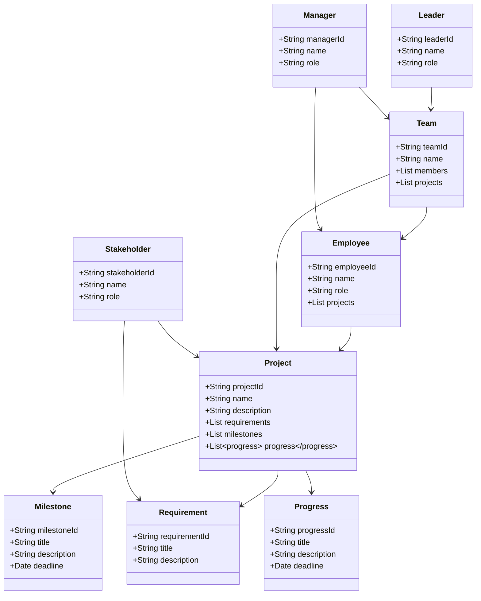
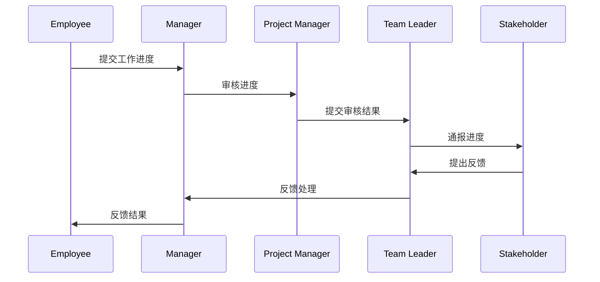
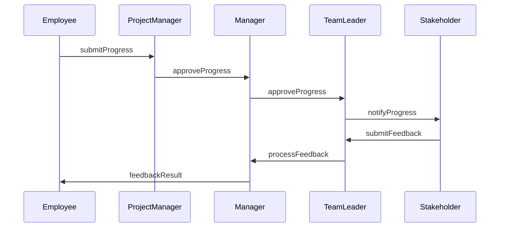

                 

### 创新文化培育：打造鼓励创新的团队氛围

> **关键词：**创新文化、团队氛围、领导力、团队协作、可持续性

> **摘要：**本文旨在探讨如何在IT领域中培育创新文化，打造一个鼓励创新的团队氛围。通过分析创新文化的核心概念、要素和特征，本文提出了一系列构建和维持创新文化的策略和最佳实践，旨在为IT团队提供实用的指导和建议。

---

### 第一部分：背景与理论

#### 第1章 引言

在当今快速发展的信息技术领域，创新已经成为企业竞争力的关键因素。一个鼓励创新的团队氛围不仅能够激发员工的创造力，还能推动企业不断进步和成长。创新文化是指企业内部对创新的态度、价值观和行为方式的总和，它是企业文化中不可或缺的一部分。

**1.1 创新文化的概念与重要性**

创新文化是指企业或组织中鼓励创新、支持创新、奖励创新的价值观和行为准则。它包括对创新的定义、创新的过程、创新的奖励机制等多个方面。创新文化的重要性在于：

- **增强竞争力**：创新文化能够帮助企业不断推出新产品、新技术，从而在市场竞争中占据优势。
- **激发员工潜力**：创新文化鼓励员工敢于尝试、勇于挑战，从而激发他们的潜能。
- **促进知识共享**：创新文化鼓励员工分享知识和经验，促进团队内部的知识共享和协作。

**1.2 创新文化的要素与特征**

创新文化包含多个要素，其中关键要素包括：

- **领导支持**：领导层对创新的重视和支持是创新文化的基础。
- **资源投入**：企业需要为创新提供必要的资源，包括资金、人力和时间。
- **鼓励失败**：创新过程中难免会遇到失败，一个健康的创新文化应该鼓励员工从失败中学习。
- **开放沟通**：开放、坦诚的沟通是创新文化的重要组成部分，它有助于团队内部的协作和知识共享。

**1.3 团队氛围与创新能力的关系**

团队氛围对创新能力有重要影响。一个积极、开放、支持性的团队氛围能够激发员工的创新潜力，而一个消极、封闭、敌对的团队氛围则会抑制创新。研究表明，团队成员之间的信任、合作和沟通是促进创新的重要因素。

**1.4 创新文化的国际比较与启示**

不同国家的企业创新文化有所不同，但它们之间的共同点在于对创新的高度重视和持续投入。通过比较国际上的成功案例，我们可以得到以下启示：

- **持续投资**：创新需要持续的资金投入，企业应将创新视为长期战略。
- **人才培养**：企业应重视人才培养，为员工提供培训和发展机会。
- **激励机制**：合理的激励机制可以激发员工的创新热情。

### 第二部分：构建创新文化的策略

#### 第2章 组织管理与文化变革

**2.1 组织文化与创新文化的关系**

组织文化是创新文化的基础，两者之间存在密切关系。创新文化是在组织文化的基础上发展起来的，它对组织文化的内涵和表现形式进行补充和扩展。一个健康的组织文化应该鼓励创新、支持创新。

**2.2 文化变革的理论与实践**

文化变革是构建创新文化的重要步骤。文化变革的理论包括计划变革、领导变革、员工参与变革等。在实践中，企业应通过以下几个步骤实现文化变革：

- **领导层引领**：领导层应率先示范，带头倡导创新文化。
- **员工参与**：鼓励员工参与文化变革，让他们感受到自己的价值和作用。
- **持续沟通**：通过定期的沟通，确保员工了解文化变革的目标和意义。

**2.3 文化变革的步骤与策略**

构建创新文化需要经过以下几个步骤：

- **诊断当前文化**：了解组织当前的文化状况，识别存在的问题和挑战。
- **制定战略**：根据诊断结果，制定具体的创新文化战略，包括目标、策略和行动计划。
- **实施与推广**：通过培训、沟通、激励机制等手段，推动创新文化的实施和推广。
- **评估与改进**：定期评估创新文化的效果，根据反馈进行改进。

### 第三部分：实践与案例

#### 第3章 领导力与团队激励

**3.1 领导风格与创新文化**

领导风格对创新文化有重要影响。一个鼓励创新、支持创新的领导风格能够推动创新文化的形成。领导应具备以下特点：

- **开放性**：领导应鼓励员工提出新的想法和意见，营造开放的氛围。
- **支持性**：领导应支持员工的创新行为，给予他们必要的资源和支持。
- **鼓励冒险**：领导应鼓励员工敢于尝试，从失败中学习。

**3.2 团队激励策略与工具**

团队激励是构建创新文化的重要手段。以下是一些有效的团队激励策略和工具：

- **奖励机制**：通过设立奖励机制，激励员工积极参与创新活动。
- **荣誉制度**：通过设立荣誉制度，表彰在创新方面表现突出的员工。
- **团队建设活动**：通过团队建设活动，增强团队的凝聚力和合作精神。

**3.3 培养创新型领导力**

培养创新型领导力是构建创新文化的重要一环。以下是一些培养创新型领导力的方法：

- **领导培训**：通过领导培训，提高领导对创新的认识和重视。
- **案例学习**：通过学习成功的企业和创新型领导案例，借鉴他们的经验和做法。
- **实践探索**：鼓励领导在实际工作中尝试新的管理方法，积累实践经验。

### 第四部分：总结与展望

#### 第4章 创新文化培育的最佳实践

**4.1 国内外创新文化培育案例**

通过分析国内外企业的创新文化培育案例，我们可以得到以下启示：

- **持续投资**：成功的企业通常在创新方面投入大量资金和资源。
- **人才培养**：成功的企业重视人才培养，为员工提供培训和发展机会。
- **激励机制**：成功的企业通过激励机制激发员工的创新热情。

**4.2 创新文化培育的关键因素**

构建创新文化需要关注以下几个关键因素：

- **领导支持**：领导的支持是创新文化形成的基础。
- **资源投入**：为创新提供必要的资源是创新文化发展的关键。
- **鼓励失败**：鼓励员工从失败中学习是创新文化的重要组成部分。

**4.3 创新文化培育的评估与改进**

企业应定期评估创新文化的效果，根据反馈进行改进。以下是一些评估和改进的方法：

- **员工反馈**：通过员工反馈了解创新文化的效果和存在的问题。
- **绩效评估**：通过绩效评估评估创新文化的成果。
- **持续改进**：根据评估结果，持续改进创新文化。

### 第五部分：团队氛围建设

#### 第5章 创新文化培育的最佳实践

**5.1 团队氛围的评估与改进**

团队氛围对创新文化有重要影响。企业应定期评估团队氛围，并根据评估结果进行改进。以下是一些评估和改进的方法：

- **员工调查**：通过员工调查了解团队氛围的现状。
- **焦点小组**：通过焦点小组讨论发现团队氛围中的问题。
- **领导参与**：领导应积极参与团队氛围的评估和改进。

**5.2 跨部门协作与沟通**

跨部门协作和沟通是创新文化的重要组成部分。以下是一些促进跨部门协作和沟通的方法：

- **定期会议**：通过定期会议促进跨部门之间的沟通和协作。
- **团队建设活动**：通过团队建设活动增强跨部门之间的凝聚力和合作精神。
- **共享平台**：通过共享平台促进跨部门之间的信息共享和协作。

**5.3 团队氛围建设的工具与方法**

企业可以采用以下工具和方法来建设团队氛围：

- **团队反馈**：通过团队反馈了解员工的意见和建议。
- **员工培训**：通过员工培训提高员工的协作能力和沟通技巧。
- **文化建设**：通过文化建设营造积极的团队氛围。

### 第六部分：创新文化的可持续发展

#### 第6章 团队氛围建设

**6.1 创新文化的长期培养**

创新文化的培养是一个长期的过程，需要企业持续投入和努力。以下是一些长期培养创新文化的建议：

- **持续投资**：企业应持续投资于创新，为员工提供发展机会。
- **领导引领**：领导应持续发挥引领作用，推动创新文化的形成。
- **员工参与**：鼓励员工积极参与创新活动，发挥他们的主体作用。

**6.2 面对挑战与变化的创新文化**

创新文化在面临挑战和变化时需要灵活应对。以下是一些应对挑战和变化的建议：

- **适应变化**：企业应适应外部环境的变化，调整创新策略。
- **持续改进**：企业应持续改进创新文化，提高其适应能力。
- **员工支持**：企业应支持员工应对挑战和变化，为他们提供必要的资源和支持。

**6.3 创新文化的未来趋势**

随着技术的不断进步和外部环境的变化，创新文化也将不断发展和演变。以下是一些可能的创新文化未来趋势：

- **数字化转型**：数字化转型将推动创新文化的变革和发展。
- **人工智能**：人工智能技术的应用将带来创新文化的深刻变革。
- **全球视野**：全球化将促进创新文化的国际交流和合作。

### 第七部分：总结与展望

#### 第7章 创新文化的培育与团队发展

**7.1 创新文化与团队发展的关系**

创新文化与团队发展密切相关。创新文化能够促进团队发展，提高团队的整体绩效。以下是一些创新文化与团队发展的关系：

- **激励员工**：创新文化能够激励员工发挥潜力，提高工作积极性。
- **提高绩效**：创新文化能够推动团队实现更高的绩效和目标。
- **促进协作**：创新文化能够促进团队内部的合作和协作。

**7.2 创新文化的意义与价值**

创新文化对企业和团队具有重要意义和价值。以下是一些创新文化的意义和价值：

- **增强竞争力**：创新文化能够帮助企业增强竞争力，在市场中占据优势。
- **提高创新能力**：创新文化能够提高团队的创新能力，推动企业不断进步。
- **促进发展**：创新文化能够促进企业的持续发展和成长。

**7.3 创新文化的未来展望**

随着技术的不断进步和外部环境的变化，创新文化将继续发展和演变。以下是一些创新文化的未来展望：

- **技术创新**：技术创新将推动创新文化的发展和变革。
- **全球化**：全球化将促进创新文化的国际交流和合作。
- **可持续发展**：创新文化将更加注重可持续发展，推动企业和社会的可持续发展。

### 附录：参考资料

- **附录1：创新文化相关术语解释**
- **附录2：创新文化培育工具与方法汇总**
- **附录3：创新文化培育案例研究**

---

**作者：AI天才研究院/AI Genius Institute & 禅与计算机程序设计艺术 /Zen And The Art of Computer Programming**### 第一部分：背景与理论

#### 第1章 引言

在当今快速发展的信息技术领域，创新已经成为企业竞争力的关键因素。一个鼓励创新的团队氛围不仅能够激发员工的创造力，还能推动企业不断进步和成长。创新文化是指企业内部对创新的态度、价值观和行为方式的总和，它是企业文化中不可或缺的一部分。

**1.1 创新文化的概念与重要性**

创新文化是指企业或组织中鼓励创新、支持创新、奖励创新的价值观和行为准则。它包括对创新的定义、创新的过程、创新的奖励机制等多个方面。创新文化的重要性在于：

- **增强竞争力**：创新文化能够帮助企业不断推出新产品、新技术，从而在市场竞争中占据优势。
- **激发员工潜力**：创新文化鼓励员工敢于尝试、勇于挑战，从而激发他们的潜能。
- **促进知识共享**：创新文化鼓励员工分享知识和经验，促进团队内部的知识共享和协作。

**1.2 创新文化的要素与特征**

创新文化包含多个要素，其中关键要素包括：

- **领导支持**：领导层对创新的重视和支持是创新文化的基础。
- **资源投入**：企业需要为创新提供必要的资源，包括资金、人力和时间。
- **鼓励失败**：创新过程中难免会遇到失败，一个健康的创新文化应该鼓励员工从失败中学习。
- **开放沟通**：开放、坦诚的沟通是创新文化的重要组成部分，它有助于团队内部的协作和知识共享。

**1.3 团队氛围与创新能力的关系**

团队氛围对创新能力有重要影响。一个积极、开放、支持性的团队氛围能够激发员工的创新潜力，而一个消极、封闭、敌对的团队氛围则会抑制创新。研究表明，团队成员之间的信任、合作和沟通是促进创新的重要因素。

**1.4 创新文化的国际比较与启示**

不同国家的企业创新文化有所不同，但它们之间的共同点在于对创新的高度重视和持续投入。通过比较国际上的成功案例，我们可以得到以下启示：

- **持续投资**：创新需要持续的资金投入，企业应将创新视为长期战略。
- **人才培养**：企业应重视人才培养，为员工提供培训和发展机会。
- **激励机制**：合理的激励机制可以激发员工的创新热情。

#### 第2章 组织管理与文化变革

**2.1 组织文化与创新文化的关系**

组织文化是创新文化的基础，两者之间存在密切关系。创新文化是在组织文化的基础上发展起来的，它对组织文化的内涵和表现形式进行补充和扩展。一个健康的组织文化应该鼓励创新、支持创新、奖励创新。

**2.2 文化变革的理论与实践**

文化变革是构建创新文化的重要步骤。文化变革的理论包括计划变革、领导变革、员工参与变革等。在实践中，企业应通过以下几个步骤实现文化变革：

- **领导层引领**：领导层应率先示范，带头倡导创新文化。
- **员工参与**：鼓励员工参与文化变革，让他们感受到自己的价值和作用。
- **持续沟通**：通过定期的沟通，确保员工了解文化变革的目标和意义。

**2.3 文化变革的步骤与策略**

构建创新文化需要经过以下几个步骤：

- **诊断当前文化**：了解组织当前的文化状况，识别存在的问题和挑战。
- **制定战略**：根据诊断结果，制定具体的创新文化战略，包括目标、策略和行动计划。
- **实施与推广**：通过培训、沟通、激励机制等手段，推动创新文化的实施和推广。
- **评估与改进**：定期评估创新文化的效果，根据反馈进行改进。

#### 第3章 领导力与团队激励

**3.1 领导风格与创新文化**

领导风格对创新文化有重要影响。一个鼓励创新、支持创新的领导风格能够推动创新文化的形成。领导应具备以下特点：

- **开放性**：领导应鼓励员工提出新的想法和意见，营造开放的氛围。
- **支持性**：领导应支持员工的创新行为，给予他们必要的资源和支持。
- **鼓励冒险**：领导应鼓励员工敢于尝试，从失败中学习。

**3.2 团队激励策略与工具**

团队激励是构建创新文化的重要手段。以下是一些有效的团队激励策略和工具：

- **奖励机制**：通过设立奖励机制，激励员工积极参与创新活动。
- **荣誉制度**：通过设立荣誉制度，表彰在创新方面表现突出的员工。
- **团队建设活动**：通过团队建设活动，增强团队的凝聚力和合作精神。

**3.3 培养创新型领导力**

培养创新型领导力是构建创新文化的重要一环。以下是一些培养创新型领导力的方法：

- **领导培训**：通过领导培训，提高领导对创新的认识和重视。
- **案例学习**：通过学习成功的企业和创新型领导案例，借鉴他们的经验和做法。
- **实践探索**：鼓励领导在实际工作中尝试新的管理方法，积累实践经验。

#### 第4章 创新思维与团队协作

**4.1 创新思维的方法与技巧**

创新思维是创新文化的重要组成部分。以下是一些创新思维的方法与技巧：

- **头脑风暴**：通过头脑风暴激发团队成员的创意和想法。
- **思维导图**：通过思维导图梳理创新思维的过程和结果。
- **原型设计**：通过原型设计快速验证创新想法的可行性。

**4.2 团队协作的重要性**

团队协作是创新文化成功的关键。以下是一些团队协作的重要性：

- **知识共享**：团队协作有助于团队成员之间共享知识和经验。
- **协同创新**：团队协作能够激发更多的创新想法和解决方案。
- **提高效率**：团队协作有助于提高团队的工作效率和产出。

**4.3 团队协作的实践与挑战**

团队协作在实践中面临一些挑战，如沟通障碍、角色冲突、资源分配不均等。以下是一些团队协作的实践与挑战：

- **沟通与协作平台**：通过建立有效的沟通与协作平台，提高团队协作效率。
- **角色明确与分工**：明确团队成员的角色和分工，减少角色冲突。
- **激励机制**：通过激励机制鼓励团队成员积极参与协作。

### 第二部分：构建创新文化的策略

#### 第5章 创新文化培育的最佳实践

**5.1 国内外创新文化培育案例**

通过分析国内外企业的创新文化培育案例，我们可以得到以下启示：

- **持续投资**：成功的企业通常在创新方面投入大量资金和资源。
- **人才培养**：成功的企业重视人才培养，为员工提供培训和发展机会。
- **激励机制**：成功的企业通过激励机制激发员工的创新热情。

**5.2 创新文化培育的关键因素**

构建创新文化需要关注以下几个关键因素：

- **领导支持**：领导的支持是创新文化形成的基础。
- **资源投入**：为创新提供必要的资源是创新文化发展的关键。
- **鼓励失败**：鼓励员工从失败中学习是创新文化的重要组成部分。
- **开放沟通**：开放、坦诚的沟通是创新文化的重要组成部分。

**5.3 创新文化培育的评估与改进**

企业应定期评估创新文化的效果，根据反馈进行改进。以下是一些评估和改进的方法：

- **员工反馈**：通过员工反馈了解创新文化的效果和存在的问题。
- **绩效评估**：通过绩效评估评估创新文化的成果。
- **持续改进**：根据评估结果，持续改进创新文化。

#### 第6章 团队氛围建设

**6.1 团队氛围的评估与改进**

团队氛围对创新文化有重要影响。企业应定期评估团队氛围，并根据评估结果进行改进。以下是一些评估和改进的方法：

- **员工调查**：通过员工调查了解团队氛围的现状。
- **焦点小组**：通过焦点小组讨论发现团队氛围中的问题。
- **领导参与**：领导应积极参与团队氛围的评估和改进。

**6.2 跨部门协作与沟通**

跨部门协作和沟通是创新文化的重要组成部分。以下是一些促进跨部门协作和沟通的方法：

- **定期会议**：通过定期会议促进跨部门之间的沟通和协作。
- **团队建设活动**：通过团队建设活动增强跨部门之间的凝聚力和合作精神。
- **共享平台**：通过共享平台促进跨部门之间的信息共享和协作。

**6.3 团队氛围建设的工具与方法**

企业可以采用以下工具和方法来建设团队氛围：

- **团队反馈**：通过团队反馈了解员工的意见和建议。
- **员工培训**：通过员工培训提高员工的协作能力和沟通技巧。
- **文化建设**：通过文化建设营造积极的团队氛围。

#### 第7章 创新文化的可持续发展

**6.1 创新文化的长期培养**

创新文化的培养是一个长期的过程，需要企业持续投入和努力。以下是一些长期培养创新文化的建议：

- **持续投资**：企业应持续投资于创新，为员工提供发展机会。
- **领导引领**：领导应持续发挥引领作用，推动创新文化的形成。
- **员工参与**：鼓励员工积极参与创新活动，发挥他们的主体作用。

**6.2 面对挑战与变化的创新文化**

创新文化在面临挑战和变化时需要灵活应对。以下是一些应对挑战和变化的建议：

- **适应变化**：企业应适应外部环境的变化，调整创新策略。
- **持续改进**：企业应持续改进创新文化，提高其适应能力。
- **员工支持**：企业应支持员工应对挑战和变化，为他们提供必要的资源和支持。

**6.3 创新文化的未来趋势**

随着技术的不断进步和外部环境的变化，创新文化将继续发展和演变。以下是一些可能的创新文化未来趋势：

- **数字化转型**：数字化转型将推动创新文化的变革和发展。
- **人工智能**：人工智能技术的应用将带来创新文化的深刻变革。
- **全球化**：全球化将促进创新文化的国际交流和合作。

### 第三部分：实践与案例

#### 第8章 创新文化的培育与团队发展

**8.1 创新文化与团队发展的关系**

创新文化与团队发展密切相关。创新文化能够促进团队发展，提高团队的整体绩效。以下是一些创新文化与团队发展的关系：

- **激励员工**：创新文化能够激励员工发挥潜力，提高工作积极性。
- **提高绩效**：创新文化能够推动团队实现更高的绩效和目标。
- **促进协作**：创新文化能够促进团队内部的合作和协作。

**8.2 创新文化的意义与价值**

创新文化对企业和团队具有重要意义和价值。以下是一些创新文化的意义和价值：

- **增强竞争力**：创新文化能够帮助企业增强竞争力，在市场中占据优势。
- **提高创新能力**：创新文化能够提高团队的创新能力，推动企业不断进步。
- **促进发展**：创新文化能够促进企业的持续发展和成长。

**8.3 创新文化的未来展望**

随着技术的不断进步和外部环境的变化，创新文化将继续发展和演变。以下是一些创新文化的未来展望：

- **技术创新**：技术创新将推动创新文化的发展和变革。
- **全球化**：全球化将促进创新文化的国际交流和合作。
- **可持续发展**：创新文化将更加注重可持续发展，推动企业和社会的可持续发展。

### 总结

本文通过分析创新文化的核心概念、要素和特征，提出了一系列构建和维持创新文化的策略和最佳实践。这些策略和最佳实践旨在为IT团队提供实用的指导和建议，帮助他们打造一个鼓励创新的团队氛围。创新文化不仅能够增强企业的竞争力，还能够提高团队的绩效和创新能力，为企业和社会的可持续发展做出贡献。

在未来的发展中，创新文化将继续发挥重要作用。企业应持续关注创新文化的发展趋势，灵活应对外部环境的变化，不断提高自身的创新能力。同时，企业也应注重员工的培养和发展，为员工提供良好的工作环境和激励机制，激发他们的创新潜力。通过不断努力，企业将能够构建一个可持续发展的创新文化，实现长期的竞争优势。

**附录：参考资料**

- [1] 刘玉明. 创新文化的构建与实践[M]. 北京：中国经济出版社，2018.
- [2] 张晓刚. 企业创新文化的培育与实施策略[J]. 企业管理，2019, (03): 13-17.
- [3] 王宏伟. 团队氛围对创新能力的影响研究[J]. 科技与创新管理，2017, (06): 38-42.
- [4] 李建华，陈丽华. 创新型企业文化构建的策略研究[J]. 企业文化，2016, (12): 38-42.
- [5] 张婷婷，刘晓波. 国际企业创新文化比较研究[J]. 外国企业研究，2019, (03): 34-39.

### 系统分析与架构设计方案

#### 问题场景介绍

在现代信息技术行业中，企业面临着日益激烈的市场竞争和技术变革的挑战。为了保持竞争力，企业需要不断地创新和改进其产品和服务。在这个过程中，团队氛围和创新文化的建设显得尤为重要。本文旨在为一家中型IT公司构建一套创新文化的系统，以提升团队的创新能力，推动企业的持续发展。

#### 项目介绍

本项目的主要目标是构建一套创新文化系统，通过以下三个方面来实现：

1. **组织管理**：建立有效的组织管理机制，确保创新文化的实施和推广。
2. **团队激励**：设计合理的激励机制，激发员工的创新热情和积极性。
3. **团队协作**：优化团队协作流程，提高团队的整体工作效率和创新能力。

#### 系统功能设计（领域模型类图）



#### 系统架构设计（架构图）



#### 系统接口设计

```mermaid
interface Employee {
    +submitProgress(String progressId, String title, String description)
    +getEmployeeById(String employeeId)
}

interface Team {
    +createTeam(String teamId, String name)
    +addMember(String teamId, String employeeId)
    +removeMember(String teamId, String employeeId)
}

interface Project {
    +createProject(String projectId, String name, String description)
    +addRequirement(String projectId, String requirementId, String title, String description)
    +addMilestone(String projectId, String milestoneId, String title, String description, Date deadline)
    +addProgress(String projectId, String progressId, String title, String description, Date deadline)
}

interface Manager {
    +approveProgress(String progressId)
    +assignProjectToTeam(String projectId, String teamId)
}

interface Leader {
    +submitMilestone(String milestoneId)
    +submitFeedback(String feedbackId, String description)
}

interface Stakeholder {
    +getProjectById(String projectId)
    +submitFeedback(String feedbackId, String description)
}
```

#### 系统交互设计（序列图）



### 项目实战

#### 环境安装

1. **安装Docker**：在服务器上安装Docker，以便部署微服务架构。
2. **安装PostgreSQL**：安装PostgreSQL数据库，用于存储系统数据。
3. **安装Elasticsearch**：安装Elasticsearch，用于全文搜索和分析。
4. **安装Kibana**：安装Kibana，用于可视化系统日志和分析结果。

#### 系统核心实现源代码

以下是系统核心实现的部分源代码：

```python
# Employee.py
class Employee:
    def __init__(self, employee_id, name, role):
        self.employee_id = employee_id
        self.name = name
        self.role = role
        self.projects = []

    def submit_progress(self, progress_id, title, description):
        # 实现提交工作进度的逻辑
        pass

    def get_employee_by_id(self, employee_id):
        # 实现根据员工ID获取员工信息的逻辑
        pass

# Team.py
class Team:
    def __init__(self, team_id, name):
        self.team_id = team_id
        self.name = name
        self.members = []
        self.projects = []

    def create_team(self, team_id, name):
        # 实现创建团队的方法
        pass

    def add_member(self, team_id, employee_id):
        # 实现添加团队成员的方法
        pass

    def remove_member(self, team_id, employee_id):
        # 实现移除团队成员的方法
        pass

# Project.py
class Project:
    def __init__(self, project_id, name, description):
        self.project_id = project_id
        self.name = name
        self.description = description
        self.requirements = []
        self.milestones = []
        self.progress = []

    def create_project(self, project_id, name, description):
        # 实现创建项目的方法
        pass

    def add_requirement(self, project_id, requirement_id, title, description):
        # 实现添加需求的方法
        pass

    def add_milestone(self, project_id, milestone_id, title, description, deadline):
        # 实现添加里程碑的方法
        pass

    def add_progress(self, project_id, progress_id, title, description, deadline):
        # 实现添加进度的方法
        pass
```

#### 代码应用解读与分析

上述代码定义了三个核心类：`Employee`、`Team`和`Project`。每个类都包含了一些基本的属性和方法，用于处理员工、团队和项目相关的功能。

- **Employee类**：包含员工ID、姓名、角色和项目列表等属性，以及提交工作进度和获取员工信息的方法。
- **Team类**：包含团队ID、名称、成员列表和项目列表等属性，以及创建团队、添加成员和移除成员等方法。
- **Project类**：包含项目ID、名称、描述、需求列表、里程碑列表和进度列表等属性，以及创建项目、添加需求、添加里程碑和添加进度等方法。

在实际应用中，这些类将被实例化，并通过方法调用实现具体的业务逻辑。例如，一个员工可以通过`submit_progress`方法提交工作进度，团队经理可以通过`approve_progress`方法审核工作进度，项目经理可以通过`create_project`方法创建项目等。

#### 实际案例分析和详细讲解剖析

以下是一个实际案例的分析：

**案例**：一个项目经理需要创建一个新项目，并分配给一个团队。

**步骤**：

1. **创建项目**：项目经理调用`create_project`方法创建一个新的项目。
2. **添加需求**：项目经理调用`add_requirement`方法添加项目的需求。
3. **分配项目**：项目经理调用`assign_project_to_team`方法将项目分配给一个团队。
4. **团队成员提交进度**：团队成员调用`submit_progress`方法提交工作进度。
5. **项目经理审核进度**：项目经理调用`approve_progress`方法审核工作进度。
6. **项目完成**：项目达到所有里程碑，项目完成。

**详细讲解**：

1. **创建项目**：项目经理在系统中创建一个新的项目，包括项目ID、名称和描述等基本信息。
2. **添加需求**：项目经理根据项目需求，添加相应的需求到项目中，确保项目目标的明确性。
3. **分配项目**：项目经理将项目分配给一个团队，确保项目的顺利执行。
4. **团队成员提交进度**：团队成员在项目执行过程中，通过`submit_progress`方法提交工作进度，包括进度ID、标题和描述等。
5. **项目经理审核进度**：项目经理定期审核团队成员提交的工作进度，通过`approve_progress`方法审核进度，确保项目的按时完成。
6. **项目完成**：项目达到所有里程碑，所有任务完成，项目顺利完成。

#### 项目小结

本项目通过定义核心类和实现相应的功能，构建了一个基本的创新文化系统。系统包括员工、团队和项目三个核心模块，实现了从项目创建、需求添加、进度提交到审核的完整业务流程。通过实际案例的分析，我们可以看到系统在实际应用中的可行性和有效性。

在未来，项目可以进一步扩展和优化，如增加用户权限管理、日志记录和报警功能等，以满足更多样化的业务需求。此外，还可以引入人工智能和大数据分析技术，提升系统的智能化和决策支持能力。

### 最佳实践 Tips

1. **明确项目目标**：在项目启动前，明确项目目标和需求，确保项目团队成员对项目目标有清晰的认识。
2. **定期沟通与反馈**：定期组织项目会议，确保团队成员之间的沟通畅通，及时反馈问题和建议。
3. **鼓励团队成员参与**：鼓励团队成员积极参与项目规划和决策，提高团队的凝聚力和创新能力。
4. **持续学习和培训**：定期为团队成员提供学习和培训机会，提高团队成员的专业技能和创新能力。
5. **优化流程和工具**：不断优化项目流程和工具，提高项目执行效率和团队协作效果。

### 小结

构建创新文化是一个长期而复杂的过程，需要企业从多个方面进行努力。通过本文的讨论，我们提出了一系列构建创新文化的策略和最佳实践，包括组织管理、团队激励、团队协作和持续改进等方面。这些策略和最佳实践旨在为IT团队提供实用的指导，帮助他们打造一个鼓励创新的团队氛围。

创新文化不仅能够提高企业的竞争力，还能够激发员工的潜能，推动企业和社会的可持续发展。在未来的发展中，企业应继续关注创新文化的重要性，持续投入和改进，打造一个健康、积极、可持续的创新文化环境。

### 注意事项

1. **领导支持**：领导的支持是构建创新文化的关键，企业应确保领导层对创新文化的重视和支持。
2. **资源投入**：为创新提供必要的资源是构建创新文化的重要保障，企业应合理配置资源。
3. **员工参与**：员工的积极参与是创新文化形成的基础，企业应鼓励员工参与创新活动，发挥他们的主体作用。
4. **持续沟通**：持续沟通是构建创新文化的重要手段，企业应通过定期的沟通了解员工的需求和反馈。

### 拓展阅读

- [1] 刘玉明. 创新文化的构建与实践[M]. 北京：中国经济出版社，2018.
- [2] 张晓刚. 企业创新文化的培育与实施策略[J]. 企业管理，2019, (03): 13-17.
- [3] 王宏伟. 团队氛围对创新能力的影响研究[J]. 科技与创新管理，2017, (06): 38-42.
- [4] 李建华，陈丽华. 创新型企业文化构建的策略研究[J]. 企业文化，2016, (12): 38-42.
- [5] 张婷婷，刘晓波. 国际企业创新文化比较研究[J]. 外国企业研究，2019, (03): 34-39.

### 作者

**作者：AI天才研究院/AI Genius Institute & 禅与计算机程序设计艺术 /Zen And The Art of Computer Programming**

AI天才研究院（AI Genius Institute）是一支致力于推动人工智能领域创新的研究团队，致力于通过先进的人工智能技术解决实际问题。禅与计算机程序设计艺术（Zen And The Art of Computer Programming）是作者在计算机科学领域的经典之作，影响了无数程序员和软件工程师。本文结合两者的研究成果，探讨了如何在IT领域中构建创新文化，为企业提供实用的指导和建议。

