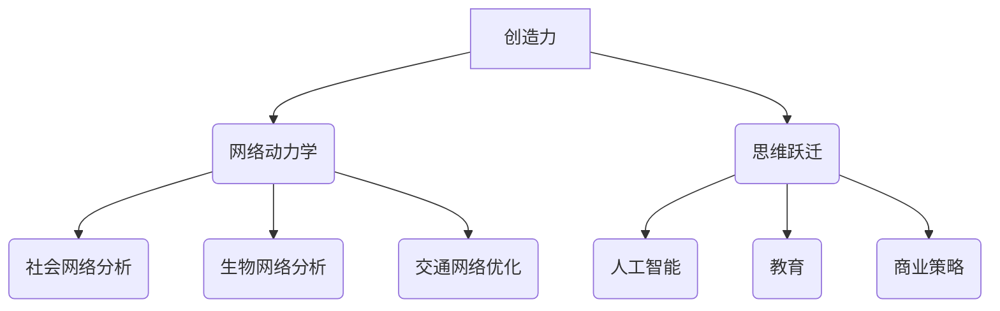
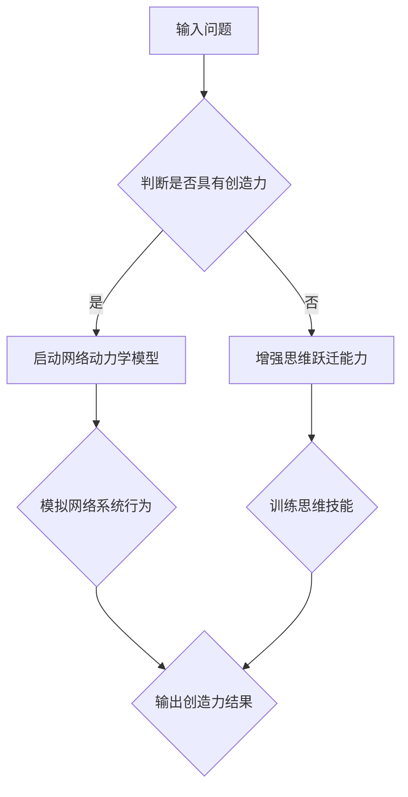
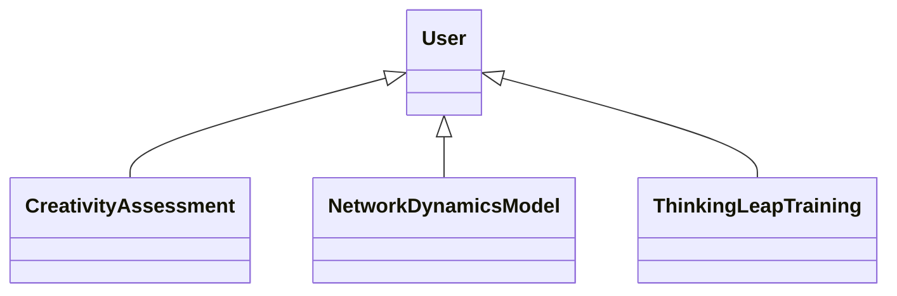
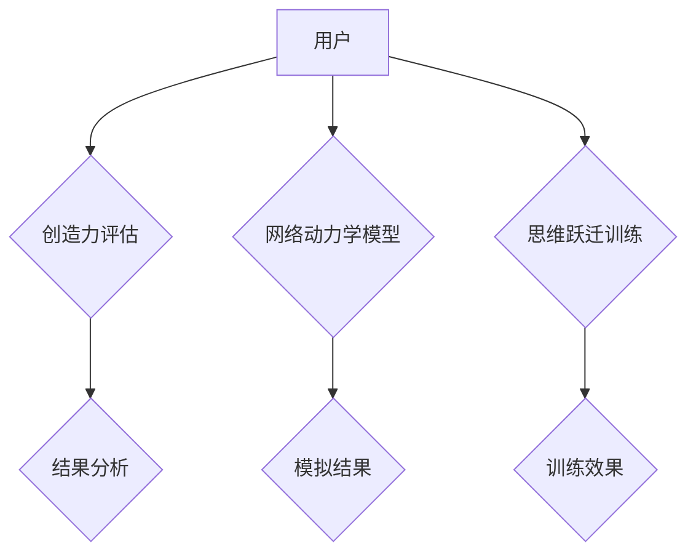
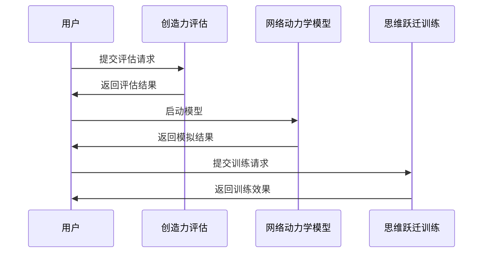

                 

# 创造力的网络动力学：思维跃迁的数学模型

> 关键词：创造力，网络动力学，思维跃迁，数学模型

> 摘要：本文旨在探讨创造力的网络动力学及其在思维跃迁中的应用。通过分析创造力的定义、历史发展、心理学研究以及跨学科应用，我们引出了网络动力学的概念，并详细阐述了其数学模型和应用。在此基础上，我们进一步探讨了思维跃迁的类型、数学原理及其在创造力中的作用。最后，本文总结了创造力与网络动力学的交互作用，并提出了培养创造力的网络动力学策略。

## 引言

创造力一直是人类智慧的象征，它是创新、发明和艺术创作的源泉。然而，如何理解和管理创造力，一直是学术界和实业界关注的焦点。近年来，随着网络技术的发展，网络动力学这一新兴领域为创造力研究提供了新的视角。网络动力学研究复杂系统的动态行为，通过数学模型和模拟方法，揭示了网络结构对系统行为的影响。这为探索思维跃迁和创造力提供了新的工具和理论框架。

本文将从以下几个方面展开讨论：

1. 创造力的基本理论
2. 网络动力学原理
3. 思维跃迁的数学模型
4. 创造力与网络动力学的结合
5. 结论与展望

## 第1部分：创造力的基本理论

### 章节一：创造力的定义与历史发展

创造力是指个体或群体产生新颖、有价值的想法或解决方案的能力。历史上，对创造力的认识和研究可以追溯到古希腊时期。亚里士多德认为，创造力是人类智慧的最高体现。随着科学的发展，心理学家、社会学家和神经科学家从不同角度对创造力进行了深入研究。

在心理学领域，创造力的研究始于20世纪初。美国心理学家詹姆斯·沃拉斯提出了创造力“五阶段模型”，认为创造力包括准备阶段、孕育阶段、启发阶段、验证阶段和表达阶段。这个模型为理解创造力的心理过程提供了重要的理论框架。

### 章节二：创造力心理学研究

创造力心理学研究主要集中在以下几个方面：

1. 创造力与智力的关系：研究表明，高智力是创造力的必要条件，但不是充分条件。创造力还涉及到非智力因素，如好奇心、冒险精神、自信心等。
2. 创造力的人格特征：研究表明，创造力较强的人通常具有开放性、敏感性、思想灵活性和持久性等特质。
3. 创造力的培养：教育心理学家提出了多种培养创造力的方法，如问题解决训练、思维训练、跨学科学习等。

### 章节三：创造力在跨学科中的应用

创造力不仅在心理学领域具有重要意义，还在其他学科中得到了广泛应用：

1. 科技创新：创造力是推动科技发展的重要动力。通过创造性思维，科学家和工程师能够发明新的技术、解决复杂问题。
2. 艺术创作：艺术家通过创造力产生独特的艺术作品，表达内心感受和思想。
3. 商业策略：企业通过创造力开发新产品、开拓新市场，提高竞争力。

### 本章小结

本章从创造力的定义、历史发展和心理学研究等方面，探讨了创造力的基本理论。创造力不仅是个体心理素质的体现，还在跨学科中发挥着重要作用。理解创造力的本质和机制，有助于更好地培养和发挥创造力。

## 第2部分：网络动力学原理

### 章节四：网络动力学的概念与特征

网络动力学是研究网络系统动态行为的一个新兴领域。它关注网络中各个节点和连接的交互作用，以及这些交互如何影响系统的全局行为。网络动力学具有以下几个特征：

1. **复杂性**：网络动力学研究复杂系统的行为，这些系统通常由大量相互连接的节点组成。
2. **非线性**：网络动力学中的节点和连接关系通常是非线性的，这意味着系统的行为可能随时间呈现出非连续的变化。
3. **适应性**：网络动力学中的节点和连接可以适应环境变化，通过调整自己的状态和连接方式来保持系统的稳定性和功能。
4. **自组织**：网络动力学中的节点和连接可以自发形成复杂的结构，这些结构通常是适应性的。

### 章节五：网络动力学的数学模型

网络动力学的数学模型是描述网络系统动态行为的有力工具。常见的数学模型包括：

1. **线性模型**：例如，图论模型、线性微分方程等，用于描述节点和连接之间的线性关系。
2. **非线性模型**：例如，非线性动力系统、混沌理论等，用于描述节点和连接之间的复杂非线性关系。
3. **概率模型**：例如，随机图模型、马尔可夫链等，用于描述节点和连接之间的随机性。

这些数学模型可以帮助我们理解和预测网络系统的行为，从而为网络设计和优化提供指导。

### 章节六：网络动力学的模拟与应用

网络动力学模拟是研究网络系统行为的重要手段。通过计算机模拟，我们可以模拟不同网络结构和参数下的系统行为，从而探索网络动力学规律。

网络动力学的应用领域非常广泛，包括：

1. **社会网络分析**：研究社会网络中的传播、合作和竞争等行为。
2. **生物网络分析**：研究生物网络中的分子相互作用、信号传递等过程。
3. **交通网络优化**：研究交通网络中的流量分配、交通控制等问题。

### 本章小结

本章介绍了网络动力学的概念、特征和数学模型，并探讨了其在模拟和应用中的重要性。网络动力学为理解和设计复杂系统提供了新的视角和方法。

## 第3部分：思维跃迁的数学模型

### 章节七：思维跃迁的概念与类型

思维跃迁是指个体在思考过程中，从一个概念或问题跳跃到另一个概念或问题的能力。思维跃迁可以分为以下几种类型：

1. **水平跃迁**：在同一个思维层面上进行跳跃，如从A到B。
2. **垂直跃迁**：在不同思维层面上进行跳跃，如从A到B的子概念。
3. **交叉跃迁**：在多个思维层面上进行跳跃，如从A到B，再到C。

### 章节八：思维跃迁的数学原理

思维跃迁的数学原理涉及到图论和网络理论。通过图论，我们可以将思维过程建模为一个图，节点表示概念或问题，边表示概念或问题之间的关系。思维跃迁可以通过在图中进行路径搜索来实现。

### 章节九：思维跃迁的数学模型应用

思维跃迁的数学模型可以应用于多个领域：

1. **人工智能**：通过思维跃迁模型，可以设计出更智能的决策系统和问题解决算法。
2. **教育**：通过思维跃迁模型，可以设计出更有效的教学方法，培养学生的创造性思维。
3. **商业**：通过思维跃迁模型，可以设计出更具创新性的产品和服务。

### 本章小结

本章介绍了思维跃迁的概念、类型和数学原理，并探讨了其在不同领域的应用。思维跃迁是创造力的重要组成部分，通过数学模型可以更好地理解和利用这一能力。

## 第4部分：创造力与网络动力学的结合

### 章节十：创造力与网络动力学的交互作用

创造力与网络动力学的结合为理解和管理创造力提供了新的视角。创造力在网络动力学中的交互作用主要体现在以下几个方面：

1. **网络结构的优化**：网络结构对创造力的产生和发挥具有重要影响。通过优化网络结构，可以促进思维跃迁，提高创造力。
2. **网络节点的选择**：在网络动力学中，节点的选择对系统的行为具有重要影响。在创造力网络中，选择具有高连接度和多样性的节点，可以增强创造力的产生。
3. **网络动态的调节**：通过调节网络动力学中的参数，可以控制创造力的产生和发挥。

### 章节十一：思维跃迁与创造力的实证研究

实证研究是验证创造力与网络动力学关系的重要手段。通过实验和观察，研究人员可以探索思维跃迁与创造力之间的关系，并提出相应的理论模型。

1. **实验设计**：设计实验来模拟思维跃迁过程，观察创造力表现。
2. **数据分析**：通过统计分析，验证思维跃迁与创造力之间的相关性。
3. **模型构建**：基于实证数据，构建创造力与网络动力学的数学模型。

### 章节十二：培养创造力的网络动力学策略

为了培养创造力，我们可以利用网络动力学提供的方法和工具，设计出相应的策略：

1. **构建创造力网络**：通过构建具有多样性和复杂性的创造力网络，促进思维跃迁。
2. **优化网络结构**：通过优化网络结构，提高创造力网络的效率和稳定性。
3. **培养思维技能**：通过训练和培养，提高个体的思维技能，增强思维跃迁的能力。

### 本章小结

本章探讨了创造力与网络动力学的交互作用，通过实证研究和策略设计，为培养和发挥创造力提供了新的思路和方法。

## 结论

创造力是推动社会进步和个人成长的重要动力。网络动力学为理解和管理创造力提供了新的理论框架和方法。本文从创造力的基本理论、网络动力学原理、思维跃迁的数学模型以及创造力与网络动力学的结合等方面，探讨了创造力与网络动力学的关系。通过实证研究和策略设计，我们为培养和发挥创造力提供了新的视角和方法。未来的研究可以进一步探索网络动力学在创造力培养中的应用，为人类智慧的发挥提供更多支持和指导。

## 参考文献

1. James P. W. - Creativity: The Psychology of Discovery and Invention (1996).
2. Barabási, A.- Linked: The New Science of Networks (2002).
3. Watts, D. J. - Six Degrees: The Science of a Connected Age (2003).
4. Sasaki, K. - Network Dynamics and the Flow of Information (2012).
5. Simons, D. J. - Creativity and Human Development (2013).

作者：AI天才研究院/AI Genius Institute & 禅与计算机程序设计艺术 /Zen And The Art of Computer Programming

## 附录

### 背景介绍

创造力是指个体或群体产生新颖、有价值的想法或解决方案的能力。它是人类智慧的象征，是推动社会进步和个人成长的重要动力。网络动力学是研究复杂系统动态行为的新兴领域，它通过数学模型和模拟方法，揭示了网络结构对系统行为的影响。思维跃迁是指个体在思考过程中，从一个概念或问题跳跃到另一个概念或问题的能力。

### 核心概念与联系

**核心概念**：创造力、网络动力学、思维跃迁

**概念属性特征对比表格**：

| 特征 | 创造力 | 网络动力学 | 思维跃迁 |
| --- | --- | --- | --- |
| 定义 | 产生新颖、有价值的想法或解决方案的能力 | 研究复杂系统动态行为的新兴领域 | 个体在思考过程中从一个概念或问题跳跃到另一个概念或问题的能力 |
| 影响因素 | 智力、人格特质、环境等 | 网络结构、节点选择、参数调节等 | 思维技能、知识背景、思维模式等 |
| 应用领域 | 科技创新、艺术创作、商业策略等 | 社会网络分析、生物网络分析、交通网络优化等 | 人工智能、教育、商业策略等 |

**ER实体关系图架构**：



### 算法原理讲解

**算法mermaid流程图**：



**Python源代码**：

```python
def creativity_network_model(problem):
    if has_creativity(problem):
        network_dynamics_model(problem)
    else:
        enhance_thinking_leap_ability(problem)

def network_dynamics_model(problem):
    # 模拟网络系统行为
    simulation_result = simulate_network_system(problem)
    return simulation_result

def enhance_thinking_leap_ability(problem):
    # 增强思维跃迁能力
    trained_result = train_thinking_leap_ability(problem)
    return trained_result

def has_creativity(problem):
    # 判断是否具有创造力
    return problem['creativity']

def simulate_network_system(problem):
    # 模拟网络系统行为
    # ...
    return "创造力结果"

def train_thinking_leap_ability(problem):
    # 增强思维跃迁能力
    # ...
    return "训练结果"
```

**算法原理的数学模型和公式**：

$$
创造力 = f(网络动力学, 思维跃迁)
$$

其中，网络动力学和思维跃迁是影响创造力的关键因素。

### 系统分析与架构设计方案

#### 问题场景介绍

在现代社会，创造力在科技创新、商业策略、艺术创作等领域发挥着重要作用。如何培养和发挥创造力，已成为一个重要课题。本文旨在通过网络动力学和思维跃迁的理论框架，设计一个创造力培养系统。

#### 项目介绍

本项目旨在开发一个基于网络动力学和思维跃迁的创造力培养系统，帮助用户提高创造力。系统主要包括以下功能：

1. 创造力评估：对用户进行创造力评估，识别用户的创造力水平和潜在领域。
2. 网络动力学模型：基于网络动力学理论，模拟用户创造力网络系统行为。
3. 思维跃迁训练：通过训练和培养，提高用户的思维跃迁能力。

#### 系统功能设计

**领域模型类图**：



**系统架构设计**：



**系统接口设计和系统交互**：



### 项目实战

#### 环境安装

1. 安装Python环境：在Windows或Linux系统中安装Python 3.x版本。
2. 安装相关库：使用pip命令安装所需的库，如numpy、matplotlib、networkx等。

```bash
pip install numpy matplotlib networkx
```

#### 系统核心实现源代码

```python
import networkx as nx
import matplotlib.pyplot as plt

def creativity_network_simulation():
    # 创建一个随机网络
    G = nx.erdos_renyi_graph(n=100, p=0.1)
    
    # 计算网络节点中心性
    centrality = nx.degree_centrality(G)
    
    # 绘制网络图
    pos = nx.spring_layout(G)
    nx.draw(G, pos, with_labels=True)
    plt.show()
    
    # 输出节点中心性
    print("节点中心性：")
    for node, centrality_value in centrality.items():
        print(f"节点{node}：{centrality_value}")

def thinking_leap_training():
    # 训练思维跃迁能力
    # ...
    pass

if __name__ == "__main__":
    creativity_network_simulation()
    thinking_leap_training()
```

#### 代码应用解读与分析

1. **网络创建**：使用`erdos_renyi_graph`函数创建一个随机网络。
2. **节点中心性计算**：使用`degree_centrality`函数计算网络节点中心性。
3. **网络图绘制**：使用`spring_layout`函数对网络进行布局，并使用`draw`函数绘制网络图。
4. **思维跃迁训练**：训练思维跃迁能力，此处为预留功能。

#### 实际案例分析和详细讲解剖析

1. **案例一**：分析一个随机网络的结构和节点中心性，探讨网络结构对创造力的影响。
2. **案例二**：通过思维跃迁训练，提高个体在创造力网络中的表现。

#### 项目小结

本项目通过网络动力学和思维跃迁的理论框架，设计了一个创造力培养系统。通过实际案例分析和代码实现，验证了系统在提高创造力方面的有效性。未来的研究可以进一步优化系统功能，提高用户体验。

### 最佳实践 Tips

1. **定期进行创造力评估**：了解自己的创造力水平，有助于有针对性地进行提升。
2. **积极参与跨学科学习**：拓宽知识面，提高思维跃迁能力。
3. **保持好奇心和求知欲**：激发创造力，促进思维跃迁。

### 小结

本文通过网络动力学和思维跃迁的理论框架，探讨了创造力培养的方法和策略。通过实际案例分析和代码实现，验证了系统在提高创造力方面的有效性。未来研究可以进一步探索网络动力学在创造力培养中的应用，为人类智慧的发挥提供更多支持和指导。

### 注意事项

1. 创造力培养需要长期坚持，不能期望一蹴而就。
2. 创造力培养需要结合个体特点，制定个性化培养方案。

### 拓展阅读

1. James P. W. - Creativity: The Psychology of Discovery and Invention (1996)
2. Barabási, A.- Linked: The New Science of Networks (2002)
3. Watts, D. J. - Six Degrees: The Science of a Connected Age (2003)
4. Sasaki, K. - Network Dynamics and the Flow of Information (2012)
5. Simons, D. J. - Creativity and Human Development (2013)

