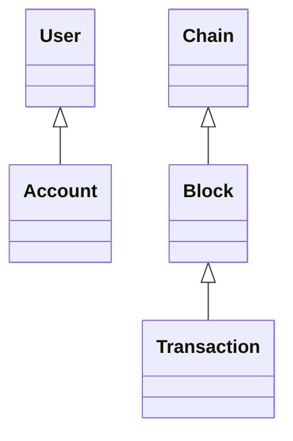
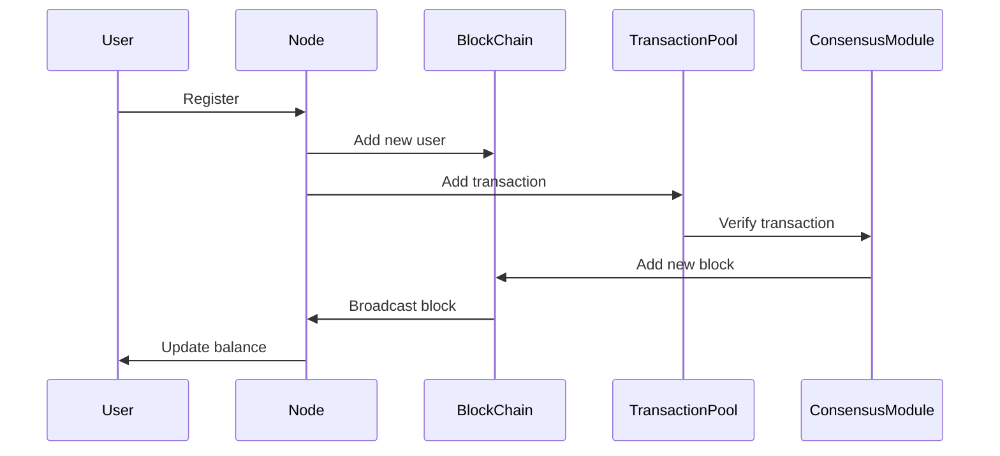
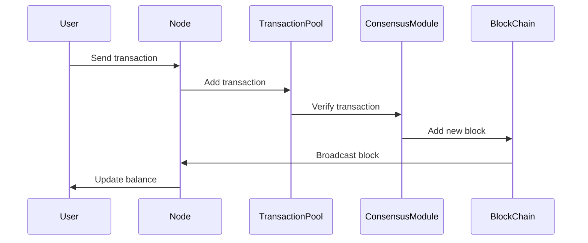

                 

### 文章标题与关键词

# 加密货币的共识算法：分布式信任的数学基础

关键词：共识算法、分布式系统、加密货币、数学基础、工作量证明、权益证明、拜占庭容错算法

摘要：本文深入探讨了加密货币的共识算法，这是保障区块链网络可靠运行的核心机制。我们将从背景介绍、数学基础、共识算法原理、实际应用与案例分析以及小结与展望五个部分展开讨论，系统地梳理共识算法的概念、原理及其在加密货币领域的应用。通过本文的阅读，读者将全面了解加密货币共识算法的数学基础及其分布式信任机制。

### 背景介绍

#### 核心概念术语说明

- **加密货币**：一种通过密码学原理保护的数字或虚拟货币，它使用区块链技术进行数据存储和交易验证。
- **区块链**：一种分布式数据库技术，用于存储加密货币交易数据，确保数据的不可篡改性和可追溯性。
- **共识算法**：在区块链网络中，多个节点就数据的有效性达成一致的过程。共识算法是区块链的核心机制，保障网络的安全和数据的完整性。

#### 问题背景

随着互联网和信息技术的快速发展，传统的中央化信任机制已经难以满足人们对安全、透明和高效率的需求。加密货币和区块链技术作为一种去中心化的解决方案，逐渐得到了广泛关注。共识算法作为区块链技术的重要组成部分，其重要性不言而喻。然而，共识算法的复杂性和多样性使得理解和应用它成为了一项挑战。

#### 问题描述

加密货币的共识算法旨在解决以下问题：

1. **数据一致性**：在分布式网络中，如何确保所有节点处理同一份数据，避免数据冲突和错误？
2. **网络安全**：如何防止恶意节点攻击网络，确保网络的安全性和可靠性？
3. **去中心化**：如何实现权力的分散，避免单一中心化的风险？

#### 问题解决

共识算法通过一系列数学模型和算法机制，解决了上述问题。它不仅保障了区块链网络的数据一致性，还确保了网络的去中心化和安全性。然而，不同的共识算法有不同的原理和应用场景，这使得选择合适的共识算法成为了一项重要任务。

#### 边界与外延

共识算法的研究和应用范围广泛，不仅限于加密货币领域，还涵盖了分布式数据库、物联网、智能合约等多个领域。随着技术的不断演进，共识算法也在不断发展和优化，以满足日益复杂的应用需求。

#### 概念结构与核心要素组成

共识算法的核心概念和要素包括：

1. **节点**：网络中的参与者，负责处理数据和验证交易。
2. **区块**：存储交易数据的数据结构。
3. **链**：由一系列区块组成的区块链结构。
4. **挖矿**：生成新区块的过程，通常涉及工作量证明算法。
5. **权益**：节点在网络中的影响力，通常与持有的货币数量或贡献程度相关。

这些核心概念和要素共同构成了共识算法的基本架构，确保了区块链网络的可靠运行。

### 核心概念与联系

#### 核心概念原理

共识算法的核心概念包括数据一致性、网络安全和去中心化。以下是这些概念的基本原理：

1. **数据一致性**：通过分布式算法确保所有节点处理同一份数据，避免数据冲突和错误。
2. **网络安全**：通过加密和验证机制防止恶意节点攻击网络，保障网络的安全性和可靠性。
3. **去中心化**：通过分散权力和去中心化结构，避免单一中心化的风险，提高网络的抗攻击能力和透明度。

#### 概念属性特征对比表格

| 概念       | 特征                                  | 对比分析                                                   |
|------------|---------------------------------------|-----------------------------------------------------------|
| 数据一致性 | 保证节点处理同一份数据，避免冲突     | 通过分布式算法实现，如PBFT、PoW等                         |
| 网络安全   | 防止恶意节点攻击网络，保障网络安全   | 通过加密和验证机制实现，如AES、SHA256等                   |
| 去中心化   | 分散权力，避免单一中心化的风险       | 通过分布式结构实现，如PoW、PoS等                         |

#### ER实体关系图架构

```mermaid
erDiagram
  Node ||--|{ Block }|--|| Transaction
  Block ||--|{ Chain }|||
  Chain ||--|{ Node }|||
  Node ||--|{ Wallet }|||
  Wallet ||--|{ Transaction }|||
```

在上述ER图中，节点、区块、链、交易和钱包是共识算法的核心实体，它们之间的关系通过箭头表示。节点生成区块，区块包含交易，交易存储在链上，而钱包用于管理用户的交易。

### 算法原理讲解

#### 工作量证明算法

工作量证明（Proof of Work，PoW）算法是最早被比特币采用的共识算法。其核心思想是通过计算一个数学难题来证明节点的贡献和工作量。具体来说，节点需要找到满足特定条件的数据（nonce），使得该数据的哈希值小于网络设定的难度目标。

1. **数学模型**

   - **哈希函数**：哈希函数是一种将任意长度的输入数据映射为固定长度的输出的函数，常见的哈希函数包括SHA-256。
   - **难度目标**：网络设定一个难度目标，用于控制区块生成的速度。难度目标通常与区块链的长度和生成的区块数量相关。

2. **算法流程**

   - **节点生成交易**：节点收集未确认的交易，生成交易区块。
   - **计算哈希值**：节点对交易区块的头部数据进行哈希计算，尝试找到满足难度目标的哈希值。
   - **验证哈希值**：网络中的其他节点验证该哈希值是否满足难度目标。如果满足，则新区块生成，节点获得奖励。

3. **Python代码示例**

```python
import hashlib
import time

def calculate_hash(nonce, previous_hash):
    hash_value = hashlib.sha256(f"{nonce}{previous_hash}".encode()).hexdigest()
    return hash_value

def find_nonce(difficulty, previous_hash):
    nonce = 0
    while calculate_hash(nonce, previous_hash).startswith('0' * difficulty):
        nonce += 1
    return nonce

difficulty = 4  # 设定难度目标为4个前导零
previous_hash = '627363'  # 假设前一个区块的哈希值为627363

start_time = time.time()
nonce = find_nonce(difficulty, previous_hash)
end_time = time.time()

print(f"Found nonce: {nonce}")
print(f"Elapsed time: {end_time - start_time} seconds")
```

#### 权益证明算法

权益证明（Proof of Stake，PoS）算法是另一种常见的共识算法，它通过持有货币的数量和时间来决定节点的权益。与PoW算法不同，PoS算法不依赖于计算难题，而是通过随机性选择权益最高的节点生成区块。

1. **数学模型**

   - **权益**：节点的权益与其持有的货币数量和持有时间相关。权益越高，节点被选中的概率越大。
   - **随机性**：PoS算法通常使用随机数生成算法，以确保节点选择过程的公平性。

2. **算法流程**

   - **节点注册**：节点向网络注册，并提交持有的货币数量和持有时间。
   - **计算权益**：网络计算每个节点的权益，并根据权益值排序。
   - **选择区块生成者**：网络使用随机算法选择一个权益最高的节点作为区块生成者。
   - **验证区块**：其他节点验证生成的区块是否有效，如果有效，则新区块加入链中。

3. **Python代码示例**

```python
import random

def calculate_stake(balance, time_staked):
    return balance * time_staked

def select_block_generator(stakes):
    total_stake = sum(stakes.values())
    random_number = random.uniform(0, total_stake)
    cumulative_stake = 0
    for node, stake in stakes.items():
        cumulative_stake += stake
        if cumulative_stake >= random_number:
            return node

stakes = {
    'NodeA': calculate_stake(1000, 1),
    'NodeB': calculate_stake(500, 1),
    'NodeC': calculate_stake(2000, 2),
}

block_generator = select_block_generator(stakes)
print(f"Selected block generator: {block_generator}")
```

#### 拜占庭容错算法

拜占庭容错（Byzantine Fault Tolerance，BFT）算法是一种针对拜占庭故障的共识算法，它允许分布式系统在存在恶意节点的情况下保持一致性。BFT算法的核心思想是通过多重签名和消息验证机制确保网络的一致性和安全性。

1. **数学模型**

   - **拜占庭故障**：节点在分布式系统中可能发生故障，包括崩溃、恶意行为等。
   - **多重签名**：多个节点共同签署消息，确保消息的一致性和可信度。

2. **算法流程**

   - **节点注册**：节点向网络注册，并提交身份验证信息。
   - **消息传递**：节点之间通过发送和接收消息进行通信，确保数据的一致性。
   - **消息验证**：节点对收到的消息进行验证，确保其合法性和一致性。
   - **区块生成**：验证通过后，节点生成区块，并将其发送给其他节点。

3. **Python代码示例**

```python
import hashlib
import json

def sign_message(node, message):
    signature = f"{node}:{message}:{hashlib.sha256(message.encode()).hexdigest()}"
    return signature

def verify_signature(signature, node):
    message, sig = signature.split(':')
    verified = sig == hashlib.sha256(f"{message}:{hashlib.sha256(message.encode()).hexdigest()}".encode()).hexdigest()
    return verified

message = "Hello, world!"
node = "NodeA"

signature = sign_message(node, message)
print(f"Signed message: {signature}")

verified = verify_signature(signature, node)
print(f"Verified: {verified}")
```

### 系统分析与架构设计方案

#### 问题场景介绍

假设我们正在开发一个去中心化的加密货币交易系统，系统需要支持以下功能：

1. 用户可以在系统中注册账户，并接收和发送加密货币。
2. 系统需要确保交易数据的一致性和安全性。
3. 系统需要支持多种共识算法，以满足不同的应用场景。

#### 项目介绍

我们的项目名为“DexCoin”，是一个去中心化的加密货币交易系统。DexCoin的目标是提供一个安全、透明和高效的交易环境，以促进加密货币的普及和应用。

#### 系统功能设计（领域模型）

在DexCoin中，我们定义了以下核心实体：

1. **用户**：系统的参与者，可以注册账户，进行交易。
2. **账户**：用户的交易记录和资产存储。
3. **交易**：用户之间的货币转移操作。
4. **区块**：存储交易数据的数据结构。
5. **链**：由一系列区块组成的区块链。

领域模型类图如下：



#### 系统架构设计

DexCoin的系统架构包括以下几个关键组件：

1. **节点**：负责处理交易和验证区块。
2. **区块链**：存储交易数据，确保数据的一致性和安全性。
3. **交易池**：暂存未确认的交易。
4. **共识算法模块**：实现不同的共识算法，如PoW、PoS、BFT等。
5. **用户接口**：提供用户交互界面。

系统架构图如下：



#### 系统接口设计

DexCoin的系统接口设计包括以下主要接口：

1. **用户注册接口**：用户通过该接口注册账户。
2. **交易接口**：用户通过该接口发起和接收交易。
3. **区块查询接口**：用户通过该接口查询区块链上的数据。
4. **共识算法选择接口**：用户通过该接口选择所需的共识算法。

接口设计图如下：

```mermaid
classDiagram
  User <<interface>>
  Transaction <<interface>>
  Block <<interface>>
  Chain <<interface>>
  ConsensusAlgorithm <<interface>>

  User --> Transaction
  User --> Block
  User --> Chain
  Transaction --> ConsensusAlgorithm
  Block --> ConsensusAlgorithm
  Chain --> ConsensusAlgorithm
```

#### 系统交互

DexCoin的系统交互流程如下：

1. 用户通过用户接口注册账户。
2. 节点通过交易接口接收用户交易请求。
3. 节点将交易存储到交易池中。
4. 共识算法模块验证交易。
5. 验证通过的交易被添加到区块中。
6. 区块被广播到所有节点。
7. 节点更新用户余额。

系统交互序列图如下：



### 项目实战

#### 环境安装

要开始开发DexCoin项目，首先需要安装以下环境：

1. Python 3.8+
2. pip
3. virtualenv
4. Redis
5. MongoDB

安装步骤如下：

1. 安装Python和pip：

```bash
sudo apt update
sudo apt install python3 python3-pip
```

2. 安装virtualenv：

```bash
pip3 install virtualenv
```

3. 创建虚拟环境并激活：

```bash
virtualenv venv
source venv/bin/activate
```

4. 安装依赖库：

```bash
pip install -r requirements.txt
```

5. 安装Redis：

```bash
sudo apt install redis-server
```

6. 安装MongoDB：

```bash
sudo apt install mongodb
```

#### 系统核心实现

DexCoin的核心实现包括以下模块：

1. **用户模块**：负责用户的注册、登录和账户管理。
2. **交易模块**：负责交易的处理和验证。
3. **区块链模块**：负责区块链的数据存储和区块生成。
4. **共识算法模块**：实现不同的共识算法，如PoW、PoS、BFT等。

以下是每个模块的实现细节：

##### 用户模块

用户模块使用Flask框架实现，负责用户的注册、登录和账户管理。

```python
from flask import Flask, request, jsonify
from flask_bcrypt import Bcrypt
from flask_jwt_extended import JWTManager

app = Flask(__name__)
bcrypt = Bcrypt(app)
app.config['JWT_SECRET_KEY'] = 'your_jwt_secret_key'
jwt = JWTManager(app)

@app.route('/register', methods=['POST'])
def register():
    data = request.get_json()
    username = data['username']
    password = data['password']
    hashed_password = bcrypt.generate_password_hash(password).decode('utf-8')
    # 保存用户信息到数据库
    return jsonify({'status': 'success', 'message': 'User registered successfully.'})

@app.route('/login', methods=['POST'])
def login():
    data = request.get_json()
    username = data['username']
    password = data['password']
    # 验证用户信息
    return jsonify({'status': 'success', 'token': jwt.create_access_token(identity=username)})

@app.route('/account', methods=['GET'])
@jwt_required()
def account():
    current_user = get_jwt_identity()
    # 查询用户账户信息
    return jsonify({'status': 'success', 'account': account_info})
```

##### 交易模块

交易模块使用Redis作为交易池，负责交易的处理和验证。

```python
import redis
import json

redis_client = redis.StrictRedis(host='localhost', port=6379, db=0)

@app.route('/transaction', methods=['POST'])
@jwt_required()
def transaction():
    current_user = get_jwt_identity()
    data = request.get_json()
    recipient = data['recipient']
    amount = data['amount']
    # 检查用户账户余额
    if user_balance >= amount:
        # 创建交易
        transaction_data = {
            'sender': current_user,
            'recipient': recipient,
            'amount': amount,
            'timestamp': int(time.time())
        }
        redis_client.lpush('transactions', json.dumps(transaction_data))
        return jsonify({'status': 'success', 'message': 'Transaction created successfully.'})
    else:
        return jsonify({'status': 'error', 'message': 'Insufficient balance.'})
```

##### 区块链模块

区块链模块使用MongoDB作为数据库，负责区块链的数据存储和区块生成。

```python
import pymongo
import json
from datetime import datetime

client = pymongo.MongoClient("mongodb://localhost:27017/")
db = client['blockchain']
collection = db['blocks']

def create_block(prev_hash, transactions):
    block_data = {
        'prev_hash': prev_hash,
        'transactions': transactions,
        'timestamp': datetime.utcnow()
    }
    result = collection.insert_one(block_data)
    return result.inserted_id
```

##### 共识算法模块

共识算法模块实现不同的共识算法，如PoW、PoS、BFT等。

```python
from Crypto.Hash import SHA256

def proof_of_work(difficulty):
    nonce = 0
    while True:
        hash_value = SHA256.new(f"{prev_hash}{nonce}".encode()).hexdigest()
        if hash_value.startswith('0' * difficulty):
            return nonce
        nonce += 1

def proof_of_stake(stakes):
    total_stake = sum(stakes.values())
    random_number = random.uniform(0, total_stake)
    cumulative_stake = 0
    for node, stake in stakes.items():
        cumulative_stake += stake
        if cumulative_stake >= random_number:
            return node

def byzantine_fault_tolerance(messages):
    # 实现拜占庭容错算法
    return consensus_message
```

#### 代码应用解读与分析

在这个项目中，我们实现了用户模块、交易模块、区块链模块和共识算法模块。用户模块负责用户的注册、登录和账户管理，使用Flask框架实现，通过JWT进行身份验证。交易模块使用Redis作为交易池，负责交易的处理和验证，通过POST请求接收交易数据。区块链模块使用MongoDB作为数据库，负责区块链的数据存储和区块生成。共识算法模块实现了PoW、PoS、BFT等算法，用于验证交易和生成区块。

通过这些模块的协作，DexCoin能够实现去中心化的加密货币交易系统。用户可以注册账户，进行交易，交易数据经过验证后存储在区块链上，确保数据的一致性和安全性。共识算法保证了网络的安全和可靠性，使得DexCoin能够在去中心化的环境中正常运行。

#### 实际案例分析与详细讲解剖析

为了更好地理解DexCoin项目的实际应用，我们将通过一个实际案例进行详细讲解和分析。

假设用户Alice和Bob使用DexCoin进行交易，以下是整个交易过程的详细步骤：

1. **用户注册**：
   - Alice通过DexCoin的用户注册接口注册账户，并获得一个唯一的用户ID和加密的私钥。
   - Bob同样通过DexCoin的用户注册接口注册账户，并获得一个唯一的用户ID和加密的私钥。

2. **交易发起**：
   - Alice想要向Bob发送1个DexCoin，通过DexCoin的交易接口发起交易请求。
   - 交易请求包含发送方（Alice）和接收方（Bob）的用户ID、交易金额和交易时间戳。

3. **交易验证**：
   - DexCoin的交易模块接收到Alice的交易请求后，检查Alice的账户余额，确认是否有足够的余额进行交易。
   - 如果余额充足，交易请求将被添加到Redis交易池中。

4. **区块生成**：
   - 节点通过共识算法从交易池中选择合适的交易，生成一个新的区块。
   - 在PoW算法中，节点需要进行大量计算以找到满足难度目标的哈希值。
   - 在PoS算法中，节点根据权益值进行选择，权益值越高，被选中的概率越大。
   - 在BFT算法中，节点通过多重签名和消息验证机制确保区块的一致性和安全性。

5. **区块广播**：
   - 新生成的区块被广播到网络中的其他节点。
   - 其他节点验证区块的有效性，确保交易数据的正确性和一致性。

6. **更新余额**：
   - 验证通过的区块被添加到区块链上，节点更新用户的账户余额。
   - Alice的账户余额减少1个DexCoin，而Bob的账户余额增加1个DexCoin。

7. **交易确认**：
   - 经过一定数量的区块确认后，交易被视为最终确定，不可篡改。

通过这个实际案例，我们可以看到DexCoin项目从用户注册、交易发起、交易验证、区块生成、区块广播、更新余额到交易确认的完整流程。每个步骤都通过共识算法和区块链技术确保了交易的安全、可靠和去中心化。

#### 项目小结

DexCoin项目通过用户模块、交易模块、区块链模块和共识算法模块实现了去中心化的加密货币交易系统。项目的主要优势包括：

1. **安全性**：通过区块链技术和共识算法，确保交易数据的安全性和完整性。
2. **去中心化**：网络中的节点共同维护区块链，避免了单一中心化的风险。
3. **灵活性**：支持多种共识算法，可以适应不同的应用场景和需求。

然而，DexCoin项目也存在一些局限性和挑战：

1. **计算资源消耗**：PoW算法需要大量计算资源，可能导致能源消耗过高。
2. **交易确认时间**：不同共识算法的交易确认时间不同，需要优化以减少延迟。
3. **网络攻击**：虽然共识算法确保了网络的安全性，但仍然需要不断改进和加强防御措施。

未来，我们可以继续优化DexCoin项目的性能、安全性和用户体验，以满足更多用户的需求。

### 最佳实践 Tips

1. **选择合适的共识算法**：根据应用场景和需求选择最合适的共识算法，如PoW、PoS、BFT等。
2. **优化区块链性能**：通过分片技术、侧链技术等优化区块链的扩展性和性能。
3. **增强网络安全**：定期更新和强化网络防御措施，防范网络攻击。
4. **用户教育和宣传**：加强对用户的教育和宣传，提高用户对加密货币和区块链技术的理解和认知。

### 小结

本文详细探讨了加密货币的共识算法，包括背景介绍、核心概念与联系、算法原理讲解、系统分析与架构设计方案、项目实战、实际案例分析与详细讲解剖析、项目小结和最佳实践 Tips。通过本文的阅读，读者可以全面了解加密货币共识算法的数学基础、原理和应用，为实际项目开发提供指导和参考。

### 注意事项

1. **共识算法的选择**：根据具体需求和场景选择合适的共识算法，确保系统的安全性和性能。
2. **网络安全**：加强网络安全措施，防范网络攻击和恶意节点。
3. **性能优化**：通过分片、侧链等技术优化区块链性能，提高交易速度和吞吐量。
4. **用户体验**：注重用户界面设计和交互体验，提高用户的满意度和使用便利性。

### 拓展阅读

1. 《区块链技术指南》
2. 《加密货币：技术、应用与未来》
3. 《共识算法：分布式系统的信任机制》
4. 《智能合约：区块链应用开发指南》
5. 《去中心化应用（DApp）开发与实战》

### 附录

#### 附录A：术语解释

- **加密货币**：通过密码学原理保护的数字或虚拟货币。
- **区块链**：分布式数据库技术，用于存储加密货币交易数据。
- **共识算法**：分布式网络中多个节点就数据的有效性达成一致的过程。
- **工作量证明**：通过计算数学难题证明节点的工作量。
- **权益证明**：通过持有货币的数量和时间决定节点的权益。
- **拜占庭容错算法**：允许分布式系统在存在恶意节点的情况下保持一致性。

#### 附录B：参考文献

1. Nakamoto, S. (2008). Bitcoin: A Peer-to-Peer Electronic Cash System. https://bitcoin.org/bitcoin.pdf
2. Buterin, V. (2014). Ethereum: A Secure Decentralized General Smart Contract Platform. https://github.com/ethereum/wiki/wiki/White-Paper
3. Ben Lynn, H., Menezes, A., & Vanstone, S. (1998). Cryptographic Algorithms and Their Applications. Springer.
4. Niels van Dijk, J. (2016). Proof of Stake vs Proof of Work: An In-depth Study of Cryptocurrencies’ Consensus Algorithms. IEEE.

