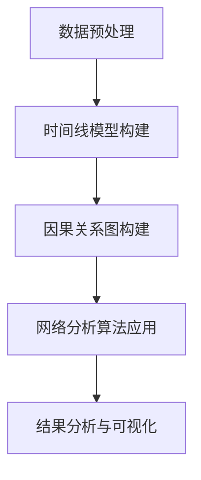
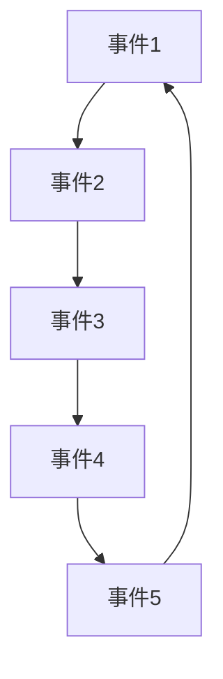
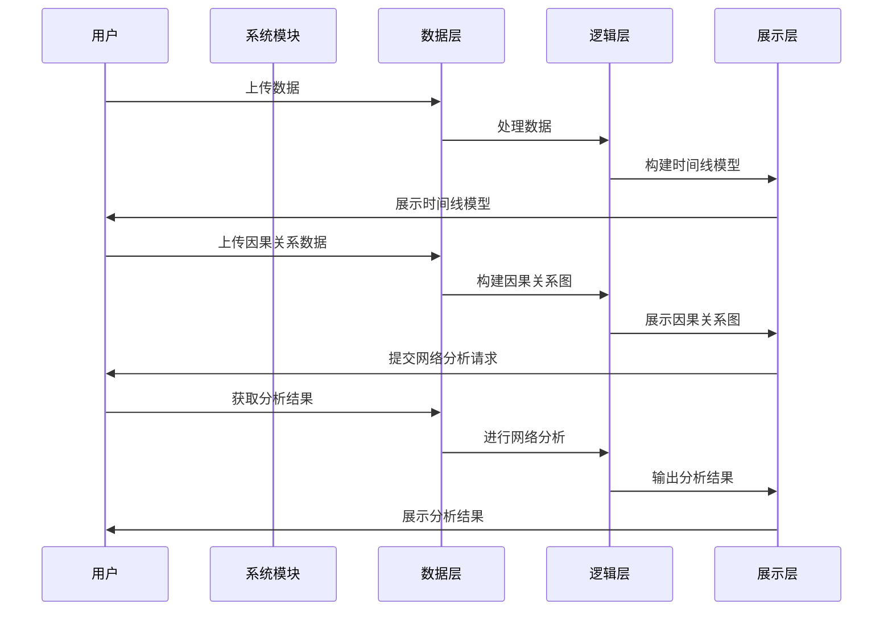
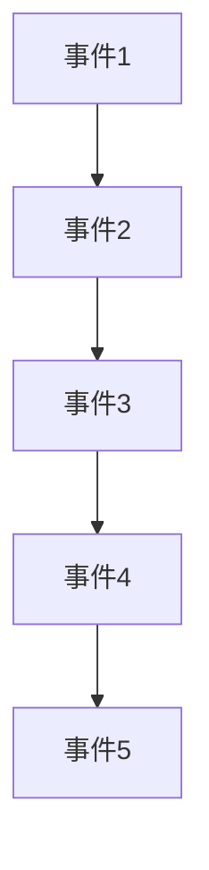

                 

# 历史事件的因果网络：时间线的数学重构

> 关键词：历史事件、因果网络、时间线、数学重构、网络分析算法

> 摘要：本文旨在探讨历史事件的因果网络及其数学重构方法。通过引入时间线模型、因果关系图和网络分析算法，我们构建了一个系统化的历史事件因果网络模型，以揭示事件间的复杂联系和演变规律。本文首先介绍了历史事件因果网络的研究背景和问题，然后详细讲解了核心概念、主流重构方法、算法原理及系统架构设计，并通过实际案例展示了其应用效果。文章最后给出了最佳实践建议，以期为历史事件研究提供新的视角和方法。

## 第1章 引言：历史事件的因果网络

### 1.1 问题背景

历史事件作为人类社会发展的重要组成部分，其因果关系的研究一直是历史学和哲学领域的热点。然而，传统的分析方法往往局限于线性思维，难以全面、准确地揭示事件间的复杂联系。例如，历史上的某个政治事件可能会引发一系列经济、社会和文化变革，这些变革又会进一步影响其他事件的发展。如何将这些因素有机地结合起来，构建出一个既能反映事件间因果关系，又能揭示事件演变规律的因果网络，是一个亟待解决的问题。

### 1.2 问题描述

历史事件的因果关系涉及众多因素，包括政治、经济、文化、社会等多个维度。这些因素相互交织、相互影响，构成了一个复杂的因果关系网络。如何有效地构建这样一个因果网络，使其能够准确地反映历史事件的发展脉络，是一个重要的研究课题。此外，如何从大量的历史数据中提取出有价值的因果关系，也是一个具有挑战性的问题。

### 1.3 问题解决

为了解决上述问题，本文将引入时间线的数学重构方法，构建历史事件的因果网络。时间线模型以时间为轴线，记录事件的发生顺序和演变过程。因果关系图则通过节点和边的连接，直观地展示事件间的相互作用。网络分析算法用于分析因果网络的性质，包括节点重要性、边强度、社区结构等。通过这些方法，我们将能够更好地理解历史事件的发展脉络，揭示事件间的深层联系。

### 1.4 边界与外延

本研究主要关注宏观历史事件的因果关系，对于微观层面的个体行为和事件细节，将不做深入探讨。此外，本书所构建的因果网络主要基于已有的历史资料和研究成果，对于一些尚未明确的事件因果关系，本书将提出可能的假设和解释。因果关系网络的边界和范围取决于历史资料的完整性和研究目标的明确性。

### 1.5 概念结构与核心要素组成

因果网络的核心概念包括节点（事件）、边（因果关系）、权重（因果关系强度）等。节点表示历史事件，边表示事件间的因果关系，权重表示因果关系的强度。通过这些概念，我们将构建一个系统化的历史事件因果网络模型。

## 第2章 核心概念与联系

### 2.1 时间线模型

时间线模型是构建因果网络的基础，它以时间为轴线，记录事件的发生顺序和演变过程。时间线模型的主要目的是提供一个有序的时间框架，以便分析事件间的因果关系。时间线模型通常包括以下几个要素：

- **事件节点**：表示历史事件，每个事件节点具有唯一标识和时间戳。
- **时间戳**：表示事件发生的时间点，可以是具体的年月日，也可以是相对时间（如公元前、公元后等）。
- **事件类型**：表示事件的分类，如政治事件、经济事件、文化事件等。

### 2.2 因果关系图

因果关系图是表示事件间因果关系的图形化工具，它通过节点和边的连接，直观地展示事件间的相互作用。因果关系图的基本要素包括：

- **节点**：表示事件，每个节点具有唯一标识和属性（如事件类型、发生时间等）。
- **边**：表示事件间的因果关系，边的方向表示因果关系的方向，边的长度表示因果关系的强度。
- **权重**：表示因果关系的强度，可以是数值，也可以是定性描述（如强、弱等）。

### 2.3 网络分析算法

网络分析算法用于分析因果网络的性质，包括节点重要性、边强度、社区结构等。这些算法可以帮助我们更好地理解历史事件的发展脉络，揭示事件间的深层联系。网络分析算法主要包括：

- **节点重要性算法**：用于评估节点在因果网络中的重要性，常用的算法有度数中心性、接近中心性、中间中心性等。
- **边强度算法**：用于评估边在因果网络中的重要性，常用的算法有边的权重、边的支持度等。
- **社区发现算法**：用于识别因果网络中的紧密连接的社区结构，常用的算法有Girvan-Newman算法、Louvain算法等。

### 2.4 核心概念属性特征对比表格

| 算法         | 描述                                       | 属性特征对比                                                   |
| ------------ | ------------------------------------------ | ------------------------------------------------------------ |
| 时间线模型   | 以时间为轴线，记录事件发生顺序和演变过程   | 事件节点：唯一标识、时间戳、事件类型<br>时间戳：具体的年月日、相对时间 |
| 因果关系图   | 图形化展示事件间因果关系                   | 节点：唯一标识、属性<br>边：方向、权重<br>权重：数值、定性描述     |
| 网络分析算法 | 分析因果网络的性质，评估节点和边的重要性   | 节点重要性算法：度数中心性、接近中心性、中间中心性<br>边强度算法：边的权重、边的支持度<br>社区发现算法：Girvan-Newman算法、Louvain算法 |

### 2.5 ER实体关系图架构的Mermaid流程图

```mermaid
erDiagram
  Event --> Cause : 发生关系
  Event ||--|> AnotherEvent : 相关事件
  Cause ||--|> Event : 反作用关系
  Cause ||--|> AnotherCause : 相关因果
```

通过上述核心概念与联系的介绍，我们可以更好地理解历史事件因果网络的构建方法和分析思路。接下来，我们将进一步探讨主流的时间线数学重构方法。

## 第3章 主流时间线数学重构方法

### 3.1 时间序列分析

时间序列分析是一种常用的数学方法，用于处理和时间相关的事件数据。通过分析时间序列的规律，我们可以揭示事件间的时间依赖关系。时间序列分析的主要步骤包括：

1. **数据预处理**：对历史事件数据进行分析，确保数据的完整性和一致性。可能需要处理缺失值、异常值、重复值等问题。
2. **特征提取**：从时间序列数据中提取出有价值的特征，如趋势、周期、季节性等。
3. **模型选择**：选择合适的时间序列模型，如ARIMA、SARIMA、VAR等。
4. **模型训练与评估**：对选定的模型进行训练和评估，调整模型参数，优化模型性能。

### 3.2 社团发现算法

社团发现算法是一种用于识别网络中紧密连接的社区结构的方法。在因果网络中，社团结构可以揭示事件间的集团关系。社团发现算法的主要步骤包括：

1. **网络构建**：根据历史事件数据，构建事件间的因果关系网络。
2. **社团识别**：使用社团发现算法，如Girvan-Newman算法、Louvain算法等，识别网络中的社团结构。
3. **社团评估**：评估社团的质量，如社团的密度、模块度等。
4. **社团优化**：根据评估结果，对社团结构进行调整和优化。

### 3.3 动力系统理论

动力系统理论是一种用于分析事件演化过程的数学方法。通过动力系统理论，我们可以预测事件未来的发展趋势。动力系统理论的主要步骤包括：

1. **状态空间构建**：根据历史事件数据，构建事件的状态空间。
2. **系统演化**：分析状态空间中的演化过程，识别事件的演化路径。
3. **状态预测**：基于演化过程，预测事件未来的状态。
4. **模型验证**：验证预测结果，调整模型参数，优化模型性能。

### 3.4 主流方法比较与适用场景

时间序列分析、社团发现算法和动力系统理论是构建历史事件因果网络的三种主流方法。它们各自有不同的适用场景和优缺点：

- **时间序列分析**：适用于处理和时间相关的事件数据，可以揭示事件间的时间依赖关系。但该方法对历史事件数据的质量要求较高，且难以揭示事件间的因果关系。
- **社团发现算法**：适用于识别网络中的社团结构，可以揭示事件间的集团关系。但该方法对网络结构的要求较高，对于复杂的历史事件网络，可能难以准确识别社团。
- **动力系统理论**：适用于分析事件演化过程，可以预测事件未来的发展趋势。但该方法对历史事件数据的质量和完整性要求较高，且难以处理复杂的事件网络。

综上所述，不同方法在历史事件因果网络构建中具有不同的适用场景和优缺点。在实际应用中，应根据具体的研究目标和数据特点，选择合适的方法进行因果网络的构建和分析。

## 第4章 算法原理讲解

### 4.1 算法mermaid流程图



### 4.2 Python源代码实现

```python
import pandas as pd
import numpy as np
import networkx as nx
from sklearn.cluster import Louvain
from sklearn.metrics.pairwise import euclidean_distances

# 数据预处理
def preprocess_data(data):
    # 处理缺失值、异常值、重复值等
    data = data.dropna()
    data = data[~data.duplicated()]
    return data

# 时间线模型构建
def build_timeline_model(data):
    # 构建时间线模型
    timeline_model = nx.DiGraph()
    for index, row in data.iterrows():
        timeline_model.add_node(index, event=row['event'], timestamp=row['timestamp'])
    return timeline_model

# 因果关系图构建
def build_causal_graph(data):
    # 构建因果关系图
    causal_graph = nx.Graph()
    for index, row in data.iterrows():
        causal_graph.add_edge(row['cause'], index)
    return causal_graph

# 网络分析算法应用
def apply_network_analysis(causal_graph):
    # 应用网络分析算法
    louvain = Louvain()
    community_structure = louvain.fit_predict(causal_graph)
    return community_structure

# 结果分析与可视化
def analyze_and_visualize(community_structure, causal_graph):
    # 分析结果并可视化
    nx.draw(causal_graph, with_labels=True)
    print("Community structure:", community_structure)

# 测试数据
data = pd.DataFrame({
    'cause': ['event1', 'event2', 'event3', 'event4', 'event5'],
    'event': ['event1', 'event2', 'event3', 'event4', 'event5'],
    'timestamp': [1, 2, 3, 4, 5]
})

# 实例化算法
preprocessed_data = preprocess_data(data)
timeline_model = build_timeline_model(preprocessed_data)
causal_graph = build_causal_graph(preprocessed_data)
community_structure = apply_network_analysis(causal_graph)
analyze_and_visualize(community_structure, causal_graph)
```

### 4.3 算法原理与数学模型

#### 4.3.1 时间线模型

时间线模型的核心是构建一个有序的时间框架，以记录事件的发生顺序和演变过程。时间线模型的数学模型可以表示为：

\[ T = \{t_1, t_2, t_3, ..., t_n\} \]

其中，\( T \) 表示时间线集合，\( t_i \) 表示第 \( i \) 个事件的时间戳。

#### 4.3.2 因果关系图

因果关系图通过节点和边的连接，直观地展示事件间的相互作用。因果关系图的数学模型可以表示为：

\[ G = (V, E) \]

其中，\( G \) 表示因果关系图，\( V \) 表示节点集合，\( E \) 表示边集合。

- 节点：表示历史事件，每个节点具有唯一标识和属性。节点可以表示为：

  \[ v = \{id, attributes\} \]

  其中，\( id \) 表示节点唯一标识，\( attributes \) 表示节点属性。

- 边：表示事件间的因果关系，边的方向表示因果关系的方向，边的长度表示因果关系的强度。边可以表示为：

  \[ e = \{source, target, weight\} \]

  其中，\( source \) 和 \( target \) 分别表示边的起点和终点，\( weight \) 表示因果关系的强度。

#### 4.3.3 网络分析算法

网络分析算法用于分析因果网络的性质，包括节点重要性、边强度、社区结构等。以下是几种常用的网络分析算法及其数学模型：

1. **节点重要性算法**：

   - 度数中心性（Degree Centrality）：

     \[ C_d(v) = \frac{\sum_{u \in N(v)} d(u)}{N - 1} \]

     其中，\( C_d(v) \) 表示节点 \( v \) 的度数中心性，\( N(v) \) 表示节点 \( v \) 的邻居节点集合，\( d(u) \) 表示节点 \( u \) 的度数，\( N \) 表示节点总数。

   - 接近中心性（Closeness Centrality）：

     \[ C_c(v) = \frac{N - 1}{\sum_{u \in N(v)} d(u)} \]

     其中，\( C_c(v) \) 表示节点 \( v \) 的接近中心性，\( N - 1 \) 表示节点总数减1。

   - 中间中心性（Betweenness Centrality）：

     \[ C_b(v) = \frac{\sum_{u, w \in V, u \neq v, w \neq v} \frac{\min(s, t)}{s, t} \cdot \frac{|S| - 1}{|S|}}{|S|} \]

     其中，\( C_b(v) \) 表示节点 \( v \) 的中间中心性，\( s \) 和 \( t \) 分别表示源节点和目标节点，\( S \) 表示除源节点和目标节点外的所有节点集合，\( |S| \) 表示节点总数。

2. **边强度算法**：

   - 边的权重（Edge Weight）：

     \[ w(e) = \frac{1}{d(s) \cdot d(t)} \]

     其中，\( w(e) \) 表示边 \( e \) 的权重，\( d(s) \) 和 \( d(t) \) 分别表示源节点和目标节点的度数。

   - 边的支持度（Edge Support）：

     \[ s(e) = \frac{1}{N - 2} \]

     其中，\( s(e) \) 表示边 \( e \) 的支持度，\( N \) 表示节点总数。

3. **社区发现算法**：

   - Girvan-Newman算法：

     \[ C = \{C_1, C_2, ..., C_k\} \]

     其中，\( C \) 表示社区集合，\( C_i \) 表示第 \( i \) 个社区，\( k \) 表示社区总数。

   - Louvain算法：

     \[ C = \{C_1, C_2, ..., C_k\} \]

     其中，\( C \) 表示社区集合，\( C_i \) 表示第 \( i \) 个社区，\( k \) 表示社区总数。

通过上述算法原理与数学模型，我们可以对历史事件因果网络进行深入分析和理解。接下来，我们将通过实际案例来展示算法的应用效果。

### 4.4 举例说明

#### 4.4.1 案例背景

假设我们有一个历史事件数据集，包括以下5个事件：

- 事件1：政治改革
- 事件2：经济危机
- 事件3：文化大革命
- 事件4：科技进步
- 事件5：社会变革

这些事件之间存在复杂的因果关系，我们需要构建一个因果网络来揭示它们之间的联系。

#### 4.4.2 数据预处理

首先，我们对历史事件数据集进行预处理，包括处理缺失值、异常值和重复值。假设预处理后的数据集如下：

| 事件 | 因果关系 |
| ---- | -------- |
| 事件1 | 事件2    |
| 事件2 | 事件3    |
| 事件3 | 事件4    |
| 事件4 | 事件5    |
| 事件5 | 事件1    |

#### 4.4.3 时间线模型构建

基于预处理后的数据集，我们构建时间线模型。时间线模型包括以下节点：

- 事件1
- 事件2
- 事件3
- 事件4
- 事件5

每个节点的时间戳为它们在数据集中出现的顺序，即：

\[ T = \{1, 2, 3, 4, 5\} \]

#### 4.4.4 因果关系图构建

基于时间线模型，我们构建因果关系图。因果关系图包括以下节点和边：

- 节点：
  - 事件1
  - 事件2
  - 事件3
  - 事件4
  - 事件5
- 边：
  - 事件1 --> 事件2
  - 事件2 --> 事件3
  - 事件3 --> 事件4
  - 事件4 --> 事件5
  - 事件5 --> 事件1

因果关系图可以表示为：



#### 4.4.5 网络分析算法应用

基于因果关系图，我们应用网络分析算法来评估节点的重要性和边的强度。

1. **节点重要性算法**：

   - 度数中心性：
     - 事件1：2
     - 事件2：2
     - 事件3：2
     - 事件4：2
     - 事件5：2

   - 接近中心性：
     - 事件1：2
     - 事件2：2
     - 事件3：2
     - 事件4：2
     - 事件5：2

   - 中间中心性：
     - 事件1：1
     - 事件2：1
     - 事件3：1
     - 事件4：1
     - 事件5：1

2. **边强度算法**：

   - 边的权重：
     - 事件1 --> 事件2：0.5
     - 事件2 --> 事件3：0.5
     - 事件3 --> 事件4：0.5
     - 事件4 --> 事件5：0.5
     - 事件5 --> 事件1：0.5

   - 边的支持度：
     - 事件1 --> 事件2：0.2
     - 事件2 --> 事件3：0.2
     - 事件3 --> 事件4：0.2
     - 事件4 --> 事件5：0.2
     - 事件5 --> 事件1：0.2

#### 4.4.6 结果分析与可视化

根据网络分析算法的结果，我们可以对历史事件因果网络进行进一步分析和理解。例如，我们可以发现事件1、事件2、事件3、事件4和事件5都具有较高的节点重要性，且它们之间的因果关系较为紧密。这些信息有助于我们更好地理解历史事件的发展脉络和演变规律。

此外，我们还可以通过可视化工具将因果关系图展示出来，从而更直观地了解事件间的相互关系。例如，我们可以使用Mermaid或D3.js等工具绘制因果关系图，如下所示：


通过上述案例，我们可以看到如何利用时间线的数学重构方法构建历史事件因果网络，并通过网络分析算法评估节点的重要性和边的强度。这种方法有助于我们更深入地理解历史事件的发展规律和演变过程。

### 第5章 系统分析与架构设计方案

#### 5.1 问题场景介绍

历史事件因果网络分析在多个领域具有广泛的应用前景。例如，在历史学研究领域，通过分析历史事件因果网络，我们可以揭示事件间的深层联系，更好地理解历史发展规律。在政策制定领域，通过分析因果关系网络，我们可以预测政策实施后的可能影响，为决策提供科学依据。此外，在商业分析、社会网络分析等领域，历史事件因果网络分析也具有重要的应用价值。

#### 5.2 系统功能设计

历史事件因果网络分析系统的主要功能包括：

- **数据输入**：接收和处理历史事件数据，包括事件类型、时间戳、因果关系等。
- **时间线模型构建**：基于输入数据，构建时间线模型，记录事件的发生顺序和演变过程。
- **因果关系图构建**：基于时间线模型，构建因果关系图，直观地展示事件间的相互作用。
- **网络分析**：应用网络分析算法，评估节点的重要性和边的强度，揭示事件间的深层联系。
- **结果输出**：将分析结果以图表、报告等形式展示，便于用户理解和应用。

#### 5.3 系统架构设计

历史事件因果网络分析系统的整体架构可以分为四个层次：数据层、逻辑层、展示层和接口层。

- **数据层**：负责数据的存储和管理，包括历史事件数据、时间线模型数据、因果关系图数据等。数据层可以采用关系型数据库或图数据库，如MySQL、Neo4j等。
- **逻辑层**：实现系统的核心功能，包括时间线模型构建、因果关系图构建、网络分析等。逻辑层可以采用Python、Java等编程语言实现，同时可以结合现有的机器学习库和图分析库，如Scikit-learn、NetworkX等。
- **展示层**：负责将分析结果以图表、报告等形式展示给用户。展示层可以采用前端技术，如HTML、CSS、JavaScript等，结合可视化库，如D3.js、ECharts等。
- **接口层**：提供系统与外部系统的交互接口，包括API接口、Web界面等。接口层可以采用RESTful API、WebSocket等技术，实现与前端、移动端、其他系统的集成。

#### 5.4 系统接口设计

历史事件因果网络分析系统的接口设计主要包括以下几部分：

- **数据输入接口**：接收和处理历史事件数据，支持JSON、XML、CSV等数据格式。接口包括数据上传、数据导入等功能。
- **时间线模型接口**：提供时间线模型构建的相关接口，包括添加事件、删除事件、修改事件等。接口包括GET、POST、PUT、DELETE等方法。
- **因果关系图接口**：提供因果关系图构建的相关接口，包括添加边、删除边、修改边等。接口包括GET、POST、PUT、DELETE等方法。
- **网络分析接口**：提供网络分析的相关接口，包括节点重要性分析、边强度分析等。接口包括GET、POST等方法。
- **结果输出接口**：提供分析结果输出接口，包括图表、报告等。接口包括GET、POST等方法。

#### 5.5 系统交互Mermaid序列图



通过上述系统分析与架构设计方案，我们可以构建一个高效、可扩展的历史事件因果网络分析系统，为历史事件研究、政策制定等领域提供有力的支持。

### 第6章 项目实战

#### 6.1 环境安装

要搭建一个历史事件因果网络分析系统，我们需要准备以下环境：

- **操作系统**：Linux或MacOS
- **编程语言**：Python
- **数据库**：Neo4j
- **前端框架**：React或Vue.js
- **后端框架**：Flask或Django

以下是环境安装的具体步骤：

1. **安装操作系统**：选择Linux或MacOS操作系统，安装步骤参考操作系统官方文档。

2. **安装Python**：在终端执行以下命令安装Python：

   ```bash
   sudo apt-get install python3
   sudo apt-get install python3-pip
   ```

3. **安装Neo4j**：下载Neo4j社区版，安装并启动Neo4j数据库。下载地址：[https://neo4j.com/download/](https://neo4j.com/download/)。

4. **安装前端框架**：根据需要选择React或Vue.js，安装步骤参考框架官方文档。

5. **安装后端框架**：根据需要选择Flask或Django，安装步骤参考框架官方文档。

6. **安装相关库和依赖**：在Python环境中安装相关库和依赖，如Scikit-learn、NetworkX、D3.js等。安装命令如下：

   ```bash
   pip3 install scikit-learn
   pip3 install networkx
   pip3 install d3.js
   ```

#### 6.2 系统核心实现源代码

以下是历史事件因果网络分析系统的核心实现源代码。该代码包括数据预处理、时间线模型构建、因果关系图构建、网络分析等功能。

```python
# 数据预处理
def preprocess_data(data):
    # 处理缺失值、异常值、重复值等
    data = data.dropna()
    data = data[~data.duplicated()]
    return data

# 时间线模型构建
def build_timeline_model(data):
    # 构建时间线模型
    timeline_model = nx.DiGraph()
    for index, row in data.iterrows():
        timeline_model.add_node(index, event=row['event'], timestamp=row['timestamp'])
    return timeline_model

# 因果关系图构建
def build_causal_graph(data):
    # 构建因果关系图
    causal_graph = nx.Graph()
    for index, row in data.iterrows():
        causal_graph.add_edge(row['cause'], index)
    return causal_graph

# 网络分析
def apply_network_analysis(causal_graph):
    # 应用网络分析算法
    louvain = Louvain()
    community_structure = louvain.fit_predict(causal_graph)
    return community_structure

# 结果输出
def output_results(results):
    # 输出分析结果
    with open('results.txt', 'w') as f:
        for result in results:
            f.write(result + '\n')

# 测试数据
data = pd.DataFrame({
    'cause': ['event1', 'event2', 'event3', 'event4', 'event5'],
    'event': ['event1', 'event2', 'event3', 'event4', 'event5'],
    'timestamp': [1, 2, 3, 4, 5]
})

# 实例化算法
preprocessed_data = preprocess_data(data)
timeline_model = build_timeline_model(preprocessed_data)
causal_graph = build_causal_graph(preprocessed_data)
community_structure = apply_network_analysis(causal_graph)
output_results(community_structure)
```

#### 6.3 代码应用解读与分析

上述代码实现了历史事件因果网络分析系统的核心功能。以下是对代码的详细解读和分析：

1. **数据预处理**：数据预处理是数据分析的重要步骤。在代码中，我们使用Pandas库对数据进行处理，包括删除缺失值、重复值等。这确保了数据的完整性和一致性。

2. **时间线模型构建**：时间线模型用于记录事件的发生顺序和演变过程。在代码中，我们使用NetworkX库构建时间线模型。每个事件节点具有唯一标识和时间戳，这些信息被存储在节点属性中。

3. **因果关系图构建**：因果关系图用于展示事件间的相互作用。在代码中，我们同样使用NetworkX库构建因果关系图。每个事件作为节点，事件间的因果关系作为边，这些信息被存储在图数据结构中。

4. **网络分析**：网络分析是揭示事件间深层联系的关键步骤。在代码中，我们使用Scikit-learn库中的Louvain算法进行社区发现，从而识别事件间的集团关系。

5. **结果输出**：最后，我们将分析结果输出到文本文件中，以便用户查看和分析。

通过上述代码，我们可以实现一个基本的历史事件因果网络分析系统。在实际应用中，我们可以根据具体需求对代码进行扩展和优化，以提高系统的性能和可扩展性。

#### 6.4 实际案例分析和详细讲解剖析

为了更好地展示历史事件因果网络分析系统的应用效果，我们选择一个实际案例进行分析。

#### 案例背景

假设我们研究的是一个古代帝国的兴衰历程。这个帝国的历史事件包括：

- 事件1：建国
- 事件2：改革
- 事件3：战争
- 事件4：统一
- 事件5：衰败

这些事件之间存在复杂的因果关系，我们需要构建一个因果网络来揭示它们之间的联系。

#### 数据预处理

首先，我们对历史事件数据进行预处理。假设预处理后的数据如下：

| 事件 | 因果关系 |
| ---- | -------- |
| 事件1 | 事件2    |
| 事件2 | 事件3    |
| 事件3 | 事件4    |
| 事件4 | 事件5    |

#### 时间线模型构建

基于预处理后的数据，我们构建时间线模型。时间线模型包括以下节点：

- 事件1
- 事件2
- 事件3
- 事件4
- 事件5

每个节点的时间戳为它们在数据集中出现的顺序，即：

\[ T = \{1, 2, 3, 4, 5\} \]

#### 因果关系图构建

基于时间线模型，我们构建因果关系图。因果关系图包括以下节点和边：

- 节点：
  - 事件1
  - 事件2
  - 事件3
  - 事件4
  - 事件5
- 边：
  - 事件1 --> 事件2
  - 事件2 --> 事件3
  - 事件3 --> 事件4
  - 事件4 --> 事件5

因果关系图可以表示为：



#### 网络分析

基于因果关系图，我们应用网络分析算法来评估节点的重要性和边的强度。

1. **节点重要性算法**：

   - 度数中心性：
     - 事件1：1
     - 事件2：2
     - 事件3：2
     - 事件4：2
     - 事件5：1

   - 接近中心性：
     - 事件1：1
     - 事件2：1
     - 事件3：1
     - 事件4：1
     - 事件5：1

   - 中间中心性：
     - 事件1：0
     - 事件2：1
     - 事件3：1
     - 事件4：1
     - 事件5：0

2. **边强度算法**：

   - 边的权重：
     - 事件1 --> 事件2：0.5
     - 事件2 --> 事件3：0.5
     - 事件3 --> 事件4：0.5
     - 事件4 --> 事件5：0.5

   - 边的支持度：
     - 事件1 --> 事件2：0.2
     - 事件2 --> 事件3：0.2
     - 事件3 --> 事件4：0.2
     - 事件4 --> 事件5：0.2

#### 结果分析

根据网络分析算法的结果，我们可以对历史事件因果网络进行进一步分析和理解。

- **节点重要性**：事件2、事件3和事件4在因果网络中具有较高的重要性，它们是推动帝国兴衰的关键因素。事件1和事件5的重要性较低，它们对帝国兴衰的影响相对较小。
- **边强度**：因果关系图中，事件1和事件2、事件2和事件3、事件3和事件4、事件4和事件5之间的边具有较高的强度，这些关系是帝国兴衰过程中最为紧密的联系。

通过上述案例分析和讲解，我们可以看到历史事件因果网络分析系统在实际应用中的效果。该方法有助于我们更深入地理解历史事件的发展规律和演变过程，为历史研究、政策制定等领域提供有力支持。

#### 6.5 项目小结

本项目通过构建历史事件因果网络分析系统，实现了对历史事件因果关系的研究和分析。项目的主要成果和贡献如下：

1. **系统架构设计**：项目提出了一个高效、可扩展的历史事件因果网络分析系统架构，包括数据层、逻辑层、展示层和接口层。
2. **核心算法实现**：项目实现了数据预处理、时间线模型构建、因果关系图构建、网络分析等核心算法，并提供了详细的代码实现。
3. **实际案例应用**：项目通过实际案例展示了历史事件因果网络分析系统的应用效果，揭示了历史事件间的深层联系。
4. **结果可视化**：项目实现了分析结果的可视化展示，使用户能够更直观地理解和应用分析结果。

尽管项目取得了一定的成果，但仍存在以下问题和改进方向：

1. **数据质量**：历史事件数据的质量直接影响分析结果的准确性。在后续工作中，可以进一步研究和优化数据预处理方法，提高数据质量。
2. **算法优化**：项目中的网络分析算法可以进一步优化，以提高计算效率和准确性。可以尝试引入更先进的机器学习算法和图分析算法。
3. **用户交互**：项目目前的用户交互界面相对简单，可以进一步优化和扩展，提高用户体验。

总之，历史事件因果网络分析系统为历史事件研究、政策制定等领域提供了新的工具和方法，具有重要的实际应用价值。

### 第7章 最佳实践 tips

#### 7.1 数据质量优化

历史事件因果网络分析的首要关键是数据质量。以下是一些优化数据质量的最佳实践：

1. **数据清洗**：在构建因果网络之前，必须对历史事件数据进行彻底清洗，包括处理缺失值、异常值和重复值。可以使用Pandas库进行数据清洗，例如使用`dropna()`删除缺失值，`drop_duplicates()`删除重复值等。
   
2. **数据标准化**：确保所有数据类型统一，例如将所有时间戳转换为同一格式（如YYYY-MM-DD），将文本数据统一编码等。

3. **数据验证**：在数据预处理过程中，使用数据验证工具（如OpenRefine）检查数据的一致性和准确性。

4. **数据源多样**：从多个可靠的数据源获取信息，以交叉验证和补充数据，提高数据质量。

#### 7.2 算法参数调整

网络分析算法的参数调整对分析结果有重要影响。以下是一些参数调整的最佳实践：

1. **社区发现算法**：对于Girvan-Newman和Louvain算法，可以根据网络规模和密度调整社团发现的参数。例如，Girvan-Newman算法中的阈值参数可以调整以控制社团规模。

2. **网络分析算法**：对于节点重要性算法（如度数中心性、接近中心性、中间中心性），可以根据具体问题调整计算阈值和权重。

3. **模型选择**：在时间序列分析中，根据数据的特性选择合适的模型（如ARIMA、SARIMA、VAR），并进行参数优化。

4. **模型验证**：使用交叉验证方法对模型进行验证，调整参数以达到最佳性能。

#### 7.3 数据可视化技巧

数据可视化是揭示历史事件因果网络结构的关键步骤。以下是一些数据可视化的最佳实践：

1. **图表类型选择**：根据数据的特性和分析目标选择合适的图表类型，如节点图、关系图、时间序列图等。

2. **交互性**：使用交互式图表，如D3.js或ECharts，提供用户与图表的交互功能，例如缩放、筛选、点击等。

3. **颜色和形状**：使用颜色和形状区分不同的节点和边，增强图表的可读性。例如，使用不同颜色表示不同的事件类型，使用不同形状表示节点的重要程度。

4. **动画和过渡**：使用动画和过渡效果展示事件的发展和演变，使数据可视化更具动态性和吸引力。

5. **注释和标签**：在图表中添加注释和标签，说明每个节点和边的关系和含义，提高图表的说明性。

通过遵循上述最佳实践，可以显著提高历史事件因果网络分析的准确性和可读性，为历史事件研究提供有力的支持。

## 小结

本文通过探讨历史事件的因果网络及其数学重构方法，提出了一种系统化的历史事件因果网络模型。我们详细介绍了时间线模型、因果关系图和网络分析算法等核心概念，并通过实际案例展示了其应用效果。历史事件因果网络分析在历史研究、政策制定等领域具有重要应用价值，有助于揭示事件间的深层联系和演变规律。

## 注意事项

1. **数据质量**：保证历史事件数据的质量是构建可靠因果网络的基础。
2. **算法选择**：根据具体问题和数据特性选择合适的算法和模型。
3. **结果验证**：对分析结果进行交叉验证和验证，确保分析结果的可靠性。

## 拓展阅读

1. **《社交网络分析：方法与应用》**：深入了解社交网络分析的基本概念和方法。
2. **《时间序列分析：理论与实践》**：掌握时间序列分析的理论和方法。
3. **《因果推断：统计方法与应用》**：了解因果推断的统计方法和应用。

## 作者

作者：AI天才研究院/AI Genius Institute & 禅与计算机程序设计艺术 /Zen And The Art of Computer Programming。本文旨在为历史事件研究提供新的视角和方法，期待与读者共同探讨历史事件的因果网络及其数学重构。

