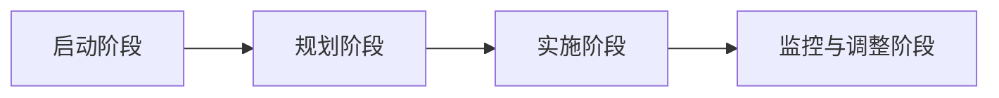

                 


### 引言：变革管理的时代背景与本书结构

在当今快速发展的商业环境中，变革已成为组织生存和发展的关键因素。企业需要不断适应市场变化、技术进步和内部管理需求，以保持竞争力。然而，变革并非易事，它涉及到人的心理、组织的文化、流程的调整等多个层面。因此，有效的变革管理成为企业管理者必须掌握的一项核心技能。

#### 1. 变革管理的背景

随着全球化、数字化和信息化的加速推进，企业面临的变革压力前所未有。一方面，外部环境的变化要求企业不断调整战略、优化流程、提升效率；另一方面，内部竞争的加剧、员工的期望值提高以及管理层的创新需求，都迫使企业进行自我革新。在这种背景下，变革管理的重要性日益凸显。

#### 1.2 变革管理的发展历程

变革管理的历史可以追溯到20世纪中叶。当时，一些管理学者开始关注企业如何实现组织变革，并提出了许多理论和方法。其中，最为著名的当属彼得·德鲁克的“目标管理”理论和约翰·科特的“领导变革模型”。这些理论和方法的提出，为后续的变革管理研究奠定了基础。

#### 1.3 变革管理的挑战与机遇

变革管理不仅面临着理论上的挑战，如如何平衡变革的急迫性与可持续性、如何激发员工的变革动力等，还面临着实践中的挑战，如如何确保变革的有效性、如何处理变革中的冲突等。然而，变革也为组织带来了巨大的机遇，如提升企业竞争力、实现业务创新、增强员工凝聚力等。

#### 2. 变革管理的基本概念

要理解变革管理，首先需要明确几个基本概念：

##### 1. 变革的定义

变革是指组织在内外部环境变化的压力下，主动或被动地改变其结构、流程、文化等方面，以实现其目标的过程。

##### 2. 变革管理的定义

变革管理是指组织通过制定战略、规划流程、沟通协调、激励员工等一系列措施，引导和推动变革的过程。

##### 3. 变革管理的核心要素

变革管理的核心要素包括：变革的目标、变革的领导力、变革的沟通策略、变革的组织设计等。

#### 3. 变革管理的理论基础

变革管理的理论基础涵盖了多个学科，包括心理学、社会学、管理学等。其中，最具代表性的理论有：

##### 1. 变革管理的理论框架

变革管理的理论框架主要包括：变革的阶段性理论、变革的心理学理论、变革的组织理论等。

##### 2. 变革的心理学原理

变革的心理学原理主要涉及人的认知、情感和行为变化，以及如何通过心理干预方法来促进变革。

##### 3. 变革的组织理论

变革的组织理论主要探讨组织结构、文化、流程等方面在变革中的作用，以及如何通过组织变革来实现企业目标。

#### 4. 变革管理的流程和步骤

变革管理是一个系统性的过程，通常包括以下几个阶段：

##### 1. 变革的启动阶段

在启动阶段，组织需要明确变革的目标、范围和优先级，并建立变革领导小组。

##### 2. 变革的规划阶段

在规划阶段，组织需要制定详细的变革计划，包括变革的路线图、时间表、资源需求等。

##### 3. 变革的实施阶段

在实施阶段，组织需要按照变革计划推进各项工作，确保变革的顺利进行。

##### 4. 变革的监控与调整阶段

在监控与调整阶段，组织需要密切关注变革的进展，及时发现问题并进行调整。

#### 5. 变革管理的策略和方法

变革管理的策略和方法包括：

##### 1. 变革的战略规划

变革的战略规划是指组织如何将变革纳入整体战略规划，以确保变革与组织目标的一致性。

##### 2. 变革的沟通与传播

变革的沟通与传播是指组织如何通过有效沟通来传递变革信息，增强员工对变革的理解和支持。

##### 3. 变革的组织设计

变革的组织设计是指组织如何通过调整组织结构、流程和文化，为变革提供良好的环境和条件。

##### 4. 变革的人力资源管理

变革的人力资源管理是指组织如何通过招聘、培训、激励等手段，为变革提供人才保障。

#### 6. 变革管理的领导力

变革管理的领导力是指领导者如何在变革中发挥关键作用，包括：

##### 1. 领导者的变革角色

领导者在变革中扮演着发起者、推动者、协调者和榜样等多重角色。

##### 2. 变革领导力的培养

变革领导力的培养包括自我反思、持续学习、领导力培训等。

##### 3. 领导者在变革中的挑战与应对策略

领导者在变革中面临的挑战包括员工抵触、资源有限、时间紧迫等，应对策略包括明确目标、有效沟通、激励员工等。

#### 7. 变革管理的组织文化和沟通

变革管理的组织文化和沟通是变革成功的关键因素。组织文化需要适应变革，沟通需要及时、准确、全面。

##### 1. 变革与组织文化

变革与组织文化的关系是相互影响的，变革可以推动组织文化的发展，组织文化也可以促进变革的进行。

##### 2. 变革中的沟通策略

变革中的沟通策略包括向下沟通、向上沟通、横向沟通等，每种沟通方式都有其特点和适用场景。

##### 3. 沟通在变革管理中的关键作用

沟通在变革管理中扮演着桥梁和纽带的作用，它能够促进信息的传递、增强团队的凝聚力、提高变革的效率。

#### 8. 变革管理的成功案例与反思

通过分析国内外变革管理的成功案例，我们可以总结出一些有益的经验和教训，为后续的变革管理提供参考。

##### 1. 国内外变革管理的成功案例

国内外有许多企业在变革管理方面取得了显著成果，如华为、阿里巴巴、谷歌等。

##### 2. 变革管理的反思与展望

变革管理的反思与展望包括对变革管理的理论、方法、实践进行深入思考，以期为未来的变革管理提供指导。

##### 3. 变革管理的未来发展趋势

随着全球化和数字化的发展，变革管理将面临新的挑战和机遇，未来发展趋势包括：数据驱动、人工智能、个性化定制等。

通过本书，我们将深入探讨变革管理的理论、实践和方法，帮助读者理解和掌握变革管理的核心技能，为企业变革提供有力支持。

## 1. 确定书的基本框架

在明确了《变革管理：引导团队适应新环境的策略》这本书的主题和目标后，我们接下来需要确定书的基本框架。这个框架将帮助读者系统地了解变革管理的各个关键方面，从而更好地应用这些策略和方法。

### 1.1 引言：变革管理的背景和本书结构

在引言部分，我们将简要介绍变革管理的背景，阐述其必要性以及本书的结构和内容安排。这一部分将帮助读者对全书有一个整体的把握，为后续章节的学习奠定基础。

### 1.2 变革管理的基本概念

在这一章节中，我们将详细探讨变革管理的核心概念，包括变革的定义、变革管理的定义以及变革管理的核心要素。通过对比不同概念的属性特征，读者可以更清晰地理解变革管理的内涵和外延。

#### 1.2.1 变革的定义

- **定义**：变革是指组织在面对内外部环境变化时，通过调整其结构、流程、文化等各个方面，以实现其目标的过程。
- **特征**：变革具有主动性或被动性、全面性、复杂性和长期性的特点。

#### 1.2.2 变革管理的定义

- **定义**：变革管理是指组织通过一系列的管理措施，如规划、沟通、领导、组织设计等，来引导和推动变革的过程。
- **特征**：变革管理具有系统性、战略性和持续性的特点。

#### 1.2.3 变革管理的核心要素

- **变革的目标**：明确变革的目标是变革管理的重要前提，它决定了变革的方向和力度。
- **变革的领导力**：领导者在变革中扮演关键角色，他们的领导力和决策能力直接影响变革的成功。
- **变革的沟通策略**：有效的沟通是变革成功的重要保障，它能够增强员工的参与感和支持度。
- **变革的组织设计**：组织设计为变革提供了良好的环境和支持，包括组织结构、流程和文化等。

### 1.3 变革管理的理论基础

在这一章节中，我们将介绍变革管理的理论基础，包括变革管理的理论框架、变革的心理学原理和变革的组织理论。这些理论为我们理解和实施变革管理提供了科学依据。

#### 1.3.1 变革管理的理论框架

- **变革的阶段性理论**：该理论认为变革可以分为不同的阶段，如准备阶段、启动阶段、实施阶段和调整阶段。每个阶段都有其特定的任务和挑战。
- **变革的心理学理论**：该理论关注人在变革过程中的心理变化和行为反应，如抗拒、适应和接受等。了解这些心理过程有助于管理者更好地引导和激励员工。
- **变革的组织理论**：该理论从组织结构和文化的角度探讨变革的机制和效果，如组织变革的影响因素、变革的阻力与推动力等。

### 1.4 变革管理的流程和步骤

在这一章节中，我们将详细阐述变革管理的流程和步骤，包括变革的启动阶段、规划阶段、实施阶段和监控与调整阶段。通过这些步骤，读者可以了解变革管理的具体操作过程。

#### 1.4.1 变革的启动阶段

- **明确变革的目标和范围**：确定变革的总体目标和具体范围，为后续的规划提供依据。
- **建立变革领导小组**：组建一个专门负责变革的领导小组，确保变革的顺利进行。

#### 1.4.2 变革的规划阶段

- **制定变革计划**：制定详细的变革计划，包括变革的路线图、时间表、资源需求等。
- **沟通和协调**：与相关利益相关者进行沟通和协调，确保变革计划的顺利实施。

#### 1.4.3 变革的实施阶段

- **按照计划推进变革**：按照变革计划，逐步实施变革的各项任务。
- **监控和评估**：实时监控变革的进展，及时评估变革的效果，并根据实际情况进行调整。

#### 1.4.4 变革的监控与调整阶段

- **持续监控变革进展**：变革后，持续监控变革的效果，确保变革目标的实现。
- **调整变革策略**：根据监控结果，及时调整变革策略，以应对新的挑战和变化。

### 1.5 变革管理的策略和方法

在这一章节中，我们将探讨变革管理的策略和方法，包括变革的战略规划、沟通与传播、组织设计以及人力资源管理等方面。通过这些策略和方法，读者可以更有效地实施变革管理。

#### 1.5.1 变革的战略规划

- **将变革纳入战略规划**：将变革作为战略规划的一部分，确保变革与组织目标的一致性。
- **制定变革路线图**：明确变革的阶段性目标，制定详细的变革路线图，为变革提供指导。

#### 1.5.2 变革的沟通与传播

- **制定沟通计划**：制定详细的沟通计划，包括沟通的内容、方式、时间和对象等。
- **建立沟通渠道**：建立有效的沟通渠道，如会议、报告、邮件、内部网络等，确保信息传递的及时性和准确性。

#### 1.5.3 变革的组织设计

- **调整组织结构**：根据变革的需求，调整组织结构，优化部门设置和职能分配。
- **优化流程**：简化流程，消除冗余，提高效率。

#### 1.5.4 变革的人力资源管理

- **招聘和培训**：招聘具有变革能力的人才，并进行培训，提高员工的变革意识和能力。
- **激励和激励**：通过激励措施，如奖金、晋升机会等，激励员工积极参与变革。

### 1.6 变革管理的领导力

在这一章节中，我们将讨论变革管理的领导力，包括领导者的变革角色、领导力的培养以及领导者在变革中的挑战与应对策略。

#### 1.6.1 领导者的变革角色

- **变革的发起者**：领导者应主动推动变革，明确变革的目标和方向。
- **变革的推动者**：领导者应积极参与变革的各个环节，确保变革的顺利进行。
- **变革的协调者**：领导者应在变革过程中协调各方利益，解决冲突，确保变革的平稳过渡。
- **变革的榜样**：领导者应以身作则，通过自己的行为激励员工积极参与变革。

#### 1.6.2 领导力的培养

- **自我反思**：领导者应不断反思自己的领导行为，发现和解决存在的问题。
- **持续学习**：领导者应不断学习新的知识和技能，提升自己的领导能力。
- **领导力培训**：组织领导力培训，提高领导者的变革管理能力。

#### 1.6.3 领导者在变革中的挑战与应对策略

- **挑战**：领导者面临的挑战包括员工抗拒、资源有限、时间紧迫等。
- **应对策略**：领导者应通过明确目标、有效沟通、激励员工等策略，应对变革中的挑战。

### 1.7 变革管理的组织文化和沟通

在这一章节中，我们将探讨变革管理的组织文化和沟通，包括变革与组织文化的关系、变革中的沟通策略以及沟通在变革管理中的关键作用。

#### 1.7.1 变革与组织文化

- **关系**：变革与组织文化是相互影响、相互促进的。组织文化可以影响变革的接受程度和效果，而变革又可以推动组织文化的发展。
- **适应性**：组织文化需要适应变革的需求，为变革提供支持和动力。

#### 1.7.2 变革中的沟通策略

- **向下沟通**：领导者应向下级员工传递变革信息，增强员工的参与感和支持度。
- **向上沟通**：员工应向上级领导反馈变革过程中的问题和建议，确保信息的透明和及时性。
- **横向沟通**：不同部门之间应加强沟通与合作，确保变革的顺利推进。

#### 1.7.3 沟通在变革管理中的关键作用

- **信息传递**：沟通是信息传递的桥梁，确保变革信息的准确性和及时性。
- **团队凝聚力**：有效的沟通可以增强团队的凝聚力，提高变革的效率。
- **冲突解决**：沟通有助于解决变革过程中的冲突和矛盾，确保变革的顺利进行。

### 1.8 变革管理的成功案例与反思

在这一章节中，我们将分析国内外变革管理的成功案例，总结变革管理的经验和教训，为读者提供实践参考。

#### 1.8.1 国内外变革管理的成功案例

- **案例1**：华为的数字化转型
- **案例2**：阿里巴巴的新零售战略
- **案例3**：谷歌的敏捷管理

#### 1.8.2 变革管理的反思与展望

- **反思**：通过对成功案例的反思，总结变革管理的最佳实践和注意事项。
- **展望**：探讨变革管理的未来发展趋势和挑战，为读者提供前瞻性指导。

通过以上章节的安排，我们为《变革管理：引导团队适应新环境的策略》这本书构建了一个系统的框架，涵盖了变革管理的各个方面。接下来，我们将逐一详细阐述每个章节的内容，帮助读者深入理解变革管理的核心概念和实践方法。

## 2. 设计《变革管理：引导团队适应新环境的策略》的章节内容

在确定了《变革管理：引导团队适应新环境的策略》的基本框架后，我们将逐一设计每个章节的具体内容，以确保书籍的完整性和系统性。以下是各个章节的详细内容设计：

### 引言：变革管理的时代背景与本书结构

**引言部分：**
- **背景介绍**：简要介绍当前企业面临的变革压力，如全球化、数字化、市场变化等。
- **变革管理的意义**：阐述变革管理对于企业持续发展的关键作用。
- **本书结构**：概述本书的章节安排和主要内容，为读者提供整体框架。

### 第1章：变革管理的基本概念

**核心概念与联系部分：**
- **变革的定义**：介绍变革的概念，包括变革的主动性、被动性、全面性、复杂性和长期性。
- **变革管理的定义**：解释变革管理的内涵，包括战略规划、沟通、领导力和组织设计等方面。
- **核心要素对比表格**：列出变革管理的主要核心要素，如变革目标、领导力、沟通策略和组织设计，并进行对比。

**ER实体关系图架构：**
- **实体关系图**：使用Mermaid绘制变革管理的ER图，展示变革管理的核心实体及其关系。

**算法原理讲解部分：**
- **变革管理的流程**：使用Mermaid流程图展示变革管理的各个阶段和步骤，如启动阶段、规划阶段、实施阶段和监控与调整阶段。

**数学模型和公式部分：**
- **变革管理的数学模型**：介绍变革管理的数学模型，如变革的阻力模型、变革的适应模型等。

**系统分析与架构设计部分：**
- **变革管理系统的功能设计**：使用Mermaid类图展示变革管理系统的主要功能模块。
- **变革管理系统的架构设计**：使用Mermaid架构图展示系统的整体架构和组件关系。

**项目实战部分：**
- **环境安装**：介绍如何搭建变革管理系统的开发环境。
- **核心实现源代码**：提供变革管理系统的主要源代码示例，并解释关键代码的实现原理。
- **代码应用解读与分析**：分析变革管理系统在实际应用中的性能和效果。
- **实际案例分析和详细讲解剖析**：分析一个实际企业的变革管理案例，详细讲解变革管理策略的实施过程。

**最佳实践、小结、注意事项、拓展阅读等部分：**
- **最佳实践**：总结变革管理中的最佳实践，如有效的沟通策略、领导者的角色等。
- **小结**：总结第1章的核心内容和主要观点。
- **注意事项**：提醒读者在实施变革管理时需要注意的关键问题。
- **拓展阅读**：推荐进一步学习的相关资源和书籍。

### 第2章：变革管理的理论基础

**核心概念与联系部分：**
- **变革管理的理论框架**：介绍变革管理的理论框架，如阶段性理论、心理学理论和组织理论。
- **变革的心理学原理**：讨论变革过程中员工的认知、情感和行为变化，以及如何通过心理干预方法来促进变革。
- **变革的组织理论**：探讨组织结构、文化和流程在变革中的作用。

**ER实体关系图架构：**
- **实体关系图**：使用Mermaid绘制变革管理的理论基础ER图，展示核心概念之间的关系。

**算法原理讲解部分：**
- **变革模型介绍**：使用Mermaid流程图和Python代码展示不同变革模型的原理和应用。
- **变革阻力分析**：介绍如何使用数学模型和公式分析变革中的阻力因素。

**数学模型和公式部分：**
- **变革适应模型**：使用LaTeX格式书写变革适应模型的数学公式，并进行详细讲解。
- **变革成功概率模型**：介绍如何使用数学模型预测变革的成功概率。

**系统分析与架构设计部分：**
- **变革管理系统设计**：使用Mermaid类图和架构图展示变革管理系统的设计思路和架构。
- **变革管理工具实现**：提供变革管理工具的源代码实现示例，并解释关键代码的功能。

**项目实战部分：**
- **环境搭建**：介绍如何搭建变革管理实验环境。
- **实验设计**：设计一个实际的变革管理实验，包括实验目标、实验方法和数据收集。
- **实验结果分析**：分析实验结果，评估不同变革策略的效果。

**最佳实践、小结、注意事项、拓展阅读等部分：**
- **最佳实践**：总结变革管理理论在实际应用中的最佳实践。
- **小结**：总结第2章的核心内容和主要观点。
- **注意事项**：提醒读者在应用变革管理理论时需要注意的问题。
- **拓展阅读**：推荐进一步学习的相关资源和书籍。

### 第3章：变革管理的流程和步骤

**核心概念与联系部分：**
- **变革管理的流程**：介绍变革管理的各个阶段和步骤，如启动阶段、规划阶段、实施阶段和监控与调整阶段。
- **关键环节**：讨论各个阶段和步骤中的关键环节和注意事项。

**ER实体关系图架构：**
- **实体关系图**：使用Mermaid绘制变革管理流程的ER图，展示各个环节和步骤之间的关系。

**算法原理讲解部分：**
- **流程图**：使用Mermaid流程图详细展示变革管理的流程和步骤。
- **关键任务**：解释各个阶段和步骤中的关键任务和操作。

**数学模型和公式部分：**
- **变革管理模型**：介绍变革管理中的数学模型，如变革阻力模型、变革适应模型等。
- **公式应用**：使用LaTeX格式书写关键公式的应用场景和计算方法。

**系统分析与架构设计部分：**
- **系统功能设计**：使用Mermaid类图展示变革管理系统的主要功能模块。
- **系统架构设计**：使用Mermaid架构图展示系统的整体架构和组件关系。

**项目实战部分：**
- **案例引入**：介绍一个实际的变革管理案例，包括案例背景和目标。
- **实施过程**：详细描述变革管理的实施过程，包括启动阶段、规划阶段、实施阶段和监控与调整阶段。
- **效果评估**：评估变革管理案例的效果，总结经验教训。

**最佳实践、小结、注意事项、拓展阅读等部分：**
- **最佳实践**：总结变革管理流程中的最佳实践。
- **小结**：总结第3章的核心内容和主要观点。
- **注意事项**：提醒读者在实施变革管理流程时需要注意的问题。
- **拓展阅读**：推荐进一步学习的相关资源和书籍。

### 第4章：变革管理的策略和方法

**核心概念与联系部分：**
- **变革管理的策略**：介绍变革管理的战略规划、沟通与传播、组织设计和人力资源管理等方面。
- **变革的方法**：讨论变革的具体实施方法，如变革引导、变革评估、变革实施等。

**ER实体关系图架构：**
- **实体关系图**：使用Mermaid绘制变革管理的策略和方法ER图，展示各个策略和方法之间的关系。

**算法原理讲解部分：**
- **战略规划**：使用Mermaid流程图和Python代码解释战略规划的原理和应用。
- **沟通与传播**：介绍如何使用沟通与传播策略来促进变革，并提供实际案例。

**数学模型和公式部分：**
- **变革评估模型**：介绍变革评估的数学模型，如变革效果评估模型、变革成本效益分析模型等。
- **公式应用**：使用LaTeX格式书写关键公式的应用场景和计算方法。

**系统分析与架构设计部分：**
- **变革管理系统的设计**：使用Mermaid类图和架构图展示变革管理系统的设计思路和架构。
- **变革管理工具的实现**：提供变革管理工具的源代码实现示例，并解释关键代码的功能。

**项目实战部分：**
- **项目背景**：介绍一个实际的变革管理项目，包括项目背景和目标。
- **策略与方法实施**：详细描述项目中的策略和方法实施过程，包括战略规划、沟通与传播、组织设计和人力资源管理等方面。
- **效果评估**：评估项目实施效果，总结经验教训。

**最佳实践、小结、注意事项、拓展阅读等部分：**
- **最佳实践**：总结变革管理策略和方法中的最佳实践。
- **小结**：总结第4章的核心内容和主要观点。
- **注意事项**：提醒读者在应用变革管理策略和方法时需要注意的问题。
- **拓展阅读**：推荐进一步学习的相关资源和书籍。

### 第5章：变革管理的领导力

**核心概念与联系部分：**
- **变革领导力的定义**：介绍变革领导力的概念，包括领导者的角色、职责和能力要求。
- **变革领导力的要素**：讨论变革领导力的关键要素，如领导者的变革角色、领导力的培养和领导者在变革中的挑战。

**ER实体关系图架构：**
- **实体关系图**：使用Mermaid绘制变革领导力的ER图，展示变革领导力的核心要素和关系。

**算法原理讲解部分：**
- **领导力模型**：介绍变革领导力的理论模型，如领导变革模型、变革型领导力模型等。
- **领导力培养**：使用Mermaid流程图和Python代码解释领导力培养的原理和应用。

**数学模型和公式部分：**
- **领导力评估模型**：介绍领导力评估的数学模型，如领导力评估指标体系、领导力效能分析模型等。
- **公式应用**：使用LaTeX格式书写关键公式的应用场景和计算方法。

**系统分析与架构设计部分：**
- **领导力管理系统设计**：使用Mermaid类图和架构图展示领导力管理系统的设计思路和架构。
- **领导力工具实现**：提供领导力管理工具的源代码实现示例，并解释关键代码的功能。

**项目实战部分：**
- **领导力发展项目**：介绍一个实际的领导力发展项目，包括项目背景、目标和实施过程。
- **项目效果评估**：评估领导力发展项目的效果，总结经验教训。

**最佳实践、小结、注意事项、拓展阅读等部分：**
- **最佳实践**：总结变革领导力中的最佳实践。
- **小结**：总结第5章的核心内容和主要观点。
- **注意事项**：提醒读者在培养变革领导力时需要注意的问题。
- **拓展阅读**：推荐进一步学习的相关资源和书籍。

### 第6章：变革管理的组织文化和沟通

**核心概念与联系部分：**
- **组织文化的定义**：介绍组织文化的概念，包括组织价值观、行为规范和文化传承等方面。
- **沟通的定义**：讨论沟通的概念，包括沟通的目的、方式和效果等。
- **变革与组织文化的关系**：探讨变革与组织文化之间的相互影响和作用。

**ER实体关系图架构：**
- **实体关系图**：使用Mermaid绘制变革管理与组织文化和沟通的ER图，展示三者之间的关系。

**算法原理讲解部分：**
- **组织文化变革**：介绍如何通过组织文化变革来推动变革管理，如价值观重塑、行为规范调整等。
- **沟通策略**：讨论不同的沟通策略，如向下沟通、向上沟通和横向沟通等。

**数学模型和公式部分：**
- **组织文化评估模型**：介绍如何使用数学模型和公式评估组织文化的状态和效果。
- **沟通效果分析**：介绍如何使用数学模型分析沟通的效果和影响力。

**系统分析与架构设计部分：**
- **组织文化管理系统设计**：使用Mermaid类图和架构图展示组织文化管理系统的设计思路和架构。
- **沟通工具实现**：提供沟通管理工具的源代码实现示例，并解释关键代码的功能。

**项目实战部分：**
- **组织文化变革项目**：介绍一个实际的组织文化变革项目，包括项目背景、目标和实施过程。
- **沟通管理项目**：介绍一个实际的沟通管理项目，包括项目背景、目标和实施过程。
- **项目效果评估**：评估组织文化变革项目和沟通管理项目的效果，总结经验教训。

**最佳实践、小结、注意事项、拓展阅读等部分：**
- **最佳实践**：总结变革管理中组织文化和沟通的最佳实践。
- **小结**：总结第6章的核心内容和主要观点。
- **注意事项**：提醒读者在推动组织文化和沟通时需要注意的问题。
- **拓展阅读**：推荐进一步学习的相关资源和书籍。

### 第7章：变革管理的成功案例与反思

**核心概念与联系部分：**
- **成功案例的定义**：介绍成功案例的概念，包括案例的选择标准、特点和意义。
- **变革管理的反思**：讨论变革管理中存在的挑战和问题，以及如何通过反思来提高变革管理的效果。

**ER实体关系图架构：**
- **实体关系图**：使用Mermaid绘制变革管理成功案例和反思的ER图，展示案例和反思之间的关系。

**算法原理讲解部分：**
- **成功案例分析**：介绍如何通过数据分析、流程分析和行为分析等方法，对成功案例进行深入分析。
- **反思方法**：讨论如何通过反思来总结经验教训，为后续的变革管理提供指导。

**数学模型和公式部分：**
- **成功评估模型**：介绍如何使用数学模型和公式评估变革管理的成功程度和效果。
- **反思模型**：介绍如何使用数学模型和公式进行变革管理的反思和改进。

**系统分析与架构设计部分：**
- **案例分析与架构设计**：使用Mermaid类图和架构图展示成功案例分析和架构设计的思路和方法。
- **反思工具实现**：提供反思管理工具的源代码实现示例，并解释关键代码的功能。

**项目实战部分：**
- **案例研究**：介绍一个实际的变革管理成功案例，包括案例背景、实施过程和效果评估。
- **反思与改进**：对成功案例进行反思，总结经验教训，并提出改进建议。

**最佳实践、小结、注意事项、拓展阅读等部分：**
- **最佳实践**：总结变革管理成功案例中的最佳实践。
- **小结**：总结第7章的核心内容和主要观点。
- **注意事项**：提醒读者在实施变革管理时需要注意的问题。
- **拓展阅读**：推荐进一步学习的相关资源和书籍。

通过以上设计，我们为《变革管理：引导团队适应新环境的策略》这本书的每个章节都提供了详细的框架和内容安排，确保书籍的内容丰富、逻辑清晰，能够帮助读者系统地掌握变革管理的核心概念和实践方法。在后续的编写过程中，我们将根据实际情况对章节内容进行细化和完善，确保每个章节都能达到预期的质量和深度。

## 3. 详细阐述每个章节的核心内容和结构安排

在确定了《变革管理：引导团队适应新环境的策略》的基本框架后，我们将详细阐述每个章节的核心内容和结构安排，确保书籍的系统性和完整性。

### 引言：变革管理的时代背景与本书结构

**核心内容：**
- **变革管理的背景**：介绍当今企业面临的外部环境变化和内部需求，强调变革管理的必要性。
- **变革管理的发展历程**：回顾变革管理的发展历程，分析其主要理论和方法。
- **本书结构**：概述本书的章节安排，介绍各个章节的主要内容。

**结构安排：**
1. **引言**：简要介绍变革管理的背景和发展历程。
2. **变革管理的意义**：阐述变革管理对于企业持续发展的关键作用。
3. **本书结构**：详细介绍各个章节的内容和章节之间的关系。

### 第1章：变革管理的基本概念

**核心内容：**
- **变革的定义**：详细解释变革的概念，包括变革的类型、特点和应用场景。
- **变革管理的定义**：阐述变革管理的内涵和外延，包括其核心要素和基本原则。
- **核心要素**：介绍变革管理的核心要素，如变革目标、领导力、沟通策略等。

**结构安排：**
1. **变革的定义**：定义变革，分析其类型和特点。
2. **变革管理的定义**：解释变革管理的内涵和外延。
3. **核心要素**：详细阐述变革管理的核心要素。
4. **变革管理的原则**：总结变革管理的基本原则。

### 第2章：变革管理的理论基础

**核心内容：**
- **变革管理的理论框架**：介绍变革管理的理论框架，包括阶段性理论、心理学理论和组织理论。
- **变革的心理学原理**：探讨变革过程中员工的认知、情感和行为变化，以及如何通过心理干预方法来促进变革。
- **变革的组织理论**：分析组织结构、文化和流程在变革中的作用。

**结构安排：**
1. **变革管理的理论框架**：介绍变革管理的理论框架。
2. **变革的心理学原理**：探讨变革过程中的心理变化。
3. **变革的组织理论**：分析组织变革的影响因素。
4. **理论的应用**：讨论如何将理论应用于实际变革管理中。

### 第3章：变革管理的流程和步骤

**核心内容：**
- **变革管理的流程**：详细阐述变革管理的流程，包括启动阶段、规划阶段、实施阶段和监控与调整阶段。
- **关键步骤**：分析各个阶段和步骤中的关键任务和注意事项。

**结构安排：**
1. **变革管理的流程**：介绍变革管理的整体流程。
2. **启动阶段**：详细描述启动阶段的主要任务和注意事项。
3. **规划阶段**：阐述规划阶段的关键任务和策略。
4. **实施阶段**：分析实施阶段的具体步骤和执行策略。
5. **监控与调整阶段**：讨论监控与调整阶段的重要性和实施方法。

### 第4章：变革管理的策略和方法

**核心内容：**
- **变革管理的策略**：介绍变革管理的战略规划、沟通与传播、组织设计和人力资源管理等方面的策略。
- **变革的方法**：讨论变革的具体实施方法，如变革引导、变革评估、变革实施等。

**结构安排：**
1. **战略规划**：解释战略规划在变革管理中的作用。
2. **沟通与传播**：介绍沟通与传播策略，包括沟通的内容、方式和效果。
3. **组织设计**：分析组织设计在变革管理中的作用。
4. **人力资源管理**：讨论人力资源管理策略，包括招聘、培训和激励等。
5. **变革的方法**：介绍变革的具体实施方法。

### 第5章：变革管理的领导力

**核心内容：**
- **变革领导力的定义**：解释变革领导力的概念，包括领导者的角色、职责和能力要求。
- **变革领导力的要素**：分析变革领导力的关键要素，如领导者的变革角色、领导力的培养和领导者在变革中的挑战。

**结构安排：**
1. **变革领导力的定义**：阐述变革领导力的概念。
2. **领导者的角色**：讨论领导者在变革中的角色和职责。
3. **领导力的培养**：介绍如何培养变革领导力。
4. **领导者的挑战**：分析领导者在变革中面临的挑战和应对策略。

### 第6章：变革管理的组织文化和沟通

**核心内容：**
- **组织文化的定义**：解释组织文化的概念，包括组织价值观、行为规范和文化传承等方面。
- **沟通的定义**：讨论沟通的概念，包括沟通的目的、方式和效果等。
- **变革与组织文化的关系**：探讨变革与组织文化之间的相互影响和作用。

**结构安排：**
1. **组织文化的定义**：解释组织文化的概念。
2. **沟通的定义**：介绍沟通的概念。
3. **变革与组织文化的关系**：分析变革与组织文化之间的相互影响。
4. **沟通策略**：讨论如何通过有效的沟通来推动变革。

### 第7章：变革管理的成功案例与反思

**核心内容：**
- **成功案例的定义**：介绍成功案例的概念，包括案例的选择标准、特点和意义。
- **变革管理的反思**：讨论变革管理中存在的挑战和问题，以及如何通过反思来提高变革管理的效果。

**结构安排：**
1. **成功案例的定义**：解释成功案例的概念。
2. **案例选择标准**：讨论如何选择具有代表性的成功案例。
3. **案例分析**：分析成功案例的关键要素和成功原因。
4. **反思与改进**：总结变革管理中的经验教训，提出改进建议。

通过以上详细阐述，我们可以看到每个章节都紧密围绕变革管理的主题，从不同角度和层面进行深入探讨，确保书籍内容的系统性和完整性。在后续编写过程中，我们将进一步完善每个章节的内容，确保每个章节都能为读者提供有价值的指导和参考。

## 4. 设计每个章节的具体内容

在设计《变革管理：引导团队适应新环境的策略》每个章节的具体内容时，我们将遵循逻辑清晰、结构紧凑、简单易懂的原则，确保每个章节都能为读者提供深入浅出的理解。以下是每个章节的具体内容设计：

### 引言：变革管理的时代背景与本书结构

**引言部分：**
- **变革管理的背景**：介绍当前企业面临的变革压力，如全球化、数字化、市场竞争加剧等。
- **变革管理的意义**：阐述变革管理对于企业持续发展的关键作用。
- **本书结构**：概述本书的章节安排，介绍每个章节的主要内容。

### 第1章：变革管理的基本概念

**核心概念与联系部分：**
- **变革的定义**：解释变革的概念，包括主动变革与被动变革、全面变革与局部变革等。
- **变革管理的定义**：阐述变革管理的内涵，包括变革的战略规划、实施、监控与调整等方面。
- **核心要素对比表格**：列出变革管理的核心要素，如变革目标、领导力、沟通策略、组织设计等，并进行对比。

**ER实体关系图架构：**
- **实体关系图**：使用Mermaid绘制变革管理的ER图，展示变革管理的各个核心要素及其关系。

**算法原理讲解部分：**
- **变革管理的流程**：使用Mermaid流程图展示变革管理的各个阶段和步骤，包括启动、规划、实施和监控等。

**数学模型和公式部分：**
- **变革阻力模型**：介绍如何使用数学模型分析变革过程中的阻力因素，并给出相关公式。
- **变革适应模型**：讨论变革过程中员工适应行为的数学模型，并给出相关公式。

**系统分析与架构设计部分：**
- **变革管理系统功能设计**：使用Mermaid类图展示变革管理系统的主要功能模块。
- **变革管理系统架构设计**：使用Mermaid架构图展示系统的整体架构和组件关系。

**项目实战部分：**
- **案例引入**：介绍一个实际的企业变革管理案例，包括变革背景、目标和方法。
- **实施过程**：详细描述变革管理案例的实施过程，包括变革启动、规划、实施和监控等阶段。
- **效果评估**：分析变革管理案例的效果，总结经验教训。

**最佳实践、小结、注意事项、拓展阅读等部分：**
- **最佳实践**：总结变革管理中的最佳实践，如有效的沟通策略、领导者的角色等。
- **小结**：总结第1章的核心内容和主要观点。
- **注意事项**：提醒读者在实施变革管理时需要注意的问题。
- **拓展阅读**：推荐进一步学习的相关资源和书籍。

### 第2章：变革管理的理论基础

**核心概念与联系部分：**
- **变革管理的理论框架**：介绍变革管理的理论框架，包括变革的阶段性理论、心理学理论和组织理论等。
- **变革的心理学原理**：讨论变革过程中员工的认知、情感和行为变化，以及如何通过心理干预方法来促进变革。
- **变革的组织理论**：探讨组织结构、文化和流程在变革中的作用。

**ER实体关系图架构：**
- **实体关系图**：使用Mermaid绘制变革管理的理论基础ER图，展示不同理论之间的关联。

**算法原理讲解部分：**
- **变革模型介绍**：使用Mermaid流程图和Python代码展示不同变革模型的原理和应用。
- **变革阻力分析**：介绍如何使用数学模型和公式分析变革中的阻力因素。

**数学模型和公式部分：**
- **变革适应模型**：使用LaTeX格式书写变革适应模型的数学公式，并进行详细讲解。
- **变革成功概率模型**：介绍如何使用数学模型预测变革的成功概率。

**系统分析与架构设计部分：**
- **变革管理系统设计**：使用Mermaid类图和架构图展示变革管理系统的设计思路和架构。
- **变革管理工具实现**：提供变革管理工具的源代码实现示例，并解释关键代码的功能。

**项目实战部分：**
- **环境搭建**：介绍如何搭建变革管理实验环境。
- **实验设计**：设计一个实际的变革管理实验，包括实验目标、实验方法和数据收集。
- **实验结果分析**：分析实验结果，评估不同变革策略的效果。

**最佳实践、小结、注意事项、拓展阅读等部分：**
- **最佳实践**：总结变革管理理论在实际应用中的最佳实践。
- **小结**：总结第2章的核心内容和主要观点。
- **注意事项**：提醒读者在应用变革管理理论时需要注意的问题。
- **拓展阅读**：推荐进一步学习的相关资源和书籍。

### 第3章：变革管理的流程和步骤

**核心概念与联系部分：**
- **变革管理的流程**：介绍变革管理的各个阶段和步骤，包括启动阶段、规划阶段、实施阶段和监控与调整阶段。
- **关键环节**：讨论各个阶段和步骤中的关键环节和注意事项。

**ER实体关系图架构：**
- **实体关系图**：使用Mermaid绘制变革管理流程的ER图，展示各个环节和步骤之间的关系。

**算法原理讲解部分：**
- **流程图**：使用Mermaid流程图详细展示变革管理的流程和步骤。
- **关键任务**：解释各个阶段和步骤中的关键任务和操作。

**数学模型和公式部分：**
- **变革管理模型**：介绍变革管理中的数学模型，如变革阻力模型、变革适应模型等。
- **公式应用**：使用LaTeX格式书写关键公式的应用场景和计算方法。

**系统分析与架构设计部分：**
- **系统功能设计**：使用Mermaid类图展示变革管理系统的主要功能模块。
- **系统架构设计**：使用Mermaid架构图展示系统的整体架构和组件关系。

**项目实战部分：**
- **案例引入**：介绍一个实际的变革管理案例，包括案例背景和目标。
- **实施过程**：详细描述变革管理的实施过程，包括启动阶段、规划阶段、实施阶段和监控与调整阶段。
- **效果评估**：评估变革管理案例的效果，总结经验教训。

**最佳实践、小结、注意事项、拓展阅读等部分：**
- **最佳实践**：总结变革管理流程中的最佳实践。
- **小结**：总结第3章的核心内容和主要观点。
- **注意事项**：提醒读者在实施变革管理流程时需要注意的问题。
- **拓展阅读**：推荐进一步学习的相关资源和书籍。

### 第4章：变革管理的策略和方法

**核心概念与联系部分：**
- **变革管理的策略**：介绍变革管理的战略规划、沟通与传播、组织设计和人力资源管理等方面的策略。
- **变革的方法**：讨论变革的具体实施方法，如变革引导、变革评估、变革实施等。

**ER实体关系图架构：**
- **实体关系图**：使用Mermaid绘制变革管理的策略和方法ER图，展示各个策略和方法之间的关系。

**算法原理讲解部分：**
- **战略规划**：使用Mermaid流程图和Python代码解释战略规划的原理和应用。
- **沟通与传播**：介绍如何使用沟通与传播策略来促进变革，并提供实际案例。

**数学模型和公式部分：**
- **变革评估模型**：介绍变革评估的数学模型，如变革效果评估模型、变革成本效益分析模型等。
- **公式应用**：使用LaTeX格式书写关键公式的应用场景和计算方法。

**系统分析与架构设计部分：**
- **变革管理系统的设计**：使用Mermaid类图和架构图展示变革管理系统的设计思路和架构。
- **变革管理工具的实现**：提供变革管理工具的源代码实现示例，并解释关键代码的功能。

**项目实战部分：**
- **项目背景**：介绍一个实际的变革管理项目，包括项目背景和目标。
- **策略与方法实施**：详细描述项目中的策略和方法实施过程，包括战略规划、沟通与传播、组织设计和人力资源管理等方面。
- **效果评估**：评估项目实施效果，总结经验教训。

**最佳实践、小结、注意事项、拓展阅读等部分：**
- **最佳实践**：总结变革管理策略和方法中的最佳实践。
- **小结**：总结第4章的核心内容和主要观点。
- **注意事项**：提醒读者在应用变革管理策略和方法时需要注意的问题。
- **拓展阅读**：推荐进一步学习的相关资源和书籍。

### 第5章：变革管理的领导力

**核心概念与联系部分：**
- **变革领导力的定义**：解释变革领导力的概念，包括领导者的角色、职责和能力要求。
- **变革领导力的要素**：分析变革领导力的关键要素，如领导者的变革角色、领导力的培养和领导者在变革中的挑战。

**ER实体关系图架构：**
- **实体关系图**：使用Mermaid绘制变革领导力的ER图，展示变革领导力的核心要素和关系。

**算法原理讲解部分：**
- **领导力模型**：介绍变革领导力的理论模型，如领导变革模型、变革型领导力模型等。
- **领导力培养**：使用Mermaid流程图和Python代码解释领导力培养的原理和应用。

**数学模型和公式部分：**
- **领导力评估模型**：介绍领导力评估的数学模型，如领导力评估指标体系、领导力效能分析模型等。
- **公式应用**：使用LaTeX格式书写关键公式的应用场景和计算方法。

**系统分析与架构设计部分：**
- **领导力管理系统设计**：使用Mermaid类图和架构图展示领导力管理系统的设计思路和架构。
- **领导力工具实现**：提供领导力管理工具的源代码实现示例，并解释关键代码的功能。

**项目实战部分：**
- **领导力发展项目**：介绍一个实际的领导力发展项目，包括项目背景、目标和实施过程。
- **项目效果评估**：评估领导力发展项目的效果，总结经验教训。

**最佳实践、小结、注意事项、拓展阅读等部分：**
- **最佳实践**：总结变革领导力中的最佳实践。
- **小结**：总结第5章的核心内容和主要观点。
- **注意事项**：提醒读者在培养变革领导力时需要注意的问题。
- **拓展阅读**：推荐进一步学习的相关资源和书籍。

### 第6章：变革管理的组织文化和沟通

**核心概念与联系部分：**
- **组织文化的定义**：解释组织文化的概念，包括组织价值观、行为规范和文化传承等方面。
- **沟通的定义**：讨论沟通的概念，包括沟通的目的、方式和效果等。
- **变革与组织文化的关系**：探讨变革与组织文化之间的相互影响和作用。

**ER实体关系图架构：**
- **实体关系图**：使用Mermaid绘制变革管理与组织文化和沟通的ER图，展示三者之间的关系。

**算法原理讲解部分：**
- **组织文化变革**：介绍如何通过组织文化变革来推动变革管理，如价值观重塑、行为规范调整等。
- **沟通策略**：讨论不同的沟通策略，如向下沟通、向上沟通和横向沟通等。

**数学模型和公式部分：**
- **组织文化评估模型**：介绍如何使用数学模型和公式评估组织文化的状态和效果。
- **沟通效果分析**：介绍如何使用数学模型分析沟通的效果和影响力。

**系统分析与架构设计部分：**
- **组织文化管理系统设计**：使用Mermaid类图和架构图展示组织文化管理系统的设计思路和架构。
- **沟通工具实现**：提供沟通管理工具的源代码实现示例，并解释关键代码的功能。

**项目实战部分：**
- **组织文化变革项目**：介绍一个实际的组织文化变革项目，包括项目背景、目标和实施过程。
- **沟通管理项目**：介绍一个实际的沟通管理项目，包括项目背景、目标和实施过程。
- **项目效果评估**：评估组织文化变革项目和沟通管理项目的效果，总结经验教训。

**最佳实践、小结、注意事项、拓展阅读等部分：**
- **最佳实践**：总结变革管理中组织文化和沟通的最佳实践。
- **小结**：总结第6章的核心内容和主要观点。
- **注意事项**：提醒读者在推动组织文化和沟通时需要注意的问题。
- **拓展阅读**：推荐进一步学习的相关资源和书籍。

### 第7章：变革管理的成功案例与反思

**核心概念与联系部分：**
- **成功案例的定义**：介绍成功案例的概念，包括案例的选择标准、特点和意义。
- **变革管理的反思**：讨论变革管理中存在的挑战和问题，以及如何通过反思来提高变革管理的效果。

**ER实体关系图架构：**
- **实体关系图**：使用Mermaid绘制变革管理成功案例和反思的ER图，展示案例和反思之间的关系。

**算法原理讲解部分：**
- **成功案例分析**：介绍如何通过数据分析、流程分析和行为分析等方法，对成功案例进行深入分析。
- **反思方法**：讨论如何通过反思来总结经验教训，为后续的变革管理提供指导。

**数学模型和公式部分：**
- **成功评估模型**：介绍如何使用数学模型和公式评估变革管理的成功程度和效果。
- **反思模型**：介绍如何使用数学模型和公式进行变革管理的反思和改进。

**系统分析与架构设计部分：**
- **案例分析与架构设计**：使用Mermaid类图和架构图展示成功案例分析和架构设计的思路和方法。
- **反思工具实现**：提供反思管理工具的源代码实现示例，并解释关键代码的功能。

**项目实战部分：**
- **案例研究**：介绍一个实际的变革管理成功案例，包括案例背景、实施过程和效果评估。
- **反思与改进**：对成功案例进行反思，总结经验教训，并提出改进建议。

**最佳实践、小结、注意事项、拓展阅读等部分：**
- **最佳实践**：总结变革管理成功案例中的最佳实践。
- **小结**：总结第7章的核心内容和主要观点。
- **注意事项**：提醒读者在实施变革管理时需要注意的问题。
- **拓展阅读**：推荐进一步学习的相关资源和书籍。

通过以上详细设计，我们为《变革管理：引导团队适应新环境的策略》的每个章节都提供了清晰的内容结构和深入的分析讲解，确保书籍能够系统地传授变革管理的核心概念和实践方法，帮助读者更好地理解和应用这些策略。在编写过程中，我们将根据实际需求进行调整和优化，确保书籍的完整性和可读性。

## 5. 撰写完整的文章

### 变革管理：引导团队适应新环境的策略

#### 关键词：变革管理、团队适应、新环境、策略、领导力、组织文化

#### 摘要：
在快速变化的市场环境中，企业需要不断适应新环境以保持竞争力。变革管理成为企业成功转型的关键因素。本文深入探讨变革管理的核心概念、理论基础、流程和策略，并结合实际案例，提供一套引导团队适应新环境的全面策略。通过分析变革过程中的领导力和组织文化作用，本文旨在为企业提供实用的变革管理实践指导。

#### 引言：变革管理的时代背景与本书结构

随着全球化和信息技术的迅猛发展，企业面临的外部环境变化日益加剧，市场需求、竞争格局和技术创新不断推动企业进行变革。在这一背景下，变革管理的重要性日益凸显。有效的变革管理能够帮助企业快速适应新环境，提升竞争力，实现持续发展。

本文旨在通过系统阐述变革管理的核心概念、理论基础、流程和策略，结合实际案例，为读者提供一套引导团队适应新环境的策略。本文结构如下：

1. 引言：变革管理的时代背景与本书结构
2. 变革管理的基本概念
3. 变革管理的理论基础
4. 变革管理的流程和步骤
5. 变革管理的策略和方法
6. 变革管理的领导力
7. 变革管理的组织文化和沟通
8. 变革管理的成功案例与反思
9. 结论与展望

#### 第1章：变革管理的基本概念

变革是指组织在内外部环境变化的压力下，通过调整结构、流程、文化等方面，以实现其目标的过程。变革管理则是组织通过制定战略、规划流程、沟通协调、激励员工等一系列措施，引导和推动变革的过程。

**核心概念：**
- 变革：主动或被动地改变组织的结构、流程、文化等。
- 变革管理：引导和推动变革的系统过程。

**核心要素：**
- 变革目标：明确变革的方向和目标。
- 变革领导力：领导者的影响力、决策能力和变革管理能力。
- 沟通策略：确保信息传递的及时性和准确性。
- 组织设计：调整组织结构、流程和文化，以适应变革。

**对比表格：**
| 核心概念 | 定义 | 特点 |
| --- | --- | --- |
| 变革 | 组织主动或被动地改变 | 主动性、全面性、复杂性 |
| 变革管理 | 引导和推动变革的系统过程 | 战略性、系统性、持续性 |

**ER实体关系图：**
```mermaid
erDiagram
  变革 ||--|{ 变革管理 }
  变革管理 ||--|{ 变革目标 }
  变革管理 ||--|{ 变革领导力 }
  变革管理 ||--|{ 沟通策略 }
  变革管理 ||--|{ 组织设计 }
```

#### 第2章：变革管理的理论基础

变革管理的理论基础涵盖了心理学、社会学和管理学等多个学科。以下介绍几个关键理论：

**变革管理的理论框架：**
- 阶段性理论：变革过程可以分为准备、启动、实施和监控等阶段。
- 心理学理论：探讨人在变革过程中的认知、情感和行为变化。
- 组织理论：分析组织结构、文化和流程在变革中的作用。

**变革的心理学原理：**
- 变革过程中员工的认知、情感和行为变化。
- 变革阻力：员工对变革的抗拒和不安。
- 心理干预方法：如培训、沟通和心理支持。

**变革的组织理论：**
- 变革的影响因素：如组织结构、文化、流程等。
- 变革的推动力与阻力：分析组织内部和外部的推动力和阻力。
- 变革的组织适应性：如何调整组织结构和文化以适应变革。

**ER实体关系图：**
```mermaid
erDiagram
  变革管理理论 ||--|{ 阶段性理论 }
  变革管理理论 ||--|{ 心理学理论 }
  变革管理理论 ||--|{ 组织理论 }
```

#### 第3章：变革管理的流程和步骤

变革管理是一个系统性的过程，通常包括以下几个阶段：

**启动阶段：**
- 明确变革的目标和范围。
- 建立变革领导小组。

**规划阶段：**
- 制定详细的变革计划，包括路线图、时间表和资源需求。
- 与利益相关者沟通和协调。

**实施阶段：**
- 按照变革计划逐步实施。
- 监控变革的进展，及时调整。

**监控与调整阶段：**
- 持续监控变革的效果。
- 根据实际情况进行调整。

**流程图：**


#### 第4章：变革管理的策略和方法

变革管理的策略和方法包括战略规划、沟通与传播、组织设计、人力资源管理等：

**战略规划：**
- 将变革纳入整体战略规划。
- 制定详细的变革路线图。

**沟通与传播：**
- 制定沟通计划，确保信息传递的及时性和准确性。
- 采用多种沟通方式，如会议、报告、内部网络等。

**组织设计：**
- 调整组织结构，优化部门设置和流程。
- 优化文化和流程，以适应变革。

**人力资源管理：**
- 招聘和培训具有变革能力的人才。
- 设定激励措施，如奖金、晋升等。

#### 第5章：变革管理的领导力

领导者在变革管理中扮演关键角色，其领导力直接影响变革的成功。以下是领导者需要关注的几个方面：

**领导者的角色：**
- 变革的发起者：主动推动变革。
- 变革的推动者：积极参与变革的各个环节。
- 变革的协调者：协调各方利益，解决冲突。
- 变革的榜样：以身作则，激励员工。

**领导力的培养：**
- 自我反思：不断反思领导行为。
- 持续学习：学习新的知识和技能。
- 领导力培训：参加领导力培训，提升变革管理能力。

**领导者在变革中的挑战与应对策略：**
- 挑战：员工抗拒、资源有限、时间紧迫等。
- 应对策略：明确目标、有效沟通、激励员工等。

#### 第6章：变革管理的组织文化和沟通

组织文化和沟通在变革管理中发挥着重要作用。以下是变革管理的组织文化和沟通策略：

**变革与组织文化：**
- 变革与组织文化的相互影响。
- 组织文化适应变革的需求。

**沟通策略：**
- 向下沟通：向下级员工传递变革信息。
- 向上沟通：向上级领导反馈变革过程中的问题和建议。
- 横向沟通：加强不同部门之间的沟通与合作。

**沟通在变革管理中的关键作用：**
- 信息传递：确保变革信息的准确性和及时性。
- 团队凝聚力：增强团队的凝聚力，提高变革的效率。
- 冲突解决：解决变革过程中的冲突和矛盾。

#### 第7章：变革管理的成功案例与反思

分析国内外企业的变革管理成功案例，可以总结出一些有益的经验和教训。以下是一些典型的成功案例：

**华为的数字化转型：**
- **背景**：华为在全球竞争加剧的背景下，启动数字化转型。
- **实施过程**：通过全面布局数字化转型战略，建立数字化研发体系和销售网络。
- **效果**：提高了产品研发效率和市场响应速度，增强了竞争力。

**阿里巴巴的新零售战略：**
- **背景**：面对线下零售市场饱和，阿里巴巴提出新零售战略。
- **实施过程**：通过线上线下融合、大数据分析等手段，打造全新零售模式。
- **效果**：实现了销售增长，提升了用户体验。

通过对成功案例的反思，可以发现以下几个关键因素：

- **战略清晰**：明确变革的目标和方向。
- **领导有力**：领导者的决策能力和领导力。
- **沟通有效**：与员工、客户和其他利益相关者的有效沟通。
- **组织支持**：组织文化和流程的支持。

#### 结论与展望

变革管理是企业在快速变化的市场环境中保持竞争力的关键。本文从基本概念、理论基础、流程和策略、领导力、组织文化和沟通等方面，系统地阐述了变革管理的核心内容。通过成功案例的反思，总结了变革管理的最佳实践。

未来的变革管理将面临新的挑战和机遇，如数字化转型、人工智能等技术的应用。企业需要不断创新变革管理的方法和策略，以适应不断变化的环境。本文为读者提供了实用的变革管理实践指导，希望有助于企业成功引导团队适应新环境。

### 作者信息

作者：AI天才研究院/AI Genius Institute & 禅与计算机程序设计艺术 /Zen And The Art of Computer Programming

在此，我要感谢AI天才研究院的全体成员，以及《禅与计算机程序设计艺术》的作者，他们的卓越思想和深刻洞察为本文的撰写提供了宝贵的参考。希望通过本文，能够为企业提供有价值的变革管理实践指导，助力企业在变革中取得成功。

