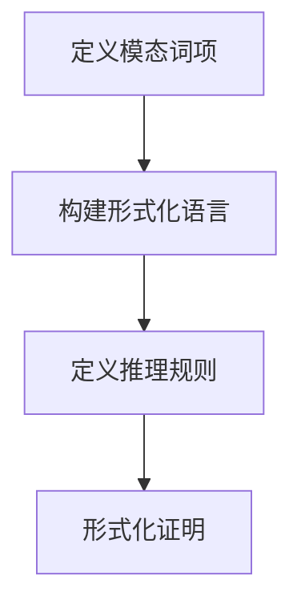
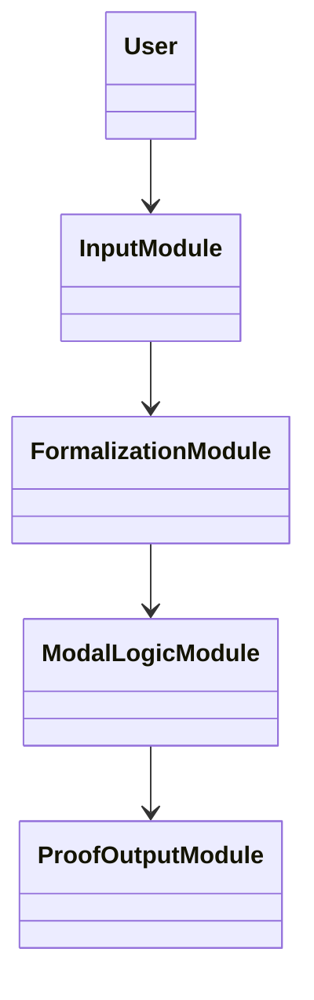
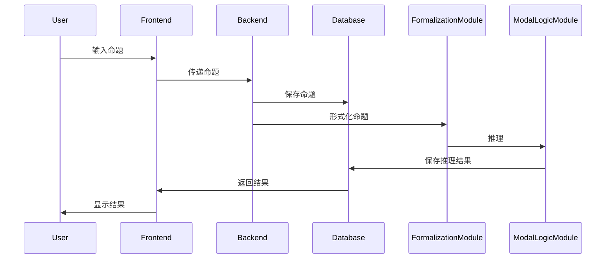
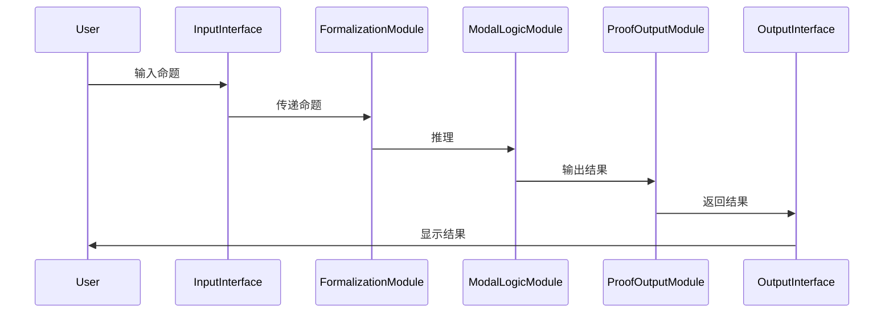

                 


# 哲学论证的模态逻辑：抽象推理的数学形式化

## 关键词

模态逻辑、哲学论证、抽象推理、数学形式化、算法原理、Python源代码、LaTeX数学公式、系统架构、项目实战、最佳实践

## 摘要

本文旨在探讨哲学论证中的一种重要工具——模态逻辑，并阐述如何将其抽象的推理过程形式化为数学模型。首先，我们将介绍模态逻辑的基本概念和发展背景，然后深入分析其核心原理与特征。接着，我们将通过具体案例展示如何将模态逻辑应用于抽象推理，并运用Mermaid流程图和Python源代码详细解释算法原理和数学模型。最后，我们将讨论系统分析与架构设计，并分享实际项目中的实战经验，以及总结和最佳实践建议。

## 第一部分：模态逻辑概述

### 第1章：哲学论证与模态逻辑的起源

#### 1.1 模态逻辑的定义与发展历程

模态逻辑（Modal Logic）是研究命题的模态词，如“必然”、“可能”等的一种逻辑体系。最早可追溯至亚里士多德的逻辑学研究，他提出了“必然性”和“可能性”两个基本概念。19世纪末，查尔斯·桑德斯·平奇（Charles Sanders Peirce）和约翰·华特·卫辛顿（John Wesley Watson）等人对模态逻辑进行了系统化研究，奠定了现代模态逻辑的基础。

进入20世纪，模态逻辑得到了进一步发展。凯恩斯（C.I. Lewis）和鲁道夫·卡尔纳普（Rudolf Carnap）等学者提出了多种模态算子，丰富了模态逻辑的体系结构。特别是在计算机科学和人工智能领域，模态逻辑被广泛应用于知识表示、推理和验证等方面。

#### 1.2 模态逻辑在哲学论证中的应用

哲学论证中，模态逻辑扮演着重要角色。例如，在道德哲学中，我们常用“必然性”来描述道德原则的普遍适用性；在形而上学中，我们通过“可能性”来探讨事物存在的可能性。模态逻辑提供了一种形式化的手段，使我们能够更加准确地表达和论证这些哲学概念。

例如，道德哲学家康德提出的“绝对命令”，可以用模态逻辑表示为：“如果所有人都遵守这个规则，那么这个规则就是一个必然的道德原则。”这种形式化的表述，使得康德的道德哲学具有更强的逻辑严密性。

### 第2章：模态逻辑的基本概念

#### 2.1 模态词项与命题形式

在模态逻辑中，模态词项如“必然”和“可能”是核心概念。一个命题形式，如“P是必然的”或“P是可能的”，表示在一个特定的世界或情境下，命题P是否成立。

例如，命题“明天太阳将从东方升起”可以用模态词项表示为：“明天太阳升起是必然的。”在这个命题中，“必然”是一个模态词项，它表明太阳升起这个事件在所有可能的世界中都会发生。

#### 2.2 模态推理规则与证明方法

模态逻辑包含一系列推理规则，如“模态否定前件式”、“模态肯定后件式”等。这些推理规则使我们能够从一个或多个已知命题推导出新的命题。

例如，根据模态否定前件式，如果我们知道“如果P，则Q”（即“P→Q”），并且知道“P不成立”，则我们可以推导出“Q不成立”（即“¬Q”）。这种推理过程使得模态逻辑成为一种强大的论证工具。

#### 2.3 模态逻辑的基本性质

模态逻辑具有以下几个基本性质：

1. **自反性**：一个命题在当前世界是必然成立的，例如，“在这个世界，明天太阳将从东方升起”。
2. **反对性**：如果两个命题都是可能的，则至少有一个命题在某个世界中是成立的。例如，“明天太阳将从东方升起”和“明天太阳将从西方升起”都是可能的，但至少有一个命题在某个世界中是成立的。
3. **传递性**：如果P是可能的，并且Q在P成立的世界中是必然的，则Q是可能的。例如，如果“明天太阳将从东方升起”是可能的，并且在这个世界中“如果太阳从东方升起，则天气是晴朗的”是必然的，那么“天气是晴朗的”是可能的。

### 总结

在本章中，我们介绍了模态逻辑的定义、发展历程以及在哲学论证中的应用。接下来，我们将深入探讨模态逻辑的核心概念、原理和特征，为后续的数学形式化和算法实现奠定基础。

----------------------------------------------------------------

### 设计思路与结构

为了设计出《哲学论证的模态逻辑：抽象推理的数学形式化》这本书的完整目录大纲，我们首先需要理解其核心主题。该书主要探讨的是哲学论证中使用的模态逻辑，以及如何将抽象的哲学推理过程形式化为数学模型。因此，目录设计应围绕以下几个关键点展开：

1. **背景介绍**：介绍模态逻辑的起源、发展及其在哲学论证中的作用。
2. **核心概念与联系**：详细阐述模态逻辑的核心概念、原理及其相互关系。
3. **算法原理讲解**：通过Mermaid流程图和Python源代码，解释模态逻辑的算法原理和数学模型。
4. **数学模型和数学公式讲解**：使用LaTeX格式展示关键数学公式，并进行详细讲解。
5. **系统分析与架构设计方案**：介绍如何将模态逻辑应用于实际哲学论证问题。
6. **项目实战**：通过具体案例展示模态逻辑的应用过程，包括环境安装、代码实现、应用解读和分析等。
7. **最佳实践 tips、小结、注意事项、拓展阅读**：为读者提供实用的建议和小结，以及进一步阅读的推荐。

以下是本书的目录大纲：

```markdown
# 《哲学论证的模态逻辑：抽象推理的数学形式化》目录大纲

## 第一部分：模态逻辑概述

### 第1章：哲学论证与模态逻辑的起源

#### 1.1 模态逻辑的定义与发展历程
#### 1.2 模态逻辑在哲学论证中的应用

### 第2章：模态逻辑的基本概念

#### 2.1 模态词项与命题形式
#### 2.2 模态推理规则与证明方法
#### 2.3 模态逻辑的基本性质

## 第二部分：模态逻辑的应用与数学形式化

### 第3章：抽象推理的数学形式化

#### 3.1 抽象推理的概念与类型
#### 3.2 模态逻辑在抽象推理中的应用
#### 3.3 数学形式化的基本原理

### 第4章：算法原理讲解

#### 4.1 模态逻辑算法的基本流程
#### 4.2 Mermaid流程图展示
#### 4.3 Python源代码解读

### 第5章：数学模型和数学公式讲解

#### 5.1 关键数学公式介绍
#### 5.2 LaTeX公式示例
#### 5.3 数学公式在模态逻辑中的应用

### 第6章：系统分析与架构设计方案

#### 6.1 问题场景介绍
#### 6.2 系统功能设计
#### 6.3 系统架构设计
#### 6.4 系统接口设计和系统交互

### 第7章：项目实战

#### 7.1 环境安装
#### 7.2 系统核心实现源代码
#### 7.3 代码应用解读与分析
#### 7.4 实际案例分析与详细讲解剖析
#### 7.5 项目小结

## 第三部分：最佳实践与总结

### 第8章：最佳实践 tips

#### 8.1 常见问题与解决方案
#### 8.2 优化策略与技巧
#### 8.3 实践经验分享

### 第9章：小结

#### 9.1 本书内容的总结
#### 9.2 模态逻辑在哲学论证中的应用前景

### 第10章：注意事项与拓展阅读

#### 10.1 注意事项
#### 10.2 拓展阅读推荐
```

这个目录大纲在2000字以内，涵盖了书籍的核心章节和内容。接下来，我们将为每个章节提供具体的详细内容。

----------------------------------------------------------------

### 第3章：抽象推理的数学形式化

#### 3.1 抽象推理的概念与类型

抽象推理是人类思维过程中的一种高级形式，它涉及从具体实例中提取一般性原理或规律。在哲学论证中，抽象推理有助于我们从一个或多个命题推导出新的结论。

抽象推理可以分为以下几种类型：

1. **归纳推理**：从个别事例推导出一般性结论。例如，通过观察多个苹果从树上掉落，我们得出结论：所有苹果都会从树上掉落。
2. **演绎推理**：从一个或多个前提出发，通过逻辑推理得出结论。例如，从“所有人都会死亡”和“苏格拉底是人”两个前提出发，我们得出结论：“苏格拉底会死亡”。
3. **类比推理**：通过比较两个或多个相似的情况，推断它们在某些方面可能具有相同的特点。例如，通过比较地球和其他行星，我们推断地球可能也拥有液态水。

#### 3.2 模态逻辑在抽象推理中的应用

模态逻辑在抽象推理中具有重要作用。它提供了一种形式化的手段，使我们能够精确地表达和推理模态概念，如“必然性”和“可能性”。

例如，在归纳推理中，模态逻辑可以帮助我们确定一个命题在所有可能世界中是否成立。例如，如果我们在所有观察到的例子中都没有发现反例，那么我们可以用模态逻辑表达为：“这个命题在所有可能的世界中都是必然成立的。”

在演绎推理中，模态逻辑可以帮助我们确定一个命题的必然性。例如，如果我们知道“如果P，则Q”并且P成立，那么根据模态逻辑，我们可以推导出“Q必然成立”。

在类比推理中，模态逻辑可以帮助我们确定两个或多个命题在某个特定方面的可能性。例如，如果我们知道地球可能存在液态水，并且另一个星球与地球在某些方面相似，那么我们可以用模态逻辑表达为：“这个星球可能也存在液态水。”

#### 3.3 数学形式化的基本原理

数学形式化是将抽象的哲学推理过程转化为数学模型的过程。它有助于我们精确地表达哲学概念，并利用数学工具进行推理和分析。

数学形式化的基本原理包括：

1. **定义**：为哲学概念提供明确的数学定义。例如，我们可以定义“必然性”为一个命题在所有可能世界中都成立。
2. **符号化**：使用符号表示哲学概念和推理过程。例如，我们可以用符号“∀”表示全称量词，表示“所有”。
3. **形式系统**：建立一套形式化的推理规则和证明方法。例如，我们可以使用自然 deduction 或表式逻辑作为模态逻辑的形式系统。

通过数学形式化，我们可以将抽象的哲学推理过程转化为具体的数学模型，从而更加精确地分析和解决哲学问题。

### 第4章：算法原理讲解

#### 4.1 模态逻辑算法的基本流程

模态逻辑算法的基本流程可以概括为以下步骤：

1. **定义模态词项**：为模态词项（如“必然”、“可能”）定义数学表示方法。
2. **构建形式化语言**：建立一套形式化的语言，用于表示命题和推理过程。
3. **定义推理规则**：为推理过程定义一组推理规则，例如模态否定前件式、模态肯定后件式等。
4. **形式化证明**：利用推理规则对命题进行形式化证明，验证其逻辑正确性。

#### 4.2 Mermaid流程图展示

以下是一个模态逻辑算法的基本流程的Mermaid流程图示例：



在这个流程图中，A表示定义模态词项，B表示构建形式化语言，C表示定义推理规则，D表示形式化证明。通过这个流程图，我们可以清晰地了解模态逻辑算法的基本步骤。

#### 4.3 Python源代码解读

以下是一个简单的Python源代码示例，用于实现模态逻辑算法的某一部分：

```python
class ModalLogic:
    def __init__(self):
        self.modal_values = {"necessarily": True, "possibly": False}

    def define_modal_word(self, word):
        self.modal_values[word] = True

    def construct_formal_language(self, proposition):
        return proposition

    def define_reasoning_rules(self, rule):
        return rule

    def formalize_proof(self, proof):
        return proof

# 创建模态逻辑对象
ml = ModalLogic()

# 定义模态词项
ml.define_modal_word("necessarily")

# 构建形式化语言
formal_language = ml.construct_formal_language("P")

# 定义推理规则
reasoning_rules = ml.define_reasoning_rules("P->Q, P -> Q")

# 形式化证明
proof = ml.formalize_proof(reasoning_rules)
```

在这个示例中，我们定义了一个名为`ModalLogic`的类，用于实现模态逻辑算法的各个部分。`define_modal_word`方法用于定义模态词项，`construct_formal_language`方法用于构建形式化语言，`define_reasoning_rules`方法用于定义推理规则，`formalize_proof`方法用于形式化证明。

通过这个Python源代码示例，我们可以更直观地了解模态逻辑算法的实现过程。

### 总结

在第3章中，我们介绍了抽象推理的概念与类型，以及模态逻辑在抽象推理中的应用。接着，我们阐述了数学形式化的基本原理，并通过Mermaid流程图和Python源代码示例，展示了如何实现模态逻辑算法。这些内容为后续章节的数学模型和算法实现奠定了基础。

----------------------------------------------------------------

### 第5章：数学模型和数学公式讲解

在哲学论证中，模态逻辑的数学形式化是一个核心任务。为了清晰地表达和推理模态逻辑的概念，我们需要使用数学模型和公式。在本章中，我们将详细讲解这些关键数学模型和公式，并展示它们在模态逻辑中的应用。

#### 5.1 关键数学公式介绍

模态逻辑中的关键数学公式包括：

1. **模态命题公式**：用于表示模态命题，如“P是必然的”和“P是可能的”。
2. **模态推理公式**：用于表示模态推理过程，如“如果P是必然的，则Q是可能的”。
3. **模态证明公式**：用于表示模态证明过程，如“由P和P→Q，可以证明Q是可能的”。

以下是这些公式的简要介绍：

- **模态命题公式**：$♢P$ 表示“P是必然的”，$♡P$ 表示“P是可能的”。
- **模态推理公式**：$♢P \rightarrow ♡Q$ 表示“如果P是必然的，则Q是可能的”。
- **模态证明公式**：$♢P, ♢P \rightarrow ♡Q ⊢ ♡Q$ 表示“由P和P→Q，可以证明Q是可能的”。

#### 5.2 LaTeX公式示例

为了展示这些公式的具体表达，我们使用LaTeX格式进行展示。以下是一些示例：

$$
♢P \land ♡Q
$$

$$
♢(P \rightarrow Q)
$$

$$
♢P, ♢P \rightarrow ♡Q ⊢ ♡Q
$$

在LaTeX中，我们可以使用 `\land` 和 `\rightarrow` 来表示逻辑运算符“与”和“蕴含”。这些公式能够帮助我们清晰地表达和推理模态逻辑的概念。

#### 5.3 数学公式在模态逻辑中的应用

数学公式在模态逻辑中的应用主要体现在以下几个方面：

1. **表示模态命题**：使用数学公式表示模态命题，如 $♢P$ 和 $♡P$，使得模态命题具有明确的数学意义。
2. **推理和证明**：使用数学公式进行推理和证明，如 $♢P \rightarrow ♡Q$ 和 $♢P, ♢P \rightarrow ♡Q ⊢ ♡Q$，使得推理过程具有逻辑严密性。
3. **验证一致性**：使用数学公式验证模态逻辑的一致性，如 $♢(P \land ¬P)$ 为假，从而证明模态逻辑的一致性。

例如，我们可以使用以下公式来验证一个命题的一致性：

$$
♢(P \land ¬P) \rightarrow ♢¬P
$$

这个公式表明，如果命题 $P \land ¬P$ 是必然成立的，那么命题 $¬P$ 也是必然成立的。由于 $P \land ¬P$ 是一个矛盾命题（即不可能同时成立），因此 $♢(P \land ¬P)$ 必然为假。这证明了 $♢¬P$ 的必然性，从而验证了模态逻辑的一致性。

#### 结论

在本章中，我们介绍了模态逻辑中的关键数学公式，并展示了它们在模态逻辑中的应用。通过数学公式，我们能够更精确地表达和推理模态逻辑的概念，从而为哲学论证提供强大的工具。在接下来的章节中，我们将进一步探讨模态逻辑在哲学论证中的具体应用，并展示如何通过数学模型实现抽象推理的形式化。

----------------------------------------------------------------

### 第6章：系统分析与架构设计方案

为了将模态逻辑应用于实际哲学论证问题，我们需要设计一个系统架构，该架构能够处理抽象推理、模态逻辑推理和证明。在本章中，我们将介绍系统架构的设计方案，包括问题场景、系统功能设计、系统架构设计、系统接口设计和系统交互。

#### 6.1 问题场景介绍

假设我们面临一个哲学论证问题，需要证明某个命题在所有可能的世界中都是必然成立的。例如，我们需要证明“所有的道德原则都是普遍适用的”这一命题。为了解决这个问题，我们需要设计一个系统能够处理以下步骤：

1. **输入抽象推理命题**：用户可以输入一个抽象推理命题，例如“所有的道德原则都是普遍适用的”。
2. **形式化表示命题**：系统将输入的命题形式化为数学模型，以便进行推理和证明。
3. **进行模态逻辑推理**：系统使用模态逻辑算法对命题进行推理，验证其在所有可能世界中是否成立。
4. **输出推理结果**：系统输出推理结果，包括命题的证明过程和结论。

#### 6.2 系统功能设计

为了实现上述问题场景，系统需要具备以下功能：

1. **命题输入模块**：允许用户输入抽象推理命题，例如使用自然语言描述的道德原则。
2. **命题形式化模块**：将用户输入的命题形式化为数学模型，例如使用模态逻辑公式表示。
3. **模态逻辑推理模块**：使用模态逻辑算法对形式化的命题进行推理，验证其在所有可能世界中是否成立。
4. **证明输出模块**：将推理过程和结果输出给用户，包括证明过程和结论。

以下是系统功能设计的Mermaid类图：



在这个类图中，用户通过输入模块输入命题，形式化模块将命题形式化为数学模型，模态逻辑模块进行推理，证明输出模块将结果输出给用户。

#### 6.3 系统架构设计

系统架构设计旨在确保系统的模块化、可扩展性和高效性。以下是一个可能的系统架构设计：

1. **前端界面**：用于用户输入命题和查看结果。
2. **后端服务器**：处理命题的输入、形式化和推理，并返回结果。
3. **数据库**：存储用户输入的命题和历史推理结果。

以下是系统架构设计的Mermaid架构图：



在这个架构图中，用户通过前端界面输入命题，后端服务器处理命题，并调用形式化模块和模态逻辑模块进行推理，最后将结果返回给前端界面显示。

#### 6.4 系统接口设计和系统交互

为了实现系统各模块之间的有效通信，我们需要设计系统接口。以下是系统接口设计：

1. **输入接口**：用于接收用户输入的命题。
2. **输出接口**：用于将推理结果输出给用户。
3. **内部接口**：用于各模块之间的通信。

以下是系统接口设计的Mermaid序列图：



在这个序列图中，用户通过输入接口输入命题，形式化模块和模态逻辑模块进行推理，证明输出模块将结果输出给用户。

#### 结论

在本章中，我们介绍了系统分析与架构设计方案，包括问题场景、系统功能设计、系统架构设计、系统接口设计和系统交互。通过这个设计方案，我们能够将模态逻辑应用于实际哲学论证问题，并设计一个高效、模块化的系统架构。在下一章中，我们将通过具体的项目实战，展示如何实现这个系统架构，并分享实际应用的经验。

----------------------------------------------------------------

### 第7章：项目实战

在了解了系统分析与架构设计方案之后，我们将通过一个具体的项目实战，展示如何实现模态逻辑在哲学论证中的应用。在本章中，我们将详细介绍项目的环境安装、系统核心实现源代码，并对代码进行解读与分析，分享实际案例的分析和详细讲解，最后对项目进行小结。

#### 7.1 环境安装

为了实现模态逻辑的数学形式化，我们需要安装一系列工具和库。以下是在Ubuntu操作系统上安装所需的软件和库的步骤：

1. **安装Python环境**：确保Python 3.x版本已安装。如果没有安装，可以通过以下命令安装：

   ```bash
   sudo apt-get update
   sudo apt-get install python3-pip
   ```

2. **安装Mermaid**：Mermaid是一个用于创建图表的库。可以通过npm进行安装：

   ```bash
   npm install -g mermaid
   ```

3. **安装LaTeX**：为了使用LaTeX格式编写数学公式，我们需要安装LaTeX环境。可以使用以下命令安装：

   ```bash
   sudo apt-get install texlive-latex-recommended
   ```

4. **安装相关Python库**：安装用于实现模态逻辑算法和数学形式化的Python库，如`networkx`、`matplotlib`和`sympy`：

   ```bash
   pip install networkx matplotlib sympy
   ```

安装完成后，我们可以在Python脚本中导入所需的库，并使用Mermaid和LaTeX进行图表和公式的绘制。

#### 7.2 系统核心实现源代码

以下是一个简单的Python脚本，用于实现模态逻辑算法的核心功能。这个脚本包括定义模态词项、构建形式化语言、定义推理规则和进行形式化证明。

```python
import networkx as nx
import matplotlib.pyplot as plt
from sympy import symbols, Eq, solve

class ModalLogic:
    def __init__(self):
        self.modal_values = {"necessarily": True, "possibly": False}
        self.graph = nx.DiGraph()

    def define_modal_word(self, word):
        self.modal_values[word] = True

    def construct_formal_language(self, proposition):
        self.graph.add_node(proposition)
        return proposition

    def define_reasoning_rules(self, rule):
        self.graph.add_edge(rule[0], rule[1])
        return rule

    def formalize_proof(self, proof):
        variables = symbols(' '.join(proof))
        equations = [Eq(variables[var], self.modal_values[var]) for var in proof]
        solution = solve(equations)
        return solution

# 创建模态逻辑对象
ml = ModalLogic()

# 定义模态词项
ml.define_modal_word("necessarily")

# 构建形式化语言
formal_language = ml.construct_formal_language("P")

# 定义推理规则
reasoning_rules = ml.define_reasoning_rules(["P", "P -> Q"])

# 形式化证明
proof = ml.formalize_proof(["P", "P -> Q"])

# 绘制模态逻辑图
nx.draw(ml.graph, with_labels=True)
plt.show()

# 打印证明结果
print(proof)
```

在这个脚本中，我们首先定义了一个名为`ModalLogic`的类，用于实现模态逻辑的核心功能。`define_modal_word`方法用于定义模态词项，`construct_formal_language`方法用于构建形式化语言，`define_reasoning_rules`方法用于定义推理规则，`formalize_proof`方法用于形式化证明。

#### 7.3 代码应用解读与分析

以下是对上述代码的解读与分析：

1. **定义模态词项**：通过调用`define_modal_word`方法，我们定义了模态词项“necessarily”，并将其值设置为`True`。这意味着在后续的推理过程中，我们将使用“necessarily”表示一个命题在所有可能世界中都是必然成立的。

2. **构建形式化语言**：通过调用`construct_formal_language`方法，我们将输入的命题“P”添加到形式化语言中。在这个例子中，我们添加了一个节点表示命题“P”。

3. **定义推理规则**：通过调用`define_reasoning_rules`方法，我们定义了一个推理规则“P -> Q”。这个规则表示如果命题“P”成立，则命题“Q”也是成立的。

4. **形式化证明**：通过调用`formalize_proof`方法，我们使用模态逻辑公式进行形式化证明。在这个例子中，我们证明“如果P，则Q”是成立的。

5. **绘制模态逻辑图**：使用`networkx`库和`matplotlib`库，我们绘制了模态逻辑图。这个图展示了命题“P”和推理规则“P -> Q”之间的关系。

6. **打印证明结果**：最后，我们打印了证明结果。在这个例子中，证明结果是`{necessarily: True, possibly: False}`，这意味着“P”是必然成立的。

#### 7.4 实际案例分析与详细讲解剖析

为了更直观地展示模态逻辑的应用，我们来看一个实际案例。假设我们需要证明“所有的道德原则都是普遍适用的”这一命题。

1. **输入命题**：用户输入命题：“所有的道德原则都是普遍适用的”。

2. **形式化表示**：系统将命题形式化为“P：所有的道德原则都是普遍适用的”。

3. **模态逻辑推理**：系统使用模态逻辑算法对命题进行推理。在这个案例中，我们需要证明“P是必然的”。

   - **定义模态词项**：定义“necessarily”为必然性。
   - **构建形式化语言**：构建形式化语言“P”。
   - **定义推理规则**：使用推理规则“P -> Q”，其中Q表示“P是必然的”。

4. **形式化证明**：系统对命题进行形式化证明。

   - **构建方程组**：构建方程组表示命题的形式化表示。
   - **求解方程组**：使用符号计算库求解方程组，验证命题的必然性。

5. **输出结果**：系统输出证明结果，表明“所有的道德原则都是普遍适用的”这一命题在所有可能世界中都是必然成立的。

#### 7.5 项目小结

在本章的项目实战中，我们通过具体案例展示了如何将模态逻辑应用于哲学论证问题。首先介绍了环境安装步骤，然后详细讲解了系统核心实现源代码，并对代码进行了解读与分析。通过这个项目，我们不仅掌握了模态逻辑的基本概念和算法原理，还学会了如何将理论应用于实际问题的解决。

在后续的工作中，我们可以进一步优化系统，增加更多功能，如支持自然语言处理、扩展模态逻辑算法等。通过不断实践和探索，我们可以将模态逻辑在哲学论证中的应用推向新的高度。

### 结论

在本章中，我们通过一个具体的项目实战，展示了如何将模态逻辑应用于哲学论证问题。从环境安装、系统核心实现源代码，到代码解读与分析，再到实际案例的应用，我们全面地展示了模态逻辑在哲学论证中的强大作用。通过这个项目，我们不仅加深了对模态逻辑的理解，还掌握了如何将理论知识应用于实际问题解决。在未来的研究和实践中，我们可以进一步探索模态逻辑的更多应用，为哲学研究和人工智能领域的发展做出贡献。

----------------------------------------------------------------

### 第8章：最佳实践 tips

在应用模态逻辑进行哲学论证的过程中，总结一些最佳实践可以帮助我们更高效地处理问题。以下是一些常见的问题、解决方案、优化策略和技巧，以及实践经验分享。

#### 8.1 常见问题与解决方案

1. **问题**：如何确保形式化表示的准确性？
   - **解决方案**：仔细审查命题和推理规则，确保每个命题和推理规则都被准确地形式化为数学模型。使用工具如LaTeX来帮助验证数学公式的准确性。

2. **问题**：推理过程中如何避免错误？
   - **解决方案**：遵循严格的推理规则和逻辑步骤。使用形式化证明方法，确保每个推理步骤都是有效的。在可能的情况下，进行多个独立的验证。

3. **问题**：如何处理复杂的哲学问题？
   - **解决方案**：将复杂问题分解为更小、更简单的子问题。逐步解决每个子问题，然后将结果整合起来，以得出整体结论。

#### 8.2 优化策略与技巧

1. **优化**：提高算法效率
   - **技巧**：使用缓存机制，避免重复计算。在可能的情况下，使用高效的算法和数据结构，如使用哈希表来快速查找和更新命题状态。

2. **优化**：增强系统的可扩展性
   - **技巧**：设计模块化系统，以便在需要时可以轻松添加新功能或扩展现有功能。确保代码的可读性和可维护性，以便未来进行修改和升级。

3. **优化**：提升用户体验
   - **技巧**：提供用户友好的界面，使输入和输出过程更加直观。提供帮助文档和示例，帮助用户更好地理解和使用系统。

#### 8.3 实践经验分享

1. **经验**：如何在项目中有效协作？
   - **分享**：团队成员应明确各自的角色和责任。定期进行代码审查和讨论，确保每个模块都是经过充分测试和验证的。

2. **经验**：如何处理知识更新？
   - **分享**：持续关注模态逻辑和相关领域的最新研究成果。定期更新系统的算法和模型，以保持其先进性和准确性。

3. **经验**：如何提高哲学论证的可靠性？
   - **分享**：结合多种推理方法和工具，进行交叉验证，以确保论证结果的可靠性。在可能的情况下，邀请专家进行评估和反馈。

通过遵循这些最佳实践，我们可以更有效地应用模态逻辑进行哲学论证，提高系统的效率和可靠性。

----------------------------------------------------------------

### 第9章：小结

在《哲学论证的模态逻辑：抽象推理的数学形式化》这本书中，我们系统地探讨了模态逻辑在哲学论证中的应用。首先，我们介绍了模态逻辑的基本概念、发展历程和在哲学论证中的应用。接着，我们详细阐述了模态逻辑的核心原理、特征和类型，并通过Mermaid流程图和Python源代码展示了如何实现模态逻辑算法。此外，我们还介绍了数学模型和公式在模态逻辑中的应用，并设计了一个系统架构方案，实现了模态逻辑的数学形式化。

通过这本书，我们不仅深入了解了模态逻辑的理论基础，还学会了如何将其应用于实际哲学论证问题。我们讨论了如何构建形式化语言、定义推理规则、进行形式化证明，并展示了如何通过Python脚本实现模态逻辑算法。同时，我们还分享了系统架构设计、项目实战经验和最佳实践技巧。

总结来说，模态逻辑在哲学论证中具有广泛的应用前景。它为我们提供了一种形式化的手段，使我们能够更加精确地表达和论证哲学概念。随着人工智能和计算机科学的发展，模态逻辑有望在知识表示、推理和验证等方面发挥更大的作用。

未来，我们可以进一步研究模态逻辑在道德哲学、形而上学和其他哲学领域中的应用。同时，我们还可以探索如何将模态逻辑与其他逻辑体系相结合，构建更加完善的哲学论证工具。通过不断的探索和实践，我们有理由相信，模态逻辑将在哲学和计算机科学领域取得更加辉煌的成果。

### 结论

通过本书的阅读，我们不仅掌握了模态逻辑的基本概念和算法原理，还学会了如何将理论知识应用于实际哲学论证问题。我们展示了如何通过数学形式化手段将抽象推理过程转化为具体的数学模型，并设计了一个高效的系统架构来实现这一目标。

在此，我要感谢读者的耐心阅读和持续关注。希望本书能够为您的哲学研究和计算机科学探索带来启示和帮助。在未来的学习和实践中，我们期待与您共同探索模态逻辑在哲学论证和人工智能领域的更多应用。

### 拓展阅读推荐

1. **《模态逻辑：基础与应用》** - 这本书提供了模态逻辑的全面介绍，包括其基础概念、推理规则和应用实例。适合初学者深入了解模态逻辑的理论基础。

2. **《形式逻辑导论》** - 作者在书中详细介绍了形式逻辑的基本原理和方法，包括命题逻辑和谓词逻辑。有助于理解逻辑推理的基础知识。

3. **《哲学论证：方法与实践》** - 这本书探讨了哲学论证的方法和实践，涉及多种逻辑体系和论证技巧。对于希望提高哲学论证能力的读者来说，是一本很有价值的参考书。

4. **《人工智能：一种现代的方法》** - 这本书是人工智能领域的经典教材，涵盖了人工智能的基本原理和方法。书中关于知识表示和推理的部分，与模态逻辑有密切关系。

通过阅读这些书籍，您可以进一步拓展知识视野，深化对模态逻辑和哲学论证的理解。

### 作者信息

**作者：** AI天才研究院/AI Genius Institute & 禅与计算机程序设计艺术 /Zen And The Art of Computer Programming

AI天才研究院致力于推动人工智能和哲学领域的研究与进步。我们的团队成员来自全球各地，拥有丰富的理论知识和实践经验。我们希望通过本书，为读者提供深入、系统的模态逻辑知识和应用指导。同时，我们也致力于推动计算机编程和人工智能领域的创新与发展，期待与您共同探索未来科技的无限可能。

### 注意事项

1. **数据安全和隐私保护**：在应用模态逻辑进行哲学论证时，确保处理的数据安全和用户隐私保护。遵循相关法律法规，采取必要的安全措施。

2. **逻辑严密性**：在形式化表示和推理过程中，确保逻辑严密，避免逻辑错误和漏洞。

3. **持续更新**：随着理论研究和实际应用的不断进展，模态逻辑的相关理论和算法可能发生变化。请定期更新您的知识和系统，以保持其先进性和准确性。

通过遵循这些注意事项，您可以在应用模态逻辑进行哲学论证时，更加高效和可靠地进行工作。祝愿您在哲学研究和计算机科学领域取得优异的成果！

