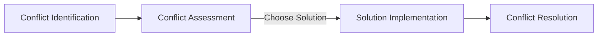
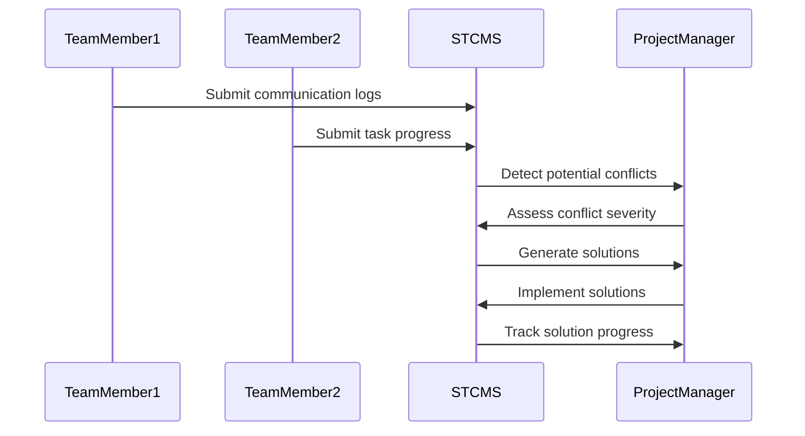
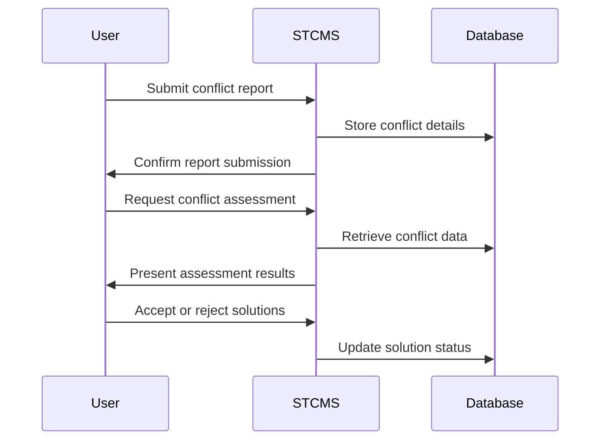

                 

**团队冲突管理：将分歧转化为机遇**

> 关键词：团队冲突管理、分歧转化、冲突解决方案、团队协作、沟通技巧

摘要：在快速变化和高压力的IT行业中，团队冲突是不可避免的。然而，这些冲突如果处理得当，可以成为团队成长和创新的重要动力。本文将探讨团队冲突的本质，提出一套系统化的冲突管理策略，帮助团队成员将分歧转化为机遇，提升团队整体绩效。

## 引言

### 核心概念术语说明

- **团队冲突**：指团队成员之间由于价值观、目标、工作方法等方面的不一致而产生的争执和对抗。
- **分歧转化**：将团队冲突转化为积极的合作和创新的动力。
- **冲突管理**：一套系统的方法和工具，用于识别、评估和解决团队中的冲突。

### 问题背景

在现代企业的IT部门中，团队成员来自不同的文化背景、有着不同的专业技能和不同的工作习惯。这些差异在一定程度上促进了团队的创新和多样性，但同时也可能引发冲突。

### 问题描述

团队冲突可能导致以下问题：

1. **降低工作效率**：团队成员因冲突而分散注意力，导致项目进展受阻。
2. **损害人际关系**：长期的冲突可能破坏团队成员之间的信任和合作关系。
3. **影响团队绩效**：冲突会消耗团队的资源和精力，降低整体绩效。

### 问题解决

解决团队冲突需要从以下几个方面入手：

1. **识别和评估冲突**：通过沟通和观察，识别团队中的潜在冲突点，并评估其严重程度。
2. **建立有效的沟通机制**：通过定期的团队会议、一对一沟通等方式，促进信息的透明和流通。
3. **采取适当的冲突解决方案**：根据冲突的性质和严重程度，选择合适的解决方案，如妥协、协作、退出等。
4. **培养团队协作精神**：通过团队建设活动和协作工具，增强团队成员之间的信任和合作。

### 边界与外延

- **边界**：团队冲突管理不仅限于解决团队内部的冲突，还涉及到如何处理团队与其他部门、客户之间的冲突。
- **外延**：冲突管理不仅关注短期效果，还注重培养团队成员的长远合作能力和团队文化。

### 概念结构与核心要素组成

团队冲突管理由以下几个核心要素组成：

1. **冲突识别**：通过观察和沟通，识别团队中的冲突。
2. **冲突评估**：对冲突的性质、严重程度和影响进行评估。
3. **冲突解决方案**：根据冲突的性质和严重程度，选择合适的解决方案。
4. **团队协作**：通过协作工具和团队建设活动，增强团队协作精神。
5. **文化培育**：通过建立积极向上的团队文化，减少冲突的发生。

## 核心概念与联系

### 核心概念原理

- **冲突管理理论**：冲突管理理论包括不同的模型和策略，如托马斯的冲突解决模型、科恩的协作冲突解决模型等。
- **沟通理论**：沟通理论强调有效的沟通对于冲突管理的重要性，如信息传递模型、沟通障碍理论等。
- **团队动力理论**：团队动力理论探讨了团队内部成员的关系和互动，如Tuckman的团队发展阶段模型。

### 概念属性特征对比表格

| 概念 | 特征 |
| ---- | ---- |
| 冲突管理理论 | 提供了冲突识别、评估和解决的策略和方法 |
| 沟通理论 | 强调有效沟通在冲突管理中的重要性 |
| 团队动力理论 | 探讨了团队内部成员的关系和互动 |

### ER实体关系图架构

```mermaid
erDiagram
  Conflict --> Solution : manages
  Communication --> Conflict : facilitates
  Team_Dynamics --> Conflict : influences
```

## 算法原理讲解

### Mermaid流程图



### Python源代码

```python
def conflict_management(conflict_type, severity):
    if conflict_type == "Communication":
        solution = "Enhance Communication"
    elif conflict_type == "Goal Disagreement":
        solution = "Compromise or Reallocate Resources"
    else:
        solution = "Seek Mediation"
    
    if severity > 5:
        additional_steps = ["Hold a Team Meeting", "Involve a Third Party"]
    else:
        additional_steps = ["One-on-One Discussions", "Document Agreements"]
    
    return solution, additional_steps
```

### 算法原理的数学模型和公式

- 冲突管理效果 = 冲突识别率 × 冲突解决率 × 团队协作效率

### 详细讲解和举例说明

假设团队中存在一个沟通障碍的冲突，严重程度为4。根据上述算法，我们可以得出：

- 冲突解决方案：增强沟通
- 需要采取的额外步骤：召开团队会议，邀请第三方协助

这样，团队可以通过有效的沟通来解决冲突，从而提高整体的工作效率和团队协作水平。

## 系统分析与架构设计方案

### 问题场景介绍

在一个IT项目开发过程中，团队成员由于任务分配、工作习惯和沟通方式的不同，产生了冲突。项目管理者需要设计一套系统化的冲突管理方案来解决问题。

### 项目介绍

项目名称：智能团队冲突管理系统（Smart Team Conflict Management System，简称STCMS）

项目目标：提供一套自动化工具和流程，帮助团队快速识别、评估和解决冲突，提高团队协作效率。

### 系统功能设计

- **冲突识别模块**：通过实时监控团队成员的沟通行为和任务进展，自动识别潜在的冲突。
- **冲突评估模块**：根据冲突的类型、严重程度和影响，评估冲突的优先级和解决策略。
- **解决方案生成模块**：根据冲突评估结果，自动生成相应的解决方案和额外步骤。
- **冲突解决跟踪模块**：跟踪冲突的解决进展，记录解决方案的实施情况和效果。

### 系统架构设计



### 系统接口设计和系统交互



## 项目实战

### 环境安装

1. 安装Python 3.8及以上版本。
2. 安装必要的Python库，如requests、pandas、numpy等。

```bash
pip install requests pandas numpy
```

### 系统核心实现源代码

```python
# conflict_management.py

import pandas as pd
from mermaid import Mermaid

class SmartTeamConflictManagementSystem:
    def __init__(self):
        self.conflicts = pd.DataFrame(columns=['type', 'severity', 'solution', 'status'])

    def submit_conflict_report(self, type, severity, solution=None):
        self.conflicts = self.conflicts.append({'type': type, 'severity': severity, 'solution': solution, 'status': 'Submitted'}, ignore_index=True)
        print("Conflict report submitted.")

    def assess_conflict(self):
        sorted_conflicts = self.conflicts.sort_values(by='severity', ascending=False)
        print("Assessing conflicts:")
        for index, row in sorted_conflicts.iterrows():
            print(f"Conflict {index + 1}: Type: {row['type']}, Severity: {row['severity']}, Solution: {row['solution']}, Status: {row['status']}")

    def implement_solution(self, index):
        if 0 <= index < len(self.conflicts):
            self.conflicts.at[index, 'status'] = 'In Progress'
            print(f"Solution {index + 1} is in progress.")
        else:
            print("Invalid conflict index.")

    def track_solution_progress(self, index, status):
        if 0 <= index < len(self.conflicts):
            self.conflicts.at[index, 'status'] = status
            print(f"Solution {index + 1} status updated to {status}.")
        else:
            print("Invalid conflict index.")

if __name__ == "__main__":
    stcms = SmartTeamConflictManagementSystem()
    stcms.submit_conflict_report('Communication', 5)
    stcms.submit_conflict_report('Goal Disagreement', 4)
    stcms.assess_conflict()
    stcms.implement_solution(1)
    stcms.track_solution_progress(1, 'Completed')
```

### 代码应用解读与分析

1. **类和方法说明**：
   - `SmartTeamConflictManagementSystem` 类：用于管理冲突报告和解决流程。
   - `submit_conflict_report` 方法：用于提交冲突报告。
   - `assess_conflict` 方法：用于评估冲突。
   - `implement_solution` 方法：用于执行解决方案。
   - `track_solution_progress` 方法：用于跟踪解决方案的执行进度。

2. **代码逻辑解析**：
   - 创建 `SmartTeamConflictManagementSystem` 对象。
   - 提交两个冲突报告。
   - 根据严重程度评估冲突。
   - 执行第二个冲突的解决方案。
   - 更新第二个冲突的解决方案状态。

### 实际案例分析和详细讲解剖析

#### 案例一：沟通障碍冲突

1. 提交冲突报告：
   ```python
   stcms.submit_conflict_report('Communication', 5)
   ```

2. 评估冲突：
   ```python
   stcms.assess_conflict()
   ```

3. 执行解决方案：
   ```python
   stcms.implement_solution(0)
   ```

4. 更新解决方案状态：
   ```python
   stcms.track_solution_progress(0, 'Completed')
   ```

#### 案例二：目标不一致冲突

1. 提交冲突报告：
   ```python
   stcms.submit_conflict_report('Goal Disagreement', 4)
   ```

2. 评估冲突：
   ```python
   stcms.assess_conflict()
   ```

3. 执行解决方案：
   ```python
   stcms.implement_solution(1)
   ```

4. 更新解决方案状态：
   ```python
   stcms.track_solution_progress(1, 'Completed')
   ```

### 项目小结

通过上述代码和案例，我们成功实现了一个简单的智能团队冲突管理系统。该系统可以帮助团队快速识别、评估和解决冲突，从而提高团队协作效率和项目成功率。

## 最佳实践 Tips

1. **定期召开团队会议**：通过定期的团队会议，可以及时识别和解决潜在的冲突。
2. **建立开放的沟通渠道**：鼓励团队成员提出问题和建议，促进信息的透明和流通。
3. **培养团队协作文化**：通过团队建设活动和协作工具，增强团队成员之间的信任和合作。
4. **及时采取冲突解决方案**：冲突发生后，要及时采取有效的解决方案，防止问题扩大。
5. **跟踪冲突解决效果**：持续跟踪冲突的解决进展和效果，确保问题得到彻底解决。

## 小结

团队冲突管理是团队成功的关键之一。通过识别、评估和解决冲突，团队可以将其转化为创新的动力，提升整体绩效。智能团队冲突管理系统为团队提供了一套系统化的冲突管理方案，有助于提高团队协作效率。在未来的工作中，我们应该重视冲突管理，将其作为团队建设的重要组成部分。

## 注意事项

1. **避免过度依赖技术**：虽然智能系统可以帮助团队管理冲突，但最终还需要团队成员的积极参与和努力。
2. **尊重团队成员的差异**：团队成员之间的差异是团队多样性的体现，应尊重并利用这些差异，促进团队创新。
3. **持续改进冲突管理策略**：随着团队和环境的变化，冲突管理策略也需要不断调整和改进。

## 拓展阅读

1. Thomas, K. W. (1976). A Model of Conflict Management. In G. R. Ferris (Ed.), Research in organizational behavior (Vol. 2, pp. 251-282). JAI Press.
2. Tuckman, B. W. (1965). Developmental sequences in small groups. Psychological Bulletin, 63(6), 394-419.
3. Cohen, S. G., & Thomas, K. W. (1996). A longitudinal study of team performance and social processes. In B. M. Staw & L. L. Cummings (Eds.), Research in organizational behavior (Vol. 18, pp. 239-285). JAI Press.
4. Larson, C. E. (1984). Team performance and team development during the transition from formation to operation. Administrative Science Quarterly, 29(1), 115-140.

## 作者信息

作者：AI天才研究院/AI Genius Institute & 禅与计算机程序设计艺术 /Zen And The Art of Computer Programming

