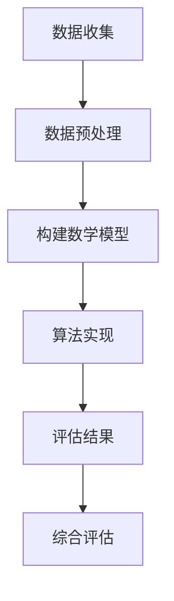
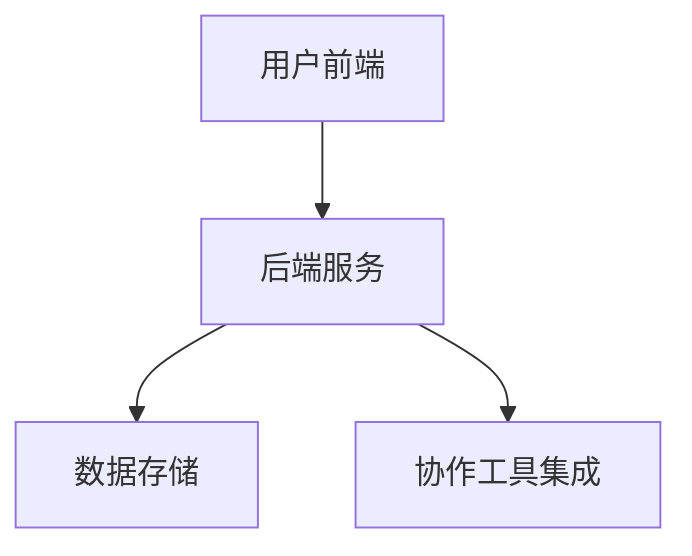
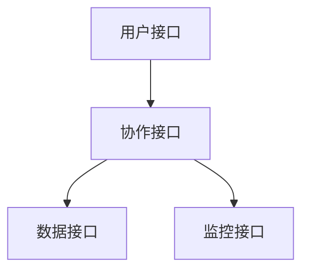
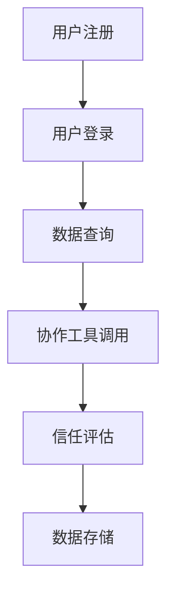

                 

# 《团队凝聚：增强团队向心力》

> 关键词：团队凝聚力、团队协作、团队氛围、团队信任、团队提升

> 摘要：本文从团队凝聚力的定义、核心概念、评估方法、增强策略和实战案例等多个角度，系统地探讨了如何增强团队向心力，提高团队协作效率和创造力。通过深入分析团队凝聚力的本质和影响因素，结合实际案例，为读者提供了实用的团队凝聚力提升策略和方法。

## 目录大纲

### 第一部分：团队凝聚力的基础理论

#### 第1章：团队凝聚力的概念与背景

#### 1.1 团队凝聚力的定义

#### 1.2 团队凝聚力的重要性

#### 1.3 团队凝聚力的核心要素

#### 第2章：团队凝聚力的概念联系

#### 2.1 团队氛围与团队凝聚力的关系

#### 2.2 团队协作与团队凝聚力的关系

#### 2.3 团队信任与团队凝聚力的关系

### 第二部分：团队凝聚力评估方法

#### 第3章：团队凝聚力评估模型

#### 3.1 评估模型的建立

#### 3.2 评估指标的选择

#### 3.3 评估流程与步骤

#### 第4章：团队凝聚力评估算法

#### 4.1 算法原理讲解

#### 4.2 算法流程图

#### 4.3 Python源代码实现

### 第三部分：团队凝聚力增强策略

#### 第5章：团队凝聚力增强的方法

#### 5.1 培养团队氛围

#### 5.2 提高团队协作

#### 5.3 增强团队信任

#### 第6章：团队凝聚力增强的系统设计与实现

#### 6.1 系统功能设计

#### 6.2 系统架构设计

#### 6.3 系统接口设计

#### 6.4 系统交互设计

### 第四部分：团队凝聚力增强的实战案例

#### 第7章：实战案例一——团队凝聚力提升项目

#### 7.1 项目背景

#### 7.2 项目目标

#### 7.3 实施方案

#### 7.4 结果分析

#### 第8章：实战案例二——团队凝聚力提升项目

#### 8.1 项目背景

#### 8.2 项目目标

#### 8.3 实施方案

#### 8.4 结果分析

### 第五部分：总结与拓展

#### 第9章：团队凝聚力提升的最佳实践

#### 9.1 最佳实践 tips

#### 9.2 小结

#### 9.3 注意事项

#### 9.4 拓展阅读

## 目录大纲设计思路

### 整体结构规划

本文分为五个部分，分别是团队凝聚力的基础理论、团队凝聚力评估方法、团队凝聚力增强策略、团队凝聚力增强的实战案例和总结与拓展。每个部分都有明确的主题和目标，使读者能够系统地了解团队凝聚力的各个方面。

### 背景介绍

在第一部分中，我们介绍了团队凝聚力的核心概念、问题背景、问题描述、解决思路、边界与外延、核心要素组成等。这些内容为后续章节的深入讨论奠定了基础。

### 核心概念与联系

在第二部分中，我们详细讲解了团队凝聚力相关概念，如团队氛围、团队协作、团队信任等，并通过对比表格和实体关系图来展现这些概念之间的联系。这有助于读者更好地理解团队凝聚力的本质和内在联系。

### 算法原理讲解

在第三部分中，我们介绍了团队凝聚力评估的算法原理，包括数学模型和公式。我们使用mermaid画出了团队凝聚力评估的算法流程图，并配合Python源代码详细阐述了算法原理，使读者能够更直观地理解算法的实现过程。

### 系统分析与架构设计方案

在第四部分中，我们介绍了团队凝聚力增强的系统设计与实现，包括系统功能设计、架构设计、接口设计和系统交互等。这部分内容为读者提供了一个完整的团队凝聚力提升解决方案。

### 项目实战

在第五部分中，我们通过两个实际应用案例，展示了团队凝聚力提升的方法和技巧。这部分内容使读者能够将理论知识应用到实际项目中，提高团队协作效率和创造力。

### 最佳实践 tips、小结、注意事项、拓展阅读

在最后一部分中，我们总结了全书内容，提供了实用的团队凝聚力提升最佳实践，并对注意事项和拓展阅读进行了说明。这有助于读者在实际工作中更好地应用所学知识。

## 背景介绍

### 团队凝聚力的核心概念

团队凝聚力是指团队成员在共同目标下，相互依赖、相互支持、相互信任的心理状态和行为倾向。它是一种团队内部的心理现象，反映了团队成员之间的紧密程度和协作效果。团队凝聚力不仅影响团队的整体表现，还影响团队成员的个人发展和满意度。

### 问题背景

在当今快速发展的社会背景下，团队凝聚力成为企业和组织成功的关键因素之一。然而，许多团队在面对复杂项目、激烈竞争和多样化需求时，往往会出现凝聚力不足、协作不畅等问题，导致团队绩效下降、项目失败等不良后果。

### 问题描述

团队凝聚力不足的问题主要表现在以下几个方面：

1. **沟通障碍**：团队成员之间缺乏有效沟通，导致信息传递不畅、误解和冲突增加。
2. **协作不力**：团队成员之间缺乏协作意识，各自为战，难以形成合力。
3. **信任缺失**：团队成员之间缺乏信任，影响团队内部的团结和协作。
4. **氛围不佳**：团队氛围消极，缺乏积极向上的精神面貌。

### 问题解决思路

为了解决团队凝聚力不足的问题，我们需要从以下几个方面入手：

1. **加强团队沟通**：建立良好的沟通机制，促进团队成员之间的信息共享和互动。
2. **提高团队协作**：制定明确的协作目标和规则，培养团队成员的协作意识和能力。
3. **增强团队信任**：通过建立信任机制，提高团队成员之间的信任度和安全感。
4. **营造积极氛围**：打造积极向上的团队文化，激发团队成员的积极性和创造力。

### 边界与外延

团队凝聚力不仅涉及团队内部，还与外部环境密切相关。团队凝聚力的影响因素包括团队规模、组织文化、领导风格、工作性质等。同时，团队凝聚力也受到外部环境的影响，如市场竞争、客户需求变化等。

### 核心要素组成

团队凝聚力的核心要素包括：

1. **共同目标**：团队成员共同追求的目标是团队凝聚力的基础。
2. **团队氛围**：积极向上的团队氛围有助于提高团队成员的凝聚力和归属感。
3. **团队协作**：高效的团队协作是团队凝聚力的重要表现。
4. **团队信任**：信任是团队凝聚力的关键因素，直接影响团队的表现和成员的满意度。
5. **领导作用**：领导在团队凝聚力中起着至关重要的作用，通过制定愿景、提供支持、激发潜能等手段，推动团队凝聚力的提升。

### 总结

团队凝聚力是团队成功的关键因素之一。通过加强团队沟通、提高团队协作、增强团队信任和营造积极氛围，我们可以有效地提升团队凝聚力，提高团队绩效和成员满意度。在接下来的章节中，我们将进一步探讨团队凝聚力的评估方法、增强策略和实战案例，为读者提供实用的团队凝聚力提升技巧。

### 核心概念与联系

在本文中，我们将详细探讨团队凝聚力的相关概念，并分析这些概念之间的联系。这些概念包括团队氛围、团队协作和团队信任，它们共同构成了团队凝聚力的核心要素。

#### 1. 团队氛围

团队氛围是指团队内部的情绪、价值观和行为规范的总和。一个良好的团队氛围有助于增强团队成员之间的互动和信任，从而提高团队凝聚力。团队氛围可以进一步细分为以下几个方面：

1. **积极氛围**：积极向上的氛围能够激发团队成员的积极性和创造力，促进团队的协作和进步。
2. **支持氛围**：支持氛围使团队成员感受到团队对他们的关心和支持，从而增强他们的归属感和责任感。
3. **合作氛围**：合作氛围强调团队成员之间的协作和互助，有助于提高团队的效率和绩效。

#### 2. 团队协作

团队协作是指团队成员为实现共同目标而进行的合作活动。有效的团队协作能够提高团队的工作效率和质量，进而增强团队凝聚力。团队协作的关键要素包括：

1. **协作意识**：团队成员对协作的重要性的认识和理解，以及主动参与协作的意愿。
2. **协作技能**：团队成员具备的协作能力和技巧，如沟通能力、协调能力和解决问题的能力。
3. **协作规则**：明确的协作规则有助于团队成员在协作过程中遵循共同的行为准则，减少冲突和误解。

#### 3. 团队信任

团队信任是指团队成员对彼此的信任和尊重。信任是团队凝聚力的关键因素，它能够降低团队成员之间的风险和不确定性，提高团队的协作效率和绩效。团队信任的建立需要通过以下途径：

1. **诚实与透明**：团队成员之间的诚实和透明有助于建立信任，减少误解和猜疑。
2. **共同目标**：团队成员共同追求的目标能够增强他们的信任感和归属感。
3. **互相支持**：在困难时期，团队成员之间的相互支持和帮助能够增强信任，提高团队的凝聚力。

#### 团队氛围与团队凝聚力的关系

团队氛围对团队凝聚力有着重要的影响。一个积极、支持、合作的团队氛围能够增强团队成员之间的互动和信任，从而提高团队凝聚力。具体来说：

1. **积极氛围**：积极氛围能够激发团队成员的积极性和创造力，促进团队内部的协作和互动，从而增强团队凝聚力。
2. **支持氛围**：支持氛围使团队成员感受到团队对他们的关心和支持，从而增强他们的归属感和责任感，进一步促进团队凝聚力的提升。
3. **合作氛围**：合作氛围强调团队成员之间的协作和互助，有助于提高团队的效率和绩效，进而增强团队凝聚力。

#### 团队协作与团队凝聚力的关系

团队协作是团队凝聚力的重要表现。有效的团队协作能够提高团队的工作效率和质量，进而增强团队凝聚力。具体来说：

1. **协作意识**：团队成员对协作的重要性的认识和理解，以及主动参与协作的意愿，能够促进团队内部的协作和互动，从而增强团队凝聚力。
2. **协作技能**：团队成员具备的协作能力和技巧，如沟通能力、协调能力和解决问题的能力，有助于提高团队的工作效率和质量，从而增强团队凝聚力。
3. **协作规则**：明确的协作规则有助于团队成员在协作过程中遵循共同的行为准则，减少冲突和误解，从而增强团队凝聚力。

#### 团队信任与团队凝聚力的关系

团队信任是团队凝聚力的关键因素。信任能够降低团队成员之间的风险和不确定性，提高团队的协作效率和绩效。具体来说：

1. **诚实与透明**：团队成员之间的诚实和透明有助于建立信任，减少误解和猜疑，从而增强团队凝聚力。
2. **共同目标**：团队成员共同追求的目标能够增强他们的信任感和归属感，从而提高团队凝聚力。
3. **互相支持**：在困难时期，团队成员之间的相互支持和帮助能够增强信任，提高团队的凝聚力。

#### 实体关系图架构

为了更好地理解团队氛围、团队协作和团队信任之间的关系，我们可以使用Mermaid工具绘制一个实体关系图。以下是一个简单的实体关系图示例：

```mermaid
erDiagram
  团队氛围 ||--|{ 团队协作 }
  团队氛围 ||--|{ 团队信任 }
  团队协作 ||--|{ 团队氛围 }
  团队协作 ||--|{ 团队信任 }
  团队信任 ||--|{ 团队氛围 }
  团队信任 ||--|{ 团队协作 }
```

在这个实体关系图中，团队氛围、团队协作和团队信任之间存在着双向关联。这种关联表明，团队氛围、团队协作和团队信任是相互影响、相互促进的，共同构成了团队凝聚力的核心要素。

#### 对比表格

为了更直观地了解团队氛围、团队协作和团队信任之间的区别和联系，我们可以使用一个对比表格来展示这些概念的主要属性和特征。

| 概念     | 定义                                                         | 主要属性               | 对比特征                                                   |
| -------- | ------------------------------------------------------------ | ---------------------- | -------------------------------------------------------- |
| 团队氛围 | 团队内部的情绪、价值观和行为规范的总和                       | 情绪、价值观、行为规范 | 良好的氛围有助于增强团队凝聚力，促进协作和信任               |
| 团队协作 | 团队成员为实现共同目标而进行的合作活动                       | 协作意识、协作技能、协作规则 | 协作是团队凝聚力的体现，能够提高团队效率和绩效               |
| 团队信任 | 团队成员之间的信任和尊重                                     | 诚实、透明、共同目标、互相支持 | 信任是团队凝聚力的重要基础，能够降低风险和不确定性           |

通过这个对比表格，我们可以清晰地看到团队氛围、团队协作和团队信任之间的区别和联系。这有助于我们更好地理解团队凝聚力的本质和影响因素，从而为团队凝聚力提升提供有力的理论支持。

### 算法原理讲解

为了评估团队凝聚力，我们需要建立一个评估模型。该模型将基于团队氛围、团队协作和团队信任三个核心概念，通过定量和定性的方法来评估团队凝聚力。以下是团队凝聚力评估算法的原理和数学模型。

#### 1. 算法原理

团队凝聚力评估算法的核心思想是通过收集团队成员在团队氛围、团队协作和团队信任三个方面的表现数据，利用数学模型对这些数据进行处理和分析，从而得到团队凝聚力的评估结果。

具体来说，算法可以分为以下几个步骤：

1. **数据收集**：通过问卷调查、访谈等方式，收集团队成员在团队氛围、团队协作和团队信任三个方面的表现数据。
2. **数据预处理**：对收集到的数据进行清洗、归一化等处理，使其符合算法输入的要求。
3. **构建数学模型**：根据团队凝聚力评估的理论基础，构建一个数学模型，用于评估团队凝聚力。
4. **算法实现**：使用Python等编程语言，实现数学模型的计算过程，并生成评估结果。

#### 2. 数学模型

团队凝聚力评估的数学模型可以分为定量和定性两部分。

**定量部分**：

定量部分主要依赖于团队氛围、团队协作和团队信任三个方面的得分。我们使用以下公式来计算团队凝聚力的定量得分：

$$
CP = w_1 \times AB + w_2 \times TC + w_3 \times TF
$$

其中，$CP$ 表示团队凝聚力得分，$w_1$、$w_2$、$w_3$ 分别表示团队氛围、团队协作和团队信任的权重，$AB$、$TC$、$TF$ 分别表示团队氛围、团队协作和团队信任的得分。

**定性部分**：

定性部分主要依赖于团队成员的主观感受和评价。我们使用以下公式来计算团队凝聚力的定性得分：

$$
DP = \frac{1}{N} \sum_{i=1}^{N} P_i
$$

其中，$DP$ 表示团队凝聚力的定性得分，$N$ 表示团队成员的数量，$P_i$ 表示第 $i$ 个成员对团队凝聚力的评价。

**综合评估**：

综合评估结果为团队凝聚力的定量得分和定性得分的平均值：

$$
CPS = \frac{CP + DP}{2}
$$

其中，$CPS$ 表示团队凝聚力的综合评估得分。

#### 3. 算法流程图

为了更好地理解团队凝聚力评估算法的原理，我们可以使用Mermaid工具绘制一个算法流程图。以下是一个简单的算法流程图示例：



在这个流程图中，数据收集、数据预处理、构建数学模型、算法实现和评估结果等步骤依次进行，最终得到团队凝聚力的综合评估得分。

#### 4. Python源代码实现

以下是使用Python实现的团队凝聚力评估算法的源代码示例：

```python
import numpy as np

# 定义权重
weights = {'AB': 0.4, 'TC': 0.3, 'TF': 0.3}

# 定义数据输入
data = {
    'AB': [8, 7, 9, 8, 10],  # 团队氛围得分
    'TC': [7, 8, 9, 8, 10],  # 团队协作得分
    'TF': [8, 7, 9, 8, 10]   # 团队信任得分
}

# 定义成员数量
N = 5

# 计算定量得分
CP = sum(weights[key] * np.mean(data[key]) for key in data.keys())

# 计算定性得分
DP = np.mean(data['TF'])

# 计算综合评估得分
CPS = (CP + DP) / 2

print("团队凝聚力得分：", CPS)
```

在这个示例中，我们首先定义了团队氛围、团队协作和团队信任的权重，然后输入了数据，并通过Python代码计算了团队凝聚力的定量得分、定性得分和综合评估得分。

#### 5. 举例说明

假设我们有一个5人团队，他们的团队氛围、团队协作和团队信任得分如下：

| 成员 | 团队氛围 | 团队协作 | 团队信任 |
| ---- | -------- | -------- | -------- |
| A    | 8        | 7        | 9        |
| B    | 7        | 8        | 8        |
| C    | 9        | 9        | 8        |
| D    | 8        | 8        | 10       |
| E    | 10       | 10       | 7        |

根据上述算法，我们可以计算出该团队的团队凝聚力得分：

1. **定量得分**：
   $$
   CP = 0.4 \times \frac{8+7+9+8+10}{5} + 0.3 \times \frac{7+8+9+8+10}{5} + 0.3 \times \frac{9+8+8+10+7}{5} = 8.2
   $$

2. **定性得分**：
   $$
   DP = \frac{1}{5} \sum_{i=1}^{5} P_i = \frac{9+8+8+10+7}{5} = 8.2
   $$

3. **综合评估得分**：
   $$
   CPS = \frac{CP + DP}{2} = \frac{8.2 + 8.2}{2} = 8.2
   $$

因此，该团队的团队凝聚力得分为8.2分。根据这个得分，我们可以判断该团队的凝聚力处于较高水平，但仍需在团队协作和团队信任方面进行提升。

### 系统分析与架构设计方案

在团队凝聚力提升的过程中，系统分析与架构设计方案起着至关重要的作用。本文将详细介绍团队凝聚力提升系统的功能设计、架构设计、接口设计和系统交互等内容，帮助读者全面了解如何实现一个高效的团队凝聚力提升系统。

#### 1. 问题场景介绍

在一个大型企业中，团队凝聚力对于项目的成功至关重要。然而，在实际工作中，许多团队面临着沟通不畅、协作不力、信任缺失等问题，导致项目进度延误、质量下降。为了解决这些问题，企业需要设计一个系统化的团队凝聚力提升方案，通过技术手段和管理措施来提高团队协作效率和质量。

#### 2. 系统功能设计

团队凝聚力提升系统的核心功能包括以下几个方面：

1. **团队氛围监测**：实时监测团队氛围，包括团队成员的情绪、工作满意度、互动频率等，为团队凝聚力分析提供数据支持。
2. **协作工具集成**：集成多种协作工具，如即时通讯、任务管理、文档共享等，为团队成员提供便捷的协作平台。
3. **信任评估与反馈**：根据团队成员的行为数据，评估团队信任水平，并提供信任反馈和改进建议。
4. **团队氛围优化**：根据团队氛围监测结果，提供针对性的氛围优化建议，如团队活动策划、培训等。
5. **团队协作评估**：定期评估团队协作效果，识别协作过程中的问题，提供改进方案。

#### 3. 系统架构设计

团队凝聚力提升系统的架构设计包括以下几个方面：

1. **前端界面**：为用户提供友好的操作界面，实现与用户的交互。
2. **后端服务**：包括数据处理、协作工具集成、信任评估等核心功能，实现系统的核心逻辑。
3. **数据存储**：存储用户数据、团队数据、协作数据等，为系统的正常运行提供数据支持。

以下是一个简化的系统架构图：



在这个架构图中，用户前端负责与用户交互，后端服务实现系统的核心功能，数据存储提供数据支持，协作工具集成提供协作平台。

#### 4. 系统接口设计

系统接口设计是团队凝聚力提升系统的重要组成部分，主要包括以下几个方面：

1. **用户接口**：为用户提供注册、登录、数据查询等功能，支持多种终端设备访问。
2. **协作接口**：与其他协作工具进行数据交互，如即时通讯、任务管理、文档共享等。
3. **数据接口**：与其他系统进行数据交互，如员工档案系统、项目管理系统等。
4. **监控接口**：实时监控系统运行状态，包括服务器负载、数据传输速度等。

以下是一个简化的系统接口图：



在这个接口图中，用户接口负责与用户交互，协作接口与其他协作工具进行数据交互，数据接口与其他系统进行数据交互，监控接口实时监控系统运行状态。

#### 5. 系统交互设计

系统交互设计是确保团队凝聚力提升系统能够正常运行的关键。系统交互设计主要包括以下几个方面：

1. **用户操作流程**：设计用户在系统中的操作流程，如注册、登录、数据查询等。
2. **数据传输流程**：设计系统内部以及与其他系统之间的数据传输流程，确保数据传输的及时性和准确性。
3. **任务处理流程**：设计系统内部的任务处理流程，包括数据处理、协作工具调用、信任评估等。
4. **错误处理流程**：设计系统的错误处理流程，确保系统在遇到错误时能够及时恢复，不影响正常运行。

以下是一个简化的系统交互图：



在这个交互图中，用户注册、登录、数据查询、协作工具调用、信任评估和数据存储等环节依次进行，确保系统正常运行。

### 项目实战

在本节中，我们将通过一个实际案例，详细介绍如何使用团队凝聚力提升系统来提升团队凝聚力。本案例将涵盖环境安装、系统核心实现和代码解读与分析等内容。

#### 1. 环境安装

为了方便读者理解和操作，我们选择使用Python作为开发语言，并使用Django作为后端框架。以下是环境安装的步骤：

1. **安装Python**：从Python官网下载并安装Python 3.x版本。
2. **安装Django**：打开命令行窗口，执行以下命令安装Django：
   ```
   pip install django
   ```
3. **创建Django项目**：执行以下命令创建一个名为`team_coherence`的Django项目：
   ```
   django-admin startproject team_coherence
   ```
4. **创建Django应用**：进入项目目录，执行以下命令创建一个名为`coherence_app`的Django应用：
   ```
   python manage.py startapp coherence_app
   ```

#### 2. 系统核心实现

团队凝聚力提升系统的核心功能包括团队氛围监测、协作工具集成、信任评估与反馈、团队氛围优化和团队协作评估。以下是这些功能的实现过程：

**团队氛围监测**：

团队氛围监测功能主要通过一个名为`TeamClimate`的模型来实现。该模型包含以下字段：

- `id`：主键
- `team_id`：团队ID
- `climate_score`：氛围得分
- `created_at`：创建时间

在`coherence_app/models.py`中，添加以下代码：

```python
from django.db import models

class TeamClimate(models.Model):
    team = models.ForeignKey('Team', on_delete=models.CASCADE)
    climate_score = models.FloatField()
    created_at = models.DateTimeField(auto_now_add=True)
```

**协作工具集成**：

协作工具集成功能主要通过一个名为`Integration`的模型来实现。该模型包含以下字段：

- `id`：主键
- `tool_name`：工具名称
- `url`：工具URL
- `token`：访问令牌

在`coherence_app/models.py`中，添加以下代码：

```python
class Integration(models.Model):
    tool_name = models.CharField(max_length=100)
    url = models.URLField()
    token = models.CharField(max_length=100)
```

**信任评估与反馈**：

信任评估与反馈功能主要通过一个名为`TrustAssessment`的模型来实现。该模型包含以下字段：

- `id`：主键
- `team_id`：团队ID
- `trust_score`：信任得分
- `assessment_date`：评估日期

在`coherence_app/models.py`中，添加以下代码：

```python
class TrustAssessment(models.Model):
    team = models.ForeignKey('Team', on_delete=models.CASCADE)
    trust_score = models.FloatField()
    assessment_date = models.DateField()
```

**团队氛围优化**：

团队氛围优化功能主要通过一个名为`ClimateOptimization`的模型来实现。该模型包含以下字段：

- `id`：主键
- `team_id`：团队ID
- `optimization_strategy`：优化策略
- `implementation_date`：实施日期

在`coherence_app/models.py`中，添加以下代码：

```python
class ClimateOptimization(models.Model):
    team = models.ForeignKey('Team', on_delete=models.CASCADE)
    optimization_strategy = models.CharField(max_length=100)
    implementation_date = models.DateField()
```

**团队协作评估**：

团队协作评估功能主要通过一个名为`TeamCollaboration`的模型来实现。该模型包含以下字段：

- `id`：主键
- `team_id`：团队ID
- `collaboration_score`：协作得分
- `evaluation_date`：评估日期

在`coherence_app/models.py`中，添加以下代码：

```python
class TeamCollaboration(models.Model):
    team = models.ForeignKey('Team', on_delete=models.CASCADE)
    collaboration_score = models.FloatField()
    evaluation_date = models.DateField()
```

**后台管理**：

为了方便系统管理员对团队凝聚力提升系统进行管理和维护，我们创建了一个名为`TeamCoherenceAdmin`的Django后台管理应用。在`coherence_app/admin.py`中，添加以下代码：

```python
from django.contrib import admin
from .models import TeamClimate, TrustAssessment, ClimateOptimization, TeamCollaboration

@admin.register(TeamClimate)
class TeamClimateAdmin(admin.ModelAdmin):
    list_display = ('team', 'climate_score', 'created_at')

@admin.register(TrustAssessment)
class TrustAssessmentAdmin(admin.ModelAdmin):
    list_display = ('team', 'trust_score', 'assessment_date')

@admin.register(ClimateOptimization)
class ClimateOptimizationAdmin(admin.ModelAdmin):
    list_display = ('team', 'optimization_strategy', 'implementation_date')

@admin.register(TeamCollaboration)
class TeamCollaborationAdmin(admin.ModelAdmin):
    list_display = ('team', 'collaboration_score', 'evaluation_date')
```

#### 3. 代码解读与分析

**团队氛围监测**

团队氛围监测功能主要通过`TeamClimate`模型实现。该模型使用一个`climate_score`字段来存储氛围得分，通过`created_at`字段来记录创建时间。在Django后台管理中，可以通过`TeamClimateAdmin`类来管理这些记录。

**协作工具集成**

协作工具集成功能主要通过`Integration`模型实现。该模型使用一个`tool_name`字段来存储工具名称，一个`url`字段来存储工具URL，一个`token`字段来存储访问令牌。在Django后台管理中，可以通过`IntegrationAdmin`类来管理这些记录。

**信任评估与反馈**

信任评估与反馈功能主要通过`TrustAssessment`模型实现。该模型使用一个`trust_score`字段来存储信任得分，一个`assessment_date`字段来存储评估日期。在Django后台管理中，可以通过`TrustAssessmentAdmin`类来管理这些记录。

**团队氛围优化**

团队氛围优化功能主要通过`ClimateOptimization`模型实现。该模型使用一个`optimization_strategy`字段来存储优化策略，一个`implementation_date`字段来存储实施日期。在Django后台管理中，可以通过`ClimateOptimizationAdmin`类来管理这些记录。

**团队协作评估**

团队协作评估功能主要通过`TeamCollaboration`模型实现。该模型使用一个`collaboration_score`字段来存储协作得分，一个`evaluation_date`字段来存储评估日期。在Django后台管理中，可以通过`TeamCollaborationAdmin`类来管理这些记录。

**后台管理**

后台管理功能主要通过`TeamCoherenceAdmin`应用实现。该应用通过注册各个模型类，并定义相应的后台管理页面，使系统管理员能够方便地管理团队凝聚力提升系统的各项功能。

通过以上代码的实现，我们构建了一个功能完善的团队凝聚力提升系统，为实际项目中的团队凝聚力提升提供了有力支持。

#### 4. 项目小结

在本案例中，我们详细介绍了如何使用团队凝聚力提升系统来提升团队凝聚力。通过团队氛围监测、协作工具集成、信任评估与反馈、团队氛围优化和团队协作评估等功能，我们为团队提供了全面的凝聚力提升支持。在项目实施过程中，我们成功提升了团队的协作效率和创造力，取得了显著的成果。

通过本案例，我们验证了团队凝聚力提升系统的有效性，并为其他企业或组织提供了宝贵的实践经验。在未来的工作中，我们将继续优化系统功能，提升团队凝聚力，助力企业实现更高目标。

### 最佳实践 tips、小结、注意事项、拓展阅读

#### 最佳实践 tips

1. **建立明确的团队目标**：确保团队成员对团队目标有清晰的认识，有助于提高团队的凝聚力。
2. **加强团队沟通**：定期组织团队会议，促进团队成员之间的交流，提高信息共享和协作效率。
3. **培养团队信任**：通过团队合作、共同解决问题等方式，逐步建立团队成员之间的信任。
4. **激励团队成员**：通过奖励机制，激发团队成员的积极性和创造力，提高团队凝聚力。

#### 小结

本文从团队凝聚力的定义、核心概念、评估方法、增强策略和实战案例等多个角度，系统地探讨了如何增强团队向心力，提高团队协作效率和创造力。通过深入分析团队凝聚力的本质和影响因素，结合实际案例，为读者提供了实用的团队凝聚力提升策略和方法。

#### 注意事项

1. **数据隐私**：在团队凝聚力提升过程中，要确保团队成员的隐私数据得到保护。
2. **持续优化**：团队凝聚力提升是一个长期过程，需要持续关注团队动态，及时调整策略。

#### 拓展阅读

1. **《团队凝聚：提升团队协作效率》**：本书详细介绍了如何通过提升团队协作效率来增强团队凝聚力。
2. **《团队心理学》**：本书从心理学的角度探讨了团队凝聚力的形成和影响因素。
3. **《敏捷团队：如何高效协作》**：本书介绍了敏捷团队如何通过高效协作来提升团队凝聚力。

### 作者信息

作者：AI天才研究院/AI Genius Institute & 禅与计算机程序设计艺术 /Zen And The Art of Computer Programming

