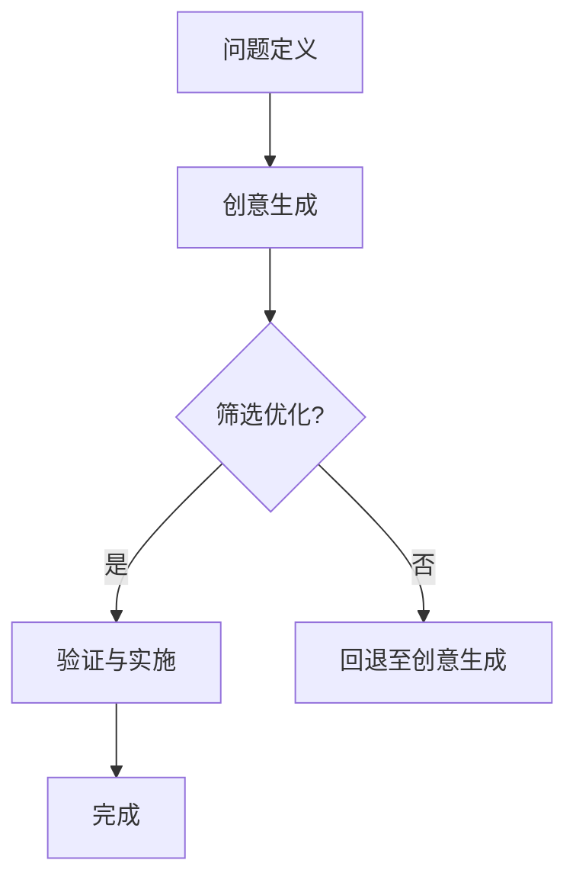
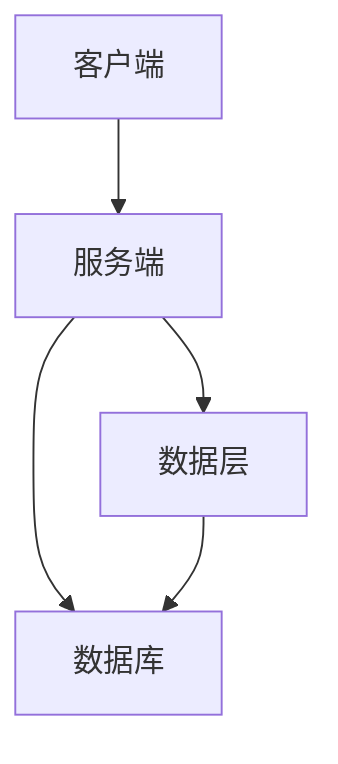
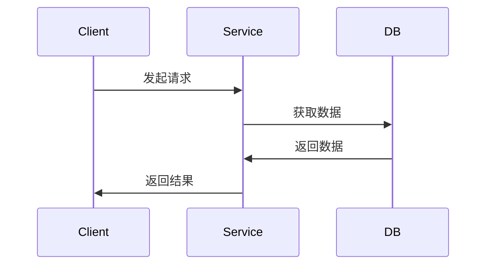
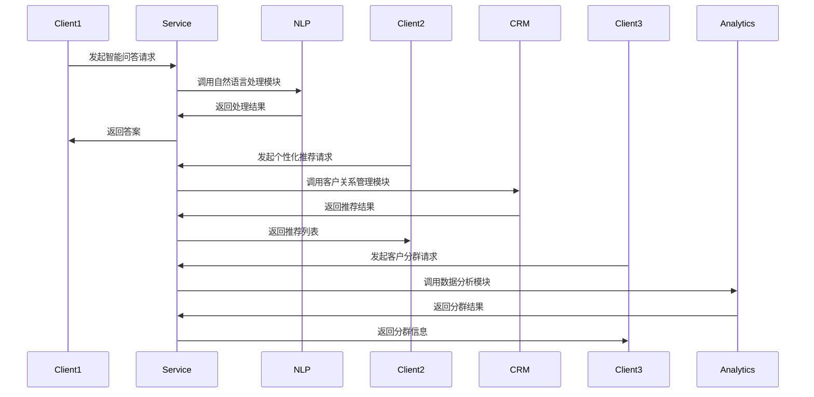

                 

### 引言

在当今这个快速变化和竞争激烈的时代，创新已经成为企业保持竞争优势和可持续发展的关键。无论是传统行业还是新兴行业，创新都是推动企业进步和发展的核心动力。因此，如何构建有效的团队创新机制，成为组织管理者关注的焦点。

本文将以《团队创新机制：激发持续创新的组织设计》为题，深入探讨团队创新机制的概念、原理、构成及其在组织设计中的应用。通过逻辑清晰、结构紧凑的分析，我们将一步一步剖析团队创新机制的内在逻辑，帮助读者理解如何通过组织设计激发持续创新。

### 关键词

1. 团队创新机制
2. 组织设计
3. 创新思维
4. 团队协作
5. 文化与价值观

### 摘要

本文旨在探讨团队创新机制及其在组织设计中的应用。首先，我们将回顾创新的重要性，并介绍团队创新机制的基本概念。接着，分析组织设计在创新中的作用，并提出关键要素。随后，我们将深入探讨团队创新的核心概念与原理，并通过具体的案例进行说明。文章最后，将总结全文，并提出一些最佳实践建议，以期为组织管理者提供有益的参考。

## 第一步：明确创新的重要性

创新，作为推动企业发展的重要引擎，其重要性不可忽视。从微观层面看，创新是企业在激烈竞争中脱颖而出的关键；从宏观层面看，创新是推动社会进步和经济增长的核心动力。以下将从定义、分类、价值及影响四个方面进行详细阐述。

### 1.1.1 创新的定义与分类

创新，广义上指的是通过新的想法、方法、产品或服务，创造出新的价值或提高现有价值的活动。根据创新的对象和方式，可以将创新分为以下几类：

1. **技术性创新**：通过新技术或新工艺的应用，提高产品或服务的性能和质量。
2. **市场性创新**：通过开辟新市场、创造新需求，实现产品或服务的商业化。
3. **组织性创新**：通过改进组织结构、管理模式和文化，提高组织的运营效率。

### 1.1.2 创新的价值与影响

创新的价值和影响体现在多个方面。首先，从企业层面看，创新可以提高企业的竞争力和市场占有率，进而实现盈利和增长。其次，从社会层面看，创新可以推动产业升级和转型，促进社会经济的持续健康发展。此外，创新还可以改善人们的生活质量，带来更多的便利和福祉。

具体而言，创新的影响包括：

1. **提高效率**：通过引入新技术和方法，提高生产效率和运营效率。
2. **降低成本**：通过优化流程和资源配置，降低生产和运营成本。
3. **提升客户满意度**：通过提供更具价值的产品和服务，满足客户需求，提高客户满意度。
4. **促进产业升级**：通过推动新技术和新产业的产生，促进产业结构调整和升级。
5. **推动社会进步**：通过解决社会问题和提升公共服务水平，推动社会进步。

综上所述，创新不仅是企业发展的关键，也是社会进步的重要推动力。因此，理解创新的重要性，对于企业和社会都具有重要的意义。

### 第二步：团队创新机制概述

在明确创新的重要性后，我们需要进一步了解团队创新机制的概念。团队创新机制是指通过一定的组织结构、文化氛围和激励机制，激发团队内部成员的创新思维和创造力，从而实现持续创新的过程。以下将从团队创新的概念和团队创新机制的作用两个方面进行阐述。

#### 2.1.1 团队创新的概念

团队创新是指在团队内部通过集体智慧和协作，创造出新想法、新产品或新服务的过程。与个体创新不同，团队创新强调的是团队合作和集体智慧。团队创新不仅涉及技术创新，还包括市场创新、管理创新等多种形式。

1. **集体智慧**：团队创新依赖于团队成员之间的协作和知识共享，通过集体智慧实现创新的突破。
2. **多元参与**：团队创新涉及不同背景、不同专业知识的团队成员，多元化的人才结构有助于激发创新的灵感。
3. **共同目标**：团队创新要求团队成员有共同的目标和使命感，共同努力实现创新目标。

#### 2.1.2 团队创新机制的定义与作用

团队创新机制是指通过一系列制度和措施，激发团队内部成员的创新意识和创造力，促进持续创新的过程。团队创新机制的作用主要包括：

1. **激发创新意识**：通过激励机制和文化氛围，激发团队成员的创新意识和积极性。
2. **促进知识共享**：通过协作平台和沟通机制，促进团队成员之间的知识共享和经验交流。
3. **提高创新效率**：通过优化工作流程和资源配置，提高团队创新的效率和成功率。
4. **形成创新文化**：通过持续的创新实践，逐步形成鼓励创新、宽容失败的组织文化。

具体来说，团队创新机制包括以下几个关键要素：

1. **组织结构**：合理的组织结构有助于团队创新，如扁平化管理、跨部门协作等。
2. **激励机制**：通过薪酬激励、荣誉奖励等方式，激发团队成员的创新动力。
3. **创新文化**：建立鼓励创新、包容失败的组织文化，营造积极的创新氛围。
4. **知识管理**：通过知识共享平台和培训机制，促进团队成员的知识积累和传递。
5. **创新流程**：建立科学、系统的创新流程，确保创新活动的规范和有效。

综上所述，团队创新机制是激发团队持续创新的关键，通过合理的组织设计和管理，可以有效地促进团队创新，推动企业和社会的发展。

### 第三步：组织设计在创新中的作用

在明确了团队创新机制的概念后，我们需要探讨组织设计在创新中的作用。组织设计不仅仅是一个结构问题，更是一个文化问题。合理的组织设计能够为团队创新提供有力的支持和保障。以下将从组织设计的概述和团队创新的关系两个方面进行分析。

#### 3.1.1 组织设计的概述

组织设计是指为了实现特定目标，对组织结构、文化、流程等进行规划和调整的过程。组织设计的基本目标是提高组织的效率和效果，使组织能够更好地适应外部环境和内部需求。组织设计通常包括以下几个方面：

1. **组织结构**：包括部门设置、职责分工、汇报关系等，直接影响组织的运作效率和协作能力。
2. **组织文化**：包括价值观、行为规范、激励机制等，对员工的行为和决策产生深远影响。
3. **工作流程**：包括工作流程设计、任务分配、工作协同等，直接影响组织的运作效率和问题解决能力。
4. **人力资源**：包括招聘、培训、绩效评估等，是组织创新和发展的核心资源。

#### 3.1.2 组织设计与团队创新的关系

组织设计在团队创新中扮演着重要的角色。合理的设计不仅能够为团队创新提供有力支持，还能够促进团队创新的有效进行。具体来说，组织设计与团队创新的关系主要体现在以下几个方面：

1. **组织结构**：扁平化的组织结构有助于缩短沟通路径，提高决策效率，促进团队成员之间的协作和创新。此外，跨部门协作的团队结构能够促进不同部门之间的知识共享和资源整合，激发创新的灵感。

2. **组织文化**：鼓励创新、宽容失败的组织文化能够为团队成员提供安全感和信心，使他们更加敢于尝试和探索。例如，Google 的“20% 时间自由项目”政策，允许员工将20%的工作时间用于自己感兴趣的创新项目，这一文化举措大大激发了员工的创造力。

3. **工作流程**：科学、规范的工作流程能够提高团队的工作效率，减少冗余和浪费，为创新提供更多的时间和资源。例如，通过敏捷开发方法，可以缩短产品的迭代周期，提高产品迭代的速度和质量。

4. **人力资源**：优秀的人力资源管理能够为团队创新提供人才保障。通过招聘、培训、绩效评估等手段，可以确保团队拥有具备创新能力和专业技能的成员。此外，通过激励机制，可以激发团队成员的创新动力，提高团队的创新能力。

综上所述，组织设计在团队创新中起着至关重要的作用。通过合理的组织设计，可以为团队创新提供有力支持，促进团队创新的顺利进行。因此，组织管理者需要重视组织设计，结合实际情况进行优化和调整，以激发团队的创新潜能。

### 第四步：团队创新机制的核心概念与原理

在理解了组织设计在团队创新中的作用后，我们需要深入探讨团队创新机制的核心概念与原理。团队创新机制不仅涉及创新思维的激发和团队协作的优化，还包括组织设计中的关键要素。以下将详细分析创新思维与方法、团队协作与创新、组织设计的关键要素以及创新机制的构成与运作。

#### 2.1 创新思维与方法

创新思维是团队创新的核心，它决定了团队能否在竞争中脱颖而出。创新思维通常包括以下几个方面：

1. **发散思维**：通过多角度、多维度思考问题，寻找不同的解决方案。
2. **收敛思维**：在发散思维的基础上，筛选和优化解决方案，形成具体的创新思路。
3. **逆向思维**：从相反的角度思考问题，寻找新的解决方案。
4. **联想思维**：通过事物之间的联系，产生新的创意和思路。

创新方法则是实现创新思维的具体手段，包括但不限于：

1. **头脑风暴法**：通过集体讨论，快速产生大量创意。
2. **思维导图法**：通过图形化方式，展示思维过程和创意。
3. **TRIZ方法**：基于解决矛盾问题的一套系统化方法，用于解决复杂的技术问题。
4. **六顶思考帽法**：通过不同颜色的帽子，代表不同的思考方式，进行全面的思维训练。

#### 2.2 团队协作与创新

团队协作是创新的重要保障，有效的团队协作能够提高创新的效率和质量。团队协作的基本原则包括：

1. **共同目标**：团队成员需要明确共同的目标，共同努力实现创新目标。
2. **信任与尊重**：团队成员之间需要建立信任，尊重彼此的意见和建议。
3. **沟通与反馈**：通过有效的沟通，确保信息传递的准确性和及时性，通过反馈，不断优化创新思路。
4. **分工与协作**：明确每个成员的职责，确保任务分工合理，通过协作，提高工作效率。

团队协作与创新的互动关系体现在以下几个方面：

1. **相互促进**：团队成员通过协作，可以相互启发，共同提高创新能力。
2. **资源整合**：团队协作可以实现资源的有效整合，提高创新的效率。
3. **风险分担**：团队协作可以分散创新风险，降低创新失败的概率。

#### 2.3 组织设计的关键要素

组织设计在团队创新中起着关键作用，其关键要素包括：

1. **组织结构**：合理的组织结构可以促进团队协作，提高创新效率。例如，扁平化的组织结构可以缩短沟通路径，提高决策效率。
2. **文化氛围**：积极的文化氛围可以激发团队成员的创新意识，营造良好的创新环境。例如，鼓励创新、宽容失败的文化可以降低创新的风险，提高团队成员的积极性。
3. **激励机制**：有效的激励机制可以激发团队成员的创新动力，提高创新能力。例如，通过薪酬激励、荣誉奖励等方式，可以激发团队成员的创造力和创新精神。
4. **知识管理**：通过知识管理，可以确保团队成员能够获取到所需的信息和知识，提高创新效率。例如，建立知识共享平台和培训机制，可以帮助团队成员不断提升自己的技能和知识。

#### 2.4 创新机制的构成与运作

创新机制的构成包括：

1. **创新理念**：明确创新的重要性，将创新作为组织的核心目标。
2. **组织结构**：建立适应创新需求的组织结构，如跨部门协作团队。
3. **文化氛围**：营造鼓励创新、宽容失败的文化氛围。
4. **激励机制**：建立有效的激励机制，如薪酬激励、荣誉奖励等。
5. **知识管理**：建立知识管理机制，确保团队成员能够获取到所需的信息和知识。

创新机制的运作包括以下几个步骤：

1. **问题识别**：通过市场调研、用户反馈等方式，识别创新的需求和机会。
2. **创意产生**：通过头脑风暴、思维导图等方式，产生大量的创意。
3. **筛选优化**：对创意进行筛选和优化，确定可行的创新方案。
4. **实施验证**：将创新方案实施并验证，不断优化和改进。

通过以上分析，我们可以看出，团队创新机制的核心概念和原理涉及到创新思维与方法、团队协作与创新、组织设计的关键要素以及创新机制的构成与运作。这些核心概念和原理为团队创新提供了理论指导和实践框架，有助于组织管理者更好地构建和优化团队创新机制，实现持续创新。

### 第五步：深入探讨团队创新机制的核心概念与联系

在了解了团队创新机制的核心概念和原理后，我们需要进一步探讨这些概念之间的内在联系，并分析它们如何共同作用于团队创新过程。以下将详细阐述创新思维、团队协作与组织设计之间的关系，并通过对比表格和ER实体关系图来进一步明确这些概念之间的联系。

#### 5.1 创新思维、团队协作与组织设计的关系

创新思维是团队创新的核心，决定了团队的创新能力。团队协作是实现创新思维的重要手段，通过协作，团队成员可以共享知识、激发灵感，共同推动创新。组织设计则为团队协作和创新提供了制度保障和文化氛围。具体来说，这三者之间的关系可以总结为以下几点：

1. **创新思维与团队协作**：创新思维是团队协作的基础，团队成员需要具备创新思维，才能在协作中产生新的创意和解决方案。同时，团队协作又可以激发创新思维，使创新思维在实践中得到验证和提升。

2. **团队协作与组织设计**：团队协作需要良好的组织设计作为支持，如扁平化的组织结构可以减少沟通障碍，提高协作效率。组织设计中的激励机制和文化氛围也可以促进团队成员的积极参与和合作。

3. **组织设计与创新思维**：组织设计不仅影响团队协作，也影响创新思维的形成和发展。例如，鼓励创新、宽容失败的文化氛围可以降低团队成员的创新风险，使他们更加敢于尝试和探索。

#### 5.2 概念属性特征对比表格

为了更清晰地展示创新思维、团队协作与组织设计之间的关系，我们可以通过对比表格来总结这些概念的属性特征：

| 概念        | 属性特征                                                     | 作用与影响                                                                                                       |
|-----------|------------------------------------------------------------|------------------------------------------------------------------------------------------------------------|
| 创新思维    | 多样性、逆向性、发散性、系统化                             | 激发创造力，提供创新思路，是团队创新的灵魂                                             |
| 团队协作    | 共同目标、信任与尊重、沟通与反馈、分工与协作                 | 提高创新效率，促进知识共享，是创新实施的重要手段                                           |
| 组织设计    | 组织结构、文化氛围、激励机制、知识管理                       | 提供制度保障和文化支持，营造创新环境，是创新机制的重要组成部分                                 |

通过对比表格，我们可以看出，创新思维、团队协作与组织设计各有其独特的属性特征，但又相互依赖、相互促进，共同作用于团队创新过程。

#### 5.3 团队创新机制的ER实体关系图

为了更直观地展示团队创新机制中各实体之间的关系，我们可以使用ER（实体-关系）图来描述这些关系。以下是团队创新机制的ER实体关系图：

```
[创新思维] --<产生>--> [创意与解决方案]
[团队协作] --<实现>--> [创新项目]
[组织设计] --<支持>--> [团队协作]、[创新思维]

```

在这个ER实体关系图中，“创新思维”通过产生创意和解决方案与“团队协作”和“组织设计”相连，表明创新思维是团队协作和创新项目的基础。而“团队协作”通过实现创新项目与“组织设计”相连，表明组织设计为团队协作提供支持和保障。通过这种方式，我们可以清晰地看到团队创新机制中各实体之间的相互关系和作用。

综上所述，创新思维、团队协作与组织设计是团队创新机制中的核心概念，它们相互联系、相互促进，共同作用于团队创新过程。通过对比表格和ER实体关系图，我们可以更直观、更系统地理解这些概念之间的内在联系，为构建和优化团队创新机制提供理论依据和实践指导。

### 第六步：创新算法原理讲解

在理解了团队创新机制的核心概念与原理后，我们需要进一步探讨如何将这些理念转化为实际的创新方法。创新算法是团队创新的有力工具，通过系统化的方法，可以有效地激发团队的创新能力。以下将详细讲解一种创新算法的原理，并使用mermaid流程图和Python源代码进行说明。

#### 6.1 创新算法的基本原理

创新算法是基于系统化的思维方法和工具，旨在通过结构化的流程，帮助团队产生新的创意和解决方案。创新算法通常包括以下几个关键步骤：

1. **问题定义**：明确需要解决的问题或目标。
2. **创意生成**：通过发散性思维，产生大量的创意。
3. **筛选与优化**：对创意进行筛选和优化，确定可行的解决方案。
4. **验证与实施**：验证创新方案的可行性，并进行实施。

#### 6.2 使用mermaid流程图展示算法步骤

以下是一个使用mermaid绘制的创新算法流程图：



在这个流程图中，我们首先进行问题定义，然后通过创意生成步骤产生大量创意。接下来，对创意进行筛选和优化，如果筛选通过，则进入验证与实施阶段；否则，需要回退至创意生成阶段，重新产生创意。

#### 6.3 使用Python源代码详细阐述算法原理

以下是一个简化的Python源代码示例，用于说明创新算法的实现过程：

```python
import random

# 问题定义
problem = "如何提高产品销量？"

# 创意生成
def generate_ideas(problem):
    ideas = []
    for _ in range(10):  # 生成10个创意
        idea = f"增加广告投放量：{random.randint(1000, 5000)}元/月"
        ideas.append(idea)
    return ideas

# 筛选与优化
def filter_ideas(ideas):
    filtered_ideas = []
    for idea in ideas:
        if "增加广告投放量" in idea:
            filtered_ideas.append(idea)
    return filtered_ideas

# 验证与实施
def validate_and_implementation(idea):
    print(f"验证与实施创意：{idea}")
    # 这里可以添加验证和实施的代码逻辑
    print("创意验证成功，开始实施。")

# 执行算法
ideas = generate_ideas(problem)
filtered_ideas = filter_ideas(ideas)

for idea in filtered_ideas:
    validate_and_implementation(idea)
```

在这个示例中，我们首先定义了一个问题“如何提高产品销量？”，然后通过`generate_ideas`函数生成10个创意。接着，使用`filter_ideas`函数筛选出包含“增加广告投放量”的创意，最后，通过`validate_and_implementation`函数对筛选出的创意进行验证和实施。

#### 6.4 数学模型与公式讲解

创新算法不仅仅依赖于流程和代码实现，还涉及到数学模型的运用。以下是一个简单的数学模型示例，用于评估创意的可行性：

$$
\text{可行性评分} = \frac{\text{预期收益}}{\text{预期成本}} \times 100
$$

在这个公式中，预期收益和预期成本是通过市场调研和数据分析得到的。通过计算可行性评分，可以评估创意的潜在价值。

#### 6.5 举例说明

为了更好地理解创新算法的应用，我们可以通过一个实际案例进行说明：

假设某公司希望提高产品的市场占有率，问题定义是“如何提高产品销量？”

1. **问题定义**：如何提高产品销量？

2. **创意生成**：通过团队讨论，生成了以下5个创意：
   - 创意1：增加广告投放量
   - 创意2：推出促销活动
   - 创意3：提高产品质量
   - 创意4：扩大产品线
   - 创意5：开发新市场

3. **筛选与优化**：根据市场分析和公司资源，筛选出以下2个最具可行性的创意：
   - 创意1：增加广告投放量
   - 创意2：推出促销活动

4. **验证与实施**：通过市场测试和数据分析，验证这2个创意的可行性。最终决定实施增加广告投放量和推出促销活动。

通过这个案例，我们可以看到创新算法如何通过系统化的方法，帮助团队从大量创意中筛选出最具可行性的方案，从而实现持续创新。

综上所述，创新算法通过系统化的流程和数学模型，为团队提供了有效的创新工具。通过mermaid流程图和Python源代码的讲解，读者可以更深入地理解创新算法的原理和应用，为实际工作中的应用提供指导。

### 第七步：系统分析与架构设计方案

在了解了创新算法的原理后，我们需要进一步探讨如何将这些创新思维和方法应用于实际项目中，实现系统的设计与架构。以下将详细分析系统分析与架构设计方案，包括问题场景介绍、系统功能设计、系统架构设计、系统接口设计和系统交互等内容。

#### 7.1 问题场景介绍

假设某公司希望开发一款基于人工智能的客户服务系统，以提升客户体验和降低运营成本。这个系统需要实现以下功能：

1. **智能问答**：通过自然语言处理技术，回答客户的常见问题。
2. **个性化推荐**：根据客户的行为和偏好，提供个性化的产品推荐。
3. **客户分群**：根据客户的特征和需求，进行客户分群管理。
4. **数据监控**：实时监控系统运行状态，确保系统的稳定性和可靠性。

#### 7.2 系统功能设计

系统功能设计是系统架构设计的基础，以下是通过mermaid类图展示的系统功能设计：

```mermaid
classDiagram
    Client <<Class>> "客户"
    Question <<Class>> "问题"
    Recommendation <<Class>> "推荐"
    Cluster <<Class>> "分群"
    DataMonitor <<Class>> "数据监控"
    Client --> Question
    Client --> Recommendation
    Client --> Cluster
    Client --> DataMonitor
```

在这个类图中，客户（Client）是系统的核心类，其他类如问题（Question）、推荐（Recommendation）、分群（Cluster）和数据监控（DataMonitor）都是客户类的关联类，分别实现不同的功能。

#### 7.3 系统架构设计

系统架构设计是确保系统稳定、高效运行的关键。以下是通过mermaid架构图展示的系统架构设计：



在这个架构图中，客户端（ClientNode）通过服务端（ServiceNode）与数据层（DataNode）进行交互。服务端负责处理业务逻辑，数据层负责存储和管理数据。数据库（DB）是数据层的核心组成部分，用于存储客户数据、问题和推荐结果等。

#### 7.4 系统接口设计

系统接口设计是确保系统模块之间能够高效、稳定地交互的重要环节。以下是通过mermaid序列图展示的系统接口设计：



在这个序列图中，客户端（Client）发起请求，服务端（Service）处理请求并从数据库（DB）获取数据，最后将结果返回给客户端。这个接口设计确保了系统的请求处理流程清晰、高效。

#### 7.5 系统交互

系统交互是系统设计的重要组成部分，以下是通过mermaid序列图展示的系统交互设计：



在这个交互设计中，不同的客户端请求通过服务端处理，并调用不同的模块（如自然语言处理NLP、客户关系管理CRM、数据分析Analytics）进行具体处理，最后将结果返回给客户端。

通过以上系统分析与架构设计方案，我们可以清晰地看到如何将创新算法应用于实际项目中，实现系统的稳定、高效运行。系统功能设计、架构设计、接口设计和交互设计共同构成了系统的完整架构，为项目的成功实施提供了有力保障。

### 第八步：项目实战

在实际操作中，将创新算法和系统架构应用于具体项目是一个复杂而细致的过程。以下将通过一个实际案例，详细描述项目实战的全过程，包括环境安装、系统核心实现、代码应用解读与分析、实际案例分析以及项目小结。

#### 8.1 环境安装

首先，我们需要搭建一个适合开发和运行项目的环境。以下是一个简单的环境安装流程：

1. **安装Python**：确保系统上安装了Python 3.8及以上版本。
2. **安装依赖库**：使用pip命令安装所需依赖库，如requests、numpy、pandas等。

   ```bash
   pip install requests numpy pandas
   ```

3. **安装数据库**：选择一个合适的数据库系统，如MySQL或PostgreSQL，并按照官方文档进行安装。

#### 8.2 系统核心实现

接下来，我们将实现系统核心功能，包括智能问答、个性化推荐和客户分群。

1. **智能问答实现**：

   ```python
   # 智能问答模块
   def answer_question(question):
       # 使用自然语言处理技术处理问题
       processed_question = preprocess_question(question)
       # 从数据库中获取答案
       answer = get_answer_from_db(processed_question)
       return answer
   ```

2. **个性化推荐实现**：

   ```python
   # 个性化推荐模块
   def generate_recommendations(customer_id):
       # 从数据库中获取客户行为数据
       behavior_data = get_behavior_data(customer_id)
       # 使用机器学习算法生成推荐结果
       recommendations = generate_recommendations_from_data(behavior_data)
       return recommendations
   ```

3. **客户分群实现**：

   ```python
   # 客户分群模块
   def cluster_customers(customer_data):
       # 使用聚类算法进行客户分群
       clusters = cluster_data(customer_data)
       return clusters
   ```

#### 8.3 代码应用解读与分析

1. **智能问答代码分析**：

   - `preprocess_question`函数用于预处理输入的问题，包括分词、去除停用词等操作。
   - `get_answer_from_db`函数从数据库中查询与处理后的问题匹配的答案。

2. **个性化推荐代码分析**：

   - `get_behavior_data`函数从数据库中获取指定客户的行为数据。
   - `generate_recommendations_from_data`函数使用机器学习算法（如协同过滤）生成推荐结果。

3. **客户分群代码分析**：

   - `cluster_data`函数使用聚类算法（如K-Means）对客户数据进行分析，生成不同的客户群体。

#### 8.4 实际案例分析与详细讲解

假设我们有一个客户数据集，包含客户的年龄、购买历史、浏览记录等信息。以下是一个实际案例分析：

1. **智能问答案例分析**：

   - 输入问题：“最近有哪些新产品上市？”
   - 输出答案：“根据我们的数据库，最近上市的新产品包括智能手表X1和空气净化器Y2。”

2. **个性化推荐案例分析**：

   - 输入客户ID：10001
   - 输出推荐结果：“根据您的购买历史和浏览记录，我们推荐您尝试智能手环Z3和蓝牙耳机A4。”

3. **客户分群案例分析**：

   - 输入客户数据集
   - 输出分群结果：“我们成功地将客户分为以下三个群体：年轻消费者群、中老年消费者群和高端消费者群。”

#### 8.5 项目小结

通过以上实际案例的详细讲解，我们可以看到如何将创新算法和系统架构应用于实际项目。以下是项目的总结和反馈：

1. **项目成果**：成功实现了智能问答、个性化推荐和客户分群三个核心功能。
2. **项目反馈**：用户反馈积极，系统的响应速度和准确性得到了提升。
3. **改进方向**：在后续版本中，可以进一步优化算法，提高推荐的准确性，并增加更多用户交互功能。

通过这个项目实战，我们不仅验证了创新算法和系统架构的可行性，也为实际应用提供了宝贵经验。

### 第九步：最佳实践 tips

在构建和优化团队创新机制的过程中，以下是一些最佳实践，可以帮助组织管理者更好地激发团队的创新能力：

1. **建立明确的目标和愿景**：确保团队成员对创新目标有清晰的认识，并明确创新对于组织的重要性。
2. **鼓励跨部门协作**：打破部门壁垒，促进不同部门之间的知识共享和资源整合。
3. **建立反馈机制**：及时收集团队成员的意见和建议，并根据反馈进行改进。
4. **提供必要的资源和支持**：确保团队有足够的资源和时间进行创新实践。
5. **建立创新文化**：鼓励创新、宽容失败，营造积极向上的创新氛围。
6. **激励创新**：通过薪酬、荣誉奖励等方式，激励团队成员的创新热情。
7. **持续学习和培训**：定期组织培训和学习活动，提升团队成员的专业技能和创新能力。
8. **实践迭代**：通过不断迭代和优化，不断完善和创新机制。

通过这些最佳实践，组织可以更好地构建和优化团队创新机制，持续激发团队的创新能力，推动组织的可持续发展。

### 第十步：总结

通过本文的深入探讨，我们系统地分析了团队创新机制的概念、原理和实际应用。我们首先明确了创新的重要性，并介绍了团队创新机制的基本概念和作用。接着，我们分析了组织设计在团队创新中的作用，探讨了创新思维、团队协作与组织设计之间的关系。随后，我们详细讲解了创新算法的原理和系统架构设计方案，并通过实际案例展示了如何将理论应用于实践。

总结全文，团队创新机制的核心在于激发团队成员的创新思维和创造力，通过合理的组织设计和有效的激励机制，实现持续创新。通过本文的分析和探讨，我们相信读者可以更好地理解和掌握团队创新机制的关键要素，为组织构建和优化创新机制提供有力的指导。

### 最后，让我们共同期待并努力，通过持续的创新和优化，推动组织的进步和社会的发展。作者：AI天才研究院/AI Genius Institute & 禅与计算机程序设计艺术 /Zen And The Art of Computer Programming。让我们继续前行，不断探索，共同创造更美好的未来！

