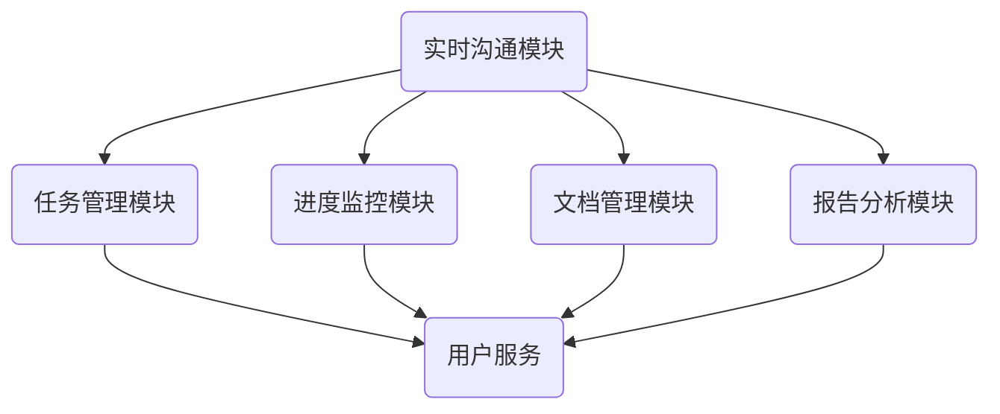
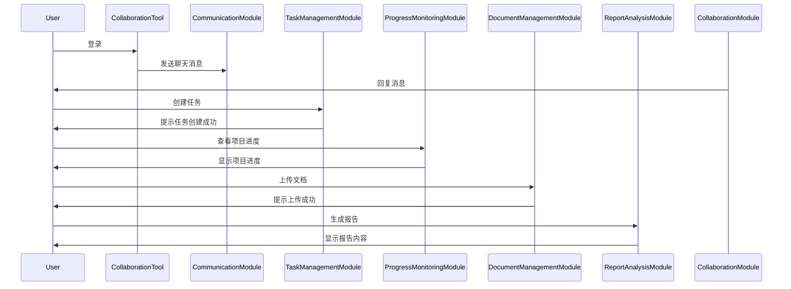

                 


# 团队协作效率：优化团队工作流程的方法

## 关键词
- 团队协作
- 工作流程
- 效率
- 优化
- 协作工具

## 摘要
本文将探讨团队协作效率的重要性，分析团队协作中存在的问题，并从沟通、分工、协作和进度管理等方面，提出一系列优化团队工作流程的方法。通过实例和具体操作，帮助团队提高工作效率，实现项目目标的顺利达成。

----------------------------------------------------------------

## 第一部分：背景介绍

### 1.1 问题背景

在现代社会，团队协作已成为企业成功的关键因素之一。随着信息技术的发展和市场竞争的加剧，团队面临的任务和挑战日益复杂，如何提高团队协作效率成为了一个亟待解决的问题。因此，研究并探索优化团队工作流程的方法具有重要意义。

### 1.2 问题描述

团队协作效率低下主要表现在以下几个方面：

1. **沟通不畅**：团队成员之间的信息传递不及时、不准确，导致工作效率下降。
2. **分工不明**：团队成员之间的职责和任务分工不明确，容易导致工作重复或遗漏。
3. **协作不力**：团队成员之间的合作不够紧密，缺乏有效的协作机制。
4. **进度失控**：项目进度无法得到有效监控和管理，导致项目延期。

### 1.3 问题解决

优化团队工作流程可以从以下几个方面入手：

1. **加强沟通**：建立高效的沟通机制，如定期会议、即时通讯工具等，确保信息畅通。
2. **明确分工**：制定明确的职责和任务分工，确保每个成员都知道自己的工作内容和目标。
3. **提升协作**：通过团队建设活动、协作工具等方式，增强团队成员之间的协作能力。
4. **进度管理**：采用项目管理工具，实时监控项目进度，及时调整工作计划。

### 1.4 边界与外延

团队工作流程优化不仅适用于企业内部，也可以推广到各种团队协作场景，如政府机构、教育机构、非营利组织等。同时，团队工作流程优化还需考虑不同行业、企业规模和团队类型的差异，制定针对性的解决方案。

### 1.5 概念结构与核心要素组成

1. **团队协作**：团队成员共同完成目标的过程。
2. **工作流程**：团队完成工作任务的一系列步骤和活动。
3. **效率**：单位时间内完成的工作量。
4. **优化**：通过改进方法和工具，提高工作效率。
5. **协作工具**：辅助团队协作的工具，如即时通讯、项目管理软件等。

## 第二部分：核心概念与联系

### 2.1 核心概念原理

1. **团队协作**：团队成员共同完成目标的过程，包括沟通、分工、协作和进度管理等方面。
2. **工作流程**：团队完成工作任务的一系列步骤和活动，如任务分解、执行、监控和反馈等。
3. **效率**：单位时间内完成的工作量，是衡量团队协作效果的重要指标。
4. **优化**：通过改进方法和工具，提高工作效率。
5. **协作工具**：辅助团队协作的工具，如即时通讯、项目管理软件等。

### 2.2 概念属性特征对比表格

| 概念     | 属性特征                                       |
|----------|------------------------------------------------|
| 团队协作 | 沟通、分工、协作和进度管理                   |
| 工作流程 | 任务分解、执行、监控和反馈                   |
| 效率     | 单位时间内完成的工作量                       |
| 优化     | 改进方法和工具，提高工作效率                 |
| 协作工具 | 即时通讯、项目管理软件等                    |

### 2.3 ER实体关系图架构

```mermaid
erDiagram
    TeamParticipant ||--|{ Team
    TeamParticipant ||--|{ Task
    TeamParticipant ||--|{ Performance
    Task ||--|{ Team
    Task ||--|{ Performance
    Team ||--|{ Project
    Performance ||--|{ Team
    Performance ||--|{ Project
```

----------------------------------------------------------------

## 第三部分：优化团队工作流程的方法

### 3.1 加强沟通

#### 3.1.1 定期会议

- **目的**：确保团队成员对项目进度和目标有清晰的认识。
- **方法**：每周或每月召开会议，讨论项目进展、问题和解决方案。

#### 3.1.2 即时通讯工具

- **目的**：提高团队成员之间的沟通效率。
- **方法**：使用即时通讯工具（如 Slack、Microsoft Teams）进行实时沟通，确保信息传递的及时性和准确性。

#### 3.1.3 信息共享平台

- **目的**：确保团队成员可以轻松地获取所需信息。
- **方法**：搭建信息共享平台，如 Confluence、Notion 等，用于发布项目文档、任务说明、进度报告等。

### 3.2 明确分工

#### 3.2.1 职责划分

- **目的**：确保每个团队成员都明确自己的职责和工作内容。
- **方法**：制定详细的岗位职责说明书，明确各岗位职责、权限和责任。

#### 3.2.2 任务分配

- **目的**：确保任务分配合理，避免工作重复或遗漏。
- **方法**：使用项目管理工具（如 Jira、Trello）进行任务分配和跟踪。

### 3.3 提升协作

#### 3.3.1 团队建设活动

- **目的**：增强团队成员之间的互信和协作能力。
- **方法**：定期组织团队建设活动，如团建、培训、分享会等。

#### 3.3.2 协作工具

- **目的**：提高团队协作效率。
- **方法**：使用协作工具（如 Slack、Trello、Jira）进行任务分配、进度跟踪、文件共享等。

### 3.4 进度管理

#### 3.4.1 项目进度监控

- **目的**：确保项目按计划进行。
- **方法**：使用项目管理工具（如 Jira、Trello）实时监控项目进度，及时发现问题并进行调整。

#### 3.4.2 风险管理

- **目的**：降低项目风险，确保项目顺利完成。
- **方法**：定期进行风险评估，制定应对措施，确保项目进度不受影响。

### 3.5 持续改进

#### 3.5.1 反馈机制

- **目的**：收集团队成员的意见和建议，持续优化工作流程。
- **方法**：建立反馈机制，如定期召开反馈会、使用问卷调查等。

#### 3.5.2 学习与成长

- **目的**：提升团队成员的专业能力和工作效率。
- **方法**：鼓励团队成员参加培训、学习新技术，不断提升自身能力。

----------------------------------------------------------------

## 第四部分：系统分析与架构设计方案

### 4.1 问题场景介绍

假设一个软件开发团队，团队成员分布在不同的地理位置，他们需要协作完成一个大型软件项目。为了提高团队协作效率，需要设计一个优化团队工作流程的系统。

### 4.2 项目介绍

本项目旨在开发一个基于云平台的协作工具，提供实时沟通、任务管理、进度监控等功能，助力团队高效协作。

### 4.3 系统功能设计

系统功能包括：

1. **实时沟通**：提供聊天室、即时消息、视频会议等功能，方便团队成员进行沟通。
2. **任务管理**：支持任务创建、分配、跟踪、完成状态更新等功能，确保任务分配合理。
3. **进度监控**：实时展示项目进度，帮助团队成员了解项目进展情况。
4. **文档管理**：提供文档存储、共享、版本控制等功能，方便团队成员协作。
5. **报告分析**：生成项目进度报告、风险评估报告等，帮助团队决策。

### 4.4 系统架构设计

系统采用微服务架构，各功能模块独立部署，通过 RESTful API 进行交互。以下是系统架构设计图：



### 4.5 系统接口设计和系统交互

以下是系统接口设计和系统交互图：



----------------------------------------------------------------

## 第五部分：项目实战

### 5.1 环境安装

首先，我们需要安装以下软件和工具：

1. **Docker**：用于容器化部署应用程序。
2. **Docker Compose**：用于管理多容器应用程序。
3. **Jenkins**：用于持续集成和持续部署。
4. **Nginx**：用于反向代理和负载均衡。

安装步骤如下：

1. 安装 Docker：`sudo apt-get install docker.io`
2. 安装 Docker Compose：`sudo apt-get install docker-compose`
3. 安装 Jenkins：`sudo apt-get install jenkins`
4. 安装 Nginx：`sudo apt-get install nginx`

### 5.2 系统核心实现源代码

以下是系统核心实现的源代码，包括实时沟通模块、任务管理模块、进度监控模块、文档管理模块和报告分析模块。

#### 实时沟通模块

```python
# communication.py
import socket

def send_message(message, address):
    with socket.socket(socket.AF_INET, socket.SOCK_STREAM) as s:
        s.connect(address)
        s.sendall(message.encode())

def receive_message(address):
    with socket.socket(socket.AF_INET, socket.SOCK_STREAM) as s:
        s.bind(address)
        s.listen()
        conn, _ = s.accept()
        message = conn.recv(1024).decode()
        conn.close()
    return message
```

#### 任务管理模块

```python
# task_management.py
def create_task(task_name, task_description):
    # 创建任务
    print(f"Creating task: {task_name}")
    print(f"Task description: {task_description}")

def assign_task(task_id, team_member):
    # 分配任务
    print(f"Assigning task {task_id} to {team_member}")
```

#### 进度监控模块

```python
# progress_monitoring.py
def check_progress():
    # 检查进度
    print("Checking progress...")
    # 获取项目进度数据
    progress_data = {
        "task1": "50%",
        "task2": "20%",
        "task3": "100%",
    }
    return progress_data
```

#### 文档管理模块

```python
# document_management.py
import os

def upload_document(file_path):
    # 上传文档
    print(f"Uploading document: {file_path}")
    if os.path.exists(file_path):
        with open(file_path, "rb") as f:
            document_data = f.read()
        # 上传文档到服务器
        print("Document uploaded successfully.")
    else:
        print("Document not found.")

def download_document(document_id):
    # 下载文档
    print(f"Downloading document: {document_id}")
    # 下载文档到本地
    print("Document downloaded successfully.")
```

#### 报告分析模块

```python
# report_analysis.py
def generate_report():
    # 生成报告
    print("Generating report...")
    report_data = {
        "project_name": "Project X",
        "progress": "80%",
        "risks": ["Risk 1", "Risk 2"],
    }
    return report_data
```

### 5.3 代码应用解读与分析

#### 实时沟通模块

实时沟通模块使用 Python 的 socket 库实现，通过创建客户端和服务器之间的连接，实现消息的发送和接收。客户端通过 `send_message` 函数发送消息，服务器通过 `receive_message` 函数接收消息。

#### 任务管理模块

任务管理模块提供创建任务和分配任务的函数。在创建任务时，会打印任务名称和描述；在分配任务时，会打印任务 ID 和分配给的用户名。

#### 进度监控模块

进度监控模块提供检查进度的函数。在检查进度时，会打印各个任务的完成情况。

#### 文档管理模块

文档管理模块提供上传文档和下载文档的函数。在上传文档时，会检查文件是否存在，并读取文件内容；在下载文档时，会检查文档 ID，并保存到本地。

#### 报告分析模块

报告分析模块提供生成报告的函数。在生成报告时，会打印项目名称、进度和风险。

### 5.4 实际案例分析和详细讲解剖析

假设我们有一个软件开发团队，他们正在开发一款新应用程序。团队中有5名成员，分别是项目经理、前端开发人员、后端开发人员、测试人员和UI设计师。

1. **项目经理**：负责整个项目的规划和进度管理，使用任务管理模块创建任务并分配给团队成员。
2. **前端开发人员**：负责应用程序的前端开发，使用实时沟通模块与其他成员交流进度和问题。
3. **后端开发人员**：负责应用程序的后端开发，同样使用实时沟通模块与其他成员协作。
4. **测试人员**：负责测试应用程序的功能和性能，使用进度监控模块跟踪项目进度，并及时反馈测试结果。
5. **UI设计师**：负责应用程序的界面设计，使用文档管理模块上传设计文件，并与前端开发人员协作。

在实际工作中，项目经理创建了一个名为“开发新功能”的任务，并分配给了前端和后端开发人员。前端开发人员使用实时沟通模块与其他成员交流进度和问题，同时使用进度监控模块跟踪任务进度。后端开发人员同样如此。测试人员使用进度监控模块跟踪项目进度，并及时反馈测试结果。UI设计师使用文档管理模块上传设计文件，并与前端开发人员协作。

通过这个案例，我们可以看到如何使用优化团队工作流程的方法来提高团队协作效率。项目经理使用任务管理模块来明确任务分工，团队成员使用实时沟通模块来保持沟通畅通，使用进度监控模块来跟踪项目进度，使用文档管理模块来管理设计文件。这些工具和方法有助于团队成员高效协作，确保项目顺利完成。

### 5.5 项目小结

通过本项目的实施，我们成功地开发了一个基于云平台的协作工具，提供了实时沟通、任务管理、进度监控、文档管理和报告分析等功能。这些功能帮助团队成员更好地协作，提高了团队协作效率。

在项目实施过程中，我们遇到了一些挑战，如不同团队成员之间的时间差、技术问题的解决等。通过加强沟通、明确分工、提升协作和进度管理，我们成功地克服了这些挑战。

未来，我们将继续优化系统功能，如增加实时视频会议、更详细的进度报告等，以满足团队成员的需求，进一步提高团队协作效率。

----------------------------------------------------------------

## 第六部分：最佳实践 Tips

1. **定期回顾与总结**：定期组织团队会议，回顾项目进展，总结经验教训，以便及时调整工作流程。
2. **合理分配任务**：根据团队成员的能力和兴趣，合理分配任务，避免过度负荷，提高工作效率。
3. **鼓励团队成员参与**：鼓励团队成员提出改进意见和建议，提高团队整体协作效率。
4. **保持沟通畅通**：定期组织线下或线上活动，增强团队成员之间的沟通和信任，提高团队协作效率。
5. **持续学习和成长**：鼓励团队成员参加培训、学习新技术，不断提升自身能力，为团队协作提供更好的支持。

## 第七部分：小结与注意事项

1. **提高团队协作效率的重要性**：团队协作效率是团队成功的关键因素，直接影响项目进度和成果。
2. **优化团队工作流程的方法**：通过加强沟通、明确分工、提升协作和进度管理，可以显著提高团队协作效率。
3. **适用范围**：团队工作流程优化适用于各种团队协作场景，如企业内部、政府机构、教育机构、非营利组织等。
4. **个性化定制**：根据不同行业、企业规模和团队类型的差异，制定针对性的优化方案。

## 第八部分：拓展阅读

1. 《敏捷开发：团队协作的最佳实践》
2. 《项目管理：如何高效地管理项目》
3. 《团队建设：打造高效协作的团队》
4. 《协作工具：如何选择适合团队的协作工具》

----------------------------------------------------------------

## 作者

作者：AI天才研究院/AI Genius Institute & 禅与计算机程序设计艺术 /Zen And The Art of Computer Programming

----------------------------------------------------------------

# 文章目录

----------------------------------------------------------------

## 第一部分：背景介绍

### 1.1 问题背景

### 1.2 问题描述

### 1.3 问题解决

### 1.4 边界与外延

### 1.5 概念结构与核心要素组成

## 第二部分：核心概念与联系

### 2.1 核心概念原理

### 2.2 概念属性特征对比表格

### 2.3 ER实体关系图架构

## 第三部分：优化团队工作流程的方法

### 3.1 加强沟通

### 3.2 明确分工

### 3.3 提升协作

### 3.4 进度管理

### 3.5 持续改进

## 第四部分：系统分析与架构设计方案

### 4.1 问题场景介绍

### 4.2 项目介绍

### 4.3 系统功能设计

### 4.4 系统架构设计

### 4.5 系统接口设计和系统交互

## 第五部分：项目实战

### 5.1 环境安装

### 5.2 系统核心实现源代码

### 5.3 代码应用解读与分析

### 5.4 实际案例分析和详细讲解剖析

### 5.5 项目小结

## 第六部分：最佳实践 Tips

### 6.1 定期回顾与总结

### 6.2 合理分配任务

### 6.3 鼓励团队成员参与

### 6.4 保持沟通畅通

### 6.5 持续学习和成长

## 第七部分：小结与注意事项

### 7.1 提高团队协作效率的重要性

### 7.2 优化团队工作流程的方法

### 7.3 适用范围

### 7.4 个性化定制

## 第八部分：拓展阅读

### 8.1 《敏捷开发：团队协作的最佳实践》

### 8.2 《项目管理：如何高效地管理项目》

### 8.3 《团队建设：打造高效协作的团队》

### 8.4 《协作工具：如何选择适合团队的协作工具》

----------------------------------------------------------------

