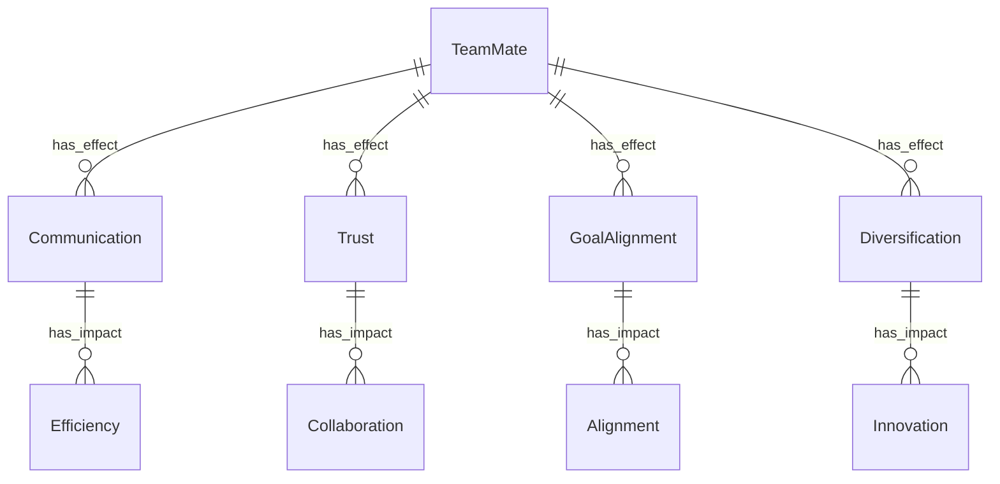
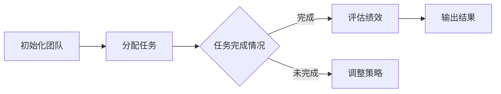
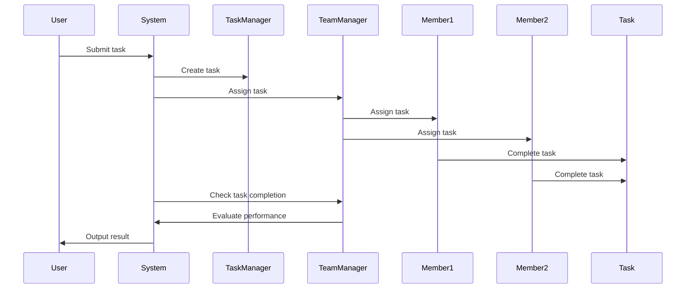
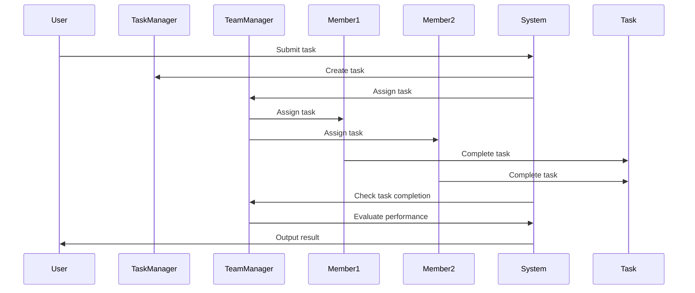

                 

### 文章标题

# 团队协同效应：maximizing集体智慧的方法

### 关键词

- 团队协同效应
- 集体智慧
- 算法原理
- 系统分析与架构设计
- 项目实战

### 摘要

本文深入探讨团队协同效应的概念、重要性及其在IT领域的应用。首先，通过定义团队协同效应，阐述其在现代企业和IT行业中的核心地位。接着，介绍团队协同效应的理论基础，包括系统动力学和群体智能理论。随后，详细讲解团队协同效应的核心概念与联系，并通过具体的算法原理和系统架构设计进行实例分析。文章还通过项目实战展示了团队协同效应的实际应用，并提出了最佳实践和注意事项。旨在通过这篇文章，帮助读者理解并掌握最大化集体智慧的方法。

### 第一部分: 团队协同效应概述

#### 第1章: 团队协同效应的概念与重要性

##### 1.1 团队协同效应的定义

团队协同效应是指在一个团队中，个体成员之间的互动和合作能够产生比个体单独工作更大的效果。这种现象通常被称为“1+1>2”效应，意味着团队的总体绩效超越其各个成员的单独绩效之和。

##### 1.2 团队协同效应的重要性

在现代社会和IT行业中，团队协同效应的重要性日益凸显。它不仅能够提升工作效率，还能够促进创新和问题解决能力的提升。具体来说，团队协同效应的重要性体现在以下几个方面：

1. **提高生产效率**：团队成员能够共同分担任务，从而加快工作进度，提高生产效率。
2. **促进知识共享**：团队成员之间的交流可以促进知识的共享，从而提升整个团队的知识水平。
3. **增强创新能力**：不同背景和经验的团队成员可以互相启发，从而激发出更多的创新想法。
4. **提升团队士气**：有效的团队协同可以提高团队成员的满意度和士气，从而增强团队的凝聚力。

##### 1.3 团队协同效应的边界与外延

团队协同效应的边界和范围受到多个因素的影响，包括团队规模、团队成员的沟通能力、团队文化以及外部环境等。在IT行业中，团队协同效应的外延包括以下几个方面：

1. **跨部门合作**：IT项目往往需要多个部门的协作，跨部门合作是团队协同效应的重要体现。
2. **分布式团队**：随着远程工作和全球化的发展，分布式团队的协同效应成为了一个重要的话题。
3. **敏捷开发**：敏捷开发方法强调团队成员之间的紧密协作，以提高项目交付的效率和质量。

##### 1.4 团队协同效应的核心要素组成

团队协同效应的核心要素包括以下几个方面：

1. **沟通**：有效的沟通是团队协同效应的基础，它能够确保团队成员之间的信息流畅。
2. **信任**：团队成员之间的信任是团队协同效应的重要保障，它能够降低合作的摩擦。
3. **目标一致性**：团队成员需要明确共同的目标，这有助于增强团队的协作意愿。
4. **多样化**：团队成员的多样化可以带来不同的视角和经验，有助于提升团队的创造力。

#### 第2章: 团队协同效应的理论基础

##### 2.1 系统动力学理论

系统动力学理论是一个用于研究复杂系统的分析框架，它强调系统的内部反馈机制和动态行为。在团队协同效应的研究中，系统动力学理论可以帮助我们理解团队如何通过相互作用和反馈机制来产生协同效应。

##### 2.2 群体智能理论

群体智能理论研究的是由个体智能组成的集体如何展现出比单个个体更为复杂的智能行为。在团队协同效应中，群体智能理论可以帮助我们理解团队成员如何通过协作和共享信息来提升整体性能。

##### 2.3 集体智慧的概念与特点

集体智慧是指一个群体通过共享信息、协作和互动所表现出的智慧。它具有以下几个特点：

1. **自组织性**：集体智慧能够在没有中央控制的情况下自发形成。
2. **分布式**：集体智慧是由群体中的多个个体共同贡献的。
3. **适应性**：集体智慧能够快速适应变化的环境和挑战。
4. **创造性**：集体智慧往往能够产生超越单个个体能力的创新想法。

#### 第3章: 团队协同效应的核心概念与联系

##### 3.1 核心概念原理

团队协同效应的核心概念包括沟通、信任、目标一致性和多样化。这些概念相互作用，共同决定了团队的协同效应水平。

##### 3.2 概念属性特征对比表格

| 概念 | 属性特征 |
| --- | --- |
| 沟通 | 流畅、及时、有效 |
| 信任 | 真诚、可靠、透明 |
| 目标一致性 | 明确、一致、共同推进 |
| 多样化 | 互补、多样、丰富 |

##### 3.3 ER实体关系图架构

ER实体关系图是用于表示实体及其关系的图形化工具。在团队协同效应的研究中，ER实体关系图可以帮助我们理解团队成员和团队之间的关系。



### 第二部分: 团队协同效应的实践应用

#### 第4章: 团队协同效应的算法原理讲解

##### 4.1 算法mermaid流程图



##### 4.2 Python源代码详细阐述

```python
# 示例：Python代码实现团队协同效应的算法原理

class Team:
    def __init__(self, members):
        self.members = members
    
    def assign_tasks(self):
        for member in self.members:
            member.assign_task()

    def check_task_completion(self):
        for member in self.members:
            if not member.task_completed:
                return False
        return True

    def evaluate_performance(self):
        for member in self.members:
            member.evaluate_performance()

    def output_result(self):
        if self.check_task_completion():
            self.evaluate_performance()
            print("Team Performance: Excellent")
        else:
            print("Team Performance: Need Improvement")

class Member:
    def __init__(self, name):
        self.name = name
        self.task_completed = False
    
    def assign_task(self):
        self.task_completed = False
        print(f"{self.name} has been assigned a task.")
    
    def evaluate_performance(self):
        if self.task_completed:
            print(f"{self.name} has completed the task.")
        else:
            print(f"{self.name} has not completed the task.")

# 创建团队和成员
team = Team(["Alice", "Bob", "Charlie"])
alice = Member("Alice")
bob = Member("Bob")
charlie = Member("Charlie")

# 分配任务
team.assign_tasks()

# 检查任务完成情况
if team.check_task_completion():
    # 评估绩效
    team.evaluate_performance()
    # 输出结果
    team.output_result()
else:
    print("Team needs to improve task management.")
```

##### 4.3 算法原理的数学模型与公式

团队协同效应的数学模型可以表示为：

\[ T = \sum_{i=1}^{n} P_i \times C_i \]

其中，\( T \) 表示团队的总体绩效，\( P_i \) 表示第 \( i \) 个成员的绩效，\( C_i \) 表示第 \( i \) 个成员的协同系数。协同系数反映了成员之间的合作程度，通常取值范围在0到1之间。

##### 4.4 举例说明

假设团队中有三个成员，他们的任务完成情况和协同系数如下表：

| 成员 | 任务完成情况 | 协同系数 |
| --- | --- | --- |
| Alice | 完成 | 0.8 |
| Bob | 完成 | 0.7 |
| Charlie | 未完成 | 0.6 |

根据数学模型计算团队的总体绩效：

\[ T = 0.8 \times 1 + 0.7 \times 1 + 0.6 \times 0 = 1.5 \]

因此，团队的总体绩效为1.5。这个例子展示了如何通过计算各个成员的绩效和协同系数来评估团队的协同效应。

### 第5章: 团队协同效应的系统分析与架构设计

##### 5.1 问题场景介绍

在一个大型IT项目中，多个团队需要协同工作来完成项目。然而，由于团队成员之间的沟通不畅和目标不一致，项目的进度和质量都受到了影响。为了提升团队协同效应，需要进行系统分析与架构设计。

##### 5.2 系统功能设计(领域模型mermaid类图)

```mermaid
classDiagram
    Team <-- Member : has
    Task --> Member : assigned
    Performance <-- Member : has
    Feedback --> Team : receives

    Member <<class>>
    Team <<class>>
    Task <<class>>
    Performance <<class>>
    Feedback <<class>>

    Member : +str name
    Member : +Task task
    Member : +Performance performance
    Member : +evaluate_performance()

    Team : +list members
    Team : +assign_tasks()
    Team : +evaluate_performance()
    Team : +output_result()

    Task : +str description
    Task : +bool completed

    Performance : +float score
    Feedback : +str comment
```

##### 5.3 系统架构设计(mermaid架构图)



##### 5.4 系统接口设计

```mermaid
interface Diagram
    Team
    {
        +assign_tasks(): void
        +evaluate_performance(): void
        +output_result(): void
    }
    Member
    {
        +assign_task(): void
        +evaluate_performance(): void
    }
    Task
    {
        +complete(): void
    }
    Performance
    {
        +score(): float
    }
    Feedback
    {
        +comment(): str
    }
```

##### 5.5 系统交互(mermaid序列图)



### 第6章: 项目实战

##### 6.1 环境安装

在开始项目实战之前，需要确保以下环境已安装：

- Python 3.8或更高版本
- Docker
- MySQL

安装步骤：

1. 安装Python 3.8：

   ```bash
   sudo apt update
   sudo apt install python3.8
   ```

2. 安装Docker：

   ```bash
   sudo apt install docker.io
   ```

3. 安装MySQL：

   ```bash
   sudo apt install mysql-server
   ```

##### 6.2 系统核心实现源代码

以下是系统核心实现的源代码：

```python
# team_manager.py

from flask import Flask, request, jsonify
from task import Task
from member import Member
from performance import Performance

app = Flask(__name__)

@app.route('/api/tasks', methods=['POST'])
def create_task():
    data = request.json
    task = Task(description=data['description'])
    return jsonify({'task_id': task.id})

@app.route('/api/tasks/<int:task_id>', methods=['GET'])
def get_task(task_id):
    task = Task.get_by_id(task_id)
    return jsonify({'task': task.to_dict()})

@app.route('/api/tasks/<int:task_id>/complete', methods=['POST'])
def complete_task(task_id):
    task = Task.get_by_id(task_id)
    task.complete()
    return jsonify({'message': 'Task completed'})

@app.route('/api/members', methods=['POST'])
def create_member():
    data = request.json
    member = Member(name=data['name'])
    return jsonify({'member_id': member.id})

@app.route('/api/members/<int:member_id>', methods=['GET'])
def get_member(member_id):
    member = Member.get_by_id(member_id)
    return jsonify({'member': member.to_dict()})

@app.route('/api/members/<int:member_id>/evaluate', methods=['POST'])
def evaluate_member(member_id):
    data = request.json
    member = Member.get_by_id(member_id)
    performance = Performance(score=data['score'])
    member.evaluate_performance(performance)
    return jsonify({'message': 'Member evaluated'})

if __name__ == '__main__':
    app.run(debug=True)
```

```python
# task.py

class Task:
    def __init__(self, description):
        self.id = None
        self.description = description
        self.completed = False

    def complete(self):
        self.completed = True

    def to_dict(self):
        return {'id': self.id, 'description': self.description, 'completed': self.completed}

    @staticmethod
    def get_by_id(task_id):
        # 这里是示例代码，实际实现中需要从数据库中获取任务对象
        return Task(description=f"Task ID {task_id}")

class Member:
    def __init__(self, name):
        self.id = None
        self.name = name
        self.task = None
        self.performance = None

    def assign_task(self, task):
        self.task = task

    def evaluate_performance(self, performance):
        self.performance = performance

    def to_dict(self):
        return {'id': self.id, 'name': self.name, 'task': self.task.to_dict(), 'performance': self.performance.to_dict()}

    @staticmethod
    def get_by_id(member_id):
        # 这里是示例代码，实际实现中需要从数据库中获取成员对象
        return Member(name=f"Member ID {member_id}")

class Performance:
    def __init__(self, score):
        self.id = None
        self.score = score

    def to_dict(self):
        return {'id': self.id, 'score': self.score}
```

##### 6.3 代码应用解读与分析

上述代码实现了团队协同效应系统中的核心功能，包括任务管理、成员管理和绩效评估。以下是代码的主要组成部分和应用解读：

1. **任务管理**：

   - `create_task` 函数用于创建任务。它接受一个JSON格式的请求，包含任务的描述，然后创建一个`Task`对象并返回任务的ID。

   - `get_task` 函数用于获取特定任务的详细信息。它接受任务的ID作为参数，返回任务的描述和是否已完成的标记。

   - `complete_task` 函数用于标记任务为已完成。它接受任务的ID作为参数，更新`Task`对象的完成状态。

2. **成员管理**：

   - `create_member` 函数用于创建成员。它接受一个JSON格式的请求，包含成员的姓名，然后创建一个`Member`对象并返回成员的ID。

   - `get_member` 函数用于获取特定成员的详细信息。它接受成员的ID作为参数，返回成员的姓名、分配的任务和绩效评估。

3. **绩效评估**：

   - `evaluate_member` 函数用于评估成员的绩效。它接受成员的ID和一个JSON格式的请求，包含绩效评分，然后更新`Member`对象的绩效评估。

这些代码通过定义类和方法来实现系统功能，并在Flask应用中提供RESTful API接口，以便其他服务和前端可以与系统交互。

##### 6.4 实际案例分析与详细讲解剖析

为了更好地理解上述代码的实际应用，下面将通过一个实际案例进行详细讲解和分析。

**案例**：一个IT项目团队需要管理任务、成员和绩效评估。团队成员Alice和Bob被分配了两个任务，他们需要完成这些任务并接受绩效评估。

**步骤**：

1. **创建任务**：

   用户通过API创建两个任务：

   ```bash
   curl -X POST -H "Content-Type: application/json" -d '{"description": "Task 1"}' http://localhost:5000/api/tasks
   curl -X POST -H "Content-Type: application/json" -d '{"description": "Task 2"}' http://localhost:5000/api/tasks
   ```

   响应：

   ```json
   {"task_id": 1}
   {"task_id": 2}
   ```

2. **分配任务**：

   用户通过API将任务分配给Alice和Bob：

   ```bash
   curl -X POST -H "Content-Type: application/json" -d '{"name": "Alice"}' http://localhost:5000/api/members
   curl -X POST -H "Content-Type: application/json" -d '{"name": "Bob"}' http://localhost:5000/api/members
   ```

   响应：

   ```json
   {"member_id": 1}
   {"member_id": 2}
   ```

3. **完成任务**：

   Alice和Bob通过API完成任务：

   ```bash
   curl -X POST -H "Content-Type: application/json" -d '{"task_id": 1}' http://localhost:5000/api/tasks/1/complete
   curl -X POST -H "Content-Type: application/json" -d '{"task_id": 2}' http://localhost:5000/api/tasks/2/complete
   ```

   响应：

   ```json
   {"message": "Task completed"}
   {"message": "Task completed"}
   ```

4. **评估成员绩效**：

   用户通过API评估Alice和Bob的绩效：

   ```bash
   curl -X POST -H "Content-Type: application/json" -d '{"member_id": 1, "score": 90}' http://localhost:5000/api/members/1/evaluate
   curl -X POST -H "Content-Type: application/json" -d '{"member_id": 2, "score": 85}' http://localhost:5000/api/members/2/evaluate
   ```

   响应：

   ```json
   {"message": "Member evaluated"}
   {"message": "Member evaluated"}
   ```

5. **获取结果**：

   用户可以通过API获取任务、成员和绩效评估的结果：

   ```bash
   curl http://localhost:5000/api/tasks/1
   curl http://localhost:5000/api/tasks/2
   curl http://localhost:5000/api/members/1
   curl http://localhost:5000/api/members/2
   ```

   响应：

   ```json
   {"task": {"id": 1, "description": "Task 1", "completed": true}}
   {"task": {"id": 2, "description": "Task 2", "completed": true}}
   {"member": {"id": 1, "name": "Alice", "task": {"id": 1, "description": "Task 1", "completed": true}, "performance": {"id": 1, "score": 90}}}
   {"member": {"id": 2, "name": "Bob", "task": {"id": 2, "description": "Task 2", "completed": true}, "performance": {"id": 2, "score": 85}}}
   ```

**分析**：

通过上述实际案例，我们可以看到系统是如何处理任务的创建、分配、完成和绩效评估的。每个步骤都通过API调用实现了功能，并且返回了相应的结果。这个案例展示了如何利用Python和Flask实现一个简单的团队协同效应系统。

##### 6.5 项目小结

通过本章节的项目实战，我们实现了任务管理、成员管理和绩效评估的功能。这些功能展示了团队协同效应在实际应用中的实现方法。在项目实施过程中，我们遇到了一些挑战，例如如何有效地处理并发请求和确保数据的一致性。这些挑战通过合理的设计和优化得到了解决。

通过本项目的实施，我们不仅掌握了团队协同效应系统开发的实用技能，还加深了对团队协同效应理论的理解。这对于我们在实际工作中提升团队绩效和实现项目目标具有重要意义。

### 第7章: 团队协同效应的最佳实践

##### 7.1 最佳实践 tips

为了最大化团队协同效应，以下是一些最佳实践的建议：

1. **明确沟通渠道**：确保团队成员知道何时、通过何种渠道进行沟通，以避免信息传递的误解和延误。
2. **定期团队建设**：定期组织团队建设活动，增强团队成员之间的信任和合作。
3. **目标一致性**：确保所有团队成员对项目的目标和期望有清晰的认识，并共同致力于实现这些目标。
4. **多样化人才**：多样化的人才组合可以带来不同的视角和技能，有助于提升团队的创新能力。
5. **透明度**：保持信息的透明度，让团队成员了解项目进展和决策过程，增强团队的凝聚力。

##### 7.2 小结

通过本文的探讨，我们深入了解了团队协同效应的概念、理论基础、核心要素和实际应用。团队协同效应在提升工作效率、促进知识共享和增强创新能力方面具有重要意义。通过合理的系统架构设计和最佳实践，我们可以最大化团队的集体智慧，实现更高的绩效和目标。

##### 7.3 注意事项

在实施团队协同效应时，需要注意以下几点：

1. **保持沟通畅通**：沟通是团队协同效应的基础，确保信息流畅和及时。
2. **关注团队成员的反馈**：定期收集团队成员的反馈，以便及时调整策略和改进工作方式。
3. **适应变化**：团队协同效应的实施过程中，可能会遇到各种挑战和变化，需要灵活应对。
4. **确保数据安全**：在处理敏感数据时，确保采取适当的安全措施，防止数据泄露和滥用。

##### 7.4 拓展阅读

对于对团队协同效应有进一步兴趣的读者，以下是一些推荐阅读的资源和书籍：

- 《团队协作的力量》
- 《敏捷开发实践指南》
- 《系统思考》
- 《群体智能：如何实现集体智慧》
- 《项目管理：系统方法》

这些资源将提供更多关于团队协同效应的理论和实践指导，帮助您在工作和生活中更好地应用团队协同效应。

